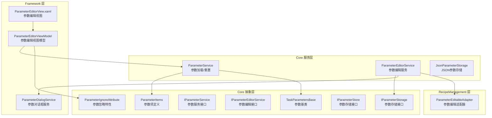
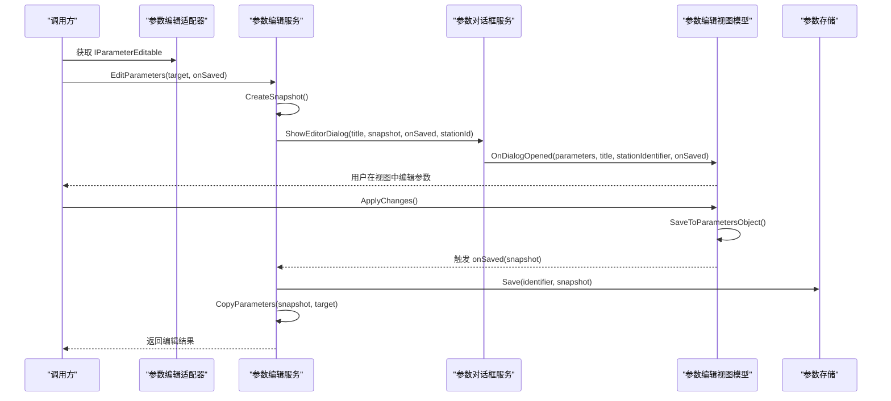
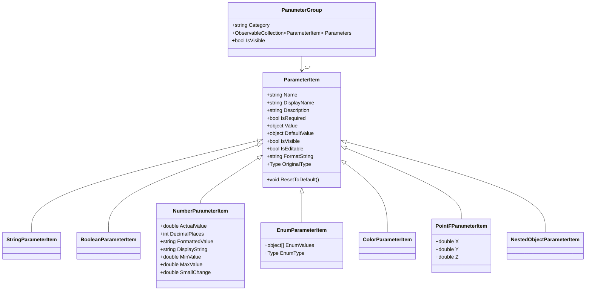
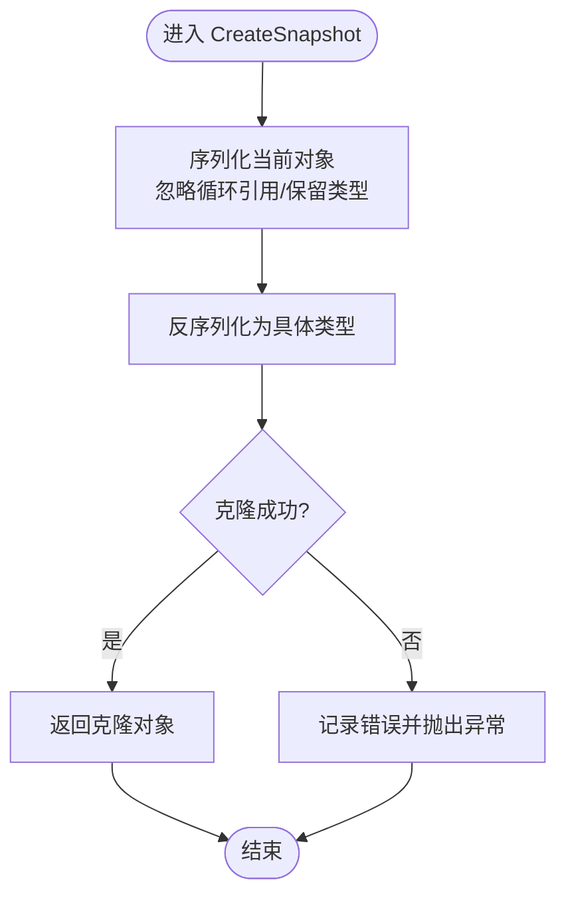
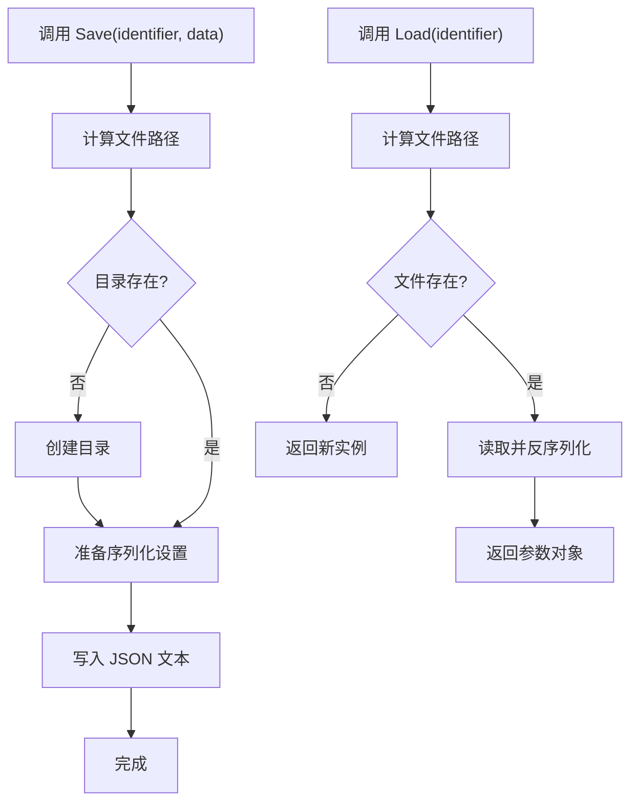
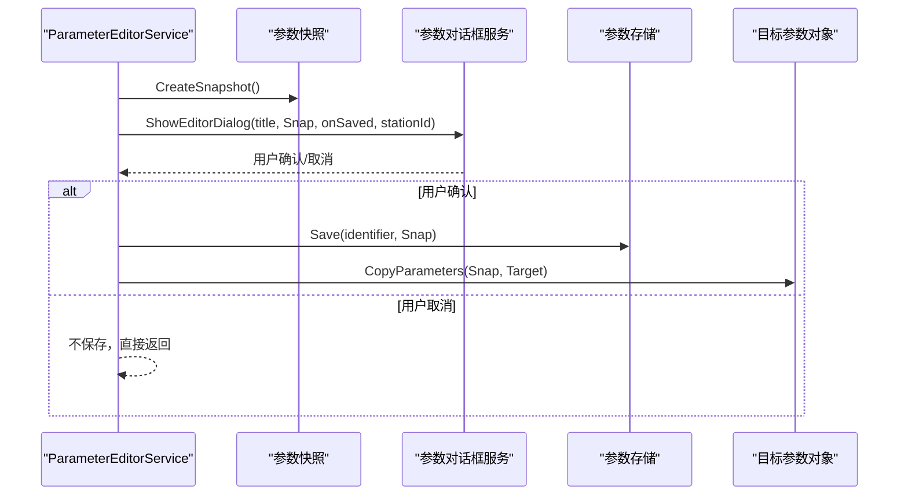
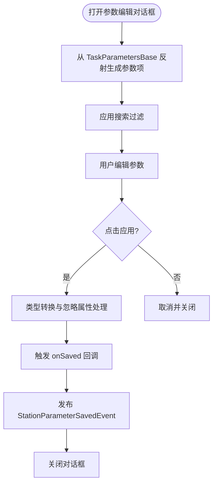
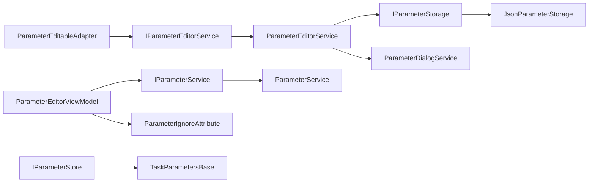

# 参数服务

<cite>
**本文引用的文件**
- [ParameterItems.cs](file://Core/Abstraction/Parameters/ParameterItems.cs)
- [TaskParametersBase.cs](file://Core/Abstraction/Parameters/TaskParametersBase.cs)
- [JsonParameterStorage.cs](file://Core/Services/JsonParameterStorage.cs)
- [ParameterService.cs](file://Core/Services/ParameterService.cs)
- [ParameterEditorService.cs](file://Core/Services/ParameterEditorService.cs)
- [IParameterService.cs](file://Core/Abstraction/IParameterService.cs)
- [IParameterEditorService.cs](file://Core/Abstraction/IParameterEditorService.cs)
- [IParameterStorage.cs](file://Core/Abstraction/IParameterStorage.cs)
- [IParameterStore.cs](file://Core/Abstraction/IParameterStore.cs)
- [ParameterIgnoreAttribute.cs](file://Core/Abstraction/ParameterIgnoreAttribute.cs)
- [ParameterEditorViewModel.cs](file://Framework/ViewModels/ParameterEditorViewModel.cs)
- [ParameterEditorView.xaml](file://Framework/Views/ParameterEditorView.xaml)
- [ParameterDialogService.cs](file://Framework/Services/ParameterDialogService.cs)
- [ParameterEditableAdapter.cs](file://RecipeManagement/ParameterEditableAdapter.cs)
</cite>

## 目录
1. [简介](#简介)
2. [项目结构](#项目结构)
3. [核心组件](#核心组件)
4. [架构总览](#架构总览)
5. [详细组件分析](#详细组件分析)
6. [依赖关系分析](#依赖关系分析)
7. [性能考虑](#性能考虑)
8. [故障排查指南](#故障排查指南)
9. [结论](#结论)
10. [附录](#附录)

## 简介
本文件系统性梳理参数服务的设计与实现，围绕以下目标展开：参数的定义与集合管理、参数基类设计、JSON参数存储、参数编辑流程、参数验证与版本控制、参数导入导出与同步机制。重点解读 ParameterService 与 ParameterEditorService 的职责边界与协作方式；阐明 ParameterItems 的参数项体系、TaskParametersBase 的参数基类能力；解释 IParameterService、IParameterEditorService、IParameterStorage、IParameterStore 接口的抽象设计；说明 ParameterIgnoreAttribute 的参数忽略机制；并提供参数定义、编辑器使用、存储与加载 API 的调用示例与最佳实践。

## 项目结构
参数服务相关代码主要分布在 Core 抽象层与 Core 服务层，以及 Framework 层的参数编辑界面与对话框服务，RecipeManagement 提供参数编辑适配器以对接配方服务。

图表来源
- [ParameterItems.cs:1-374](file://Core/Abstraction/Parameters/ParameterItems.cs#L1-L374)
- [TaskParametersBase.cs:1-144](file://Core/Abstraction/Parameters/TaskParametersBase.cs#L1-L144)
- [IParameterService.cs:1-24](file://Core/Abstraction/IParameterService.cs#L1-L24)
- [IParameterEditorService.cs:1-21](file://Core/Abstraction/IParameterEditorService.cs#L1-L21)
- [IParameterStorage.cs:1-18](file://Core/Abstraction/IParameterStorage.cs#L1-L18)
- [IParameterStore.cs:1-31](file://Core/Abstraction/IParameterStore.cs#L1-L31)
- [ParameterIgnoreAttribute.cs:1-14](file://Core/Abstraction/ParameterIgnoreAttribute.cs#L1-L14)
- [ParameterService.cs:1-86](file://Core/Services/ParameterService.cs#L1-L86)
- [ParameterEditorService.cs:1-56](file://Core/Services/ParameterEditorService.cs#L1-L56)
- [JsonParameterStorage.cs:1-86](file://Core/Services/JsonParameterStorage.cs#L1-L86)
- [ParameterEditorViewModel.cs:1-511](file://Framework/ViewModels/ParameterEditorViewModel.cs#L1-L511)
- [ParameterEditorView.xaml:1-353](file://Framework/Views/ParameterEditorView.xaml#L1-L353)
- [ParameterDialogService.cs:1-49](file://Framework/Services/ParameterDialogService.cs#L1-L49)
- [ParameterEditableAdapter.cs:1-23](file://RecipeManagement/ParameterEditableAdapter.cs#L1-L23)

章节来源
- [ParameterItems.cs:1-374](file://Core/Abstraction/Parameters/ParameterItems.cs#L1-L374)
- [TaskParametersBase.cs:1-144](file://Core/Abstraction/Parameters/TaskParametersBase.cs#L1-L144)
- [IParameterService.cs:1-24](file://Core/Abstraction/IParameterService.cs#L1-L24)
- [IParameterEditorService.cs:1-21](file://Core/Abstraction/IParameterEditorService.cs#L1-L21)
- [IParameterStorage.cs:1-18](file://Core/Abstraction/IParameterStorage.cs#L1-L18)
- [IParameterStore.cs:1-31](file://Core/Abstraction/IParameterStore.cs#L1-L31)
- [ParameterIgnoreAttribute.cs:1-14](file://Core/Abstraction/ParameterIgnoreAttribute.cs#L1-L14)
- [ParameterService.cs:1-86](file://Core/Services/ParameterService.cs#L1-L86)
- [ParameterEditorService.cs:1-56](file://Core/Services/ParameterEditorService.cs#L1-L56)
- [JsonParameterStorage.cs:1-86](file://Core/Services/JsonParameterStorage.cs#L1-L86)
- [ParameterEditorViewModel.cs:1-511](file://Framework/ViewModels/ParameterEditorViewModel.cs#L1-L511)
- [ParameterEditorView.xaml:1-353](file://Framework/Views/ParameterEditorView.xaml#L1-L353)
- [ParameterDialogService.cs:1-49](file://Framework/Services/ParameterDialogService.cs#L1-L49)
- [ParameterEditableAdapter.cs:1-23](file://RecipeManagement/ParameterEditableAdapter.cs#L1-L23)

## 核心组件
- 参数项体系（ParameterItems）
  - ParameterGroup：参数分组容器，包含 Category 与参数集合，并支持可见性控制。
  - ParameterItem 抽象基类：统一 Name、DisplayName、Description、IsRequired、Value、DefaultValue、IsVisible、IsEditable、FormatString、OriginalType 等属性；支持嵌套对象与默认值重置。
  - 具体参数类型：StringParameterItem、BooleanParameterItem、NumberParameterItem（含小数位、范围、格式化显示）、EnumParameterItem（枚举值集合与类型）、ColorParameterItem（颜色/画刷转换）、PointFParameterItem（三维点坐标）。
- 参数基类（TaskParametersBase）
  - 实现 IParameterStore，提供 Identifier、ConfigVersion、LastModified、TaskName、TaskId、Priority 等元数据。
  - 提供 CreateSnapshot 深拷贝能力，用于编辑前快照与回滚。
  - 内置 Validate 与 IsValid，支持派生类扩展校验规则。
- 参数存储（JsonParameterStorage）
  - 实现 IParameterStorage，提供基于 JSON 的参数持久化，默认目录为程序基目录下的 Config/Parameters。
  - 支持泛型 Load/Save 与自定义目录重载。
- 参数服务（ParameterService）
  - 实现 IParameterService，提供参数分组加载、保存、重置为默认值的异步接口。
  - 示例参数分组包含基础设置与高级选项两类。
- 参数编辑服务（ParameterEditorService）
  - 实现 IParameterEditor，负责参数编辑对话框展示、保存、应用变更与参数复制。
  - 通过反射遍历源对象属性，生成 ParameterGroup/ParameterItem 并填充编辑视图。
- 参数编辑视图模型与视图（ParameterEditorViewModel/ParameterEditorView）
  - ParameterEditorViewModel：加载参数、搜索过滤、应用/取消/重置、类型转换、忽略属性处理、保存回调触发与事件发布。
  - ParameterEditorView：基于模板选择器渲染不同类型的参数编辑器（文本、复选框、滑块+数值框、枚举、颜色）。
- 参数对话框服务（ParameterDialogService）
  - 基于 Prism 对话框框架，封装参数编辑对话框的打开与结果回调。
- 参数忽略特性（ParameterIgnoreAttribute）
  - 通过特性标记跳过特定属性的编辑与保存。
- 参数编辑适配器（ParameterEditableAdapter）
  - 将 RecipeService 适配为 IParameterEditable，暴露 EditTitle、Identifier、Parameters 供编辑服务使用。

章节来源
- [ParameterItems.cs:1-374](file://Core/Abstraction/Parameters/ParameterItems.cs#L1-L374)
- [TaskParametersBase.cs:1-144](file://Core/Abstraction/Parameters/TaskParametersBase.cs#L1-L144)
- [JsonParameterStorage.cs:1-86](file://Core/Services/JsonParameterStorage.cs#L1-L86)
- [ParameterService.cs:1-86](file://Core/Services/ParameterService.cs#L1-L86)
- [ParameterEditorService.cs:1-56](file://Core/Services/ParameterEditorService.cs#L1-L56)
- [ParameterEditorViewModel.cs:1-511](file://Framework/ViewModels/ParameterEditorViewModel.cs#L1-L511)
- [ParameterEditorView.xaml:1-353](file://Framework/Views/ParameterEditorView.xaml#L1-L353)
- [ParameterDialogService.cs:1-49](file://Framework/Services/ParameterDialogService.cs#L1-L49)
- [ParameterIgnoreAttribute.cs:1-14](file://Core/Abstraction/ParameterIgnoreAttribute.cs#L1-L14)
- [ParameterEditableAdapter.cs:1-23](file://RecipeManagement/ParameterEditableAdapter.cs#L1-L23)

## 架构总览
参数服务采用“接口抽象 + 服务实现 + 视图绑定”的分层设计，参数定义与编辑解耦，存储独立，编辑流程通过对话框服务统一调度。

图表来源
- [ParameterEditorService.cs:1-56](file://Core/Services/ParameterEditorService.cs#L1-L56)
- [ParameterDialogService.cs:1-49](file://Framework/Services/ParameterDialogService.cs#L1-L49)
- [ParameterEditorViewModel.cs:1-511](file://Framework/ViewModels/ParameterEditorViewModel.cs#L1-L511)
- [JsonParameterStorage.cs:1-86](file://Core/Services/JsonParameterStorage.cs#L1-L86)
- [ParameterEditableAdapter.cs:1-23](file://RecipeManagement/ParameterEditableAdapter.cs#L1-L23)

## 详细组件分析

### 参数项与参数集合（ParameterItems 与 ParameterGroup）
- 设计要点
  - ParameterGroup：按 Category 组织参数集合，支持 IsVisible 控制分组显示。
  - ParameterItem：统一的参数抽象，支持默认值重置、格式化显示、嵌套对象标记。
  - 具体类型覆盖常用场景：字符串、布尔、数值（范围、小数位、格式化）、枚举、颜色、三维点。
- 关键行为
  - NumberParameterItem：ActualValue 统一为 double 存储，MinValue/MaxValue 限定范围，DecimalPlaces 控制小数位与步长，FormattedValue/DisplayString 提供格式化展示。
  - EnumParameterItem：维护 EnumValues 与 EnumType，便于 UI 下拉选择。
  - NestedObjectParameterItem：用于承载复杂对象的子参数集合。
- 复杂度与性能
  - 参数项创建与绑定：O(n) 遍历属性生成参数项。
  - 数值参数的格式化与范围约束：常数时间操作，开销极低。

图表来源
- [ParameterItems.cs:1-374](file://Core/Abstraction/Parameters/ParameterItems.cs#L1-L374)

章节来源
- [ParameterItems.cs:1-374](file://Core/Abstraction/Parameters/ParameterItems.cs#L1-L374)

### 参数基类（TaskParametersBase）
- 设计要点
  - 实现 IParameterStore，提供 Identifier、ConfigVersion、LastModified、TaskName、TaskId、Priority 等元数据。
  - CreateSnapshot 使用 JSON 序列化/反序列化实现深拷贝，避免引用共享导致的副作用。
  - 内置 Validate 与 IsValid，派生类可覆盖 Validate 完成业务规则校验。
- 版本控制与同步
  - ConfigVersion 与 LastModified 作为版本与变更时间戳，可用于导入导出时的兼容性判断与冲突处理。
- 错误处理
  - CreateSnapshot 包含异常捕获，失败时抛出异常或返回空对象，需在上层进行容错处理。

图表来源
- [TaskParametersBase.cs:1-144](file://Core/Abstraction/Parameters/TaskParametersBase.cs#L1-L144)

章节来源
- [TaskParametersBase.cs:1-144](file://Core/Abstraction/Parameters/TaskParametersBase.cs#L1-L144)

### JSON 参数存储（JsonParameterStorage）
- 设计要点
  - 默认存储目录为程序基目录下 Config/Parameters，自动创建目录。
  - 支持泛型 Load/Save 与自定义目录重载，使用 camelCase 命名与缩进格式化输出。
  - 读取失败时返回新实例，保证健壮性。
- 导入导出
  - 通过 Load/Save 与 TaskParametersBase.ConfigVersion 协作，实现参数的导入导出与版本兼容检查。
- 性能与可靠性
  - 文件 I/O 为瓶颈，建议批量写入与异步操作；对大对象建议分模块存储或压缩。

图表来源
- [JsonParameterStorage.cs:1-86](file://Core/Services/JsonParameterStorage.cs#L1-L86)

章节来源
- [JsonParameterStorage.cs:1-86](file://Core/Services/JsonParameterStorage.cs#L1-L86)

### 参数服务（ParameterService）
- 设计要点
  - 提供参数分组加载、保存、重置为默认值的异步接口。
  - 示例参数分组包含基础设置与高级选项，演示了字符串、数值、布尔、枚举、颜色等参数类型。
- 使用场景
  - 作为 IParameterService 的默认实现，可在无外部配置源时提供静态参数集。

章节来源
- [ParameterService.cs:1-86](file://Core/Services/ParameterService.cs#L1-L86)
- [IParameterService.cs:1-24](file://Core/Abstraction/IParameterService.cs#L1-L24)

### 参数编辑服务（ParameterEditorService）
- 设计要点
  - 通过 CreateSnapshot 创建编辑前快照，确保可回滚。
  - 使用 ParameterDialogService 打开参数编辑对话框，接收用户确认后保存并应用变更。
  - 通过反射将 snapshot 的属性值复制到目标参数对象，实现编辑结果的同步。
- 同步机制
  - CopyParameters 仅复制可读写且可写入的属性，避免不可变字段被覆盖。

图表来源
- [ParameterEditorService.cs:1-56](file://Core/Services/ParameterEditorService.cs#L1-L56)
- [ParameterDialogService.cs:1-49](file://Framework/Services/ParameterDialogService.cs#L1-L49)
- [JsonParameterStorage.cs:1-86](file://Core/Services/JsonParameterStorage.cs#L1-L86)

章节来源
- [ParameterEditorService.cs:1-56](file://Core/Services/ParameterEditorService.cs#L1-L56)

### 参数编辑视图模型与视图（ParameterEditorViewModel/ParameterEditorView）
- 设计要点
  - 从 TaskParametersBase 反射生成 ParameterGroup/ParameterItem，支持 Category 分组、DisplayName/Description 展示、IsEditable 控制。
  - 支持搜索过滤，动态控制参数与分组可见性。
  - SaveToParametersObject 执行类型转换与忽略属性处理，将 UI 值回填至目标对象。
  - 通过 StationParameterSavedEvent 发布参数保存事件，携带 stationIdentifier。
- 忽略机制
  - 通过 ParameterIgnoreAttribute 跳过属性编辑与保存；同时跳过 List<PointF> 类型属性。
- 视图模板
  - 基于模板选择器渲染不同参数类型的编辑器，如文本框、复选框、滑块+数值框、枚举下拉、颜色选择器。

图表来源
- [ParameterEditorViewModel.cs:1-511](file://Framework/ViewModels/ParameterEditorViewModel.cs#L1-L511)
- [ParameterEditorView.xaml:1-353](file://Framework/Views/ParameterEditorView.xaml#L1-L353)
- [ParameterIgnoreAttribute.cs:1-14](file://Core/Abstraction/ParameterIgnoreAttribute.cs#L1-L14)

章节来源
- [ParameterEditorViewModel.cs:1-511](file://Framework/ViewModels/ParameterEditorViewModel.cs#L1-L511)
- [ParameterEditorView.xaml:1-353](file://Framework/Views/ParameterEditorView.xaml#L1-L353)
- [ParameterIgnoreAttribute.cs:1-14](file://Core/Abstraction/ParameterIgnoreAttribute.cs#L1-L14)

### 参数编辑适配器（ParameterEditableAdapter）
- 设计要点
  - 将 IRecipeService 适配为 IParameterEditable，暴露 EditTitle、Identifier、Parameters，供参数编辑服务统一消费。
  - 通过泛型约束 TParameters : TaskParametersBase, new()，确保参数对象具备快照与存储能力。

章节来源
- [ParameterEditableAdapter.cs:1-23](file://RecipeManagement/ParameterEditableAdapter.cs#L1-L23)

## 依赖关系分析
- 接口与实现
  - IParameterService → ParameterService：参数加载/保存/重置。
  - IParameterEditorService → ParameterEditorService：参数编辑入口。
  - IParameterStorage → JsonParameterStorage：参数持久化。
  - IParameterStore → TaskParametersBase：参数快照与版本元数据。
- 组件耦合
  - ParameterEditorService 依赖 IParameterStorage、IContainerProvider、IParameterDialogService。
  - ParameterEditorViewModel 依赖 IParameterService、IEventAggregator、ParameterIgnoreAttribute。
  - ParameterDialogService 依赖 Prism 对话框框架与容器。
- 循环依赖
  - 未发现直接循环依赖；编辑流程通过接口解耦，避免强耦合。

图表来源
- [IParameterService.cs:1-24](file://Core/Abstraction/IParameterService.cs#L1-L24)
- [IParameterEditorService.cs:1-21](file://Core/Abstraction/IParameterEditorService.cs#L1-L21)
- [IParameterStorage.cs:1-18](file://Core/Abstraction/IParameterStorage.cs#L1-L18)
- [IParameterStore.cs:1-31](file://Core/Abstraction/IParameterStore.cs#L1-L31)
- [ParameterService.cs:1-86](file://Core/Services/ParameterService.cs#L1-L86)
- [ParameterEditorService.cs:1-56](file://Core/Services/ParameterEditorService.cs#L1-L56)
- [JsonParameterStorage.cs:1-86](file://Core/Services/JsonParameterStorage.cs#L1-L86)
- [TaskParametersBase.cs:1-144](file://Core/Abstraction/Parameters/TaskParametersBase.cs#L1-L144)
- [ParameterEditorViewModel.cs:1-511](file://Framework/ViewModels/ParameterEditorViewModel.cs#L1-L511)
- [ParameterDialogService.cs:1-49](file://Framework/Services/ParameterDialogService.cs#L1-L49)
- [ParameterEditableAdapter.cs:1-23](file://RecipeManagement/ParameterEditableAdapter.cs#L1-L23)
- [ParameterIgnoreAttribute.cs:1-14](file://Core/Abstraction/ParameterIgnoreAttribute.cs#L1-L14)

章节来源
- [IParameterService.cs:1-24](file://Core/Abstraction/IParameterService.cs#L1-L24)
- [IParameterEditorService.cs:1-21](file://Core/Abstraction/IParameterEditorService.cs#L1-L21)
- [IParameterStorage.cs:1-18](file://Core/Abstraction/IParameterStorage.cs#L1-L18)
- [IParameterStore.cs:1-31](file://Core/Abstraction/IParameterStore.cs#L1-L31)
- [ParameterService.cs:1-86](file://Core/Services/ParameterService.cs#L1-L86)
- [ParameterEditorService.cs:1-56](file://Core/Services/ParameterEditorService.cs#L1-L56)
- [JsonParameterStorage.cs:1-86](file://Core/Services/JsonParameterStorage.cs#L1-L86)
- [TaskParametersBase.cs:1-144](file://Core/Abstraction/Parameters/TaskParametersBase.cs#L1-L144)
- [ParameterEditorViewModel.cs:1-511](file://Framework/ViewModels/ParameterEditorViewModel.cs#L1-L511)
- [ParameterDialogService.cs:1-49](file://Framework/Services/ParameterDialogService.cs#L1-L49)
- [ParameterEditableAdapter.cs:1-23](file://RecipeManagement/ParameterEditableAdapter.cs#L1-L23)
- [ParameterIgnoreAttribute.cs:1-14](file://Core/Abstraction/ParameterIgnoreAttribute.cs#L1-L14)

## 性能考虑
- JSON 序列化/反序列化
  - CreateSnapshot 使用 Newtonsoft.Json，对大型参数对象可能产生较大内存与 CPU 开销；建议分模块快照或延迟加载。
- UI 绑定与渲染
  - ParameterEditorView 使用模板选择器与行为绑定，注意大数据量参数时的虚拟化与懒加载策略。
- I/O 优化
  - JsonParameterStorage 的文件写入建议异步化与批量化，避免频繁磁盘 I/O。
- 反射性能
  - ParameterEditorViewModel 的属性反射在初始化时执行，后续编辑不重复扫描；若参数对象频繁变更，可考虑缓存属性元数据。

## 故障排查指南
- 参数加载失败
  - 检查 JsonParameterStorage 的文件路径与权限；确认 JSON 格式正确；必要时清理损坏文件。
- 编辑后未保存
  - 确认 ParameterEditorViewModel.ApplyChanges 是否被调用；检查 onSaved 回调链路。
- 忽略属性未生效
  - 确认属性是否标注 ParameterIgnoreAttribute；排除 List<PointF> 类型的自动跳过。
- 版本不兼容
  - 检查 TaskParametersBase.ConfigVersion 与导入文件版本；必要时迁移或降级。
- 编辑对话框无法打开
  - 确认 ParameterDialogService 的容器注册与对话框名称；检查 Prism 对话框框架初始化。

章节来源
- [JsonParameterStorage.cs:1-86](file://Core/Services/JsonParameterStorage.cs#L1-L86)
- [ParameterEditorViewModel.cs:1-511](file://Framework/ViewModels/ParameterEditorViewModel.cs#L1-L511)
- [ParameterDialogService.cs:1-49](file://Framework/Services/ParameterDialogService.cs#L1-L49)
- [ParameterIgnoreAttribute.cs:1-14](file://Core/Abstraction/ParameterIgnoreAttribute.cs#L1-L14)
- [TaskParametersBase.cs:1-144](file://Core/Abstraction/Parameters/TaskParametersBase.cs#L1-L144)

## 结论
参数服务通过清晰的接口抽象与分层实现，提供了参数定义、编辑、存储、验证与同步的完整能力。ParameterItems 与 TaskParametersBase 构建了参数模型与快照机制，ParameterEditorService 与 ParameterEditorViewModel 提供了直观的编辑体验，JsonParameterStorage 则保障了参数的持久化与版本控制。结合 ParameterIgnoreAttribute 与适配器模式，系统实现了灵活的参数管理与扩展能力。

## 附录

### 参数定义示例
- 在参数基类中声明属性，使用 DisplayName、Description、Category、DisplayFormat、Range 等特性提供 UI 与验证信息。
- 通过 ParameterService 提供的 LoadParametersAsync 返回参数分组，或在视图模型中直接从 TaskParametersBase 反射生成参数项。

章节来源
- [ParameterService.cs:1-86](file://Core/Services/ParameterService.cs#L1-L86)
- [ParameterEditorViewModel.cs:1-511](file://Framework/ViewModels/ParameterEditorViewModel.cs#L1-L511)

### 参数编辑器使用方法
- 通过 ParameterEditableAdapter 将 IRecipeService 适配为 IParameterEditable。
- 调用 ParameterEditorService.EditParameters(target, onSaved)，在对话框确认后自动保存并应用变更。

章节来源
- [ParameterEditableAdapter.cs:1-23](file://RecipeManagement/ParameterEditableAdapter.cs#L1-L23)
- [ParameterEditorService.cs:1-56](file://Core/Services/ParameterEditorService.cs#L1-L56)
- [ParameterDialogService.cs:1-49](file://Framework/Services/ParameterDialogService.cs#L1-L49)

### 参数存储与加载 API 调用
- 保存：调用 IParameterStorage.Save(identifier, parameters) 或 ParameterEditorService 内部 Save。
- 加载：调用 IParameterStorage.Load<TParams>(identifier) 或 JsonParameterStorage.Load<T>(identifier, customDirectory)。
- 快照：调用 IParameterStore.CreateSnapshot() 生成编辑前备份。

章节来源
- [IParameterStorage.cs:1-18](file://Core/Abstraction/IParameterStorage.cs#L1-L18)
- [JsonParameterStorage.cs:1-86](file://Core/Services/JsonParameterStorage.cs#L1-L86)
- [IParameterStore.cs:1-31](file://Core/Abstraction/IParameterStore.cs#L1-L31)
- [TaskParametersBase.cs:1-144](file://Core/Abstraction/Parameters/TaskParametersBase.cs#L1-L144)
- [ParameterEditorService.cs:1-56](file://Core/Services/ParameterEditorService.cs#L1-L56)

### 参数验证规则
- 内置验证：TaskParametersBase.Validate 提供基础校验（如任务名称非空），派生类可覆盖扩展。
- UI 校验：ParameterEditorViewModel 在 ApplyChanges 前后可结合数据注解与业务规则进行校验提示。

章节来源
- [TaskParametersBase.cs:1-144](file://Core/Abstraction/Parameters/TaskParametersBase.cs#L1-L144)
- [ParameterEditorViewModel.cs:1-511](file://Framework/ViewModels/ParameterEditorViewModel.cs#L1-L511)

### 参数版本控制
- 使用 TaskParametersBase.ConfigVersion 与 LastModified 记录版本与修改时间，导入导出时进行兼容性检查与冲突处理。

章节来源
- [TaskParametersBase.cs:1-144](file://Core/Abstraction/Parameters/TaskParametersBase.cs#L1-L144)

### 参数导入导出
- 导出：通过 JsonParameterStorage.Save 将参数序列化为 JSON 文件。
- 导入：通过 JsonParameterStorage.Load 读取 JSON 并反序列化为参数对象，结合 ConfigVersion 进行版本匹配。

章节来源
- [JsonParameterStorage.cs:1-86](file://Core/Services/JsonParameterStorage.cs#L1-L86)
- [TaskParametersBase.cs:1-144](file://Core/Abstraction/Parameters/TaskParametersBase.cs#L1-L144)