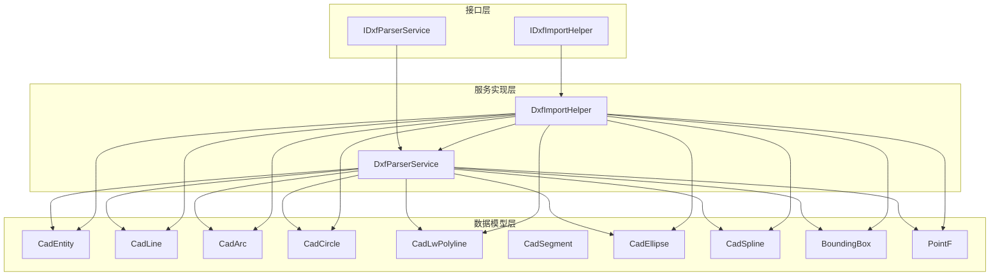
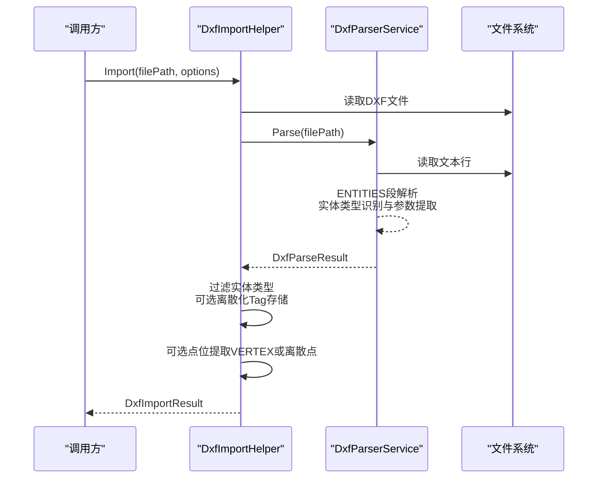
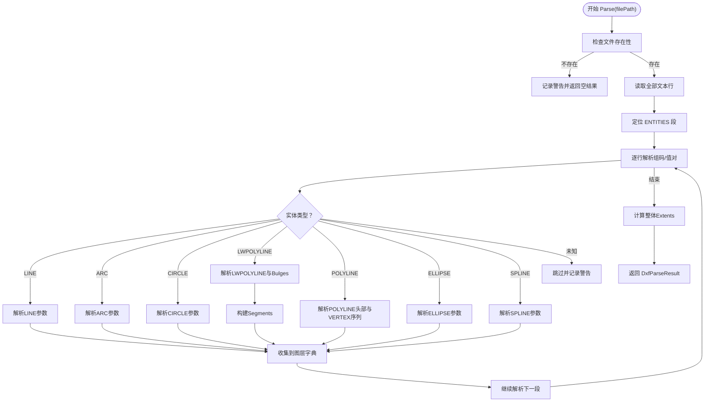
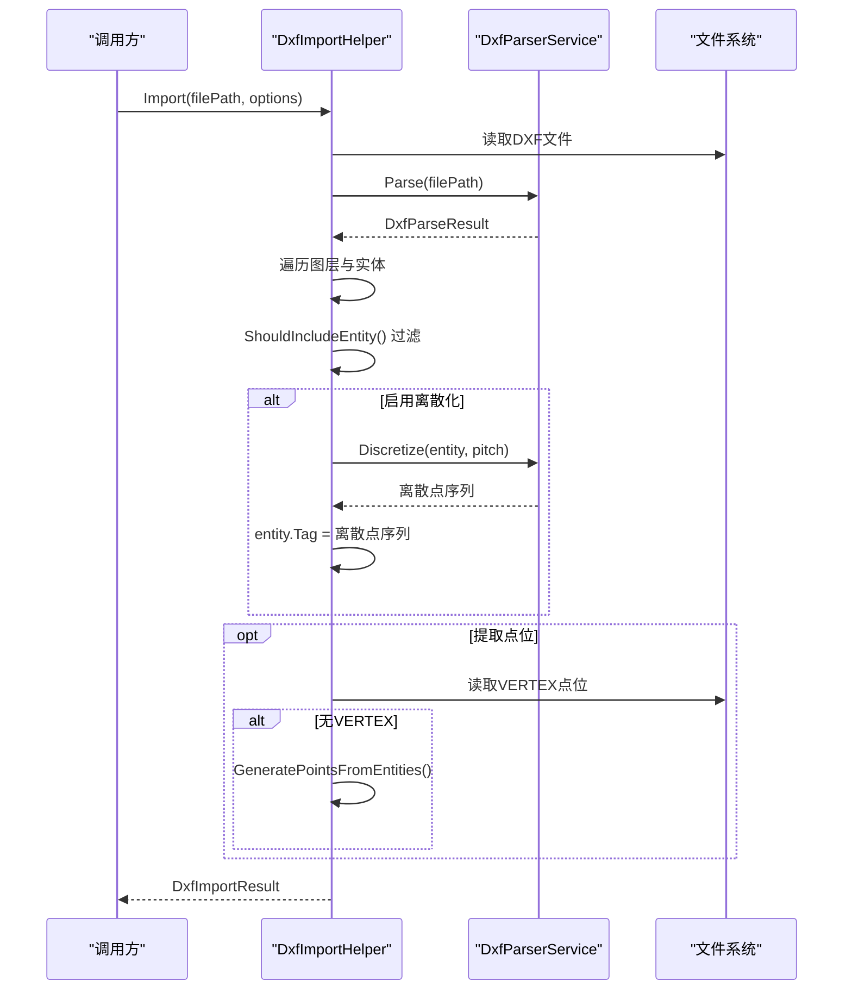
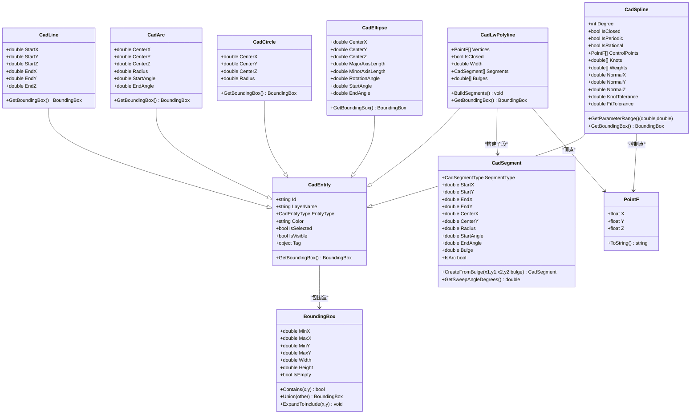
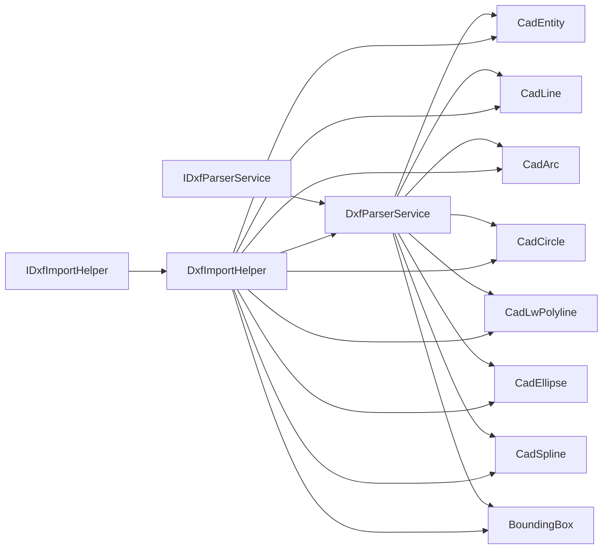

# DXF处理服务

<cite>
**本文档引用的文件**
- [DxfParserService.cs](file://Core/Services/DxfParserService.cs)
- [DxfImportHelper.cs](file://Core/Services/DxfImportHelper.cs)
- [IDxfParserService.cs](file://Core/Services/IDxfParserService.cs)
- [IDxfImportHelper.cs](file://Core/Services/IDxfImportHelper.cs)
- [DxfParseResult.cs](file://Core/Models/DxfParseResult.cs)
- [CadEntity.cs](file://Core/Models/CadEntity.cs)
- [CadLine.cs](file://Core/Models/CadLine.cs)
- [CadArc.cs](file://Core/Models/CadArc.cs)
- [CadCircle.cs](file://Core/Models/CadCircle.cs)
- [CadLwPolyline.cs](file://Core/Models/CadLwPolyline.cs)
- [CadSegment.cs](file://Core/Models/CadSegment.cs)
- [CadEllipse.cs](file://Core/Models/CadEllipse.cs)
- [CadSpline.cs](file://Core/Models/CadSpline.cs)
- [BoundingBox.cs](file://Core/Models/BoundingBox.cs)
- [PointF.cs](file://Core/Models/PointF.cs)
</cite>

## 目录
1. [简介](#简介)
2. [项目结构](#项目结构)
3. [核心组件](#核心组件)
4. [架构总览](#架构总览)
5. [详细组件分析](#详细组件分析)
6. [依赖关系分析](#依赖关系分析)
7. [性能考虑](#性能考虑)
8. [故障排除指南](#故障排除指南)
9. [结论](#结论)
10. [附录](#附录)

## 简介
本文件面向DXF处理服务的技术文档，系统性解析DxfParserService、DxfImportHelper及其相关接口与数据模型的设计原理与实现机制。重点涵盖DXF文件解析算法、图形实体提取、坐标转换、精度控制与数据结构映射；提供DXF处理的具体使用示例，包括文件导入、图形解析、数据转换、可视化渲染等；并总结DXF服务在CAD数据处理、路径规划、图形编辑等场景中的应用实践，以及文件格式支持、错误处理、性能优化与兼容性保障的最佳实践。

## 项目结构
DXF处理服务位于Core模块的Services与Models命名空间中，采用清晰的分层设计：
- 接口层：IDxfParserService、IDxfImportHelper定义对外能力契约
- 服务实现层：DxfParserService负责DXF解析与离散化；DxfImportHelper负责统一导入流程与点位提取
- 数据模型层：CadEntity及其派生类（CadLine、CadArc、CadCircle、CadLwPolyline、CadEllipse、CadSpline）、BoundingBox、PointF等构成几何与结果载体

**图表来源**
- [IDxfParserService.cs:1-42](file://Core/Services/IDxfParserService.cs#L1-L42)
- [IDxfImportHelper.cs:87-102](file://Core/Services/IDxfImportHelper.cs#L87-L102)
- [DxfParserService.cs:11-11](file://Core/Services/DxfParserService.cs#L11-L11)
- [DxfImportHelper.cs:14-21](file://Core/Services/DxfImportHelper.cs#L14-L21)

**章节来源**
- [DxfParserService.cs:11-48](file://Core/Services/DxfParserService.cs#L11-L48)
- [DxfImportHelper.cs:14-101](file://Core/Services/DxfImportHelper.cs#L14-L101)
- [IDxfParserService.cs:8-40](file://Core/Services/IDxfParserService.cs#L8-L40)
- [IDxfImportHelper.cs:87-102](file://Core/Services/IDxfImportHelper.cs#L87-L102)

## 核心组件
- DxfParserService：提供DXF文本解析、图元构建与离散化功能，采用逐行组码/值对解析策略，支持LINE、ARC、CIRCLE、LWPOLYLINE、POLYLINE（VERTEX序列）、ELLIPSE、SPLINE等实体类型。
- DxfImportHelper：统一导入服务，封装解析、过滤、离散化与点位提取流程，保证UI层（如点胶轨迹编辑器、坐标对齐模块）使用一致的导入逻辑。
- 接口IDxfParserService与IDxfImportHelper：定义对外能力契约，便于替换实现与测试。
- 数据模型：CadEntity及其派生类承载几何信息；BoundingBox用于范围计算；DxfParseResult封装解析结果；DxfImportResult封装统一导入结果。

**章节来源**
- [DxfParserService.cs:22-105](file://Core/Services/DxfParserService.cs#L22-L105)
- [DxfImportHelper.cs:31-101](file://Core/Services/DxfImportHelper.cs#L31-L101)
- [IDxfParserService.cs:8-40](file://Core/Services/IDxfParserService.cs#L8-L40)
- [IDxfImportHelper.cs:87-102](file://Core/Services/IDxfImportHelper.cs#L87-L102)

## 架构总览
DXF处理服务遵循“接口约束 + 服务实现 + 数据模型”的分层架构，解析流程与导入流程相互解耦，既可独立使用解析器，也可通过导入助手完成端到端处理。

**图表来源**
- [DxfImportHelper.cs:31-101](file://Core/Services/DxfImportHelper.cs#L31-L101)
- [DxfParserService.cs:22-48](file://Core/Services/DxfParserService.cs#L22-L48)

**章节来源**
- [DxfImportHelper.cs:31-101](file://Core/Services/DxfImportHelper.cs#L31-L101)
- [DxfParserService.cs:22-224](file://Core/Services/DxfParserService.cs#L22-L224)

## 详细组件分析

### DxfParserService 解析与离散化
- 解析入口：Parse(filePath)读取文件，定位ENTITIES段，逐行解析组码/值对，构建CadEntity对象并按图层分组。
- 实体解析：针对LINE、ARC、CIRCLE、LWPOLYLINE、POLYLINE（VERTEX序列）、ELLIPSE、SPLINE分别实现解析逻辑，提取几何参数与图层信息。
- LWPOLYLINE支持：解析顶点序列与凸度（bulge）值，构建Segments子段集合，支持直线与圆弧混合段。
- SPLINE支持：解析NURBS样条的度数、控制点、节点向量、权重、法向量与公差等参数，用于后续离散化。
- 离散化：提供按间距与按点数两种离散化策略，支持多实体批量离散化；离散化结果用于路径规划与渲染。
- 包围盒：遍历所有实体计算整体Extents，用于视口缩放与居中显示。

**图表来源**
- [DxfParserService.cs:22-224](file://Core/Services/DxfParserService.cs#L22-L224)
- [DxfParserService.cs:229-283](file://Core/Services/DxfParserService.cs#L229-L283)
- [DxfParserService.cs:288-343](file://Core/Services/DxfParserService.cs#L288-L343)
- [DxfParserService.cs:348-396](file://Core/Services/DxfParserService.cs#L348-L396)
- [DxfParserService.cs:404-495](file://Core/Services/DxfParserService.cs#L404-L495)
- [DxfParserService.cs:502-619](file://Core/Services/DxfParserService.cs#L502-L619)
- [DxfParserService.cs:625-699](file://Core/Services/DxfParserService.cs#L625-L699)
- [DxfParserService.cs:713-800](file://Core/Services/DxfParserService.cs#L713-L800)

**章节来源**
- [DxfParserService.cs:22-85](file://Core/Services/DxfParserService.cs#L22-L85)
- [DxfParserService.cs:113-224](file://Core/Services/DxfParserService.cs#L113-L224)
- [DxfParserService.cs:229-619](file://Core/Services/DxfParserService.cs#L229-L619)
- [DxfParserService.cs:713-800](file://Core/Services/DxfParserService.cs#L713-L800)

### DxfImportHelper 统一导入流程
- 统一入口：Import(filePath, options)串联解析、过滤、离散化与点位提取。
- 实体过滤：根据DxfImportOptions决定是否包含圆弧、圆、样条等实体类型。
- 预离散化：当设置离散化间距时，将离散点序列写入实体的Tag属性，供渲染或进一步处理使用。
- 点位提取：优先从VERTEX实体提取点位；若无VERTEX，则从离散化实体生成点位；亦可直接从实体关键点提取（如圆弧端点、圆心）。
- 结果封装：DxfImportResult包含解析结果、显示实体集合、提取点位列表与图层名称列表。

**图表来源**
- [DxfImportHelper.cs:31-101](file://Core/Services/DxfImportHelper.cs#L31-L101)
- [DxfImportHelper.cs:103-112](file://Core/Services/DxfImportHelper.cs#L103-L112)
- [DxfImportHelper.cs:114-209](file://Core/Services/DxfImportHelper.cs#L114-L209)
- [DxfImportHelper.cs:216-287](file://Core/Services/DxfImportHelper.cs#L216-L287)

**章节来源**
- [DxfImportHelper.cs:31-101](file://Core/Services/DxfImportHelper.cs#L31-L101)
- [DxfImportHelper.cs:103-112](file://Core/Services/DxfImportHelper.cs#L103-L112)
- [DxfImportHelper.cs:114-209](file://Core/Services/DxfImportHelper.cs#L114-L209)
- [DxfImportHelper.cs:216-287](file://Core/Services/DxfImportHelper.cs#L216-L287)

### 数据模型与几何映射
- CadEntity：所有几何实体的抽象基类，提供ID、图层、类型、颜色、选择状态、可见性与Tag等通用属性。
- CadLine/CadArc/CadCircle：基础几何实体，提供坐标与角度参数，支持包围盒计算。
- CadLwPolyline：轻量多段线，支持闭合、线宽与Bulges；通过BuildSegments将Bulge转换为直线/圆弧子段。
- CadSegment：子段工厂，从两点与Bulge值创建直线或圆弧段，计算圆心、半径与起止角度。
- CadEllipse：椭圆弧或完整椭圆，支持长短轴、旋转角与起止角度。
- CadSpline：NURBS样条，支持度数、控制点、节点向量、权重、法向量与公差。
- BoundingBox：轴对齐包围盒，支持扩展、并集与包含判断。
- PointF：带Z坐标的点结构，用于多段线与样条控制点。

**图表来源**
- [CadEntity.cs:10-95](file://Core/Models/CadEntity.cs#L10-L95)
- [CadLine.cs:7-111](file://Core/Models/CadLine.cs#L7-L111)
- [CadArc.cs:8-158](file://Core/Models/CadArc.cs#L8-L158)
- [CadCircle.cs:7-89](file://Core/Models/CadCircle.cs#L7-L89)
- [CadLwPolyline.cs:10-152](file://Core/Models/CadLwPolyline.cs#L10-L152)
- [CadSegment.cs:21-173](file://Core/Models/CadSegment.cs#L21-L173)
- [CadEllipse.cs:7-160](file://Core/Models/CadEllipse.cs#L7-L160)
- [CadSpline.cs:24-241](file://Core/Models/CadSpline.cs#L24-L241)
- [BoundingBox.cs:7-144](file://Core/Models/BoundingBox.cs#L7-L144)
- [PointF.cs:8-36](file://Core/Models/PointF.cs#L8-L36)

**章节来源**
- [CadEntity.cs:10-95](file://Core/Models/CadEntity.cs#L10-L95)
- [CadLwPolyline.cs:72-108](file://Core/Models/CadLwPolyline.cs#L72-L108)
- [CadSegment.cs:47-148](file://Core/Models/CadSegment.cs#L47-L148)
- [CadSpline.cs:192-198](file://Core/Models/CadSpline.cs#L192-L198)
- [BoundingBox.cs:68-141](file://Core/Models/BoundingBox.cs#L68-L141)
- [PointF.cs:14-34](file://Core/Models/PointF.cs#L14-L34)

## 依赖关系分析
- DxfParserService依赖于各几何实体模型与包围盒工具，负责解析与离散化。
- DxfImportHelper依赖DxfParserService与几何模型，负责统一导入流程与点位提取。
- 接口层与实现层解耦，便于替换与扩展。

**图表来源**
- [IDxfParserService.cs:8-40](file://Core/Services/IDxfParserService.cs#L8-L40)
- [IDxfImportHelper.cs:87-102](file://Core/Services/IDxfImportHelper.cs#L87-L102)
- [DxfParserService.cs:11-11](file://Core/Services/DxfParserService.cs#L11-L11)
- [DxfImportHelper.cs:14-21](file://Core/Services/DxfImportHelper.cs#L14-L21)

**章节来源**
- [IDxfParserService.cs:8-40](file://Core/Services/IDxfParserService.cs#L8-L40)
- [IDxfImportHelper.cs:87-102](file://Core/Services/IDxfImportHelper.cs#L87-L102)
- [DxfParserService.cs:11-11](file://Core/Services/DxfParserService.cs#L11-L11)
- [DxfImportHelper.cs:14-21](file://Core/Services/DxfImportHelper.cs#L14-L21)

## 性能考虑
- 文本解析：采用一次性读取全部行的方式，适合中小型DXF文件；对于超大文件建议分块读取或流式解析以降低内存占用。
- 状态机解析：ENTITIES段定位与实体解析采用顺序扫描，时间复杂度O(N)，空间复杂度O(M)（M为实体数量）。
- LWPOLYLINE Bulge处理：BuildSegments在解析后一次性构建子段，避免重复计算；注意Bulges与Vertices数量一致性。
- 离散化策略：按间距离散化适合路径规划；按点数离散化适合均匀采样；两者均支持批量处理。
- 包围盒计算：整体Extents在解析完成后一次性计算，避免频繁重建。
- 精度控制：浮点解析使用不变区域性设置，确保小数点格式一致；点位提取时对坐标进行定点精度舍入。

[本节为通用性能指导，无需特定文件引用]

## 故障排除指南
- 文件不存在：Parse返回警告并返回空结果，调用方应检查文件路径。
- 不支持的实体类型：解析时跳过并记录警告，不影响其他实体解析。
- 组码解析异常：捕获异常并记录错误信息，继续解析后续实体。
- VERTEX序列中断：当遇到SEQEND或非VERTEX实体时，按当前进度保存点位并停止继续收集。
- 离散化失败：预离散化异常时忽略并继续处理，保证导入流程不中断。
- 点位提取为空：若DXF中无VERTEX且无离散化实体，将无法提取点位，需检查DXF格式或实体类型。

**章节来源**
- [DxfParserService.cs:28-47](file://Core/Services/DxfParserService.cs#L28-L47)
- [DxfParserService.cs:187-200](file://Core/Services/DxfParserService.cs#L187-L200)
- [DxfParserService.cs:202-205](file://Core/Services/DxfParserService.cs#L202-L205)
- [DxfImportHelper.cs:97-100](file://Core/Services/DxfImportHelper.cs#L97-L100)
- [DxfImportHelper.cs:114-209](file://Core/Services/DxfImportHelper.cs#L114-L209)

## 结论
DXF处理服务通过DxfParserService与DxfImportHelper实现了从DXF文件到几何实体与点位数据的完整链路，具备良好的扩展性与稳定性。其解析算法覆盖主流实体类型，离散化策略满足路径规划与渲染需求；统一导入流程保证了UI层的一致性。结合精度控制与错误处理机制，可在CAD数据处理、路径规划、图形编辑等场景中高效可靠地工作。

[本节为总结性内容，无需特定文件引用]

## 附录

### 使用示例与最佳实践
- 文件导入与显示
  - 使用DxfImportHelper.Import(filePath, options)完成解析、过滤、离散化与点位提取，获得DxfImportResult用于界面渲染与数据展示。
  - 对于点胶轨迹编辑器与坐标对齐模块，推荐使用DxfImportOptions.ForDispenseEditor与ForAlignment，确保实体过滤与离散化参数一致。
- 图形解析与数据转换
  - 通过DxfParserService.Parse(filePath)获取DxfParseResult，再按图层与实体类型进行二次处理。
  - 对LWPOLYLINE使用BuildSegments生成子段，便于后续渲染与路径生成。
- 可视化渲染
  - 将DisplayEntities绑定到HalconCanvas控件进行渲染；若启用离散化，可直接使用Tag中的点序列进行绘制。
- 精度与兼容性
  - 使用不变区域性设置解析浮点数，避免区域化差异导致的解析错误。
  - 对于AutoCAD 2018 DXF格式（仅独立实体），优先使用离散化生成点位；对于传统DXF（含POLYLINE/VERTEX），优先从VERTEX提取点位。
- 错误处理与日志
  - 关注ParseWarnings与导入结果的IsSuccess，必要时提示用户调整DXF文件或实体类型。

**章节来源**
- [DxfImportHelper.cs:31-101](file://Core/Services/DxfImportHelper.cs#L31-L101)
- [DxfImportHelper.cs:103-112](file://Core/Services/DxfImportHelper.cs#L103-L112)
- [DxfImportHelper.cs:114-209](file://Core/Services/DxfImportHelper.cs#L114-L209)
- [DxfImportHelper.cs:216-287](file://Core/Services/DxfImportHelper.cs#L216-L287)
- [DxfParserService.cs:22-48](file://Core/Services/DxfParserService.cs#L22-L48)
- [DxfParseResult.cs:7-75](file://Core/Models/DxfParseResult.cs#L7-L75)