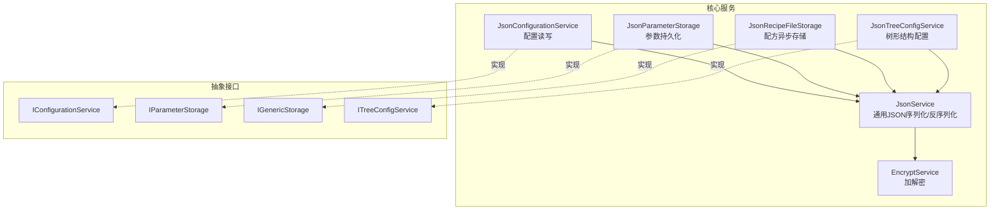
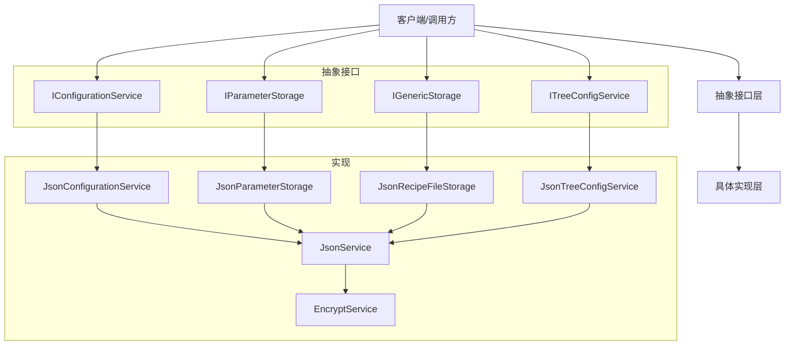
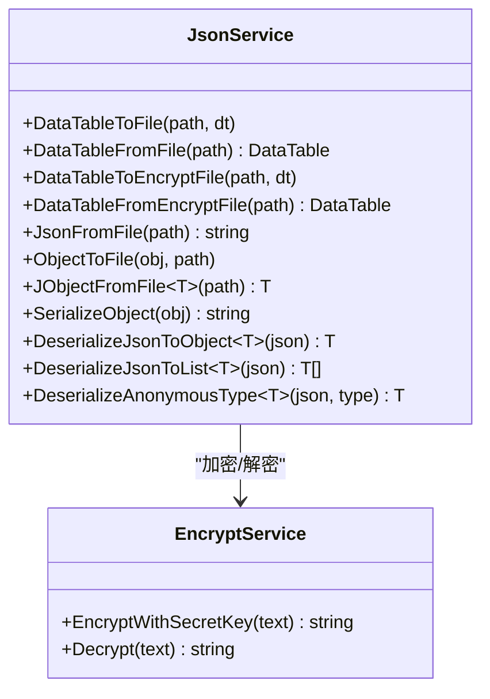
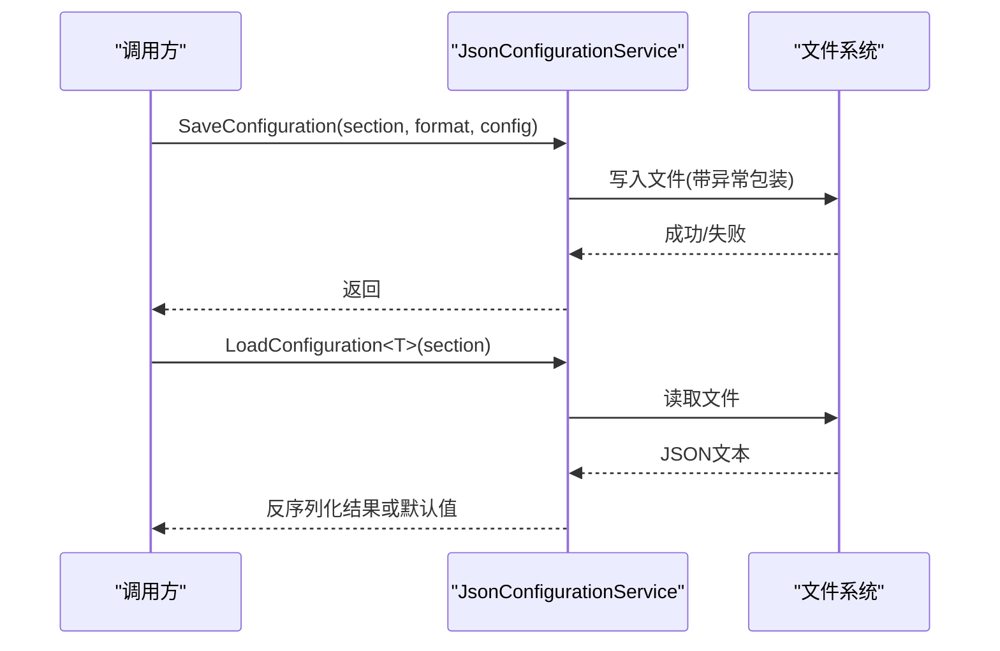
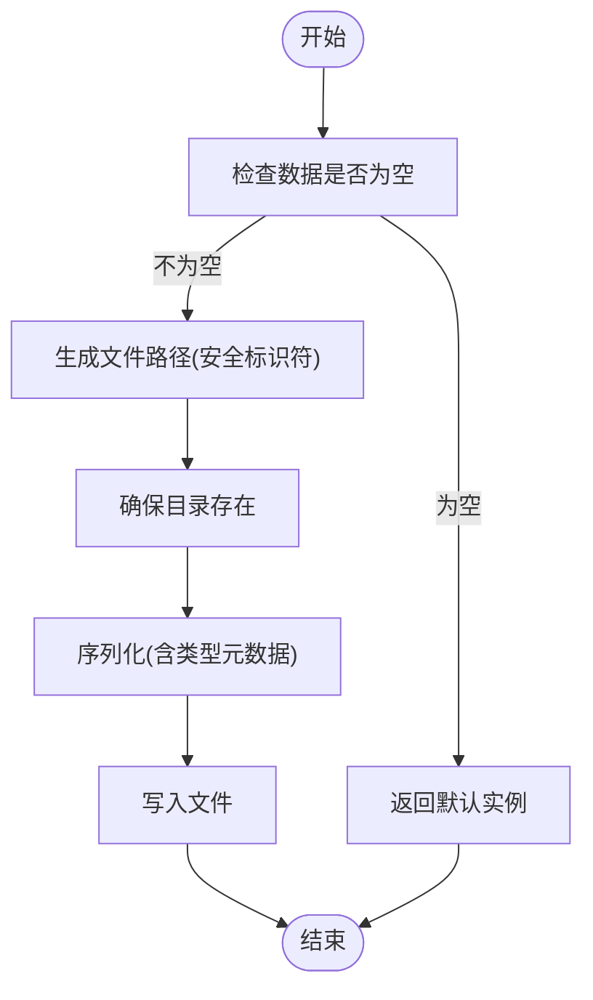
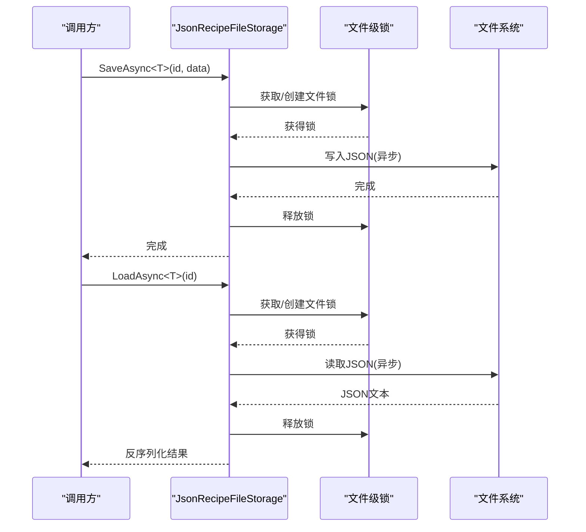
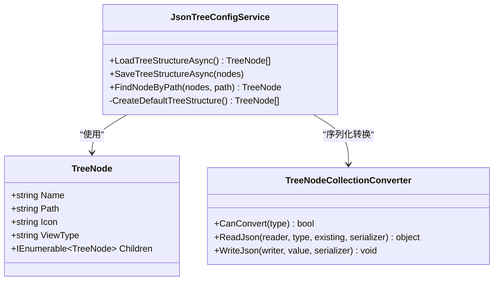
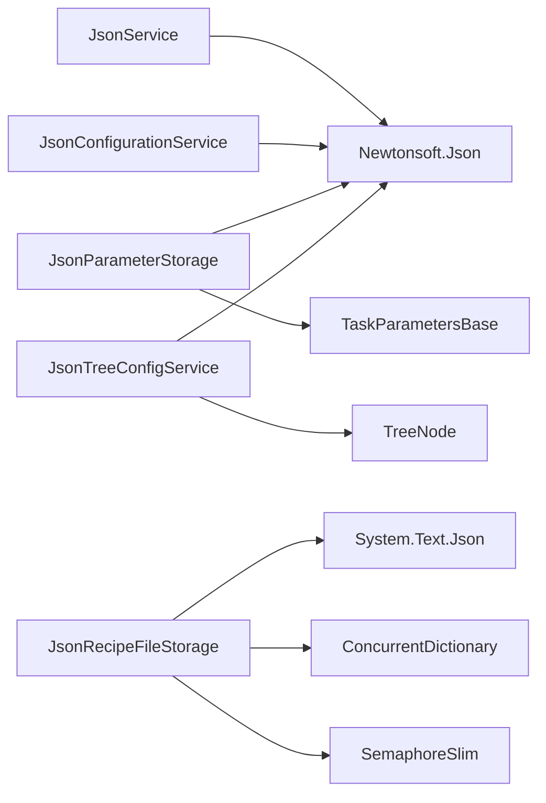

# JSON数据服务

<cite>
**本文引用的文件**
- [JsonService.cs](file://Core/Services/JsonService.cs)
- [JsonConfigurationService.cs](file://Core/Services/JsonConfigurationService.cs)
- [JsonParameterStorage.cs](file://Core/Services/JsonParameterStorage.cs)
- [JsonRecipeFileStorage.cs](file://Core/Services/JsonRecipeFileStorage.cs)
- [JsonTreeConfigService.cs](file://Core/Services/JsonTreeConfigService.cs)
- [EncryptService.cs](file://Core/Services/EncryptService.cs)
- [IConfigurationService.cs](file://Core/Abstraction/IConfigurationService.cs)
- [IParameterStorage.cs](file://Core/Abstraction/IParameterStorage.cs)
- [IGenericStorage.cs](file://Core/Abstraction/Storages/IGenericStorage.cs)
- [ITreeConfigService.cs](file://Core/Abstraction/ITreeConfigService.cs)
- [TreeNode.cs](file://Core/Models/TreeNode.cs)
- [TaskParametersBase.cs](file://Core/Abstraction/Parameters/TaskParametersBase.cs)
- [ParameterItems.cs](file://Core/Abstraction/Parameters/ParameterItems.cs)
</cite>

## 目录
1. [简介](#简介)
2. [项目结构](#项目结构)
3. [核心组件](#核心组件)
4. [架构总览](#架构总览)
5. [详细组件分析](#详细组件分析)
6. [依赖关系分析](#依赖关系分析)
7. [性能考虑](#性能考虑)
8. [故障排除指南](#故障排除指南)
9. [结论](#结论)
10. [附录](#附录)

## 简介
本文件系统性梳理并解析了项目中的JSON数据服务体系，重点围绕以下目标展开：
- 深入解析JsonService的设计原理与实现机制，涵盖序列化/反序列化算法、数据类型映射、嵌套对象处理与性能优化策略。
- 提供JSON操作的具体使用示例，包括配置文件读写、数据传输、缓存管理等场景。
- 详细说明服务在配置管理、数据持久化、网络通信等场景中的应用。
- 包含JSON Schema验证、错误处理、大数据处理和内存优化的最佳实践建议。

## 项目结构
本项目采用按功能域分层的服务架构，JSON相关能力分布在Core\Services下，并通过统一的抽象接口对外提供能力：
- 核心序列化服务：JsonService（通用对象/DataTable/字符串的序列化与反序列化）
- 配置管理：JsonConfigurationService（基于Newtonsoft.Json的配置读写）
- 参数存储：JsonParameterStorage（参数类任务参数的持久化）
- 配方存储：JsonRecipeFileStorage（配方数据的异步文件存储）
- 树形配置：JsonTreeConfigService（树形节点结构的序列化与反序列化）
- 加解密：EncryptService（对敏感JSON内容进行加密/解密）

图表来源
- [JsonService.cs:1-202](file://Core/Services/JsonService.cs#L1-L202)
- [JsonConfigurationService.cs:1-60](file://Core/Services/JsonConfigurationService.cs#L1-L60)
- [JsonParameterStorage.cs:1-86](file://Core/Services/JsonParameterStorage.cs#L1-L86)
- [JsonRecipeFileStorage.cs:1-125](file://Core/Services/JsonRecipeFileStorage.cs#L1-L125)
- [JsonTreeConfigService.cs:1-147](file://Core/Services/JsonTreeConfigService.cs#L1-L147)
- [EncryptService.cs](file://Core/Services/EncryptService.cs)
- [IConfigurationService.cs](file://Core/Abstraction/IConfigurationService.cs)
- [IParameterStorage.cs](file://Core/Abstraction/IParameterStorage.cs)
- [IGenericStorage.cs](file://Core/Abstraction/Storages/IGenericStorage.cs)
- [ITreeConfigService.cs](file://Core/Abstraction/ITreeConfigService.cs)

章节来源
- [JsonService.cs:1-202](file://Core/Services/JsonService.cs#L1-L202)
- [JsonConfigurationService.cs:1-60](file://Core/Services/JsonConfigurationService.cs#L1-L60)
- [JsonParameterStorage.cs:1-86](file://Core/Services/JsonParameterStorage.cs#L1-L86)
- [JsonRecipeFileStorage.cs:1-125](file://Core/Services/JsonRecipeFileStorage.cs#L1-L125)
- [JsonTreeConfigService.cs:1-147](file://Core/Services/JsonTreeConfigService.cs#L1-L147)

## 核心组件
本节聚焦于各JSON服务组件的功能职责、数据结构与处理流程。

- JsonService
  - 职责：提供通用的JSON序列化/反序列化能力，支持对象、DataTable、字符串等多形态数据；提供文件IO与加解密集成。
  - 关键点：使用Newtonsoft.Json进行序列化；对时间类型采用JavaScriptDateTimeConverter；NullValueHandling.Ignore减少冗余字段；提供DataTable与文件的双向转换。
  - 并发与线程安全：对文件写入使用全局锁，避免竞态条件。
  - 错误处理：捕获异常并返回null或默认值，保证调用端健壮性。

- JsonConfigurationService
  - 职责：面向配置管理的JSON读写，自动创建配置目录，支持指定段落(section)的配置文件命名。
  - 关键点：使用Formatting.Indented美化输出；异常包装为InvalidOperationException，便于上层处理。
  - 默认路径：基于AppDomain.BaseDirectory拼接“Config/Position”。

- JsonParameterStorage
  - 职责：参数类任务参数的持久化，支持自定义目录与标识符。
  - 关键点：CamelCasePropertyNamesContractResolver统一命名风格；TypeNameHandling.Auto支持类型元数据；NullValueHandling.Ignore忽略空值。
  - 安全性：对文件名进行非法字符清理，防止路径注入。

- JsonRecipeFileStorage
  - 职责：配方数据的异步文件存储，提供LoadAsync/SaveAsync/ExistsAsync/DeleteAsync等能力。
  - 关键点：文件级SemaphoreSlim并发控制；System.Text.Json高性能序列化；JavaScriptEncoder.UnsafeRelaxedJsonEscaping放宽转义策略。
  - 组织方式：按类型名小写作为子目录，文件名为标识符+“.json”。

- JsonTreeConfigService
  - 职责：树形节点结构的序列化/反序列化，支持默认树结构生成与节点查找。
  - 关键点：TreeNodeCollectionConverter处理ObservableCollection与IList之间的转换；ReferenceLoopHandling.Ignore避免循环引用导致的序列化问题。
  - 默认结构：内置默认树形结构，首次加载不存在时自动创建。

章节来源
- [JsonService.cs:1-202](file://Core/Services/JsonService.cs#L1-L202)
- [JsonConfigurationService.cs:1-60](file://Core/Services/JsonConfigurationService.cs#L1-L60)
- [JsonParameterStorage.cs:1-86](file://Core/Services/JsonParameterStorage.cs#L1-L86)
- [JsonRecipeFileStorage.cs:1-125](file://Core/Services/JsonRecipeFileStorage.cs#L1-L125)
- [JsonTreeConfigService.cs:1-147](file://Core/Services/JsonTreeConfigService.cs#L1-L147)

## 架构总览
下图展示JSON服务在系统中的整体交互关系与数据流向：

图表来源
- [JsonConfigurationService.cs:8-60](file://Core/Services/JsonConfigurationService.cs#L8-L60)
- [JsonParameterStorage.cs:10-86](file://Core/Services/JsonParameterStorage.cs#L10-L86)
- [JsonRecipeFileStorage.cs:15-125](file://Core/Services/JsonRecipeFileStorage.cs#L15-L125)
- [JsonTreeConfigService.cs:9-147](file://Core/Services/JsonTreeConfigService.cs#L9-L147)
- [JsonService.cs:11-202](file://Core/Services/JsonService.cs#L11-L202)
- [EncryptService.cs](file://Core/Services/EncryptService.cs)
- [IConfigurationService.cs](file://Core/Abstraction/IConfigurationService.cs)
- [IParameterStorage.cs](file://Core/Abstraction/IParameterStorage.cs)
- [IGenericStorage.cs](file://Core/Abstraction/Storages/IGenericStorage.cs)
- [ITreeConfigService.cs](file://Core/Abstraction/ITreeConfigService.cs)

## 详细组件分析

### JsonService：通用JSON序列化/反序列化
- 设计要点
  - 支持对象序列化/反序列化、DataTable与文件双向转换、字符串读取、匿名类型反序列化等。
  - 使用Newtonsoft.Json的JsonSerializer/JToken/JObject进行灵活的数据处理。
  - 对时间类型采用JavaScriptDateTimeConverter，兼容前端JavaScript时间格式。
  - NullValueHandling.Ignore减少序列化体积，提升传输效率。
  - 文件写入使用lock(o)确保线程安全。
- 数据类型映射
  - 对象与字符串：SerializeObject/DeserializeJsonToObject/DeserializeJsonToList
  - DataTable：DataTableToFile/DataTableFromFile/DataTableToEncryptFile/DataTableFromEncryptFile
  - 字符串文件：JsonFromFile/ObjectToFile/JObjectFromFile
  - 匿名类型：DeserializeAnonymousType
- 嵌套对象处理
  - 通过JToken/JObject中间层实现复杂嵌套结构的读取与转换。
- 性能优化
  - 使用JsonTextWriter/JsonSerializer减少内存分配。
  - 对文件写入加锁，避免并发写入冲突。
- 错误处理
  - 所有文件读取/反序列化均包裹try/catch，异常时返回null或默认值，保证调用方稳定。

图表来源
- [JsonService.cs:11-202](file://Core/Services/JsonService.cs#L11-L202)
- [EncryptService.cs](file://Core/Services/EncryptService.cs)

章节来源
- [JsonService.cs:11-202](file://Core/Services/JsonService.cs#L11-L202)

### JsonConfigurationService：配置管理
- 设计要点
  - 实现IConfigurationService接口，负责配置的保存与加载。
  - 自动创建配置目录，避免运行时异常。
  - 使用Formatting.Indented美化输出，便于人工查看与维护。
- 使用场景
  - 应用启动时加载配置段落，如设备参数、用户偏好等。
  - 运行时更新配置并持久化，支持异常包装与日志记录。

图表来源
- [JsonConfigurationService.cs:20-49](file://Core/Services/JsonConfigurationService.cs#L20-L49)

章节来源
- [JsonConfigurationService.cs:8-60](file://Core/Services/JsonConfigurationService.cs#L8-L60)

### JsonParameterStorage：参数持久化
- 设计要点
  - 实现IParameterStorage接口，支持自定义目录与标识符。
  - 使用CamelCasePropertyNamesContractResolver统一命名风格，便于前后端一致。
  - TypeNameHandling.Auto保留类型信息，支持跨版本反序列化。
  - NullValueHandling.Ignore忽略空值，减少存储空间。
- 使用场景
  - 任务参数的序列化与反序列化，如运动参数、视觉参数等。
  - 与TaskParametersBase配合，实现参数模板化管理。

图表来源
- [JsonParameterStorage.cs:23-78](file://Core/Services/JsonParameterStorage.cs#L23-L78)

章节来源
- [JsonParameterStorage.cs:10-86](file://Core/Services/JsonParameterStorage.cs#L10-L86)
- [TaskParametersBase.cs](file://Core/Abstraction/Parameters/TaskParametersBase.cs)

### JsonRecipeFileStorage：配方异步存储
- 设计要点
  - 实现IGenericStorage接口，提供异步读写能力。
  - 文件级并发控制：ConcurrentDictionary + SemaphoreSlim确保同一文件的互斥访问。
  - 使用System.Text.Json进行高性能序列化，支持JavaScriptEncoder.UnsafeRelaxedJsonEscaping。
  - 目录组织：按类型名小写作为子目录，文件名为标识符+“.json”。
- 使用场景
  - 配方数据的加载、保存、删除与存在性检查。
  - 批量配方池文件枚举与ID提取。

图表来源
- [JsonRecipeFileStorage.cs:41-81](file://Core/Services/JsonRecipeFileStorage.cs#L41-L81)

章节来源
- [JsonRecipeFileStorage.cs:15-125](file://Core/Services/JsonRecipeFileStorage.cs#L15-L125)

### JsonTreeConfigService：树形结构配置
- 设计要点
  - 实现ITreeConfigService接口，负责树形节点结构的持久化与加载。
  - TreeNodeCollectionConverter处理ObservableCollection与IList之间的转换，适配WPF绑定。
  - ReferenceLoopHandling.Ignore避免循环引用导致的序列化问题。
  - 首次加载不存在时自动生成默认树结构。
- 使用场景
  - 导航树、菜单树等UI树形结构的配置管理。
  - 节点查找与路径匹配。

图表来源
- [JsonTreeConfigService.cs:9-147](file://Core/Services/JsonTreeConfigService.cs#L9-L147)
- [TreeNode.cs](file://Core/Models/TreeNode.cs)

章节来源
- [JsonTreeConfigService.cs:9-147](file://Core/Services/JsonTreeConfigService.cs#L9-L147)
- [TreeNode.cs](file://Core/Models/TreeNode.cs)

## 依赖关系分析
- 接口与实现分离
  - 通过IConfigurationService、IParameterStorage、IGenericStorage、ITreeConfigService四个接口实现能力抽象，便于替换与扩展。
- 第三方库依赖
  - Newtonsoft.Json：用于JsonService、JsonConfigurationService、JsonParameterStorage、JsonTreeConfigService的核心序列化/反序列化。
  - System.Text.Json：用于JsonRecipeFileStorage的高性能序列化。
- 文件系统与并发控制
  - 文件级并发：JsonRecipeFileStorage使用ConcurrentDictionary + SemaphoreSlim实现文件级互斥。
  - 目录创建：各服务在构造时确保必要目录存在。
- 类型转换与命名规范
  - JsonTreeConfigService通过自定义JsonConverter处理ObservableCollection与IList的转换。
  - JsonParameterStorage使用CamelCasePropertyNamesContractResolver统一命名风格。

图表来源
- [JsonService.cs:1-202](file://Core/Services/JsonService.cs#L1-L202)
- [JsonConfigurationService.cs:1-60](file://Core/Services/JsonConfigurationService.cs#L1-L60)
- [JsonParameterStorage.cs:1-86](file://Core/Services/JsonParameterStorage.cs#L1-L86)
- [JsonRecipeFileStorage.cs:1-125](file://Core/Services/JsonRecipeFileStorage.cs#L1-L125)
- [JsonTreeConfigService.cs:1-147](file://Core/Services/JsonTreeConfigService.cs#L1-L147)
- [TreeNode.cs](file://Core/Models/TreeNode.cs)
- [TaskParametersBase.cs](file://Core/Abstraction/Parameters/TaskParametersBase.cs)

章节来源
- [JsonService.cs:1-202](file://Core/Services/JsonService.cs#L1-L202)
- [JsonRecipeFileStorage.cs:1-125](file://Core/Services/JsonRecipeFileStorage.cs#L1-L125)
- [JsonTreeConfigService.cs:1-147](file://Core/Services/JsonTreeConfigService.cs#L1-L147)

## 性能考虑
- 序列化选择
  - JsonService与传统配置/参数存储使用Newtonsoft.Json，具备成熟的类型处理与转换能力。
  - 配方存储使用System.Text.Json，具备更高的序列化/反序列化性能，适合高频读写的场景。
- 并发与锁粒度
  - 配方存储采用文件级锁，避免跨进程/线程同时写入同一文件。
  - JsonService对文件写入使用全局锁，确保单文件写入安全。
- 内存与I/O
  - 使用JsonTextWriter/JsonTextReader减少中间对象创建。
  - 异步文件操作（JsonRecipeFileStorage）避免阻塞UI线程。
- 数据体积优化
  - NullValueHandling.Ignore减少空值字段，降低存储与传输开销。
  - CamelCase命名风格提升前后端一致性，减少字段映射成本。

## 故障排除指南
- 配置加载失败
  - 现象：加载配置抛出InvalidOperationException。
  - 排查：检查配置文件是否存在、路径是否正确、权限是否足够。
  - 参考
    - [JsonConfigurationService.cs:34-49](file://Core/Services/JsonConfigurationService.cs#L34-L49)
- 文件读取异常
  - 现象：反序列化返回null或默认值。
  - 排查：确认文件编码、JSON格式合法性、字段类型匹配。
  - 参考
    - [JsonService.cs:130-145](file://Core/Services/JsonService.cs#L130-L145)
    - [JsonParameterStorage.cs:36-54](file://Core/Services/JsonParameterStorage.cs#L36-L54)
- 并发写入冲突
  - 现象：多个进程/线程同时写入同一配方文件导致数据损坏。
  - 排查：确认是否使用JsonRecipeFileStorage的文件级锁。
  - 参考
    - [JsonRecipeFileStorage.cs:29-32](file://Core/Services/JsonRecipeFileStorage.cs#L29-L32)
    - [JsonRecipeFileStorage.cs:70-81](file://Core/Services/JsonRecipeFileStorage.cs#L70-L81)
- 循环引用导致序列化失败
  - 现象：树形结构序列化报错。
  - 排查：启用ReferenceLoopHandling.Ignore或使用自定义转换器。
  - 参考
    - [JsonTreeConfigService.cs:64-68](file://Core/Services/JsonTreeConfigService.cs#L64-L68)
    - [JsonTreeConfigService.cs:126-146](file://Core/Services/JsonTreeConfigService.cs#L126-L146)

章节来源
- [JsonConfigurationService.cs:20-49](file://Core/Services/JsonConfigurationService.cs#L20-L49)
- [JsonService.cs:130-145](file://Core/Services/JsonService.cs#L130-L145)
- [JsonParameterStorage.cs:36-54](file://Core/Services/JsonParameterStorage.cs#L36-L54)
- [JsonRecipeFileStorage.cs:29-32](file://Core/Services/JsonRecipeFileStorage.cs#L29-L32)
- [JsonRecipeFileStorage.cs:70-81](file://Core/Services/JsonRecipeFileStorage.cs#L70-L81)
- [JsonTreeConfigService.cs:64-68](file://Core/Services/JsonTreeConfigService.cs#L64-L68)
- [JsonTreeConfigService.cs:126-146](file://Core/Services/JsonTreeConfigService.cs#L126-L146)

## 结论
本JSON数据服务体系通过抽象接口与多种实现，覆盖了配置管理、参数持久化、配方存储与树形结构配置等关键场景。JsonService提供了通用的序列化/反序列化能力，JsonConfigurationService与JsonParameterStorage分别面向配置与参数两类数据，JsonRecipeFileStorage针对高频读写的配方场景提供了高性能与并发安全保障，JsonTreeConfigService则解决了树形结构的序列化与转换难题。整体设计兼顾了易用性、可维护性与性能表现。

## 附录

### 使用示例与最佳实践
- 配置文件读写
  - 保存配置：调用JsonConfigurationService.SaveConfiguration(section, format, config)，自动创建目录并写入JSON。
  - 加载配置：调用JsonConfigurationService.LoadConfiguration<T>(section)，若文件不存在则返回默认实例。
  - 参考
    - [JsonConfigurationService.cs:20-49](file://Core/Services/JsonConfigurationService.cs#L20-L49)
- 数据传输
  - 对象序列化：使用JsonService.SerializeObject(obj)生成JSON字符串。
  - 对象反序列化：使用JsonService.DeserializeJsonToObject<T>(json)或DeserializeJsonToList<T>(jsonArray)。
  - 参考
    - [JsonService.cs:152-186](file://Core/Services/JsonService.cs#L152-L186)
- 缓存管理
  - 参数持久化：使用JsonParameterStorage.Save(identifier, parameters)与Load<T>(identifier)。
  - 参考
    - [JsonParameterStorage.cs:23-78](file://Core/Services/JsonParameterStorage.cs#L23-L78)
- 配方管理
  - 异步读写：使用JsonRecipeFileStorage.SaveAsync<T>(id, data)与LoadAsync<T>(id)。
  - 存在性检查与删除：ExistsAsync<T>(id)与DeleteAsync<T>(id)。
  - 参考
    - [JsonRecipeFileStorage.cs:41-94](file://Core/Services/JsonRecipeFileStorage.cs#L41-L94)
- 树形配置
  - 加载/保存树结构：LoadTreeStructureAsync()/SaveTreeStructureAsync(nodes)。
  - 节点查找：FindNodeByPath(nodes, path)。
  - 参考
    - [JsonTreeConfigService.cs:28-94](file://Core/Services/JsonTreeConfigService.cs#L28-L94)

### JSON Schema验证与错误处理
- JSON Schema验证
  - 当前实现未直接集成JSON Schema验证。建议在业务层引入第三方Schema验证库（如NJsonSchema），在反序列化后执行Schema校验。
- 错误处理
  - 统一捕获异常并返回默认值或抛出包装后的异常，便于上层统一处理。
  - 参考
    - [JsonConfigurationService.cs:28-31](file://Core/Services/JsonConfigurationService.cs#L28-L31)
    - [JsonParameterStorage.cs:48-51](file://Core/Services/JsonParameterStorage.cs#L48-L51)
    - [JsonTreeConfigService.cs:47-51](file://Core/Services/JsonTreeConfigService.cs#L47-L51)

### 大数据处理与内存优化
- 大文件读写
  - 使用异步API（JsonRecipeFileStorage）避免阻塞主线程。
  - 分块读取与流式处理，减少一次性内存占用。
- 内存优化
  - 合理使用NullValueHandling.Ignore与CamelCase命名，降低序列化体积。
  - 对频繁序列化的对象复用JsonSerializerSettings，减少反射开销。
- 参考
  - [JsonRecipeFileStorage.cs:19-24](file://Core/Services/JsonRecipeFileStorage.cs#L19-L24)
  - [JsonParameterStorage.cs:69-75](file://Core/Services/JsonParameterStorage.cs#L69-L75)