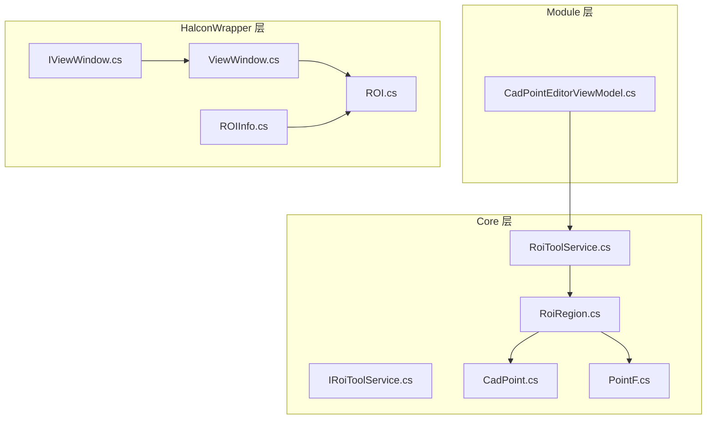
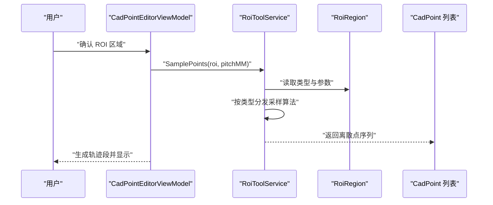
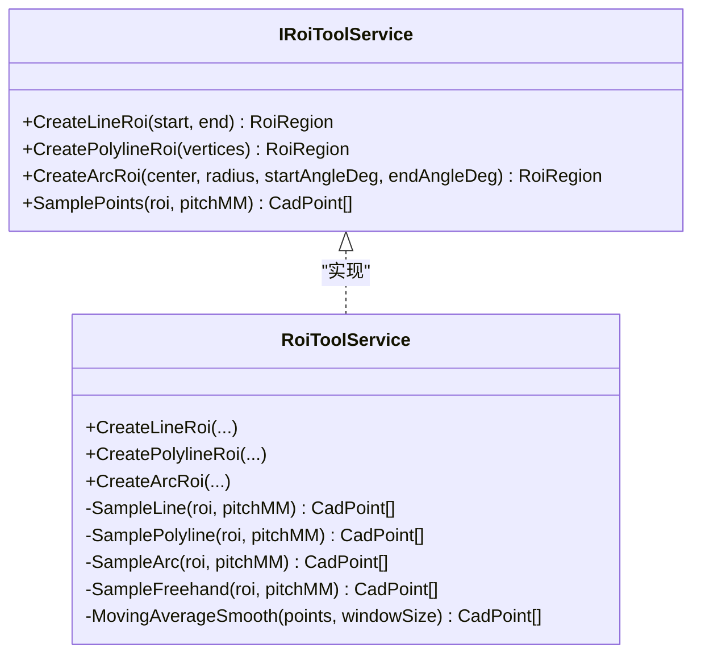
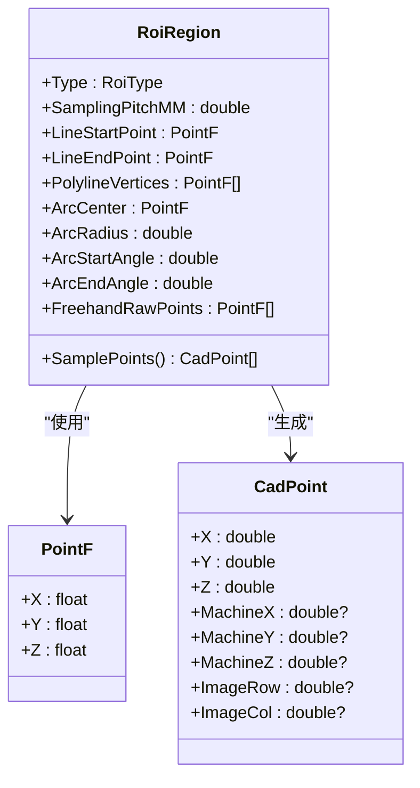
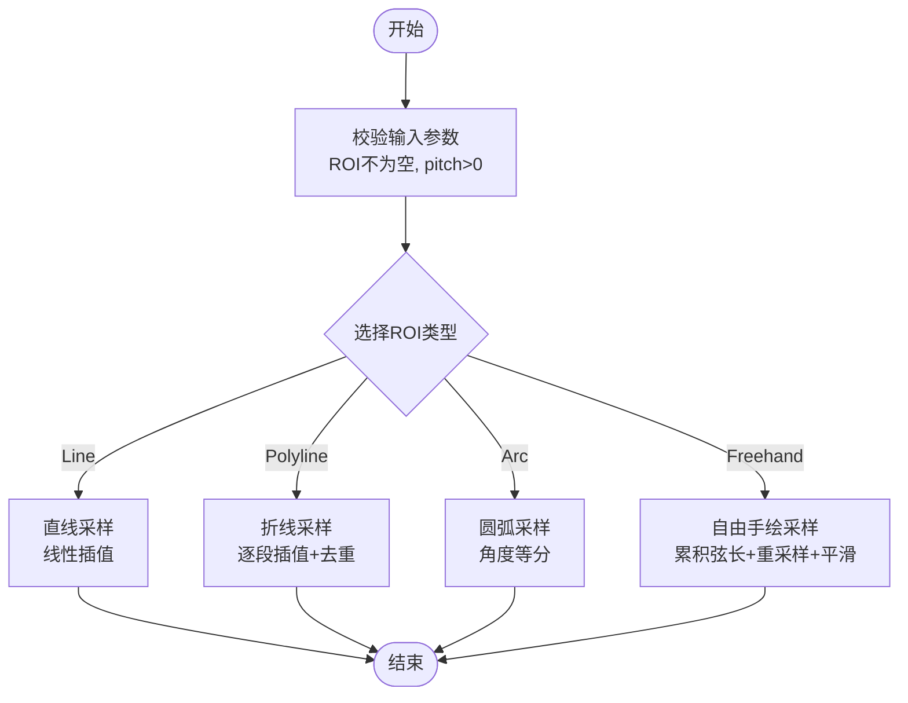
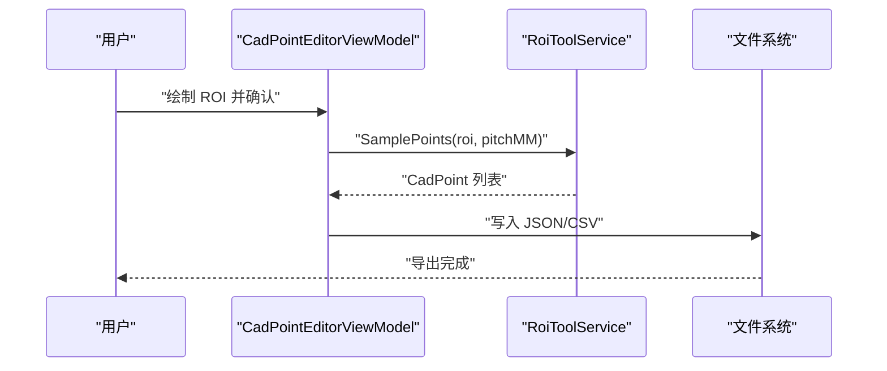
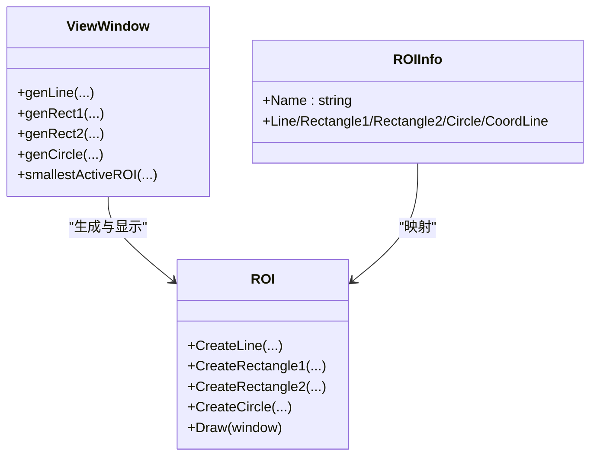
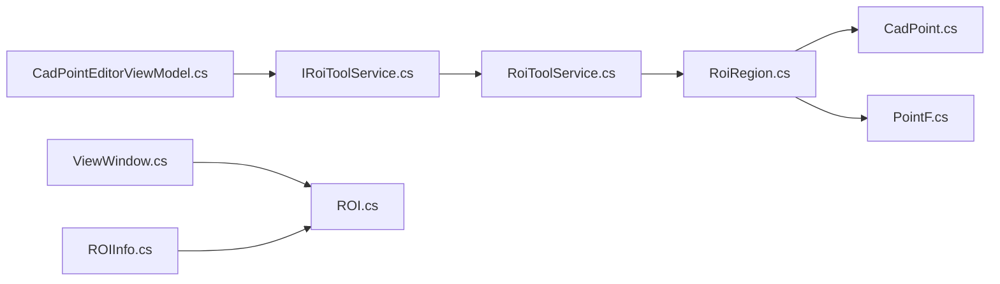

# ROI工具服务

<cite>
**本文档引用的文件**
- [IRoiToolService.cs](file://Core/Services/IRoiToolService.cs)
- [RoiToolService.cs](file://Core/Services/RoiToolService.cs)
- [RoiRegion.cs](file://Core/Models/RoiRegion.cs)
- [CadPoint.cs](file://Core/Models/CadPoint.cs)
- [PointF.cs](file://Core/Models/PointF.cs)
- [CadPointEditorViewModel.cs](file://Module/Controls/Cad/CadPointEditorViewModel.cs)
- [DxfParserService.cs](file://Core/Services/DxfParserService.cs)
- [ROI.cs](file://HalconWrapper/Model/ROI.cs)
- [ROIInfo.cs](file://HalconWrapper/Model/ROIInfo.cs)
- [ViewWindow.cs](file://HalconWrapper/ViewWindow.cs)
- [IViewWindow.cs](file://HalconWrapper/Model/IViewWindow.cs)
</cite>

## 目录
1. [简介](#简介)
2. [项目结构](#项目结构)
3. [核心组件](#核心组件)
4. [架构总览](#架构总览)
5. [详细组件分析](#详细组件分析)
6. [依赖关系分析](#依赖关系分析)
7. [性能考虑](#性能考虑)
8. [故障排查指南](#故障排查指南)
9. [结论](#结论)
10. [附录](#附录)

## 简介
本文件系统化梳理并深度解析 ROI 工具服务，围绕 IRoiToolService 接口与 RoiToolService 实现，阐述感兴趣区域（ROI）的创建、编辑、验证、变换与分析算法。文档重点覆盖以下方面：
- ROI 类型与数据模型设计：直线、折线、圆弧、自由手绘四类几何形态
- 采样算法：等间距离散化策略与平滑处理
- 使用示例：区域定义、参数调整、批量处理、结果导出
- 应用场景：图像处理、视觉检测、质量控制
- 最佳实践：类型支持、精度控制、性能优化与用户交互

## 项目结构
ROI 工具服务位于 Core 层，采用“接口 + 实现 + 模型”的分层设计；模块层（Module）通过 ViewModel 调用服务完成点胶轨迹段的生成与管理；HalconWrapper 提供图形界面与 ROI 可视化能力。

**图表来源**
- [IRoiToolService.cs](file://Core/Services/IRoiToolService.cs)
- [RoiToolService.cs](file://Core/Services/RoiToolService.cs)
- [RoiRegion.cs](file://Core/Models/RoiRegion.cs)
- [CadPoint.cs](file://Core/Models/CadPoint.cs)
- [PointF.cs](file://Core/Models/PointF.cs)
- [CadPointEditorViewModel.cs](file://Module/Controls/Cad/CadPointEditorViewModel.cs)
- [ROI.cs](file://HalconWrapper/Model/ROI.cs)
- [ROIInfo.cs](file://HalconWrapper/Model/ROIInfo.cs)
- [ViewWindow.cs](file://HalconWrapper/ViewWindow.cs)
- [IViewWindow.cs](file://HalconWrapper/Model/IViewWindow.cs)

**章节来源**
- [IRoiToolService.cs](file://Core/Services/IRoiToolService.cs)
- [RoiToolService.cs](file://Core/Services/RoiToolService.cs)
- [RoiRegion.cs](file://Core/Models/RoiRegion.cs)
- [CadPoint.cs](file://Core/Models/CadPoint.cs)
- [PointF.cs](file://Core/Models/PointF.cs)
- [CadPointEditorViewModel.cs](file://Module/Controls/Cad/CadPointEditorViewModel.cs)
- [ROI.cs](file://HalconWrapper/Model/ROI.cs)
- [ROIInfo.cs](file://HalconWrapper/Model/ROIInfo.cs)
- [ViewWindow.cs](file://HalconWrapper/ViewWindow.cs)
- [IViewWindow.cs](file://HalconWrapper/Model/IViewWindow.cs)

## 核心组件
- IRoiToolService：定义 ROI 创建与采样能力的契约，支持直线、折线、圆弧、自由手绘四类几何形态。
- RoiToolService：具体实现，负责 ROI 创建与等间距采样，提供线性插值、角度等分、累积弦长重采样与移动平均平滑等算法。
- RoiRegion：ROI 数据模型，封装类型、采样间距与各类几何参数，提供骨架式的采样入口。
- CadPoint/PointF：点模型与带 Z 坐标的点结构，用于承载离散化后的轨迹点与几何参数。

**章节来源**
- [IRoiToolService.cs](file://Core/Services/IRoiToolService.cs)
- [RoiToolService.cs](file://Core/Services/RoiToolService.cs)
- [RoiRegion.cs](file://Core/Models/RoiRegion.cs)
- [CadPoint.cs](file://Core/Models/CadPoint.cs)
- [PointF.cs](file://Core/Models/PointF.cs)

## 架构总览
ROI 工具服务贯穿“定义 -> 采样 -> 变换 -> 分析/导出”的完整链路。模块层 ViewModel 在确认 ROI 后调用服务进行采样，生成离散点集合；随后可接入坐标对齐服务进行变换，最终进入质量控制或数据分析流程。

**图表来源**
- [CadPointEditorViewModel.cs](file://Module/Controls/Cad/CadPointEditorViewModel.cs)
- [RoiToolService.cs](file://Core/Services/RoiToolService.cs)
- [RoiRegion.cs](file://Core/Models/RoiRegion.cs)

## 详细组件分析

### 接口与实现：IRoiToolService 与 RoiToolService
- 设计原则
  - 低耦合：接口仅暴露 ROI 创建与采样两个维度的能力
  - 可扩展：新增 ROI 类型只需在服务端扩展采样分支
  - 参数校验：对关键参数（如半径、采样间距）进行前置校验
- 关键方法
  - CreateLineRoi/CreatePolylineRoi/CreateArcRoi：创建指定类型的 ROI 实例
  - SamplePoints：按类型分发采样算法，返回 CadPoint 序列

**图表来源**
- [IRoiToolService.cs](file://Core/Services/IRoiToolService.cs)
- [RoiToolService.cs](file://Core/Services/RoiToolService.cs)

**章节来源**
- [IRoiToolService.cs](file://Core/Services/IRoiToolService.cs)
- [RoiToolService.cs](file://Core/Services/RoiToolService.cs)

### ROI 数据模型：RoiRegion
- 类型与参数
  - RoiType：Line/Polyline/Arc/Freehand
  - 采样间距 SamplingPitchMM 控制离散化密度
  - 各类型特有参数：直线起点/终点、折线顶点序列、圆弧中心/半径/起止角、自由手绘原始点序列
- 骨架采样
  - 提供按类型分发的骨架采样入口，便于后续扩展或替换实现

**图表来源**
- [RoiRegion.cs](file://Core/Models/RoiRegion.cs)
- [PointF.cs](file://Core/Models/PointF.cs)
- [CadPoint.cs](file://Core/Models/CadPoint.cs)

**章节来源**
- [RoiRegion.cs](file://Core/Models/RoiRegion.cs)
- [PointF.cs](file://Core/Models/PointF.cs)
- [CadPoint.cs](file://Core/Models/CadPoint.cs)

### 采样算法详解
- 直线采样
  - 线性插值：基于起点/终点三维坐标与距离，按采样间距计算步数并均匀取点
- 折线采样
  - 逐段线性插值，避免重复端点（除首段外跳过起点）
- 圆弧采样
  - 角度等分：将圆心角按弧长等分，使用参数方程 x = cx + r·cosθ, y = cy + r·sinθ 生成点列
- 自由手绘采样
  - 累积弦长 + 二分查找重采样：先计算累积弦长，再按目标距离二分定位段落并线性插值
  - 移动平均平滑：窗口大小默认 3，边界自适应缩窗，降低高频抖动

**图表来源**
- [RoiToolService.cs](file://Core/Services/RoiToolService.cs)

**章节来源**
- [RoiToolService.cs](file://Core/Services/RoiToolService.cs)

### 使用示例与工作流
- 区域定义
  - 通过 ViewModel 激活相应 ROI 工具（直线/折线/圆弧），在画布上绘制或框选
- 参数调整
  - 修改 RoiRegion 的采样间距 SamplingPitchMM，影响离散化密度
- 批量处理
  - 在 ViewModel 中遍历多段 ROI，统一调用服务采样并生成轨迹段
- 结果导出
  - 将采样得到的 CadPoint 序列写入 JSON/CSV 等格式，便于后续分析或导入设备

**图表来源**
- [CadPointEditorViewModel.cs](file://Module/Controls/Cad/CadPointEditorViewModel.cs)
- [RoiToolService.cs](file://Core/Services/RoiToolService.cs)

**章节来源**
- [CadPointEditorViewModel.cs](file://Module/Controls/Cad/CadPointEditorViewModel.cs)
- [RoiToolService.cs](file://Core/Services/RoiToolService.cs)

### 与 HALCON 的集成与可视化
- ROI 可视化
  - ViewWindow 提供生成与显示 ROI 的能力，支持多种几何类型
  - ROIInfo/ROIController 负责将内部 ROI 数据映射到 HALCON 图形对象
- 交互与事件
  - IViewWindow 定义了 ROI 的选择、删除、保存/加载等接口，便于与 UI 交互

**图表来源**
- [ViewWindow.cs](file://HalconWrapper/ViewWindow.cs)
- [ROI.cs](file://HalconWrapper/Model/ROI.cs)
- [ROIInfo.cs](file://HalconWrapper/Model/ROIInfo.cs)

**章节来源**
- [ViewWindow.cs](file://HalconWrapper/ViewWindow.cs)
- [ROI.cs](file://HalconWrapper/Model/ROI.cs)
- [ROIInfo.cs](file://HalconWrapper/Model/ROIInfo.cs)
- [IViewWindow.cs](file://HalconWrapper/Model/IViewWindow.cs)

## 依赖关系分析
- 模块层依赖 Core 层的服务与模型，通过 IRoiToolService 解耦具体实现
- RoiToolService 依赖 RoiRegion 与基础点模型，不直接依赖 HALCON
- HALCON 层提供可视化与交互能力，与 ROI 工具服务通过 ViewWindow/ROIInfo 解耦

**图表来源**
- [CadPointEditorViewModel.cs](file://Module/Controls/Cad/CadPointEditorViewModel.cs)
- [IRoiToolService.cs](file://Core/Services/IRoiToolService.cs)
- [RoiToolService.cs](file://Core/Services/RoiToolService.cs)
- [RoiRegion.cs](file://Core/Models/RoiRegion.cs)
- [CadPoint.cs](file://Core/Models/CadPoint.cs)
- [PointF.cs](file://Core/Models/PointF.cs)
- [ViewWindow.cs](file://HalconWrapper/ViewWindow.cs)
- [ROI.cs](file://HalconWrapper/Model/ROI.cs)
- [ROIInfo.cs](file://HalconWrapper/Model/ROIInfo.cs)

**章节来源**
- [CadPointEditorViewModel.cs](file://Module/Controls/Cad/CadPointEditorViewModel.cs)
- [IRoiToolService.cs](file://Core/Services/IRoiToolService.cs)
- [RoiToolService.cs](file://Core/Services/RoiToolService.cs)
- [RoiRegion.cs](file://Core/Models/RoiRegion.cs)
- [CadPoint.cs](file://Core/Models/CadPoint.cs)
- [PointF.cs](file://Core/Models/PointF.cs)
- [ViewWindow.cs](file://HalconWrapper/ViewWindow.cs)
- [ROI.cs](file://HalconWrapper/Model/ROI.cs)
- [ROIInfo.cs](file://HalconWrapper/Model/ROIInfo.cs)

## 性能考虑
- 采样复杂度
  - 直线/折线/圆弧：O(n)，n 为步数或段数
  - 自由手绘：累积弦长 O(m) + 重采样 O(m) + 平滑 O(m·w)，w 为窗口大小
- 精度与稳定性
  - 对极短线段/弧长进行阈值保护，避免除零与重复点
  - 自由手绘采样采用二分查找定位，保证重采样效率
- 内存与对象分配
  - 优先复用点列表，减少中间对象分配
  - 平滑阶段采用原地更新策略，避免额外副本

[本节为通用性能建议，无需特定文件引用]

## 故障排查指南
- 输入参数异常
  - 折线 ROI 顶点数不足会抛出参数异常；圆弧半径需大于 0；采样间距需大于 0
- 空值保护
  - 直线/圆弧/自由手绘采样在关键参数为空时返回空列表，避免空引用
- 自由手绘抖动
  - 如出现高频抖动，适当增大 SamplingPitchMM 或平滑窗口大小
- 导出问题
  - 导出前检查采样结果是否为空；确保路径可写

**章节来源**
- [RoiToolService.cs](file://Core/Services/RoiToolService.cs)
- [RoiRegion.cs](file://Core/Models/RoiRegion.cs)

## 结论
ROI 工具服务通过清晰的接口与稳健的采样算法，为点胶轨迹生成提供了高可扩展性与高可用性的基础设施。结合 HALCON 的可视化能力与模块层的业务编排，可在图像处理、视觉检测与质量控制等场景中高效落地。

[本节为总结性内容，无需特定文件引用]

## 附录

### ROI 类型支持与应用场景
- 直线/折线：适用于线性轨迹与路径规划
- 圆弧：适用于圆周或曲线路径
- 自由手绘：适用于复杂轮廓与手工绘制区域
- 应用场景：图像处理（边缘/轮廓提取）、视觉检测（尺寸/形状测量）、质量控制（偏差分析）

[本节为概念性说明，无需特定文件引用]

### 精度控制与参数建议
- 采样间距 SamplingPitchMM：根据设备分辨率与工艺要求设定
- 自由手绘平滑：窗口大小建议为 3，兼顾平滑与细节保留
- 坐标对齐：在采样后接入坐标对齐服务，提升轨迹与机械坐标一致性

[本节为通用建议，无需特定文件引用]