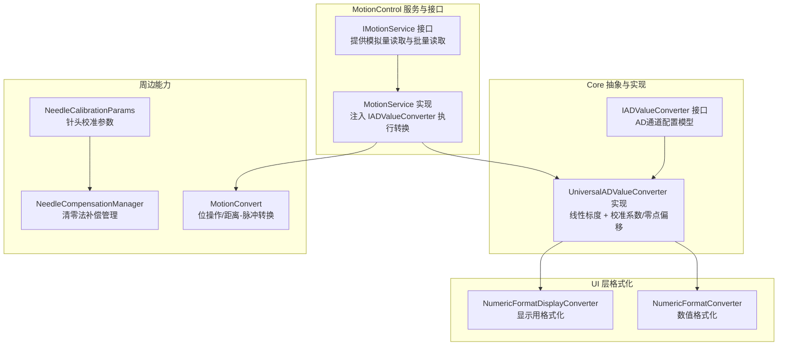
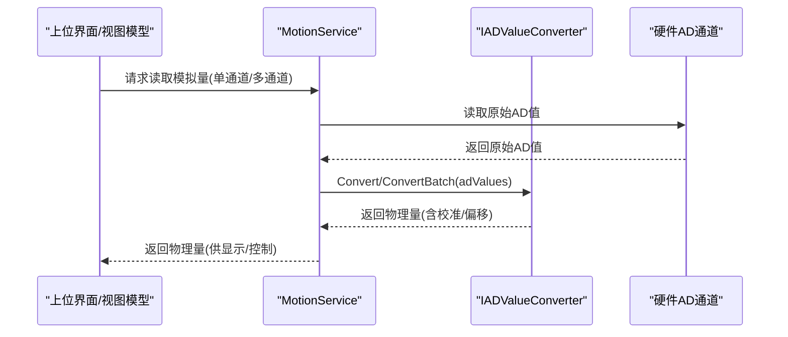
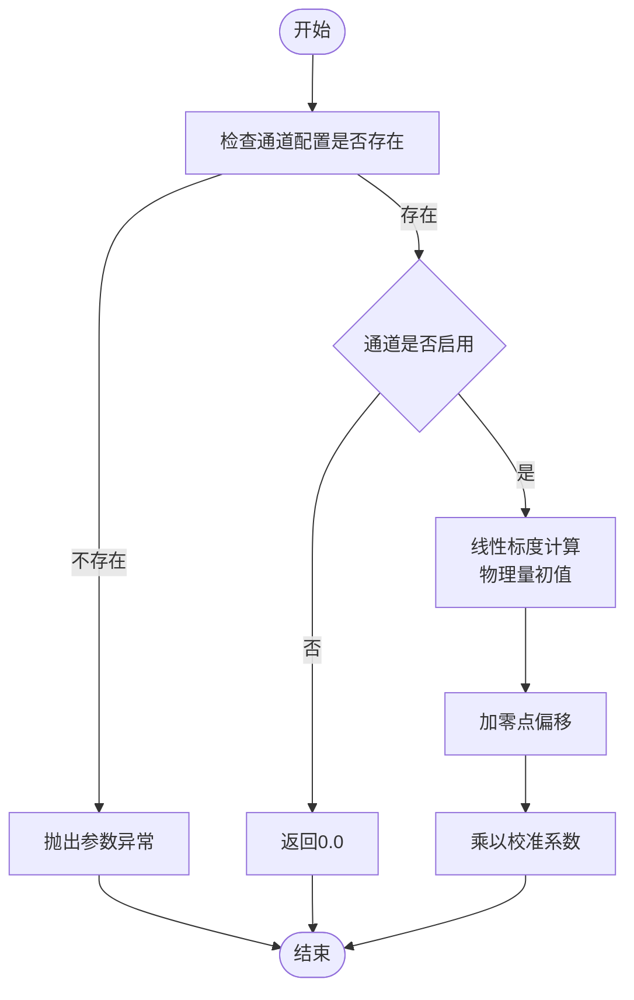
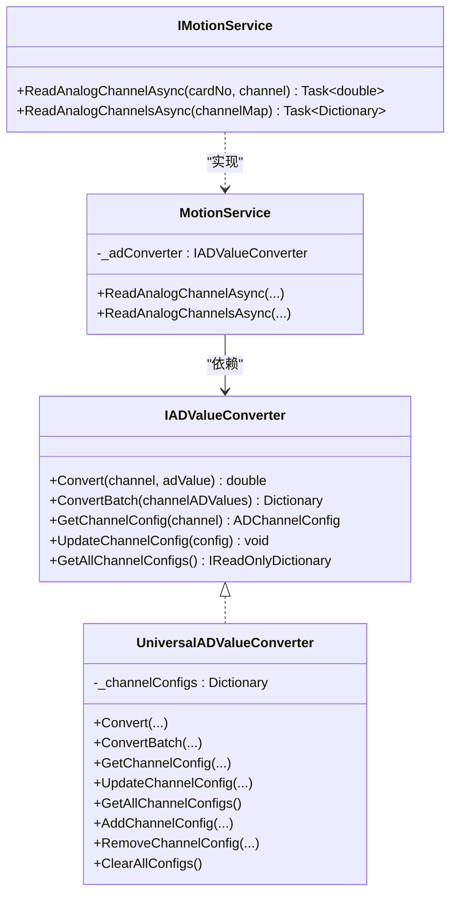
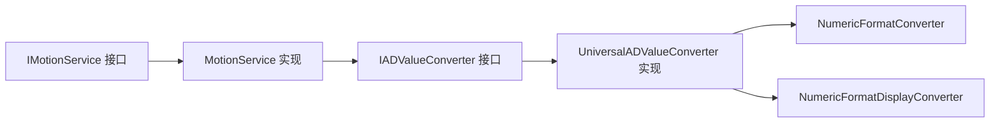

# 值转换服务

<cite>
**本文引用的文件**
- [IADValueConverter.cs](file://Core/Abstraction/IADValueConverter.cs)
- [UniversalADValueConverter.cs](file://Core/Services/UniversalADValueConverter.cs)
- [MotionConvert.cs](file://MotionControl/Card/MotionConvert.cs)
- [NumericFormatConverter.cs](file://Framework/Converters/NumericFormatConverter.cs)
- [NumericFormatDisplayConverter.cs](file://Framework/Converters/NumericFormatDisplayConverter.cs)
- [IMotionService.cs](file://MotionControl/Interfaces/IMotionService.cs)
- [MotionService.cs](file://MotionControl/Services/MotionService.cs)
- [NeedleCalibrationParams.cs](file://Core/Models/NeedleCalibrationParams.cs)
- [NeedleCompensationManager.cs](file://Core/Services/NeedleCompensationManager.cs)
</cite>

## 目录
1. [简介](#简介)
2. [项目结构](#项目结构)
3. [核心组件](#核心组件)
4. [架构总览](#架构总览)
5. [详细组件分析](#详细组件分析)
6. [依赖关系分析](#依赖关系分析)
7. [性能考量](#性能考量)
8. [故障排查指南](#故障排查指南)
9. [结论](#结论)
10. [附录](#附录)

## 简介
本文件面向值转换服务的技术文档，聚焦于通用AD值转换器UniversalADValueConverter及其接口IADValueConverter的设计与实现，系统阐述模拟量/数字量转换算法、标度变换、精度控制与误差处理机制，并结合运动控制、数据采集、状态监控等典型场景给出使用建议与最佳实践。同时，文档补充了与显示格式化、运动位移转换、针头校准补偿等周边能力的衔接方式，帮助读者在工程实践中高效、稳定地应用值转换服务。

## 项目结构
值转换服务位于Core层抽象与实现中，配合MotionControl层的服务与接口，形成“配置驱动 + 线性标度 + 校准补偿”的转换链路；UI层通过转换器对物理量进行格式化展示。

**图表来源**
- [IADValueConverter.cs:8-34](file://Core/Abstraction/IADValueConverter.cs#L8-L34)
- [UniversalADValueConverter.cs:8-130](file://Core/Services/UniversalADValueConverter.cs#L8-L130)
- [IMotionService.cs:85-89](file://MotionControl/Interfaces/IMotionService.cs#L85-L89)
- [MotionService.cs:34-35](file://MotionControl/Services/MotionService.cs#L34-L35)
- [NumericFormatConverter.cs:7-35](file://Framework/Converters/NumericFormatConverter.cs#L7-L35)
- [NumericFormatDisplayConverter.cs:7-29](file://Framework/Converters/NumericFormatDisplayConverter.cs#L7-L29)
- [MotionConvert.cs:9-87](file://MotionControl/Card/MotionConvert.cs#L9-L87)
- [NeedleCalibrationParams.cs:188-211](file://Core/Models/NeedleCalibrationParams.cs#L188-L211)
- [NeedleCompensationManager.cs:13-206](file://Core/Services/NeedleCompensationManager.cs#L13-L206)

**章节来源**
- [IADValueConverter.cs:1-91](file://Core/Abstraction/IADValueConverter.cs#L1-L91)
- [UniversalADValueConverter.cs:1-130](file://Core/Services/UniversalADValueConverter.cs#L1-L130)
- [IMotionService.cs:1-91](file://MotionControl/Interfaces/IMotionService.cs#L1-L91)
- [MotionService.cs:1-200](file://MotionControl/Services/MotionService.cs#L1-L200)
- [NumericFormatConverter.cs:1-35](file://Framework/Converters/NumericFormatConverter.cs#L1-L35)
- [NumericFormatDisplayConverter.cs:1-29](file://Framework/Converters/NumericFormatDisplayConverter.cs#L1-L29)
- [MotionConvert.cs:1-87](file://MotionControl/Card/MotionConvert.cs#L1-L87)
- [NeedleCalibrationParams.cs:188-211](file://Core/Models/NeedleCalibrationParams.cs#L188-L211)
- [NeedleCompensationManager.cs:1-206](file://Core/Services/NeedleCompensationManager.cs#L1-L206)

## 核心组件
- IADValueConverter接口：定义AD值到物理量的转换契约，支持单通道转换、批量转换、通道配置查询与更新。
- UniversalADValueConverter实现：基于线性标度公式，结合通道配置的最小/最大AD值与最小/最大物理量，再叠加零点偏移与校准系数，完成最终物理量输出；提供批量转换与异常容错。
- ADChannelConfig配置模型：承载通道编号、名称、AD范围、物理量范围、单位、启用状态、校准系数与零点偏移等关键参数。
- IMotionService/MotionService：在运动控制场景中，通过IADValueConverter将底层AD值转换为物理量，供力控、状态监控等模块使用。
- UI格式化转换器：NumericFormatConverter与NumericFormatDisplayConverter用于将物理量按指定格式显示，便于人机界面呈现。

**章节来源**
- [IADValueConverter.cs:8-34](file://Core/Abstraction/IADValueConverter.cs#L8-L34)
- [UniversalADValueConverter.cs:8-130](file://Core/Services/UniversalADValueConverter.cs#L8-L130)
- [NumericFormatConverter.cs:7-35](file://Framework/Converters/NumericFormatConverter.cs#L7-L35)
- [NumericFormatDisplayConverter.cs:7-29](file://Framework/Converters/NumericFormatDisplayConverter.cs#L7-L29)
- [IMotionService.cs:85-89](file://MotionControl/Interfaces/IMotionService.cs#L85-L89)
- [MotionService.cs:113-123](file://MotionControl/Services/MotionService.cs#L113-L123)

## 架构总览
值转换服务采用“接口抽象 + 单例实现 + 依赖注入”的架构，确保在不同模块中复用统一的转换逻辑。转换流程如下：

**图表来源**
- [IMotionService.cs:85-89](file://MotionControl/Interfaces/IMotionService.cs#L85-L89)
- [MotionService.cs:113-123](file://MotionControl/Services/MotionService.cs#L113-L123)
- [UniversalADValueConverter.cs:31-74](file://Core/Services/UniversalADValueConverter.cs#L31-L74)

## 详细组件分析

### IADValueConverter接口设计
- 职责边界清晰：面向“通道维度”的AD值到物理量转换，提供单通道与批量转换能力，以及通道配置的查询与更新。
- 配置驱动：通过ADChannelConfig承载标度与校准参数，避免硬编码，提升可维护性与可扩展性。
- 可观测性：接口定义明确的方法签名，便于在上层实现日志与异常上报。

**章节来源**
- [IADValueConverter.cs:8-34](file://Core/Abstraction/IADValueConverter.cs#L8-L34)

### UniversalADValueConverter实现
- 线性标度算法：依据通道配置的AD范围与物理量范围，采用线性插值计算物理量初值。
- 校准增强：先加零点偏移，再乘以校准系数，形成最终物理量输出。
- 批量容错：批量转换时捕获单通道异常，记录错误并返回默认值，保证整体流程不中断。
- 生命周期管理：提供配置的增删改查与清空能力，便于动态调整。

**图表来源**
- [UniversalADValueConverter.cs:31-52](file://Core/Services/UniversalADValueConverter.cs#L31-L52)

**章节来源**
- [UniversalADValueConverter.cs:8-130](file://Core/Services/UniversalADValueConverter.cs#L8-L130)

### ADChannelConfig配置模型
- 关键字段：通道号、名称、AD最小/最大值、物理量最小/最大值、单位、启用状态、校准系数、零点偏移。
- 默认值策略：为常见字段提供合理默认值，降低配置成本。
- 与转换器耦合：转换器严格依赖配置进行标度与校准，确保物理量一致性。

**章节来源**
- [IADValueConverter.cs:38-89](file://Core/Abstraction/IADValueConverter.cs#L38-L89)

### 与运动控制的集成
- IMotionService提供单通道与批量模拟量读取方法，内部通过IADValueConverter完成AD到物理量的转换。
- MotionService在构造函数中注入IADValueConverter，确保转换逻辑集中、可控且可替换。

**图表来源**
- [IADValueConverter.cs:8-34](file://Core/Abstraction/IADValueConverter.cs#L8-L34)
- [UniversalADValueConverter.cs:8-130](file://Core/Services/UniversalADValueConverter.cs#L8-L130)
- [IMotionService.cs:85-89](file://MotionControl/Interfaces/IMotionService.cs#L85-L89)
- [MotionService.cs:113-123](file://MotionControl/Services/MotionService.cs#L113-L123)

**章节来源**
- [IMotionService.cs:85-89](file://MotionControl/Interfaces/IMotionService.cs#L85-L89)
- [MotionService.cs:113-123](file://MotionControl/Services/MotionService.cs#L113-L123)

### 显示格式化与精度控制
- NumericFormatConverter：支持传入格式字符串或默认保留两位小数，将物理量转换为显示字符串。
- NumericFormatDisplayConverter：专用于显示层的格式化转换器，提供更灵活的格式化策略。
- 精度控制：通过格式化转换器的参数化控制，实现不同场景下的显示精度需求。

**章节来源**
- [NumericFormatConverter.cs:7-35](file://Framework/Converters/NumericFormatConverter.cs#L7-L35)
- [NumericFormatDisplayConverter.cs:7-29](file://Framework/Converters/NumericFormatDisplayConverter.cs#L7-L29)

### 与运动位移转换的关系
- MotionConvert提供位操作与距离/脉冲转换工具，适用于运动控制的位移标定与指令生成。
- 与值转换服务的分工：MotionConvert关注物理量与脉冲之间的机械标定；值转换服务关注AD原始值到物理量的电气标定与校准。

**章节来源**
- [MotionConvert.cs:9-87](file://MotionControl/Card/MotionConvert.cs#L9-L87)

### 针头校准与补偿机制
- NeedleCalibrationParams：存储针头校准参数，包含基准与当前坐标、补偿向量及最后校准时间等。
- NeedleCompensationManager：实现清零法补偿逻辑，提供基准补偿与增量补偿的组合，计算总补偿值并支持参数序列化/反序列化。
- 与值转换服务的协同：补偿值可用于修正力控目标或显示值，确保长期稳定性与一致性。

**章节来源**
- [NeedleCalibrationParams.cs:188-211](file://Core/Models/NeedleCalibrationParams.cs#L188-L211)
- [NeedleCalibrationParams.cs:265-280](file://Core/Models/NeedleCalibrationParams.cs#L265-L280)
- [NeedleCompensationManager.cs:13-206](file://Core/Services/NeedleCompensationManager.cs#L13-L206)

## 依赖关系分析
- 接口与实现解耦：IADValueConverter作为抽象，UniversalADValueConverter作为具体实现，便于替换与测试。
- 服务依赖注入：MotionService通过构造函数注入IADValueConverter，符合依赖倒置原则。
- UI层解耦：显示格式化转换器独立于转换实现，便于在不同界面中复用。

**图表来源**
- [IADValueConverter.cs:8-34](file://Core/Abstraction/IADValueConverter.cs#L8-L34)
- [UniversalADValueConverter.cs:8-130](file://Core/Services/UniversalADValueConverter.cs#L8-L130)
- [IMotionService.cs:85-89](file://MotionControl/Interfaces/IMotionService.cs#L85-L89)
- [MotionService.cs:113-123](file://MotionControl/Services/MotionService.cs#L113-L123)
- [NumericFormatConverter.cs:7-35](file://Framework/Converters/NumericFormatConverter.cs#L7-L35)
- [NumericFormatDisplayConverter.cs:7-29](file://Framework/Converters/NumericFormatDisplayConverter.cs#L7-L29)

**章节来源**
- [IADValueConverter.cs:8-34](file://Core/Abstraction/IADValueConverter.cs#L8-L34)
- [UniversalADValueConverter.cs:8-130](file://Core/Services/UniversalADValueConverter.cs#L8-L130)
- [IMotionService.cs:85-89](file://MotionControl/Interfaces/IMotionService.cs#L85-L89)
- [MotionService.cs:113-123](file://MotionControl/Services/MotionService.cs#L113-L123)
- [NumericFormatConverter.cs:7-35](file://Framework/Converters/NumericFormatConverter.cs#L7-L35)
- [NumericFormatDisplayConverter.cs:7-29](file://Framework/Converters/NumericFormatDisplayConverter.cs#L7-L29)

## 性能考量
- 线性标度复杂度：单次转换为O(1)，批量转换为O(n)；内存占用主要取决于通道配置字典大小。
- 异常容错：批量转换时对单通道异常进行捕获与记录，避免影响整体流程，适合高频采集场景。
- 格式化开销：显示格式化为轻量级字符串转换，通常可忽略不计。
- 建议：在高频采集场景中，优先使用批量转换接口；对异常通道采用降级策略（如返回默认值）以保障系统稳定性。

[本节为通用性能讨论，无需特定文件来源]

## 故障排查指南
- 通道未配置：当通道配置缺失时，转换器会抛出参数异常。排查要点：确认通道配置是否正确加载与更新。
- 通道未启用：若通道被禁用，转换器返回0.0。排查要点：检查配置的启用状态与业务逻辑。
- 标度异常：若AD范围与物理量范围不匹配，可能导致输出异常。排查要点：核对MinADValue/MaxADValue与MinPhysicalValue/MaxPhysicalValue。
- 校准问题：零点偏移与校准系数过大或过小会影响最终物理量。排查要点：逐步调整并验证。
- 批量转换异常：单通道异常不会阻断整体流程，但需检查日志与通道映射是否正确。

**章节来源**
- [UniversalADValueConverter.cs:31-74](file://Core/Services/UniversalADValueConverter.cs#L31-L74)

## 结论
值转换服务通过接口抽象与实现分离，提供了稳定、可扩展的AD值到物理量转换能力。结合运动控制、数据采集与状态监控等场景，可实现从硬件原始信号到业务可用物理量的可靠转换。配合显示格式化与校准补偿机制，能够满足工业应用对精度、稳定性与可维护性的综合要求。

[本节为总结性内容，无需特定文件来源]

## 附录

### 使用示例与最佳实践
- 传感器数据处理
  - 单通道读取：通过IMotionService.ReadAnalogChannelAsync获取物理量，直接用于显示或控制。
  - 批量读取：通过IMotionService.ReadAnalogChannelsAsync一次性获取多个通道的物理量，提高吞吐。
  - 最佳实践：为每个通道配置合理的AD范围与物理量范围，确保线性标度准确；启用零点偏移与校准系数以消除系统误差。
- 设备信号转换
  - 将硬件AD值转换为标准物理量单位（如N），并与运动控制指令联动，实现闭环控制。
  - 对异常通道采用降级策略，避免影响整体流程。
- 显示数值格式化
  - 使用NumericFormatConverter/NumericFormatDisplayConverter按需控制显示精度与格式，提升人机交互体验。
- 场景应用
  - 运动控制：力控、位置监控、状态告警等。
  - 数据采集：多通道同步采集与可视化。
  - 状态监控：实时显示物理量趋势与阈值对比。
- 校准机制
  - 通过NeedleCalibrationParams与NeedleCompensationManager实现长期稳定性与一致性，定期校准并记录校准结果。

**章节来源**
- [IMotionService.cs:85-89](file://MotionControl/Interfaces/IMotionService.cs#L85-L89)
- [MotionService.cs:113-123](file://MotionControl/Services/MotionService.cs#L113-L123)
- [NeedleCalibrationParams.cs:265-280](file://Core/Models/NeedleCalibrationParams.cs#L265-L280)
- [NeedleCompensationManager.cs:167-206](file://Core/Services/NeedleCompensationManager.cs#L167-L206)