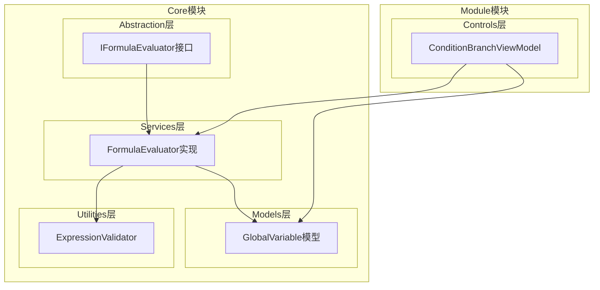
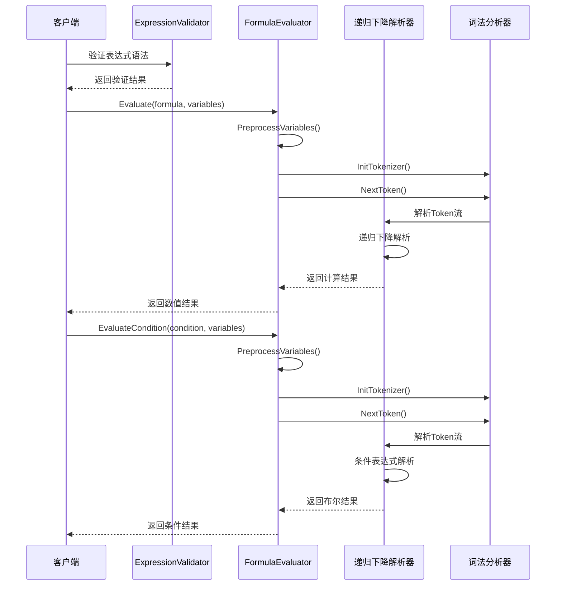
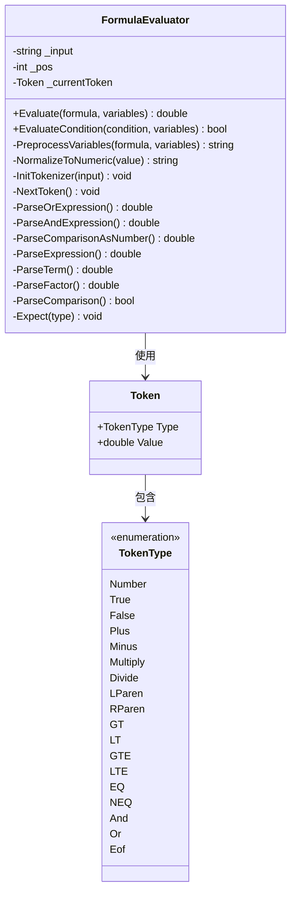
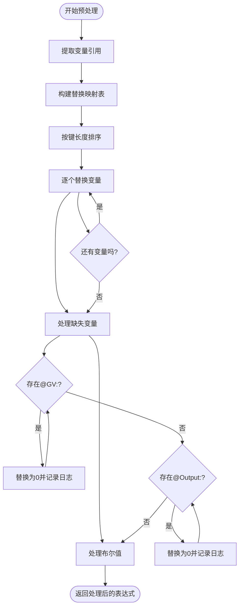
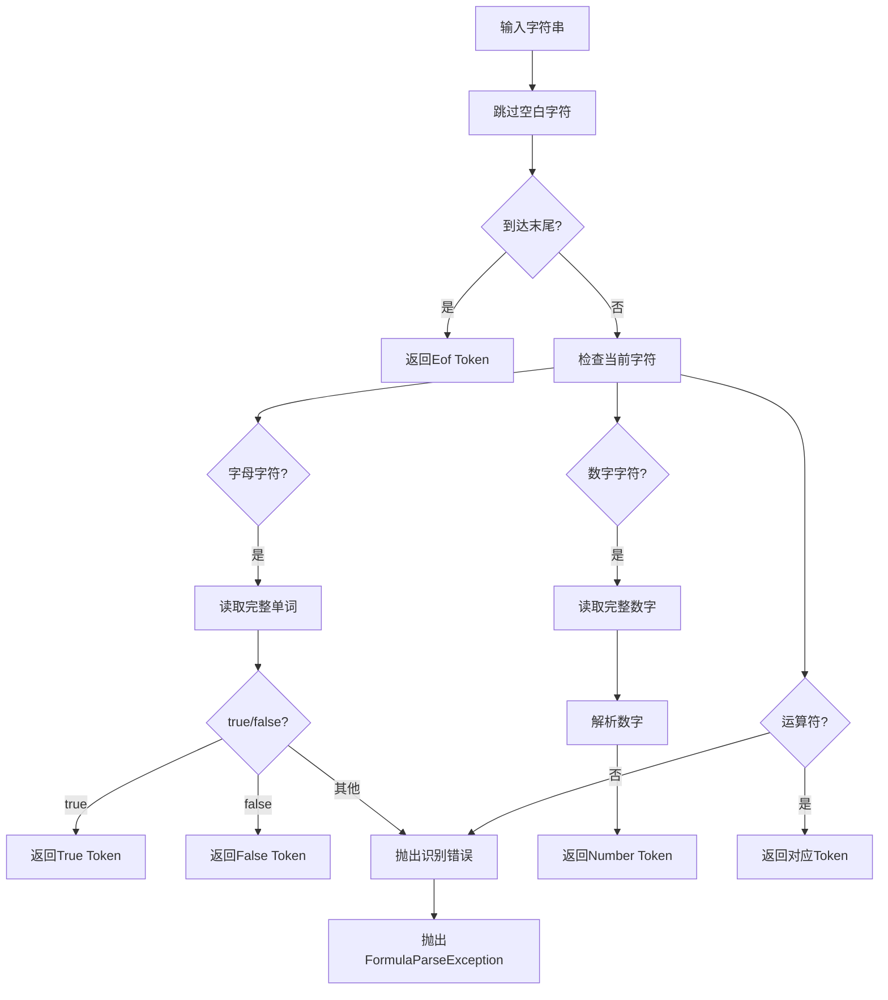
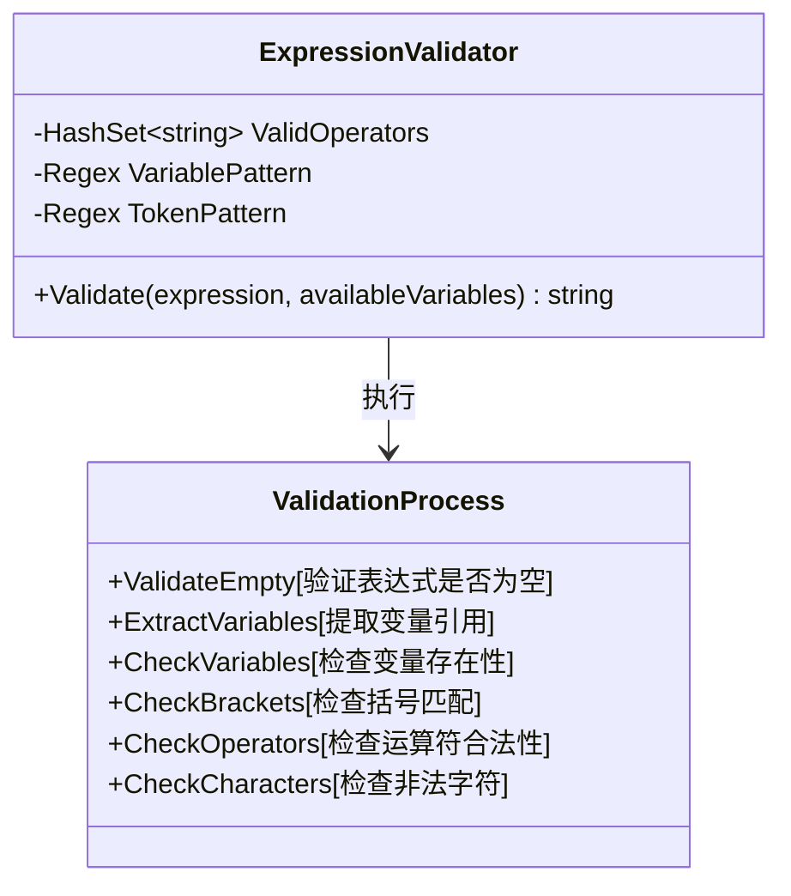
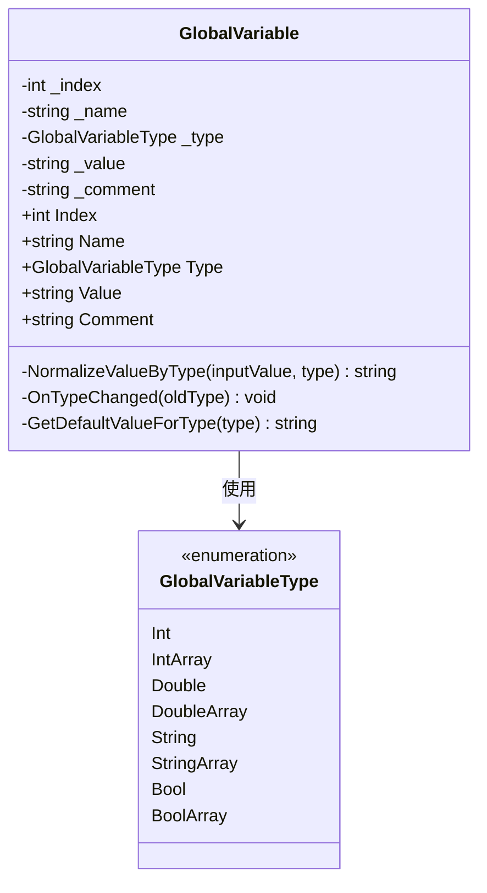
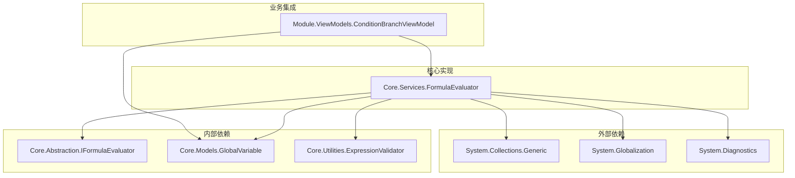

# 公式求值服务

<cite>
**本文档引用的文件**
- [IFormulaEvaluator.cs](file://Core/Abstraction/IFormulaEvaluator.cs)
- [FormulaEvaluator.cs](file://Core/Services/FormulaEvaluator.cs)
- [ExpressionValidator.cs](file://Core/Utilities/ExpressionValidator.cs)
- [GlobalVariable.cs](file://Core/Models/GlobalVariable.cs)
- [ConditionBranchViewModel.cs](file://Module/Controls/StepDetails/ConditionBranchViewModel.cs)
- [condition-expression-evaluation-plan.md](file://.trae/documents/condition-expression-evaluation-plan.md)
- [condition-branch-view-enhance/spec.md](file://.trae/specs/condition-branch-view-enhance/spec.md)
</cite>

## 目录
1. [简介](#简介)
2. [项目结构](#项目结构)
3. [核心组件](#核心组件)
4. [架构概览](#架构概览)
5. [详细组件分析](#详细组件分析)
6. [依赖关系分析](#依赖关系分析)
7. [性能考虑](#性能考虑)
8. [故障排除指南](#故障排除指南)
9. [结论](#结论)
10. [附录](#附录)

## 简介

公式求值服务是一个轻量级的数学表达式求值器，专门设计用于工业自动化和配方管理系统中的动态计算需求。该服务提供了强大的公式解析能力，支持变量引用、数学运算、条件判断和布尔逻辑。

### 主要特性

- **变量引用支持**：支持全局变量(@GV:)和输出参数(@Output:)的动态引用
- **数学运算**：完整的四则运算支持，包括加减乘除和括号优先级
- **条件判断**：比较运算符(>, <, >=, <=, ==, !=)和布尔表达式
- **类型安全**：统一的字符串存储机制，支持多种数据类型
- **错误处理**：完善的异常捕获和错误恢复机制
- **性能优化**：递归下降解析器，内存友好设计

## 项目结构

公式求值服务位于Core模块中，采用清晰的分层架构设计：



**图表来源**
- [IFormulaEvaluator.cs:1-18](file://Core/Abstraction/IFormulaEvaluator.cs#L1-L18)
- [FormulaEvaluator.cs:1-336](file://Core/Services/FormulaEvaluator.cs#L1-L336)
- [ExpressionValidator.cs:1-99](file://Core/Utilities/ExpressionValidator.cs#L1-L99)

**章节来源**
- [IFormulaEvaluator.cs:1-18](file://Core/Abstraction/IFormulaEvaluator.cs#L1-L18)
- [FormulaEvaluator.cs:1-336](file://Core/Services/FormulaEvaluator.cs#L1-L336)

## 核心组件

### IFormulaEvaluator接口

接口定义了公式求值服务的核心功能，提供了两个主要方法：

- `Evaluate`：计算数学表达式的数值结果
- `EvaluateCondition`：计算条件表达式的布尔结果

### FormulaEvaluator实现

FormulaEvaluator类实现了IFormulaEvaluator接口，提供了完整的公式解析和计算功能。

**章节来源**
- [IFormulaEvaluator.cs:6-16](file://Core/Abstraction/IFormulaEvaluator.cs#L6-L16)
- [FormulaEvaluator.cs:13-336](file://Core/Services/FormulaEvaluator.cs#L13-L336)

## 架构概览

公式求值服务采用模块化设计，各组件职责明确：



**图表来源**
- [FormulaEvaluator.cs:23-57](file://Core/Services/FormulaEvaluator.cs#L23-L57)
- [ExpressionValidator.cs:34-96](file://Core/Utilities/ExpressionValidator.cs#L34-L96)

## 详细组件分析

### FormulaEvaluator类分析

FormulaEvaluator类是整个系统的核心，实现了完整的公式解析和计算逻辑。

#### 数据结构设计



**图表来源**
- [FormulaEvaluator.cs:14-329](file://Core/Services/FormulaEvaluator.cs#L14-L329)

#### 变量预处理机制

变量预处理是FormulaEvaluator的关键功能之一，负责将变量引用转换为实际数值：



**图表来源**
- [FormulaEvaluator.cs:63-105](file://Core/Services/FormulaEvaluator.cs#L63-L105)

**章节来源**
- [FormulaEvaluator.cs:63-116](file://Core/Services/FormulaEvaluator.cs#L63-L116)

#### 词法分析器实现

词法分析器负责将输入字符串转换为Token流：



**图表来源**
- [FormulaEvaluator.cs:120-196](file://Core/Services/FormulaEvaluator.cs#L120-L196)

**章节来源**
- [FormulaEvaluator.cs:120-196](file://Core/Services/FormulaEvaluator.cs#L120-L196)

#### 递归下降解析器

递归下降解析器实现了完整的表达式语法分析：

```mermaid
flowchart TD
Start([开始解析]) --> ParseOrExpr[ParseOrExpression]
ParseOrExpr --> CheckOr{遇到||?}
CheckOr --> |是| ParseAndExpr[ParseAndExpression]
ParseAndExpr --> CombineOr[合并逻辑或]
CombineOr --> CheckOr
CheckOr --> |否| ParseComparison[ParseComparison]
ParseComparison --> ParseExpression[ParseExpression]
ParseExpression --> CheckOp{遇到运算符?}
CheckOp --> |+/-| ParseTerm[ParseTerm]
ParseTerm --> ApplyOp[应用运算符]
ApplyOp --> CheckOp
CheckOp --> |否| ReturnResult[返回结果]
ParseExpression --> ParseTerm
ParseTerm --> CheckMulDiv{遇到*/?}
CheckMulDiv --> |是| ParseFactor[ParseFactor]
ParseFactor --> CheckDivision[检查除零]
CheckDivision --> ApplyMulDiv[应用乘除]
ApplyMulDiv --> CheckMulDiv
CheckMulDiv --> |否| ReturnTerm[返回项]
```

**图表来源**
- [FormulaEvaluator.cs:205-321](file://Core/Services/FormulaEvaluator.cs#L205-L321)

**章节来源**
- [FormulaEvaluator.cs:205-321](file://Core/Services/FormulaEvaluator.cs#L205-L321)

### ExpressionValidator类分析

ExpressionValidator提供了表达式的语法验证功能：



**图表来源**
- [ExpressionValidator.cs:13-99](file://Core/Utilities/ExpressionValidator.cs#L13-L99)

**章节来源**
- [ExpressionValidator.cs:13-99](file://Core/Utilities/ExpressionValidator.cs#L13-L99)

### GlobalVariable模型分析

GlobalVariable模型提供了统一的变量存储和类型验证机制：



**图表来源**
- [GlobalVariable.cs:14-148](file://Core/Models/GlobalVariable.cs#L14-L148)

**章节来源**
- [GlobalVariable.cs:14-148](file://Core/Models/GlobalVariable.cs#L14-L148)

## 依赖关系分析

公式求值服务的依赖关系清晰且模块化：



**图表来源**
- [FormulaEvaluator.cs:1-6](file://Core/Services/FormulaEvaluator.cs#L1-L6)
- [IFormulaEvaluator.cs:1-2](file://Core/Abstraction/IFormulaEvaluator.cs#L1-L2)
- [ExpressionValidator.cs:1-4](file://Core/Utilities/ExpressionValidator.cs#L1-L4)

**章节来源**
- [FormulaEvaluator.cs:1-6](file://Core/Services/FormulaEvaluator.cs#L1-L6)
- [IFormulaEvaluator.cs:1-2](file://Core/Abstraction/IFormulaEvaluator.cs#L1-L2)

## 性能考虑

公式求值服务在设计时充分考虑了性能优化：

### 时间复杂度分析

- **词法分析**：O(n)，其中n为表达式长度
- **语法分析**：O(n)，递归下降解析器的线性时间复杂度
- **变量替换**：O(k*m)，其中k为变量数量，m为平均替换次数
- **整体复杂度**：O(n + k*m)

### 内存使用优化

- **Token复用**：使用结构体存储Token，减少内存分配
- **字符串处理**：采用StringBuilder模式，避免大量字符串拼接
- **递归深度**：通过迭代优化减少栈空间使用

### 错误处理性能

- **异常捕获**：仅在必要时抛出异常，避免频繁的异常开销
- **早期退出**：在发现错误时立即停止解析，减少无效计算
- **缓存机制**：对常用变量值进行缓存，避免重复计算

## 故障排除指南

### 常见问题及解决方案

#### 1. 表达式解析错误

**问题症状**：公式求值返回0或抛出FormulaParseException异常

**可能原因**：
- 表达式包含非法字符
- 括号不匹配
- 变量名不存在

**解决步骤**：
1. 使用ExpressionValidator.validate()方法验证表达式
2. 检查变量引用是否正确
3. 确认运算符使用是否符合语法规范

#### 2. 变量替换问题

**问题症状**：@GV:或@Output:变量未被正确替换

**可能原因**：
- 变量名格式不正确
- 变量值为空或null
- 变量名冲突

**解决步骤**：
1. 确认变量名格式为"@GV:变量名"或"@Output:变量名"
2. 检查变量值是否为有效的数值或布尔值
3. 避免变量名长度冲突

#### 3. 除零错误

**问题症状**：公式求值抛出除零异常

**解决步骤**：
1. 在表达式中添加零值检查
2. 使用条件表达式避免除零情况
3. 在业务逻辑中预处理可能的零值

**章节来源**
- [FormulaEvaluator.cs:34-38](file://Core/Services/FormulaEvaluator.cs#L34-L38)
- [FormulaEvaluator.cs:52-56](file://Core/Services/FormulaEvaluator.cs#L52-L56)

## 结论

公式求值服务是一个设计精良、功能完备的轻量级表达式求值器。它成功地平衡了功能完整性与性能效率，在工业自动化和配方管理场景中表现出色。

### 主要优势

1. **模块化设计**：清晰的分层架构，易于维护和扩展
2. **类型安全**：统一的字符串存储机制，支持多种数据类型
3. **错误处理**：完善的异常捕获和错误恢复机制
4. **性能优化**：递归下降解析器，内存友好设计
5. **业务集成**：与配方管理和条件分支功能无缝集成

### 应用场景

- **配方管理**：动态参数计算和条件判断
- **参数验证**：实时参数值验证和范围检查
- **动态计算**：运行时的数学表达式计算
- **条件分支**：基于表达式的流程控制

## 附录

### 语法规范

#### 支持的操作符

| 操作符 | 类型 | 描述 | 示例 |
|--------|------|------|------|
| + | 算术 | 加法 | a + b |
| - | 算术 | 减法 | a - b |
| * | 算术 | 乘法 | a * b |
| / | 算术 | 除法 | a / b |
| > | 比较 | 大于 | a > b |
| < | 比较 | 小于 | a < b |
| >= | 比较 | 大于等于 | a >= b |
| <= | 比较 | 小于等于 | a <= b |
| == | 比较 | 等于 | a == b |
| != | 比较 | 不等于 | a != b |
| ! | 逻辑 | 非 | !condition |
| && | 逻辑 | 与 | condition1 && condition2 |
| \|\| | 逻辑 | 或 | condition1 \|\| condition2 |

#### 变量引用格式

- **全局变量**：@GV:变量名
- **输出参数**：@Output:参数名

#### 布尔值处理

- 字符串"true"/"false"自动转换为数值1/0
- 布尔字面量true/false直接参与计算
- 非零数值被视为true，零值被视为false

### 使用示例

#### 数学表达式计算

```csharp
// 基本算术运算
string formula1 = "@GV:H2 - @GV:Slot + 0.27";
double result1 = evaluator.Evaluate(formula1, variables);

// 复杂表达式
string formula2 = "(@Output:测量值 * 2) / (@GV:系数 + 1)";
double result2 = evaluator.Evaluate(formula2, variables);
```

#### 条件判断

```csharp
// 基本条件判断
string condition1 = "@GV:温度 > 100";
bool result1 = evaluator.EvaluateCondition(condition1, variables);

// 复合条件
string condition2 = "(@Output:压力 > 50) && (@GV:状态 == true)";
bool result2 = evaluator.EvaluateCondition(condition2, variables);
```

#### 参数引用

```csharp
// 全局变量引用
Dictionary<string, string> variables = new()
{
    {"@GV:温度", "85.5"},
    {"@GV:压力", "120"},
    {"@Output:测量值", "95.2"}
};

string formula = "@GV:温度 + @Output:测量值";
double result = evaluator.Evaluate(formula, variables);
```

### 性能优化建议

1. **表达式缓存**：对常用表达式进行缓存，避免重复解析
2. **变量预处理**：在批量计算时预先处理变量值
3. **错误预防**：使用ExpressionValidator提前验证表达式
4. **内存管理**：及时释放不再使用的变量引用
5. **并发安全**：在多线程环境中注意FormulaEvaluator的线程安全性