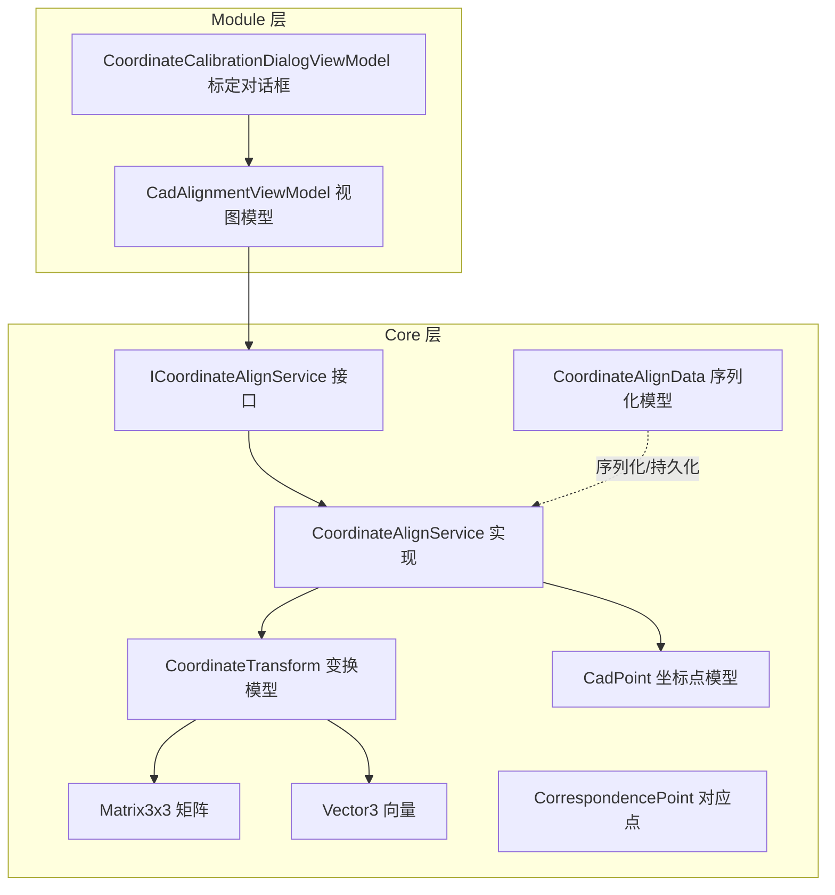
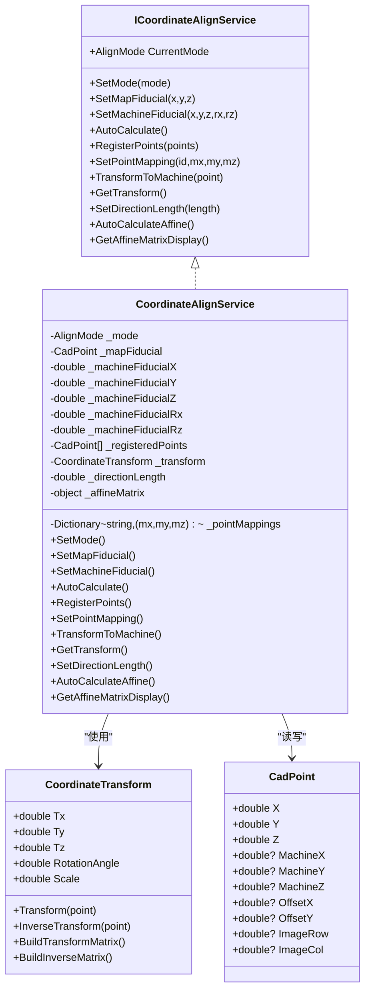
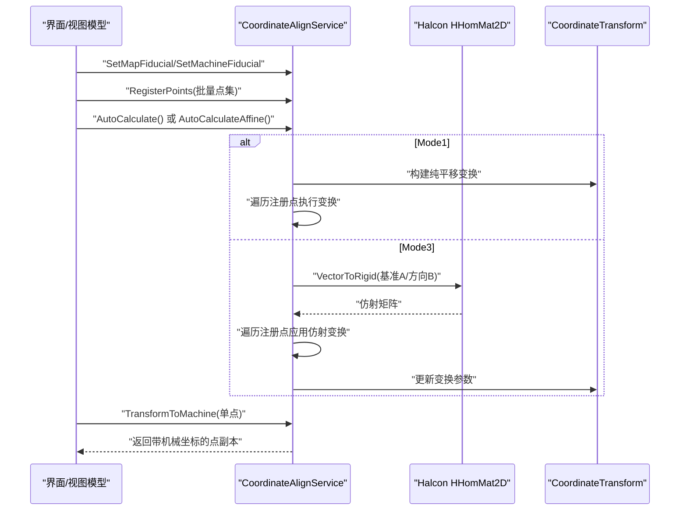
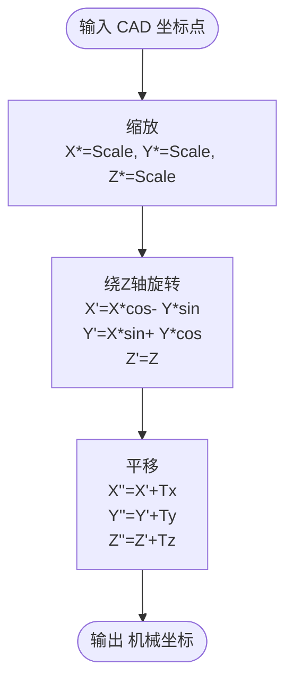
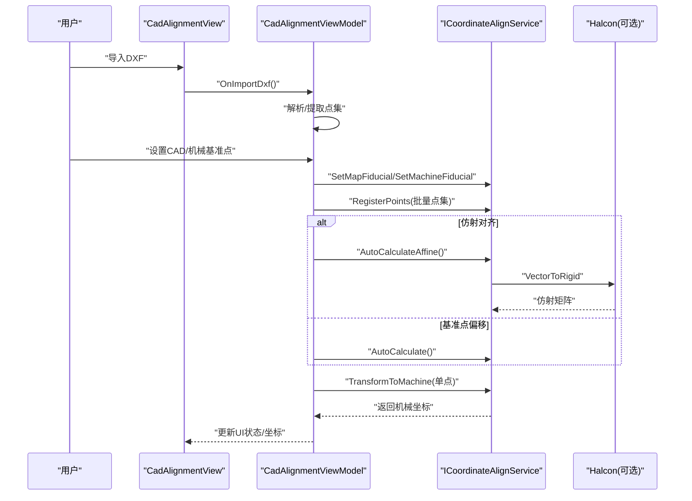
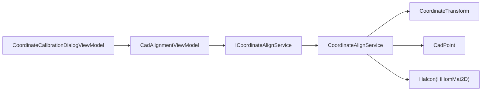

# 坐标对齐服务

<cite>
**本文档引用的文件**
- [ICoordinateAlignService.cs](file://Core/Services/ICoordinateAlignService.cs)
- [CoordinateAlignService.cs](file://Core/Services/CoordinateAlignService.cs)
- [CoordinateTransform.cs](file://Core/Models/CoordinateTransform.cs)
- [CadPoint.cs](file://Core/Models/CadPoint.cs)
- [CoordinateAlignData.cs](file://Core/Models/CoordinateAlignData.cs)
- [Matrix3x3.cs](file://Core/Models/Matrix3x3.cs)
- [Vector3.cs](file://Core/Models/Vector3.cs)
- [CorrespondencePoint.cs](file://Core/Models/CorrespondencePoint.cs)
- [CadAlignmentViewModel.cs](file://Module/Controls/Cad/CadAlignmentViewModel.cs)
- [CoordinateCalibrationDialogViewModel.cs](file://Module/Controls/Dialogs/CoordinateCalibrationDialogViewModel.cs)
- [CalibrationConfig.cs](file://Core/Models/CalibrationConfig.cs)
</cite>

## 目录
1. [简介](#简介)
2. [项目结构](#项目结构)
3. [核心组件](#核心组件)
4. [架构总览](#架构总览)
5. [详细组件分析](#详细组件分析)
6. [依赖关系分析](#依赖关系分析)
7. [性能考虑](#性能考虑)
8. [故障排除指南](#故障排除指南)
9. [结论](#结论)
10. [附录](#附录)

## 简介
本文件面向坐标对齐服务的技术文档，围绕 ICoordinateAlignService 接口与 CoordinateAlignService 实现展开，系统阐述坐标变换算法、对齐策略、精度评估与误差补偿方法，并结合模块化视图模型展示在视觉定位、装配对准、测量校准等场景中的应用。文档同时提供使用示例、最佳实践与排障建议，帮助开发者与使用者高效落地坐标对齐功能。

## 项目结构
坐标对齐服务位于 Core 层，提供跨模块复用的坐标转换能力；模块层的 CadAlignmentViewModel 将对齐服务与 UI 流程集成，形成“DXF导入—基准点设置—全局偏移—旋转角度—坐标变换—夹爪定位”的完整工作流。

**图表来源**
- [ICoordinateAlignService.cs:26-88](file://Core/Services/ICoordinateAlignService.cs#L26-L88)
- [CoordinateAlignService.cs:14-406](file://Core/Services/CoordinateAlignService.cs#L14-L406)
- [CoordinateTransform.cs:10-186](file://Core/Models/CoordinateTransform.cs#L10-L186)
- [CadPoint.cs:6-103](file://Core/Models/CadPoint.cs#L6-L103)
- [CoordinateAlignData.cs:9-41](file://Core/Models/CoordinateAlignData.cs#L9-L41)
- [Matrix3x3.cs:5-59](file://Core/Models/Matrix3x3.cs#L5-L59)
- [Vector3.cs:5-18](file://Core/Models/Vector3.cs#L5-L18)
- [CorrespondencePoint.cs:9-43](file://Core/Models/CorrespondencePoint.cs#L9-L43)
- [CadAlignmentViewModel.cs:64-142](file://Module/Controls/Cad/CadAlignmentViewModel.cs#L64-L142)
- [CoordinateCalibrationDialogViewModel.cs:30-112](file://Module/Controls/Dialogs/CoordinateCalibrationDialogViewModel.cs#L30-L112)

**章节来源**
- [ICoordinateAlignService.cs:26-88](file://Core/Services/ICoordinateAlignService.cs#L26-L88)
- [CoordinateAlignService.cs:14-406](file://Core/Services/CoordinateAlignService.cs#L14-L406)
- [CadAlignmentViewModel.cs:64-142](file://Module/Controls/Cad/CadAlignmentViewModel.cs#L64-L142)

## 核心组件
- ICoordinateAlignService：定义对齐模式、基准点设置、自动计算、批量注册、逐点映射、坐标转换、仿射计算与显示等契约。
- CoordinateAlignService：实现接口，维护基准点、变换矩阵、注册点集与映射表，支持三种对齐模式（基准点偏移、逐点映射、仿射对齐）。
- CoordinateTransform：封装平移、旋转（绕Z轴）、缩放的仿射变换参数，提供正/逆变换与矩阵构建。
- CadPoint：承载 CAD 与机械坐标，以及图像坐标、偏移坐标等中间态。
- CoordinateAlignData：对齐参数的序列化载体，便于保存/加载。
- Matrix3x3/Vector3：基础数学工具，支撑变换矩阵运算与向量乘法。
- CorrespondencePoint：对应点模型，用于视觉/测量对比与误差分析。
- CadAlignmentViewModel：将对齐服务与 DXF 导入、偏移、旋转、变换、夹爪定位等步骤串联，形成完整流程。
- CoordinateCalibrationDialogViewModel：提供相机到夹爪的刚体变换计算，辅助坐标系标定。

**章节来源**
- [ICoordinateAlignService.cs:26-88](file://Core/Services/ICoordinateAlignService.cs#L26-L88)
- [CoordinateAlignService.cs:14-406](file://Core/Services/CoordinateAlignService.cs#L14-L406)
- [CoordinateTransform.cs:10-186](file://Core/Models/CoordinateTransform.cs#L10-L186)
- [CadPoint.cs:6-103](file://Core/Models/CadPoint.cs#L6-L103)
- [CoordinateAlignData.cs:9-41](file://Core/Models/CoordinateAlignData.cs#L9-L41)
- [Matrix3x3.cs:5-59](file://Core/Models/Matrix3x3.cs#L5-L59)
- [Vector3.cs:5-18](file://Core/Models/Vector3.cs#L5-L18)
- [CorrespondencePoint.cs:9-43](file://Core/Models/CorrespondencePoint.cs#L9-L43)
- [CadAlignmentViewModel.cs:64-142](file://Module/Controls/Cad/CadAlignmentViewModel.cs#L64-L142)
- [CoordinateCalibrationDialogViewModel.cs:30-112](file://Module/Controls/Dialogs/CoordinateCalibrationDialogViewModel.cs#L30-L112)

## 架构总览
坐标对齐服务采用接口-实现分离设计，核心职责如下：
- 模式管理：在基准点偏移、逐点映射、仿射对齐之间切换。
- 基准点与注册点：维护 CAD/机械基准点，批量注册待转换点集。
- 变换计算：提供纯平移、仿射（平移+旋转+缩放）两种计算路径，并兼容回退策略。
- 坐标转换：支持单点正/逆变换与批量转换，输出机械坐标。
- UI 集成：与视图模型协作，完成 DXF 导入、偏移、旋转、变换与夹爪定位。

**图表来源**
- [ICoordinateAlignService.cs:26-88](file://Core/Services/ICoordinateAlignService.cs#L26-L88)
- [CoordinateAlignService.cs:14-406](file://Core/Services/CoordinateAlignService.cs#L14-L406)
- [CoordinateTransform.cs:10-186](file://Core/Models/CoordinateTransform.cs#L10-L186)
- [CadPoint.cs:6-103](file://Core/Models/CadPoint.cs#L6-L103)

## 详细组件分析

### ICoordinateAlignService 接口设计
- 对齐模式：FirstPoint（基准点偏移）、AllPoints（逐点映射）、Affine（仿射对齐）。
- 基准点设置：分别设置 CAD 图纸基准点与机械基准点（含 Rx/Rz 旋转）。
- 自动计算：Mode1 执行纯平移；Mode3 使用 Halcon 计算仿射矩阵。
- 批量与映射：注册点集用于批量转换；映射表用于逐点查找。
- 坐标转换：TransformToMachine 返回带机械坐标的副本；GetTransform 提供当前变换对象。
- 仿射显示：GetAffineMatrixDisplay 输出仿射矩阵文本，便于 UI 展示。

**章节来源**
- [ICoordinateAlignService.cs:10-88](file://Core/Services/ICoordinateAlignService.cs#L10-L88)

### CoordinateAlignService 实现机制
- 模式与基准点配置：SetMode/SetMapFiducial/SetMachineFiducial 支持动态切换与参数更新。
- Mode1 自动计算：基于 CAD/机械基准点差值构建纯平移变换，遍历注册点执行变换并回写 MachineX/Y/Z。
- 注册点管理：RegisterPoints 清空并重填，确保与输入一致。
- Mode2 逐点映射：SetPointMapping 将 pointId 映射到 (mx,my,mz)，TransformToMachine 优先查表，兜底最近点匹配，最后原点回退。
- 坐标转换：TransformToMachine 返回新实例，避免污染原始点；逆变换由 CoordinateTransform.InverseTransform 提供。
- Mode3 仿射对齐：AutoCalculateAffine 自动生成方向点 B，使用 Halcon HHomMat2D.VectorToRigid 计算仿射矩阵；失败时回退纯平移并标记；GetAffineMatrixDisplay 输出 Tx/Ty 或回退提示。
- 变换查询：GetTransform 返回当前 CoordinateTransform。

**图表来源**
- [CoordinateAlignService.cs:104-373](file://Core/Services/CoordinateAlignService.cs#L104-L373)
- [CoordinateTransform.cs:68-136](file://Core/Models/CoordinateTransform.cs#L68-L136)

**章节来源**
- [CoordinateAlignService.cs:70-373](file://Core/Services/CoordinateAlignService.cs#L70-L373)

### CoordinateTransform 变换模型
- 参数：Tx/Ty/Tz（平移）、RotationAngle（绕Z轴旋转）、Scale（缩放）。
- 正变换：缩放 → 旋转 → 平移，输出机械坐标。
- 逆变换：逆平移 → 逆旋转 → 逆缩放，还原 CAD 坐标。
- 矩阵构建：BuildTransformMatrix/BuildInverseMatrix 提供 3×3 齐次变换矩阵，支持组合与还原。

**图表来源**
- [CoordinateTransform.cs:68-98](file://Core/Models/CoordinateTransform.cs#L68-L98)

**章节来源**
- [CoordinateTransform.cs:10-186](file://Core/Models/CoordinateTransform.cs#L10-L186)

### CadPoint 与中间态
- 字段覆盖：X/Y/Z 原始 CAD 坐标；MachineX/MachineY/MachineZ 为对齐后机械坐标；OffsetX/OffsetY 为全局偏移后的中间态；ImageRow/ImageCol 为图像坐标。
- 用途：作为对齐服务的输入/输出载体，贯穿 DXF 导入、偏移、旋转、变换与夹爪定位全流程。

**章节来源**
- [CadPoint.cs:6-103](file://Core/Models/CadPoint.cs#L6-L103)

### 序列化与持久化
- CoordinateAlignData：保存 AlignMode、CAD/机械基准点、Rx/Rz、方向长度等，便于工程化保存/加载。
- 与 UI 集成：视图模型在 DXF 导入后更新点集与状态，配合序列化实现流程闭环。

**章节来源**
- [CoordinateAlignData.cs:9-41](file://Core/Models/CoordinateAlignData.cs#L9-L41)
- [CadAlignmentViewModel.cs:800-879](file://Module/Controls/Cad/CadAlignmentViewModel.cs#L800-L879)

### UI 集成与工作流
- CadAlignmentViewModel：提供五步对位流程（回转中心拟合、全局偏移、旋转角度、坐标变换、夹爪定位），并与对齐服务交互。
- CoordinateCalibrationDialogViewModel：提供相机到夹爪的刚体变换计算，辅助坐标系标定。

**图表来源**
- [CadAlignmentViewModel.cs:800-879](file://Module/Controls/Cad/CadAlignmentViewModel.cs#L800-L879)
- [ICoordinateAlignService.cs:35-88](file://Core/Services/ICoordinateAlignService.cs#L35-L88)
- [CoordinateAlignService.cs:300-373](file://Core/Services/CoordinateAlignService.cs#L300-L373)

**章节来源**
- [CadAlignmentViewModel.cs:64-1599](file://Module/Controls/Cad/CadAlignmentViewModel.cs#L64-L1599)
- [CoordinateCalibrationDialogViewModel.cs:30-112](file://Module/Controls/Dialogs/CoordinateCalibrationDialogViewModel.cs#L30-L112)

## 依赖关系分析
- 内聚性：CoordinateAlignService 聚合基准点、注册点、映射表与变换对象，职责清晰。
- 耦合度：与 Halcon 的耦合通过延迟初始化与异常回退降低；与 UI 的耦合通过接口与事件解耦。
- 外部依赖：Halcon 仅在仿射对齐时使用；Math/集合/LINQ 为主要算法依赖。
- 循环依赖：未见循环依赖迹象。

**图表来源**
- [CoordinateAlignService.cs:316-373](file://Core/Services/CoordinateAlignService.cs#L316-L373)
- [ICoordinateAlignService.cs:26-88](file://Core/Services/ICoordinateAlignService.cs#L26-L88)
- [CadAlignmentViewModel.cs:64-142](file://Module/Controls/Cad/CadAlignmentViewModel.cs#L64-L142)
- [CoordinateCalibrationDialogViewModel.cs:30-112](file://Module/Controls/Dialogs/CoordinateCalibrationDialogViewModel.cs#L30-L112)

**章节来源**
- [CoordinateAlignService.cs:14-406](file://Core/Services/CoordinateAlignService.cs#L14-L406)
- [ICoordinateAlignService.cs:26-88](file://Core/Services/ICoordinateAlignService.cs#L26-L88)

## 性能考虑
- 批量转换：Mode1/3 通过遍历注册点执行变换，建议在 UI 层采用批量更新（如 ViewModel 的批量更新事件）减少渲染抖动。
- Halcon 依赖：仿射对齐仅在需要时初始化 HHomMat2D，异常时回退纯平移，避免阻塞主线程。
- 字符串匹配兜底：Mode2 的最近点匹配采用编辑距离，复杂度较高，建议扩展映射结构同时存储 CAD 坐标以提升匹配效率。
- 矩阵运算：CoordinateTransform 的 BuildTransformMatrix/BuildInverseMatrix 为 O(1) 矩阵构建，适合频繁调用。

[本节为通用性能讨论，无需具体文件分析]

## 故障排除指南
- 仿射对齐失败：当 Halcon 不可用或计算异常时，服务回退到纯平移，并在 UI 文本中标注回退信息。检查 Halcon 依赖与 VectorToRigid 输入有效性。
- 逐点映射缺失：TransformToMachine 查找不到映射时，尝试最近点匹配；若仍失败，返回原点（Machine 坐标为空）。建议完善映射表或扩展 CAD 坐标存储。
- DXF 导入失败：检查文件路径、格式与解析服务可用性；必要时使用回退解析方法。
- 旋转角度异常：确保基准/目标线段选取正确，避免重复点与索引越界。

**章节来源**
- [CoordinateAlignService.cs:354-373](file://Core/Services/CoordinateAlignService.cs#L354-L373)
- [CadAlignmentViewModel.cs:800-879](file://Module/Controls/Cad/CadAlignmentViewModel.cs#L800-L879)

## 结论
坐标对齐服务通过清晰的接口设计与稳健的实现，提供了从基准点偏移到仿射对齐的多种策略，满足视觉定位、装配对准、测量校准等场景需求。结合模块化的视图模型与 UI 事件，实现了从 DXF 导入到夹爪定位的完整工作流。建议在生产环境中强化映射表与 Halcon 依赖的健壮性，并利用批量更新与矩阵运算优化提升整体性能与稳定性。

[本节为总结性内容，无需具体文件分析]

## 附录

### 使用示例与最佳实践
- 多坐标系转换
  - 基于基准点偏移：设置 CAD/机械基准点，调用 AutoCalculate，批量转换注册点。
  - 逐点映射：为关键点设置映射，使用 TransformToMachine 获取机械坐标。
  - 仿射对齐：设置方向长度，调用 AutoCalculateAffine，查看 GetAffineMatrixDisplay。
- 对齐参数计算
  - 通过视图模型完成 DXF 导入、偏移、旋转角度计算与坐标变换，最终得到夹爪定位坐标。
- 质量检测与误差补偿
  - 使用 CorrespondencePoint 记录理论/实际坐标，结合 CoordinateTransform 的逆变换进行误差分析。
  - 标定对话框提供相机到夹爪的刚体变换，辅助系统级校准。
- 自动校准
  - 利用智能推荐线段策略自动选取基准/目标线段，减少人工干预。

**章节来源**
- [CadAlignmentViewModel.cs:64-1599](file://Module/Controls/Cad/CadAlignmentViewModel.cs#L64-L1599)
- [CoordinateCalibrationDialogViewModel.cs:30-112](file://Module/Controls/Dialogs/CoordinateCalibrationDialogViewModel.cs#L30-L112)
- [CorrespondencePoint.cs:9-43](file://Core/Models/CorrespondencePoint.cs#L9-L43)
- [CalibrationConfig.cs:17-26](file://Core/Models/CalibrationConfig.cs#L17-L26)