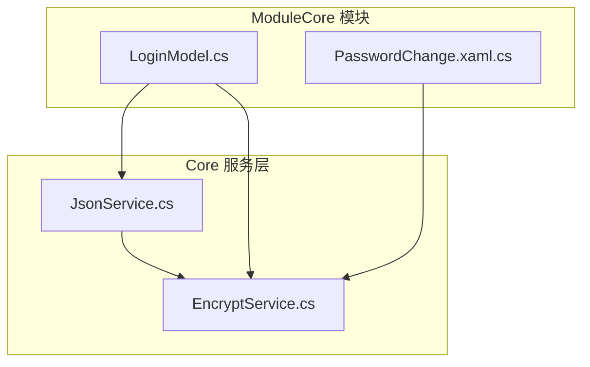
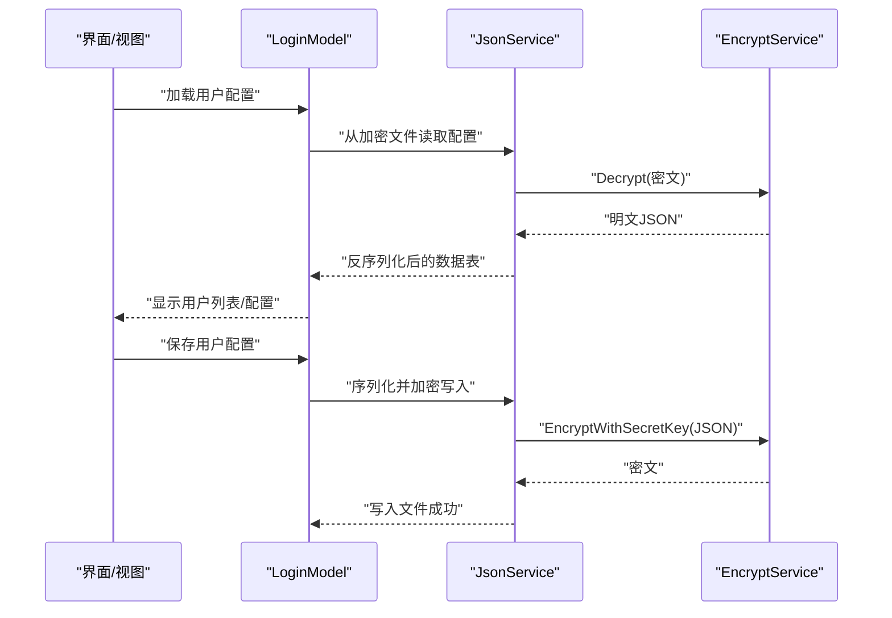
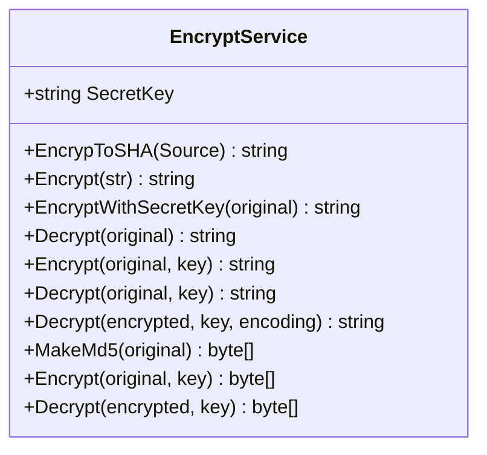
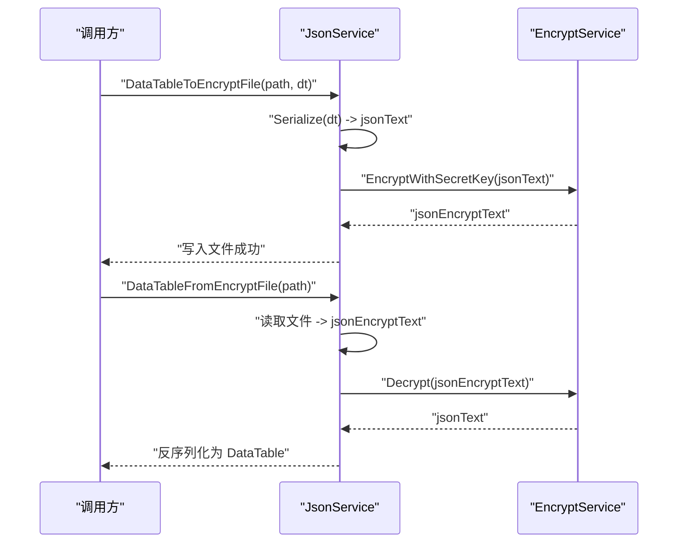
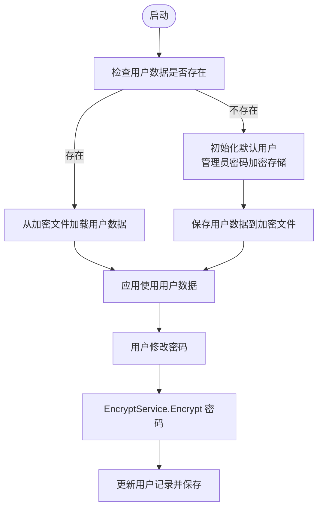
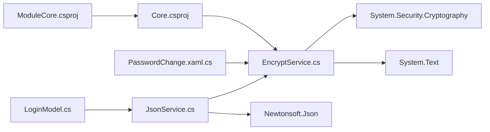

# 安全加密服务

<cite>
**本文引用的文件**
- [EncryptService.cs](file://Core/Services/EncryptService.cs)
- [JsonService.cs](file://Core/Services/JsonService.cs)
- [LoginModel.cs](file://ModuleCore/Models/LoginModel.cs)
- [PasswordChange.xaml.cs](file://ModuleCore/Views/PasswordChange.xaml.cs)
- [Core.csproj](file://Core/Core.csproj)
- [ModuleCore.csproj](file://ModuleCore/ModuleCore.csproj)
</cite>

## 目录
1. [简介](#简介)
2. [项目结构](#项目结构)
3. [核心组件](#核心组件)
4. [架构总览](#架构总览)
5. [详细组件分析](#详细组件分析)
6. [依赖关系分析](#依赖关系分析)
7. [性能与安全考量](#性能与安全考量)
8. [故障排查指南](#故障排查指南)
9. [结论](#结论)
10. [附录](#附录)

## 简介
本文件面向工业控制系统中的安全加密服务，围绕 Core.Services 模块中的 EncryptService 展开，系统性解析其设计原理与实现细节，涵盖以下内容：
- SHA256 哈希加密、MD5 加密、TripleDES 对称加密等核心算法的使用方式与适用场景
- 数据完整性校验、密码存储、敏感信息保护等工业控制典型应用
- API 使用示例（字符串加密解密、字节数组处理、密钥管理）
- 错误处理机制、最佳实践与安全建议

## 项目结构
本加密服务位于 Core.Services 命名空间下，主要文件如下：
- Core/Services/EncryptService.cs：加密服务核心类，提供哈希与对称加密能力
- Core/Services/JsonService.cs：基于 JSON 的数据序列化与加密存储工具，内部调用 EncryptService
- ModuleCore/Models/LoginModel.cs：用户认证与配置文件的加密读写示例
- ModuleCore/Views/PasswordChange.xaml.cs：密码变更流程中对密码进行加密存储

图表来源
- [EncryptService.cs:1-157](file://Core/Services/EncryptService.cs#L1-L157)
- [JsonService.cs:1-202](file://Core/Services/JsonService.cs#L1-L202)
- [LoginModel.cs:1-303](file://ModuleCore/Models/LoginModel.cs#L1-L303)
- [PasswordChange.xaml.cs:1-64](file://ModuleCore/Views/PasswordChange.xaml.cs#L1-L64)

章节来源
- [EncryptService.cs:1-157](file://Core/Services/EncryptService.cs#L1-L157)
- [JsonService.cs:1-202](file://Core/Services/JsonService.cs#L1-L202)
- [LoginModel.cs:1-303](file://ModuleCore/Models/LoginModel.cs#L1-L303)
- [PasswordChange.xaml.cs:1-64](file://ModuleCore/Views/PasswordChange.xaml.cs#L1-L64)

## 核心组件
- EncryptService：提供 SHA256 哈希、MD5 加密、基于 TripleDES 的对称加密/解密，以及密钥派生与默认密钥管理
- JsonService：封装 JSON 序列化与文件读写，并通过 EncryptService 实现“加密存储”
- LoginModel：在首次运行时初始化用户表（含默认管理员密码），并在后续持久化时使用加密存储
- PasswordChange：用户修改密码时对新密码进行加密并保存

章节来源
- [EncryptService.cs:1-157](file://Core/Services/EncryptService.cs#L1-L157)
- [JsonService.cs:1-202](file://Core/Services/JsonService.cs#L1-L202)
- [LoginModel.cs:106-208](file://ModuleCore/Models/LoginModel.cs#L106-L208)
- [PasswordChange.xaml.cs:52-62](file://ModuleCore/Views/PasswordChange.xaml.cs#L52-L62)

## 架构总览
加密服务在系统中的位置与调用关系如下：

图表来源
- [LoginModel.cs:106-208](file://ModuleCore/Models/LoginModel.cs#L106-L208)
- [JsonService.cs:53-81](file://Core/Services/JsonService.cs#L53-L81)
- [EncryptService.cs:59-72](file://Core/Services/EncryptService.cs#L59-L72)

## 详细组件分析

### EncryptService 类设计与实现
- 默认密钥：类静态构造函数中设定默认密钥，用于 EncryptWithSecretKey/Decrypt 的便捷接口
- 哈希算法：EncrypToSHA 使用 SHA256 对字符串进行哈希，输出 Base64 字符串
- MD5 加密：Encrypt 对字符串进行 MD5 计算，返回 32 位十六进制字符串；另提供 MakeMd5 生成字节数组摘要
- 对称加密：Encrypt(byte[], byte[]) 与 Decrypt(byte[], byte[]) 基于 TripleDES，密钥由 MD5(key) 派生，模式为 ECB
- 字符串接口：Encrypt(string, string)、Decrypt(string, string, Encoding) 提供字符串与密钥的便捷处理

图表来源
- [EncryptService.cs:7-156](file://Core/Services/EncryptService.cs#L7-L156)

章节来源
- [EncryptService.cs:12-156](file://Core/Services/EncryptService.cs#L12-L156)

### JsonService 与加密存储
- DataTableToEncryptFile：序列化 DataTable 为 JSON，再以默认密钥加密，写入文件
- DataTableFromEncryptFile：从文件读取密文，解密后反序列化为 DataTable
- 该流程确保本地配置与用户数据在磁盘上以密文形式存储，降低泄露风险

图表来源
- [JsonService.cs:53-81](file://Core/Services/JsonService.cs#L53-L81)
- [EncryptService.cs:59-72](file://Core/Services/EncryptService.cs#L59-L72)

章节来源
- [JsonService.cs:53-81](file://Core/Services/JsonService.cs#L53-L81)

### 用户认证与密码存储
- 首次运行：LoginModel 初始化用户表，管理员密码通过 Encrypt("Admin") 生成并存入
- 日常使用：用户修改密码时，PasswordChange 调用 EncryptService.Encrypt 对新密码进行加密后保存
- 配置持久化：认证配置（如自动注销时间）通过 JsonService 加密写入 Auth.config

图表来源
- [LoginModel.cs:106-208](file://ModuleCore/Models/LoginModel.cs#L106-L208)
- [PasswordChange.xaml.cs:52-62](file://ModuleCore/Views/PasswordChange.xaml.cs#L52-L62)

章节来源
- [LoginModel.cs:106-208](file://ModuleCore/Models/LoginModel.cs#L106-L208)
- [PasswordChange.xaml.cs:52-62](file://ModuleCore/Views/PasswordChange.xaml.cs#L52-L62)

## 依赖关系分析
- EncryptService 依赖 System.Security.Cryptography 与 System.Text
- JsonService 依赖 Newtonsoft.Json（通过 Core.csproj 引用）
- ModuleCore 依赖 Core，从而间接使用 EncryptService
- 项目通过 Core.csproj 和 ModuleCore.csproj 的引用关系形成模块化依赖

图表来源
- [EncryptService.cs:1-3](file://Core/Services/EncryptService.cs#L1-L3)
- [JsonService.cs:1-7](file://Core/Services/JsonService.cs#L1-L7)
- [Core.csproj:35-37](file://Core/Core.csproj#L35-L37)
- [ModuleCore.csproj:46-47](file://ModuleCore/ModuleCore.csproj#L46-L47)

章节来源
- [Core.csproj:11-41](file://Core/Core.csproj#L11-L41)
- [ModuleCore.csproj:10-48](file://ModuleCore/ModuleCore.csproj#L10-L48)

## 性能与安全考量

### 算法特性与适用场景
- SHA256 哈希
  - 用途：数据完整性校验、不可逆摘要
  - 特点：抗碰撞能力强，适合校验与日志记录
  - 复杂度：线性 O(n)，性能良好
- MD5 加密
  - 用途：快速摘要、兼容旧系统
  - 风险：已被证明存在碰撞漏洞，不适合安全敏感场景
  - 建议：仅用于非安全校验或历史兼容
- TripleDES 对称加密
  - 用途：本地敏感数据保护（如用户配置、密码）
  - 风险：ECB 模式存在模式泄露风险；密钥长度固定为 168 位
  - 建议：优先考虑 AES-GCM 或带随机 IV 的模式；若必须使用 TripleDES，避免 ECB

### 工业控制典型应用
- 密码存储：使用 Encrypt("Admin") 生成固定口令，配合 JsonService 加密存储，防止明文泄露
- 数据完整性验证：对关键配置文件生成 SHA256 摘要，启动时比对以发现篡改
- 敏感信息保护：用户数据、设备参数等以密文形式落盘，降低本地被读取的风险

### 性能与资源
- 加密/解密操作为 CPU 密集型，建议在后台线程执行，避免阻塞 UI
- 文件 I/O 与 JSON 序列化可能成为瓶颈，可考虑缓存与批量写入策略

### 安全建议
- 密钥管理
  - 当前默认密钥硬编码，建议迁移到受保护的密钥存储（如 DPAPI 或硬件安全模块）
  - 不同部署环境使用不同密钥，避免通用密钥导致批量破解
- 加密模式
  - 将 TripleDES 从 ECB 切换到 CBC/GCM 并引入随机 IV
  - 对于新功能，优先采用 AES-256-GCM
- 输入校验与错误处理
  - 对密文格式、编码一致性进行严格校验
  - 解密失败时不应回退到明文，应记录日志并拒绝服务
- 最小暴露面
  - 仅在必要时解密，尽量在内存中保持密文
  - 避免将密文写入日志或错误消息

## 故障排查指南
- 解密失败
  - 检查密钥是否正确（默认密钥与自定义密钥）
  - 确认文件编码与读取编码一致（UTF-8 vs Default）
  - 核对文件是否被篡改或损坏
- 密文格式异常
  - 确保使用 EncryptService 的字符串接口进行 Base64 编码/解码
  - 避免手动拼接或截断密文
- 性能问题
  - 大文件加密/解密耗时较长，建议异步执行与进度反馈
  - 合理安排写入时机，避免频繁 I/O
- 兼容性问题
  - 不同平台的默认编码差异可能导致解密失败，统一使用 UTF-8

章节来源
- [JsonService.cs:66-81](file://Core/Services/JsonService.cs#L66-L81)
- [EncryptService.cs:105-110](file://Core/Services/EncryptService.cs#L105-L110)

## 结论
EncryptService 提供了满足基础安全需求的加密能力，结合 JsonService 在工业控制系统中实现了本地敏感数据的加密存储与用户认证。当前实现具备良好的可维护性与扩展性，但在密钥管理与加密模式方面仍有改进空间。建议逐步引入更安全的密钥存储与加密算法，以提升整体安全性与合规性。

## 附录

### API 使用示例（路径指引）
- 字符串加密（MD5）
  - 示例路径：[EncryptService.cs:36-47](file://Core/Services/EncryptService.cs#L36-L47)
- 字符串加密（SHA256）
  - 示例路径：[EncryptService.cs:23-29](file://Core/Services/EncryptService.cs#L23-L29)
- 字符串加密/解密（TripleDES，默认密钥）
  - 示例路径：[EncryptService.cs:59-72](file://Core/Services/EncryptService.cs#L59-L72)
- 字符串加密/解密（TripleDES，自定义密钥）
  - 示例路径：[EncryptService.cs:80-96](file://Core/Services/EncryptService.cs#L80-L96)
- 字节数组加密/解密（TripleDES）
  - 示例路径：[EncryptService.cs:130-154](file://Core/Services/EncryptService.cs#L130-L154)
- 密钥摘要（MD5）
  - 示例路径：[EncryptService.cs:117-122](file://Core/Services/EncryptService.cs#L117-L122)
- 密码存储（用户初始化）
  - 示例路径：[LoginModel.cs:123-127](file://ModuleCore/Models/LoginModel.cs#L123-L127)
- 密码变更（加密保存）
  - 示例路径：[PasswordChange.xaml.cs:52-62](file://ModuleCore/Views/PasswordChange.xaml.cs#L52-L62)
- 加密文件读写（配置与用户数据）
  - 示例路径：[JsonService.cs:53-81](file://Core/Services/JsonService.cs#L53-L81)