# 实用工具服务

<cite>
**本文档引用的文件**
- [EncryptService.cs](file://Core/Services/EncryptService.cs)
- [FormulaEvaluator.cs](file://Core/Services/FormulaEvaluator.cs)
- [IFormulaEvaluator.cs](file://Core/Abstraction/IFormulaEvaluator.cs)
- [UniversalADValueConverter.cs](file://Core/Services/UniversalADValueConverter.cs)
- [IADValueConverter.cs](file://Core/Abstraction/IADValueConverter.cs)
- [JsonService.cs](file://Core/Services/JsonService.cs)
- [PluginManager.cs](file://Core/Services/PluginManager.cs)
- [NeedleCompensationManager.cs](file://Core/Services/NeedleCompensationManager.cs)
- [AxisConfigurationService.cs](file://Core/Services/AxisConfigurationService.cs)
- [ICoordinateAlignService.cs](file://Core/Services/ICoordinateAlignService.cs)
- [CoordinateAlignService.cs](file://Core/Services/CoordinateAlignService.cs)
- [IDxfParserService.cs](file://Core/Services/IDxfParserService.cs)
- [DxfParserService.cs](file://Core/Services/DxfParserService.cs)
- [IDxfImportHelper.cs](file://Core/Services/IDxfImportHelper.cs)
- [DxfImportHelper.cs](file://Core/Services/DxfImportHelper.cs)
- [IRoiToolService.cs](file://Core/Services/IRoiToolService.cs)
- [RoiToolService.cs](file://Core/Services/RoiToolService.cs)
</cite>

## 目录
1. [简介](#简介)
2. [项目结构](#项目结构)
3. [核心组件](#核心组件)
4. [架构总览](#架构总览)
5. [详细组件分析](#详细组件分析)
6. [依赖关系分析](#依赖关系分析)
7. [性能考量](#性能考量)
8. [故障排查指南](#故障排查指南)
9. [结论](#结论)
10. [附录](#附录)

## 简介
本文件系统化梳理并深入解析核心模块中的实用工具服务，涵盖以下服务的设计原理、实现细节、接口抽象、核心算法、性能优化与扩展机制，并提供使用示例、配置要点、错误处理与最佳实践。重点服务包括：
- 加密服务（EncryptService）
- 公式求值器（FormulaEvaluator）
- 值转换器（UniversalADValueConverter）
- JSON服务（JsonService）
- 插件管理器（PluginManager）
- 针头补偿管理器（NeedleCompensationManager）
- 轴配置服务（AxisConfigurationService）
- 坐标对齐服务（CoordinateAlignService）
- DXF解析服务（DxfParserService、DxfImportHelper）
- ROI工具服务（RoiToolService）

## 项目结构
这些服务位于 Core/Services 与 Core/Abstraction 目录下，遵循“接口抽象 + 具体实现”的分层设计，便于在上层模块中以依赖注入方式使用。

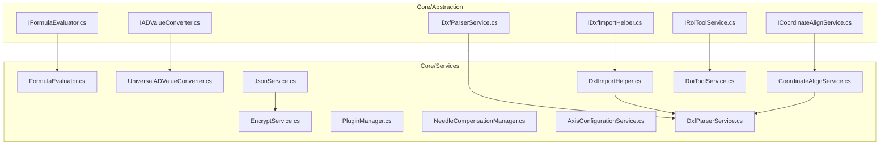

图表来源
- [IFormulaEvaluator.cs:1-18](file://Core/Abstraction/IFormulaEvaluator.cs#L1-L18)
- [IADValueConverter.cs:1-91](file://Core/Abstraction/IADValueConverter.cs#L1-L91)
- [ICoordinateAlignService.cs](file://Core/Services/ICoordinateAlignService.cs)
- [IDxfParserService.cs](file://Core/Services/IDxfParserService.cs)
- [IDxfImportHelper.cs](file://Core/Services/IDxfImportHelper.cs)
- [IRoiToolService.cs](file://Core/Services/IRoiToolService.cs)
- [EncryptService.cs:1-157](file://Core/Services/EncryptService.cs#L1-L157)
- [FormulaEvaluator.cs:1-336](file://Core/Services/FormulaEvaluator.cs#L1-L336)
- [UniversalADValueConverter.cs:1-130](file://Core/Services/UniversalADValueConverter.cs#L1-L130)
- [JsonService.cs:1-202](file://Core/Services/JsonService.cs#L1-L202)
- [PluginManager.cs:1-88](file://Core/Services/PluginManager.cs#L1-L88)
- [NeedleCompensationManager.cs:1-244](file://Core/Services/NeedleCompensationManager.cs#L1-L244)
- [AxisConfigurationService.cs:1-15](file://Core/Services/AxisConfigurationService.cs#L1-L15)
- [CoordinateAlignService.cs:1-407](file://Core/Services/CoordinateAlignService.cs#L1-L407)
- [DxfParserService.cs:1-800](file://Core/Services/DxfParserService.cs#L1-L800)
- [DxfImportHelper.cs:1-290](file://Core/Services/DxfImportHelper.cs#L1-L290)
- [RoiToolService.cs:1-354](file://Core/Services/RoiToolService.cs#L1-L354)

章节来源
- [EncryptService.cs:1-157](file://Core/Services/EncryptService.cs#L1-L157)
- [FormulaEvaluator.cs:1-336](file://Core/Services/FormulaEvaluator.cs#L1-L336)
- [UniversalADValueConverter.cs:1-130](file://Core/Services/UniversalADValueConverter.cs#L1-L130)
- [JsonService.cs:1-202](file://Core/Services/JsonService.cs#L1-L202)
- [PluginManager.cs:1-88](file://Core/Services/PluginManager.cs#L1-L88)
- [NeedleCompensationManager.cs:1-244](file://Core/Services/NeedleCompensationManager.cs#L1-L244)
- [AxisConfigurationService.cs:1-15](file://Core/Services/AxisConfigurationService.cs#L1-L15)
- [CoordinateAlignService.cs:1-407](file://Core/Services/CoordinateAlignService.cs#L1-L407)
- [DxfParserService.cs:1-800](file://Core/Services/DxfParserService.cs#L1-L800)
- [DxfImportHelper.cs:1-290](file://Core/Services/DxfImportHelper.cs#L1-L290)
- [RoiToolService.cs:1-354](file://Core/Services/RoiToolService.cs#L1-L354)

## 核心组件
- 加密服务（EncryptService）
  - 提供SHA256哈希、MD5摘要、基于TripleDES的对称加解密、以及MD5摘要生成等能力。
  - 默认密钥常量与静态构造初始化密钥。
  - 关键方法：EncrypToSHA、Encrypt、Decrypt、MakeMd5、Encrypt/Decrypt(byte[])。
- 公式求值器（FormulaEvaluator）
  - 轻量表达式求值器，支持变量替换（@GV:/@Output:）、四则运算、比较、布尔字面量true/false、括号与优先级。
  - 词法分析与递归下降语法解析，内置除零保护与异常日志。
  - 关键方法：Evaluate、EvaluateCondition、PreprocessVariables、Parse*系列。
- 值转换器（UniversalADValueConverter）
  - 将AD采集值线性转换为物理量，支持校准系数与零点偏移。
  - 支持批量转换、通道配置增删改查、异常容错。
  - 关键方法：Convert、ConvertBatch、UpdateChannelConfig、GetAllChannelConfigs。
- JSON服务（JsonService）
  - 封装Newtonsoft.Json进行对象/DataTable的序列化与反序列化。
  - 支持文件IO、加密文件读写（结合EncryptService）。
  - 关键方法：ObjectToFile/JObjectFromFile、DataTableToFile/From、SerializeObject/Deserialize等。
- 插件管理器（PluginManager）
  - 管理插件生命周期与服务注册，支持插件配置与全局配置。
  - 关键方法：LoadPlugin、UnloadPlugin、ConfigureAllPlugins、GetPlugin。
- 针头补偿管理器（NeedleCompensationManager）
  - 实现清零法与增量法补偿，维护基准补偿、增量补偿与上次参考值。
  - 支持从参数/历史记录加载与保存。
  - 关键属性：BaseCompensationX/Y/Z、DeltaCompensationX/Y/Z、TotalCompensationX/Y/Z、LastReferenceX/Y/Z。
- 轴配置服务（AxisConfigurationService）
  - 接口定义：按工站标识获取轴定义列表。
  - 实现迁移至 MotionControl 模块（接口仍保留于 Core）。
- 坐标对齐服务（CoordinateAlignService）
  - 管理CAD坐标系到机械坐标系的映射，支持三种模式：基准点平移、逐点映射、仿射对齐（Halcon）。
  - 关键方法：SetMode/SetMapFiducial/SetMachineFiducial、AutoCalculate/AutoCalculateAffine、TransformToMachine。
- DXF解析服务（DxfParserService、DxfImportHelper）
  - DxfParserService：逐行解析DXF文本，构建CadEntity对象，支持多实体类型与离散化。
  - DxfImportHelper：统一导入流程，过滤实体、可选离散化、提取点位。
  - 关键方法：Parse、Discretize/DiscretizeAll、Import、ExtractPointsFromFile。
- ROI工具服务（RoiToolService）
  - 创建多种几何形态ROI并进行等间距采样，支持直线、折线、圆弧、自由手绘。
  - 关键方法：Create*Roi、SamplePoints、SampleLine/Polyline/Arc/Freehand。
  
章节来源
- [EncryptService.cs:1-157](file://Core/Services/EncryptService.cs#L1-L157)
- [FormulaEvaluator.cs:1-336](file://Core/Services/FormulaEvaluator.cs#L1-L336)
- [UniversalADValueConverter.cs:1-130](file://Core/Services/UniversalADValueConverter.cs#L1-L130)
- [JsonService.cs:1-202](file://Core/Services/JsonService.cs#L1-L202)
- [PluginManager.cs:1-88](file://Core/Services/PluginManager.cs#L1-L88)
- [NeedleCompensationManager.cs:1-244](file://Core/Services/NeedleCompensationManager.cs#L1-L244)
- [AxisConfigurationService.cs:1-15](file://Core/Services/AxisConfigurationService.cs#L1-L15)
- [CoordinateAlignService.cs:1-407](file://Core/Services/CoordinateAlignService.cs#L1-L407)
- [DxfParserService.cs:1-800](file://Core/Services/DxfParserService.cs#L1-L800)
- [DxfImportHelper.cs:1-290](file://Core/Services/DxfImportHelper.cs#L1-L290)
- [RoiToolService.cs:1-354](file://Core/Services/RoiToolService.cs#L1-L354)

## 架构总览
下图展示核心服务之间的交互关系与依赖方向：

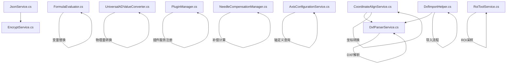

图表来源
- [EncryptService.cs:1-157](file://Core/Services/EncryptService.cs#L1-L157)
- [JsonService.cs:1-202](file://Core/Services/JsonService.cs#L1-L202)
- [FormulaEvaluator.cs:1-336](file://Core/Services/FormulaEvaluator.cs#L1-L336)
- [UniversalADValueConverter.cs:1-130](file://Core/Services/UniversalADValueConverter.cs#L1-L130)
- [PluginManager.cs:1-88](file://Core/Services/PluginManager.cs#L1-L88)
- [NeedleCompensationManager.cs:1-244](file://Core/Services/NeedleCompensationManager.cs#L1-L244)
- [AxisConfigurationService.cs:1-15](file://Core/Services/AxisConfigurationService.cs#L1-L15)
- [CoordinateAlignService.cs:1-407](file://Core/Services/CoordinateAlignService.cs#L1-L407)
- [DxfParserService.cs:1-800](file://Core/Services/DxfParserService.cs#L1-L800)
- [DxfImportHelper.cs:1-290](file://Core/Services/DxfImportHelper.cs#L1-L290)
- [RoiToolService.cs:1-354](file://Core/Services/RoiToolService.cs#L1-L354)

## 详细组件分析

### 加密服务（EncryptService）
- 设计要点
  - 面向静态工具类，提供哈希、摘要与对称加解密。
  - 默认密钥在静态构造中初始化，便于快速调用。
- 核心算法
  - SHA256：UTF8编码后哈希并Base64输出。
  - MD5：字节序列转十六进制字符串。
  - TripleDES：基于MD5(key)派生密钥，ECB模式，支持字节数组与字符串加解密。
- 性能与安全
  - MD5与SHA256为轻量摘要，适合校验与标识。
  - TripleDES为对称加密，注意密钥管理与传输安全。
- 扩展机制
  - 可新增更多算法（如AES），保持静态工厂风格便于调用。
- 使用示例（路径）
  - [EncrypToSHA:23-29](file://Core/Services/EncryptService.cs#L23-L29)
  - [Encrypt/Decrypt 字符串重载:59-72](file://Core/Services/EncryptService.cs#L59-L72)
  - [Encrypt/Decrypt 字节数组重载:130-154](file://Core/Services/EncryptService.cs#L130-L154)

章节来源
- [EncryptService.cs:1-157](file://Core/Services/EncryptService.cs#L1-L157)

### 公式求值器（FormulaEvaluator）
- 接口抽象
  - IFormulaEvaluator：定义 Evaluate/EvaluateCondition。
- 核心算法
  - 预处理：将变量名（含@GV:/@Output:）替换为数值，布尔true/false转1/0。
  - 词法分析：识别数字、布尔、运算符、括号与EOF。
  - 语法解析：递归下降实现OR/AND/比较/加减/乘除/因子与括号。
  - 错误处理：捕获异常并返回默认值，调试输出提示。
- 性能优化
  - 变量替换按键长降序排序，避免短键误替换长键。
  - 词法扫描线性推进，避免回溯。
- 使用示例（路径）
  - [Evaluate:23-39](file://Core/Services/FormulaEvaluator.cs#L23-L39)
  - [EvaluateCondition:41-57](file://Core/Services/FormulaEvaluator.cs#L41-L57)
  - [PreprocessVariables:63-105](file://Core/Services/FormulaEvaluator.cs#L63-L105)

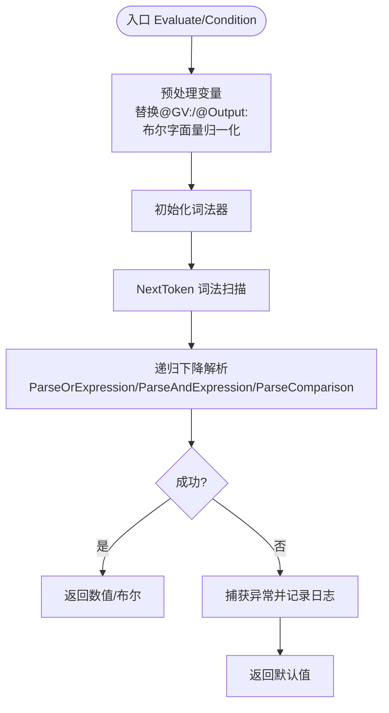

图表来源
- [FormulaEvaluator.cs:23-105](file://Core/Services/FormulaEvaluator.cs#L23-L105)

章节来源
- [FormulaEvaluator.cs:1-336](file://Core/Services/FormulaEvaluator.cs#L1-L336)
- [IFormulaEvaluator.cs:1-18](file://Core/Abstraction/IFormulaEvaluator.cs#L1-L18)

### 值转换器（UniversalADValueConverter）
- 接口抽象
  - IADValueConverter：定义单点/批量转换、通道配置管理。
- 核心算法
  - 线性转换：(AD-ADmin)/(ADmax-ADmin)*(PhysMax-PhysMin)+PhysMin。
  - 校准：(物理值+零点偏移)*校准系数。
  - 批量转换：逐通道转换并记录异常，其余通道继续。
- 性能与扩展
  - 字典索引通道配置，O(1)访问。
  - 可扩展为非线性映射或分段线性。
- 使用示例（路径）
  - [Convert:31-52](file://Core/Services/UniversalADValueConverter.cs#L31-L52)
  - [ConvertBatch:57-74](file://Core/Services/UniversalADValueConverter.cs#L57-L74)
  - [UpdateChannelConfig:91-95](file://Core/Services/UniversalADValueConverter.cs#L91-L95)

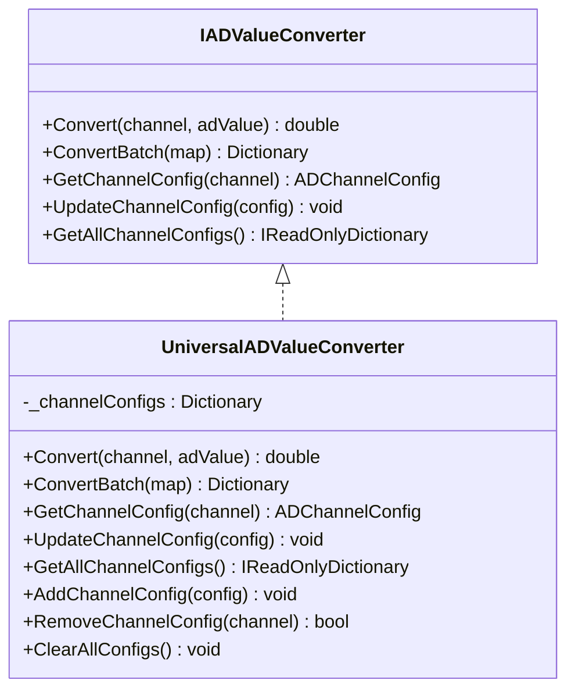

图表来源
- [IADValueConverter.cs:1-91](file://Core/Abstraction/IADValueConverter.cs#L1-L91)
- [UniversalADValueConverter.cs:1-130](file://Core/Services/UniversalADValueConverter.cs#L1-L130)

章节来源
- [UniversalADValueConverter.cs:1-130](file://Core/Services/UniversalADValueConverter.cs#L1-L130)
- [IADValueConverter.cs:1-91](file://Core/Abstraction/IADValueConverter.cs#L1-L91)

### JSON服务（JsonService）
- 功能特性
  - 对象与DataTable的序列化/反序列化。
  - 文件IO封装，支持JavaScript日期转换器与空值忽略。
  - 加密文件读写：结合EncryptService进行加密/解密。
- 使用示例（路径）
  - [ObjectToFile/JObjectFromFile:105-145](file://Core/Services/JsonService.cs#L105-L145)
  - [DataTableToFile/From:13-46](file://Core/Services/JsonService.cs#L13-L46)
  - [DataTableToEncryptFile/FromEncryptFile:53-81](file://Core/Services/JsonService.cs#L53-L81)

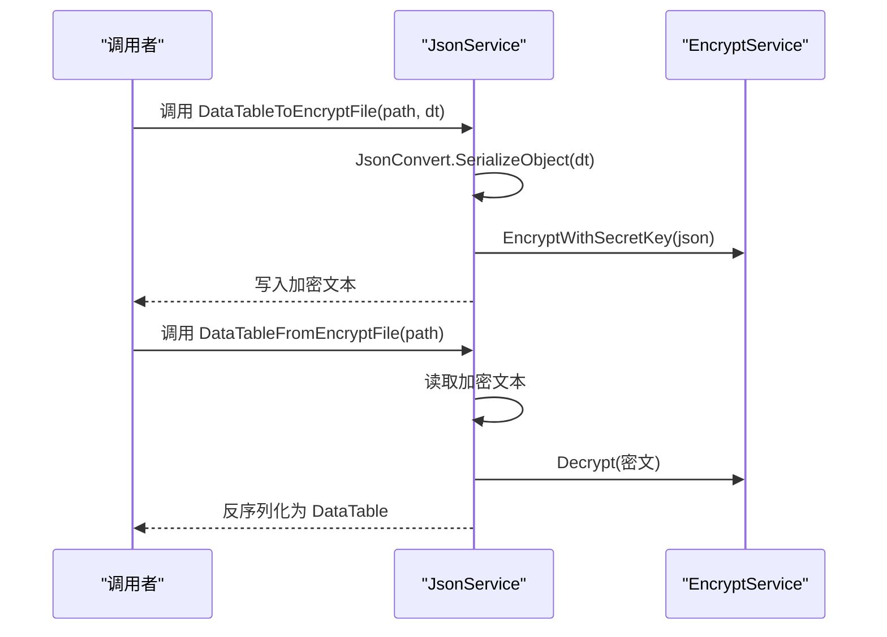

图表来源
- [JsonService.cs:53-81](file://Core/Services/JsonService.cs#L53-L81)
- [EncryptService.cs:59-72](file://Core/Services/EncryptService.cs#L59-L72)

章节来源
- [JsonService.cs:1-202](file://Core/Services/JsonService.cs#L1-L202)

### 插件管理器（PluginManager）
- 设计要点
  - 管理插件集合、服务注册与全局配置。
  - 通过IServiceProvider获取服务容器，调用插件的ConfigureServices与Configure。
- 使用示例（路径）
  - [LoadPlugin/UnloadPlugin:24-44](file://Core/Services/PluginManager.cs#L24-L44)
  - [ConfigureAllPlugins:71-85](file://Core/Services/PluginManager.cs#L71-L85)

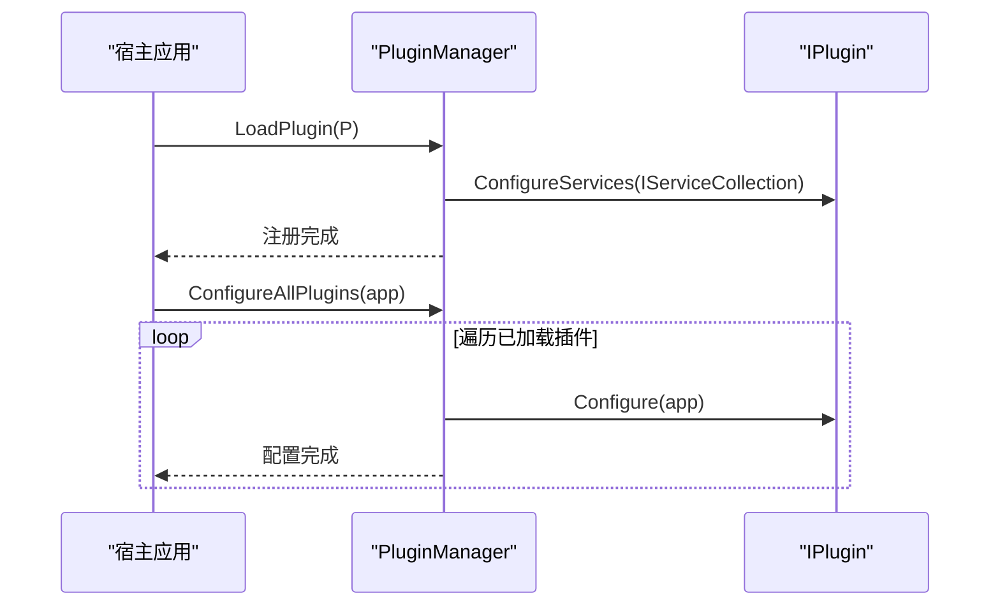

图表来源
- [PluginManager.cs:24-85](file://Core/Services/PluginManager.cs#L24-L85)

章节来源
- [PluginManager.cs:1-88](file://Core/Services/PluginManager.cs#L1-L88)

### 针头补偿管理器（NeedleCompensationManager）
- 设计要点
  - 清零法：基准补偿 - 增量补偿。
  - 增量法：累计当前偏差到增量补偿。
  - 支持重置、加载/保存参数与历史记录。
- 使用示例（路径）
  - [UpdateDeltaCompensation:95-112](file://Core/Services/NeedleCompensationManager.cs#L95-L112)
  - [ResetBaseCompensation:117-125](file://Core/Services/NeedleCompensationManager.cs#L117-L125)
  - [LoadFromParameters/SaveToParameters:167-208](file://Core/Services/NeedleCompensationManager.cs#L167-L208)

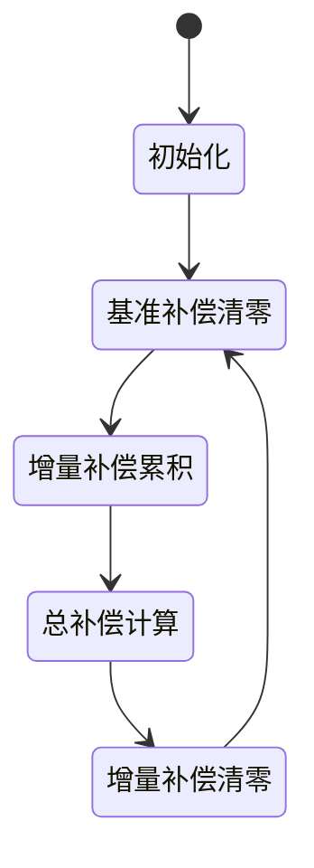

图表来源
- [NeedleCompensationManager.cs:87-148](file://Core/Services/NeedleCompensationManager.cs#L87-L148)

章节来源
- [NeedleCompensationManager.cs:1-244](file://Core/Services/NeedleCompensationManager.cs#L1-L244)

### 轴配置服务（AxisConfigurationService）
- 设计要点
  - 接口定义：按工站标识获取轴定义列表。
  - 实现迁移至 MotionControl 模块，Core保留接口以维持依赖稳定。
- 使用示例（路径）
  - [GetAxesForStation](file://Core/Services/AxisConfigurationService.cs#L12)

章节来源
- [AxisConfigurationService.cs:1-15](file://Core/Services/AxisConfigurationService.cs#L1-L15)

### 坐标对齐服务（CoordinateAlignService）
- 设计要点
  - 三种模式：
    - Mode1：基准点平移（纯平移）。
    - Mode2：逐点映射（兜底最近点匹配）。
    - Mode3：仿射对齐（Halcon VectorToHomMat2D，失败回退平移）。
  - 支持批量注册点、自动计算、变换查询与仿射矩阵显示。
- 使用示例（路径）
  - [AutoCalculate:104-122](file://Core/Services/CoordinateAlignService.cs#L104-L122)
  - [AutoCalculateAffine:300-373](file://Core/Services/CoordinateAlignService.cs#L300-L373)
  - [TransformToMachine:169-214](file://Core/Services/CoordinateAlignService.cs#L169-L214)

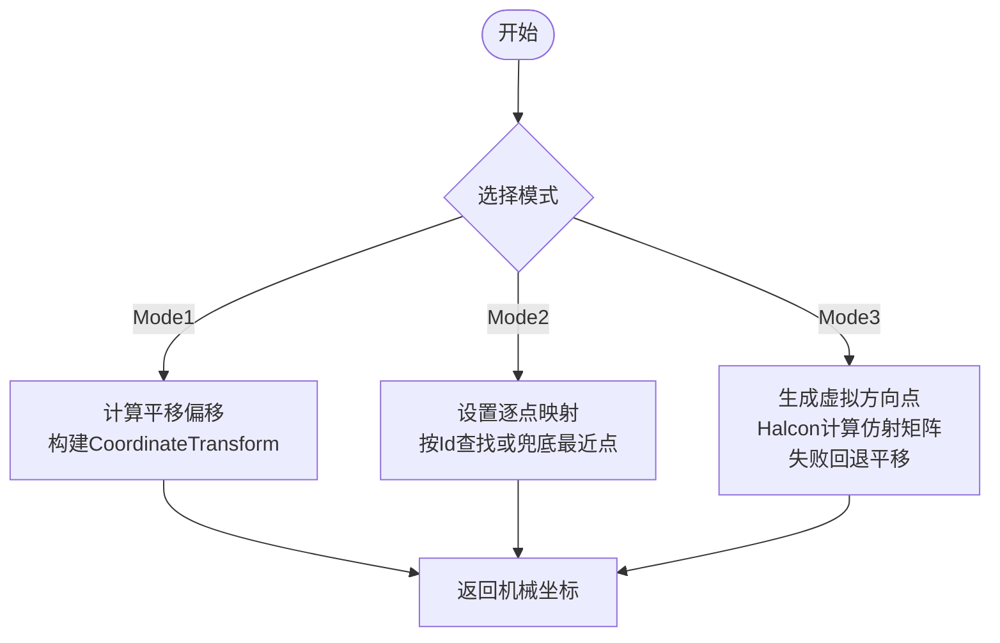

图表来源
- [CoordinateAlignService.cs:104-214](file://Core/Services/CoordinateAlignService.cs#L104-L214)
- [CoordinateAlignService.cs:300-373](file://Core/Services/CoordinateAlignService.cs#L300-L373)

章节来源
- [CoordinateAlignService.cs:1-407](file://Core/Services/CoordinateAlignService.cs#L1-L407)

### DXF解析服务（DxfParserService、DxfImportHelper）
- 设计要点
  - DxfParserService：逐行解析DXF文本，定位ENTITIES段，按实体类型构建CadEntity对象，支持离散化。
  - DxfImportHelper：统一导入流程，过滤实体、可选离散化、提取点位（VERTEX或离散化结果）。
- 使用示例（路径）
  - [Parse:22-48](file://Core/Services/DxfParserService.cs#L22-L48)
  - [Discretize/DiscretizeAll:54-85](file://Core/Services/DxfParserService.cs#L54-L85)
  - [Import:31-101](file://Core/Services/DxfImportHelper.cs#L31-L101)

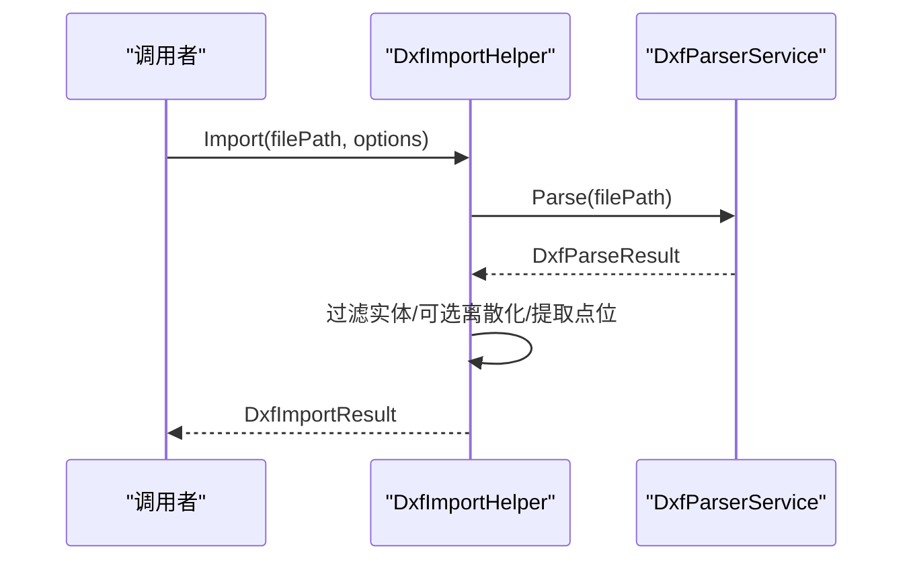

图表来源
- [DxfImportHelper.cs:31-101](file://Core/Services/DxfImportHelper.cs#L31-L101)
- [DxfParserService.cs:22-85](file://Core/Services/DxfParserService.cs#L22-L85)

章节来源
- [DxfParserService.cs:1-800](file://Core/Services/DxfParserService.cs#L1-L800)
- [DxfImportHelper.cs:1-290](file://Core/Services/DxfImportHelper.cs#L1-L290)

### ROI工具服务（RoiToolService）
- 设计要点
  - 支持四种ROI类型：直线、折线、圆弧、自由手绘。
  - 等间距采样：直线/折线线性插值、圆弧按角度等分、自由手绘按累积弦长重采样并移动平均平滑。
- 使用示例（路径）
  - [CreateLineRoi/CreateArcRoi:20-58](file://Core/Services/RoiToolService.cs#L20-L58)
  - [SamplePoints:77-97](file://Core/Services/RoiToolService.cs#L77-L97)
  - [SampleFreehand:221-314](file://Core/Services/RoiToolService.cs#L221-L314)

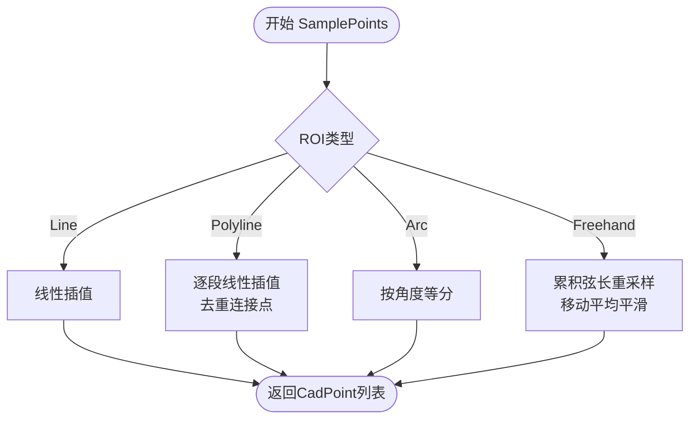

图表来源
- [RoiToolService.cs:77-314](file://Core/Services/RoiToolService.cs#L77-L314)

章节来源
- [RoiToolService.cs:1-354](file://Core/Services/RoiToolService.cs#L1-L354)

## 依赖关系分析
- 接口与实现
  - IFormulaEvaluator ← FormulaEvaluator
  - IADValueConverter ← UniversalADValueConverter
  - ICoordinateAlignService ← CoordinateAlignService
  - IDxfParserService ← DxfParserService
  - IDxfImportHelper ← DxfImportHelper
  - IRoiToolService ← RoiToolService
- 外部依赖
  - EncryptService 依赖 System.Security.Cryptography。
  - JsonService 依赖 Newtonsoft.Json。
  - CoordinateAlignService 依赖 HalconDotNet（可选）。
- 循环依赖
  - 未发现循环依赖；服务间通过接口解耦。

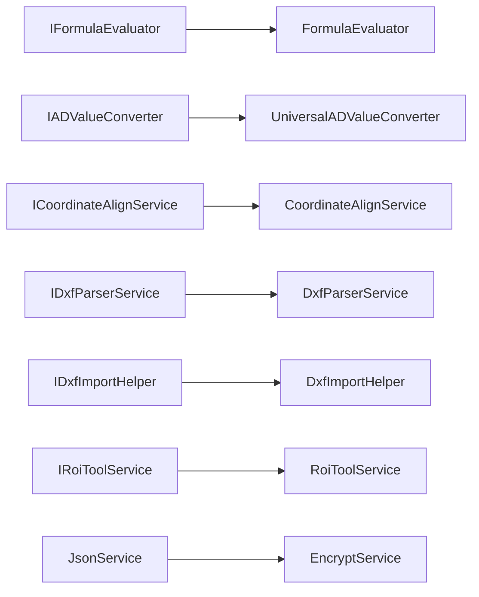

图表来源
- [IFormulaEvaluator.cs:1-18](file://Core/Abstraction/IFormulaEvaluator.cs#L1-L18)
- [FormulaEvaluator.cs:1-336](file://Core/Services/FormulaEvaluator.cs#L1-L336)
- [IADValueConverter.cs:1-91](file://Core/Abstraction/IADValueConverter.cs#L1-L91)
- [UniversalADValueConverter.cs:1-130](file://Core/Services/UniversalADValueConverter.cs#L1-L130)
- [ICoordinateAlignService.cs](file://Core/Services/ICoordinateAlignService.cs)
- [CoordinateAlignService.cs:1-407](file://Core/Services/CoordinateAlignService.cs#L1-L407)
- [IDxfParserService.cs](file://Core/Services/IDxfParserService.cs)
- [DxfParserService.cs:1-800](file://Core/Services/DxfParserService.cs#L1-L800)
- [IDxfImportHelper.cs](file://Core/Services/IDxfImportHelper.cs)
- [DxfImportHelper.cs:1-290](file://Core/Services/DxfImportHelper.cs#L1-L290)
- [IRoiToolService.cs](file://Core/Services/IRoiToolService.cs)
- [RoiToolService.cs:1-354](file://Core/Services/RoiToolService.cs#L1-L354)
- [JsonService.cs:1-202](file://Core/Services/JsonService.cs#L1-L202)
- [EncryptService.cs:1-157](file://Core/Services/EncryptService.cs#L1-L157)

章节来源
- [IFormulaEvaluator.cs:1-18](file://Core/Abstraction/IFormulaEvaluator.cs#L1-L18)
- [FormulaEvaluator.cs:1-336](file://Core/Services/FormulaEvaluator.cs#L1-L336)
- [IADValueConverter.cs:1-91](file://Core/Abstraction/IADValueConverter.cs#L1-L91)
- [UniversalADValueConverter.cs:1-130](file://Core/Services/UniversalADValueConverter.cs#L1-L130)
- [ICoordinateAlignService.cs](file://Core/Services/ICoordinateAlignService.cs)
- [CoordinateAlignService.cs:1-407](file://Core/Services/CoordinateAlignService.cs#L1-L407)
- [IDxfParserService.cs](file://Core/Services/IDxfParserService.cs)
- [DxfParserService.cs:1-800](file://Core/Services/DxfParserService.cs#L1-L800)
- [IDxfImportHelper.cs](file://Core/Services/IDxfImportHelper.cs)
- [DxfImportHelper.cs:1-290](file://Core/Services/DxfImportHelper.cs#L1-L290)
- [IRoiToolService.cs](file://Core/Services/IRoiToolService.cs)
- [RoiToolService.cs:1-354](file://Core/Services/RoiToolService.cs#L1-L354)
- [JsonService.cs:1-202](file://Core/Services/JsonService.cs#L1-L202)
- [EncryptService.cs:1-157](file://Core/Services/EncryptService.cs#L1-L157)

## 性能考量
- 公式求值器
  - 预处理阶段按键长降序替换，减少误替换成本。
  - 词法与语法解析均为线性复杂度，适合实时条件判断。
- 值转换器
  - 字典索引通道配置，O(1)访问；批量转换时逐通道处理，异常不影响其他通道。
- JSON服务
  - 文件IO加锁（ObjectToFile）避免并发写冲突；加密/解密为CPU密集操作，建议异步或后台线程执行。
- 坐标对齐
  - Mode3仿射计算依赖Halcon，失败回退平移；大量点注册时注意内存占用。
- DXF解析
  - ENTITIES段定位与实体类型分支，时间复杂度O(N)；离散化按实体类型分派，注意pitchMM与点数控制。
- ROI采样
  - 自由手绘重采样使用二分查找定位段，时间复杂度O(M log N)，M为采样点数，N为原始点数。

## 故障排查指南
- 公式求值
  - 现象：表达式解析异常或返回默认值。
  - 排查：检查变量名是否完整（@GV:/@Output:）、布尔字面量大小写、括号匹配与除零。
  - 参考：[Evaluate/EvaluateCondition:23-57](file://Core/Services/FormulaEvaluator.cs#L23-L57)
- 加密/解密
  - 现象：解密失败或乱码。
  - 排查：确认密钥一致、编码一致、文件内容未被篡改。
  - 参考：[Encrypt/Decrypt 字符串重载:59-72](file://Core/Services/EncryptService.cs#L59-L72)
- JSON序列化
  - 现象：反序列化为空或异常。
  - 排查：检查文件路径、文件内容合法性、日期转换器配置。
  - 参考：[JObjectFromFile:130-145](file://Core/Services/JsonService.cs#L130-L145)
- 坐标对齐
  - 现象：仿射计算失败或回退平移。
  - 排查：确认Halcon可用性、输入点数量与分布、方向点距离设置。
  - 参考：[AutoCalculateAffine:300-373](file://Core/Services/CoordinateAlignService.cs#L300-L373)
- DXF导入
  - 现象：实体缺失或点位为空。
  - 排查：检查DXF版本与实体类型支持、图层过滤、离散化参数。
  - 参考：[Import:31-101](file://Core/Services/DxfImportHelper.cs#L31-L101)
- ROI采样
  - 现象：自由手绘抖动或采样点不足。
  - 排查：调整pitchMM、检查原始点密度、平滑窗口大小。
  - 参考：[SampleFreehand:221-314](file://Core/Services/RoiToolService.cs#L221-L314)

章节来源
- [FormulaEvaluator.cs:23-57](file://Core/Services/FormulaEvaluator.cs#L23-L57)
- [EncryptService.cs:59-72](file://Core/Services/EncryptService.cs#L59-L72)
- [JsonService.cs:130-145](file://Core/Services/JsonService.cs#L130-L145)
- [CoordinateAlignService.cs:300-373](file://Core/Services/CoordinateAlignService.cs#L300-L373)
- [DxfImportHelper.cs:31-101](file://Core/Services/DxfImportHelper.cs#L31-L101)
- [RoiToolService.cs:221-314](file://Core/Services/RoiToolService.cs#L221-L314)

## 结论
上述实用工具服务围绕“接口抽象 + 轻量实现 + 易扩展”的设计原则构建，覆盖加密、表达式求值、AD值转换、JSON序列化、插件管理、针头补偿、坐标对齐、DXF解析与ROI采样等关键领域。通过清晰的职责划分与稳健的错误处理，这些服务为上层业务提供了可靠的基础能力。建议在生产环境中关注性能瓶颈（如Halcon仿射计算、大量DXF实体解析）并结合异步与缓存策略进一步优化。

## 附录
- API使用示例（路径）
  - 加密服务：[EncrypToSHA:23-29](file://Core/Services/EncryptService.cs#L23-L29)、[EncryptWithSecretKey:59-62](file://Core/Services/EncryptService.cs#L59-L62)
  - 公式求值器：[Evaluate:23-39](file://Core/Services/FormulaEvaluator.cs#L23-L39)、[EvaluateCondition:41-57](file://Core/Services/FormulaEvaluator.cs#L41-L57)
  - 值转换器：[Convert:31-52](file://Core/Services/UniversalADValueConverter.cs#L31-L52)、[ConvertBatch:57-74](file://Core/Services/UniversalADValueConverter.cs#L57-L74)
  - JSON服务：[ObjectToFile:105-123](file://Core/Services/JsonService.cs#L105-L123)、[DataTableToEncryptFile:53-59](file://Core/Services/JsonService.cs#L53-L59)
  - 插件管理器：[LoadPlugin:24-36](file://Core/Services/PluginManager.cs#L24-L36)、[ConfigureAllPlugins:71-85](file://Core/Services/PluginManager.cs#L71-L85)
  - 针头补偿：[UpdateDeltaCompensation:95-112](file://Core/Services/NeedleCompensationManager.cs#L95-L112)
  - 坐标对齐：[AutoCalculate:104-122](file://Core/Services/CoordinateAlignService.cs#L104-L122)、[TransformToMachine:169-214](file://Core/Services/CoordinateAlignService.cs#L169-L214)
  - DXF导入：[Import:31-101](file://Core/Services/DxfImportHelper.cs#L31-L101)
  - ROI采样：[SamplePoints:77-97](file://Core/Services/RoiToolService.cs#L77-L97)