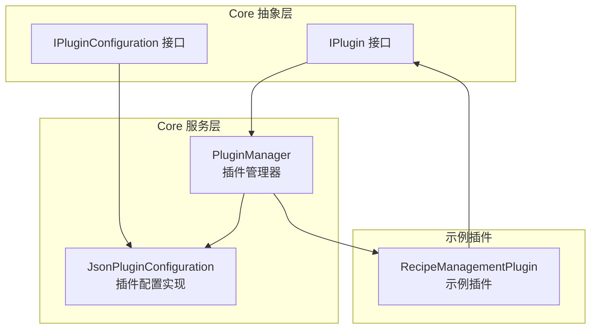
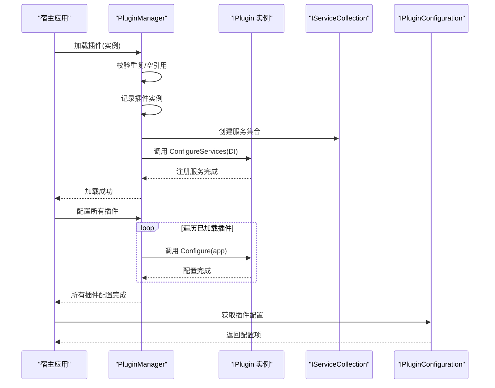
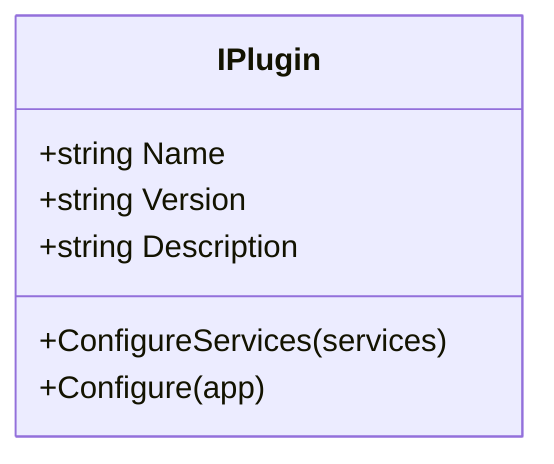
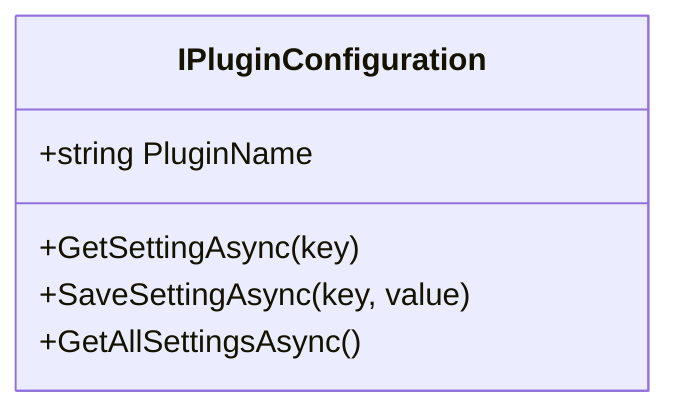
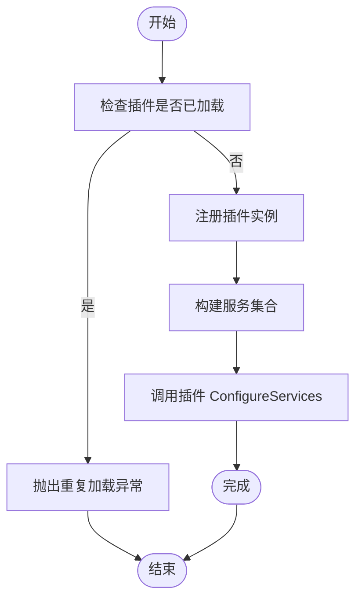
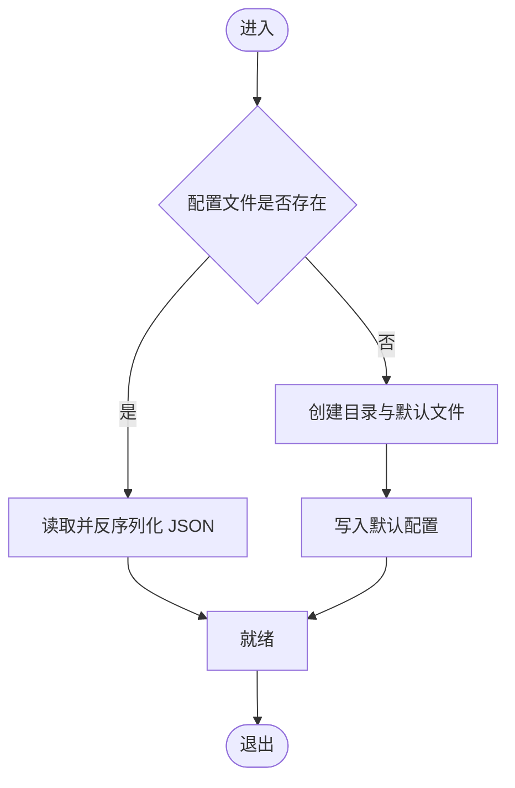
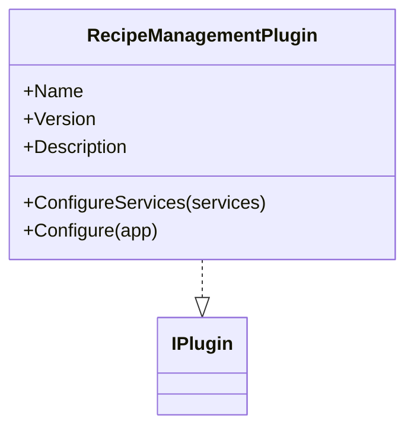
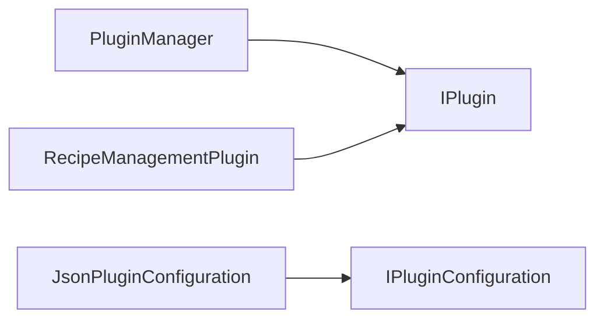

# 插件管理服务

<cite>
**本文引用的文件**
- [PluginManager.cs](file://Core/Services/PluginManager.cs)
- [IPlugin.cs](file://Core/Abstraction/Plugins/IPlugin.cs)
- [IPluginConfiguration.cs](file://Core/Abstraction/Plugins/IPluginConfiguration.cs)
- [JsonPluginConfiguration.cs](file://Core/Services/JsonPluginConfiguration.cs)
- [RecipeManagementPlugin.cs](file://RecipeManagement/Plugin/RecipeManagementPlugin.cs)
</cite>

## 目录
1. [简介](#简介)
2. [项目结构](#项目结构)
3. [核心组件](#核心组件)
4. [架构总览](#架构总览)
5. [详细组件分析](#详细组件分析)
6. [依赖关系分析](#依赖关系分析)
7. [性能考量](#性能考量)
8. [故障排查指南](#故障排查指南)
9. [结论](#结论)
10. [附录](#附录)

## 简介
本文件面向“插件管理服务”的设计与实现，围绕插件加载机制、接口契约、生命周期管理与依赖注入策略进行系统化梳理，并结合仓库中的实际实现给出可操作的开发与使用范式。插件系统采用基于接口的模块化架构，通过统一的插件抽象与管理器，实现插件的注册、加载、配置与卸载；同时提供插件级配置能力，支持键值型设置的持久化与并发安全访问。

## 项目结构
插件管理服务位于 Core 层，核心由以下部分组成：
- 抽象层：定义插件与配置的接口契约，确保实现与调用解耦
- 服务层：提供插件管理器与插件配置实现
- 示例插件：RecipeManagementPlugin 展示如何实现 IPlugin 并注册服务

图表来源
- [PluginManager.cs:1-88](file://Core/Services/PluginManager.cs#L1-L88)
- [IPlugin.cs:1-32](file://Core/Abstraction/Plugins/IPlugin.cs#L1-L32)
- [IPluginConfiguration.cs:1-14](file://Core/Abstraction/Plugins/IPluginConfiguration.cs#L1-L14)
- [JsonPluginConfiguration.cs:1-154](file://Core/Services/JsonPluginConfiguration.cs#L1-L154)
- [RecipeManagementPlugin.cs:1-45](file://RecipeManagement/Plugin/RecipeManagementPlugin.cs#L1-L45)

章节来源
- [PluginManager.cs:1-88](file://Core/Services/PluginManager.cs#L1-L88)
- [IPlugin.cs:1-32](file://Core/Abstraction/Plugins/IPlugin.cs#L1-L32)
- [IPluginConfiguration.cs:1-14](file://Core/Abstraction/Plugins/IPluginConfiguration.cs#L1-L14)
- [JsonPluginConfiguration.cs:1-154](file://Core/Services/JsonPluginConfiguration.cs#L1-L154)
- [RecipeManagementPlugin.cs:1-45](file://RecipeManagement/Plugin/RecipeManagementPlugin.cs#L1-L45)

## 核心组件
- 插件接口 IPlugin：定义插件的基本元数据（名称、版本、描述）以及两个生命周期钩子：ConfigureServices 用于注册服务，Configure 用于配置应用管道
- 插件配置接口 IPluginConfiguration：提供异步读写插件配置的能力，支持泛型取值与全量导出
- 插件管理器 PluginManager：负责插件的加载、查询、卸载与统一配置；在加载阶段自动调用插件的服务注册逻辑
- 插件配置实现 JsonPluginConfiguration：以 JSON 文件形式持久化插件配置，提供线程安全的并发访问与默认值保障

章节来源
- [IPlugin.cs:8-16](file://Core/Abstraction/Plugins/IPlugin.cs#L8-L16)
- [IPluginConfiguration.cs:7-14](file://Core/Abstraction/Plugins/IPluginConfiguration.cs#L7-L14)
- [PluginManager.cs:7-86](file://Core/Services/PluginManager.cs#L7-L86)
- [JsonPluginConfiguration.cs:9-154](file://Core/Services/JsonPluginConfiguration.cs#L9-L154)

## 架构总览
插件系统采用“接口驱动 + 管理器编排”的架构模式：
- 插件通过实现 IPlugin 提供自身服务注册与应用配置
- 管理器在加载插件时收集其服务清单并执行注册
- 插件配置通过 IPluginConfiguration 统一管理，使用 JSON 文件作为持久化介质
- 示例插件 RecipeManagementPlugin 演示了如何在 ConfigureServices 中注册仓储、领域与应用层服务

图表来源
- [PluginManager.cs:24-85](file://Core/Services/PluginManager.cs#L24-L85)
- [IPlugin.cs:14-15](file://Core/Abstraction/Plugins/IPlugin.cs#L14-L15)
- [JsonPluginConfiguration.cs:79-151](file://Core/Services/JsonPluginConfiguration.cs#L79-L151)

## 详细组件分析

### 插件接口 IPlugin
- 角色与职责
  - 提供插件元信息：名称、版本、描述
  - 生命周期钩子：ConfigureServices 用于注册服务；Configure 用于配置应用管道
- 设计要点
  - 将“服务注册”与“应用配置”分离，便于管理器统一处理
  - 与 ASP.NET Core 的 DI 与管道模型对齐，降低集成成本

图表来源
- [IPlugin.cs:8-16](file://Core/Abstraction/Plugins/IPlugin.cs#L8-L16)

章节来源
- [IPlugin.cs:8-16](file://Core/Abstraction/Plugins/IPlugin.cs#L8-L16)

### 插件配置接口 IPluginConfiguration
- 角色与职责
  - 为插件提供键值型配置的异步存取能力
  - 支持泛型读取、全量导出、存在性检查与删除
- 设计要点
  - 异步 API 保证在 WPF 等 UI 线程环境下的响应性
  - 泛型读取简化类型转换与错误处理

图表来源
- [IPluginConfiguration.cs:7-14](file://Core/Abstraction/Plugins/IPluginConfiguration.cs#L7-L14)

章节来源
- [IPluginConfiguration.cs:7-14](file://Core/Abstraction/Plugins/IPluginConfiguration.cs#L7-L14)

### 插件管理器 PluginManager
- 角色与职责
  - 维护插件字典，提供查询与卸载
  - 在加载时自动调用插件的服务注册逻辑
  - 统一对所有已加载插件执行应用配置
- 关键流程
  - 加载：校验空引用与重复名称，记录插件，调用插件的 ConfigureServices
  - 配置：遍历插件，调用 Configure，异常捕获并记录
  - 查询/卸载：基于名称字典进行快速定位与移除
- 错误处理
  - 对插件服务配置阶段的异常进行捕获与抛出，确保问题可追踪
  - 对插件应用配置阶段的异常进行捕获并记录，避免影响其他插件

图表来源
- [PluginManager.cs:24-69](file://Core/Services/PluginManager.cs#L24-L69)

章节来源
- [PluginManager.cs:7-86](file://Core/Services/PluginManager.cs#L7-L86)

### 插件配置实现 JsonPluginConfiguration
- 角色与职责
  - 以 JSON 文件持久化插件配置，路径约定为 Plugins/{PluginName}/config.json
  - 提供线程安全的并发访问与默认配置生成
- 关键流程
  - 加载：若文件存在则反序列化，否则创建目录与默认文件
  - 保存：序列化并写回文件，保持缩进格式
  - 读取：支持泛型反序列化与类型转换，异常时返回默认值
- 并发与一致性
  - 使用锁对象保护字典与文件访问，避免并发写入冲突
  - 读取路径采用进程基目录，确保跨平台兼容

图表来源
- [JsonPluginConfiguration.cs:31-77](file://Core/Services/JsonPluginConfiguration.cs#L31-L77)

章节来源
- [JsonPluginConfiguration.cs:9-154](file://Core/Services/JsonPluginConfiguration.cs#L9-L154)

### 示例插件 RecipeManagementPlugin
- 角色与职责
  - 实现 IPlugin，提供名称、版本、描述
  - 在 ConfigureServices 中注册仓储、领域与应用层服务
  - 在 Configure 中预留应用配置入口
- 设计要点
  - 通过 AddRecipeManagementDomain/Application/Infrastructure 分层注册，体现整洁架构
  - 移除了 ASP.NET Core 后台服务，适配 WPF 场景

图表来源
- [RecipeManagementPlugin.cs:11-43](file://RecipeManagement/Plugin/RecipeManagementPlugin.cs#L11-L43)
- [IPlugin.cs:8-16](file://Core/Abstraction/Plugins/IPlugin.cs#L8-L16)

章节来源
- [RecipeManagementPlugin.cs:1-45](file://RecipeManagement/Plugin/RecipeManagementPlugin.cs#L1-L45)

## 依赖关系分析
- 插件管理器依赖 IPlugin 接口，不依赖具体实现，具备高内聚低耦合特性
- 插件配置实现依赖 IPluginConfiguration 接口，便于替换不同持久化方案
- 示例插件依赖 Core.Abstractions.Plugins 与 Recipe.* 命名空间，展示跨模块扩展

图表来源
- [PluginManager.cs:7-86](file://Core/Services/PluginManager.cs#L7-L86)
- [IPlugin.cs:8-16](file://Core/Abstraction/Plugins/IPlugin.cs#L8-L16)
- [IPluginConfiguration.cs:7-14](file://Core/Abstraction/Plugins/IPluginConfiguration.cs#L7-L14)
- [JsonPluginConfiguration.cs:9-154](file://Core/Services/JsonPluginConfiguration.cs#L9-L154)
- [RecipeManagementPlugin.cs:11-43](file://RecipeManagement/Plugin/RecipeManagementPlugin.cs#L11-L43)

章节来源
- [PluginManager.cs:7-86](file://Core/Services/PluginManager.cs#L7-L86)
- [IPlugin.cs:8-16](file://Core/Abstraction/Plugins/IPlugin.cs#L8-L16)
- [IPluginConfiguration.cs:7-14](file://Core/Abstraction/Plugins/IPluginConfiguration.cs#L7-L14)
- [JsonPluginConfiguration.cs:9-154](file://Core/Services/JsonPluginConfiguration.cs#L9-L154)
- [RecipeManagementPlugin.cs:11-43](file://RecipeManagement/Plugin/RecipeManagementPlugin.cs#L11-L43)

## 性能考量
- 服务注册阶段
  - 插件在 ConfigureServices 中批量注册服务，建议按需注册与延迟初始化，避免启动时长过长
- 配置访问阶段
  - JsonPluginConfiguration 使用锁保护，频繁读写时可考虑缓存热点键值，减少磁盘 IO
- 并发安全
  - 读写路径均采用锁，确保多线程安全；在 UI 线程中调用异步 API，避免阻塞界面
- 日志与可观测性
  - 管理器在关键节点输出日志，便于定位加载与配置失败原因

## 故障排查指南
- 插件重复加载
  - 现象：抛出重复加载异常
  - 处理：确保插件名称唯一，避免重复注册
- 插件服务配置失败
  - 现象：控制台输出配置失败信息并抛出异常
  - 处理：检查插件 ConfigureServices 内部依赖是否可用，确认服务注册顺序
- 插件应用配置失败
  - 现象：控制台输出配置失败信息，但不影响其他插件
  - 处理：逐个排查插件 Configure 中的中间件与路由配置
- 插件配置读取异常
  - 现象：读取配置时返回默认值或抛出异常
  - 处理：检查 Plugins/{PluginName}/config.json 是否存在且格式正确；确认键名大小写与类型匹配

章节来源
- [PluginManager.cs:30-31](file://Core/Services/PluginManager.cs#L30-L31)
- [PluginManager.cs:64-68](file://Core/Services/PluginManager.cs#L64-L68)
- [PluginManager.cs:80-83](file://Core/Services/PluginManager.cs#L80-L83)
- [JsonPluginConfiguration.cs:95-99](file://Core/Services/JsonPluginConfiguration.cs#L95-L99)

## 结论
本插件管理服务以清晰的接口契约与简洁的管理器实现，提供了稳定的插件加载、配置与生命周期管理能力。通过示例插件展示了分层服务注册与 WPF 场景适配，配合 JSON 驱动的插件配置，满足模块化扩展与运行时治理需求。建议在生产环境中进一步完善主 DI 容器与插件服务的桥接、引入插件版本与依赖声明机制，并增强安全隔离与性能监控能力。

## 附录

### 开发与使用示例（步骤说明）
- 插件注册
  - 实现 IPlugin，提供名称、版本、描述与 ConfigureServices/Configure
  - 在宿主应用中创建插件实例并调用 PluginManager.LoadPlugin
- 动态加载
  - 基于文件系统扫描或清单配置，反射或工厂创建插件实例后注册
- 版本管理
  - 在插件元数据中维护版本号，结合配置实现灰度与回滚策略
- 热更新
  - 通过重新加载插件实例与重建服务容器实现；注意状态迁移与资源释放
- 依赖注入策略
  - 在插件的 ConfigureServices 中注册所需服务，管理器负责收集与注册
- 安全与隔离
  - 限制插件访问宿主敏感资源；为插件配置独立沙箱与权限边界
- 性能监控与故障恢复
  - 在插件生命周期钩子中埋点；对配置读写增加超时与重试；异常隔离与降级策略