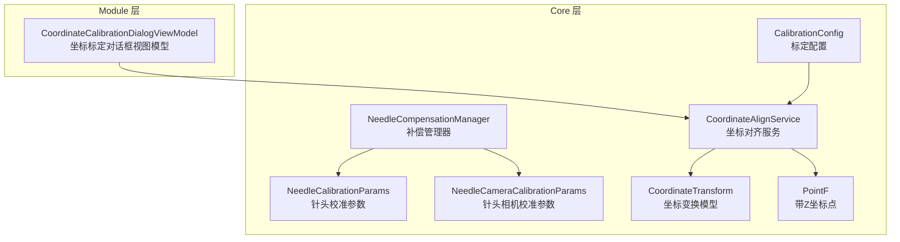
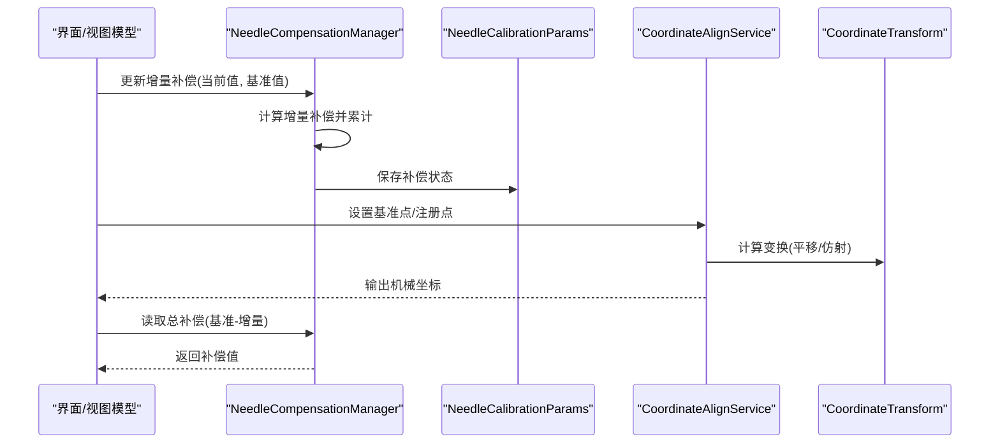
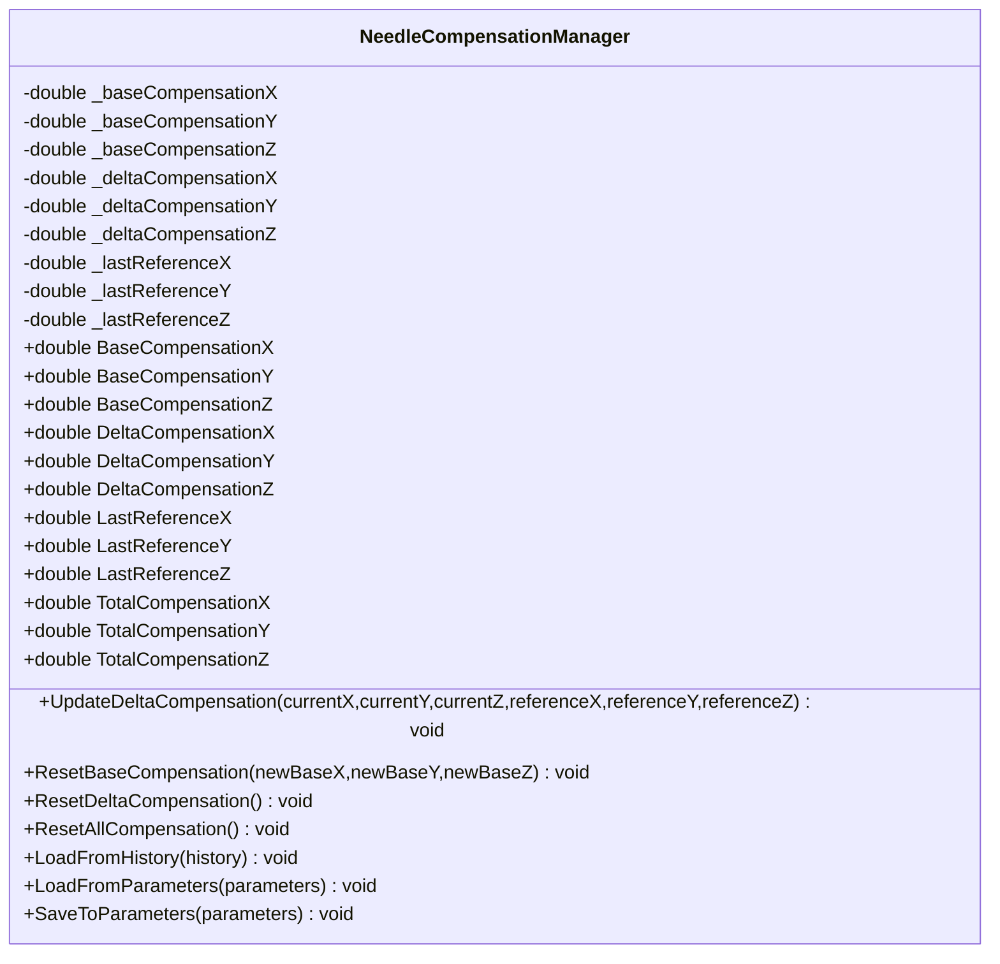
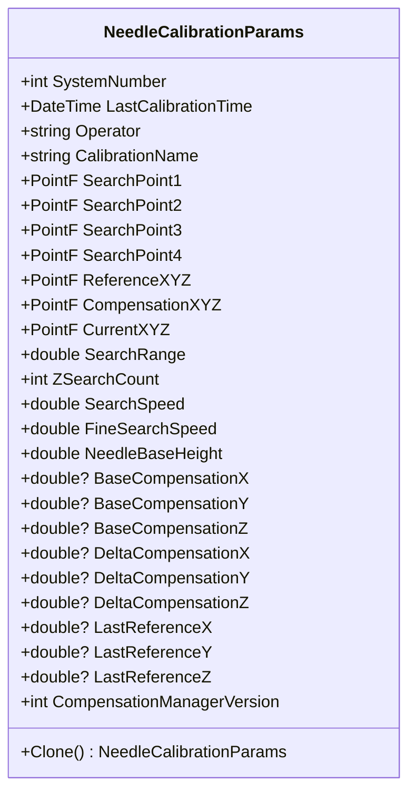
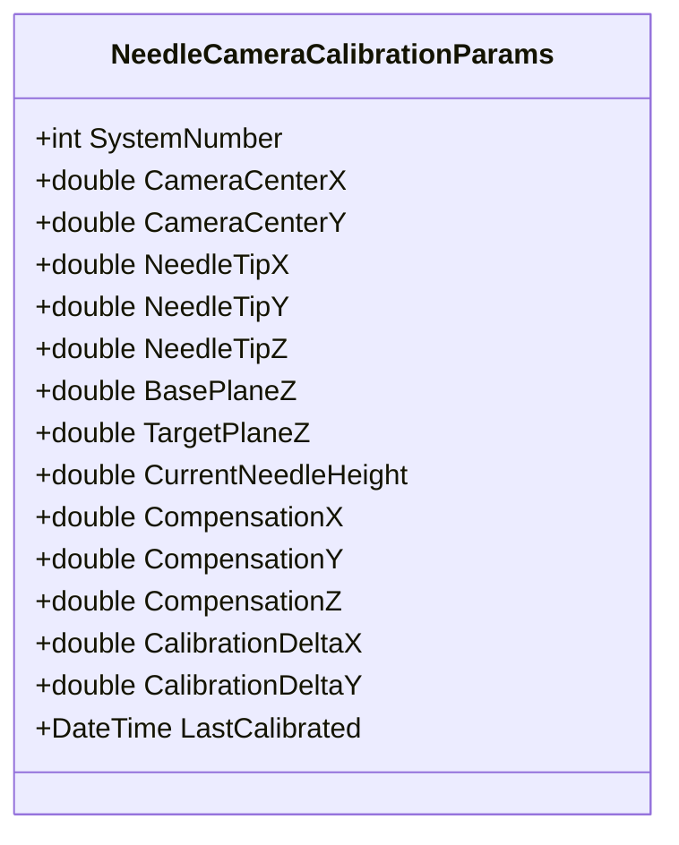
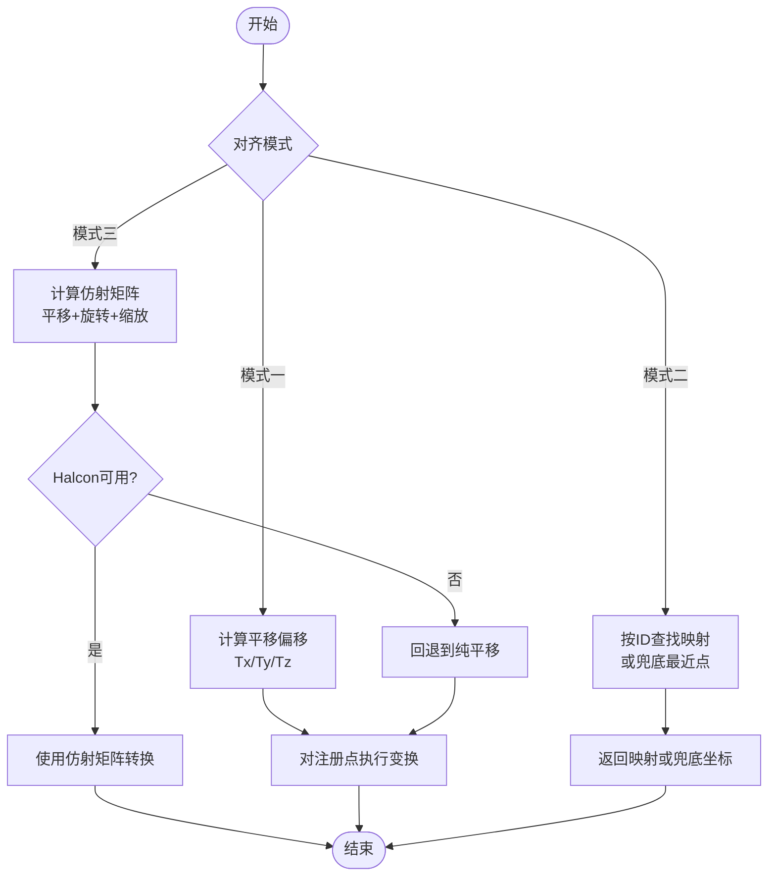
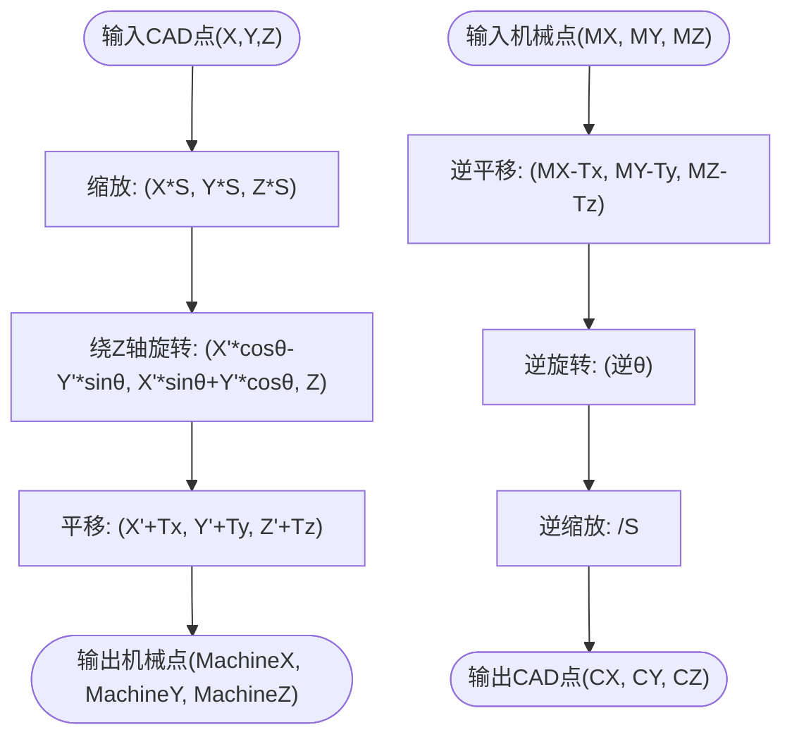
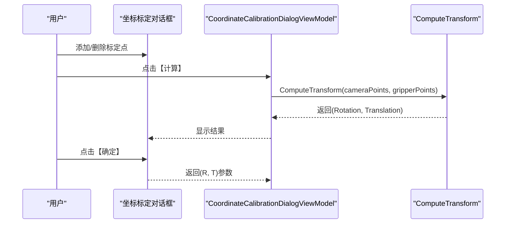
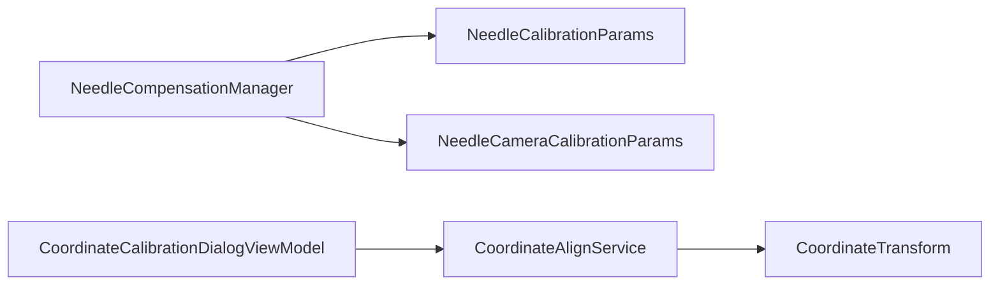

# 补偿校准服务

<cite>
**本文档引用的文件**
- [NeedleCompensationManager.cs](file://Core/Services/NeedleCompensationManager.cs)
- [NeedleCalibrationParams.cs](file://Core/Models/NeedleCalibrationParams.cs)
- [NeedleCameraCalibrationParams.cs](file://Core/Models/NeedleCameraCalibrationParams.cs)
- [CoordinateAlignService.cs](file://Core/Services/CoordinateAlignService.cs)
- [CoordinateTransform.cs](file://Core/Models/CoordinateTransform.cs)
- [PointF.cs](file://Core/Models/PointF.cs)
- [CoordinateCalibrationDialogViewModel.cs](file://Module/Controls/Dialogs/CoordinateCalibrationDialogViewModel.cs)
- [CalibrationConfig.cs](file://Core/Models/CalibrationConfig.cs)
- [spec.md](file://.trae/specs/vision-capture-coordinate-optimization/spec.md)
</cite>

## 目录
1. [简介](#简介)
2. [项目结构](#项目结构)
3. [核心组件](#核心组件)
4. [架构总览](#架构总览)
5. [详细组件分析](#详细组件分析)
6. [依赖关系分析](#依赖关系分析)
7. [性能考虑](#性能考虑)
8. [故障排查指南](#故障排查指南)
9. [结论](#结论)
10. [附录](#附录)

## 简介
本文件面向补偿校准服务的技术文档，重点解析 NeedleCompensationManager 的设计原理与实现机制，阐述针头补偿算法、坐标偏移计算、校准流程与精度控制策略。文档同时提供补偿校准的具体使用示例（自动校准、手动调整、补偿参数管理、质量检测），并总结在精密定位、视觉对准、装配精度等场景中的应用方法，以及校准标准、重复性测试、环境因素影响与长期稳定性维护的最佳实践。

## 项目结构
补偿校准相关的核心代码分布在 Core 层的服务与模型层，以及 Module 层的视图模型与对话框中：
- Core/Services：补偿管理器与坐标对齐服务
- Core/Models：补偿参数、相机校准参数、坐标变换与点结构
- Module/Controls：校准对话框与视图模型（用于坐标与相机-抓取器标定）

**图表来源**
- [NeedleCompensationManager.cs:1-244](file://Core/Services/NeedleCompensationManager.cs#L1-L244)
- [CoordinateAlignService.cs:1-407](file://Core/Services/CoordinateAlignService.cs#L1-L407)
- [CoordinateTransform.cs:1-187](file://Core/Models/CoordinateTransform.cs#L1-L187)
- [NeedleCalibrationParams.cs:1-280](file://Core/Models/NeedleCalibrationParams.cs#L1-L280)
- [NeedleCameraCalibrationParams.cs:1-28](file://Core/Models/NeedleCameraCalibrationParams.cs#L1-L28)
- [PointF.cs:1-36](file://Core/Models/PointF.cs#L1-L36)
- [CoordinateCalibrationDialogViewModel.cs:1-112](file://Module/Controls/Dialogs/CoordinateCalibrationDialogViewModel.cs#L1-L112)
- [CalibrationConfig.cs:1-27](file://Core/Models/CalibrationConfig.cs#L1-L27)

**章节来源**
- [NeedleCompensationManager.cs:1-244](file://Core/Services/NeedleCompensationManager.cs#L1-L244)
- [CoordinateAlignService.cs:1-407](file://Core/Services/CoordinateAlignService.cs#L1-L407)
- [NeedleCalibrationParams.cs:1-280](file://Core/Models/NeedleCalibrationParams.cs#L1-L280)
- [NeedleCameraCalibrationParams.cs:1-28](file://Core/Models/NeedleCameraCalibrationParams.cs#L1-L28)
- [CoordinateTransform.cs:1-187](file://Core/Models/CoordinateTransform.cs#L1-L187)
- [PointF.cs:1-36](file://Core/Models/PointF.cs#L1-L36)
- [CoordinateCalibrationDialogViewModel.cs:1-112](file://Module/Controls/Dialogs/CoordinateCalibrationDialogViewModel.cs#L1-L112)
- [CalibrationConfig.cs:1-27](file://Core/Models/CalibrationConfig.cs#L1-L27)

## 核心组件
- NeedleCompensationManager：实现“清零法”补偿逻辑，支持基准补偿与增量补偿的独立管理与合并，提供从参数对象加载/保存补偿状态的能力，并发布补偿变化事件。
- NeedleCalibrationParams：承载针头校准参数与补偿管理器状态，支持深拷贝与参数变更通知。
- NeedleCameraCalibrationParams：承载针头相机校准参数，包含相机中心、针尖位置、基准面与补偿等信息。
- CoordinateAlignService：提供 CAD 坐标系到机械坐标系的对齐与变换能力，支持模式一（纯平移）、模式二（逐点映射）与模式三（仿射对齐）。
- CoordinateTransform：封装平移、旋转、缩放的仿射变换参数，提供正变换与逆变换。
- PointF：带 Z 坐标的点结构，用于坐标参数传递与显示。
- CoordinateCalibrationDialogViewModel：坐标标定对话框视图模型，提供相机-抓取器坐标系标定的交互入口。
- CalibrationConfig：标定配置，包含标定模式与网格参数等。

**章节来源**
- [NeedleCompensationManager.cs:13-244](file://Core/Services/NeedleCompensationManager.cs#L13-L244)
- [NeedleCalibrationParams.cs:34-280](file://Core/Models/NeedleCalibrationParams.cs#L34-L280)
- [NeedleCameraCalibrationParams.cs:9-28](file://Core/Models/NeedleCameraCalibrationParams.cs#L9-L28)
- [CoordinateAlignService.cs:14-407](file://Core/Services/CoordinateAlignService.cs#L14-L407)
- [CoordinateTransform.cs:10-187](file://Core/Models/CoordinateTransform.cs#L10-L187)
- [PointF.cs:8-36](file://Core/Models/PointF.cs#L8-L36)
- [CoordinateCalibrationDialogViewModel.cs:30-112](file://Module/Controls/Dialogs/CoordinateCalibrationDialogViewModel.cs#L30-L112)
- [CalibrationConfig.cs:17-27](file://Core/Models/CalibrationConfig.cs#L17-L27)

## 架构总览
补偿校准服务由“补偿管理器 + 参数模型 + 坐标对齐服务 + 视图模型”构成，形成闭环的数据流与控制流：

**图表来源**
- [NeedleCompensationManager.cs:95-112](file://Core/Services/NeedleCompensationManager.cs#L95-L112)
- [NeedleCalibrationParams.cs:167-208](file://Core/Models/NeedleCalibrationParams.cs#L167-L208)
- [CoordinateAlignService.cs:104-122](file://Core/Services/CoordinateAlignService.cs#L104-L122)
- [CoordinateAlignService.cs:300-373](file://Core/Services/CoordinateAlignService.cs#L300-L373)
- [CoordinateTransform.cs:68-98](file://Core/Models/CoordinateTransform.cs#L68-L98)

## 详细组件分析

### NeedleCompensationManager 组件分析
- 设计原则
  - 清零法补偿：总补偿 = 基准补偿 − 当前增量补偿
  - 增量法更新：以“当前值与基准值”的偏差进行累积
  - 状态持久化：支持从参数对象加载/保存补偿状态
  - 事件发布：补偿变化时发布事件供订阅者响应
- 关键接口
  - 更新增量补偿：接收当前值与基准值，计算并累加增量补偿，同时保存最新基准值
  - 重置基准补偿：将当前针头位置设为新基准，并重置增量补偿
  - 重置增量补偿/全部补偿：清零增量补偿与基准补偿并同步总补偿
  - 从历史/参数加载/保存：支持从历史记录与参数对象恢复/持久化状态
- 数据结构与复杂度
  - 状态字段：O(1) 空间，属性访问 O(1)
  - 更新增量补偿：O(1) 时间，O(1) 空间
  - 总补偿计算：O(1) 时间，O(1) 空间
- 错误处理与边界
  - 参数为空时安全返回
  - 属性变更通知触发 UI 同步更新
- 最佳实践
  - 建议在每次校准后调用重置基准补偿，确保清零法有效
  - 结合视觉反馈循环更新增量补偿，保持实时性

**图表来源**
- [NeedleCompensationManager.cs:13-244](file://Core/Services/NeedleCompensationManager.cs#L13-L244)

**章节来源**
- [NeedleCompensationManager.cs:87-148](file://Core/Services/NeedleCompensationManager.cs#L87-L148)
- [NeedleCompensationManager.cs:95-112](file://Core/Services/NeedleCompensationManager.cs#L95-L112)
- [NeedleCompensationManager.cs:117-125](file://Core/Services/NeedleCompensationManager.cs#L117-L125)
- [NeedleCompensationManager.cs:127-148](file://Core/Services/NeedleCompensationManager.cs#L127-L148)
- [NeedleCompensationManager.cs:150-162](file://Core/Services/NeedleCompensationManager.cs#L150-L162)
- [NeedleCompensationManager.cs:167-208](file://Core/Services/NeedleCompensationManager.cs#L167-L208)

### NeedleCalibrationParams 组件分析
- 功能概述
  - 承载针头校准参数（搜索点、基准/当前/补偿坐标、搜索速度等）
  - 内嵌补偿管理器参数（基准补偿、增量补偿、最后基准值）
  - 提供深拷贝与参数变更通知，便于 UI 绑定与持久化
- 关键字段
  - 搜索点与搜索参数：SearchPoint1~4、SearchRange、ZSearchCount、SearchSpeed、FineSearchSpeed
  - 坐标参数：ReferenceXYZ、CompensationXYZ、CurrentXYZ
  - 针头参数：NeedleBaseHeight
  - 补偿管理器参数：BaseCompensationX/Y/Z、DeltaCompensationX/Y/Z、LastReferenceX/Y/Z、版本号
- 使用要点
  - 与 NeedleCompensationManager 协同：通过 LoadFromParameters/SaveToParameters 进行状态同步
  - UI 绑定：INotifyPropertyChanged 支持属性变更通知

**图表来源**
- [NeedleCalibrationParams.cs:34-252](file://Core/Models/NeedleCalibrationParams.cs#L34-L252)

**章节来源**
- [NeedleCalibrationParams.cs:38-198](file://Core/Models/NeedleCalibrationParams.cs#L38-L198)
- [NeedleCalibrationParams.cs:201-236](file://Core/Models/NeedleCalibrationParams.cs#L201-L236)

### NeedleCameraCalibrationParams 组件分析
- 功能概述
  - 承载针头相机校准参数，包含相机中心、针尖位置、基准面与目标面、当前针高、补偿与上次校准时间等
- 应用场景
  - 与视觉系统配合，实现针尖位置的相机坐标到机械坐标的转换与补偿

**图表来源**
- [NeedleCameraCalibrationParams.cs:9-28](file://Core/Models/NeedleCameraCalibrationParams.cs#L9-L28)

**章节来源**
- [NeedleCameraCalibrationParams.cs:11-25](file://Core/Models/NeedleCameraCalibrationParams.cs#L11-L25)

### CoordinateAlignService 组件分析
- 设计原则
  - 支持三种对齐模式：模式一（纯平移）、模式二（逐点映射）、模式三（仿射对齐）
  - 提供坐标变换查询与回退策略（Halcon 不可用时回退到纯平移）
- 关键流程
  - 模式一：基于基准点偏移构建平移变换，批量转换注册点
  - 模式二：按点 ID 手动映射，支持兜底最近点匹配
  - 模式三：使用 Halcon 计算仿射矩阵，支持平移+旋转+缩放
- 性能与健壮性
  - 仿射计算失败时回退到纯平移，保证系统可用性
  - 字符串距离用于模式二兜底匹配，降低映射缺失风险

**图表来源**
- [CoordinateAlignService.cs:104-122](file://Core/Services/CoordinateAlignService.cs#L104-L122)
- [CoordinateAlignService.cs:169-214](file://Core/Services/CoordinateAlignService.cs#L169-L214)
- [CoordinateAlignService.cs:300-373](file://Core/Services/CoordinateAlignService.cs#L300-L373)

**章节来源**
- [CoordinateAlignService.cs:66-89](file://Core/Services/CoordinateAlignService.cs#L66-L89)
- [CoordinateAlignService.cs:104-122](file://Core/Services/CoordinateAlignService.cs#L104-L122)
- [CoordinateAlignService.cs:147-154](file://Core/Services/CoordinateAlignService.cs#L147-L154)
- [CoordinateAlignService.cs:169-214](file://Core/Services/CoordinateAlignService.cs#L169-L214)
- [CoordinateAlignService.cs:300-373](file://Core/Services/CoordinateAlignService.cs#L300-L373)

### CoordinateTransform 组件分析
- 功能概述
  - 封装仿射变换参数（Tx、Ty、Tz、RotationAngle、Scale）
  - 提供正变换（CAD→机械）与逆变换（机械→CAD）
  - 支持构建变换矩阵与逆矩阵，便于组合与复用
- 算法要点
  - 变换顺序：缩放 → 旋转 → 平移（正变换）
  - 逆变换顺序：逆平移 → 逆旋转 → 逆缩放（逆变换）
  - Z 方向仅参与平移与缩放，不参与 2D 旋转

**图表来源**
- [CoordinateTransform.cs:68-136](file://Core/Models/CoordinateTransform.cs#L68-L136)

**章节来源**
- [CoordinateTransform.cs:37-56](file://Core/Models/CoordinateTransform.cs#L37-L56)
- [CoordinateTransform.cs:68-98](file://Core/Models/CoordinateTransform.cs#L68-L98)
- [CoordinateTransform.cs:110-136](file://Core/Models/CoordinateTransform.cs#L110-L136)
- [CoordinateTransform.cs:152-182](file://Core/Models/CoordinateTransform.cs#L152-L182)

### 视图模型与使用示例
- 坐标标定对话框
  - 提供添加/删除标定点、计算旋转矩阵与平移向量、确认返回的功能
  - 通过对话框参数返回标定结果，供上层模块使用
- 视觉坐标优化规范
  - 支持针头偏移与补偿参数与全局变量联动，参数变更后预览坐标同步更新
  - 预览坐标流程包含拍照位、视觉原始坐标、距离计算、偏移/补偿、最终坐标等步骤

**图表来源**
- [CoordinateCalibrationDialogViewModel.cs:69-96](file://Module/Controls/Dialogs/CoordinateCalibrationDialogViewModel.cs#L69-L96)

**章节来源**
- [CoordinateCalibrationDialogViewModel.cs:30-112](file://Module/Controls/Dialogs/CoordinateCalibrationDialogViewModel.cs#L30-L112)
- [spec.md:34-57](file://.trae/specs/vision-capture-coordinate-optimization/spec.md#L34-L57)

## 依赖关系分析
- NeedleCompensationManager 依赖 NeedleCalibrationParams 与 NeedleCameraCalibrationParams 以实现补偿状态的持久化与相机补偿的协同
- CoordinateAlignService 依赖 CoordinateTransform 与 HalconDotNet（在模式三中）进行坐标变换
- 视图模型 CoordinateCalibrationDialogViewModel 依赖 Core 层的坐标对齐服务与数学库进行标定计算

**图表来源**
- [NeedleCompensationManager.cs:167-208](file://Core/Services/NeedleCompensationManager.cs#L167-L208)
- [NeedleCalibrationParams.cs:184-198](file://Core/Models/NeedleCalibrationParams.cs#L184-L198)
- [NeedleCameraCalibrationParams.cs:9-28](file://Core/Models/NeedleCameraCalibrationParams.cs#L9-L28)
- [CoordinateAlignService.cs:14-407](file://Core/Services/CoordinateAlignService.cs#L14-L407)
- [CoordinateTransform.cs:10-187](file://Core/Models/CoordinateTransform.cs#L10-L187)
- [CoordinateCalibrationDialogViewModel.cs:30-112](file://Module/Controls/Dialogs/CoordinateCalibrationDialogViewModel.cs#L30-L112)

**章节来源**
- [NeedleCompensationManager.cs:167-208](file://Core/Services/NeedleCompensationManager.cs#L167-L208)
- [NeedleCalibrationParams.cs:184-198](file://Core/Models/NeedleCalibrationParams.cs#L184-L198)
- [CoordinateAlignService.cs:14-407](file://Core/Services/CoordinateAlignService.cs#L14-L407)
- [CoordinateTransform.cs:10-187](file://Core/Models/CoordinateTransform.cs#L10-L187)
- [CoordinateCalibrationDialogViewModel.cs:30-112](file://Module/Controls/Dialogs/CoordinateCalibrationDialogViewModel.cs#L30-L112)

## 性能考虑
- 增量补偿更新为 O(1) 操作，适合高频调用
- 坐标对齐服务在模式三中使用 Halcon 计算仿射矩阵，若 Halcon 不可用则回退到纯平移，避免阻塞
- 建议在 UI 层使用属性变更通知减少不必要的刷新
- 对于大规模点集的批量转换，优先使用模式一或模式三的矩阵运算，避免逐点循环

## 故障排查指南
- 补偿未生效
  - 检查是否正确调用重置基准补偿，确保清零法生效
  - 确认增量补偿是否持续更新
- 坐标对齐异常
  - 模式三仿射计算失败时会回退到纯平移，检查 Halcon 依赖是否正常
  - 模式二映射缺失时采用兜底匹配，确认映射表完整性
- 参数丢失
  - 确保在合适时机调用 SaveToParameters/LoadFromParameters
  - 检查参数对象的深拷贝与序列化一致性

**章节来源**
- [NeedleCompensationManager.cs:117-125](file://Core/Services/NeedleCompensationManager.cs#L117-L125)
- [NeedleCompensationManager.cs:167-208](file://Core/Services/NeedleCompensationManager.cs#L167-L208)
- [CoordinateAlignService.cs:354-373](file://Core/Services/CoordinateAlignService.cs#L354-L373)
- [CoordinateAlignService.cs:219-244](file://Core/Services/CoordinateAlignService.cs#L219-L244)

## 结论
NeedleCompensationManager 通过“清零法 + 增量法”的双轨补偿策略，结合 NeedleCalibrationParams 的参数持久化与事件机制，实现了针头补偿的高精度与可追溯性。CoordinateAlignService 提供多模式坐标对齐能力，保障 CAD 与机械坐标的一致性。配合视图模型与规范化的视觉坐标优化流程，补偿校准服务可在精密定位、视觉对准与装配精度等场景中稳定运行。

## 附录
- 使用示例（概念性说明）
  - 自动校准：在视觉捕获后，读取当前针尖位置与基准位置，调用增量补偿更新接口，随后保存参数
  - 手动调整：通过 UI 修改针头偏移与补偿参数，预览坐标同步更新，确认后保存
  - 补偿参数管理：在参数面板中加载/保存补偿状态，支持历史记录回溯
  - 质量检测：结合视觉坐标优化规范，验证预览坐标与最终坐标的误差
- 最佳实践
  - 校准标准：建立统一的校准流程与判定阈值
  - 重复性测试：定期进行重复性测试，记录偏差分布
  - 环境因素：控制温度、振动与电源波动，必要时进行环境补偿
  - 长期稳定性：定期校验与维护 Halcon 依赖、参数备份与版本兼容性