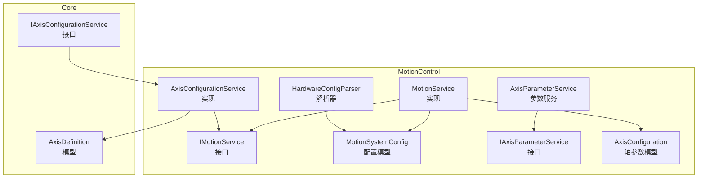
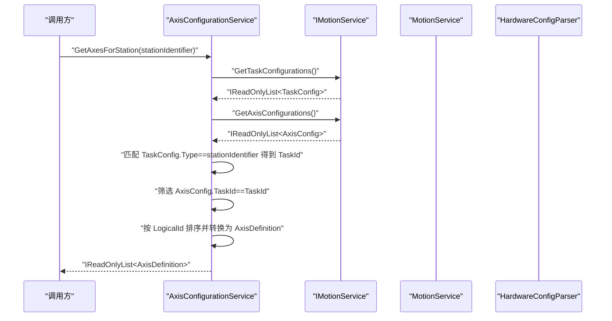
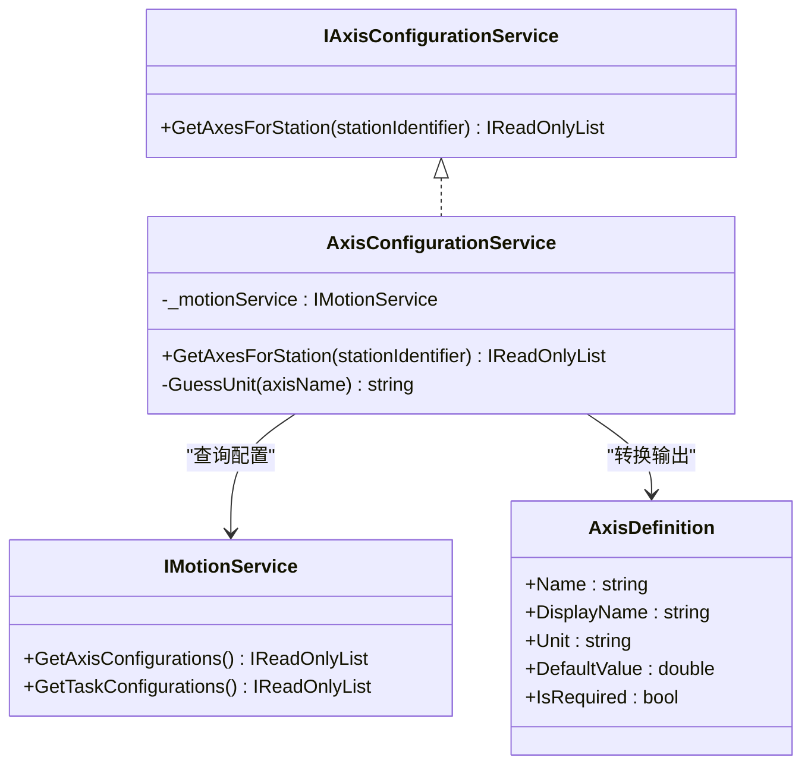
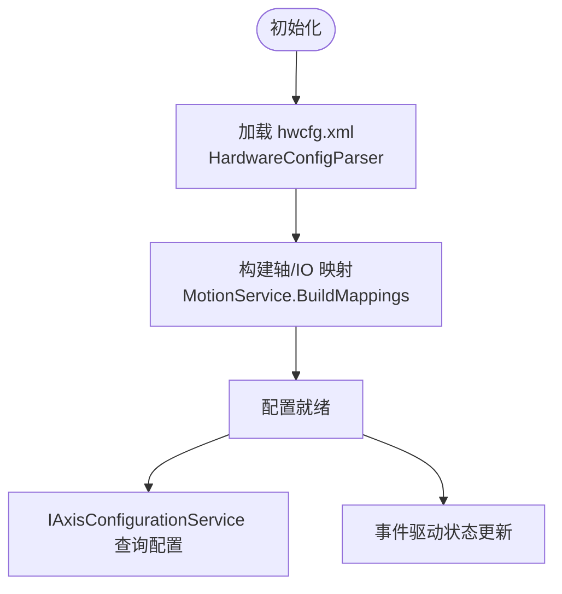
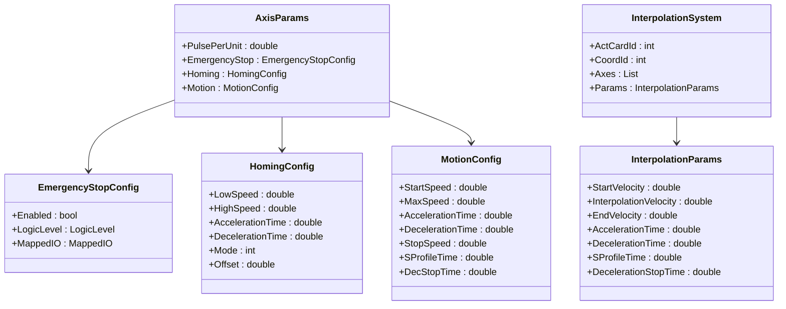
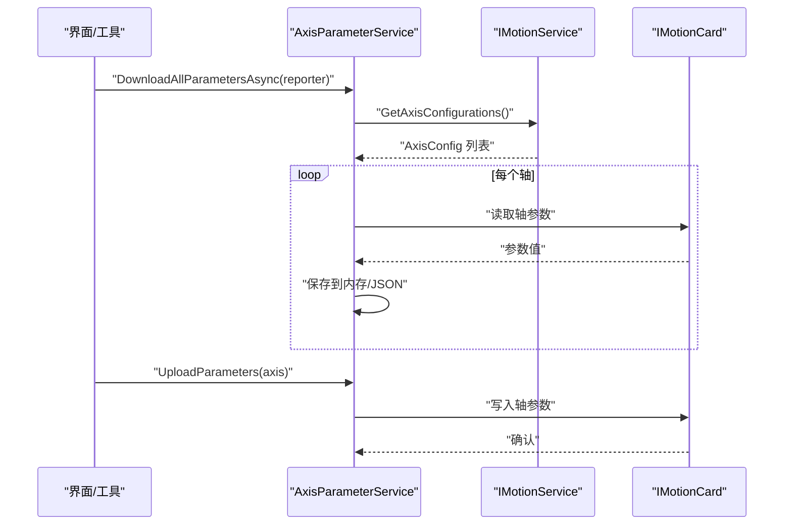
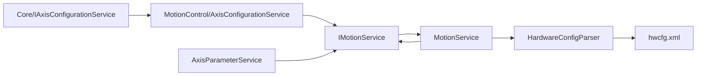

# 配置轴服务

<cite>
**本文档引用的文件**
- [Core/Services/AxisConfigurationService.cs](file://Core/Services/AxisConfigurationService.cs)
- [MotionControl/Services/AxisConfigurationService.cs](file://MotionControl/Services/AxisConfigurationService.cs)
- [MotionControl/Interfaces/IMotionService.cs](file://MotionControl/Interfaces/IMotionService.cs)
- [MotionControl/Services/MotionService.cs](file://MotionControl/Services/MotionService.cs)
- [MotionControl/Services/HardwareConfigParser.cs](file://MotionControl/Services/HardwareConfigParser.cs)
- [MotionControl/Models/MotionSystemConfig.cs](file://MotionControl/Models/MotionSystemConfig.cs)
- [MotionControl/Models/AxisConfiguration.cs](file://MotionControl/Models/AxisConfiguration.cs)
- [Core/Models/Position/AxisDefinition.cs](file://Core/Models/Position/AxisDefinition.cs)
- [.trae/documents/axis-configuration-refactoring.md](file://.trae/documents/axis-configuration-refactoring.md)
- [.trae/documents/axis-setting-migration-plan.md](file://.trae/documents/axis-setting-migration-plan.md)
- [MotionControl/Services/IAxisParameterService.cs](file://MotionControl/Services/IAxisParameterService.cs)
- [MotionControl/Services/AxisParameterService.cs](file://MotionControl/Services/AxisParameterService.cs)
</cite>

## 目录
1. [简介](#简介)
2. [项目结构](#项目结构)
3. [核心组件](#核心组件)
4. [架构总览](#架构总览)
5. [详细组件分析](#详细组件分析)
6. [依赖关系分析](#依赖关系分析)
7. [性能考量](#性能考量)
8. [故障排查指南](#故障排查指南)
9. [结论](#结论)
10. [附录](#附录)

## 简介
本文件面向“配置轴服务”的设计与实现，围绕 AxisConfigurationService 展开，系统阐述其在轴参数配置、运动限制、加速度控制、回零设置与安全保护策略方面的职责与机制。文档同时给出参数设置、配置验证、动态调整与配置备份的实践路径，并总结配置模板、批量设置、冲突检测与配置迁移的最佳实践，帮助读者在运动控制、设备调试与参数优化场景中高效落地。

## 项目结构
- 核心接口与模型位于 Core 与 MotionControl 模块，分别承担抽象与实现职责。
- AxisConfigurationService 的接口定义在 Core，实现迁移至 MotionControl，通过 IMotionService 访问 hwcfg.xml 解析出的硬件配置数据。
- 硬件配置解析由 HardwareConfigParser 完成，生成 MotionSystemConfig，供 MotionService 初始化与运行期查询使用。
- 轴参数服务 AxisParameterService 提供参数下载/上传、插补系统配置与速度查询等能力，支撑轴配置的动态调整与验证。

**图表来源**
- [Core/Services/AxisConfigurationService.cs:10-13](file://Core/Services/AxisConfigurationService.cs#L10-L13)
- [MotionControl/Services/AxisConfigurationService.cs:15-22](file://MotionControl/Services/AxisConfigurationService.cs#L15-L22)
- [MotionControl/Interfaces/IMotionService.cs:12-58](file://MotionControl/Interfaces/IMotionService.cs#L12-L58)
- [MotionControl/Services/MotionService.cs:36-128](file://MotionControl/Services/MotionService.cs#L36-L128)
- [MotionControl/Services/HardwareConfigParser.cs:21-121](file://MotionControl/Services/HardwareConfigParser.cs#L21-L121)
- [MotionControl/Models/MotionSystemConfig.cs:5-71](file://MotionControl/Models/MotionSystemConfig.cs#L5-L71)
- [MotionControl/Services/AxisParameterService.cs:15-27](file://MotionControl/Services/AxisParameterService.cs#L15-L27)
- [MotionControl/Services/IAxisParameterService.cs:8-22](file://MotionControl/Services/IAxisParameterService.cs#L8-L22)
- [MotionControl/Models/AxisConfiguration.cs:232-261](file://MotionControl/Models/AxisConfiguration.cs#L232-L261)
- [Core/Models/Position/AxisDefinition.cs:6-13](file://Core/Models/Position/AxisDefinition.cs#L6-L13)

**章节来源**
- [Core/Services/AxisConfigurationService.cs:1-15](file://Core/Services/AxisConfigurationService.cs#L1-L15)
- [MotionControl/Services/AxisConfigurationService.cs:1-69](file://MotionControl/Services/AxisConfigurationService.cs#L1-L69)
- [MotionControl/Interfaces/IMotionService.cs:1-91](file://MotionControl/Interfaces/IMotionService.cs#L1-L91)
- [MotionControl/Services/MotionService.cs:1-741](file://MotionControl/Services/MotionService.cs#L1-L741)
- [MotionControl/Services/HardwareConfigParser.cs:1-131](file://MotionControl/Services/HardwareConfigParser.cs#L1-L131)
- [MotionControl/Models/MotionSystemConfig.cs:1-71](file://MotionControl/Models/MotionSystemConfig.cs#L1-L71)
- [MotionControl/Models/AxisConfiguration.cs:1-298](file://MotionControl/Models/AxisConfiguration.cs#L1-L298)
- [Core/Models/Position/AxisDefinition.cs:1-15](file://Core/Models/Position/AxisDefinition.cs#L1-L15)
- [.trae/documents/axis-configuration-refactoring.md:1-127](file://.trae/documents/axis-configuration-refactoring.md#L1-L127)
- [.trae/documents/axis-setting-migration-plan.md:107-142](file://.trae/documents/axis-setting-migration-plan.md#L107-L142)

## 核心组件
- IAxisConfigurationService：定义按工站标识获取轴定义列表的能力，返回 Core.Models.AxisDefinition 列表。
- AxisConfigurationService（实现）：通过 IMotionService 获取 AxisConfig 与 TaskConfig，依据 taskId 建立轴-工站映射，再转换为 AxisDefinition。
- IMotionService：提供 GetAxisConfigurations()/GetTaskConfigurations() 查询接口，以及运动控制、IO、插补等能力。
- MotionService：负责加载 hwcfg.xml，构建轴/IO 映射，维护轴状态，发布轴状态事件，提供配置查询。
- HardwareConfigParser：解析 hwcfg.xml 为 MotionSystemConfig，包含 AxisConfig、TaskConfig 等。
- AxisParameterService：提供轴参数下载/上传、插补系统配置与速度查询，支持 JSON 配置文件的保存/加载。
- AxisConfiguration 模型族：EmergencyStopConfig、HomingConfig、MotionConfig、AxisParams、InterpolationSystem 等，承载安全保护、回零、运动限制与插补参数。

**章节来源**
- [Core/Services/AxisConfigurationService.cs:10-13](file://Core/Services/AxisConfigurationService.cs#L10-L13)
- [MotionControl/Services/AxisConfigurationService.cs:15-52](file://MotionControl/Services/AxisConfigurationService.cs#L15-L52)
- [MotionControl/Interfaces/IMotionService.cs:54-58](file://MotionControl/Interfaces/IMotionService.cs#L54-L58)
- [MotionControl/Services/MotionService.cs:126-161](file://MotionControl/Services/MotionService.cs#L126-L161)
- [MotionControl/Services/HardwareConfigParser.cs:21-121](file://MotionControl/Services/HardwareConfigParser.cs#L21-L121)
- [MotionControl/Services/AxisParameterService.cs:15-27](file://MotionControl/Services/AxisParameterService.cs#L15-L27)
- [MotionControl/Models/AxisConfiguration.cs:61-295](file://MotionControl/Models/AxisConfiguration.cs#L61-L295)

## 架构总览
AxisConfigurationService 的职责是“动态化”轴-工站映射，不再依赖硬编码，而是基于 hwcfg.xml 的 taskId 与 TaskConfig.Type 建立关联。其实现通过 IMotionService 暴露的配置查询方法获取 AxisConfig 与 TaskConfig，再进行筛选与转换。

**图表来源**
- [MotionControl/Services/AxisConfigurationService.cs:29-51](file://MotionControl/Services/AxisConfigurationService.cs#L29-L51)
- [MotionControl/Interfaces/IMotionService.cs:54-58](file://MotionControl/Interfaces/IMotionService.cs#L54-L58)
- [MotionControl/Services/MotionService.cs:583-587](file://MotionControl/Services/MotionService.cs#L583-L587)
- [MotionControl/Services/HardwareConfigParser.cs:21-121](file://MotionControl/Services/HardwareConfigParser.cs#L21-L121)

## 详细组件分析

### 组件一：AxisConfigurationService（实现）
- 职责
  - 依据工站标识（TaskConfig.Type）定位 TaskId；
  - 通过 AxisConfig.TaskId 过滤属于该工站的轴；
  - 按 AxisConfig.LogicalId 排序，转换为 AxisDefinition（含名称、显示名、单位、默认值、是否必填）。
- 关键点
  - 单位推断：以 R 开头或特定名称（Ey/Cy）识别旋转轴，单位为度；其余为毫米。
  - 依赖 IMotionService 的配置查询方法，避免重复解析 XML。
- 适用场景
  - 动态生成工站界面的轴列表；
  - 参数编辑器按工站过滤可用轴；
  - 配置验证阶段按工站核对轴清单。

**图表来源**
- [MotionControl/Services/AxisConfigurationService.cs:15-67](file://MotionControl/Services/AxisConfigurationService.cs#L15-L67)
- [MotionControl/Interfaces/IMotionService.cs:54-58](file://MotionControl/Interfaces/IMotionService.cs#L54-L58)
- [Core/Models/Position/AxisDefinition.cs:6-13](file://Core/Models/Position/AxisDefinition.cs#L6-L13)

**章节来源**
- [MotionControl/Services/AxisConfigurationService.cs:15-67](file://MotionControl/Services/AxisConfigurationService.cs#L15-L67)
- [Core/Models/Position/AxisDefinition.cs:6-13](file://Core/Models/Position/AxisDefinition.cs#L6-L13)

### 组件二：IMotionService 与 MotionService（配置查询与状态）
- 配置查询
  - GetAxisConfigurations()/GetTaskConfigurations()：提供 AxisConfig 与 TaskConfig 的只读集合。
- 运行期状态
  - 初始化阶段加载 hwcfg.xml，建立轴/IO 映射；
  - 事件驱动发布轴状态变更，替代轮询；
  - 提供回零、插补、IO 读写等运动控制能力。
- 与 AxisConfigurationService 的协作
  - AxisConfigurationService 通过 IMotionService 获取配置，实现“配置即代码”的动态映射。

**图表来源**
- [MotionControl/Services/MotionService.cs:126-203](file://MotionControl/Services/MotionService.cs#L126-L203)
- [MotionControl/Services/HardwareConfigParser.cs:21-121](file://MotionControl/Services/HardwareConfigParser.cs#L21-L121)
- [MotionControl/Interfaces/IMotionService.cs:54-58](file://MotionControl/Interfaces/IMotionService.cs#L54-L58)

**章节来源**
- [MotionControl/Interfaces/IMotionService.cs:54-58](file://MotionControl/Interfaces/IMotionService.cs#L54-L58)
- [MotionControl/Services/MotionService.cs:126-203](file://MotionControl/Services/MotionService.cs#L126-L203)

### 组件三：轴参数模型族（安全保护、回零、运动限制、插补）
- 安全保护
  - EmergencyStopConfig：启用、逻辑电平、映射 IO 等。
- 回零设置
  - HomingConfig：低速/高速、加速/减速时间、模式、偏移。
- 运动限制
  - MotionConfig：起始/最大/停止速度、加速/减速时间、S 形曲线时间、减速停止时间。
- 插补系统
  - InterpolationSystem/InterpolationParams：包含轴集合与速度曲线参数。

**图表来源**
- [MotionControl/Models/AxisConfiguration.cs:61-295](file://MotionControl/Models/AxisConfiguration.cs#L61-L295)

**章节来源**
- [MotionControl/Models/AxisConfiguration.cs:61-295](file://MotionControl/Models/AxisConfiguration.cs#L61-L295)

### 组件四：轴参数服务（下载/上传、插补配置、速度查询）
- 职责
  - 从 hwcfg.xml 加载轴定义；
  - 通过 IMotionCard 接口读写参数（非直接调用底层库）；
  - JSON 配置文件的保存/加载；
  - 插补系配置管理与速度查询。
- 与 AxisConfigurationService 的关系
  - AxisConfigurationService 负责“轴清单”，AxisParameterService 负责“轴参数”。

**图表来源**
- [MotionControl/Services/AxisParameterService.cs:15-27](file://MotionControl/Services/AxisParameterService.cs#L15-L27)
- [MotionControl/Services/IAxisParameterService.cs:8-22](file://MotionControl/Services/IAxisParameterService.cs#L8-L22)
- [MotionControl/Interfaces/IMotionService.cs:54-58](file://MotionControl/Interfaces/IMotionService.cs#L54-L58)

**章节来源**
- [MotionControl/Services/AxisParameterService.cs:15-27](file://MotionControl/Services/AxisParameterService.cs#L15-L27)
- [MotionControl/Services/IAxisParameterService.cs:8-22](file://MotionControl/Services/IAxisParameterService.cs#L8-L22)

## 依赖关系分析
- 松耦合
  - Core 仅定义接口与最小模型，避免对硬件细节的耦合；
  - MotionControl 通过 IMotionService 暴露配置查询，AxisConfigurationService 仅依赖接口。
- 关键依赖链
  - AxisConfigurationService → IMotionService → MotionService → HardwareConfigParser → hwcfg.xml
  - AxisParameterService → IMotionService → MotionService → IMotionCard（参数读写）

**图表来源**
- [Core/Services/AxisConfigurationService.cs:10-13](file://Core/Services/AxisConfigurationService.cs#L10-L13)
- [MotionControl/Services/AxisConfigurationService.cs:17-22](file://MotionControl/Services/AxisConfigurationService.cs#L17-L22)
- [MotionControl/Interfaces/IMotionService.cs:12-58](file://MotionControl/Interfaces/IMotionService.cs#L12-L58)
- [MotionControl/Services/MotionService.cs:126-161](file://MotionControl/Services/MotionService.cs#L126-L161)
- [MotionControl/Services/HardwareConfigParser.cs:21-121](file://MotionControl/Services/HardwareConfigParser.cs#L21-L121)

**章节来源**
- [Core/Services/AxisConfigurationService.cs:10-13](file://Core/Services/AxisConfigurationService.cs#L10-L13)
- [MotionControl/Services/AxisConfigurationService.cs:17-22](file://MotionControl/Services/AxisConfigurationService.cs#L17-L22)
- [MotionControl/Interfaces/IMotionService.cs:12-58](file://MotionControl/Interfaces/IMotionService.cs#L12-L58)
- [MotionControl/Services/MotionService.cs:126-161](file://MotionControl/Services/MotionService.cs#L126-L161)
- [MotionControl/Services/HardwareConfigParser.cs:21-121](file://MotionControl/Services/HardwareConfigParser.cs#L21-L121)

## 性能考量
- 事件驱动轮询
  - MotionService 采用 IObservable 与高优先级轮询线程，快速报警检测与状态更新，降低 UI 线程压力。
- 等待完成算法
  - 运动完成采用 SpinWait 自旋等待，结合取消令牌实现急停秒响应，减少抖动与 CPU 占用。
- 插补实时性
  - 连续插补初始化与等待完成采用异步自旋，确保点胶等场景的实时性与稳定性。

**章节来源**
- [MotionControl/Services/MotionService.cs:418-579](file://MotionControl/Services/MotionService.cs#L418-L579)
- [MotionControl/Services/MotionService.cs:647-725](file://MotionControl/Services/MotionService.cs#L647-L725)

## 故障排查指南
- 回零失败
  - 现象：HomeAsync 返回负值或抛出可恢复异常。
  - 排查要点：原点传感器、回零方向、是否撞限位；复位后重试。
- 运动未到位
  - 现象：WaitForDone/WaitForCoordDone 校验失败，抛出可恢复异常。
  - 排查要点：是否存在碰撞、限位或伺服异常；检查机械与参数设置。
- 急停/报警
  - 现象：CheckCriticalAlarms 检测到 ALM/EMG 位变化，触发报警记录。
  - 排查要点：检查硬件连线、I/O 映射与逻辑电平。

**章节来源**
- [MotionControl/Services/MotionService.cs:255-290](file://MotionControl/Services/MotionService.cs#L255-L290)
- [MotionControl/Services/MotionService.cs:332-354](file://MotionControl/Services/MotionService.cs#L332-L354)
- [MotionControl/Services/MotionService.cs:472-504](file://MotionControl/Services/MotionService.cs#L472-L504)

## 结论
AxisConfigurationService 通过 IMotionService 的配置查询能力，实现了轴-工站映射的“配置即代码”，消除了硬编码带来的维护成本。配合 AxisParameterService 的参数读写与插补配置能力，形成从“轴清单”到“轴参数”的完整闭环。在运动控制、设备调试与参数优化场景中，建议遵循“配置先行、参数验证、动态调整、备份迁移”的流程，确保系统稳定与可追溯。

## 附录

### 配置模板与最佳实践
- 配置模板
  - hwcfg.xml：定义轴、任务、I/O 与信号分组，AxisConfigurationService 通过 taskId 建立轴-工站映射。
  - JSON 轴参数文件：用于参数备份与批量导入。
- 批量设置
  - 使用 AxisParameterService 的 DownloadAllParametersAsync/UploadParameters，统一处理参数下载/上传。
- 冲突检测
  - 通过 MotionService 的状态轮询与事件驱动，及时发现报警/急停状态变化，避免冲突扩大。
- 配置迁移
  - 重构计划明确：保留 taskId 字段，确保 AxisConfigurationService 与 TaskConfig.Type 的一致性；规范化轴名称，避免歧义。

**章节来源**
- [.trae/documents/axis-configuration-refactoring.md:104-127](file://.trae/documents/axis-configuration-refactoring.md#L104-L127)
- [.trae/documents/axis-setting-migration-plan.md:107-142](file://.trae/documents/axis-setting-migration-plan.md#L107-L142)
- [MotionControl/Services/HardwareConfigParser.cs:21-121](file://MotionControl/Services/HardwareConfigParser.cs#L21-L121)
- [MotionControl/Services/AxisParameterService.cs:15-27](file://MotionControl/Services/AxisParameterService.cs#L15-L27)