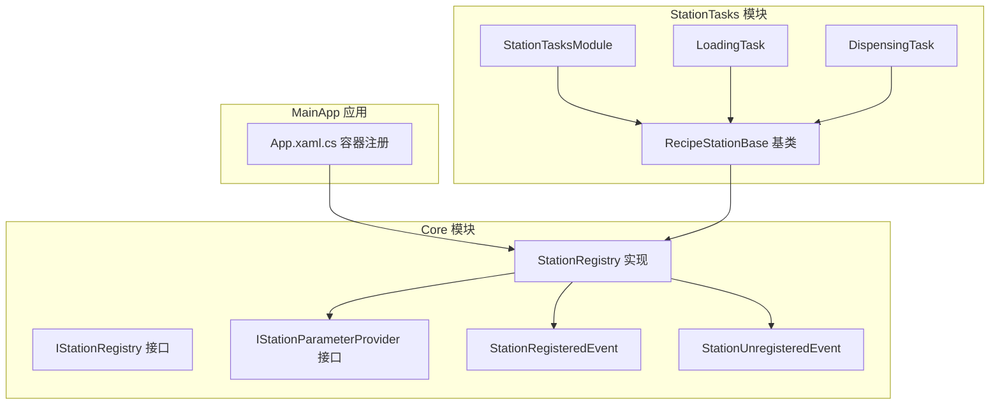
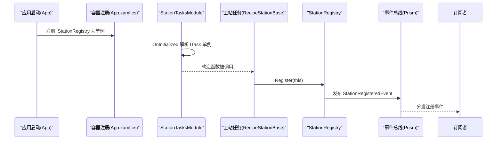
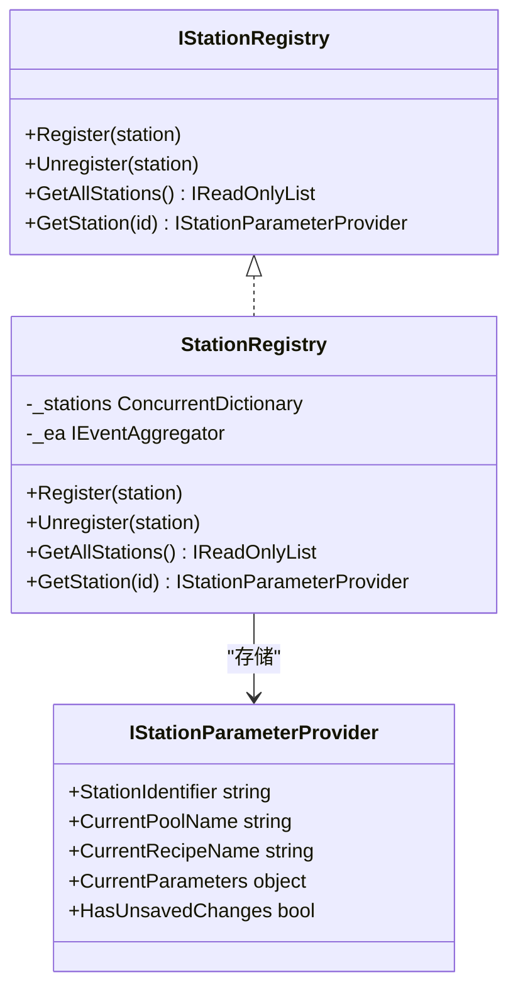
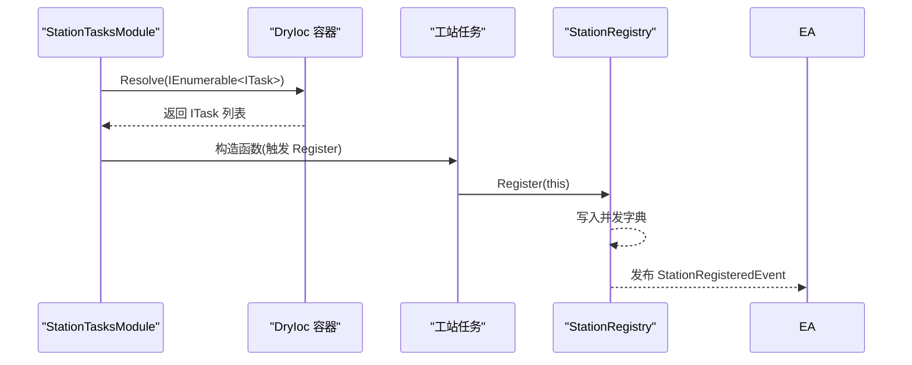
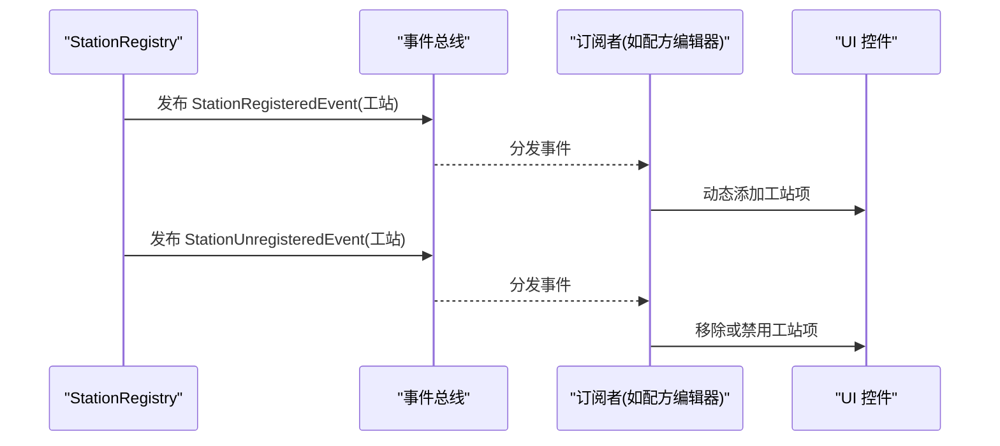
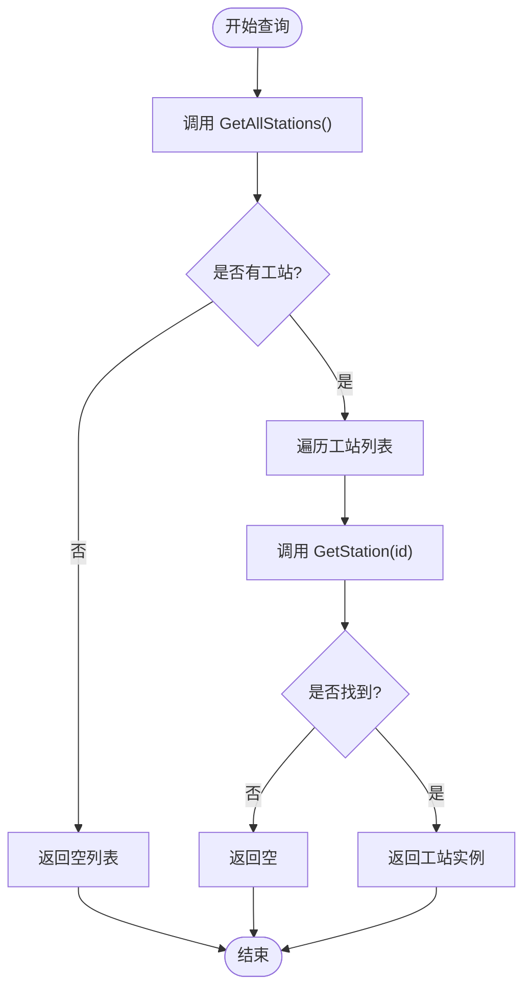
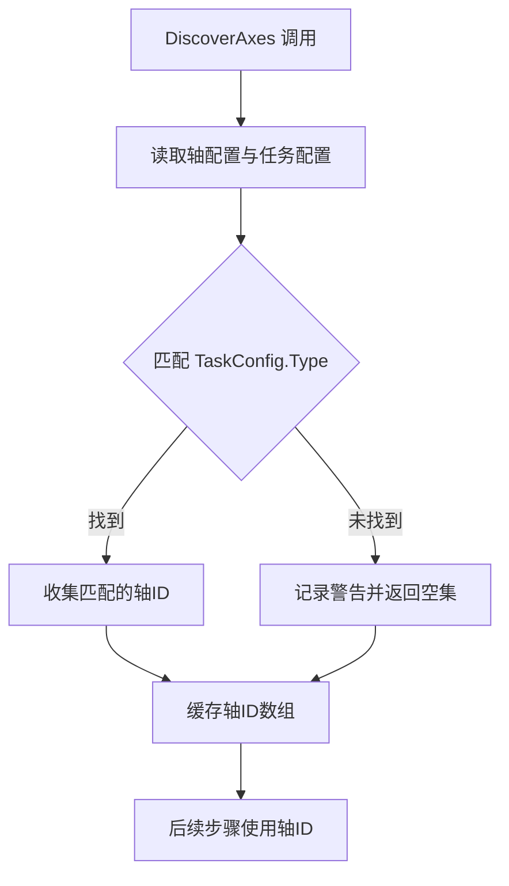
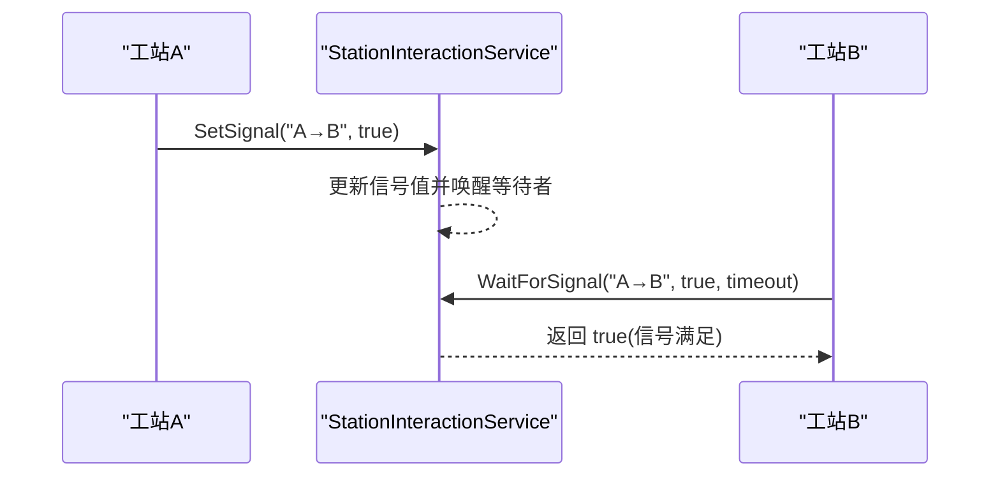
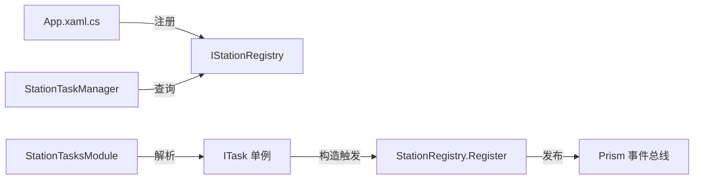

# 工站注册表

<cite>
**本文档引用的文件**
- [IStationRegistry.cs](file://Core/Abstraction/IStationRegistry.cs)
- [StationRegistry.cs](file://Core/Services/StationRegistry.cs)
- [IStationParameterProvider.cs](file://Core/Abstraction/IStationParameterProvider.cs)
- [StationRegisteredEvent.cs](file://Core/Events/StationRegisteredEvent.cs)
- [StationUnregisteredEvent.cs](file://Core/Events/StationUnregisteredEvent.cs)
- [App.xaml.cs](file://MainApp/App.xaml.cs)
- [StationTasksModule.cs](file://StationTasks/StationTasksModule.cs)
- [RecipeStationBase.cs](file://StationTasks/Tasks/RecipeStationBase.cs)
- [LoadingTask.cs](file://StationTasks/Tasks/LoadingTask.cs)
- [DispensingTask.cs](file://StationTasks/Tasks/DispensingTask.cs)
- [MultiStationPositionEditorViewModel.cs](file://RecipeManagement/ViewModels/MultiStationPositionEditorViewModel.cs)
- [ProcessStepExecutor.cs](file://StationTasks/Actions/ProcessStepExecutor.cs)
- [StationTaskManager.cs](file://MotionControl/Services/StationTaskManager.cs)
- [StationInteractionService.cs](file://MotionControl/Services/StationInteractionService.cs)
- [summary.md](file://.trae/rules/summary.md)
</cite>

## 目录
1. [引言](#引言)
2. [项目结构](#项目结构)
3. [核心组件](#核心组件)
4. [架构总览](#架构总览)
5. [详细组件分析](#详细组件分析)
6. [依赖分析](#依赖分析)
7. [性能考虑](#性能考虑)
8. [故障排查指南](#故障排查指南)
9. [结论](#结论)
10. [附录](#附录)

## 引言
本文件围绕“工站注册表”展开，系统性解析 IStationRegistry 接口与 StationRegistry 实现的设计与实现细节，涵盖工站的注册、注销、查询与状态管理；阐明 StationRegisteredEvent 与 StationUnregisteredEvent 的触发时机与数据传递；梳理线程安全性与并发访问控制；给出工站注册的 API 使用示例、事件订阅与处理方法、工站状态监控机制，并进一步阐述工站发现机制、动态工站管理与工站间通信协调等高级能力。

## 项目结构
工站注册表位于 Core 模块，采用接口与实现分离的设计，结合 Prism 事件总线实现跨模块解耦。工站任务在构造阶段自注册，StationTasksModule 通过解析 ITask 单例触发自注册流程，确保不受模块加载时序影响。

**图表来源**
- [IStationRegistry.cs:1-21](file://Core/Abstraction/IStationRegistry.cs#L1-L21)
- [StationRegistry.cs:1-47](file://Core/Services/StationRegistry.cs#L1-L47)
- [IStationParameterProvider.cs:1-24](file://Core/Abstraction/IStationParameterProvider.cs#L1-L24)
- [StationRegisteredEvent.cs:1-11](file://Core/Events/StationRegisteredEvent.cs#L1-L11)
- [StationUnregisteredEvent.cs:1-11](file://Core/Events/StationUnregisteredEvent.cs#L1-L11)
- [App.xaml.cs:122-149](file://MainApp/App.xaml.cs#L122-L149)
- [StationTasksModule.cs:1-64](file://StationTasks/StationTasksModule.cs#L1-L64)
- [RecipeStationBase.cs:1-187](file://StationTasks/Tasks/RecipeStationBase.cs#L1-L187)
- [LoadingTask.cs:1-110](file://StationTasks/Tasks/LoadingTask.cs#L1-L110)
- [DispensingTask.cs:1-123](file://StationTasks/Tasks/DispensingTask.cs#L1-L123)

**章节来源**
- [IStationRegistry.cs:1-21](file://Core/Abstraction/IStationRegistry.cs#L1-L21)
- [StationRegistry.cs:1-47](file://Core/Services/StationRegistry.cs#L1-L47)
- [App.xaml.cs:122-149](file://MainApp/App.xaml.cs#L122-L149)
- [StationTasksModule.cs:1-64](file://StationTasks/StationTasksModule.cs#L1-L64)

## 核心组件
- IStationRegistry：定义工站注册表的统一抽象，提供 Register、Unregister、GetAllStations、GetStation 四项能力。
- StationRegistry：IStationRegistry 的线程安全实现，内部使用并发字典存储工站，注册/注销时通过 Prism 事件发布 StationRegisteredEvent/StationUnregisteredEvent。
- IStationParameterProvider：工站参数提供者接口，暴露工站标识、当前配方池/名称、当前参数对象以及是否有未保存更改等信息。
- 事件系统：StationRegisteredEvent/StationUnregisteredEvent 作为跨模块通信通道，驱动 UI 动态更新与业务联动。

**章节来源**
- [IStationRegistry.cs:1-21](file://Core/Abstraction/IStationRegistry.cs#L1-L21)
- [StationRegistry.cs:1-47](file://Core/Services/StationRegistry.cs#L1-L47)
- [IStationParameterProvider.cs:1-24](file://Core/Abstraction/IStationParameterProvider.cs#L1-L24)
- [StationRegisteredEvent.cs:1-11](file://Core/Events/StationRegisteredEvent.cs#L1-L11)
- [StationUnregisteredEvent.cs:1-11](file://Core/Events/StationUnregisteredEvent.cs#L1-L11)

## 架构总览
工站注册表采用“自注册 + 事件广播”的架构。工站任务在构造函数中调用注册表进行自注册，并通过事件总线通知其他模块；StationTasksModule 在初始化阶段解析 ITask 单例，强制触发各工站的自注册流程，从而规避模块加载时序导致的注入为空问题。

**图表来源**
- [App.xaml.cs:122-149](file://MainApp/App.xaml.cs#L122-L149)
- [StationTasksModule.cs:52-62](file://StationTasks/StationTasksModule.cs#L52-L62)
- [RecipeStationBase.cs:76-78](file://StationTasks/Tasks/RecipeStationBase.cs#L76-L78)
- [StationRegistry.cs:24-29](file://Core/Services/StationRegistry.cs#L24-L29)
- [StationRegisteredEvent.cs:1-11](file://Core/Events/StationRegisteredEvent.cs#L1-L11)

## 详细组件分析

### IStationRegistry 接口与职责
- Register：注册一个实现了 IStationParameterProvider 的工站实例，要求提供非空的 StationIdentifier。
- Unregister：注销指定工站，若成功移除则发布注销事件。
- GetAllStations：返回当前所有已注册工站的只读列表。
- GetStation：按工站标识符检索工站实例，不存在则返回空。

该接口将“注册/查询”与“事件发布”解耦，便于在不同模块中按需使用。

**章节来源**
- [IStationRegistry.cs:1-21](file://Core/Abstraction/IStationRegistry.cs#L1-L21)

### StationRegistry 实现与线程安全
- 数据结构：内部使用并发字典存储工站，键为 StationIdentifier，值为 IStationParameterProvider 实例，天然支持多线程读写。
- 注册流程：校验输入合法性后写入字典，随后发布 StationRegisteredEvent。
- 注销流程：尝试移除字典项，若成功则发布 StationUnregisteredEvent。
- 查询流程：直接返回字典值的列表视图，保证 O(1) 查找与 O(n) 枚举。

**图表来源**
- [StationRegistry.cs:1-47](file://Core/Services/StationRegistry.cs#L1-L47)
- [IStationRegistry.cs:1-21](file://Core/Abstraction/IStationRegistry.cs#L1-L21)
- [IStationParameterProvider.cs:1-24](file://Core/Abstraction/IStationParameterProvider.cs#L1-L24)

**章节来源**
- [StationRegistry.cs:1-47](file://Core/Services/StationRegistry.cs#L1-L47)

### 工站自注册与模块加载时序
- 工站任务在基类构造函数中调用 Register(this)，确保实例化即注册。
- StationTasksModule.OnInitialized 解析 ITask 单例，强制触发构造函数，从而完成所有工站的自注册。
- 该机制有效避免了因模块加载顺序导致的注入为空问题。

**图表来源**
- [StationTasksModule.cs:52-62](file://StationTasks/StationTasksModule.cs#L52-L62)
- [RecipeStationBase.cs:76-78](file://StationTasks/Tasks/RecipeStationBase.cs#L76-L78)
- [StationRegistry.cs:24-29](file://Core/Services/StationRegistry.cs#L24-L29)

**章节来源**
- [StationTasksModule.cs:52-62](file://StationTasks/StationTasksModule.cs#L52-L62)
- [RecipeStationBase.cs:76-78](file://StationTasks/Tasks/RecipeStationBase.cs#L76-L78)

### 事件触发时机与数据传递
- StationRegisteredEvent：在 Register 成功写入字典后发布，事件载荷为注册的 IStationParameterProvider 实例。
- StationUnregisteredEvent：在 Unregister 成功移除字典项后发布，事件载荷同样为 IStationParameterProvider 实例。
- 订阅者可基于事件动态刷新 UI 或执行联动逻辑（如配方编辑器动态添加工站项）。

**图表来源**
- [StationRegistry.cs:28-37](file://Core/Services/StationRegistry.cs#L28-L37)
- [StationRegisteredEvent.cs:1-11](file://Core/Events/StationRegisteredEvent.cs#L1-L11)
- [StationUnregisteredEvent.cs:1-11](file://Core/Events/StationUnregisteredEvent.cs#L1-L11)
- [MultiStationPositionEditorViewModel.cs:178-192](file://RecipeManagement/ViewModels/MultiStationPositionEditorViewModel.cs#L178-L192)

**章节来源**
- [StationRegistry.cs:24-37](file://Core/Services/StationRegistry.cs#L24-L37)
- [StationRegisteredEvent.cs:1-11](file://Core/Events/StationRegisteredEvent.cs#L1-L11)
- [StationUnregisteredEvent.cs:1-11](file://Core/Events/StationUnregisteredEvent.cs#L1-L11)
- [MultiStationPositionEditorViewModel.cs:178-192](file://RecipeManagement/ViewModels/MultiStationPositionEditorViewModel.cs#L178-L192)

### 工站查询与状态监控
- 查询：通过 GetAllStations 获取所有工站，或通过 GetStation 按标识符精确查询。
- 状态监控：ProcessStepExecutor 在跨工站执行时，会向所有涉及的目标工站发布状态事件，驱动 UI 刷新。
- 工站参数：IStationParameterProvider 提供 CurrentParameters、CurrentRecipeName 等信息，便于 UI 展示与编辑。

**图表来源**
- [StationRegistry.cs:40-44](file://Core/Services/StationRegistry.cs#L40-L44)
- [ProcessStepExecutor.cs:193-217](file://StationTasks/Actions/ProcessStepExecutor.cs#L193-L217)

**章节来源**
- [StationRegistry.cs:40-44](file://Core/Services/StationRegistry.cs#L40-L44)
- [ProcessStepExecutor.cs:193-217](file://StationTasks/Actions/ProcessStepExecutor.cs#L193-L217)

### 工站发现机制与动态管理
- 工站发现：StationTaskBase 在 DiscoverAxes 中依据硬件配置文件动态发现属于当前工站的轴集合，匹配规则来自 TaskConfig.Type 与 AxisConfig.TaskId。
- 动态管理：UI 订阅 StationRegisteredEvent，在新工站注册时动态添加到选择列表；同时通过 GetAllStations 保持列表实时更新。

**图表来源**
- [StationTaskBase.cs:51-77](file://MotionControl/Services/StationTaskBase.cs#L51-L77)
- [MultiStationPositionEditorViewModel.cs:178-192](file://RecipeManagement/ViewModels/MultiStationPositionEditorViewModel.cs#L178-L192)

**章节来源**
- [StationTaskBase.cs:51-77](file://MotionControl/Services/StationTaskBase.cs#L51-L77)
- [MultiStationPositionEditorViewModel.cs:178-192](file://RecipeManagement/ViewModels/MultiStationPositionEditorViewModel.cs#L178-L192)

### 工站间通信协调
- 信号交互：StationInteractionService 提供 SetSignal、GetSignal、WaitForSignal，支持工站间以字符串全名进行布尔信号传递与等待。
- 并发模型：内部使用并发字典与 AutoResetEvent，确保多线程场景下的正确性与响应性。

**图表来源**
- [StationInteractionService.cs:1-46](file://MotionControl/Services/StationInteractionService.cs#L1-L46)

**章节来源**
- [StationInteractionService.cs:1-46](file://MotionControl/Services/StationInteractionService.cs#L1-L46)

### API 使用示例与最佳实践
- 注册工站
  - 在工站任务构造函数中调用 Register(this)（由基类 RecipeStationBase 统一完成）。
  - 确保 IStationRegistry 已在容器中注册为单例。
- 查询工站
  - 通过 IStationRegistry.GetAllStations() 获取全部工站，或通过 GetStation(identifier) 获取特定工站。
- 订阅事件
  - 订阅 StationRegisteredEvent 与 StationUnregisteredEvent，以便在 UI 中动态增删工站项。
- 状态监控
  - 在跨工站执行时，利用 ProcessStepExecutor 对目标工站发布状态事件，驱动 UI 刷新。
- 工站间通信
  - 使用 StationInteractionService 的 SetSignal/WaitForSignal 实现同步与协调。

**章节来源**
- [RecipeStationBase.cs:76-78](file://StationTasks/Tasks/RecipeStationBase.cs#L76-L78)
- [App.xaml.cs:122-149](file://MainApp/App.xaml.cs#L122-L149)
- [ProcessStepExecutor.cs:105-109](file://StationTasks/Actions/ProcessStepExecutor.cs#L105-L109)
- [MultiStationPositionEditorViewModel.cs:178-192](file://RecipeManagement/ViewModels/MultiStationPositionEditorViewModel.cs#L178-L192)
- [StationInteractionService.cs:20-44](file://MotionControl/Services/StationInteractionService.cs#L20-L44)

## 依赖分析
- 容器注册：MainApp 中将 IStationRegistry 注册为单例，确保全局唯一。
- 模块初始化：StationTasksModule 在 OnInitialized 中解析 ITask，强制触发自注册。
- 事件依赖：StationRegistry 依赖 Prism 事件聚合器发布事件。
- 查询依赖：StationTaskManager 通过 IStationRegistry 获取所有 ITask 实例，实现批量启动/停止。

**图表来源**
- [App.xaml.cs:122-149](file://MainApp/App.xaml.cs#L122-L149)
- [StationTasksModule.cs:56-62](file://StationTasks/StationTasksModule.cs#L56-L62)
- [StationRegistry.cs:24-29](file://Core/Services/StationRegistry.cs#L24-L29)
- [StationTaskManager.cs:23-30](file://MotionControl/Services/StationTaskManager.cs#L23-L30)

**章节来源**
- [App.xaml.cs:122-149](file://MainApp/App.xaml.cs#L122-L149)
- [StationTasksModule.cs:56-62](file://StationTasks/StationTasksModule.cs#L56-L62)
- [StationTaskManager.cs:23-30](file://MotionControl/Services/StationTaskManager.cs#L23-L30)

## 性能考虑
- 并发字典：注册/查询均为 O(1) 平均复杂度，适合高频访问场景。
- 事件发布：事件发布为轻量级操作，建议避免在热路径中频繁触发大量事件。
- 枚举成本：GetAllStations 返回列表视图，枚举时注意避免在 UI 线程中做重计算。
- 信号等待：WaitForSignal 使用 AutoResetEvent，合理设置超时可避免无限阻塞。

[本节为通用性能指导，无需列出具体文件来源]

## 故障排查指南
- 注册未生效
  - 确认容器已注册 IStationRegistry 单例。
  - 确认 StationTasksModule.OnInitialized 是否被调用且解析到 ITask。
  - 检查工站任务是否正确继承 RecipeStationBase 并在构造函数中调用 Register。
- 事件未到达
  - 确认订阅者是否在正确生命周期内订阅事件。
  - 检查事件总线是否正常初始化。
- 查询为空
  - 确认 GetAllStations 是否在模块初始化之后调用。
  - 检查工站是否已成功注册（日志中应有“已注册到工站注册表”的记录）。
- 工站间通信异常
  - 检查信号全名拼写与约定是否一致。
  - 确认 WaitForSignal 的超时设置是否合理。

**章节来源**
- [App.xaml.cs:122-149](file://MainApp/App.xaml.cs#L122-L149)
- [StationTasksModule.cs:56-62](file://StationTasks/StationTasksModule.cs#L56-L62)
- [RecipeStationBase.cs:76-78](file://StationTasks/Tasks/RecipeStationBase.cs#L76-L78)
- [StationRegistry.cs:24-29](file://Core/Services/StationRegistry.cs#L24-L29)
- [MultiStationPositionEditorViewModel.cs:178-192](file://RecipeManagement/ViewModels/MultiStationPositionEditorViewModel.cs#L178-L192)
- [StationInteractionService.cs:30-44](file://MotionControl/Services/StationInteractionService.cs#L30-L44)

## 结论
工站注册表通过接口抽象、线程安全实现与事件驱动，构建了稳定可靠的工站生命周期管理基础设施。结合模块自注册机制与事件总线，实现了对模块加载时序的解耦与 UI 的动态响应。在此基础上，工站发现、跨工站状态监控与信号交互进一步完善了系统的动态工站管理与协调能力。

[本节为总结性内容，无需列出具体文件来源]

## 附录
- 关键术语
  - 工站：指具备独立任务与参数管理能力的设备单元，如 LoadingStation、DispenserStation。
  - 工站参数：与配方绑定的参数对象，可通过 IStationParameterProvider 获取。
  - 事件总线：Prism 提供的跨模块通信机制，用于发布/订阅事件。
- 相关参考
  - 模块加载顺序与事件总线清单参见 traefile 的规则说明。

**章节来源**
- [summary.md:96-132](file://.trae/rules/summary.md#L96-L132)