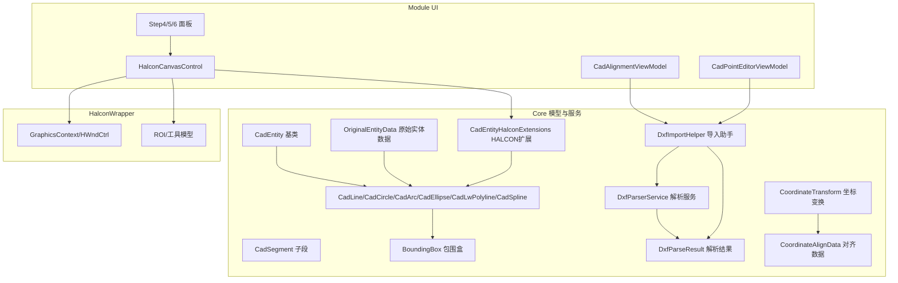
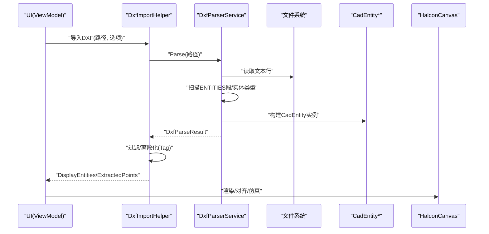
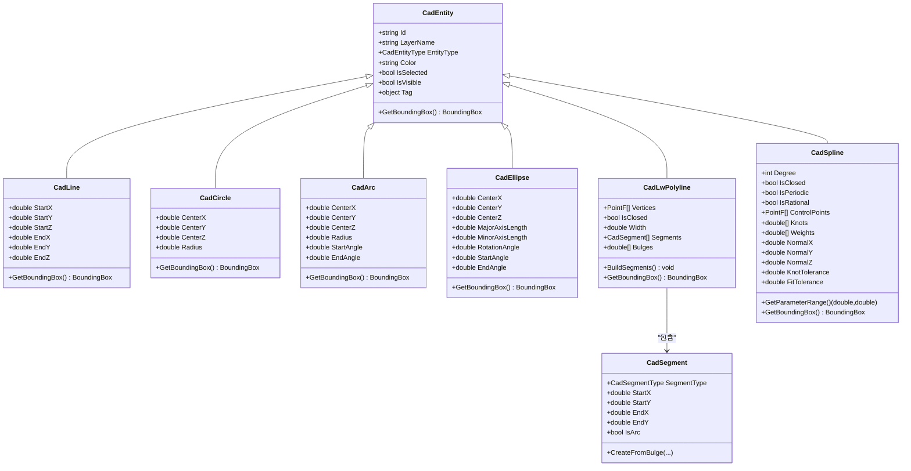
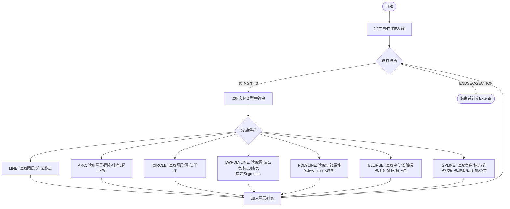
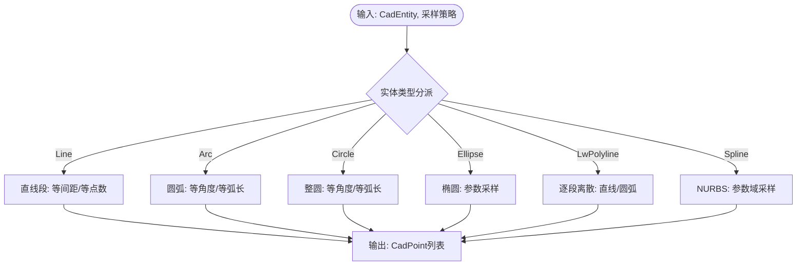
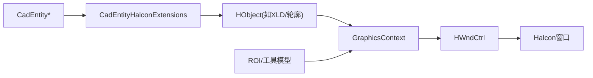
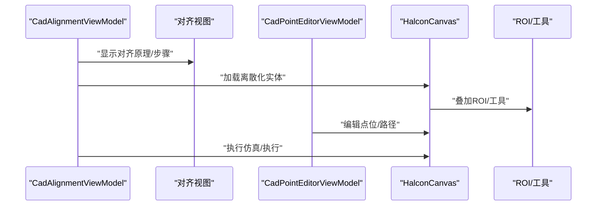
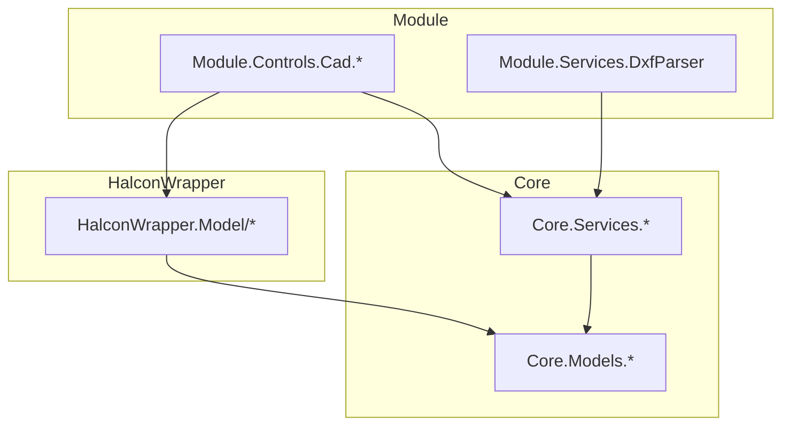

# CAD实体模型

<cite>
**本文引用的文件**
- [CadEntity.cs](file://Core/Models/CadEntity.cs)
- [CadLine.cs](file://Core/Models/CadLine.cs)
- [CadCircle.cs](file://Core/Models/CadCircle.cs)
- [CadArc.cs](file://Core/Models/CadArc.cs)
- [CadEllipse.cs](file://Core/Models/CadEllipse.cs)
- [CadLwPolyline.cs](file://Core/Models/CadLwPolyline.cs)
- [CadSpline.cs](file://Core/Models/CadSpline.cs)
- [CadSegment.cs](file://Core/Models/CadSegment.cs)
- [CadEntityType.cs](file://Core/Models/CadEntityType.cs)
- [BoundingBox.cs](file://Core/Models/BoundingBox.cs)
- [DxfParseResult.cs](file://Core/Models/DxfParseResult.cs)
- [OriginalEntityData.cs](file://Core/Models/OriginalEntityData.cs)
- [DxfParserService.cs](file://Core/Services/DxfParserService.cs)
- [DxfImportHelper.cs](file://Core/Services/DxfImportHelper.cs)
- [CadEntityHalconExtensions.cs](file://Core/Models/CadEntityHalconExtensions.cs)
- [CoordinateTransform.cs](file://Core/Models/CoordinateTransform.cs)
- [CoordinateAlignData.cs](file://Core/Models/CoordinateAlignData.cs)
- [CadAlignmentViewModel.cs](file://Module/Controls/Cad/CadAlignmentViewModel.cs)
- [CadAlignmentView.xaml](file://Module/Controls/Cad/CadAlignmentView.xaml)
- [CadAlignmentView.xaml.cs](file://Module/Controls/Cad/CadAlignmentView.xaml.cs)
- [CadAlignmentPrincipleWindow.xaml](file://Module/Controls/Cad/CadAlignmentPrincipleWindow.xaml)
- [CadAlignmentPrincipleWindow.xaml.cs](file://Module/Controls/Cad/CadAlignmentPrincipleWindow.xaml.cs)
- [CadPointEditorViewModel.cs](file://Module/Controls/Cad/CadPointEditorViewModel.cs)
- [CadPointEditorView.xaml](file://Module/Controls/Cad/CadPointEditorView.xaml)
- [CadPointEditorView.xaml.cs](file://Module/Controls/Cad/CadPointEditorView.xaml.cs)
- [CadPointEditorControl.xaml](file://Module/Controls/Cad/CadPointEditorControl.xaml)
- [CadPointEditorControl.xaml.cs](file://Module/Controls/Cad/CadPointEditorControl.xaml.cs)
- [HalconCanvasControl.xaml](file://Module/Controls/Cad/HalconCanvasControl.xaml)
- [HalconCanvasControl.xaml.cs](file://Module/Controls/Cad/HalconCanvasControl.xaml.cs)
- [Step4AlignPanel.xaml](file://Module/Controls/Cad/Step4AlignPanel.xaml)
- [Step4AlignPanel.xaml.cs](file://Module/Controls/Cad/Step4AlignPanel.xaml.cs)
- [Step5SimulatePanel.xaml](file://Module/Controls/Cad/Step5SimulatePanel.xaml)
- [Step5SimulatePanel.xaml.cs](file://Module/Controls/Cad/Step5SimulatePanel.xaml.cs)
- [Step6ExecutePanel.xaml](file://Module/Controls/Cad/Step6ExecutePanel.xaml)
- [Step6ExecutePanel.xaml.cs](file://Module/Controls/Cad/Step6ExecutePanel.xaml.cs)
- [DxfParser.cs](file://Module/Services/DxfParser.cs)
</cite>

## 目录
1. [引言](#引言)
2. [项目结构](#项目结构)
3. [核心组件](#核心组件)
4. [架构总览](#架构总览)
5. [详细组件分析](#详细组件分析)
6. [依赖关系分析](#依赖关系分析)
7. [性能考虑](#性能考虑)
8. [故障排查指南](#故障排查指南)
9. [结论](#结论)
10. [附录](#附录)

## 引言
本技术文档围绕CAD实体模型与DXF解析体系展开，系统梳理CadEntity基类及其派生类（直线、圆、圆弧、椭圆、轻量多段线、样条曲线）的设计理念、几何属性表达与包围盒计算；详解DXF解析流程、实体数据结构、离散化采样与可视化集成；并结合装配对准、路径生成、视觉检测等应用场景，给出创建、修改、转换的实践指引与优化策略。

## 项目结构
本项目将CAD模型与DXF解析能力集中在Core模块，UI层位于Module模块，HALCON图形渲染位于HalconWrapper模块。DXF解析由Core.Services提供，UI通过ViewModel与View组合完成导入、对齐、仿真与执行流程。

**图表来源**
- [CadEntity.cs:1-97](file://Core/Models/CadEntity.cs#L1-L97)
- [CadLine.cs:1-111](file://Core/Models/CadLine.cs#L1-L111)
- [CadCircle.cs:1-89](file://Core/Models/CadCircle.cs#L1-L89)
- [CadArc.cs:1-158](file://Core/Models/CadArc.cs#L1-L158)
- [CadEllipse.cs:1-160](file://Core/Models/CadEllipse.cs#L1-L160)
- [CadLwPolyline.cs:1-152](file://Core/Models/CadLwPolyline.cs#L1-L152)
- [CadSpline.cs:1-241](file://Core/Models/CadSpline.cs#L1-L241)
- [CadSegment.cs:1-173](file://Core/Models/CadSegment.cs#L1-L173)
- [BoundingBox.cs:1-144](file://Core/Models/BoundingBox.cs#L1-L144)
- [DxfParserService.cs:1-800](file://Core/Services/DxfParserService.cs#L1-L800)
- [DxfImportHelper.cs:1-290](file://Core/Services/DxfImportHelper.cs#L1-L290)
- [DxfParseResult.cs:1-76](file://Core/Models/DxfParseResult.cs#L1-L76)
- [OriginalEntityData.cs:1-131](file://Core/Models/OriginalEntityData.cs#L1-L131)
- [CadEntityHalconExtensions.cs](file://Core/Models/CadEntityHalconExtensions.cs)
- [CoordinateTransform.cs](file://Core/Models/CoordinateTransform.cs)
- [CoordinateAlignData.cs](file://Core/Models/CoordinateAlignData.cs)
- [CadAlignmentViewModel.cs](file://Module/Controls/Cad/CadAlignmentViewModel.cs)
- [CadPointEditorViewModel.cs](file://Module/Controls/Cad/CadPointEditorViewModel.cs)
- [HalconCanvasControl.xaml](file://Module/Controls/Cad/HalconCanvasControl.xaml)
- [Step4AlignPanel.xaml](file://Module/Controls/Cad/Step4AlignPanel.xaml)
- [Step5SimulatePanel.xaml](file://Module/Controls/Cad/Step5SimulatePanel.xaml)
- [Step6ExecutePanel.xaml](file://Module/Controls/Cad/Step6ExecutePanel.xaml)

**章节来源**
- [CadEntity.cs:1-97](file://Core/Models/CadEntity.cs#L1-L97)
- [DxfParserService.cs:1-800](file://Core/Services/DxfParserService.cs#L1-L800)
- [DxfImportHelper.cs:1-290](file://Core/Services/DxfImportHelper.cs#L1-L290)

## 核心组件
- CadEntity基类：统一管理ID、图层、类型、颜色、选择与可见性，并提供GetBoundingBox虚方法供派生类覆盖。
- 几何实体：CadLine、CadCircle、CadArc、CadEllipse、CadLwPolyline、CadSpline分别封装线段、圆、圆弧、椭圆、轻量多段线与NURBS样条的几何参数与包围盒计算。
- 辅助结构：CadSegment描述LW多段线的子段（直线/圆弧），BoundingBox提供AABB计算与合并；DxfParseResult承载解析结果；OriginalEntityData用于序列化/反序列化原始几何参数。
- DXF解析：DxfParserService负责ENTITIES段扫描、实体类型识别与参数提取；DxfImportHelper提供统一导入、过滤、离散化与点位提取。

**章节来源**
- [CadEntity.cs:1-97](file://Core/Models/CadEntity.cs#L1-L97)
- [CadLine.cs:1-111](file://Core/Models/CadLine.cs#L1-L111)
- [CadCircle.cs:1-89](file://Core/Models/CadCircle.cs#L1-L89)
- [CadArc.cs:1-158](file://Core/Models/CadArc.cs#L1-L158)
- [CadEllipse.cs:1-160](file://Core/Models/CadEllipse.cs#L1-L160)
- [CadLwPolyline.cs:1-152](file://Core/Models/CadLwPolyline.cs#L1-L152)
- [CadSpline.cs:1-241](file://Core/Models/CadSpline.cs#L1-L241)
- [CadSegment.cs:1-173](file://Core/Models/CadSegment.cs#L1-L173)
- [BoundingBox.cs:1-144](file://Core/Models/BoundingBox.cs#L1-L144)
- [DxfParseResult.cs:1-76](file://Core/Models/DxfParseResult.cs#L1-L76)
- [OriginalEntityData.cs:1-131](file://Core/Models/OriginalEntityData.cs#L1-L131)

## 架构总览
DXF解析与CAD模型的交互链路如下：

**图表来源**
- [DxfImportHelper.cs:31-101](file://Core/Services/DxfImportHelper.cs#L31-L101)
- [DxfParserService.cs:22-48](file://Core/Services/DxfParserService.cs#L22-L48)
- [CadLwPolyline.cs:72-108](file://Core/Models/CadLwPolyline.cs#L72-L108)
- [HalconCanvasControl.xaml](file://Module/Controls/Cad/HalconCanvasControl.xaml)

**章节来源**
- [DxfImportHelper.cs:1-290](file://Core/Services/DxfImportHelper.cs#L1-L290)
- [DxfParserService.cs:1-800](file://Core/Services/DxfParserService.cs#L1-L800)

## 详细组件分析

### CadEntity与派生类设计
- 设计要点
  - 统一属性：Id、LayerName、EntityType、Color、IsSelected、IsVisible、Tag。
  - 抽象边界：GetBoundingBox为各几何类型提供AABB计算入口。
  - 可扩展性：通过EntityType与OriginalEntityData支持序列化/反序列化与轨迹段恢复。
- 关键派生类
  - CadLine：起点/终点XYZ，包围盒扩展至两端点。
  - CadCircle：中心XYZ与半径，包围盒为外切正方形。
  - CadArc：中心、半径与起止角度，包围盒采样四象限与端点。
  - CadEllipse：中心、长短轴、旋转角与起止角，包围盒参数方程采样。
  - CadLwPolyline：顶点列表、闭合标志、线宽、bulge与Segments子段。
  - CadSpline：度数、控制点、节点向量、权重、法向量与参数域。

**图表来源**
- [CadEntity.cs:1-97](file://Core/Models/CadEntity.cs#L1-L97)
- [CadLine.cs:1-111](file://Core/Models/CadLine.cs#L1-L111)
- [CadCircle.cs:1-89](file://Core/Models/CadCircle.cs#L1-L89)
- [CadArc.cs:1-158](file://Core/Models/CadArc.cs#L1-L158)
- [CadEllipse.cs:1-160](file://Core/Models/CadEllipse.cs#L1-L160)
- [CadLwPolyline.cs:1-152](file://Core/Models/CadLwPolyline.cs#L1-L152)
- [CadSpline.cs:1-241](file://Core/Models/CadSpline.cs#L1-L241)
- [CadSegment.cs:1-173](file://Core/Models/CadSegment.cs#L1-L173)

**章节来源**
- [CadEntity.cs:1-97](file://Core/Models/CadEntity.cs#L1-L97)
- [CadLine.cs:1-111](file://Core/Models/CadLine.cs#L1-L111)
- [CadCircle.cs:1-89](file://Core/Models/CadCircle.cs#L1-L89)
- [CadArc.cs:1-158](file://Core/Models/CadArc.cs#L1-L158)
- [CadEllipse.cs:1-160](file://Core/Models/CadEllipse.cs#L1-L160)
- [CadLwPolyline.cs:1-152](file://Core/Models/CadLwPolyline.cs#L1-L152)
- [CadSpline.cs:1-241](file://Core/Models/CadSpline.cs#L1-L241)
- [CadSegment.cs:1-173](file://Core/Models/CadSegment.cs#L1-L173)

### DXF解析流程与实体数据结构
- ENTITIES段扫描：状态机识别“ENTITIES”、“ENDSEC”、“SECTION”，仅在实体段内解析。
- 实体类型识别：根据组码“0”后的实体类型字符串（如LINE、ARC、CIRCLE、LWPOLYLINE、POLYLINE、ELLIPSE、SPLINE）分派解析。
- 参数提取：
  - LINE：图层(8)、起点(10/20/30)、终点(11/21/31)。
  - ARC：图层(8)、圆心(10/20/30)、半径(40)、起止角(50/51)。
  - CIRCLE：图层(8)、圆心(10/20/30)、半径(40)。
  - LWPOLYLINE：图层(8)、顶点(10/20序列)、凸度(42)、闭合标志(70)、线宽(43)；随后调用BuildSegments()将bulge转为Segments。
  - POLYLINE：头部属性(70/43)，随后VERTEX序列(10/20/30)，以SEQEND结束。
  - ELLIPSE：图层(8)、中心(10/20/30)、长轴端点(11/21/31)、长短轴比(40)、起止角(50/51)。
  - SPLINE：度数(71)、标志(70)、节点数量(73)、节点(40)、控制点(10/20/30)、权重(41)、法向量(210/220/230)、公差(42/43)。
- 结果汇总：按图层分组，计算整体Extents，收集ParseWarnings。

**图表来源**
- [DxfParserService.cs:113-224](file://Core/Services/DxfParserService.cs#L113-L224)
- [DxfParserService.cs:229-396](file://Core/Services/DxfParserService.cs#L229-L396)
- [DxfParserService.cs:404-495](file://Core/Services/DxfParserService.cs#L404-L495)
- [DxfParserService.cs:502-619](file://Core/Services/DxfParserService.cs#L502-L619)
- [DxfParserService.cs:625-699](file://Core/Services/DxfParserService.cs#L625-L699)
- [DxfParserService.cs:713-800](file://Core/Services/DxfParserService.cs#L713-L800)

**章节来源**
- [DxfParserService.cs:1-800](file://Core/Services/DxfParserService.cs#L1-L800)

### 离散化与采样策略
- 离散化接口：按间距pitchMM或固定点数pointCount对单个或批量实体进行离散化，返回CadPoint序列。
- 算法要点：
  - 等间距采样：依据实体类型选择合适的步长与角度增量。
  - 等点数采样：按参数域均匀划分参数t，再映射到几何点。
  - Tag缓存：将离散化结果存入实体Tag，便于渲染与后续处理。
- LWPOLYLINE：利用Segments（由bulge解析得到）逐段离散，支持直线段与圆弧段混合。

**图表来源**
- [DxfParserService.cs:54-105](file://Core/Services/DxfParserService.cs#L54-L105)
- [CadLwPolyline.cs:72-108](file://Core/Models/CadLwPolyline.cs#L72-L108)
- [CadSegment.cs:47-148](file://Core/Models/CadSegment.cs#L47-L148)

**章节来源**
- [DxfParserService.cs:54-105](file://Core/Services/DxfParserService.cs#L54-L105)
- [CadLwPolyline.cs:72-108](file://Core/Models/CadLwPolyline.cs#L72-L108)
- [CadSegment.cs:1-173](file://Core/Models/CadSegment.cs#L1-L173)

### HALCON集成与渲染
- HALCON扩展：CadEntityHalconExtensions提供将CadEntity转换为HObject的能力，配合GraphicsContext/HWndCtrl进行绘制。
- HALCON画布：HalconCanvasControl承载窗口控件与ROI工具，支持交互式编辑与对齐。
- HALCON工具：ROI/ROICircle/ROICircularArc/ROILine/ROIPoint等模型用于标注与测量。

**图表来源**
- [CadEntityHalconExtensions.cs](file://Core/Models/CadEntityHalconExtensions.cs)
- [HalconCanvasControl.xaml](file://Module/Controls/Cad/HalconCanvasControl.xaml)

**章节来源**
- [CadEntityHalconExtensions.cs](file://Core/Models/CadEntityHalconExtensions.cs)
- [HalconCanvasControl.xaml](file://Module/Controls/Cad/HalconCanvasControl.xaml)

### 装配对准、路径生成与视觉检测
- 装配对准：CoordinateTransform/CoordinateAlignData提供坐标变换与对齐数据，CadAlignmentViewModel驱动对准流程（原理窗体、对齐面板、仿真面板、执行面板）。
- 路径生成：通过离散化生成路径点集，结合点编辑器（CadPointEditorViewModel）进行人工修正与优化。
- 视觉检测：HALCON画布与ROI工具用于特征提取与检测，结合对齐后的机械坐标进行定位。

**图表来源**
- [CadAlignmentViewModel.cs](file://Module/Controls/Cad/CadAlignmentViewModel.cs)
- [CadAlignmentView.xaml](file://Module/Controls/Cad/CadAlignmentView.xaml)
- [CadAlignmentView.xaml.cs](file://Module/Controls/Cad/CadAlignmentView.xaml.cs)
- [CadAlignmentPrincipleWindow.xaml](file://Module/Controls/Cad/CadAlignmentPrincipleWindow.xaml)
- [CadAlignmentPrincipleWindow.xaml.cs](file://Module/Controls/Cad/CadAlignmentPrincipleWindow.xaml.cs)
- [CadPointEditorViewModel.cs](file://Module/Controls/Cad/CadPointEditorViewModel.cs)
- [HalconCanvasControl.xaml](file://Module/Controls/Cad/HalconCanvasControl.xaml)
- [Step4AlignPanel.xaml](file://Module/Controls/Cad/Step4AlignPanel.xaml)
- [Step5SimulatePanel.xaml](file://Module/Controls/Cad/Step5SimulatePanel.xaml)
- [Step6ExecutePanel.xaml](file://Module/Controls/Cad/Step6ExecutePanel.xaml)

**章节来源**
- [CoordinateTransform.cs](file://Core/Models/CoordinateTransform.cs)
- [CoordinateAlignData.cs](file://Core/Models/CoordinateAlignData.cs)
- [CadAlignmentViewModel.cs](file://Module/Controls/Cad/CadAlignmentViewModel.cs)
- [CadPointEditorViewModel.cs](file://Module/Controls/Cad/CadPointEditorViewModel.cs)
- [HalconCanvasControl.xaml](file://Module/Controls/Cad/HalconCanvasControl.xaml)

## 依赖关系分析
- 模块耦合
  - Core.Services依赖Core.Models（实体与结果模型）。
  - Module.UI依赖Core.Services（导入/解析）、Core.Models（实体与坐标模型）、HalconWrapper（渲染）。
  - HalconWrapper提供底层渲染能力，UI通过控件与工具模型进行集成。
- 关键依赖链
  - DxfImportHelper -> DxfParserService -> CadEntity* -> BoundingBox
  - UI(ViewModel) -> DxfImportHelper -> DxfParseResult -> CadEntity*
  - 渲染：CadEntity* -> CadEntityHalconExtensions -> HObject -> GraphicsContext/HWndCtrl

**图表来源**
- [DxfImportHelper.cs:1-290](file://Core/Services/DxfImportHelper.cs#L1-L290)
- [DxfParserService.cs:1-800](file://Core/Services/DxfParserService.cs#L1-L800)
- [CadEntity.cs:1-97](file://Core/Models/CadEntity.cs#L1-L97)
- [HalconCanvasControl.xaml](file://Module/Controls/Cad/HalconCanvasControl.xaml)

**章节来源**
- [DxfImportHelper.cs:1-290](file://Core/Services/DxfImportHelper.cs#L1-L290)
- [DxfParserService.cs:1-800](file://Core/Services/DxfParserService.cs#L1-L800)

## 性能考虑
- 解析阶段
  - ENTITIES段扫描为O(N)线性扫描，避免重复IO。
  - 组码解析使用InvariantCulture确保浮点解析稳定且避免文化差异导致的异常。
  - 对于POLYLINE/VERTEX序列，采用状态机推进，减少回溯成本。
- 几何计算
  - 包围盒计算采用保守估算（如样条曲线扩展控制多边形范围），避免过度复杂化。
  - LWPOLYLINE通过Segments缓存避免重复bulge解析。
- 渲染与交互
  - 离散化结果缓存在Tag中，避免重复计算。
  - HALCON渲染采用XLD等高效数据结构，结合GraphicsContext批处理绘制。

[本节为通用性能建议，无需特定文件引用]

## 故障排查指南
- DXF文件读取异常
  - 现象：ParseResult包含警告，Layers为空。
  - 排查：确认文件路径存在、编码为纯ASCII文本、ENTITIES段完整。
- 不支持的实体类型
  - 现象：ParseWarnings提示跳过实体类型。
  - 排查：检查实体类型是否在解析分支中覆盖（如POLYLINE、ELLIPSE、SPLINE）。
- 组码解析失败
  - 现象：ParseWarnings包含组码解析失败信息。
  - 排查：确认组码与值之间为成对出现，数值符合InvariantCulture格式。
- LWPOLYLINE顶点/凸度缺失
  - 现象：BuildSegments后Segments数量异常。
  - 排查：确认DXF中10/20/42组码顺序与数量匹配，闭合多段线的最后一个bulge处理正确。
- 离散化结果为空
  - 现象：Discretize返回空列表。
  - 排查：检查pitchMM>0且实体类型受支持；确认实体参数有效（如半径>0、角度范围合理）。
- HALCON渲染异常
  - 现象：窗口无显示或绘制错误。
  - 排查：确认HalconCanvas已初始化、GraphicsContext/HWndCtrl配置正确、实体已转换为HObject。

**章节来源**
- [DxfParserService.cs:28-47](file://Core/Services/DxfParserService.cs#L28-L47)
- [DxfParserService.cs:190-200](file://Core/Services/DxfParserService.cs#L190-L200)
- [DxfParserService.cs:432-444](file://Core/Services/DxfParserService.cs#L432-L444)
- [DxfImportHelper.cs:61-70](file://Core/Services/DxfImportHelper.cs#L61-L70)

## 结论
本CAD实体模型以CadEntity为核心，通过派生类覆盖几何参数与包围盒计算，结合DxfParserService实现DXF解析与离散化，配合DxfImportHelper完成导入、过滤与点位提取，最终在HalconCanvas中完成可视化与交互。该架构在装配对准、路径生成与视觉检测场景中具备良好的扩展性与稳定性。

[本节为总结性内容，无需特定文件引用]

## 附录

### DXF格式支持与组码对照（摘要）
- LINE：图层(8)、起点(10/20/30)、终点(11/21/31)
- ARC：图层(8)、圆心(10/20/30)、半径(40)、起止角(50/51)
- CIRCLE：图层(8)、圆心(10/20/30)、半径(40)
- LWPOLYLINE：图层(8)、顶点(10/20序列)、凸度(42)、闭合(70)、线宽(43)
- POLYLINE：头部(70/43)、VERTEX序列(10/20/30)、SEQEND
- ELLIPSE：图层(8)、中心(10/20/30)、长轴端点(11/21/31)、长短轴比(40)、起止角(50/51)
- SPLINE：度数(71)、标志(70)、节点数量(73)、节点(40)、控制点(10/20/30)、权重(41)、法向量(210/220/230)、公差(42/43)

**章节来源**
- [DxfParserService.cs:229-396](file://Core/Services/DxfParserService.cs#L229-L396)
- [DxfParserService.cs:404-495](file://Core/Services/DxfParserService.cs#L404-L495)
- [DxfParserService.cs:502-619](file://Core/Services/DxfParserService.cs#L502-L619)
- [DxfParserService.cs:625-699](file://Core/Services/DxfParserService.cs#L625-L699)
- [DxfParserService.cs:713-800](file://Core/Services/DxfParserService.cs#L713-L800)

### 坐标系转换与精度控制
- 坐标系转换：CoordinateTransform提供矩阵/仿射变换，CoordinateAlignData保存对齐参数，用于将CAD坐标转换为机械坐标。
- 精度控制：离散化时保留小数位（如毫米级），点位提取时四舍五入到毫米级；DXF解析使用InvariantCulture确保浮点解析稳定。

**章节来源**
- [CoordinateTransform.cs](file://Core/Models/CoordinateTransform.cs)
- [CoordinateAlignData.cs](file://Core/Models/CoordinateAlignData.cs)
- [DxfImportHelper.cs:114-209](file://Core/Services/DxfImportHelper.cs#L114-L209)

### 实际代码示例（路径指引）
- 创建直线：[CadLine构造函数:87-96](file://Core/Models/CadLine.cs#L87-L96)
- 创建圆弧：[CadArc构造函数:88-97](file://Core/Models/CadArc.cs#L88-L97)
- 创建椭圆：[CadEllipse构造函数:109-121](file://Core/Models/CadEllipse.cs#L109-L121)
- 创建样条：[CadSpline构造函数:161-176](file://Core/Models/CadSpline.cs#L161-L176)
- 解析DXF并离散化：[DxfParserService.Parse/Discretize:22-69](file://Core/Services/DxfParserService.cs#L22-L69)
- 统一导入DXF：[DxfImportHelper.Import:31-101](file://Core/Services/DxfImportHelper.cs#L31-L101)
- LWPOLYLINE子段构建：[CadLwPolyline.BuildSegments:72-108](file://Core/Models/CadLwPolyline.cs#L72-L108)
- 圆弧bulge转子段：[CadSegment.CreateFromBulge:47-64](file://Core/Models/CadSegment.cs#L47-L64)

**章节来源**
- [CadLine.cs:87-96](file://Core/Models/CadLine.cs#L87-L96)
- [CadArc.cs:88-97](file://Core/Models/CadArc.cs#L88-L97)
- [CadEllipse.cs:109-121](file://Core/Models/CadEllipse.cs#L109-L121)
- [CadSpline.cs:161-176](file://Core/Models/CadSpline.cs#L161-L176)
- [DxfParserService.cs:22-105](file://Core/Services/DxfParserService.cs#L22-L105)
- [DxfImportHelper.cs:31-101](file://Core/Services/DxfImportHelper.cs#L31-L101)
- [CadLwPolyline.cs:72-108](file://Core/Models/CadLwPolyline.cs#L72-L108)
- [CadSegment.cs:47-64](file://Core/Models/CadSegment.cs#L47-L64)