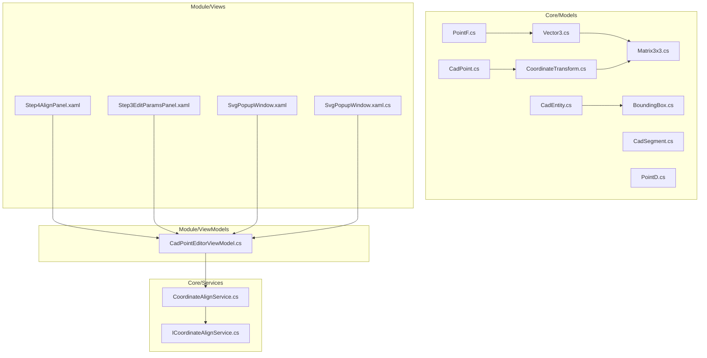
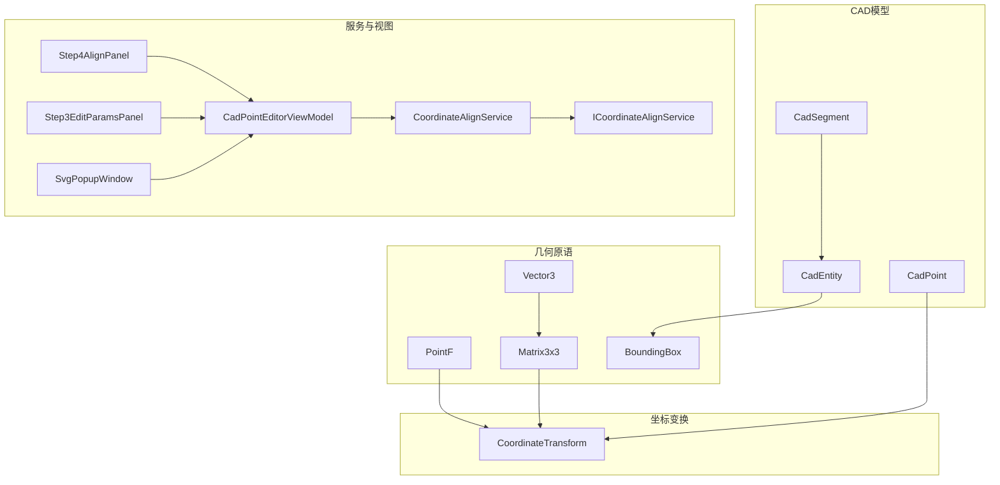
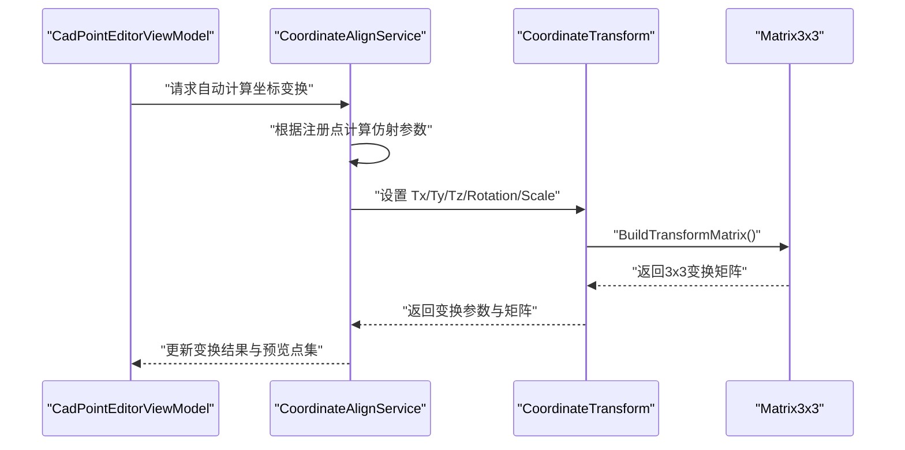
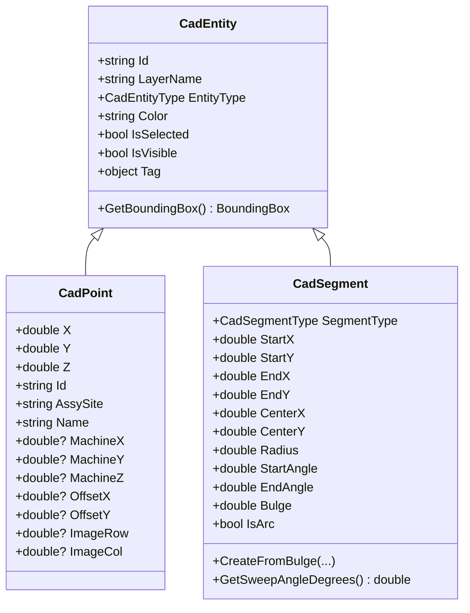
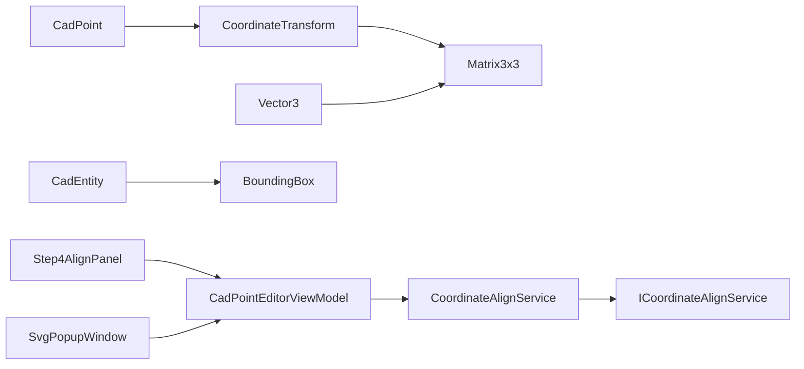
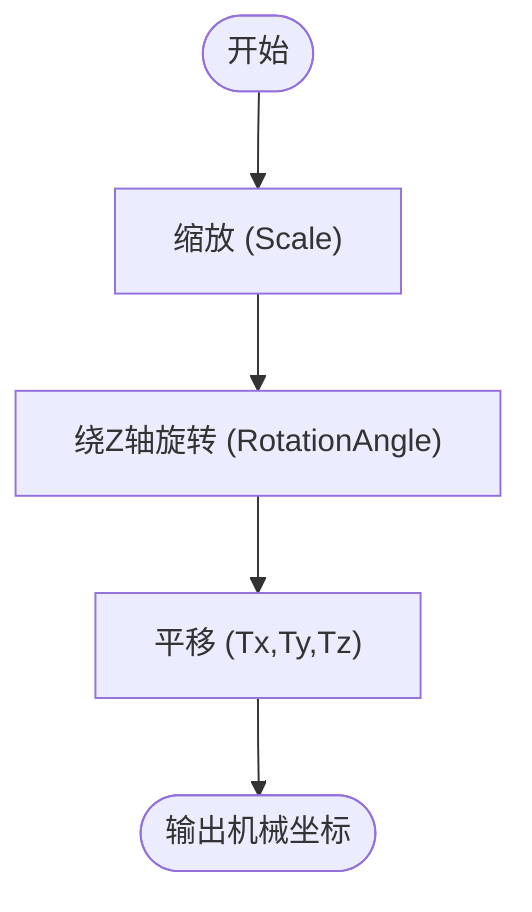

# 几何数学模型

<cite>
**本文引用的文件**
- [Core/Models/PointF.cs](file://Core/Models/PointF.cs)
- [Core/Models/Vector3.cs](file://Core/Models/Vector3.cs)
- [Core/Models/Matrix3x3.cs](file://Core/Models/Matrix3x3.cs)
- [Core/Models/BoundingBox.cs](file://Core/Models/BoundingBox.cs)
- [Core/Models/CoordinateTransform.cs](file://Core/Models/CoordinateTransform.cs)
- [Core/Models/CadPoint.cs](file://Core/Models/CadPoint.cs)
- [Core/Models/CadEntity.cs](file://Core/Models/CadEntity.cs)
- [Core/Models/CadSegment.cs](file://Core/Models/CadSegment.cs)
- [Core/Extensions/PointD.cs](file://Core/Extensions/PointD.cs)
- [Core/Services/CoordinateAlignService.cs](file://Core/Services/CoordinateAlignService.cs)
- [Core/Services/ICoordinateAlignService.cs](file://Core/Services/ICoordinateAlignService.cs)
- [Module/ViewModels/CadPointEditorViewModel.cs](file://Module/ViewModels/CadPointEditorViewModel.cs)
- [.trae/documents/segment-split-align-upgrade.md](file://.trae/documents/segment-split-align-upgrade.md)
- [MainApp/Languages/Strings.en-US.xaml](file://MainApp/Languages/Strings.en-US.xaml)
- [Module/Controls/Step4AlignPanel.xaml](file://Module/Controls/Step4AlignPanel.xaml)
- [Module/Windows/SvgPopupWindow.xaml](file://Module/Windows/SvgPopupWindow.xaml)
- [Module/Windows/SvgPopupWindow.xaml.cs](file://Module/Windows/SvgPopupWindow.xaml.cs)
- [Module/Controls/Step3EditParamsPanel.xaml](file://Module/Controls/Step3EditParamsPanel.xaml)
- [MotionControl/Services/AxisParameterService.cs](file://MotionControl/Services/AxisParameterService.cs)
- [Module/Controls/StepDetails/VisionCaptureViewModel.cs](file://Module/Controls/StepDetails/VisionCaptureViewModel.cs)
</cite>

## 目录
1. [引言](#引言)
2. [项目结构](#项目结构)
3. [核心组件](#核心组件)
4. [架构总览](#架构总览)
5. [详细组件分析](#详细组件分析)
6. [依赖分析](#依赖分析)
7. [性能考虑](#性能考虑)
8. [故障排查指南](#故障排查指南)
9. [结论](#结论)
10. [附录](#附录)

## 引言
本文件系统化梳理并深入解析项目中的几何数学模型与坐标变换体系，重点覆盖以下内容：
- 基础几何模型：PointF、Vector3、Matrix3x3、BoundingBox
- 坐标变换模型：CoordinateTransform 及其与 Halcon 仿射矩阵的关系
- CAD 几何实体与包围盒：CadEntity、CadPoint、CadSegment
- 工业自动化应用场景：运动控制、视觉检测、路径规划、坐标对齐与边界检测
- 数学原理、运算方法、精度与性能优化策略、异常处理与最佳实践

## 项目结构
本项目的几何与坐标变换相关代码主要集中在 Core 模块的 Models 与 Services，以及 Module 中的坐标对齐与可视化交互界面。整体采用“模型-服务-视图”的分层组织方式，便于在运动控制、视觉检测、路径规划等场景中复用。

**图表来源**
- [Core/Models/PointF.cs:1-36](file://Core/Models/PointF.cs#L1-L36)
- [Core/Models/Vector3.cs:1-18](file://Core/Models/Vector3.cs#L1-L18)
- [Core/Models/Matrix3x3.cs:1-59](file://Core/Models/Matrix3x3.cs#L1-L59)
- [Core/Models/BoundingBox.cs:1-144](file://Core/Models/BoundingBox.cs#L1-L144)
- [Core/Models/CoordinateTransform.cs:1-187](file://Core/Models/CoordinateTransform.cs#L1-L187)
- [Core/Models/CadPoint.cs:1-104](file://Core/Models/CadPoint.cs#L1-L104)
- [Core/Models/CadEntity.cs:1-97](file://Core/Models/CadEntity.cs#L1-L97)
- [Core/Models/CadSegment.cs:1-219](file://Core/Models/CadSegment.cs#L1-L219)
- [Core/Extensions/PointD.cs:1-83](file://Core/Extensions/PointD.cs#L1-L83)
- [Core/Services/ICoordinateAlignService.cs:1-200](file://Core/Services/ICoordinateAlignService.cs#L1-L200)
- [Core/Services/CoordinateAlignService.cs:1-300](file://Core/Services/CoordinateAlignService.cs#L1-L300)
- [Module/ViewModels/CadPointEditorViewModel.cs:1-300](file://Module/ViewModels/CadPointEditorViewModel.cs#L1-L300)
- [Module/Controls/Step4AlignPanel.xaml:1-200](file://Module/Controls/Step4AlignPanel.xaml#L1-L200)
- [Module/Controls/Step3EditParamsPanel.xaml:1-200](file://Module/Controls/Step3EditParamsPanel.xaml#L1-L200)
- [Module/Windows/SvgPopupWindow.xaml:1-120](file://Module/Windows/SvgPopupWindow.xaml#L1-L120)
- [Module/Windows/SvgPopupWindow.xaml.cs:1-120](file://Module/Windows/SvgPopupWindow.xaml.cs#L1-L120)

**章节来源**
- [Core/Models/PointF.cs:1-36](file://Core/Models/PointF.cs#L1-L36)
- [Core/Models/Vector3.cs:1-18](file://Core/Models/Vector3.cs#L1-L18)
- [Core/Models/Matrix3x3.cs:1-59](file://Core/Models/Matrix3x3.cs#L1-L59)
- [Core/Models/BoundingBox.cs:1-144](file://Core/Models/BoundingBox.cs#L1-L144)
- [Core/Models/CoordinateTransform.cs:1-187](file://Core/Models/CoordinateTransform.cs#L1-L187)
- [Core/Models/CadPoint.cs:1-104](file://Core/Models/CadPoint.cs#L1-L104)
- [Core/Models/CadEntity.cs:1-97](file://Core/Models/CadEntity.cs#L1-L97)
- [Core/Models/CadSegment.cs:1-219](file://Core/Models/CadSegment.cs#L1-L219)
- [Core/Extensions/PointD.cs:1-83](file://Core/Extensions/PointD.cs#L1-L83)
- [Core/Services/ICoordinateAlignService.cs:1-200](file://Core/Services/ICoordinateAlignService.cs#L1-L200)
- [Core/Services/CoordinateAlignService.cs:1-300](file://Core/Services/CoordinateAlignService.cs#L1-L300)
- [Module/ViewModels/CadPointEditorViewModel.cs:1-300](file://Module/ViewModels/CadPointEditorViewModel.cs#L1-L300)
- [Module/Controls/Step4AlignPanel.xaml:1-200](file://Module/Controls/Step4AlignPanel.xaml#L1-L200)
- [Module/Controls/Step3EditParamsPanel.xaml:1-200](file://Module/Controls/Step3EditParamsPanel.xaml#L1-L200)
- [Module/Windows/SvgPopupWindow.xaml:1-120](file://Module/Windows/SvgPopupWindow.xaml#L1-L120)
- [Module/Windows/SvgPopupWindow.xaml.cs:1-120](file://Module/Windows/SvgPopupWindow.xaml.cs#L1-L120)

## 核心组件
本节聚焦于基础几何模型与坐标变换模型，解释其数学定义、运算接口与典型用途。

- PointF：带 Z 坐标的三维点，常用于表示 CAD 或机械坐标系中的位置，支持格式化输出。
- Vector3：三维向量，提供加减与与矩阵相乘的运算，用于描述方向与位移。
- Matrix3x3：3×3 矩阵（齐次坐标），提供矩阵乘法、转置与 2D 绕 Z 轴旋转构造，用于仿射变换。
- BoundingBox：轴对齐包围盒（AABB），用于快速边界检测与集合运算（并集、扩展）。
- CoordinateTransform：封装平移、旋转（绕 Z）、缩放的仿射变换，支持正变换与逆变换，并可生成对应的 3×3 矩阵。
- CadPoint/CadEntity/CadSegment：CAD 几何实体与点位模型，支持包围盒计算与离散化（如多段线子段）。
- PointD：序列化友好的 XY/XZ/YZ 点模型，提供数值四舍五入到毫米级精度的属性访问器。

**章节来源**
- [Core/Models/PointF.cs:1-36](file://Core/Models/PointF.cs#L1-L36)
- [Core/Models/Vector3.cs:1-18](file://Core/Models/Vector3.cs#L1-L18)
- [Core/Models/Matrix3x3.cs:1-59](file://Core/Models/Matrix3x3.cs#L1-L59)
- [Core/Models/BoundingBox.cs:1-144](file://Core/Models/BoundingBox.cs#L1-L144)
- [Core/Models/CoordinateTransform.cs:1-187](file://Core/Models/CoordinateTransform.cs#L1-L187)
- [Core/Models/CadPoint.cs:1-104](file://Core/Models/CadPoint.cs#L1-L104)
- [Core/Models/CadEntity.cs:1-97](file://Core/Models/CadEntity.cs#L1-L97)
- [Core/Models/CadSegment.cs:1-219](file://Core/Models/CadSegment.cs#L1-L219)
- [Core/Extensions/PointD.cs:1-83](file://Core/Extensions/PointD.cs#L1-L83)

## 架构总览
几何与坐标变换在系统中的角色如下：
- 基础模型（PointF/Vector3/Matrix3x3/BoundingBox）为上层业务提供数学原语。
- CoordinateTransform 将 CAD 与机械坐标系之间的变换抽象为可配置的仿射参数，并可导出矩阵形式。
- CadEntity/CadPoint/CadSegment 为 CAD 几何与装配/视觉任务提供数据载体与边界计算能力。
- 视图与服务通过 ViewModel/Service 协作完成坐标对齐、变换预览与 UI 展示。

**图表来源**
- [Core/Models/PointF.cs:1-36](file://Core/Models/PointF.cs#L1-L36)
- [Core/Models/Vector3.cs:1-18](file://Core/Models/Vector3.cs#L1-L18)
- [Core/Models/Matrix3x3.cs:1-59](file://Core/Models/Matrix3x3.cs#L1-L59)
- [Core/Models/BoundingBox.cs:1-144](file://Core/Models/BoundingBox.cs#L1-L144)
- [Core/Models/CoordinateTransform.cs:1-187](file://Core/Models/CoordinateTransform.cs#L1-L187)
- [Core/Models/CadPoint.cs:1-104](file://Core/Models/CadPoint.cs#L1-L104)
- [Core/Models/CadEntity.cs:1-97](file://Core/Models/CadEntity.cs#L1-L97)
- [Core/Models/CadSegment.cs:1-219](file://Core/Models/CadSegment.cs#L1-L219)
- [Core/Services/ICoordinateAlignService.cs:1-200](file://Core/Services/ICoordinateAlignService.cs#L1-L200)
- [Core/Services/CoordinateAlignService.cs:1-300](file://Core/Services/CoordinateAlignService.cs#L1-L300)
- [Module/ViewModels/CadPointEditorViewModel.cs:1-300](file://Module/ViewModels/CadPointEditorViewModel.cs#L1-L300)
- [Module/Controls/Step4AlignPanel.xaml:1-200](file://Module/Controls/Step4AlignPanel.xaml#L1-L200)
- [Module/Controls/Step3EditParamsPanel.xaml:1-200](file://Module/Controls/Step3EditParamsPanel.xaml#L1-L200)
- [Module/Windows/SvgPopupWindow.xaml:1-120](file://Module/Windows/SvgPopupWindow.xaml#L1-L120)

## 详细组件分析

### PointF：三维点模型
- 设计要点
  - 支持 X/Y/Z 三轴坐标，构造函数可省略 Z，默认为 0。
  - 提供格式化字符串输出，便于日志与 UI 显示。
- 应用场景
  - 表达 CAD 与机械坐标系中的位置；在路径规划与视觉检测中作为起点/终点或目标点。
- 精度与范围
  - 使用 float 表示坐标，适合工程定位与显示；若涉及高精度测量，建议在上层转换为更高精度类型。
- 性能
  - 结构体/类的简单封装，内存占用小，拷贝代价低。

**章节来源**
- [Core/Models/PointF.cs:1-36](file://Core/Models/PointF.cs#L1-L36)

### Vector3：三维向量与矩阵乘法
- 设计要点
  - 使用 double 表示向量分量，保证旋转与变换过程中的数值稳定性。
  - 提供向量加减与与 Matrix3x3 的乘法运算，用于将向量受变换矩阵影响。
- 数学原理
  - 向量加减满足交换律与结合律；与矩阵乘法遵循齐次坐标下的线性变换规则。
- 应用场景
  - 描述位移、速度、加速度等物理量；参与坐标变换与姿态修正。
- 性能
  - 纯结构体，运算开销低；避免装箱与 GC 压力。

**章节来源**
- [Core/Models/Vector3.cs:1-18](file://Core/Models/Vector3.cs#L1-L18)

### Matrix3x3：3×3 仿射变换矩阵
- 设计要点
  - 提供单位矩阵、矩阵乘法、转置与 2D 绕 Z 轴旋转构造。
  - 旋转角度以度为单位，内部转换为弧度进行三角函数计算。
- 数学原理
  - 采用齐次坐标，支持平移、旋转、缩放的组合；矩阵乘法满足结合律但不满足交换律。
- 应用场景
  - 与 CoordinateTransform 协同，构建正变换与逆变换矩阵；在 HALCON 仿射矩阵与工程坐标之间建立映射桥梁。
- 性能
  - 常规乘法与转置均为 O(1)，适合高频调用。

**章节来源**
- [Core/Models/Matrix3x3.cs:1-59](file://Core/Models/Matrix3x3.cs#L1-L59)

### BoundingBox：轴对齐包围盒（AABB）
- 设计要点
  - 内部维护 MinX/MaxX/MinY/MaxY；提供 Width/Height/IsEmpty 等便捷属性。
  - 支持 Contains 点包含判断、Union 两盒并集、ExpandToInclude 扩展包含点。
- 数学原理
  - AABB 是最小的轴对齐矩形，适合快速碰撞/边界检测；并集与扩展操作时间复杂度为 O(1)。
- 应用场景
  - CAD 图元边界快速判定；路径规划中的障碍物剔除；视觉检测中的 ROI 估算。
- 性能
  - 常数时间的边界查询与合并，适合大规模几何对象的粗筛。

**章节来源**
- [Core/Models/BoundingBox.cs:1-144](file://Core/Models/BoundingBox.cs#L1-L144)

### CoordinateTransform：仿射坐标变换
- 设计要点
  - 参数：Tx/Ty/Tz（平移）、RotationAngle（绕 Z 旋转）、Scale（缩放）。
  - 提供 Transform（CAD→机械）与 InverseTransform（机械→CAD）方法。
  - 提供 BuildTransformMatrix/BuildInverseMatrix，输出 3×3 矩阵形式。
- 数学原理
  - 变换顺序：缩放 → 旋转 → 平移；逆变换顺序相反。
  - 矩阵形式为齐次坐标，Z 方向仅参与平移与缩放，不参与 2D 旋转。
- 应用场景
  - CAD 与机械坐标系对齐；批量点位转换；路径规划前的坐标归一化。
- 性能
  - 单点变换为 O(1)；矩阵构建亦为 O(1)；适合实时性要求较高的场景。

**图表来源**
- [Module/ViewModels/CadPointEditorViewModel.cs:1-300](file://Module/ViewModels/CadPointEditorViewModel.cs#L1-L300)
- [Core/Services/CoordinateAlignService.cs:1-300](file://Core/Services/CoordinateAlignService.cs#L1-L300)
- [Core/Models/CoordinateTransform.cs:1-187](file://Core/Models/CoordinateTransform.cs#L1-L187)
- [Core/Models/Matrix3x3.cs:1-59](file://Core/Models/Matrix3x3.cs#L1-L59)

**章节来源**
- [Core/Models/CoordinateTransform.cs:1-187](file://Core/Models/CoordinateTransform.cs#L1-L187)

### CadPoint/CadEntity/CadSegment：CAD 几何与包围盒
- 设计要点
  - CadPoint：承载 CAD 坐标与机械坐标（对齐后填充），并支持偏移后坐标与图像坐标映射。
  - CadEntity：CAD 图元基类，提供通用属性与虚方法 GetBoundingBox，子类需实现具体边界计算。
  - CadSegment：LWPOLYLINE 子段（直线/圆弧），支持从两点+bulge 构造并计算圆心、半径、起止角度等。
- 应用场景
  - 装配/视觉任务中的点位与路径建模；DXF 导入后的几何离散化；边界检测与 ROI 生成。
- 性能
  - CadSegment 的圆弧参数计算包含三角函数与平方根，属于 O(1) 常数时间；对大量子段的批量处理需注意累积误差与性能。

**图表来源**
- [Core/Models/CadEntity.cs:1-97](file://Core/Models/CadEntity.cs#L1-L97)
- [Core/Models/CadPoint.cs:1-104](file://Core/Models/CadPoint.cs#L1-L104)
- [Core/Models/CadSegment.cs:1-219](file://Core/Models/CadSegment.cs#L1-L219)

**章节来源**
- [Core/Models/CadPoint.cs:1-104](file://Core/Models/CadPoint.cs#L1-L104)
- [Core/Models/CadEntity.cs:1-97](file://Core/Models/CadEntity.cs#L1-L97)
- [Core/Models/CadSegment.cs:1-219](file://Core/Models/CadSegment.cs#L1-L219)

### PointD：序列化友好点模型
- 设计要点
  - Point/Point3D 提供 pX/pY、X/Y/Z 的属性访问器，在 getter 中进行数值四舍五入到毫米级精度。
  - 适用于配置文件、日志与跨模块传输的数据载体。
- 精度与范围
  - 四舍五入到毫米级，适配工程常用精度；超出范围时需注意溢出与精度损失。

**章节来源**
- [Core/Extensions/PointD.cs:1-83](file://Core/Extensions/PointD.cs#L1-L83)

## 依赖分析
- 模型间耦合
  - CoordinateTransform 依赖 Matrix3x3；Vector3 与 Matrix3x3 通过乘法运算耦合。
  - CadEntity 通过 GetBoundingBox 与 BoundingBox 解耦，子类各自实现边界计算。
  - CadPoint 与 CoordinateTransform 双向协作，前者承载坐标，后者提供转换。
- 服务与视图
  - CadPointEditorViewModel 依赖 CoordinateAlignService，后者根据注册点计算仿射参数并输出变换矩阵。
  - Step4AlignPanel 与 SvgPopupWindow 提供变换结果与原理示意的 UI 展示。
- 外部依赖
  - 项目文档中提及 Halcon 仿射矩阵（HHomMat2D）与 VectorToHomMat2D 算子，CoordinateTransform 与之存在概念对应关系，便于在 HALCON 流程中复用。

**图表来源**
- [Core/Models/CoordinateTransform.cs:1-187](file://Core/Models/CoordinateTransform.cs#L1-L187)
- [Core/Models/Matrix3x3.cs:1-59](file://Core/Models/Matrix3x3.cs#L1-L59)
- [Core/Models/Vector3.cs:1-18](file://Core/Models/Vector3.cs#L1-L18)
- [Core/Models/CadEntity.cs:1-97](file://Core/Models/CadEntity.cs#L1-L97)
- [Core/Models/BoundingBox.cs:1-144](file://Core/Models/BoundingBox.cs#L1-L144)
- [Core/Models/CadPoint.cs:1-104](file://Core/Models/CadPoint.cs#L1-L104)
- [Module/ViewModels/CadPointEditorViewModel.cs:1-300](file://Module/ViewModels/CadPointEditorViewModel.cs#L1-L300)
- [Core/Services/CoordinateAlignService.cs:1-300](file://Core/Services/CoordinateAlignService.cs#L1-L300)
- [Core/Services/ICoordinateAlignService.cs:1-200](file://Core/Services/ICoordinateAlignService.cs#L1-L200)
- [Module/Controls/Step4AlignPanel.xaml:1-200](file://Module/Controls/Step4AlignPanel.xaml#L1-L200)
- [Module/Windows/SvgPopupWindow.xaml:1-120](file://Module/Windows/SvgPopupWindow.xaml#L1-L120)

**章节来源**
- [Core/Models/CoordinateTransform.cs:1-187](file://Core/Models/CoordinateTransform.cs#L1-L187)
- [Core/Models/Matrix3x3.cs:1-59](file://Core/Models/Matrix3x3.cs#L1-L59)
- [Core/Models/Vector3.cs:1-18](file://Core/Models/Vector3.cs#L1-L18)
- [Core/Models/CadEntity.cs:1-97](file://Core/Models/CadEntity.cs#L1-L97)
- [Core/Models/BoundingBox.cs:1-144](file://Core/Models/BoundingBox.cs#L1-L144)
- [Core/Models/CadPoint.cs:1-104](file://Core/Models/CadPoint.cs#L1-L104)
- [Module/ViewModels/CadPointEditorViewModel.cs:1-300](file://Module/ViewModels/CadPointEditorViewModel.cs#L1-L300)
- [Core/Services/CoordinateAlignService.cs:1-300](file://Core/Services/CoordinateAlignService.cs#L1-L300)
- [Core/Services/ICoordinateAlignService.cs:1-200](file://Core/Services/ICoordinateAlignService.cs#L1-L200)
- [Module/Controls/Step4AlignPanel.xaml:1-200](file://Module/Controls/Step4AlignPanel.xaml#L1-L200)
- [Module/Windows/SvgPopupWindow.xaml:1-120](file://Module/Windows/SvgPopupWindow.xaml#L1-L120)

## 性能考虑
- 精度与类型选择
  - Vector3 使用 double，Matrix3x3 与 CoordinateTransform 亦采用双精度，有助于降低旋转与缩放过程中的累积误差。
  - PointF 使用 float，适合显示与工程定位；若需要更高精度，可在转换链路中提升精度。
- 运算复杂度
  - 单点仿射变换与矩阵乘法均为 O(1)；BoundingBox 的 Contains/Union/ExpandToInclude 亦为 O(1)。
  - CadSegment 的圆弧参数计算包含三角函数与平方根，属于 O(1)；对大量子段的批量处理应关注累计误差与性能瓶颈。
- 内存与拷贝
  - Vector3/Matrix3x3 为结构体，避免堆分配；PointF/CadPoint/CadEntity 为类，适合共享引用。
- I/O 与序列化
  - PointD 提供四舍五入到毫米级的属性访问器，利于配置文件与日志的可读性与体积控制。

[本节为通用性能讨论，无需特定文件来源]

## 故障排查指南
- 坐标对齐失败
  - 检查注册点数量与分布是否满足仿射变换求解条件；确认 IsModeAffine 模式与 DirectionLength 设置。
  - 查看 TransformStatus 文本提示与 TransformMatrixDisplay 参数文本，定位异常阶段。
- 变换结果异常
  - 核对 Tx/Ty/Tz、RotationAngle、Scale 的取值范围与单位；检查 BuildTransformMatrix/BuildInverseMatrix 输出是否符合预期。
- 边界检测误判
  - 检查 BoundingBox.IsEmpty 条件与边界赋值逻辑；确认 ExpandToInclude 是否被正确调用。
- 视觉检测偏差
  - 检查 VisionCaptureViewModel 中的中心点与三点法计算，核对 TargetDeltaX/TargetDeltaY 与 P1DeltaX/P1DeltaY 的来源与单位一致性。
- 运动控制插补参数
  - 若出现插补异常，检查 AxisParameterService 中的 SetVectorProfileUnit/SetVectorSProfile 返回码与日志警告。

**章节来源**
- [Module/ViewModels/CadPointEditorViewModel.cs:1-300](file://Module/ViewModels/CadPointEditorViewModel.cs#L1-L300)
- [Core/Services/CoordinateAlignService.cs:1-300](file://Core/Services/CoordinateAlignService.cs#L1-L300)
- [Core/Models/BoundingBox.cs:1-144](file://Core/Models/BoundingBox.cs#L1-L144)
- [Module/Controls/Step4AlignPanel.xaml:1-200](file://Module/Controls/Step4AlignPanel.xaml#L1-L200)
- [Module/Controls/Step3EditParamsPanel.xaml:1-200](file://Module/Controls/Step3EditParamsPanel.xaml#L1-L200)
- [Module/Windows/SvgPopupWindow.xaml:1-120](file://Module/Windows/SvgPopupWindow.xaml#L1-L120)
- [Module/Windows/SvgPopupWindow.xaml.cs:1-120](file://Module/Windows/SvgPopupWindow.xaml.cs#L1-L120)
- [MotionControl/Services/AxisParameterService.cs:336-359](file://MotionControl/Services/AxisParameterService.cs#L336-L359)
- [Module/Controls/StepDetails/VisionCaptureViewModel.cs:1-906](file://Module/Controls/StepDetails/VisionCaptureViewModel.cs#L1-L906)

## 结论
本项目通过一组轻量、稳定的几何与坐标变换模型，为工业自动化提供了从 CAD 到机械坐标的一致映射与高效边界检测能力。CoordinateTransform 与 Matrix3x3 的组合，既满足工程精度需求，又具备良好的性能表现；配合 CadEntity/CadPoint/CadSegment，能够支撑装配、视觉与路径规划等多场景应用。建议在实际部署中：
- 明确坐标系与单位约定，统一 Tx/Ty/Tz、RotationAngle、Scale 的取值范围；
- 在批量点位转换与边界检测中充分利用 AABB 的 O(1) 复杂度优势；
- 对高精度测量与长距离位移，采用更高精度的中间类型并在关键节点进行误差校验；
- 在 HALCON 与工程坐标之间保持一致的变换顺序与矩阵布局，确保跨模块数据一致性。

[本节为总结性内容，无需特定文件来源]

## 附录

### 使用示例与最佳实践
- 运动控制
  - 在路径规划前，使用 BoundingBox 对候选轨迹进行快速筛选；对关键点位，先通过 CoordinateTransform 将 CAD 坐标转换为机械坐标，再交由运动控制卡执行。
  - 参考：[MotionControl/Services/AxisParameterService.cs:336-359](file://MotionControl/Services/AxisParameterService.cs#L336-L359)
- 视觉检测
  - 使用 CadPoint 的 OffsetX/OffsetY 与 ImageRow/ImageCol 进行图像坐标与 CAD 坐标的双向映射；在 VisionCaptureViewModel 中核对中心点与三点法计算结果。
  - 参考：[Module/Controls/StepDetails/VisionCaptureViewModel.cs:1-906](file://Module/Controls/StepDetails/VisionCaptureViewModel.cs#L1-L906)
- 坐标对齐与可视化
  - 通过 CadPointEditorViewModel 的 AutoCalculate 与 TransformMatrixDisplay，结合 Step4AlignPanel 与 SvgPopupWindow，直观展示变换结果与原理。
  - 参考：[Module/ViewModels/CadPointEditorViewModel.cs:1-300](file://Module/ViewModels/CadPointEditorViewModel.cs#L1-L300)，[Module/Controls/Step4AlignPanel.xaml:1-200](file://Module/Controls/Step4AlignPanel.xaml#L1-L200)，[Module/Windows/SvgPopupWindow.xaml:1-120](file://Module/Windows/SvgPopupWindow.xaml#L1-L120)，[Module/Windows/SvgPopupWindow.xaml.cs:1-120](file://Module/Windows/SvgPopupWindow.xaml.cs#L1-L120)
- CAD 几何离散化
  - 使用 CadSegment 的 CreateFromBulge 与 GetSweepAngleDegrees，将 LWPOLYLINE 子段离散为多点序列，用于路径规划与仿真。
  - 参考：[Core/Models/CadSegment.cs:1-219](file://Core/Models/CadSegment.cs#L1-L219)

### 数学原理与算法流程图
- 仿射变换顺序（CAD→机械）：缩放 → 旋转 → 平移；逆变换顺序相反。
- AABB 扩展与并集：逐分量取极值，时间复杂度 O(1)。

**图表来源**
- [Core/Models/CoordinateTransform.cs:60-98](file://Core/Models/CoordinateTransform.cs#L60-L98)