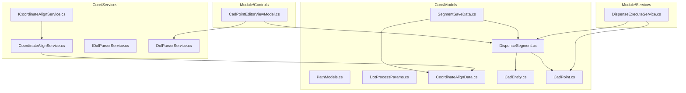
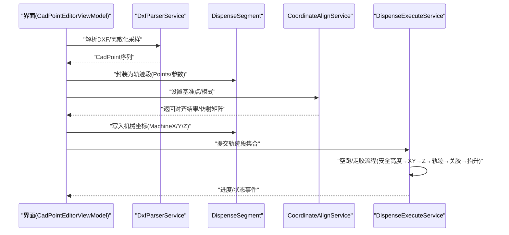
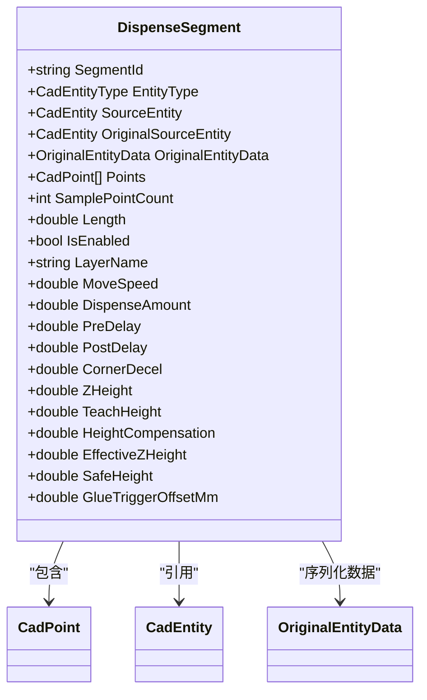
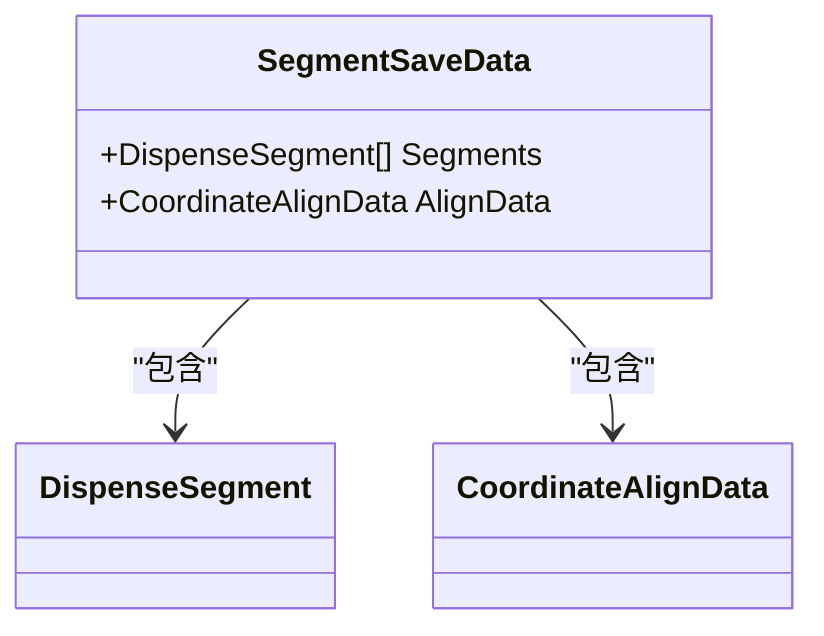
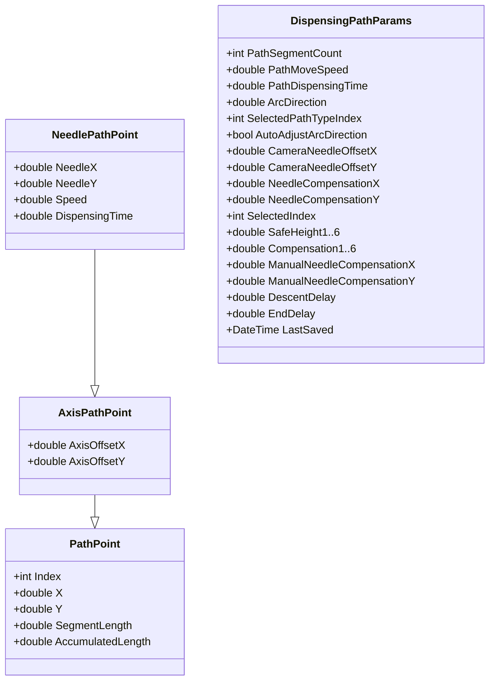
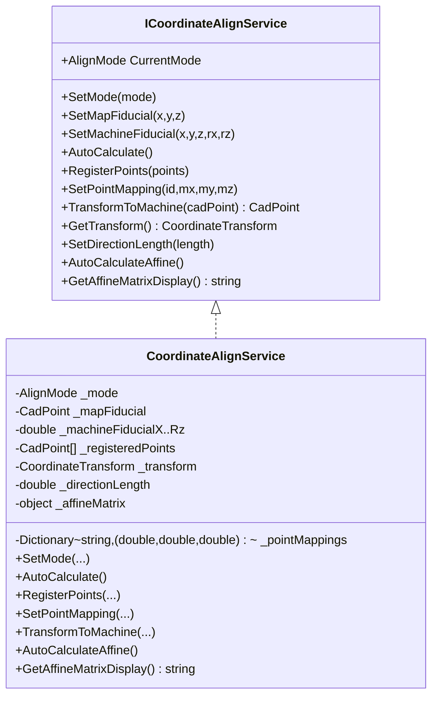
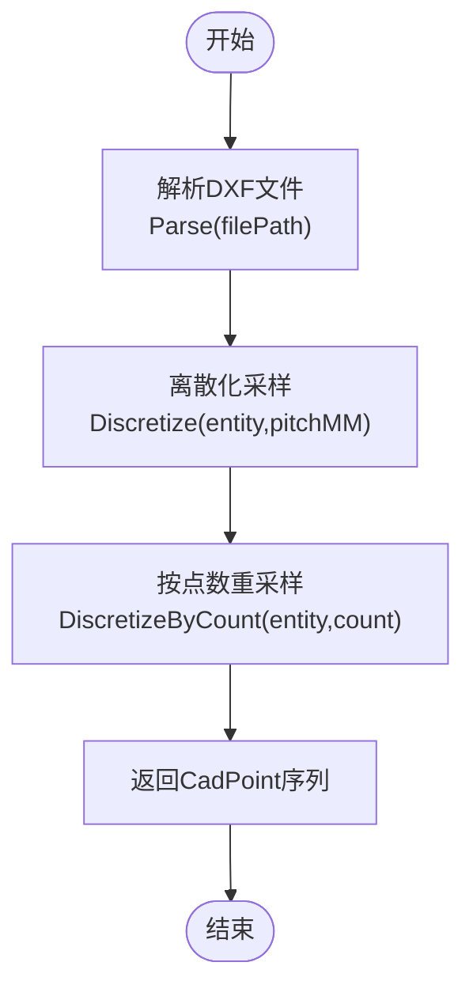
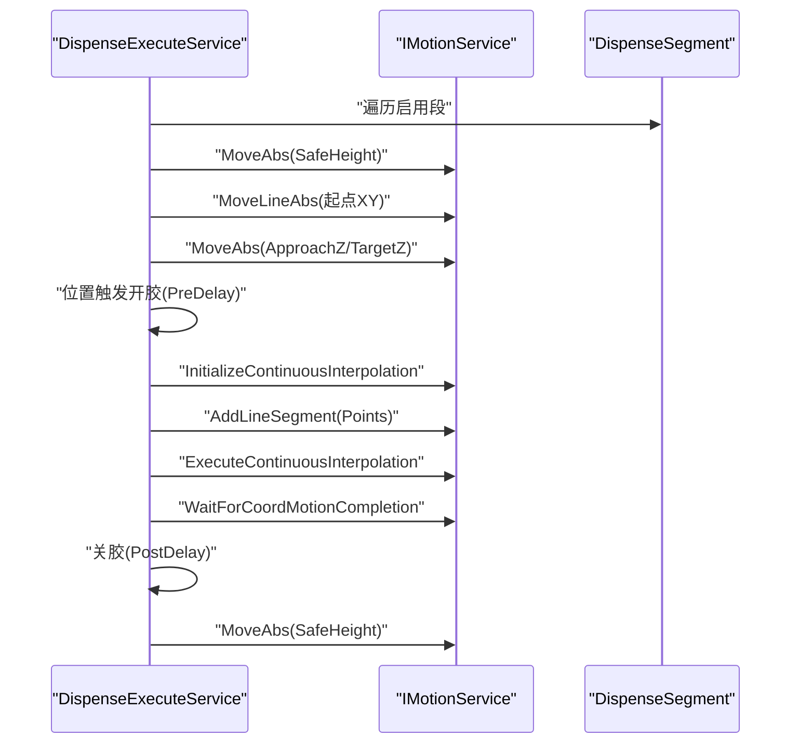
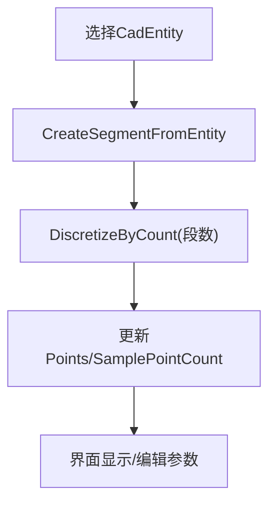
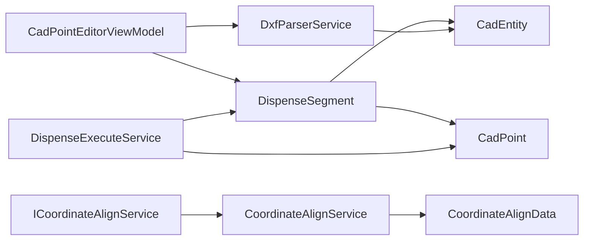

# 工艺路径模型

<cite>
**本文引用的文件**
- [DispenseSegment.cs](file://Core/Models/DispenseSegment.cs)
- [SegmentSaveData.cs](file://Core/Models/SegmentSaveData.cs)
- [PathModels.cs](file://Core/Models/PathModels.cs)
- [DotProcessParams.cs](file://Core/Models/DotProcessParams.cs)
- [CoordinateAlignData.cs](file://Core/Models/CoordinateAlignData.cs)
- [CoordinateAlignService.cs](file://Core/Services/CoordinateAlignService.cs)
- [ICoordinateAlignService.cs](file://Core/Services/ICoordinateAlignService.cs)
- [CadEntity.cs](file://Core/Models/CadEntity.cs)
- [CadPoint.cs](file://Core/Models/CadPoint.cs)
- [DxfParserService.cs](file://Core/Services/DxfParserService.cs)
- [IDxfParserService.cs](file://Core/Services/IDxfParserService.cs)
- [DispenseExecuteService.cs](file://Module/Services/DispenseExecuteService.cs)
- [CadPointEditorViewModel.cs](file://Module/Controls/Cad/CadPointEditorViewModel.cs)
- [segment-split-align-upgrade.md](file://.trae/documents/segment-split-align-upgrade.md)
</cite>

## 目录
1. [简介](#简介)
2. [项目结构](#项目结构)
3. [核心组件](#核心组件)
4. [架构总览](#架构总览)
5. [详细组件分析](#详细组件分析)
6. [依赖分析](#依赖分析)
7. [性能考虑](#性能考虑)
8. [故障排查指南](#故障排查指南)
9. [结论](#结论)
10. [附录](#附录)

## 简介
本文件围绕“工艺路径模型”展开，系统性解析点胶轨迹生成、路径数据保存、坐标对齐与变换、参数控制等关键环节。重点覆盖以下模型与服务：
- 轨迹模型：DispenseSegment、SegmentSaveData、PathModels（路径点族）、DotProcessParams
- 坐标对齐：CoordinateAlignData、CoordinateAlignService、ICoordinateAlignService
- 数据离散化与路径生成：DxfParserService、IDxfParserService
- 路径执行：DispenseExecuteService
- 示例与优化：CadPointEditorViewModel 中的段数拆分与重采样、执行流程

目标是帮助读者理解从CAD图元到机械轨迹的完整链路，掌握参数调优与执行策略。

## 项目结构
围绕“路径模型”的核心代码分布在 Core 与 Module 两个子系统：
- Core/Models：定义几何与工艺参数模型（DispenseSegment、PathModels、DotProcessParams、CoordinateAlignData、CadEntity、CadPoint）
- Core/Services：提供坐标对齐、DXF解析、路径离散化等服务（CoordinateAlignService、ICoordinateAlignService、DxfParserService、IDxfParserService）
- Module/Services：面向执行的路径执行服务（DispenseExecuteService）
- Module/Controls：路径编辑与示教界面（CadPointEditorViewModel）

**图表来源**
- [DispenseSegment.cs:1-236](file://Core/Models/DispenseSegment.cs#L1-L236)
- [SegmentSaveData.cs:1-18](file://Core/Models/SegmentSaveData.cs#L1-L18)
- [PathModels.cs:1-224](file://Core/Models/PathModels.cs#L1-L224)
- [DotProcessParams.cs:1-121](file://Core/Models/DotProcessParams.cs#L1-L121)
- [CoordinateAlignData.cs:1-42](file://Core/Models/CoordinateAlignData.cs#L1-L42)
- [CadEntity.cs:1-97](file://Core/Models/CadEntity.cs#L1-L97)
- [CadPoint.cs:1-104](file://Core/Models/CadPoint.cs#L1-L104)
- [ICoordinateAlignService.cs:1-90](file://Core/Services/ICoordinateAlignService.cs#L1-L90)
- [CoordinateAlignService.cs:1-407](file://Core/Services/CoordinateAlignService.cs#L1-L407)
- [IDxfParserService.cs:1-42](file://Core/Services/IDxfParserService.cs#L1-L42)
- [DxfParserService.cs:1-800](file://Core/Services/DxfParserService.cs#L1-L800)
- [DispenseExecuteService.cs:1-292](file://Module/Services/DispenseExecuteService.cs#L1-L292)
- [CadPointEditorViewModel.cs:971-1026](file://Module/Controls/Cad/CadPointEditorViewModel.cs#L971-L1026)

**章节来源**
- [DispenseSegment.cs:1-236](file://Core/Models/DispenseSegment.cs#L1-L236)
- [SegmentSaveData.cs:1-18](file://Core/Models/SegmentSaveData.cs#L1-L18)
- [PathModels.cs:1-224](file://Core/Models/PathModels.cs#L1-L224)
- [DotProcessParams.cs:1-121](file://Core/Models/DotProcessParams.cs#L1-L121)
- [CoordinateAlignData.cs:1-42](file://Core/Models/CoordinateAlignData.cs#L1-L42)
- [CadEntity.cs:1-97](file://Core/Models/CadEntity.cs#L1-L97)
- [CadPoint.cs:1-104](file://Core/Models/CadPoint.cs#L1-L104)
- [ICoordinateAlignService.cs:1-90](file://Core/Services/ICoordinateAlignService.cs#L1-L90)
- [CoordinateAlignService.cs:1-407](file://Core/Services/CoordinateAlignService.cs#L1-L407)
- [IDxfParserService.cs:1-42](file://Core/Services/IDxfParserService.cs#L1-L42)
- [DxfParserService.cs:1-800](file://Core/Services/DxfParserService.cs#L1-L800)
- [DispenseExecuteService.cs:1-292](file://Module/Services/DispenseExecuteService.cs#L1-L292)
- [CadPointEditorViewModel.cs:971-1026](file://Module/Controls/Cad/CadPointEditorViewModel.cs#L971-L1026)

## 核心组件
- DispenseSegment：单段离散化轨迹，携带工艺参数（速度、出胶量、延时、Z高度、安全高度、触发距离等），支持长度计算与启用开关。
- SegmentSaveData：轨迹段列表与坐标对齐数据的保存载体，便于序列化/反序列化。
- PathModels：路径点族（PathPoint、AxisPathPoint、NeedlePathPoint）与路径参数（DispensingPathParams），用于路径编辑与参数化控制。
- DotProcessParams：点涂模式下的单点出胶参数（移动速度、安全/逼近高度、拐角减速、出胶时间、气压、回吸等）。
- CoordinateAlignData：坐标对齐参数（对齐模式、图纸基准点、机械基准点、方向距离等）。
- CoordinateAlignService/ICoordinateAlignService：提供基准点偏移、逐点映射、仿射对齐（含Halcon）三种模式的坐标转换能力。
- DxfParserService/IDxfParserService：DXF解析与图元离散化（等间距/按点数），支持直线、圆弧、圆、多段线、椭圆、样条等。
- DispenseExecuteService：将轨迹段转换为运动控制指令，执行空跑/走胶流程，支持位置触发开胶、连续插补、安全高度与Z分阶段下降。
- CadPointEditorViewModel：路径编辑与示教界面，支持段数拆分、重采样、示教机械基准点、坐标对齐模式切换与仿射矩阵显示。

**章节来源**
- [DispenseSegment.cs:1-236](file://Core/Models/DispenseSegment.cs#L1-L236)
- [SegmentSaveData.cs:1-18](file://Core/Models/SegmentSaveData.cs#L1-L18)
- [PathModels.cs:1-224](file://Core/Models/PathModels.cs#L1-L224)
- [DotProcessParams.cs:1-121](file://Core/Models/DotProcessParams.cs#L1-L121)
- [CoordinateAlignData.cs:1-42](file://Core/Models/CoordinateAlignData.cs#L1-L42)
- [ICoordinateAlignService.cs:1-90](file://Core/Services/ICoordinateAlignService.cs#L1-L90)
- [CoordinateAlignService.cs:1-407](file://Core/Services/CoordinateAlignService.cs#L1-L407)
- [IDxfParserService.cs:1-42](file://Core/Services/IDxfParserService.cs#L1-L42)
- [DxfParserService.cs:1-800](file://Core/Services/DxfParserService.cs#L1-L800)
- [DispenseExecuteService.cs:1-292](file://Module/Services/DispenseExecuteService.cs#L1-L292)
- [CadPointEditorViewModel.cs:971-1026](file://Module/Controls/Cad/CadPointEditorViewModel.cs#L971-L1026)

## 架构总览
下图展示从CAD图元到机械执行的关键路径：DXF解析 → 离散化采样 → 坐标对齐 → 轨迹段装配 → 执行服务下发运动指令。

**图表来源**
- [CadPointEditorViewModel.cs:971-1026](file://Module/Controls/Cad/CadPointEditorViewModel.cs#L971-L1026)
- [DxfParserService.cs:1-800](file://Core/Services/DxfParserService.cs#L1-L800)
- [DispenseSegment.cs:1-236](file://Core/Models/DispenseSegment.cs#L1-L236)
- [CoordinateAlignService.cs:1-407](file://Core/Services/CoordinateAlignService.cs#L1-L407)
- [DispenseExecuteService.cs:1-292](file://Module/Services/DispenseExecuteService.cs#L1-L292)

## 详细组件分析

### 组件A：DispenseSegment（点胶分段轨迹模型）
- 角色：承载单段离散化轨迹与工艺参数，支持启用/禁用、采样点数、长度计算、有效Z高度等。
- 关键点：
  - Points：离散化后的CAD坐标点序列
  - SamplePointCount：采样点数（0=默认间距，>0=按点数重采样）
  - 有效Z高度：TeachHeight + HeightCompensation
  - 工艺参数：MoveSpeed、DispenseAmount、PreDelay、PostDelay、CornerDecel、ZHeight、SafeHeight、GlueTriggerOffsetMm
- 用途：作为执行服务的输入，驱动运动控制与出胶逻辑。

**图表来源**
- [DispenseSegment.cs:1-236](file://Core/Models/DispenseSegment.cs#L1-L236)
- [CadPoint.cs:1-104](file://Core/Models/CadPoint.cs#L1-L104)
- [CadEntity.cs:1-97](file://Core/Models/CadEntity.cs#L1-L97)

**章节来源**
- [DispenseSegment.cs:1-236](file://Core/Models/DispenseSegment.cs#L1-L236)

### 组件B：SegmentSaveData（轨迹段保存数据）
- 角色：保存轨迹段列表与坐标对齐数据，支持序列化/反序列化，兼容旧版（AlignData可为空）。
- 关键点：Segments、AlignData。

**图表来源**
- [SegmentSaveData.cs:1-18](file://Core/Models/SegmentSaveData.cs#L1-L18)
- [DispenseSegment.cs:1-236](file://Core/Models/DispenseSegment.cs#L1-L236)
- [CoordinateAlignData.cs:1-42](file://Core/Models/CoordinateAlignData.cs#L1-L42)

**章节来源**
- [SegmentSaveData.cs:1-18](file://Core/Models/SegmentSaveData.cs#L1-L18)

### 组件C：PathModels（路径点族与路径参数）
- 角色：PathPoint/AxisPathPoint/NeedlePathPoint用于路径可视化与参数化；DispensingPathParams用于路径编辑参数（段数、移动速度、点胶时间、弧线方向、相机与针头偏移、校针补偿、多位置Z补偿等）。
- 关键点：路径点的索引、X/Y、分段长度与累计长度；针头X/Y、速度、出胶时间；路径参数的多位置补偿与手动补偿。

**图表来源**
- [PathModels.cs:1-224](file://Core/Models/PathModels.cs#L1-L224)

**章节来源**
- [PathModels.cs:1-224](file://Core/Models/PathModels.cs#L1-L224)

### 组件D：DotProcessParams（点涂模式参数）
- 角色：单点出胶的运动、出胶、阀控与高度参数，适用于点胶/点涂模式。
- 关键点：MoveSpeed、SafeHeight、ApproachHeight、CornerDecel、DispenseTime、PostDelay、DotGlueTriggerOffsetMm、DispensingPressure、SuckBackTime、TeachHeight、HeightCompensation、EffectiveZHeight。

**章节来源**
- [DotProcessParams.cs:1-121](file://Core/Models/DotProcessParams.cs#L1-L121)

### 组件E：CoordinateAlignData（坐标对齐数据）
- 角色：保存对齐模式与基准点信息（图纸/机械X/Y/Z、Rx/Rz、方向距离）。
- 关键点：AlignMode、MapFiducialX/Y/Z、MachineFidX/Y/Z/Rx/Rz、DirectionLength。

**章节来源**
- [CoordinateAlignData.cs:1-42](file://Core/Models/CoordinateAlignData.cs#L1-L42)

### 组件F：CoordinateAlignService 与 ICoordinateAlignService（坐标对齐服务）
- 角色：实现三种对齐模式：
  - FirstPoint：基准点偏移自动计算（平移）
  - AllPoints：逐点映射（手动设置机械坐标）
  - Affine：仿射对齐（Halcon计算仿射矩阵，支持方向点B自动生成）
- 关键点：SetMode、SetMapFiducial、SetMachineFiducial、AutoCalculate、RegisterPoints、SetPointMapping、TransformToMachine、AutoCalculateAffine、GetAffineMatrixDisplay。

**图表来源**
- [ICoordinateAlignService.cs:1-90](file://Core/Services/ICoordinateAlignService.cs#L1-L90)
- [CoordinateAlignService.cs:1-407](file://Core/Services/CoordinateAlignService.cs#L1-L407)

**章节来源**
- [ICoordinateAlignService.cs:1-90](file://Core/Services/ICoordinateAlignService.cs#L1-L90)
- [CoordinateAlignService.cs:1-407](file://Core/Services/CoordinateAlignService.cs#L1-L407)

### 组件G：DxfParserService 与 IDxfParserService（DXF解析与离散化）
- 角色：解析DXF文件并构建CAD图元，提供离散化能力（等间距/按点数），支持多种图元类型。
- 关键点：Parse、Discretize、DiscretizeAll、DiscretizeByCount；对直线、圆弧、圆、多段线、椭圆、样条曲线分别实现离散化算法。

**图表来源**
- [IDxfParserService.cs:1-42](file://Core/Services/IDxfParserService.cs#L1-L42)
- [DxfParserService.cs:1-800](file://Core/Services/DxfParserService.cs#L1-L800)

**章节来源**
- [IDxfParserService.cs:1-42](file://Core/Services/IDxfParserService.cs#L1-L42)
- [DxfParserService.cs:1-800](file://Core/Services/DxfParserService.cs#L1-L800)

### 组件H：DispenseExecuteService（路径执行服务）
- 角色：统一执行入口，支持空跑与走胶；流程包括：安全抬升、XY定位、Z分阶段下降（可选）、连续插补走轨迹、位置触发开胶、关胶延时、抬升。
- 关键点：DryRunAsync、ExecutePathAsync、ExecuteSegmentsAsync；运动轴常量、IO端口、默认速度/加速度；位置触发开胶逻辑。

**图表来源**
- [DispenseExecuteService.cs:1-292](file://Module/Services/DispenseExecuteService.cs#L1-L292)

**章节来源**
- [DispenseExecuteService.cs:1-292](file://Module/Services/DispenseExecuteService.cs#L1-L292)

### 组件I：CadPointEditorViewModel（路径编辑与示教）
- 角色：路径编辑与示教界面，支持：
  - 从CadEntity创建DispenseSegment
  - 段数拆分与重采样（按点数均匀采样）
  - 示教机械基准点并同步Z高度
- 关键点：CreateSegmentFromEntity、ResamplePoints、示教命令。

**图表来源**
- [CadPointEditorViewModel.cs:971-1026](file://Module/Controls/Cad/CadPointEditorViewModel.cs#L971-L1026)

**章节来源**
- [CadPointEditorViewModel.cs:971-1026](file://Module/Controls/Cad/CadPointEditorViewModel.cs#L971-L1026)

## 依赖分析
- 模型层：
  - DispenseSegment 依赖 CadEntity、CadPoint、OriginalEntityData
  - SegmentSaveData 依赖 DispenseSegment、CoordinateAlignData
  - PathModels 与 DotProcessParams 独立，服务于路径编辑与点涂模式
- 服务层：
  - CoordinateAlignService 实现 ICoordinateAlignService，依赖 HalconDotNet（仿射矩阵）
  - DxfParserService 实现 IDxfParserService，依赖 Core.Models
  - DispenseExecuteService 依赖 IMotionService、Core.Models
- 界面层：
  - CadPointEditorViewModel 依赖 DxfParserService、DispenseSegment，并与执行服务协同

**图表来源**
- [CadPointEditorViewModel.cs:971-1026](file://Module/Controls/Cad/CadPointEditorViewModel.cs#L971-L1026)
- [DxfParserService.cs:1-800](file://Core/Services/DxfParserService.cs#L1-L800)
- [DispenseSegment.cs:1-236](file://Core/Models/DispenseSegment.cs#L1-L236)
- [CadPoint.cs:1-104](file://Core/Models/CadPoint.cs#L1-L104)
- [CadEntity.cs:1-97](file://Core/Models/CadEntity.cs#L1-L97)
- [CoordinateAlignService.cs:1-407](file://Core/Services/CoordinateAlignService.cs#L1-L407)
- [ICoordinateAlignService.cs:1-90](file://Core/Services/ICoordinateAlignService.cs#L1-L90)
- [CoordinateAlignData.cs:1-42](file://Core/Models/CoordinateAlignData.cs#L1-L42)
- [DispenseExecuteService.cs:1-292](file://Module/Services/DispenseExecuteService.cs#L1-L292)

**章节来源**
- [CadPointEditorViewModel.cs:971-1026](file://Module/Controls/Cad/CadPointEditorViewModel.cs#L971-L1026)
- [DxfParserService.cs:1-800](file://Core/Services/DxfParserService.cs#L1-L800)
- [DispenseSegment.cs:1-236](file://Core/Models/DispenseSegment.cs#L1-L236)
- [CadPoint.cs:1-104](file://Core/Models/CadPoint.cs#L1-L104)
- [CadEntity.cs:1-97](file://Core/Models/CadEntity.cs#L1-L97)
- [CoordinateAlignService.cs:1-407](file://Core/Services/CoordinateAlignService.cs#L1-L407)
- [ICoordinateAlignService.cs:1-90](file://Core/Services/ICoordinateAlignService.cs#L1-L90)
- [CoordinateAlignData.cs:1-42](file://Core/Models/CoordinateAlignData.cs#L1-L42)
- [DispenseExecuteService.cs:1-292](file://Module/Services/DispenseExecuteService.cs#L1-L292)

## 性能考虑
- 离散化采样：
  - 等间距采样（Discretize）与按点数重采样（DiscretizeByCount）应结合轨迹复杂度与执行速度权衡，避免过度细分导致插补压力过大。
  - 对样条曲线采用参数域估计长度并按间距计算采样数，减少无效点。
- 坐标对齐：
  - 仿射对齐（AutoCalculateAffine）依赖Halcon，失败时回退平移，避免阻塞；建议在UI显示仿射矩阵文本以便诊断。
- 执行效率：
  - 连续插补 InitializeContinuousInterpolation + AddLineSegment + ExecuteContinuousInterpolation，减少指令切换开销。
  - 位置触发开胶采用轮询检测当前Z与目标Z的距离，注意轮询频率与精度平衡。
- 参数约束：
  - 所有参数均使用Clamp限制范围，避免非法值影响执行稳定性。

[本节为通用指导，无需特定文件来源]

## 故障排查指南
- 仿射对齐失败：
  - 现象：AutoCalculateAffine抛出异常，回退到平移
  - 排查：确认Halcon可用性、基准点与方向点设置、注册点数量
  - 参考：[CoordinateAlignService.cs:354-372](file://Core/Services/CoordinateAlignService.cs#L354-L372)
- 位置触发开胶未生效：
  - 现象：Z下降过程未在触发距离内开胶
  - 排查：GlueTriggerOffsetMm设置、CornerDecel与下降速度、运动卡反馈
  - 参考：[DispenseExecuteService.cs:125-148](file://Module/Services/DispenseExecuteService.cs#L125-L148)
- 空跑/走胶超时：
  - 现象：WaitForCoordMotionCompletion超时
  - 排查：运动轴限位/急停、路径点密度、安全高度设置
  - 参考：[DispenseExecuteService.cs:172-176](file://Module/Services/DispenseExecuteService.cs#L172-L176)
- 重采样失败：
  - 现象：ResamplePoints无法生成目标点数
  - 排查：原始点数不足、目标点数过小、总长度计算
  - 参考：[CadPointEditorViewModel.cs:1008-1026](file://Module/Controls/Cad/CadPointEditorViewModel.cs#L1008-L1026)

**章节来源**
- [CoordinateAlignService.cs:354-372](file://Core/Services/CoordinateAlignService.cs#L354-L372)
- [DispenseExecuteService.cs:125-176](file://Module/Services/DispenseExecuteService.cs#L125-L176)
- [CadPointEditorViewModel.cs:1008-1026](file://Module/Controls/Cad/CadPointEditorViewModel.cs#L1008-L1026)

## 结论
本工艺路径模型以 DispenseSegment 为核心，串联 DXF 解析、坐标对齐与执行服务，形成从CAD到机械的闭环。通过 SegmentSaveData 与 CoordinateAlignData 实现路径数据持久化与对齐参数管理；通过 PathModels 与 DotProcessParams 提供路径编辑与点涂参数控制；通过 CoordinateAlignService 的三种对齐模式与 DispenseExecuteService 的标准执行流程，满足高精度、可追溯的点胶工艺需求。

[本节为总结，无需特定文件来源]

## 附录

### 路径数据创建与优化（实践要点）
- 创建路径：
  - 使用 DxfParserService.Discretize/DiscretizeByCount 生成CadPoint序列
  - 封装为 DispenseSegment，设置工艺参数（速度、Z高度、延时等）
  - 参考：[DxfParserService.cs:54-105](file://Core/Services/DxfParserService.cs#L54-L105)、[CadPointEditorViewModel.cs:1497-1516](file://Module/Controls/Cad/CadPointEditorViewModel.cs#L1497-L1516)
- 优化策略：
  - 合理设置采样间距/点数，兼顾轨迹保真与插补效率
  - 使用拐角减速（CornerDecel）降低轨迹突变带来的冲击
  - 采用分阶段Z下降（ApproachHeight + SlowVel）提升触发精度
  - 参考：[DispenseExecuteService.cs:114-123](file://Module/Services/DispenseExecuteService.cs#L114-L123)
- 执行流程：
  - 安全高度 → XY定位 → Z下降（可选）→ 连续插补走轨迹 → 关胶延时 → 抬升
  - 参考：[DispenseExecuteService.cs:63-69](file://Module/Services/DispenseExecuteService.cs#L63-L69)

### 坐标系转换与精度控制
- 基准点偏移（FirstPoint）：适合简单平移场景，自动计算平移量并批量转换
- 逐点映射（AllPoints）：适合局部修正，兜底策略采用字符串相似度匹配
- 仿射对齐（Affine）：支持旋转/缩放，Halcon计算仿射矩阵，失败回退平移
- 参考：[CoordinateAlignService.cs:94-122](file://Core/Services/CoordinateAlignService.cs#L94-L122)、[CoordinateAlignService.cs:141-156](file://Core/Services/CoordinateAlignService.cs#L141-L156)、[CoordinateAlignService.cs:286-373](file://Core/Services/CoordinateAlignService.cs#L286-L373)

### 工艺参数调优策略
- 点胶速度（MoveSpeed）：根据胶体粘度与轨迹长度调整，避免过快导致拖尾
- 出胶量/时间（DispenseAmount/DispenseTime）：结合胶缝宽度与厚度要求
- 触发距离（GlueTriggerOffsetMm/DotGlueTriggerOffsetMm）：靠近目标高度时触发，减少拉丝
- 安全/逼近高度（SafeHeight/ApproachHeight）：确保跨段跳转与精定位安全
- 参考：[DispenseSegment.cs:130-212](file://Core/Models/DispenseSegment.cs#L130-L212)、[DotProcessParams.cs:14-116](file://Core/Models/DotProcessParams.cs#L14-L116)