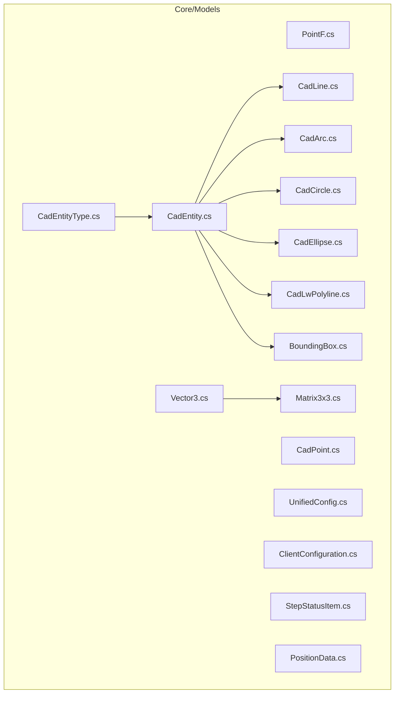
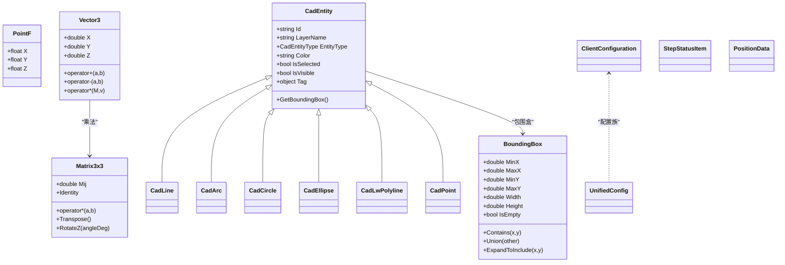
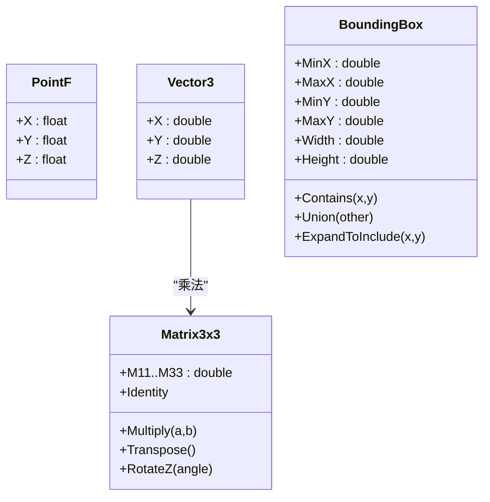
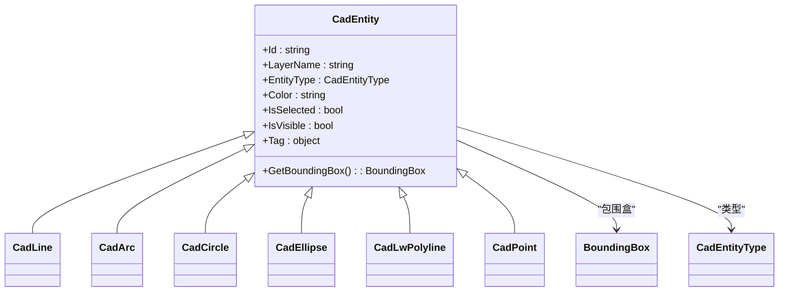
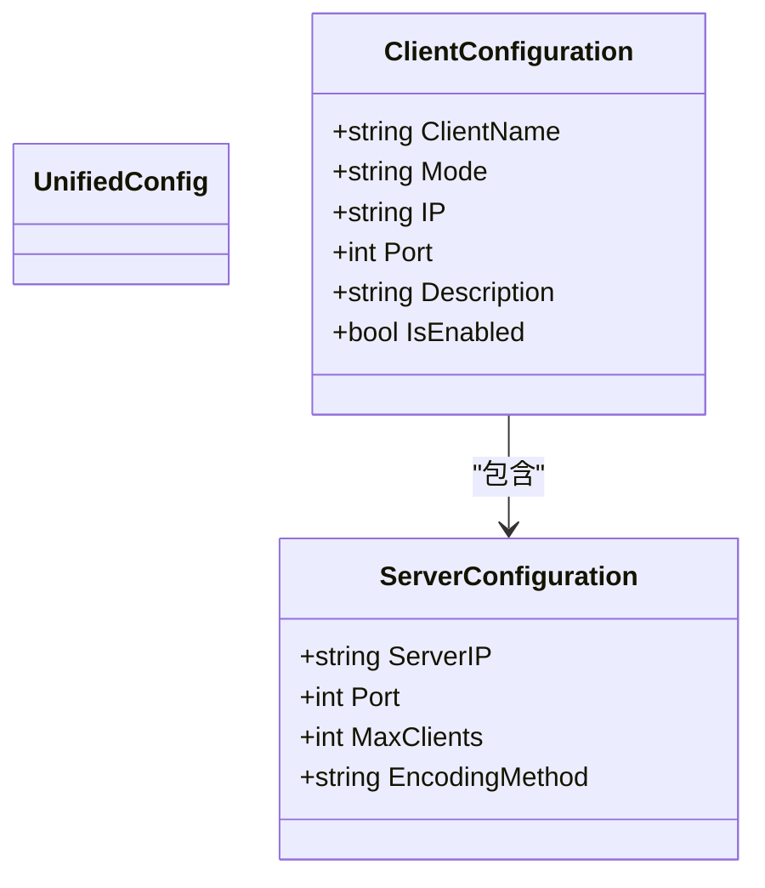
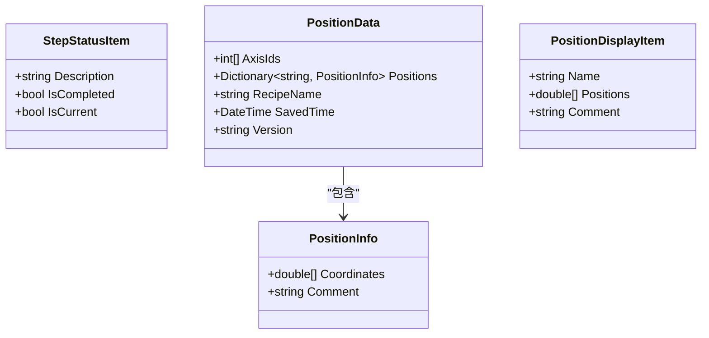
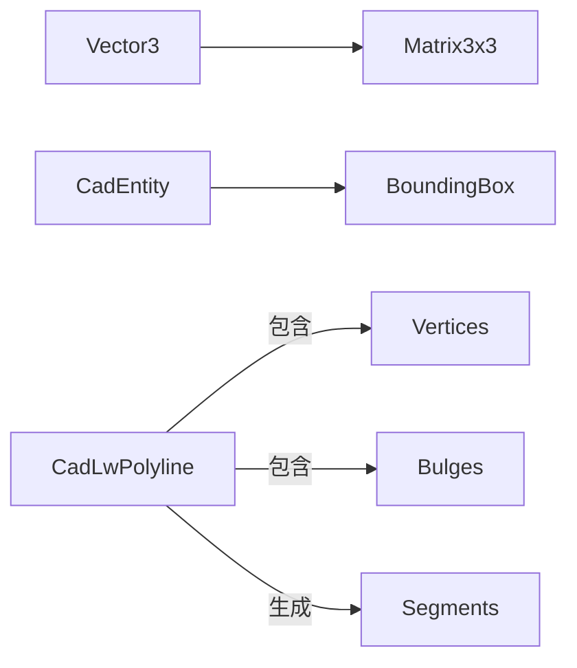

# 数据模型

<cite>
**本文引用的文件**
- [Core/Models/PointF.cs](file://Core/Models/PointF.cs)
- [Core/Models/Vector3.cs](file://Core/Models/Vector3.cs)
- [Core/Models/Matrix3x3.cs](file://Core/Models/Matrix3x3.cs)
- [Core/Models/BoundingBox.cs](file://Core/Models/BoundingBox.cs)
- [Core/Models/CadEntity.cs](file://Core/Models/CadEntity.cs)
- [Core/Models/CadEntityType.cs](file://Core/Models/CadEntityType.cs)
- [Core/Models/CadLine.cs](file://Core/Models/CadLine.cs)
- [Core/Models/CadArc.cs](file://Core/Models/CadArc.cs)
- [Core/Models/CadCircle.cs](file://Core/Models/CadCircle.cs)
- [Core/Models/CadEllipse.cs](file://Core/Models/CadEllipse.cs)
- [Core/Models/CadLwPolyline.cs](file://Core/Models/CadLwPolyline.cs)
- [Core/Models/CadPoint.cs](file://Core/Models/CadPoint.cs)
- [Core/Models/UnifiedConfig.cs](file://Core/Models/UnifiedConfig.cs)
- [Core/Models/ClientConfiguration.cs](file://Core/Models/ClientConfiguration.cs)
- [Core/Models/StepStatusItem.cs](file://Core/Models/StepStatusItem.cs)
- [Core/Models/PositionData.cs](file://Core/Models/PositionData.cs)
</cite>

## 目录
1. [引言](#引言)
2. [项目结构](#项目结构)
3. [核心组件](#核心组件)
4. [架构总览](#架构总览)
5. [详细组件分析](#详细组件分析)
6. [依赖分析](#依赖分析)
7. [性能考虑](#性能考虑)
8. [故障排查指南](#故障排查指南)
9. [结论](#结论)
10. [附录](#附录)

## 引言
本文件聚焦于 Core 模块中的数据模型，系统梳理几何模型（PointF、Vector3、Matrix3x3）、CAD 实体模型（CadEntity 及其派生类）、配置模型（UnifiedConfig、ClientConfiguration）、状态模型（StepStatusItem、PositionData）等的设计原理、字段语义、继承与组合关系、序列化与验证、转换与扩展点，并给出使用示例与最佳实践。文档旨在帮助开发者快速理解模型职责与协作方式，指导正确使用与扩展。

## 项目结构
Core 模块的数据模型主要位于 Core/Models 目录，按功能域划分为：
- 几何与变换：PointF、Vector3、Matrix3x3、BoundingBox
- CAD 实体：CadEntity 及其派生类（Line、Arc、Circle、Ellipse、LwPolyline、Point）
- 配置：UnifiedConfig、ClientConfiguration
- 状态与位置：StepStatusItem、PositionData
- 枚举：CadEntityType

图表来源
- [Core/Models/PointF.cs:1-36](file://Core/Models/PointF.cs#L1-L36)
- [Core/Models/Vector3.cs:1-18](file://Core/Models/Vector3.cs#L1-L18)
- [Core/Models/Matrix3x3.cs:1-59](file://Core/Models/Matrix3x3.cs#L1-L59)
- [Core/Models/BoundingBox.cs:1-144](file://Core/Models/BoundingBox.cs#L1-L144)
- [Core/Models/CadEntity.cs:1-97](file://Core/Models/CadEntity.cs#L1-L97)
- [Core/Models/CadEntityType.cs:1-34](file://Core/Models/CadEntityType.cs#L1-L34)
- [Core/Models/CadLine.cs:1-111](file://Core/Models/CadLine.cs#L1-L111)
- [Core/Models/CadArc.cs:1-158](file://Core/Models/CadArc.cs#L1-L158)
- [Core/Models/CadCircle.cs:1-89](file://Core/Models/CadCircle.cs#L1-L89)
- [Core/Models/CadEllipse.cs:1-160](file://Core/Models/CadEllipse.cs#L1-L160)
- [Core/Models/CadLwPolyline.cs:1-152](file://Core/Models/CadLwPolyline.cs#L1-L152)
- [Core/Models/CadPoint.cs:1-104](file://Core/Models/CadPoint.cs#L1-L104)
- [Core/Models/UnifiedConfig.cs:1-14](file://Core/Models/UnifiedConfig.cs#L1-L14)
- [Core/Models/ClientConfiguration.cs:1-23](file://Core/Models/ClientConfiguration.cs#L1-L23)
- [Core/Models/StepStatusItem.cs:1-31](file://Core/Models/StepStatusItem.cs#L1-L31)
- [Core/Models/PositionData.cs:1-44](file://Core/Models/PositionData.cs#L1-L44)

章节来源
- [Core/Models/PointF.cs:1-36](file://Core/Models/PointF.cs#L1-L36)
- [Core/Models/Vector3.cs:1-18](file://Core/Models/Vector3.cs#L1-L18)
- [Core/Models/Matrix3x3.cs:1-59](file://Core/Models/Matrix3x3.cs#L1-L59)
- [Core/Models/BoundingBox.cs:1-144](file://Core/Models/BoundingBox.cs#L1-L144)
- [Core/Models/CadEntity.cs:1-97](file://Core/Models/CadEntity.cs#L1-L97)
- [Core/Models/CadEntityType.cs:1-34](file://Core/Models/CadEntityType.cs#L1-L34)
- [Core/Models/CadLine.cs:1-111](file://Core/Models/CadLine.cs#L1-L111)
- [Core/Models/CadArc.cs:1-158](file://Core/Models/CadArc.cs#L1-L158)
- [Core/Models/CadCircle.cs:1-89](file://Core/Models/CadCircle.cs#L1-L89)
- [Core/Models/CadEllipse.cs:1-160](file://Core/Models/CadEllipse.cs#L1-L160)
- [Core/Models/CadLwPolyline.cs:1-152](file://Core/Models/CadLwPolyline.cs#L1-L152)
- [Core/Models/CadPoint.cs:1-104](file://Core/Models/CadPoint.cs#L1-L104)
- [Core/Models/UnifiedConfig.cs:1-14](file://Core/Models/UnifiedConfig.cs#L1-L14)
- [Core/Models/ClientConfiguration.cs:1-23](file://Core/Models/ClientConfiguration.cs#L1-L23)
- [Core/Models/StepStatusItem.cs:1-31](file://Core/Models/StepStatusItem.cs#L1-L31)
- [Core/Models/PositionData.cs:1-44](file://Core/Models/PositionData.cs#L1-L44)

## 核心组件
本节概述各模型族的职责与典型用途：
- 几何与变换
  - PointF：带 Z 的二维点，常用于二维/三维坐标表示与显示。
  - Vector3：三维向量，支持加减与与 Matrix3x3 的乘法运算。
  - Matrix3x3：3×3 矩阵，支持乘法、转置与 2D 旋转矩阵生成。
  - BoundingBox：轴对齐包围盒，用于快速碰撞与可视范围估算。
- CAD 实体
  - CadEntity：所有 CAD 图元的抽象基类，统一管理图层、颜色、选择与可见性等通用属性，并提供 GetBoundingBox 抽象方法。
  - 派生类：CadLine、CadArc、CadCircle、CadEllipse、CadLwPolyline、CadPoint，分别描述线段、圆弧、整圆、椭圆、轻量多段线与点。
  - 枚举：CadEntityType 定义了图元类型集合。
- 配置
  - UnifiedConfig：统一配置占位模型，便于未来扩展。
  - ClientConfiguration：客户端连接配置，包含服务器地址、端口、模式等。
- 状态与位置
  - StepStatusItem：流程步骤的状态项，支持描述、完成态与当前态。
  - PositionData：位置数据的 JSON 结构与界面显示模型，包含轴编号、位置字典、配方名、保存时间与版本等。

章节来源
- [Core/Models/PointF.cs:1-36](file://Core/Models/PointF.cs#L1-L36)
- [Core/Models/Vector3.cs:1-18](file://Core/Models/Vector3.cs#L1-L18)
- [Core/Models/Matrix3x3.cs:1-59](file://Core/Models/Matrix3x3.cs#L1-L59)
- [Core/Models/BoundingBox.cs:1-144](file://Core/Models/BoundingBox.cs#L1-L144)
- [Core/Models/CadEntity.cs:1-97](file://Core/Models/CadEntity.cs#L1-L97)
- [Core/Models/CadEntityType.cs:1-34](file://Core/Models/CadEntityType.cs#L1-L34)
- [Core/Models/CadLine.cs:1-111](file://Core/Models/CadLine.cs#L1-L111)
- [Core/Models/CadArc.cs:1-158](file://Core/Models/CadArc.cs#L1-L158)
- [Core/Models/CadCircle.cs:1-89](file://Core/Models/CadCircle.cs#L1-L89)
- [Core/Models/CadEllipse.cs:1-160](file://Core/Models/CadEllipse.cs#L1-L160)
- [Core/Models/CadLwPolyline.cs:1-152](file://Core/Models/CadLwPolyline.cs#L1-L152)
- [Core/Models/CadPoint.cs:1-104](file://Core/Models/CadPoint.cs#L1-L104)
- [Core/Models/UnifiedConfig.cs:1-14](file://Core/Models/UnifiedConfig.cs#L1-L14)
- [Core/Models/ClientConfiguration.cs:1-23](file://Core/Models/ClientConfiguration.cs#L1-L23)
- [Core/Models/StepStatusItem.cs:1-31](file://Core/Models/StepStatusItem.cs#L1-L31)
- [Core/Models/PositionData.cs:1-44](file://Core/Models/PositionData.cs#L1-L44)

## 架构总览
下图展示数据模型之间的继承、组合与依赖关系：

图表来源
- [Core/Models/PointF.cs:1-36](file://Core/Models/PointF.cs#L1-L36)
- [Core/Models/Vector3.cs:1-18](file://Core/Models/Vector3.cs#L1-L18)
- [Core/Models/Matrix3x3.cs:1-59](file://Core/Models/Matrix3x3.cs#L1-L59)
- [Core/Models/BoundingBox.cs:1-144](file://Core/Models/BoundingBox.cs#L1-L144)
- [Core/Models/CadEntity.cs:1-97](file://Core/Models/CadEntity.cs#L1-L97)
- [Core/Models/CadLine.cs:1-111](file://Core/Models/CadLine.cs#L1-L111)
- [Core/Models/CadArc.cs:1-158](file://Core/Models/CadArc.cs#L1-L158)
- [Core/Models/CadCircle.cs:1-89](file://Core/Models/CadCircle.cs#L1-L89)
- [Core/Models/CadEllipse.cs:1-160](file://Core/Models/CadEllipse.cs#L1-L160)
- [Core/Models/CadLwPolyline.cs:1-152](file://Core/Models/CadLwPolyline.cs#L1-L152)
- [Core/Models/CadPoint.cs:1-104](file://Core/Models/CadPoint.cs#L1-L104)
- [Core/Models/UnifiedConfig.cs:1-14](file://Core/Models/UnifiedConfig.cs#L1-L14)
- [Core/Models/ClientConfiguration.cs:1-23](file://Core/Models/ClientConfiguration.cs#L1-L23)
- [Core/Models/StepStatusItem.cs:1-31](file://Core/Models/StepStatusItem.cs#L1-L31)
- [Core/Models/PositionData.cs:1-44](file://Core/Models/PositionData.cs#L1-L44)

## 详细组件分析

### 几何与变换模型
- PointF
  - 字段：X、Y、Z；支持三参与二参构造；提供字符串格式化输出。
  - 适用场景：二维/三维坐标点表示，适合 UI 显示与简单几何计算。
- Vector3
  - 字段：X、Y、Z；支持加减与与 Matrix3x3 的乘法运算。
  - 适用场景：向量运算、点云处理、坐标变换前的向量表示。
- Matrix3x3
  - 字段：M11..M33；提供单位矩阵、乘法、转置；提供 RotateZ(angleDeg) 生成 2D 旋转矩阵。
  - 适用场景：2D/3D 坐标变换、旋转、仿射变换。
- BoundingBox
  - 字段：MinX、MaxX、MinY、MaxY；计算属性 Width/Height；方法 Contains、Union、ExpandToInclude。
  - 适用场景：快速碰撞检测、视图适配、渲染裁剪。

图表来源
- [Core/Models/PointF.cs:1-36](file://Core/Models/PointF.cs#L1-L36)
- [Core/Models/Vector3.cs:1-18](file://Core/Models/Vector3.cs#L1-L18)
- [Core/Models/Matrix3x3.cs:1-59](file://Core/Models/Matrix3x3.cs#L1-L59)
- [Core/Models/BoundingBox.cs:1-144](file://Core/Models/BoundingBox.cs#L1-L144)

章节来源
- [Core/Models/PointF.cs:1-36](file://Core/Models/PointF.cs#L1-L36)
- [Core/Models/Vector3.cs:1-18](file://Core/Models/Vector3.cs#L1-L18)
- [Core/Models/Matrix3x3.cs:1-59](file://Core/Models/Matrix3x3.cs#L1-L59)
- [Core/Models/BoundingBox.cs:1-144](file://Core/Models/BoundingBox.cs#L1-L144)

### CAD 实体模型
- CadEntity
  - 通用属性：Id、LayerName、EntityType、Color、IsSelected、IsVisible、Tag；虚方法 GetBoundingBox 返回包围盒。
  - 设计要点：统一的 UI 交互属性（选择、可见性）与渲染属性（颜色、图层）；派生类需实现 GetBoundingBox。
- 派生类
  - CadLine：起点/终点 XYZ；包围盒为两点构成的最小矩形。
  - CadArc：圆心 XYZ、半径、起止角度；包围盒通过采样关键角度点与端点估算。
  - CadCircle：圆心 XYZ、半径；包围盒为外接正方形。
  - CadEllipse：中心 XYZ、长短半轴、旋转角、起止角度；包围盒通过参数方程采样关键点估算。
  - CadLwPolyline：顶点列表、闭合标志、线宽、子段列表与 Bulges；支持 BuildSegments 将 Bulge 转换为直线/圆弧段。
  - CadPoint：坐标 XYZ、名称、装配站点、机械坐标与偏移后坐标、图像行列号等；用于装配/视觉定位。
- 枚举 CadEntityType
  - 定义 Line、Arc、Circle、LwPolyline、Polyline、Ellipse、Spline、Unknown。

图表来源
- [Core/Models/CadEntity.cs:1-97](file://Core/Models/CadEntity.cs#L1-L97)
- [Core/Models/CadLine.cs:1-111](file://Core/Models/CadLine.cs#L1-L111)
- [Core/Models/CadArc.cs:1-158](file://Core/Models/CadArc.cs#L1-L158)
- [Core/Models/CadCircle.cs:1-89](file://Core/Models/CadCircle.cs#L1-L89)
- [Core/Models/CadEllipse.cs:1-160](file://Core/Models/CadEllipse.cs#L1-L160)
- [Core/Models/CadLwPolyline.cs:1-152](file://Core/Models/CadLwPolyline.cs#L1-L152)
- [Core/Models/CadPoint.cs:1-104](file://Core/Models/CadPoint.cs#L1-L104)
- [Core/Models/BoundingBox.cs:1-144](file://Core/Models/BoundingBox.cs#L1-L144)
- [Core/Models/CadEntityType.cs:1-34](file://Core/Models/CadEntityType.cs#L1-L34)

章节来源
- [Core/Models/CadEntity.cs:1-97](file://Core/Models/CadEntity.cs#L1-L97)
- [Core/Models/CadEntityType.cs:1-34](file://Core/Models/CadEntityType.cs#L1-L34)
- [Core/Models/CadLine.cs:1-111](file://Core/Models/CadLine.cs#L1-L111)
- [Core/Models/CadArc.cs:1-158](file://Core/Models/CadArc.cs#L1-L158)
- [Core/Models/CadCircle.cs:1-89](file://Core/Models/CadCircle.cs#L1-L89)
- [Core/Models/CadEllipse.cs:1-160](file://Core/Models/CadEllipse.cs#L1-L160)
- [Core/Models/CadLwPolyline.cs:1-152](file://Core/Models/CadLwPolyline.cs#L1-L152)
- [Core/Models/CadPoint.cs:1-104](file://Core/Models/CadPoint.cs#L1-L104)
- [Core/Models/BoundingBox.cs:1-144](file://Core/Models/BoundingBox.cs#L1-L144)

### 配置模型
- UnifiedConfig
  - 当前为空占位，建议作为统一配置根对象，承载跨模块配置项。
- ClientConfiguration
  - 包含客户端名称、模式（Client/Server）、IP、端口、描述、启用状态等。
  - ServerConfiguration：服务器端配置（IP、端口、最大客户端数、编码方式）。

图表来源
- [Core/Models/UnifiedConfig.cs:1-14](file://Core/Models/UnifiedConfig.cs#L1-L14)
- [Core/Models/ClientConfiguration.cs:1-23](file://Core/Models/ClientConfiguration.cs#L1-L23)

章节来源
- [Core/Models/UnifiedConfig.cs:1-14](file://Core/Models/UnifiedConfig.cs#L1-L14)
- [Core/Models/ClientConfiguration.cs:1-23](file://Core/Models/ClientConfiguration.cs#L1-L23)

### 状态与位置模型
- StepStatusItem
  - 描述步骤状态的可观察模型：Description、IsCompleted、IsCurrent。
- PositionData
  - JSON 数据模型：AxisIds、Positions（键为位置名，值为 PositionInfo）、RecipeName、SavedTime、Version。
  - PositionInfo：Coordinates（数组）、Comment。
  - 界面显示模型 PositionDisplayItem：Name、Positions、Comment。

图表来源
- [Core/Models/StepStatusItem.cs:1-31](file://Core/Models/StepStatusItem.cs#L1-L31)
- [Core/Models/PositionData.cs:1-44](file://Core/Models/PositionData.cs#L1-L44)

章节来源
- [Core/Models/StepStatusItem.cs:1-31](file://Core/Models/StepStatusItem.cs#L1-L31)
- [Core/Models/PositionData.cs:1-44](file://Core/Models/PositionData.cs#L1-L44)

## 依赖分析
- 继承关系
  - 所有 CAD 实体均继承自 CadEntity，统一管理通用属性与包围盒接口。
- 组合关系
  - Vector3 与 Matrix3x3 存在运算耦合（向量与矩阵乘法）。
  - CadEntity 与 BoundingBox 存在组合关系（派生类通过 GetBoundingBox 提供边界）。
  - CadLwPolyline 内部维护 Vertices、Segments、Bulges 三者关系，BuildSegments 将 Bulges 转换为 Segments。
- 外部依赖
  - 模型文件未显式引用第三方序列化库；若需要 JSON 序列化，通常依赖系统内置或项目配置的服务（如 Core/Services 中的 JSON 服务）。

图表来源
- [Core/Models/Vector3.cs:1-18](file://Core/Models/Vector3.cs#L1-L18)
- [Core/Models/Matrix3x3.cs:1-59](file://Core/Models/Matrix3x3.cs#L1-L59)
- [Core/Models/CadEntity.cs:1-97](file://Core/Models/CadEntity.cs#L1-L97)
- [Core/Models/BoundingBox.cs:1-144](file://Core/Models/BoundingBox.cs#L1-L144)
- [Core/Models/CadLwPolyline.cs:1-152](file://Core/Models/CadLwPolyline.cs#L1-L152)

章节来源
- [Core/Models/Vector3.cs:1-18](file://Core/Models/Vector3.cs#L1-L18)
- [Core/Models/Matrix3x3.cs:1-59](file://Core/Models/Matrix3x3.cs#L1-L59)
- [Core/Models/CadEntity.cs:1-97](file://Core/Models/CadEntity.cs#L1-L97)
- [Core/Models/BoundingBox.cs:1-144](file://Core/Models/BoundingBox.cs#L1-L144)
- [Core/Models/CadLwPolyline.cs:1-152](file://Core/Models/CadLwPolyline.cs#L1-L152)

## 性能考虑
- BoundingBox
  - Contains、Union、ExpandToInclude 为 O(1)/O(n) 操作，适合大规模几何对象的快速筛选与视图适配。
- CadLwPolyline
  - BuildSegments 对顶点与 Bulges 进行线性扫描并生成子段，注意在顶点数量较大时避免重复构建；建议缓存中间结果。
- Vector3 与 Matrix3x3
  - 向量与矩阵乘法为常数时间复杂度，适合批量变换；注意避免频繁装箱与不必要的临时对象创建。
- CadArc/CadEllipse
  - 包围盒计算通过采样关键角度点估算，采样越多越精确但计算成本越高；可根据精度需求调整采样策略。

[本节为通用性能讨论，不直接分析具体文件]

## 故障排查指南
- 包围盒为空判断
  - BoundingBox.IsEmpty 用于判断是否包含有效范围；在空集合或无效输入时应检查 IsEmpty 并采取降级策略。
- 多段线闭合与子段构建
  - CadLwPolyline.BuildSegments 需确保 Vertices 与 Bulges 数量一致且非空；闭合多段线的最后一个 Bulge 会影响闭合段。
- 圆弧角度范围
  - CadArc 与 CadEllipse 的角度归一化与范围判断需注意跨越 0° 的情况，避免边界点遗漏导致包围盒不准确。
- 颜色与可见性
  - CadEntity 的颜色为 ARGB 十六进制字符串；若渲染异常，检查颜色格式与默认值。

章节来源
- [Core/Models/BoundingBox.cs:1-144](file://Core/Models/BoundingBox.cs#L1-L144)
- [Core/Models/CadLwPolyline.cs:1-152](file://Core/Models/CadLwPolyline.cs#L1-L152)
- [Core/Models/CadArc.cs:1-158](file://Core/Models/CadArc.cs#L1-L158)
- [Core/Models/CadEllipse.cs:1-160](file://Core/Models/CadEllipse.cs#L1-L160)
- [Core/Models/CadEntity.cs:1-97](file://Core/Models/CadEntity.cs#L1-L97)

## 结论
Core 模块的数据模型围绕“几何—实体—配置—状态”的层次化设计展开：几何与变换模型提供基础数学能力；CAD 实体模型以统一接口抽象各类图元并提供边界估算；配置与状态模型支撑运行期行为与界面展示。通过清晰的继承与组合关系，模型具备良好的可扩展性与可维护性。建议在实际使用中遵循字段语义、边界条件与性能约束，结合项目序列化与验证策略，确保数据一致性与运行效率。

[本节为总结性内容，不直接分析具体文件]

## 附录
- 使用示例（路径指引）
  - 创建二维点：参考 [Core/Models/PointF.cs:1-36](file://Core/Models/PointF.cs#L1-L36)
  - 三维向量与矩阵乘法：参考 [Core/Models/Vector3.cs:1-18](file://Core/Models/Vector3.cs#L1-L18)、[Core/Models/Matrix3x3.cs:1-59](file://Core/Models/Matrix3x3.cs#L1-L59)
  - 计算包围盒：参考 [Core/Models/BoundingBox.cs:1-144](file://Core/Models/BoundingBox.cs#L1-L144)
  - 定义 CAD 图元：参考 [Core/Models/CadLine.cs:1-111](file://Core/Models/CadLine.cs#L1-L111)、[Core/Models/CadArc.cs:1-158](file://Core/Models/CadArc.cs#L1-L158)、[Core/Models/CadCircle.cs:1-89](file://Core/Models/CadCircle.cs#L1-L89)、[Core/Models/CadEllipse.cs:1-160](file://Core/Models/CadEllipse.cs#L1-L160)、[Core/Models/CadLwPolyline.cs:1-152](file://Core/Models/CadLwPolyline.cs#L1-L152)、[Core/Models/CadPoint.cs:1-104](file://Core/Models/CadPoint.cs#L1-L104)
  - 配置模型：参考 [Core/Models/ClientConfiguration.cs:1-23](file://Core/Models/ClientConfiguration.cs#L1-L23)、[Core/Models/UnifiedConfig.cs:1-14](file://Core/Models/UnifiedConfig.cs#L1-L14)
  - 状态与位置：参考 [Core/Models/StepStatusItem.cs:1-31](file://Core/Models/StepStatusItem.cs#L1-L31)、[Core/Models/PositionData.cs:1-44](file://Core/Models/PositionData.cs#L1-L44)

- 字段含义与业务关联
  - CadEntity：Id/LayerName/Color/IsSelected/IsVisible/Tag 与 UI 渲染与交互强关联；GetBoundingBox 与可视化/碰撞强关联。
  - CadLwPolyline：Vertices/Bulges/Segments 与 DXF 导入与路径生成强关联；IsClosed/Width 与渲染样式强关联。
  - ClientConfiguration：Mode/IP/Port/Description/IsEnabled 与网络通信与设备接入强关联。
  - PositionData：AxisIds/Positions/RecipeName/SavedTime/Version 与配方与位置管理强关联。

[本节为补充说明，不直接分析具体文件]