# 状态与统计模型

<cite>
**本文引用的文件**
- [StepStatusItem.cs](file://Core/Models/StepStatusItem.cs)
- [PositionData.cs](file://Core/Models/PositionData.cs)
- [GlobalVariable.cs](file://Core/Models/GlobalVariable.cs)
- [TcpMessageLog.cs](file://Core/Models/TcpMessageLog.cs)
- [AlarmStatsViewModel.cs](file://AlarmModule/ViewModels/AlarmStatsViewModel.cs)
- [AlarmService.cs](file://AlarmModule/Services/AlarmService.cs)
- [AlarmDbContext.cs](file://AlarmModule/Data/AlarmDbContext.cs)
- [ProcessStepSequenceEvent.cs](file://Core/Events/ProcessStepSequenceEvent.cs)
- [SystemStateService.cs](file://MotionControl/Services/SystemStateService.cs)
- [ISystemStateService.cs](file://MotionControl/Interfaces/ISystemStateService.cs)
- [DataDashboardViewModel.cs](file://Module/ViewModels/DataDashboardViewModel.cs)
- [DashboardStepAction.cs](file://StationTasks/Actions/DashboardStepAction.cs)
- [GlobalVariablesViewModel.cs](file://RecipeManagement/ViewModels/GlobalVariablesViewModel.cs)
- [JsonParameterStorage.cs](file://Core/Services/JsonParameterStorage.cs)
</cite>

## 目录
1. [引言](#引言)
2. [项目结构](#项目结构)
3. [核心组件](#核心组件)
4. [架构总览](#架构总览)
5. [详细组件分析](#详细组件分析)
6. [依赖关系分析](#依赖关系分析)
7. [性能考虑](#性能考虑)
8. [故障排查指南](#故障排查指南)
9. [结论](#结论)
10. [附录](#附录)

## 引言
本文件聚焦于状态与统计模型，围绕以下主题展开：StepStatusItem、PositionData、GlobalVariable 等状态模型的设计与应用；系统运行时的状态管理、统计数据收集、报警配置与通信日志机制；以及这些模型在监控面板、报警系统、网络通信中的作用。文档同时提供状态数据的更新、查询与持久化示例路径，并讨论状态同步机制、数据一致性保障、性能监控与历史数据分析策略。

## 项目结构
本仓库采用多模块分层组织，状态与统计相关的核心模型位于 Core 模块，运行时状态与事件由 MotionControl 提供，报警与统计由 AlarmModule 提供，数据看板与公式计算由 StationTasks 与 Module 配合实现，全局变量与配方持久化由 RecipeManagement 与 Core 的参数存储服务协同完成。

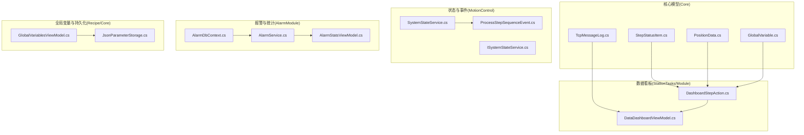

图表来源
- [StepStatusItem.cs:1-31](file://Core/Models/StepStatusItem.cs#L1-L31)
- [PositionData.cs:1-44](file://Core/Models/PositionData.cs#L1-L44)
- [GlobalVariable.cs:1-148](file://Core/Models/GlobalVariable.cs#L1-L148)
- [TcpMessageLog.cs:1-29](file://Core/Models/TcpMessageLog.cs#L1-L29)
- [SystemStateService.cs:1-441](file://MotionControl/Services/SystemStateService.cs#L1-L441)
- [ISystemStateService.cs:1-22](file://MotionControl/Interfaces/ISystemStateService.cs#L1-L22)
- [ProcessStepSequenceEvent.cs:1-53](file://Core/Events/ProcessStepSequenceEvent.cs#L1-L53)
- [AlarmStatsViewModel.cs:50-217](file://AlarmModule/ViewModels/AlarmStatsViewModel.cs#L50-L217)
- [AlarmService.cs:32-57](file://AlarmModule/Services/AlarmService.cs#L32-L57)
- [AlarmDbContext.cs:35-45](file://AlarmModule/Data/AlarmDbContext.cs#L35-L45)
- [DashboardStepAction.cs:315-431](file://StationTasks/Actions/DashboardStepAction.cs#L315-L431)
- [DataDashboardViewModel.cs:499-549](file://Module/ViewModels/DataDashboardViewModel.cs#L499-L549)
- [GlobalVariablesViewModel.cs:1-202](file://RecipeManagement/ViewModels/GlobalVariablesViewModel.cs#L1-L202)
- [JsonParameterStorage.cs:1-86](file://Core/Services/JsonParameterStorage.cs#L1-L86)

章节来源
- [StepStatusItem.cs:1-31](file://Core/Models/StepStatusItem.cs#L1-L31)
- [PositionData.cs:1-44](file://Core/Models/PositionData.cs#L1-L44)
- [GlobalVariable.cs:1-148](file://Core/Models/GlobalVariable.cs#L1-L148)
- [TcpMessageLog.cs:1-29](file://Core/Models/TcpMessageLog.cs#L1-L29)
- [ProcessStepSequenceEvent.cs:1-53](file://Core/Events/ProcessStepSequenceEvent.cs#L1-L53)
- [SystemStateService.cs:1-441](file://MotionControl/Services/SystemStateService.cs#L1-L441)
- [ISystemStateService.cs:1-22](file://MotionControl/Interfaces/ISystemStateService.cs#L1-L22)
- [AlarmStatsViewModel.cs:50-217](file://AlarmModule/ViewModels/AlarmStatsViewModel.cs#L50-L217)
- [AlarmService.cs:32-57](file://AlarmModule/Services/AlarmService.cs#L32-L57)
- [AlarmDbContext.cs:35-45](file://AlarmModule/Data/AlarmDbContext.cs#L35-L45)
- [DashboardStepAction.cs:315-431](file://StationTasks/Actions/DashboardStepAction.cs#L315-L431)
- [DataDashboardViewModel.cs:499-549](file://Module/ViewModels/DataDashboardViewModel.cs#L499-L549)
- [GlobalVariablesViewModel.cs:1-202](file://RecipeManagement/ViewModels/GlobalVariablesViewModel.cs#L1-L202)
- [JsonParameterStorage.cs:1-86](file://Core/Services/JsonParameterStorage.cs#L1-L86)

## 核心组件
- StepStatusItem：用于描述步骤的“描述”“已完成”“当前步骤”等状态，基于可绑定基类，便于 UI 绑定与状态变化通知。
- PositionData：用于配方位置点的序列化与界面显示，包含轴编号、坐标字典、配方名、保存时间与版本号；配套显示模型支持名称、坐标数组与注释的双向绑定。
- GlobalVariable：全局变量容器，支持多种类型（整型、浮点、布尔、字符串及其数组），统一以字符串存储并在 setter 中按类型进行规范化与约束，类型变更时自动更新默认值或规范化当前值。
- TcpMessageLog：TCP 通信消息日志，记录时间戳、方向（发送/接收）、客户端名称与消息体，提供格式化显示字段。
- AlarmStatsViewModel：报警统计视图模型，负责加载近7日每日趋势、等级分布与Top来源等统计信息，并提供刷新命令。
- AlarmService：报警触发与持久化服务，支持阈值配置、抑制窗口、防抖与异步触发。
- SystemStateService：系统状态机服务，封装安全门、光栅、蜂鸣器等安全信号与状态转换逻辑，发布状态变更事件。
- DashboardStepAction 与 DataDashboardViewModel：数据看板步骤执行器与视图模型，负责公式求值、条件判断、事件发布与用户确认流程。
- GlobalVariablesViewModel 与 JsonParameterStorage：全局变量的编辑、保存与持久化，支持配方池切换与外部保存事件驱动的刷新。

章节来源
- [StepStatusItem.cs:6-28](file://Core/Models/StepStatusItem.cs#L6-L28)
- [PositionData.cs:6-44](file://Core/Models/PositionData.cs#L6-L44)
- [GlobalVariable.cs:14-147](file://Core/Models/GlobalVariable.cs#L14-L147)
- [TcpMessageLog.cs:8-27](file://Core/Models/TcpMessageLog.cs#L8-L27)
- [AlarmStatsViewModel.cs:50-217](file://AlarmModule/ViewModels/AlarmStatsViewModel.cs#L50-L217)
- [AlarmService.cs:32-57](file://AlarmModule/Services/AlarmService.cs#L32-L57)
- [SystemStateService.cs:15-441](file://MotionControl/Services/SystemStateService.cs#L15-L441)
- [DashboardStepAction.cs:339-431](file://StationTasks/Actions/DashboardStepAction.cs#L339-L431)
- [DataDashboardViewModel.cs:501-549](file://Module/ViewModels/DataDashboardViewModel.cs#L501-L549)
- [GlobalVariablesViewModel.cs:17-202](file://RecipeManagement/ViewModels/GlobalVariablesViewModel.cs#L17-L202)
- [JsonParameterStorage.cs:10-86](file://Core/Services/JsonParameterStorage.cs#L10-L86)

## 架构总览
下图展示了状态与统计模型在系统中的交互关系：状态机服务驱动系统状态变化并通过事件发布；步骤执行器在执行过程中更新步骤状态；数据看板通过公式引擎与全局变量生成实时数据；报警服务根据阈值配置与抑制窗口进行触发与持久化；通信日志模型承载 TCP 消息展示；全局变量与配方持久化服务支撑变量的读写与刷新。

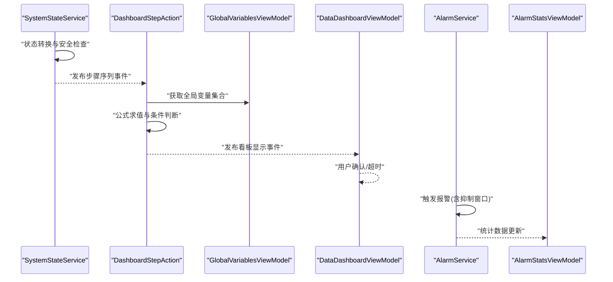

图表来源
- [SystemStateService.cs:316-425](file://MotionControl/Services/SystemStateService.cs#L316-L425)
- [DashboardStepAction.cs:360-428](file://StationTasks/Actions/DashboardStepAction.cs#L360-L428)
- [DataDashboardViewModel.cs:517-547](file://Module/ViewModels/DataDashboardViewModel.cs#L517-L547)
- [AlarmService.cs:52-57](file://AlarmModule/Services/AlarmService.cs#L52-L57)
- [AlarmStatsViewModel.cs:172-187](file://AlarmModule/ViewModels/AlarmStatsViewModel.cs#L172-L187)

## 详细组件分析

### StepStatusItem 分析
- 设计要点：基于可绑定基类，提供描述、完成态与当前态三要素，适合在步骤序列监控中展示当前执行步骤与完成进度。
- 状态跟踪：通过属性变更通知，UI 可实时反映步骤状态变化。
- 应用场景：与步骤执行器配合，在执行前后设置当前步骤与完成态，驱动监控面板与流程可视化。

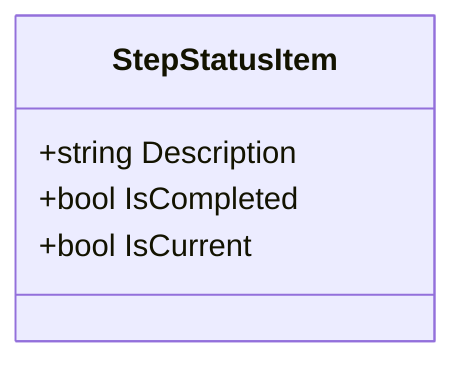

图表来源
- [StepStatusItem.cs:6-28](file://Core/Models/StepStatusItem.cs#L6-L28)

章节来源
- [StepStatusItem.cs:6-28](file://Core/Models/StepStatusItem.cs#L6-L28)

### PositionData 分析
- 数据模型：包含轴编号数组、位置字典、配方名、保存时间与版本号；配套显示模型支持名称、坐标数组与注释的双向绑定。
- 应用场景：配方位置点的序列化与界面展示，便于位置点的编辑、保存与回显。
- 更新与查询：可通过配方服务或视图模型更新位置数据，查询时读取对应配方名与版本号。

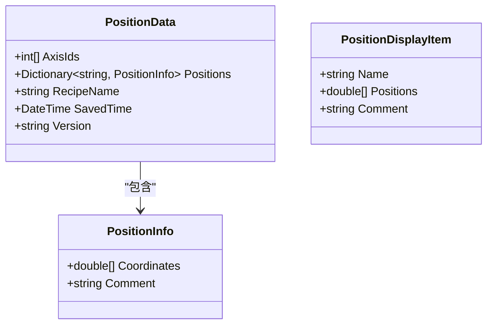

图表来源
- [PositionData.cs:6-44](file://Core/Models/PositionData.cs#L6-L44)

章节来源
- [PositionData.cs:6-44](file://Core/Models/PositionData.cs#L6-L44)

### GlobalVariable 分析
- 类型与约束：支持整型、浮点、布尔、字符串及其数组；统一以字符串存储并在 setter 中按类型进行规范化与约束。
- 类型变更处理：当类型变更时，若当前值为空或为旧类型的常见默认值，则更新为新类型的默认值；否则对当前值进行规范化（如从双精度到整型时截断小数）。
- 应用场景：作为数据看板公式引擎的变量源，支持配方池级别的全局变量管理与持久化。

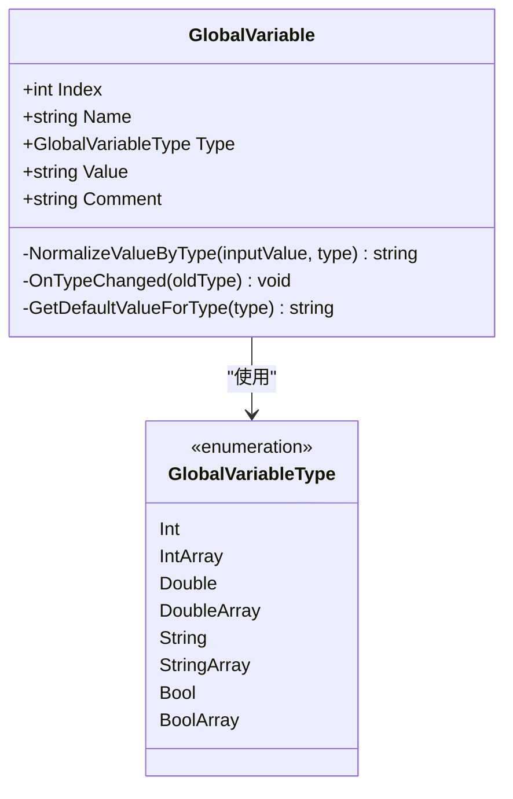

图表来源
- [GlobalVariable.cs:14-147](file://Core/Models/GlobalVariable.cs#L14-L147)

章节来源
- [GlobalVariable.cs:6-147](file://Core/Models/GlobalVariable.cs#L6-L147)

### TcpMessageLog 分析
- 字段设计：时间戳、消息方向（发送/接收）、客户端名称与消息内容；提供格式化显示字段。
- 应用场景：在通信模块中记录并展示 TCP 收发消息，便于调试与审计。

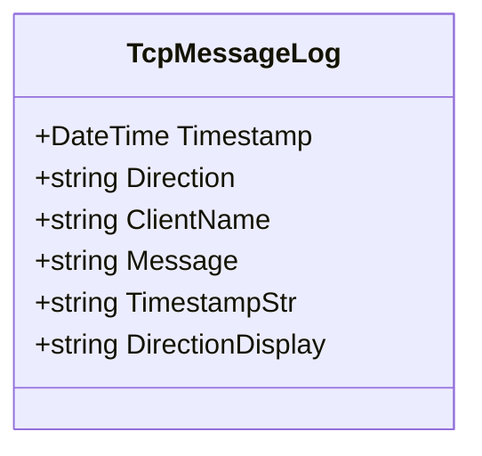

图表来源
- [TcpMessageLog.cs:8-27](file://Core/Models/TcpMessageLog.cs#L8-L27)

章节来源
- [TcpMessageLog.cs:8-27](file://Core/Models/TcpMessageLog.cs#L8-L27)

### 报警统计与触发流程
- 统计视图模型：负责加载近7日每日趋势、等级分布与Top来源，并提供刷新命令。
- 触发服务：支持按报警码与来源获取阈值配置，设置抑制窗口，避免短时间内重复触发。
- 数据库上下文：定义报警阈值配置实体索引与枚举转换。

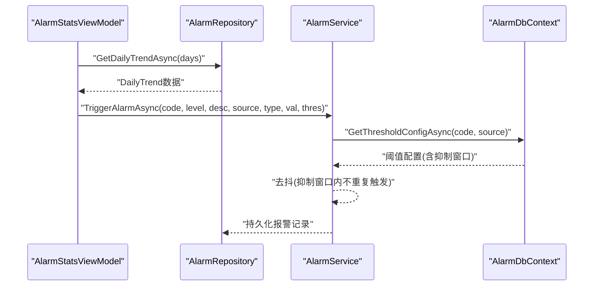

图表来源
- [AlarmStatsViewModel.cs:172-187](file://AlarmModule/ViewModels/AlarmStatsViewModel.cs#L172-L187)
- [AlarmService.cs:52-57](file://AlarmModule/Services/AlarmService.cs#L52-L57)
- [AlarmDbContext.cs:35-45](file://AlarmModule/Data/AlarmDbContext.cs#L35-L45)

章节来源
- [AlarmStatsViewModel.cs:50-217](file://AlarmModule/ViewModels/AlarmStatsViewModel.cs#L50-L217)
- [AlarmService.cs:32-57](file://AlarmModule/Services/AlarmService.cs#L32-L57)
- [AlarmDbContext.cs:35-45](file://AlarmModule/Data/AlarmDbContext.cs#L35-L45)

### 系统状态管理与事件
- 状态机服务：封装安全门、光栅、蜂鸣器等安全信号与状态转换逻辑，提供启动、暂停、恢复、停止、紧急停止与复位请求，并发布状态变更事件。
- 事件发布：状态变化时发布事件，供监控面板与任务监视器订阅与响应。

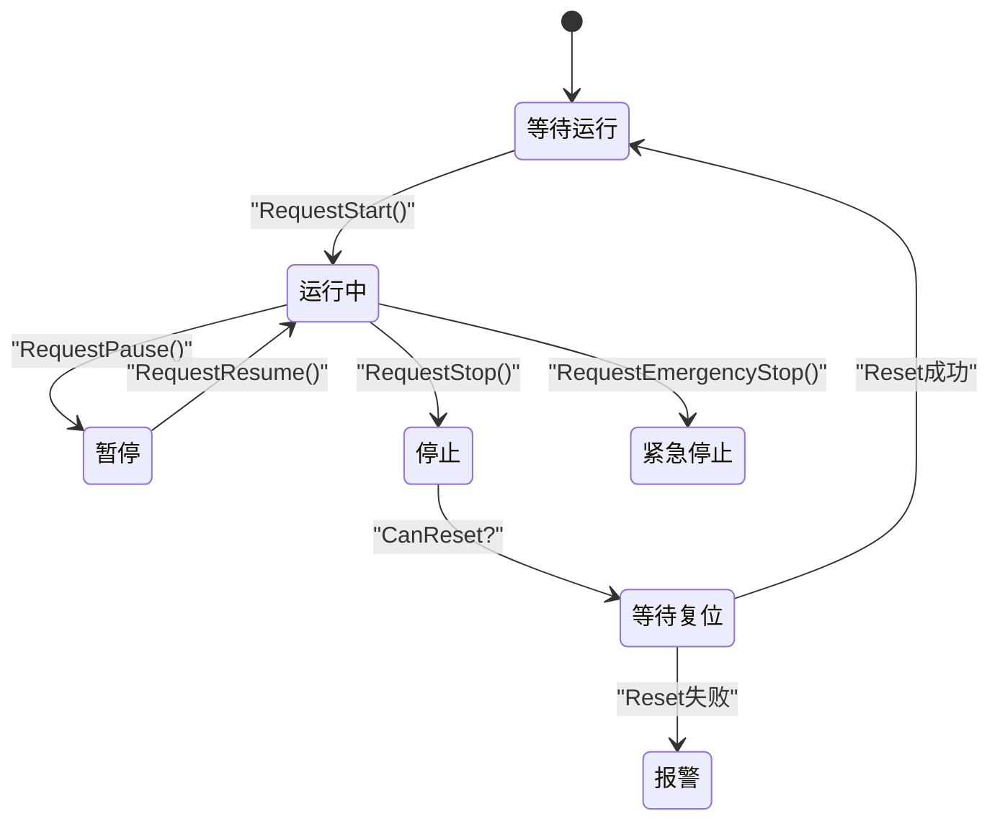

图表来源
- [SystemStateService.cs:316-425](file://MotionControl/Services/SystemStateService.cs#L316-L425)
- [ISystemStateService.cs:5-21](file://MotionControl/Interfaces/ISystemStateService.cs#L5-L21)

章节来源
- [SystemStateService.cs:15-441](file://MotionControl/Services/SystemStateService.cs#L15-L441)
- [ISystemStateService.cs:1-22](file://MotionControl/Interfaces/ISystemStateService.cs#L1-L22)

### 数据看板与公式引擎
- 执行器：在 DASHBOARD 步骤中，从全局变量服务获取变量集合，对每个字段进行公式求值与条件判断，发布看板显示事件，并等待用户确认或超时自动确认。
- 视图模型：订阅看板显示事件，加载字段与标注，渲染背景图，处理用户确认并记录日志。

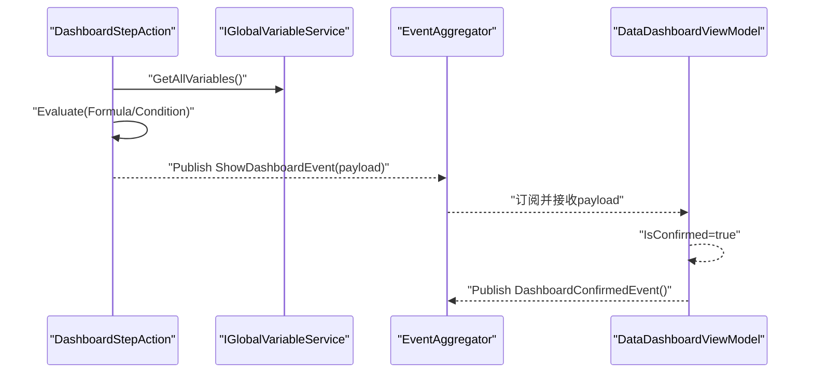

图表来源
- [DashboardStepAction.cs:360-428](file://StationTasks/Actions/DashboardStepAction.cs#L360-L428)
- [DataDashboardViewModel.cs:517-547](file://Module/ViewModels/DataDashboardViewModel.cs#L517-L547)

章节来源
- [DashboardStepAction.cs:339-431](file://StationTasks/Actions/DashboardStepAction.cs#L339-L431)
- [DataDashboardViewModel.cs:501-549](file://Module/ViewModels/DataDashboardViewModel.cs#L501-L549)

### 全局变量的更新、查询与持久化
- 更新与查询：通过全局变量视图模型维护集合，支持外部保存事件驱动的刷新，避免旧值覆盖新值。
- 持久化：通过参数存储服务将全局变量集合保存到 JSON 文件，支持自定义目录与命名规范，提供加载与保存方法。

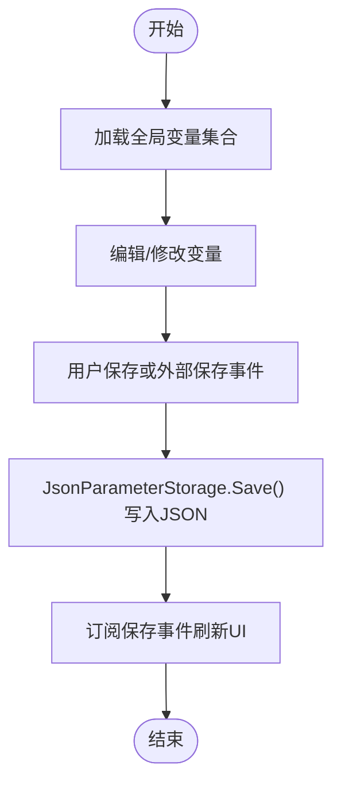

图表来源
- [GlobalVariablesViewModel.cs:164-187](file://RecipeManagement/ViewModels/GlobalVariablesViewModel.cs#L164-L187)
- [JsonParameterStorage.cs:28-78](file://Core/Services/JsonParameterStorage.cs#L28-L78)

章节来源
- [GlobalVariablesViewModel.cs:17-202](file://RecipeManagement/ViewModels/GlobalVariablesViewModel.cs#L17-L202)
- [JsonParameterStorage.cs:10-86](file://Core/Services/JsonParameterStorage.cs#L10-L86)

## 依赖关系分析
- StepStatusItem 与 DashboardStepAction：前者用于步骤状态展示，后者在执行过程中更新当前步骤与完成态。
- GlobalVariable 与 DashboardStepAction：前者作为公式引擎的变量源，后者在执行时读取并计算字段值。
- SystemStateService 与 ProcessStepSequenceEvent：前者发布状态变化事件，后者承载步骤序列控制与事件载荷。
- AlarmService 与 AlarmStatsViewModel：前者负责触发与持久化，后者负责统计展示。
- GlobalVariablesViewModel 与 JsonParameterStorage：前者维护集合，后者提供持久化能力。

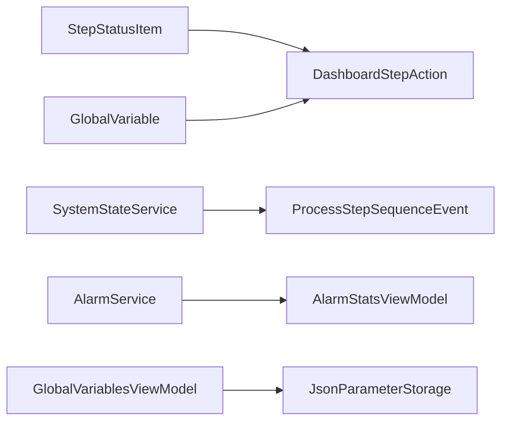

图表来源
- [StepStatusItem.cs:6-28](file://Core/Models/StepStatusItem.cs#L6-L28)
- [DashboardStepAction.cs:339-431](file://StationTasks/Actions/DashboardStepAction.cs#L339-L431)
- [SystemStateService.cs:410-419](file://MotionControl/Services/SystemStateService.cs#L410-L419)
- [ProcessStepSequenceEvent.cs:14-21](file://Core/Events/ProcessStepSequenceEvent.cs#L14-L21)
- [AlarmService.cs:32-57](file://AlarmModule/Services/AlarmService.cs#L32-L57)
- [AlarmStatsViewModel.cs:50-217](file://AlarmModule/ViewModels/AlarmStatsViewModel.cs#L50-L217)
- [GlobalVariablesViewModel.cs:17-202](file://RecipeManagement/ViewModels/GlobalVariablesViewModel.cs#L17-L202)
- [JsonParameterStorage.cs:10-86](file://Core/Services/JsonParameterStorage.cs#L10-L86)

章节来源
- [ProcessStepSequenceEvent.cs:1-53](file://Core/Events/ProcessStepSequenceEvent.cs#L1-L53)
- [SystemStateService.cs:410-419](file://MotionControl/Services/SystemStateService.cs#L410-L419)

## 性能考虑
- 报警触发防抖：通过抑制窗口避免高频重复触发，降低数据库写入压力与 UI 抖动。
- 公式求值：公式引擎应避免复杂嵌套与频繁调用，建议缓存变量字典与中间结果。
- 状态机轮询：安全信号轮询频率应合理设置，避免占用过多 CPU；必要时采用事件驱动替代轮询。
- 日志与统计：报警统计与通信日志应分批写入，避免阻塞主线程；可采用异步队列与批量提交。
- 全局变量持久化：保存操作应异步化，避免 UI 卡顿；对大集合进行分页或增量保存。

## 故障排查指南
- 报警未触发或重复触发：检查阈值配置与抑制窗口设置，确认 AlarmService 的触发逻辑与数据库索引是否正确。
- 看板公式错误：检查公式语法与变量名拼写，确认 GlobalVariable 的值是否符合预期类型；查看日志中公式求值失败的警告。
- 状态机无法恢复：检查安全门与光栅信号是否仍处于激活状态，确认 SystemStateService 的条件判断逻辑。
- 通信日志缺失：确认 TCP 服务是否正确记录消息方向与内容，检查 UI 绑定是否正确映射格式化字段。
- 全局变量未刷新：确认外部保存事件是否被订阅，避免直接调用保存导致旧值覆盖新值；检查 JsonParameterStorage 的文件路径与权限。

章节来源
- [AlarmService.cs:52-57](file://AlarmModule/Services/AlarmService.cs#L52-L57)
- [DashboardStepAction.cs:384-387](file://StationTasks/Actions/DashboardStepAction.cs#L384-L387)
- [SystemStateService.cs:275-295](file://MotionControl/Services/SystemStateService.cs#L275-L295)
- [TcpMessageLog.cs:22-26](file://Core/Models/TcpMessageLog.cs#L22-L26)
- [GlobalVariablesViewModel.cs:193-200](file://RecipeManagement/ViewModels/GlobalVariablesViewModel.cs#L193-L200)

## 结论
本文件系统梳理了状态与统计模型在系统中的角色与实现：StepStatusItem、PositionData、GlobalVariable 提供基础状态与数据载体；SystemStateService 与事件驱动的状态机保障运行时状态一致性；AlarmService 与 AlarmStatsViewModel 实现报警配置与统计分析；DashboardStepAction 与 DataDashboardViewModel 将全局变量与公式引擎结合，形成数据看板闭环；JsonParameterStorage 与 GlobalVariablesViewModel 确保全局变量的持久化与刷新。通过合理的状态同步、数据一致性与性能优化策略，系统能够在监控面板、报警系统与网络通信中稳定高效地运行。

## 附录
- 状态数据更新示例路径
  - 步骤状态更新：[DashboardStepAction.cs:360-428](file://StationTasks/Actions/DashboardStepAction.cs#L360-L428)
  - 全局变量保存：[GlobalVariablesViewModel.cs:164-187](file://RecipeManagement/ViewModels/GlobalVariablesViewModel.cs#L164-L187)
  - 参数持久化：[JsonParameterStorage.cs:28-78](file://Core/Services/JsonParameterStorage.cs#L28-L78)
- 状态数据查询示例路径
  - 报警统计查询：[AlarmStatsViewModel.cs:172-187](file://AlarmModule/ViewModels/AlarmStatsViewModel.cs#L172-L187)
  - 报警阈值查询：[AlarmService.cs:52-57](file://AlarmModule/Services/AlarmService.cs#L52-L57)
- 通信日志记录示例路径
  - TCP 消息日志：[TcpMessageLog.cs:8-27](file://Core/Models/TcpMessageLog.cs#L8-L27)
- 数据一致性与同步策略
  - 事件驱动的状态传播：[ProcessStepSequenceEvent.cs:14-21](file://Core/Events/ProcessStepSequenceEvent.cs#L14-L21)
  - 外部保存事件刷新：[GlobalVariablesViewModel.cs:193-200](file://RecipeManagement/ViewModels/GlobalVariablesViewModel.cs#L193-L200)
- 性能监控与历史数据分析
  - 报警每日趋势：[AlarmStatsViewModel.cs:172-187](file://AlarmModule/ViewModels/AlarmStatsViewModel.cs#L172-L187)
  - 公式引擎缓存建议：在 DashboardStepAction 中缓存变量字典与中间结果，减少重复计算。