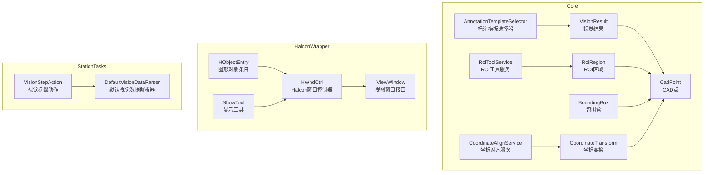
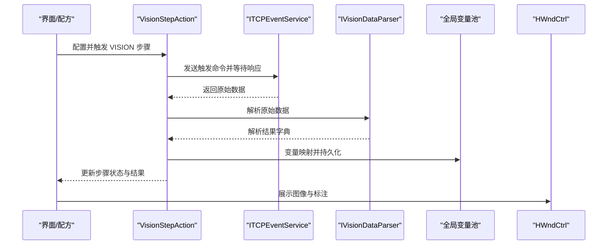
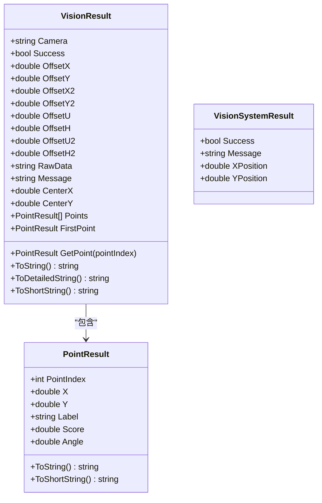
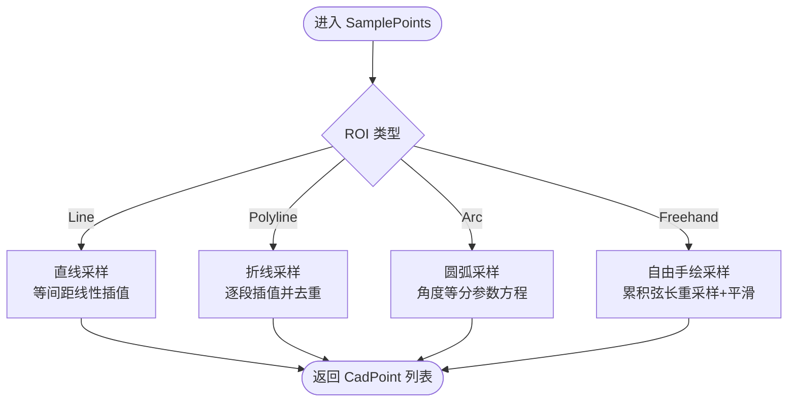
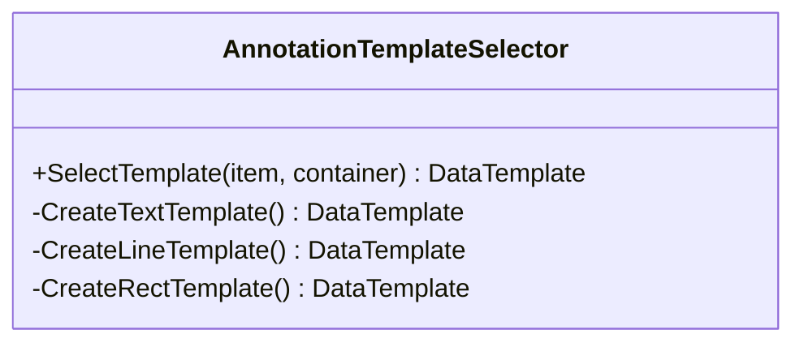
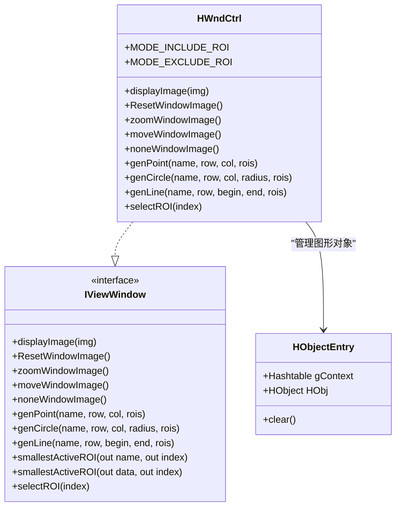
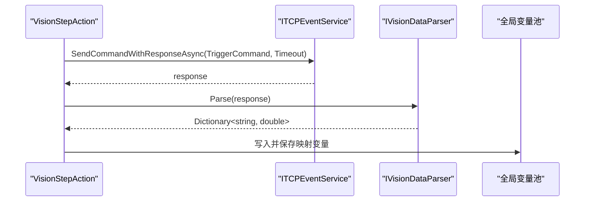
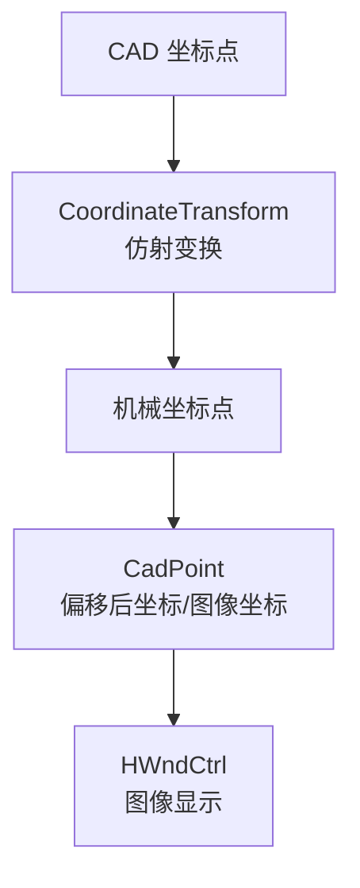
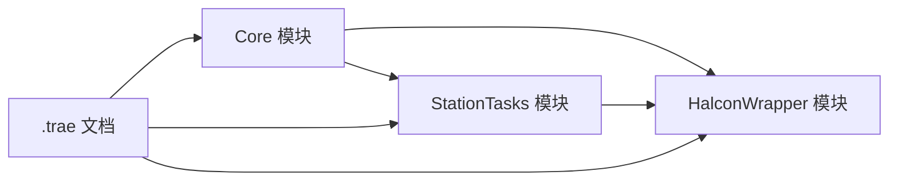

# 视觉检测模型

<cite>
**本文档引用的文件**
- [Core/Models/VisionResult.cs](file://Core/Models/VisionResult.cs)
- [Core/Models/RoiRegion.cs](file://Core/Models/RoiRegion.cs)
- [Core/Models/AnnotationTemplateSelector.cs](file://Core/Models/AnnotationTemplateSelector.cs)
- [Core/Models/BoundingBox.cs](file://Core/Models/BoundingBox.cs)
- [Core/Models/CadPoint.cs](file://Core/Models/CadPoint.cs)
- [Core/Models/CoordinateTransform.cs](file://Core/Models/CoordinateTransform.cs)
- [Core/Services/RoiToolService.cs](file://Core/Services/RoiToolService.cs)
- [Core/Services/CoordinateAlignService.cs](file://Core/Services/CoordinateAlignService.cs)
- [HalconWrapper/Model/HWndCtrl.cs](file://HalconWrapper/Model/HWndCtrl.cs)
- [HalconWrapper/Model/IViewWindow.cs](file://HalconWrapper/Model/IViewWindow.cs)
- [HalconWrapper/Model/HObjectEntry.cs](file://HalconWrapper/Model/HObjectEntry.cs)
- [HalconWrapper/Config/ShowTool.cs](file://HalconWrapper/Config/ShowTool.cs)
- [StationTasks/Actions/VisionStepAction.cs](file://StationTasks/Actions/VisionStepAction.cs)
- [StationTasks/Services/DefaultVisionDataParser.cs](file://StationTasks/Services/DefaultVisionDataParser.cs)
- [.trae/documents/rename-halcon-project.md](file://.trae/documents/rename-halcon-project.md)
</cite>

## 目录
1. [简介](#简介)
2. [项目结构](#项目结构)
3. [核心组件](#核心组件)
4. [架构总览](#架构总览)
5. [详细组件分析](#详细组件分析)
6. [依赖关系分析](#依赖关系分析)
7. [性能考量](#性能考量)
8. [故障排查指南](#故障排查指南)
9. [结论](#结论)
10. [附录](#附录)

## 简介
本文件面向视觉检测模型的技术文档，围绕 VisionResult、RoiRegion、AnnotationTemplateSelector 等核心模型与服务，系统阐述视觉检测结果的数据结构、ROI 区域定义、标注模板选择机制，并结合 TCPIP 通信与数据解析链路，说明视觉模型在质量检测、定位识别、缺陷分析中的作用。同时提供视觉数据处理、结果解析、可视化展示的实践路径与优化建议。

## 项目结构
本项目采用分层与模块化组织，视觉相关能力主要分布在 Core、HalconWrapper、StationTasks 等模块：
- Core：定义视觉结果、ROI、标注模板、坐标变换、包围盒等基础模型与工具服务
- HalconWrapper：封装 Halcon 图像显示与图形对象管理，支撑可视化与交互
- StationTasks：定义 VISION 步骤动作与数据解析器，打通 TCPIP 通信与全局变量映射

**图表来源**
- [Core/Models/VisionResult.cs:6-113](file://Core/Models/VisionResult.cs#L6-L113)
- [Core/Models/RoiRegion.cs:23-324](file://Core/Models/RoiRegion.cs#L23-L324)
- [Core/Models/AnnotationTemplateSelector.cs:10-83](file://Core/Models/AnnotationTemplateSelector.cs#L10-L83)
- [Core/Models/BoundingBox.cs:7-142](file://Core/Models/BoundingBox.cs#L7-L142)
- [Core/Models/CadPoint.cs:6-103](file://Core/Models/CadPoint.cs#L6-L103)
- [Core/Models/CoordinateTransform.cs:10-185](file://Core/Models/CoordinateTransform.cs#L10-L185)
- [Core/Services/RoiToolService.cs:13-353](file://Core/Services/RoiToolService.cs#L13-L353)
- [Core/Services/CoordinateAlignService.cs:161-189](file://Core/Services/CoordinateAlignService.cs#L161-L189)
- [HalconWrapper/Model/HWndCtrl.cs:27-566](file://HalconWrapper/Model/HWndCtrl.cs#L27-L566)
- [HalconWrapper/Model/IViewWindow.cs:9-25](file://HalconWrapper/Model/IViewWindow.cs#L9-L25)
- [HalconWrapper/Model/HObjectEntry.cs:17-48](file://HalconWrapper/Model/HObjectEntry.cs#L17-L48)
- [HalconWrapper/Config/ShowTool.cs:175-199](file://HalconWrapper/Config/ShowTool.cs#L175-L199)
- [StationTasks/Actions/VisionStepAction.cs:22-222](file://StationTasks/Actions/VisionStepAction.cs#L22-L222)
- [StationTasks/Services/DefaultVisionDataParser.cs:14-134](file://StationTasks/Services/DefaultVisionDataParser.cs#L14-L134)

**章节来源**
- [Core/Models/VisionResult.cs:6-113](file://Core/Models/VisionResult.cs#L6-L113)
- [Core/Models/RoiRegion.cs:23-324](file://Core/Models/RoiRegion.cs#L23-L324)
- [Core/Models/AnnotationTemplateSelector.cs:10-83](file://Core/Models/AnnotationTemplateSelector.cs#L10-L83)
- [Core/Models/BoundingBox.cs:7-142](file://Core/Models/BoundingBox.cs#L7-L142)
- [Core/Models/CadPoint.cs:6-103](file://Core/Models/CadPoint.cs#L6-L103)
- [Core/Models/CoordinateTransform.cs:10-185](file://Core/Models/CoordinateTransform.cs#L10-L185)
- [Core/Services/RoiToolService.cs:13-353](file://Core/Services/RoiToolService.cs#L13-L353)
- [Core/Services/CoordinateAlignService.cs:161-189](file://Core/Services/CoordinateAlignService.cs#L161-L189)
- [HalconWrapper/Model/HWndCtrl.cs:27-566](file://HalconWrapper/Model/HWndCtrl.cs#L27-L566)
- [HalconWrapper/Model/IViewWindow.cs:9-25](file://HalconWrapper/Model/IViewWindow.cs#L9-L25)
- [HalconWrapper/Model/HObjectEntry.cs:17-48](file://HalconWrapper/Model/HObjectEntry.cs#L17-L48)
- [HalconWrapper/Config/ShowTool.cs:175-199](file://HalconWrapper/Config/ShowTool.cs#L175-L199)
- [StationTasks/Actions/VisionStepAction.cs:22-222](file://StationTasks/Actions/VisionStepAction.cs#L22-L222)
- [StationTasks/Services/DefaultVisionDataParser.cs:14-134](file://StationTasks/Services/DefaultVisionDataParser.cs#L14-L134)

## 核心组件
- VisionResult：统一承载相机、检测成功标志、偏移量、中心点、原始数据、消息以及多点检测结果；提供多种字符串表示便于日志与调试。
- RoiRegion：定义 ROI 类型与采样参数，支持直线、折线、圆弧、自由手绘四类几何形态，提供等间距采样与降采样平滑策略。
- AnnotationTemplateSelector：基于 DataTemplateSelector 的标注模板选择器，根据标注类型动态选择文本、线条/箭头、矩形框模板。
- BoundingBox：轴对齐包围盒，用于二维几何范围判断与合并。
- CadPoint：CAD 坐标点模型，支持机械坐标、偏移后坐标、图像行列坐标等属性。
- CoordinateTransform：仿射变换模型，支持平移、旋转、缩放，提供正逆变换矩阵构建。
- RoiToolService：ROI 工具服务，封装 ROI 创建与采样，包含直线、折线、圆弧、自由手绘的采样算法与平滑处理。
- CoordinateAlignService：坐标对齐服务，支持矩阵变换与映射表两种模式，将 CAD 坐标转换为机械坐标。
- HalconWrapper：Halcon 图像显示与图形对象管理，提供窗口控制、图形上下文、对象条目等能力。
- VisionStepAction：VISION 步骤动作，负责通过 TCPIP 发送触发命令、接收响应、解析数据并映射到全局变量。
- DefaultVisionDataParser：默认视觉数据解析器，支持 key=value、key value、纯逗号分隔三种格式解析。

**章节来源**
- [Core/Models/VisionResult.cs:6-113](file://Core/Models/VisionResult.cs#L6-L113)
- [Core/Models/RoiRegion.cs:23-324](file://Core/Models/RoiRegion.cs#L23-L324)
- [Core/Models/AnnotationTemplateSelector.cs:10-83](file://Core/Models/AnnotationTemplateSelector.cs#L10-L83)
- [Core/Models/BoundingBox.cs:7-142](file://Core/Models/BoundingBox.cs#L7-L142)
- [Core/Models/CadPoint.cs:6-103](file://Core/Models/CadPoint.cs#L6-L103)
- [Core/Models/CoordinateTransform.cs:10-185](file://Core/Models/CoordinateTransform.cs#L10-L185)
- [Core/Services/RoiToolService.cs:13-353](file://Core/Services/RoiToolService.cs#L13-L353)
- [Core/Services/CoordinateAlignService.cs:161-189](file://Core/Services/CoordinateAlignService.cs#L161-L189)
- [HalconWrapper/Model/HWndCtrl.cs:27-566](file://HalconWrapper/Model/HWndCtrl.cs#L27-L566)
- [StationTasks/Actions/VisionStepAction.cs:22-222](file://StationTasks/Actions/VisionStepAction.cs#L22-L222)
- [StationTasks/Services/DefaultVisionDataParser.cs:14-134](file://StationTasks/Services/DefaultVisionDataParser.cs#L14-L134)

## 架构总览
视觉检测链路由“采集—处理—解析—映射—可视化”构成，贯穿 Core、HalconWrapper、StationTasks 模块：

**图表来源**
- [StationTasks/Actions/VisionStepAction.cs:46-75](file://StationTasks/Actions/VisionStepAction.cs#L46-L75)
- [StationTasks/Services/DefaultVisionDataParser.cs:27-53](file://StationTasks/Services/DefaultVisionDataParser.cs#L27-L53)
- [HalconWrapper/Model/HWndCtrl.cs:27-566](file://HalconWrapper/Model/HWndCtrl.cs#L27-L566)

## 详细组件分析

### VisionResult：视觉检测结果数据结构
- 字段设计：包含相机标识、成功标志、多组偏移量（含第二组与UV分量）、中心点、原始数据、消息、多点检测结果集合。
- 多点支持：Points 列表支持多点检测，提供便捷访问方法获取首个点或指定索引点。
- 字符串表示：提供简短、摘要、详细等多种 ToString 形态，便于日志与调试。
- 应用场景：质量检测（偏移量对比）、定位识别（中心点与多点坐标）、缺陷分析（消息与原始数据）。

**图表来源**
- [Core/Models/VisionResult.cs:6-113](file://Core/Models/VisionResult.cs#L6-L113)

**章节来源**
- [Core/Models/VisionResult.cs:6-113](file://Core/Models/VisionResult.cs#L6-L113)

### RoiRegion：ROI 区域定义与采样
- ROI 类型：Line、Polyline、Arc、Freehand，分别对应直线、折线、圆弧、自由手绘。
- 采样策略：
  - 直线/折线：按欧氏距离等间距线性插值，折线段间去重端点。
  - 圆弧：按角度等分，参数方程插值。
  - 自由手绘：沿累积弦长等间距重采样，随后移动平均平滑。
- 参数化：采样间距 SamplingPitchMM 控制离散化密度，避免过度采样导致计算开销。
- 与坐标系统：采样结果为 CadPoint 序列，可进一步参与坐标变换与可视化。

**图表来源**
- [Core/Models/RoiRegion.cs:132-306](file://Core/Models/RoiRegion.cs#L132-L306)
- [Core/Services/RoiToolService.cs:77-314](file://Core/Services/RoiToolService.cs#L77-L314)

**章节来源**
- [Core/Models/RoiRegion.cs:23-324](file://Core/Models/RoiRegion.cs#L23-L324)
- [Core/Services/RoiToolService.cs:13-353](file://Core/Services/RoiToolService.cs#L13-L353)

### AnnotationTemplateSelector：标注模板选择机制
- 功能：根据标注对象类型（文本、线条/箭头、矩形框）返回对应 DataTemplate。
- 绑定：文本模板绑定 Text、Canvas 位置与颜色；线条模板组合 Line 与 Text；矩形模板绑定 Fill 与 Stroke。
- 用途：在 Halcon 可视化界面中渲染标注，提升结果可读性与一致性。

**图表来源**
- [Core/Models/AnnotationTemplateSelector.cs:10-83](file://Core/Models/AnnotationTemplateSelector.cs#L10-L83)

**章节来源**
- [Core/Models/AnnotationTemplateSelector.cs:10-83](file://Core/Models/AnnotationTemplateSelector.cs#L10-L83)

### HalconWrapper：图像显示与图形对象管理
- HWndCtrl：封装 Halcon 窗口，支持移动、缩放、图形栈管理与图形上下文切换。
- IViewWindow：定义图像显示、窗口操作与 ROI 生成接口。
- HObjectEntry：将 Halcon 对象与其图形上下文关联，便于统一渲染。
- ShowTool：提供文本与矩形框显示工具，支持阴影与颜色配置。

**图表来源**
- [HalconWrapper/Model/HWndCtrl.cs:27-566](file://HalconWrapper/Model/HWndCtrl.cs#L27-L566)
- [HalconWrapper/Model/IViewWindow.cs:9-25](file://HalconWrapper/Model/IViewWindow.cs#L9-L25)
- [HalconWrapper/Model/HObjectEntry.cs:17-48](file://HalconWrapper/Model/HObjectEntry.cs#L17-L48)
- [HalconWrapper/Config/ShowTool.cs:175-199](file://HalconWrapper/Config/ShowTool.cs#L175-L199)

**章节来源**
- [HalconWrapper/Model/HWndCtrl.cs:27-566](file://HalconWrapper/Model/HWndCtrl.cs#L27-L566)
- [HalconWrapper/Model/IViewWindow.cs:9-25](file://HalconWrapper/Model/IViewWindow.cs#L9-L25)
- [HalconWrapper/Model/HObjectEntry.cs:17-48](file://HalconWrapper/Model/HObjectEntry.cs#L17-L48)
- [HalconWrapper/Config/ShowTool.cs:175-199](file://HalconWrapper/Config/ShowTool.cs#L175-L199)

### TCPIP 与数据解析：从视觉系统到全局变量
- VisionStepAction：执行 VISION 步骤，发送触发命令、接收响应、解析数据、映射全局变量，并处理超时与异常。
- DefaultVisionDataParser：支持 key=value、key value、纯逗号分隔三种格式，具备默认键名映射与容错日志。
- 变量映射：将解析结果写入全局变量池并持久化，便于后续流程使用。

**图表来源**
- [StationTasks/Actions/VisionStepAction.cs:81-143](file://StationTasks/Actions/VisionStepAction.cs#L81-L143)
- [StationTasks/Actions/VisionStepAction.cs:148-172](file://StationTasks/Actions/VisionStepAction.cs#L148-L172)
- [StationTasks/Actions/VisionStepAction.cs:177-220](file://StationTasks/Actions/VisionStepAction.cs#L177-L220)
- [StationTasks/Services/DefaultVisionDataParser.cs:27-53](file://StationTasks/Services/DefaultVisionDataParser.cs#L27-L53)

**章节来源**
- [StationTasks/Actions/VisionStepAction.cs:22-222](file://StationTasks/Actions/VisionStepAction.cs#L22-L222)
- [StationTasks/Services/DefaultVisionDataParser.cs:14-134](file://StationTasks/Services/DefaultVisionDataParser.cs#L14-L134)

### 坐标系统与可视化：从 CAD 到机械再到图像
- CoordinateTransform：仿射变换（平移+旋转+缩放），提供正逆变换矩阵构建，支持从 CAD 坐标到机械坐标的转换。
- CoordinateAlignService：坐标对齐服务，支持矩阵变换与映射表两种模式，将 CAD 坐标转换为机械坐标。
- CadPoint：包含机械坐标、偏移后坐标、图像行列坐标等，支撑 Halcon 图像与 CAD 坐标之间的映射。
- BoundingBox：包围盒用于范围判断与合并，辅助 ROI 与标注的可视范围控制。

**图表来源**
- [Core/Models/CoordinateTransform.cs:68-182](file://Core/Models/CoordinateTransform.cs#L68-L182)
- [Core/Services/CoordinateAlignService.cs:169-189](file://Core/Services/CoordinateAlignService.cs#L169-L189)
- [Core/Models/CadPoint.cs:49-82](file://Core/Models/CadPoint.cs#L49-L82)
- [HalconWrapper/Model/HWndCtrl.cs:27-566](file://HalconWrapper/Model/HWndCtrl.cs#L27-L566)

**章节来源**
- [Core/Models/CoordinateTransform.cs:10-185](file://Core/Models/CoordinateTransform.cs#L10-L185)
- [Core/Services/CoordinateAlignService.cs:161-189](file://Core/Services/CoordinateAlignService.cs#L161-L189)
- [Core/Models/CadPoint.cs:6-103](file://Core/Models/CadPoint.cs#L6-L103)
- [Core/Models/BoundingBox.cs:7-142](file://Core/Models/BoundingBox.cs#L7-L142)

## 依赖关系分析
- Core 模块内聚：VisionResult、RoiRegion、AnnotationTemplateSelector、BoundingBox、CadPoint、CoordinateTransform、RoiToolService、CoordinateAlignService 组成视觉与坐标处理的核心层。
- HalconWrapper 与 Core 解耦：HalconWrapper 提供显示与图形对象管理，Core 负责业务模型与解析，二者通过接口与事件解耦。
- StationTasks 依赖 Core 与 HalconWrapper：VisionStepAction 依赖 TCPIP 服务与解析器，最终调用 Halcon 显示结果。
- 重命名 Halcon 项目：避免与原生 halcon.dll 冲突，统一命名空间与输出，减少运行时加载问题。

**图表来源**
- [.trae/documents/rename-halcon-project.md:1-23](file://.trae/documents/rename-halcon-project.md#L1-L23)

**章节来源**
- [.trae/documents/rename-halcon-project.md:1-23](file://.trae/documents/rename-halcon-project.md#L1-L23)

## 性能考量
- ROI 采样优化
  - 合理设置 SamplingPitchMM：过大导致离散不足，过小增加计算与存储开销。建议结合相机分辨率与目标尺寸确定。
  - 自由手绘采样：先重采样再平滑，可降低高频抖动带来的后续处理成本。
- 坐标变换
  - 优先使用矩阵变换而非逐点映射，减少循环开销；批量处理时复用变换矩阵。
- 数据解析
  - 默认解析器按优先级尝试三种格式，建议在视觉系统侧统一输出格式，减少解析分支判断。
- 可视化
  - Halcon 显示时尽量减少频繁刷新，合并图形对象更新；必要时启用双缓冲与延迟刷新。
- TCPIP 通信
  - 设置合理超时与重试策略，避免长时间阻塞；对大包数据分片传输并校验完整性。

## 故障排查指南
- Halcon 窗口初始化错误
  - 由于项目中存在与原生 halcon.dll 同名的输出，可能导致加载冲突。建议参考重命名文档，将 Halcon 项目重命名为 HalconWrapper，避免命名冲突。
- 视觉数据解析失败
  - 检查原始数据格式是否符合默认解析器支持的三种格式；若使用自定义脚本，确认脚本语法与编译通过。
- VISION 步骤超时
  - 检查触发命令是否正确、连接名称是否存在、响应超时是否过短；必要时增加超时时间或优化视觉系统响应速度。
- ROI 采样异常
  - 确认 ROI 类型与参数有效（如圆弧半径、折线顶点数量）；检查采样间距是否合理。

**章节来源**
- [.trae/documents/rename-halcon-project.md:1-23](file://.trae/documents/rename-halcon-project.md#L1-L23)
- [StationTasks/Actions/VisionStepAction.cs:115-140](file://StationTasks/Actions/VisionStepAction.cs#L115-L140)
- [StationTasks/Services/DefaultVisionDataParser.cs:51-53](file://StationTasks/Services/DefaultVisionDataParser.cs#L51-L53)
- [Core/Services/RoiToolService.cs:79-96](file://Core/Services/RoiToolService.cs#L79-L96)

## 结论
本视觉检测模型通过 VisionResult、RoiRegion、AnnotationTemplateSelector 等核心组件，构建了从数据采集、ROI 采样、坐标变换到可视化与 TCPIP 数据解析的完整链路。配合 HalconWrapper 的图像显示能力与 StationTasks 的步骤动作，实现了质量检测、定位识别与缺陷分析的关键应用场景。通过合理的参数设置、解析策略与可视化模板，可在保证精度的同时提升整体性能与可维护性。

## 附录
- 实际代码示例路径（不含具体代码内容）
  - 视觉结果结构体定义：[Core/Models/VisionResult.cs:6-113](file://Core/Models/VisionResult.cs#L6-L113)
  - ROI 区域与采样算法：[Core/Models/RoiRegion.cs:132-306](file://Core/Models/RoiRegion.cs#L132-L306)、[Core/Services/RoiToolService.cs:77-314](file://Core/Services/RoiToolService.cs#L77-L314)
  - 标注模板选择器：[Core/Models/AnnotationTemplateSelector.cs:21-30](file://Core/Models/AnnotationTemplateSelector.cs#L21-L30)
  - Halcon 可视化与图形对象：[HalconWrapper/Model/HWndCtrl.cs:27-566](file://HalconWrapper/Model/HWndCtrl.cs#L27-L566)、[HalconWrapper/Model/HObjectEntry.cs:17-48](file://HalconWrapper/Model/HObjectEntry.cs#L17-L48)
  - VISION 步骤动作与数据解析：[StationTasks/Actions/VisionStepAction.cs:46-75](file://StationTasks/Actions/VisionStepAction.cs#L46-L75)、[StationTasks/Services/DefaultVisionDataParser.cs:27-53](file://StationTasks/Services/DefaultVisionDataParser.cs#L27-L53)
  - 坐标变换与对齐：[Core/Models/CoordinateTransform.cs:68-182](file://Core/Models/CoordinateTransform.cs#L68-L182)、[Core/Services/CoordinateAlignService.cs:169-189](file://Core/Services/CoordinateAlignService.cs#L169-L189)
  - 包围盒与 CAD 点：[Core/Models/BoundingBox.cs:7-142](file://Core/Models/BoundingBox.cs#L7-L142)、[Core/Models/CadPoint.cs:6-103](file://Core/Models/CadPoint.cs#L6-L103)