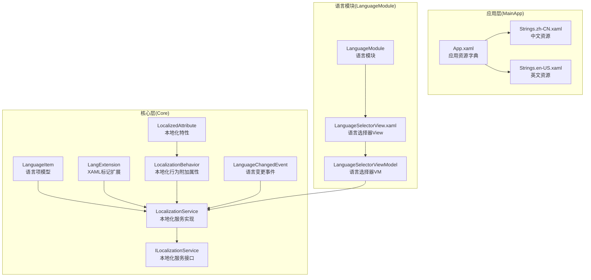
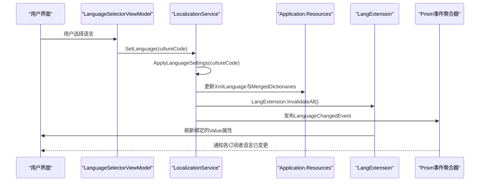
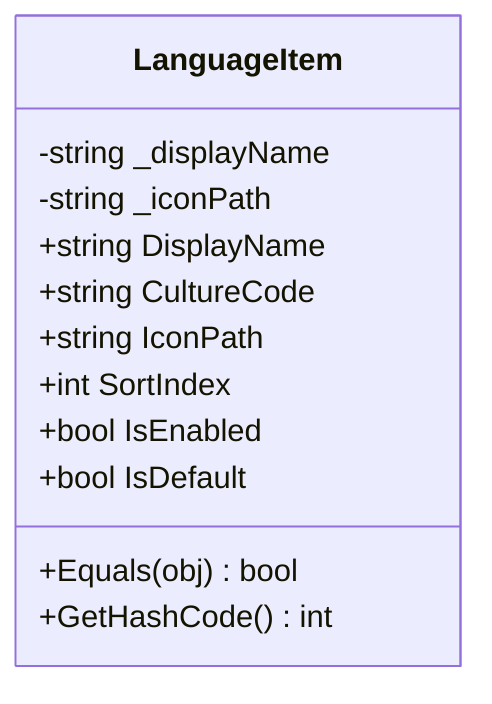
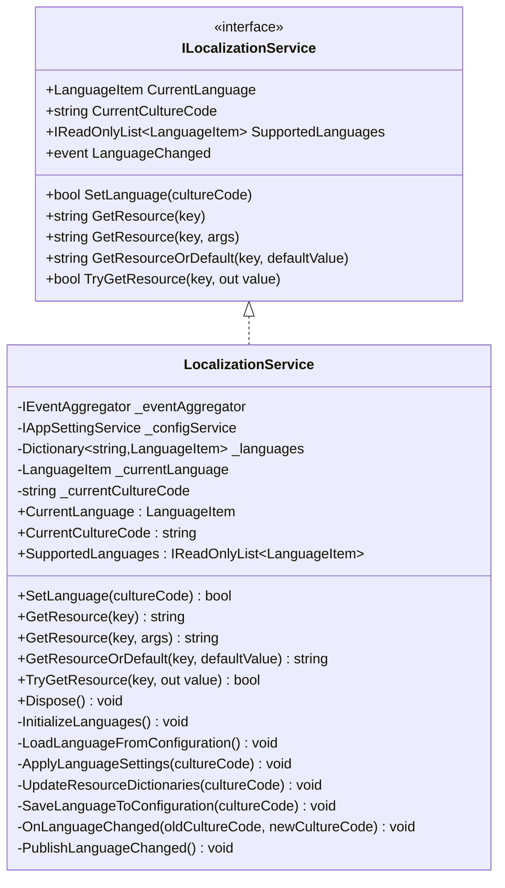
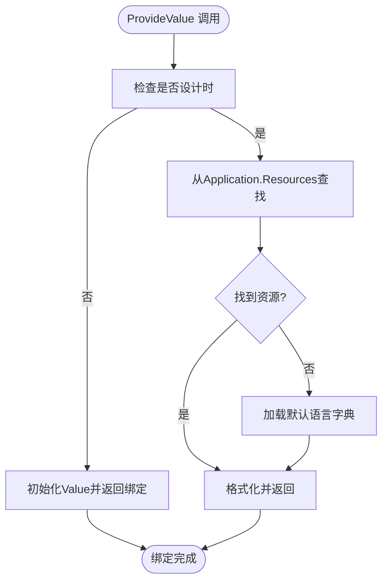
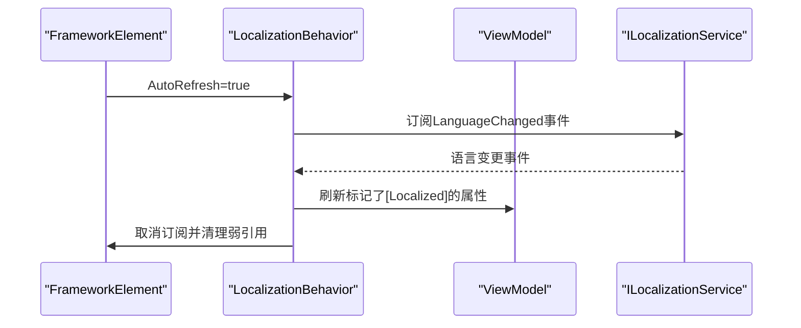
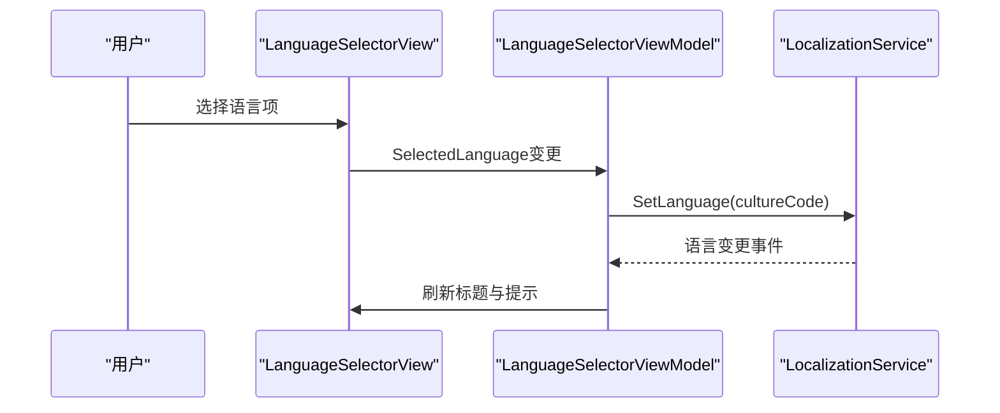
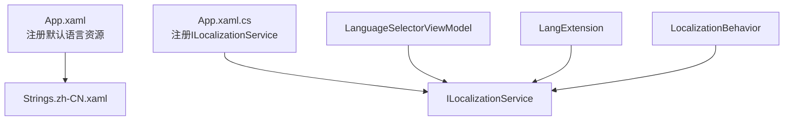

# 语言本地化模型

<cite>
**本文档引用的文件**
- [LanguageItem.cs](file://Core/Models/LanguageItem.cs)
- [LocalizationService.cs](file://Core/Services/LocalizationService.cs)
- [ILocalizationService.cs](file://Core/Abstraction/ILocalizationService.cs)
- [LocalizationConfiguration.cs](file://Core/Services/LocalizationConfiguration.cs)
- [ILocalizationConfiguration.cs](file://Core/Abstraction/ILocalizationConfiguration.cs)
- [LangExtension.cs](file://Core/Markup/LangExtension.cs)
- [LocalizationBehavior.cs](file://Core/Markup/LocalizationBehavior.cs)
- [LanguageChangedEvent.cs](file://Core/Events/LanguageChangedEvent.cs)
- [LocalizedAttribute.cs](file://Core/Attributes/LocalizedAttribute.cs)
- [LanguageSelectorViewModel.cs](file://LanguageModule/ViewModels/LanguageSelectorViewModel.cs)
- [LanguageSelectorView.xaml](file://LanguageModule/Views/LanguageSelectorView.xaml)
- [LanguageModule.cs](file://LanguageModule/LanguageModule.cs)
- [Strings.zh-CN.xaml](file://MainApp/Languages/Strings.zh-CN.xaml)
- [Strings.en-US.xaml](file://MainApp/Languages/Strings.en-US.xaml)
- [App.xaml](file://MainApp/App.xaml)
- [App.xaml.cs](file://MainApp/App.xaml.cs)
</cite>

## 目录
1. [简介](#简介)
2. [项目结构](#项目结构)
3. [核心组件](#核心组件)
4. [架构概览](#架构概览)
5. [详细组件分析](#详细组件分析)
6. [依赖关系分析](#依赖关系分析)
7. [性能考虑](#性能考虑)
8. [故障排除指南](#故障排除指南)
9. [结论](#结论)
10. [附录](#附录)

## 简介
本文件全面解析该代码库中的语言本地化模型，重点围绕 LanguageItem 本地化模型的设计原理与多语言支持应用展开。文档详细阐述语言资源管理、本地化键值映射、动态语言切换机制，并说明本地化模型在用户界面、消息提示、系统配置中的重要作用。同时提供多语言资源的添加、切换、更新的实际代码示例，涵盖资源文件管理、翻译键值设计、语言包扩展和国际化最佳实践。

## 项目结构
本地化系统采用分层架构，核心位于 Core 模块，UI 交互位于 LanguageModule，资源文件位于 MainApp/Languages。关键文件包括：
- 核心模型与服务：LanguageItem、LocalizationService、ILocalizationService
- XAML 标记扩展：LangExtension
- 视图模型与视图：LanguageSelectorViewModel、LanguageSelectorView
- 事件与特性：LanguageChangedEvent、LocalizedAttribute
- 资源字典：Strings.zh-CN.xaml、Strings.en-US.xaml
- 应用入口：App.xaml、App.xaml.cs

**图表来源**
- [LanguageItem.cs:1-88](file://Core/Models/LanguageItem.cs#L1-L88)
- [LocalizationService.cs:1-353](file://Core/Services/LocalizationService.cs#L1-L353)
- [ILocalizationService.cs:1-108](file://Core/Abstraction/ILocalizationService.cs#L1-L108)
- [LangExtension.cs:1-242](file://Core/Markup/LangExtension.cs#L1-L242)
- [LocalizationBehavior.cs:1-238](file://Core/Markup/LocalizationBehavior.cs#L1-L238)
- [LocalizedAttribute.cs:1-28](file://Core/Attributes/LocalizedAttribute.cs#L1-L28)
- [LanguageChangedEvent.cs:1-64](file://Core/Events/LanguageChangedEvent.cs#L1-L64)
- [App.xaml:1-50](file://MainApp/App.xaml#L1-L50)
- [Strings.zh-CN.xaml:1-200](file://MainApp/Languages/Strings.zh-CN.xaml#L1-L200)
- [Strings.en-US.xaml:1-200](file://MainApp/Languages/Strings.en-US.xaml#L1-L200)
- [LanguageSelectorViewModel.cs:1-90](file://LanguageModule/ViewModels/LanguageSelectorViewModel.cs#L1-L90)
- [LanguageSelectorView.xaml:1-31](file://LanguageModule/Views/LanguageSelectorView.xaml#L1-L31)
- [LanguageModule.cs:1-25](file://LanguageModule/LanguageModule.cs#L1-L25)

**章节来源**
- [App.xaml:1-50](file://MainApp/App.xaml#L1-L50)
- [App.xaml.cs:110-133](file://MainApp/App.xaml.cs#L110-L133)
- [LanguageModule.cs:1-25](file://LanguageModule/LanguageModule.cs#L1-L25)

## 核心组件
本节深入分析本地化系统的核心组件及其职责与交互关系。

- LanguageItem：语言项模型，封装显示名称、区域性代码、图标路径、排序索引、启用状态与默认状态等属性，支持 INotifyPropertyChanged 以便 UI 绑定。
- LocalizationService：本地化服务实现，负责语言列表初始化、从配置加载语言、应用语言设置、替换资源字典、发布语言变更事件、资源字符串获取等。
- ILocalizationService：本地化服务接口，定义当前语言、支持语言列表、设置语言、资源获取等契约。
- LangExtension：WPF 标记扩展，替代 DynamicResource 实现语言本地化绑定；运行时通过 Binding 绑定 Value 属性，语言切换时调用 InvalidateAll() 刷新所有实例。
- LocalizationBehavior：本地化行为附加属性，语言切换时自动刷新 ViewModel 中标记了 [Localized] 特性的属性。
- LocalizedAttribute：标记需要本地化的属性，支持资源键与格式化参数属性名。
- LanguageChangedEvent：语言变更事件（Prism 事件聚合器），用于跨模块通信。
- LanguageSelectorViewModel/View：语言选择器视图模型与视图，提供语言切换 UI 交互。

**章节来源**
- [LanguageItem.cs:1-88](file://Core/Models/LanguageItem.cs#L1-L88)
- [LocalizationService.cs:1-353](file://Core/Services/LocalizationService.cs#L1-L353)
- [ILocalizationService.cs:1-108](file://Core/Abstraction/ILocalizationService.cs#L1-L108)
- [LangExtension.cs:1-242](file://Core/Markup/LangExtension.cs#L1-L242)
- [LocalizationBehavior.cs:1-238](file://Core/Markup/LocalizationBehavior.cs#L1-L238)
- [LocalizedAttribute.cs:1-28](file://Core/Attributes/LocalizedAttribute.cs#L1-L28)
- [LanguageChangedEvent.cs:1-64](file://Core/Events/LanguageChangedEvent.cs#L1-L64)
- [LanguageSelectorViewModel.cs:1-90](file://LanguageModule/ViewModels/LanguageSelectorViewModel.cs#L1-L90)
- [LanguageSelectorView.xaml:1-31](file://LanguageModule/Views/LanguageSelectorView.xaml#L1-L31)

## 架构概览
本地化系统采用“服务驱动 + XAML 扩展 + 事件广播”的架构模式：
- 服务层：LocalizationService 管理语言状态与资源字典切换。
- 标记扩展层：LangExtension 提供 XAML 绑定能力，支持设计时与运行时不同行为。
- 行为层：LocalizationBehavior 自动刷新 ViewModel 中的本地化属性。
- 事件层：LanguageChangedEvent 通过 Prism 事件聚合器广播语言变更。
- 资源层：MainApp/Languages 下的 XAML 资源字典提供键值映射。

**图表来源**
- [LanguageSelectorViewModel.cs:26-36](file://LanguageModule/ViewModels/LanguageSelectorViewModel.cs#L26-L36)
- [LocalizationService.cs:129-161](file://Core/Services/LocalizationService.cs#L129-L161)
- [LocalizationService.cs:166-198](file://Core/Services/LocalizationService.cs#L166-L198)
- [LangExtension.cs:149-159](file://Core/Markup/LangExtension.cs#L149-L159)
- [LanguageChangedEvent.cs:8-63](file://Core/Events/LanguageChangedEvent.cs#L8-L63)

## 详细组件分析

### LanguageItem 分析
LanguageItem 是语言项的轻量级模型，具备以下特点：
- 支持显示名称、区域性代码、图标路径、排序索引、启用状态与默认状态。
- 实现 INotifyPropertyChanged，便于 UI 数据绑定。
- 重写 Equals/GetHashCode，基于 CultureCode 进行相等性判断。

**图表来源**
- [LanguageItem.cs:9-87](file://Core/Models/LanguageItem.cs#L9-L87)

**章节来源**
- [LanguageItem.cs:1-88](file://Core/Models/LanguageItem.cs#L1-L88)

### LocalizationService 分析
LocalizationService 是本地化系统的核心，负责：
- 初始化支持的语言列表（默认包含中文与英文）。
- 从配置服务加载上次选择的语言，若无效则回退到系统语言或默认语言。
- 应用语言设置：更新线程区域性、设置 WPF XmlLanguage、替换 MergedDictionaries 中的语言资源字典。
- 提供资源字符串获取方法（GetResource、GetResourceOrDefault、TryGetResource）。
- 发布语言变更事件（ILocalizationService.LanguageChanged 与 Prism LanguageChangedEvent）。

**图表来源**
- [ILocalizationService.cs:10-69](file://Core/Abstraction/ILocalizationService.cs#L10-L69)
- [LocalizationService.cs:18-351](file://Core/Services/LocalizationService.cs#L18-L351)

**章节来源**
- [LocalizationService.cs:68-124](file://Core/Services/LocalizationService.cs#L68-L124)
- [LocalizationService.cs:166-251](file://Core/Services/LocalizationService.cs#L166-L251)
- [LocalizationService.cs:256-324](file://Core/Services/LocalizationService.cs#L256-L324)
- [LocalizationService.cs:329-341](file://Core/Services/LocalizationService.cs#L329-L341)

### LangExtension 分析
LangExtension 提供 XAML 绑定能力，支持设计时与运行时的不同行为：
- 设计时：直接从 Application.Resources 或默认语言资源字典获取翻译文本。
- 运行时：返回绑定到 Value 属性的 OneWay Binding，通过 InvalidateAll() 在语言切换时刷新。
- 优先从 XAML 资源字典查找，否则通过 ILocalizationService 获取。
- 支持格式化参数 Args。

**图表来源**
- [LangExtension.cs:102-144](file://Core/Markup/LangExtension.cs#L102-L144)
- [LangExtension.cs:164-203](file://Core/Markup/LangExtension.cs#L164-L203)

**章节来源**
- [LangExtension.cs:102-144](file://Core/Markup/LangExtension.cs#L102-L144)
- [LangExtension.cs:149-159](file://Core/Markup/LangExtension.cs#L149-L159)
- [LangExtension.cs:164-203](file://Core/Markup/LangExtension.cs#L164-L203)

### LocalizationBehavior 分析
LocalizationBehavior 提供 AutoRefresh 附加属性，实现语言切换时自动刷新 ViewModel 中标记了 [Localized] 特性的属性：
- 通过 ConditionalWeakTable 弱引用 FrameworkElement 与其事件处理器，避免内存泄漏。
- 缓存 ViewModel 类型中标记了 [Localized] 特性的属性信息，避免重复反射。
- 优先通过 Prism BindableBase 的 RaisePropertyChanged 方法通知属性变更，其次通过 INotifyPropertyChanged.PropertyChanged 事件触发。

**图表来源**
- [LocalizationBehavior.cs:61-81](file://Core/Markup/LocalizationBehavior.cs#L61-L81)
- [LocalizationBehavior.cs:113-143](file://Core/Markup/LocalizationBehavior.cs#L113-L143)
- [LocalizationBehavior.cs:174-235](file://Core/Markup/LocalizationBehavior.cs#L174-L235)

**章节来源**
- [LocalizationBehavior.cs:25-32](file://Core/Markup/LocalizationBehavior.cs#L25-L32)
- [LocalizationBehavior.cs:113-143](file://Core/Markup/LocalizationBehavior.cs#L113-L143)
- [LocalizationBehavior.cs:174-235](file://Core/Markup/LocalizationBehavior.cs#L174-L235)

### 语言选择器组件分析
语言选择器提供用户界面进行语言切换：
- LanguageSelectorViewModel：绑定支持的语言列表与当前语言，响应语言变更事件刷新 UI 标题与提示。
- LanguageSelectorView：ComboBox 控件展示语言列表，SelectedItem 绑定到 SelectedLanguage。
- LanguageModule：注册语言选择器视图与视图模型的导航。

**图表来源**
- [LanguageSelectorView.xaml:22-29](file://LanguageModule/Views/LanguageSelectorView.xaml#L22-L29)
- [LanguageSelectorViewModel.cs:26-36](file://LanguageModule/ViewModels/LanguageSelectorViewModel.cs#L26-L36)
- [LanguageSelectorViewModel.cs:77-87](file://LanguageModule/ViewModels/LanguageSelectorViewModel.cs#L77-L87)
- [LanguageModule.cs:19-23](file://LanguageModule/LanguageModule.cs#L19-L23)

**章节来源**
- [LanguageSelectorViewModel.cs:13-90](file://LanguageModule/ViewModels/LanguageSelectorViewModel.cs#L13-L90)
- [LanguageSelectorView.xaml:1-31](file://LanguageModule/Views/LanguageSelectorView.xaml#L1-L31)
- [LanguageModule.cs:1-25](file://LanguageModule/LanguageModule.cs#L1-L25)

## 依赖关系分析
本地化系统的依赖关系如下：
- App.xaml 注册默认语言资源字典（Strings.zh-CN.xaml），确保设计时可见。
- App.xaml.cs 注册 ILocalizationService 单例，供 DI 容器解析。
- LanguageSelectorViewModel 依赖 ILocalizationService 进行语言切换。
- LangExtension 通过容器解析 ILocalizationService 获取资源。
- LocalizationBehavior 通过容器解析 ILocalizationService 订阅语言变更事件。

**图表来源**
- [App.xaml:36-44](file://MainApp/App.xaml#L36-L44)
- [App.xaml.cs:121-133](file://MainApp/App.xaml.cs#L121-L133)
- [LanguageSelectorViewModel.cs:15-16](file://LanguageModule/ViewModels/LanguageSelectorViewModel.cs#L15-L16)
- [LangExtension.cs:183-184](file://Core/Markup/LangExtension.cs#L183-L184)
- [LocalizationBehavior.cs:118-122](file://Core/Markup/LocalizationBehavior.cs#L118-L122)

**章节来源**
- [App.xaml:1-50](file://MainApp/App.xaml#L1-L50)
- [App.xaml.cs:110-133](file://MainApp/App.xaml.cs#L110-L133)

## 性能考虑
- 资源字典切换：LocalizationService 在 UI 线程上替换 MergedDictionaries，避免阻塞主线程。
- 弱引用实例：LangExtension 使用弱引用列表存储实例，避免内存泄漏。
- 反射缓存：LocalizationBehavior 缓存 ViewModel 类型的 [Localized] 属性信息，减少反射开销。
- 事件订阅：LocalizationBehavior 使用 ConditionalWeakTable 管理事件订阅，元素回收时自动清理。
- 设计时优化：LangExtension 在设计时直接查找资源，避免运行时绑定开销。

## 故障排除指南
常见问题与解决建议：
- 语言切换后 UI 未刷新：检查 LangExtension.InvalidateAll() 是否被调用，确认 XAML 中使用了 lang:Lang 标记扩展。
- 资源键缺失：LocalizationService.GetResource 返回 [key] 格式，检查资源字典中是否存在对应键。
- 事件未触发：确认 ILocalizationService.LanguageChanged 与 Prism LanguageChangedEvent 是否正确发布。
- 配置加载失败：LocalizationService.LoadLanguageFromConfiguration 捕获异常并回退到默认语言，检查配置服务设置。
- ViewModel 属性未刷新：确认属性标记了 [Localized] 特性且实现了 INotifyPropertyChanged。

**章节来源**
- [LocalizationService.cs:118-124](file://Core/Services/LocalizationService.cs#L118-L124)
- [LocalizationService.cs:256-270](file://Core/Services/LocalizationService.cs#L256-L270)
- [LocalizationService.cs:329-341](file://Core/Services/LocalizationService.cs#L329-L341)
- [LangExtension.cs:196-203](file://Core/Markup/LangExtension.cs#L196-L203)
- [LocalizationBehavior.cs:174-235](file://Core/Markup/LocalizationBehavior.cs#L174-L235)

## 结论
该本地化模型通过 LanguageItem、LocalizationService、LangExtension、LocalizationBehavior 等组件协同工作，实现了高效、灵活的多语言支持。其设计遵循单一职责原则，依赖注入清晰，事件驱动广播语言变更，XAML 标记扩展简化了资源绑定，行为附加属性提升了 ViewModel 的自动化刷新能力。配合 MainApp/Languages 下的资源字典，系统能够轻松扩展新的语言包并保持良好的用户体验。

## 附录

### 多语言资源添加与更新
- 添加新语言包：在 MainApp/Languages 下创建 Strings.{culture}.xaml，例如 Strings.es-ES.xaml。
- 更新资源键：确保资源字典中包含完整的键值对，避免出现 [key] 形式的占位符。
- 验证资源：通过 LocalizationService.GetResource(key) 测试资源键的有效性。

**章节来源**
- [Strings.zh-CN.xaml:1-200](file://MainApp/Languages/Strings.zh-CN.xaml#L1-L200)
- [Strings.en-US.xaml:1-200](file://MainApp/Languages/Strings.en-US.xaml#L1-L200)
- [LocalizationService.cs:256-270](file://Core/Services/LocalizationService.cs#L256-L270)

### 翻译键值设计建议
- 键名规范：使用语义化命名，如 "AssemblyStep_Button_StartAssembly"，避免使用纯英文单词。
- 值内容：保持简洁明了，避免嵌入硬编码的特殊字符。
- 参数化：使用格式化参数（Args）处理动态内容，如数量、时间等。

**章节来源**
- [LangExtension.cs:208-223](file://Core/Markup/LangExtension.cs#L208-L223)

### 语言包扩展与国际化最佳实践
- 默认语言：确保默认语言资源字典（如 zh-CN）完整覆盖所有 UI 文本。
- 回退策略：当资源字典未找到时，LangExtension 会尝试通过 ILocalizationService 获取资源，最后回退到 [key]。
- 事件一致性：通过 Prism 事件聚合器发布语言变更，确保跨模块一致性。
- 配置持久化：语言设置保存到配置服务，应用重启后自动恢复。

**章节来源**
- [LangExtension.cs:178-194](file://Core/Markup/LangExtension.cs#L178-L194)
- [LocalizationService.cs:235-251](file://Core/Services/LocalizationService.cs#L235-L251)
- [LanguageChangedEvent.cs:8-63](file://Core/Events/LanguageChangedEvent.cs#L8-L63)