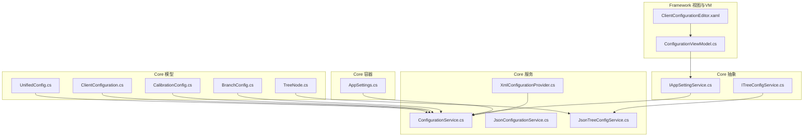
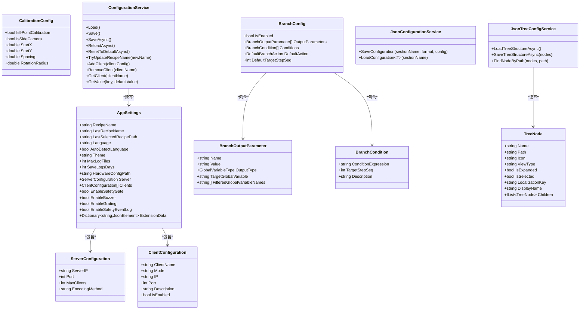
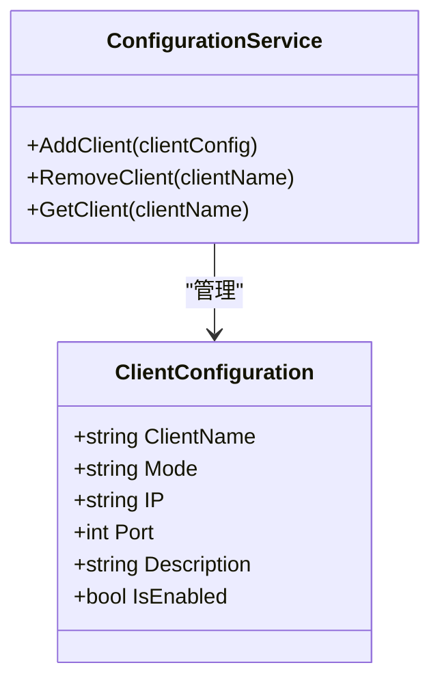
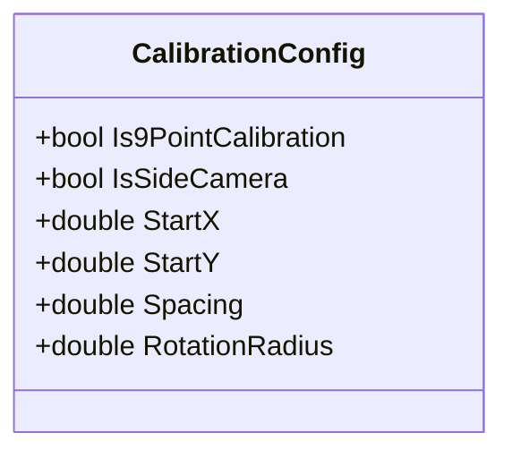
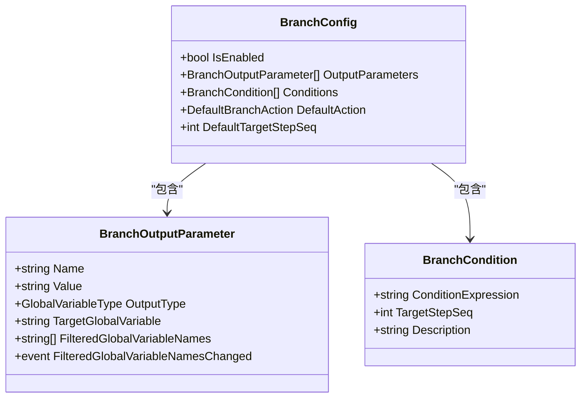
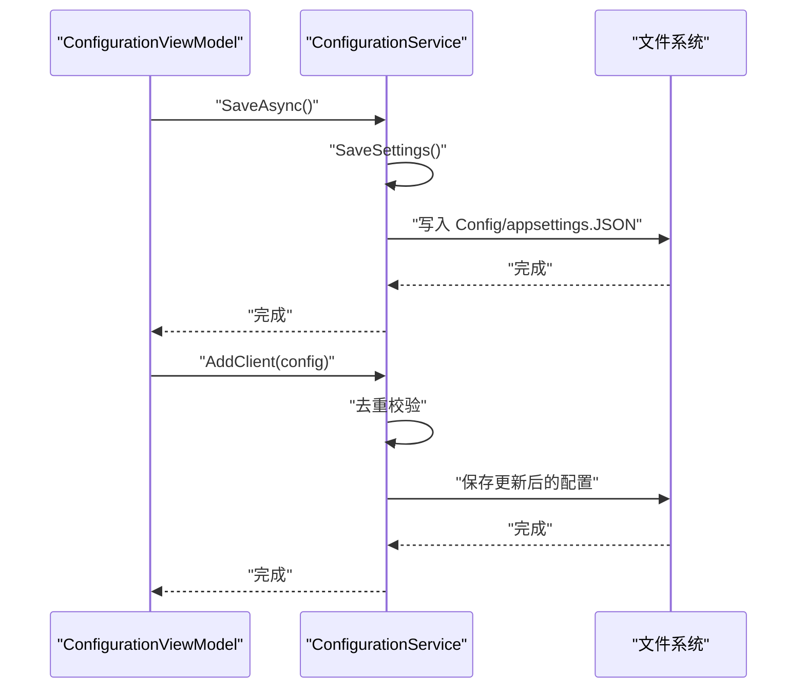
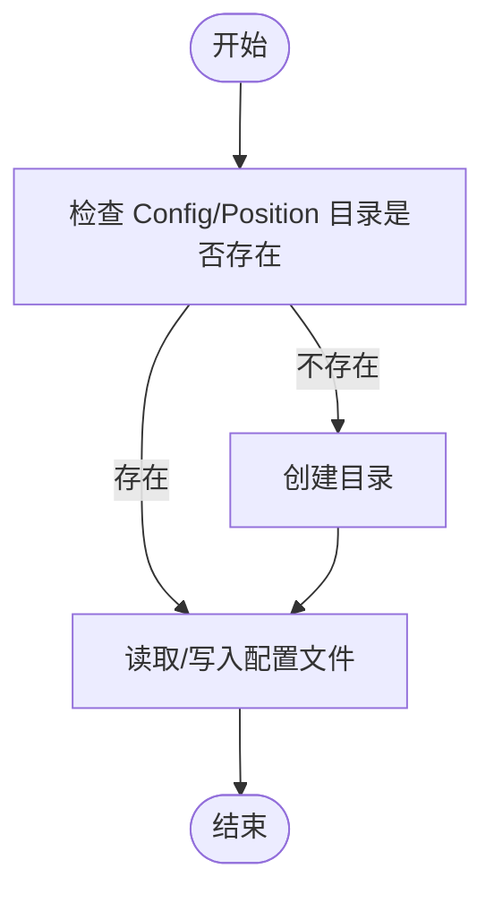
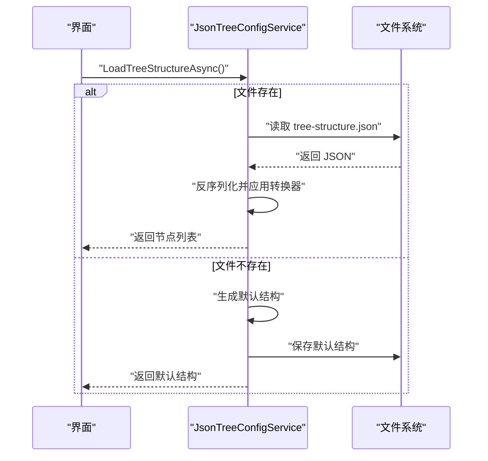
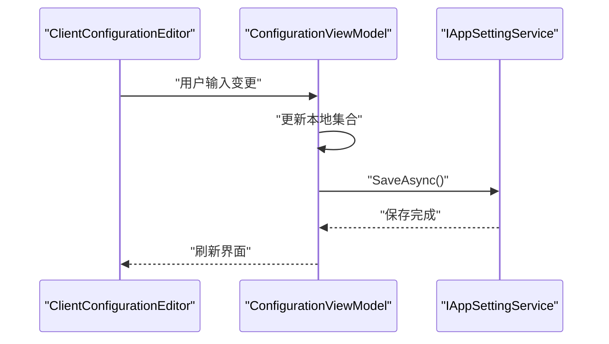
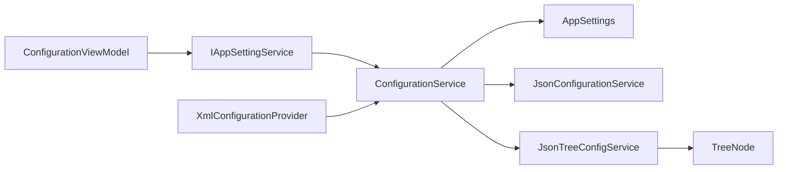

# 配置管理模型

<cite>
**本文档引用的文件**
- [UnifiedConfig.cs](file://Core/Models/UnifiedConfig.cs)
- [ClientConfiguration.cs](file://Core/Models/ClientConfiguration.cs)
- [CalibrationConfig.cs](file://Core/Models/CalibrationConfig.cs)
- [BranchConfig.cs](file://Core/Models/BranchConfig.cs)
- [ConfigurationService.cs](file://Core/Services/ConfigurationService.cs)
- [AppSettings.cs](file://Core/Configuration/AppSettings.cs)
- [IAppSettingService.cs](file://Core/Abstraction/IAppSettingService.cs)
- [JsonConfigurationService.cs](file://Core/Services/JsonConfigurationService.cs)
- [JsonTreeConfigService.cs](file://Core/Services/JsonTreeConfigService.cs)
- [ITreeConfigService.cs](file://Core/Abstraction/ITreeConfigService.cs)
- [TreeNode.cs](file://Core/Models/TreeNode.cs)
- [XmlConfigurationProvider.cs](file://Core/XmlConfigurationProvider.cs)
- [ConfigurationViewModel.cs](file://Framework/ViewModels/ConfigurationViewModel.cs)
- [ClientConfigurationEditor.xaml](file://Framework/Views/ClientConfigurationEditor.xaml)
</cite>

## 目录
1. [简介](#简介)
2. [项目结构](#项目结构)
3. [核心组件](#核心组件)
4. [架构总览](#架构总览)
5. [详细组件分析](#详细组件分析)
6. [依赖关系分析](#依赖关系分析)
7. [性能考虑](#性能考虑)
8. [故障排查指南](#故障排查指南)
9. [结论](#结论)
10. [附录](#附录)

## 简介
本文件围绕配置管理模型进行系统性技术文档梳理，重点解析以下配置模型与服务：
- 统一配置模型：UnifiedConfig（占位/扩展点）
- 客户端配置模型：ClientConfiguration
- 校准配置模型：CalibrationConfig
- 分支配置模型：BranchConfig
- 配置服务层：ConfigurationService、JsonConfigurationService、JsonTreeConfigService
- 配置抽象接口：IAppSettingService、ITreeConfigService
- 配置数据容器：AppSettings
- 配置迁移与回退：XmlConfigurationProvider
- 配置界面与视图模型：ConfigurationViewModel、ClientConfigurationEditor

文档将从系统配置层次结构、配置项分类管理、持久化机制、校准参数与分支配置的作用、以及配置的创建、更新、验证与应用等方面展开，并给出版本管理、默认值处理、迁移与故障恢复策略。

## 项目结构
配置相关代码主要分布在 Core 模块（模型、抽象、服务、配置容器）与 Framework 模块（配置界面与视图模型）。整体采用“模型-服务-抽象接口-容器”的分层设计，配合 JSON 文件持久化与 XML 兼容迁移能力，形成可扩展、可维护的配置管理体系。

**图表来源**
- [ConfigurationService.cs:1-220](file://Core/Services/ConfigurationService.cs#L1-L220)
- [AppSettings.cs:1-39](file://Core/Configuration/AppSettings.cs#L1-L39)
- [IAppSettingService.cs:1-51](file://Core/Abstraction/IAppSettingService.cs#L1-L51)
- [JsonTreeConfigService.cs:1-147](file://Core/Services/JsonTreeConfigService.cs#L1-L147)
- [ITreeConfigService.cs:1-12](file://Core/Abstraction/ITreeConfigService.cs#L1-L12)
- [TreeNode.cs:1-113](file://Core/Models/TreeNode.cs#L1-L113)
- [XmlConfigurationProvider.cs:134-193](file://Core/XmlConfigurationProvider.cs#L134-L193)
- [ConfigurationViewModel.cs:1-40](file://Framework/ViewModels/ConfigurationViewModel.cs#L1-L40)
- [ClientConfigurationEditor.xaml:1-36](file://Framework/Views/ClientConfigurationEditor.xaml#L1-L36)

**章节来源**
- [ConfigurationService.cs:1-220](file://Core/Services/ConfigurationService.cs#L1-L220)
- [AppSettings.cs:1-39](file://Core/Configuration/AppSettings.cs#L1-L39)
- [IAppSettingService.cs:1-51](file://Core/Abstraction/IAppSettingService.cs#L1-L51)
- [JsonTreeConfigService.cs:1-147](file://Core/Services/JsonTreeConfigService.cs#L1-L147)
- [ITreeConfigService.cs:1-12](file://Core/Abstraction/ITreeConfigService.cs#L1-L12)
- [TreeNode.cs:1-113](file://Core/Models/TreeNode.cs#L1-L113)
- [XmlConfigurationProvider.cs:134-193](file://Core/XmlConfigurationProvider.cs#L134-L193)
- [ConfigurationViewModel.cs:1-40](file://Framework/ViewModels/ConfigurationViewModel.cs#L1-L40)
- [ClientConfigurationEditor.xaml:1-36](file://Framework/Views/ClientConfigurationEditor.xaml#L1-L36)

## 核心组件
- 统一配置模型（UnifiedConfig）：当前为空实现，作为未来统一配置入口的扩展点。
- 客户端配置模型（ClientConfiguration）：包含客户端标识、连接模式、网络地址、端口、描述与启用状态等字段。
- 校准配置模型（CalibrationConfig）：包含标定模式、相机类型、起始坐标、间距、旋转半径等参数。
- 分支配置模型（BranchConfig）：包含条件分支开关、输出参数、条件规则、默认动作及目标步骤等。
- 配置服务（ConfigurationService）：负责应用设置的加载、保存、异步重载、重置、配方名称更新、客户端增删查与扩展键读取。
- JSON 配置服务（JsonConfigurationService）：面向特定配置分区（如位置参数）的 JSON 读写。
- 树形配置服务（JsonTreeConfigService）：树形节点结构的加载、保存、查找与默认结构生成。
- 配置抽象接口（IAppSettingService、ITreeConfigService）：定义配置服务的契约。
- 配置容器（AppSettings）：承载应用级设置、服务器配置、客户端列表、安全与日志等扩展数据。
- 配置迁移（XmlConfigurationProvider）：从旧 XML 格式迁移客户端配置到新 JSON 格式。

**章节来源**
- [UnifiedConfig.cs:1-14](file://Core/Models/UnifiedConfig.cs#L1-L14)
- [ClientConfiguration.cs:1-23](file://Core/Models/ClientConfiguration.cs#L1-L23)
- [CalibrationConfig.cs:1-27](file://Core/Models/CalibrationConfig.cs#L1-L27)
- [BranchConfig.cs:1-122](file://Core/Models/BranchConfig.cs#L1-L122)
- [ConfigurationService.cs:1-220](file://Core/Services/ConfigurationService.cs#L1-L220)
- [JsonConfigurationService.cs:1-60](file://Core/Services/JsonConfigurationService.cs#L1-L60)
- [JsonTreeConfigService.cs:1-147](file://Core/Services/JsonTreeConfigService.cs#L1-L147)
- [IAppSettingService.cs:1-51](file://Core/Abstraction/IAppSettingService.cs#L1-L51)
- [ITreeConfigService.cs:1-12](file://Core/Abstraction/ITreeConfigService.cs#L1-L12)
- [AppSettings.cs:1-39](file://Core/Configuration/AppSettings.cs#L1-L39)
- [XmlConfigurationProvider.cs:134-193](file://Core/XmlConfigurationProvider.cs#L134-L193)

## 架构总览
配置管理采用“容器 + 服务 + 抽象接口 + 模型”的分层架构。AppSettings 作为顶层容器聚合各类配置；ConfigurationService 提供应用级配置的统一读写；JsonConfigurationService 与 JsonTreeConfigService 分别处理分区配置与树形结构；BranchConfig、ClientConfiguration、CalibrationConfig 等模型支撑业务配置；XmlConfigurationProvider 提供历史配置迁移能力。

**图表来源**
- [AppSettings.cs:1-39](file://Core/Configuration/AppSettings.cs#L1-L39)
- [ClientConfiguration.cs:1-23](file://Core/Models/ClientConfiguration.cs#L1-L23)
- [CalibrationConfig.cs:1-27](file://Core/Models/CalibrationConfig.cs#L1-L27)
- [BranchConfig.cs:1-122](file://Core/Models/BranchConfig.cs#L1-L122)
- [ConfigurationService.cs:1-220](file://Core/Services/ConfigurationService.cs#L1-L220)
- [JsonConfigurationService.cs:1-60](file://Core/Services/JsonConfigurationService.cs#L1-L60)
- [JsonTreeConfigService.cs:1-147](file://Core/Services/JsonTreeConfigService.cs#L1-L147)
- [TreeNode.cs:1-113](file://Core/Models/TreeNode.cs#L1-L113)

## 详细组件分析

### 统一配置模型（UnifiedConfig）
- 设计定位：作为未来统一配置入口的扩展点，当前为空实现，便于后续集中管理多类配置。
- 建议演进方向：
  - 引入版本字段与兼容性检查
  - 统一配置项命名空间与分组
  - 提供默认值工厂与校验钩子
  - 支持增量更新与回滚

**章节来源**
- [UnifiedConfig.cs:1-14](file://Core/Models/UnifiedConfig.cs#L1-L14)

### 客户端配置模型（ClientConfiguration）
- 关键字段与默认值：
  - 名称、模式（Client/Server）、IP、端口、描述、启用状态
- 用途：
  - 系统间通信配置，支持多客户端并存与动态增删
- 与服务集成：
  - ConfigurationService 提供客户端的增删查与去重校验
  - 支持从旧 XML 格式迁移客户端配置

**图表来源**
- [ClientConfiguration.cs:1-23](file://Core/Models/ClientConfiguration.cs#L1-L23)
- [ConfigurationService.cs:124-150](file://Core/Services/ConfigurationService.cs#L124-L150)

**章节来源**
- [ClientConfiguration.cs:1-23](file://Core/Models/ClientConfiguration.cs#L1-L23)
- [ConfigurationService.cs:124-150](file://Core/Services/ConfigurationService.cs#L124-L150)
- [XmlConfigurationProvider.cs:134-193](file://Core/XmlConfigurationProvider.cs#L134-L193)

### 校准配置模型（CalibrationConfig）
- 关键字段与默认值：
  - 9点标定开关、侧相机开关、起始坐标、间距、旋转半径
- 作用：
  - 为视觉/机械校准流程提供参数化配置，支持不同场景的标定策略
- 与界面集成：
  - 可通过配置界面进行参数编辑与保存

**图表来源**
- [CalibrationConfig.cs:1-27](file://Core/Models/CalibrationConfig.cs#L1-L27)

**章节来源**
- [CalibrationConfig.cs:1-27](file://Core/Models/CalibrationConfig.cs#L1-L27)

### 分支配置模型（BranchConfig）
- 结构组成：
  - 输出参数（名称、值、类型、目标全局变量、过滤列表）
  - 条件规则（表达式、目标步骤序号、描述）
  - 默认动作（继续、停止、跳转）与目标步骤
- 作用：
  - 为任意步骤类型提供条件分支与流程控制，支持表达式求值与全局变量联动
- 与全局变量类型一致性：
  - 输出参数类型与全局变量类型需一致，以保证运行时正确写入

**图表来源**
- [BranchConfig.cs:1-122](file://Core/Models/BranchConfig.cs#L1-L122)

**章节来源**
- [BranchConfig.cs:1-122](file://Core/Models/BranchConfig.cs#L1-L122)

### 配置服务（ConfigurationService）
- 职责：
  - 应用设置的加载、保存、异步重载、重置为默认
  - 配方名称更新（含上一次配方名记录）
  - 客户端管理（增删查、重复名校验）
  - 扩展键读取（通过 AppSettings.ExtensionData）
- 持久化：
  - JSON 文件存储于 Config/appsettings.JSON
  - 写入缩进与属性名大小写不敏感配置
- 错误处理：
  - 加载/保存异常捕获并回退到默认设置

**图表来源**
- [ConfigurationService.cs:77-203](file://Core/Services/ConfigurationService.cs#L77-L203)
- [ConfigurationViewModel.cs:28-40](file://Framework/ViewModels/ConfigurationViewModel.cs#L28-L40)

**章节来源**
- [ConfigurationService.cs:1-220](file://Core/Services/ConfigurationService.cs#L1-L220)
- [ConfigurationViewModel.cs:1-40](file://Framework/ViewModels/ConfigurationViewModel.cs#L1-L40)

### JSON 配置服务（JsonConfigurationService）
- 职责：
  - 面向分区配置的 JSON 读写，默认路径为 Config/Position
  - 支持泛型反序列化与默认实例返回
- 适用场景：
  - 位置参数、工具参数等独立配置分区

**图表来源**
- [JsonConfigurationService.cs:10-59](file://Core/Services/JsonConfigurationService.cs#L10-L59)

**章节来源**
- [JsonConfigurationService.cs:1-60](file://Core/Services/JsonConfigurationService.cs#L1-L60)

### 树形配置服务（JsonTreeConfigService）
- 职责：
  - 树形节点结构的加载、保存、查找
  - 默认树结构生成（设备配置根节点、主流线子节点、调试视图）
- 转换器：
  - TreeNodeCollectionConverter 处理 ObservableCollection 与 List 的互转

**图表来源**
- [JsonTreeConfigService.cs:28-77](file://Core/Services/JsonTreeConfigService.cs#L28-L77)
- [TreeNode.cs:88-96](file://Core/Models/TreeNode.cs#L88-L96)

**章节来源**
- [JsonTreeConfigService.cs:1-147](file://Core/Services/JsonTreeConfigService.cs#L1-L147)
- [TreeNode.cs:1-113](file://Core/Models/TreeNode.cs#L1-L113)

### 配置容器（AppSettings）
- 聚合配置：
  - 应用基础设置（配方名、语言、主题、日志等）
  - 服务器配置与客户端列表
  - 扩展键（ExtensionData）用于动态配置项
- 默认值：
  - 多数字段提供合理默认值，确保首次运行可用

**章节来源**
- [AppSettings.cs:1-39](file://Core/Configuration/AppSettings.cs#L1-L39)

### 配置迁移（XmlConfigurationProvider）
- 功能：
  - 从旧 XML 格式读取并迁移客户端配置到新 JSON 格式
  - 对旧版固定客户端（Client1/Client2）进行兼容迁移
- 日志：
  - 记录迁移过程，便于审计与排障

**章节来源**
- [XmlConfigurationProvider.cs:134-193](file://Core/XmlConfigurationProvider.cs#L134-L193)

### 配置界面与视图模型（ConfigurationViewModel、ClientConfigurationEditor）
- ConfigurationViewModel：
  - 依赖 IAppSettingService 与事件聚合器
  - 提供保存、添加客户端、删除、上下移动等命令
  - 初始化时加载当前配置
- ClientConfigurationEditor：
  - 提供客户端配置编辑界面，绑定名称、IP、端口等字段

**图表来源**
- [ConfigurationViewModel.cs:19-40](file://Framework/ViewModels/ConfigurationViewModel.cs#L19-L40)
- [ClientConfigurationEditor.xaml:1-36](file://Framework/Views/ClientConfigurationEditor.xaml#L1-L36)

**章节来源**
- [ConfigurationViewModel.cs:1-40](file://Framework/ViewModels/ConfigurationViewModel.cs#L1-L40)
- [ClientConfigurationEditor.xaml:1-36](file://Framework/Views/ClientConfigurationEditor.xaml#L1-L36)

## 依赖关系分析
- ConfigurationService 依赖 AppSettings 作为数据容器，通过 JSON 序列化/反序列化实现持久化。
- JsonTreeConfigService 依赖 TreeNode 模型与自定义转换器，确保树形结构的稳定序列化。
- XmlConfigurationProvider 与 ConfigurationService 协作，完成历史配置迁移。
- Framework 层的 ConfigurationViewModel 通过 IAppSettingService 与界面交互，实现配置的可视化管理。

**图表来源**
- [ConfigurationService.cs:15-50](file://Core/Services/ConfigurationService.cs#L15-L50)
- [IAppSettingService.cs:10-38](file://Core/Abstraction/IAppSettingService.cs#L10-L38)
- [JsonTreeConfigService.cs:9-26](file://Core/Services/JsonTreeConfigService.cs#L9-L26)
- [TreeNode.cs:10-91](file://Core/Models/TreeNode.cs#L10-L91)
- [XmlConfigurationProvider.cs:134-193](file://Core/XmlConfigurationProvider.cs#L134-L193)

**章节来源**
- [ConfigurationService.cs:15-50](file://Core/Services/ConfigurationService.cs#L15-L50)
- [IAppSettingService.cs:10-38](file://Core/Abstraction/IAppSettingService.cs#L10-L38)
- [JsonTreeConfigService.cs:9-26](file://Core/Services/JsonTreeConfigService.cs#L9-L26)
- [TreeNode.cs:10-91](file://Core/Models/TreeNode.cs#L10-L91)
- [XmlConfigurationProvider.cs:134-193](file://Core/XmlConfigurationProvider.cs#L134-L193)

## 性能考虑
- I/O 优化：
  - ConfigurationService 使用文件锁避免并发写冲突
  - JSON 写入启用缩进与大小写不敏感选项，提升可读性与兼容性
- 异步化：
  - SaveAsync/ReloadAsync/ResetToDefaultAsync 提供非阻塞操作
- 序列化稳定性：
  - JsonTreeConfigService 使用自定义转换器处理集合类型，避免循环引用与类型丢失
- 默认值与最小化配置：
  - AppSettings 与各模型提供合理默认值，减少首次配置成本

[本节为通用指导，不直接分析具体文件]

## 故障排查指南
- 配置加载失败：
  - 现象：启动时报错或使用默认配置
  - 排查：检查 Config/appsettings.JSON 是否存在且格式正确；查看控制台输出的异常信息
  - 处理：删除损坏文件或使用 ResetToDefaultAsync 重置
- 客户端重复添加：
  - 现象：添加同名客户端抛出异常
  - 排查：确认客户端名称唯一性
  - 处理：修改名称后重试
- 树形配置异常：
  - 现象：树形界面显示异常或节点丢失
  - 排查：检查 Config/tree-structure.json；确认转换器是否正常工作
  - 处理：删除文件触发默认结构重建
- XML 迁移问题：
  - 现象：旧配置未正确迁移
  - 排查：确认 XmlConfigurationProvider 的迁移逻辑是否执行
  - 处理：手动检查旧配置并修复格式

**章节来源**
- [ConfigurationService.cs:153-203](file://Core/Services/ConfigurationService.cs#L153-L203)
- [JsonTreeConfigService.cs:38-76](file://Core/Services/JsonTreeConfigService.cs#L38-L76)
- [XmlConfigurationProvider.cs:134-193](file://Core/XmlConfigurationProvider.cs#L134-L193)

## 结论
本配置管理模型通过“容器 + 服务 + 抽象接口 + 模型 + 迁移”的架构，实现了应用级配置、分区配置与树形结构的统一管理。客户端配置、校准参数与分支配置分别覆盖通信、标定与流程控制的关键领域。服务层提供异步化、默认值与错误回退能力，界面层通过视图模型实现可视化配置。建议后续完善版本管理、配置校验与增量更新机制，进一步增强系统的可维护性与可扩展性。

[本节为总结性内容，不直接分析具体文件]

## 附录
- 配置版本管理建议：
  - 在 AppSettings 中引入 Version 字段，服务层在加载时进行版本比对与迁移
- 默认值处理：
  - 模型与容器均提供默认值，确保最小可用配置
- 配置迁移策略：
  - 保留 XmlConfigurationProvider 的迁移逻辑，逐步淘汰旧格式
- 故障恢复：
  - 提供 ResetToDefaultAsync 与默认结构重建，保障系统可恢复性

[本节为通用指导，不直接分析具体文件]