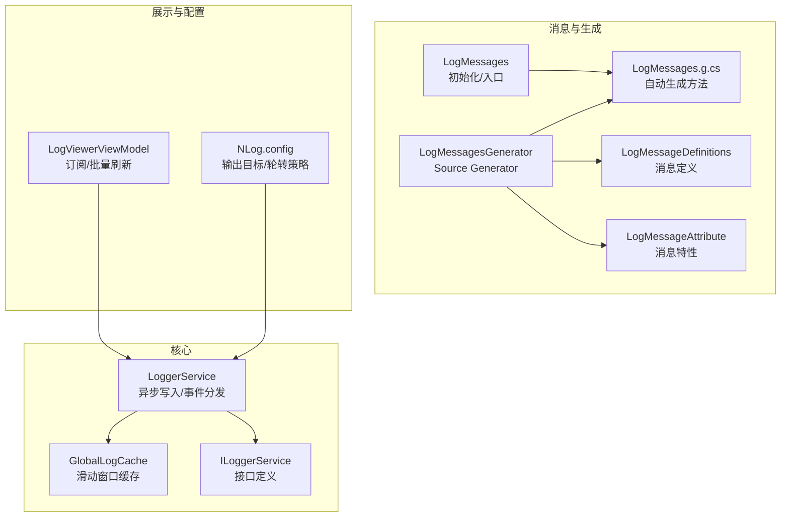
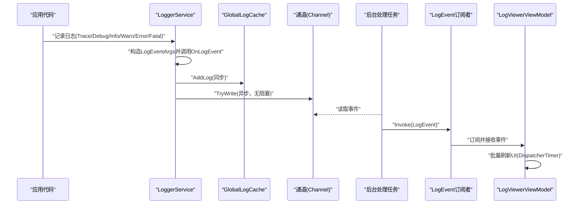
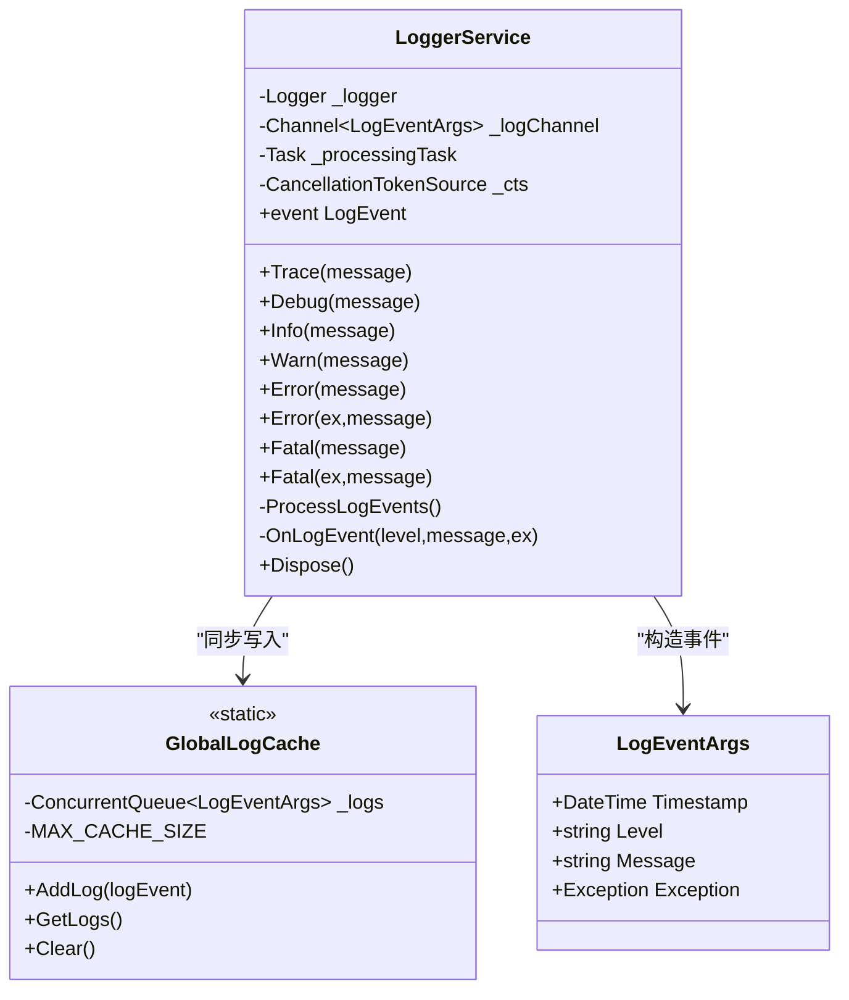
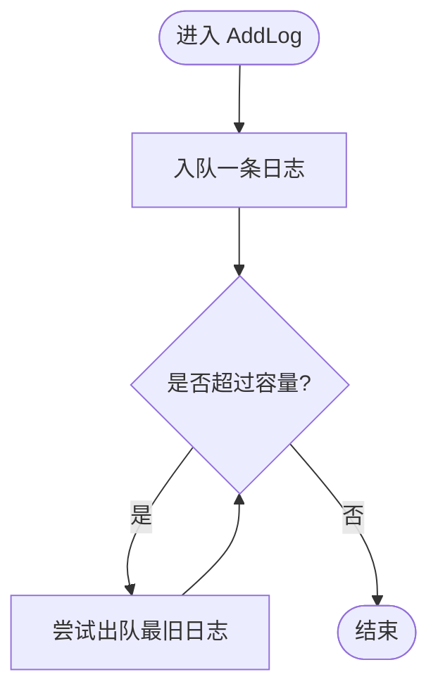
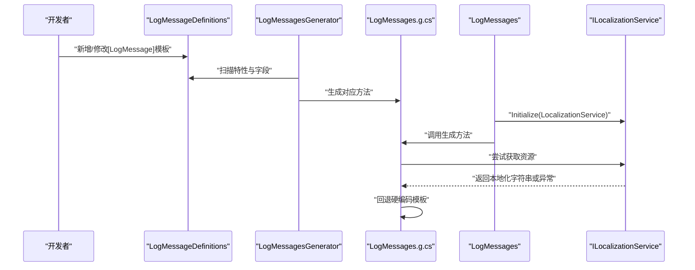
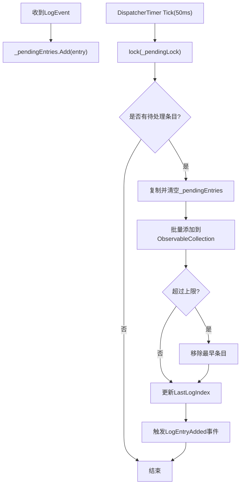
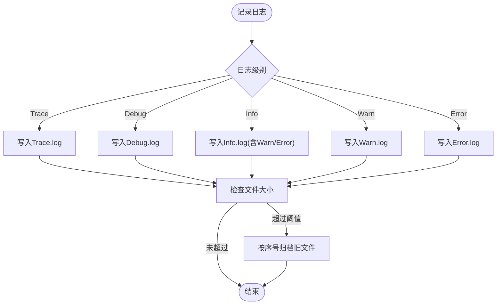
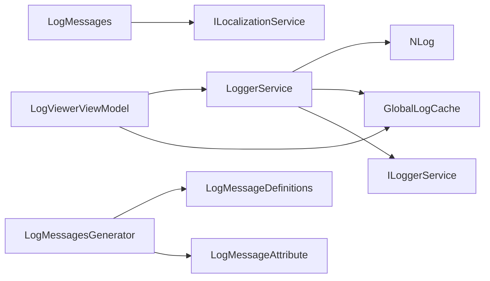

# 日志系统

<cite>
**本文引用的文件**
- [LoggerService.cs](file://Core/Utilities/LoggerService.cs)
- [GlobalLogCache.cs](file://Core/Utilities/GlobalLogCache.cs)
- [ILoggerService.cs](file://Core/Utilities/ILoggerService.cs)
- [LogMessageDefinitions.cs](file://Core/Logging/LogMessageDefinitions.cs)
- [LogMessageAttribute.cs](file://Core/Attributes/LogMessageAttribute.cs)
- [LogMessages.cs](file://Core/Logging/LogMessages.cs)
- [LogMessages.g.cs](file://Core/Logging/LogMessages.g.cs)
- [LogMessagesGenerator.cs](file://LogGenerator/LogMessagesGenerator.cs)
- [LogViewerViewModel.cs](file://LogViewer/ViewModels/LogViewerViewModel.cs)
- [NLog.config](file://MainApp/NLog.config)
- [ILocalizationService.cs](file://Core/Abstraction/ILocalizationService.cs)
- [版本修改记录.txt](file://版本修改记录.txt)
</cite>

## 目录
1. [简介](#简介)
2. [项目结构](#项目结构)
3. [核心组件](#核心组件)
4. [架构总览](#架构总览)
5. [组件详解](#组件详解)
6. [依赖关系分析](#依赖关系分析)
7. [性能考量](#性能考量)
8. [故障排查指南](#故障排查指南)
9. [结论](#结论)
10. [附录](#附录)

## 简介
本文件面向日志系统的使用者与维护者，系统性解析日志子系统的设计与实现，重点覆盖以下方面：
- LoggerService 的异步日志写入、事件分发与生命周期管理
- GlobalLogCache 的线程安全滑动窗口缓存机制
- 日志消息的自动生成与本地化流程（LogMessages 与 LogMessages.g.cs）
- 日志级别、格式化、异步写入、轮转与归档策略
- 日志配置示例、新增自定义日志消息的方法、性能优化技巧
- 扩展机制、第三方日志框架集成、监控与故障诊断方法

## 项目结构
日志系统主要分布在 Core、LogGenerator、LogViewer、MainApp 等模块中，职责划分清晰：
- Core/Utilities：日志服务与全局缓存
- Core/Logging：日志消息定义与生成入口
- Core/Attributes：日志消息特性
- LogGenerator：Roslyn Source Generator，自动生成 LogMessages.g.cs
- LogViewer：日志查看器，订阅日志事件并展示
- MainApp：NLog 配置文件，定义日志输出目标与规则

**图表来源**
- [LoggerService.cs:1-120](file://Core/Utilities/LoggerService.cs#L1-L120)
- [GlobalLogCache.cs:1-38](file://Core/Utilities/GlobalLogCache.cs#L1-L38)
- [ILoggerService.cs:1-35](file://Core/Utilities/ILoggerService.cs#L1-L35)
- [LogMessageDefinitions.cs:1-82](file://Core/Logging/LogMessageDefinitions.cs#L1-L82)
- [LogMessageAttribute.cs:1-18](file://Core/Attributes/LogMessageAttribute.cs#L1-L18)
- [LogMessages.cs:1-37](file://Core/Logging/LogMessages.cs#L1-L37)
- [LogMessages.g.cs:1-390](file://Core/Logging/LogMessages.g.cs#L1-L390)
- [LogMessagesGenerator.cs:1-252](file://LogGenerator/LogMessagesGenerator.cs#L1-L252)
- [LogViewerViewModel.cs:1-160](file://LogViewer/ViewModels/LogViewerViewModel.cs#L1-L160)
- [NLog.config:1-88](file://MainApp/NLog.config#L1-L88)

**章节来源**
- [LoggerService.cs:1-120](file://Core/Utilities/LoggerService.cs#L1-L120)
- [GlobalLogCache.cs:1-38](file://Core/Utilities/GlobalLogCache.cs#L1-L38)
- [ILoggerService.cs:1-35](file://Core/Utilities/ILoggerService.cs#L1-L35)
- [LogMessageDefinitions.cs:1-82](file://Core/Logging/LogMessageDefinitions.cs#L1-L82)
- [LogMessageAttribute.cs:1-18](file://Core/Attributes/LogMessageAttribute.cs#L1-L18)
- [LogMessages.cs:1-37](file://Core/Logging/LogMessages.cs#L1-L37)
- [LogMessages.g.cs:1-390](file://Core/Logging/LogMessages.g.cs#L1-L390)
- [LogMessagesGenerator.cs:1-252](file://LogGenerator/LogMessagesGenerator.cs#L1-L252)
- [LogViewerViewModel.cs:1-160](file://LogViewer/ViewModels/LogViewerViewModel.cs#L1-L160)
- [NLog.config:1-88](file://MainApp/NLog.config#L1-L88)

## 核心组件
- LoggerService：封装 NLog，提供统一日志接口；内部通过通道异步分发日志事件，并同步写入全局缓存；负责事件订阅与资源释放。
- GlobalLogCache：线程安全的滑动窗口缓存，限制最大容量，确保历史日志可被查看器加载。
- ILoggerService：日志服务接口，定义日志级别与事件。
- LogMessageDefinitions：集中定义日志消息键与多语言模板，配合特性标记。
- LogMessageAttribute：标记多语言模板与区域性。
- LogMessages：静态类，负责初始化与依赖注入（LocalizationService）；提供生成特性。
- LogMessages.g.cs：由 Source Generator 自动生成，按需生成带本地化与回退逻辑的方法。
- LogMessagesGenerator：Roslyn Source Generator，扫描定义类，提取特性，生成对应方法源码。
- LogViewerViewModel：订阅日志事件，采用批量刷新策略，避免 UI 卡顿。
- NLog.config：定义文件目标、轮转与归档策略。

**章节来源**
- [LoggerService.cs:1-120](file://Core/Utilities/LoggerService.cs#L1-L120)
- [GlobalLogCache.cs:1-38](file://Core/Utilities/GlobalLogCache.cs#L1-L38)
- [ILoggerService.cs:1-35](file://Core/Utilities/ILoggerService.cs#L1-L35)
- [LogMessageDefinitions.cs:1-82](file://Core/Logging/LogMessageDefinitions.cs#L1-L82)
- [LogMessageAttribute.cs:1-18](file://Core/Attributes/LogMessageAttribute.cs#L1-L18)
- [LogMessages.cs:1-37](file://Core/Logging/LogMessages.cs#L1-L37)
- [LogMessages.g.cs:1-390](file://Core/Logging/LogMessages.g.cs#L1-L390)
- [LogMessagesGenerator.cs:1-252](file://LogGenerator/LogMessagesGenerator.cs#L1-L252)
- [LogViewerViewModel.cs:1-160](file://LogViewer/ViewModels/LogViewerViewModel.cs#L1-L160)
- [NLog.config:1-88](file://MainApp/NLog.config#L1-L88)

## 架构总览
日志系统采用“事件驱动 + 异步通道 + 本地化生成”的设计，兼顾性能与可维护性。

**图表来源**
- [LoggerService.cs:78-111](file://Core/Utilities/LoggerService.cs#L78-L111)
- [GlobalLogCache.cs:16-25](file://Core/Utilities/GlobalLogCache.cs#L16-L25)
- [LogViewerViewModel.cs:83-130](file://LogViewer/ViewModels/LogViewerViewModel.cs#L83-L130)

## 组件详解

### LoggerService 设计与实现
- 异步通道与背压：使用有界通道，单读者、多写者，满载时丢弃最旧消息，避免内存膨胀。
- 后台处理：单个后台任务循环读取通道，触发 LogEvent 事件，异常被捕获并记录调试信息。
- 事件分发：OnLogEvent 构造 LogEventArgs，先写入全局缓存，再异步写入通道。
- 生命周期：Dispose 中取消令牌、完成写入器、等待后台任务结束并释放资源。

**图表来源**
- [LoggerService.cs:5-120](file://Core/Utilities/LoggerService.cs#L5-L120)
- [GlobalLogCache.cs:11-38](file://Core/Utilities/GlobalLogCache.cs#L11-L38)
- [ILoggerService.cs:19-35](file://Core/Utilities/ILoggerService.cs#L19-L35)

**章节来源**
- [LoggerService.cs:14-120](file://Core/Utilities/LoggerService.cs#L14-L120)
- [GlobalLogCache.cs:11-38](file://Core/Utilities/GlobalLogCache.cs#L11-L38)
- [ILoggerService.cs:4-17](file://Core/Utilities/ILoggerService.cs#L4-L17)

### GlobalLogCache 缓存机制
- 线程安全：基于 ConcurrentQueue，避免并发访问异常。
- 滑动窗口：超出容量时持续出队最早条目，维持固定上限。
- 查询与清理：ToArray 返回快照，Clear 清空缓存。

**图表来源**
- [GlobalLogCache.cs:16-25](file://Core/Utilities/GlobalLogCache.cs#L16-L25)

**章节来源**
- [GlobalLogCache.cs:16-36](file://Core/Utilities/GlobalLogCache.cs#L16-L36)

### 日志消息定义与自动生成
- 定义集中：LogMessageDefinitions 使用 [LogMessage] 特性标注多语言模板，键名作为常量。
- 生成入口：LogMessages 带 [GenerateLogMessages] 特性，指示生成器扫描该类。
- 生成器：LogMessagesGenerator 扫描候选类，提取特性与参数占位符，生成对应方法，包含动态资源与回退硬编码逻辑。
- 运行时本地化：LogMessages.g.cs 优先从 ILocalizationService 获取资源，失败则按当前区域性回退硬编码模板。

**图表来源**
- [LogMessageDefinitions.cs:6-82](file://Core/Logging/LogMessageDefinitions.cs#L6-L82)
- [LogMessageAttribute.cs:5-18](file://Core/Attributes/LogMessageAttribute.cs#L5-L18)
- [LogMessages.cs:32-36](file://Core/Logging/LogMessages.cs#L32-L36)
- [LogMessagesGenerator.cs:14-57](file://LogGenerator/LogMessagesGenerator.cs#L14-L57)
- [LogMessages.g.cs:18-45](file://Core/Logging/LogMessages.g.cs#L18-L45)
- [ILocalizationService.cs:35-47](file://Core/Abstraction/ILocalizationService.cs#L35-L47)

**章节来源**
- [LogMessageDefinitions.cs:6-82](file://Core/Logging/LogMessageDefinitions.cs#L6-L82)
- [LogMessageAttribute.cs:5-18](file://Core/Attributes/LogMessageAttribute.cs#L5-L18)
- [LogMessages.cs:13-27](file://Core/Logging/LogMessages.cs#L13-L27)
- [LogMessagesGenerator.cs:64-113](file://LogGenerator/LogMessagesGenerator.cs#L64-L113)
- [LogMessages.g.cs:18-99](file://Core/Logging/LogMessages.g.cs#L18-L99)
- [ILocalizationService.cs:35-47](file://Core/Abstraction/ILocalizationService.cs#L35-L47)

### 日志查看器与 UI 性能优化
- 订阅事件：LogViewerViewModel 订阅 LoggerService.LogEvent。
- 批量刷新：使用 _pendingEntries 收集事件，DispatcherTimer 每 50ms 批量刷新 UI，显著降低 UI 线程压力。
- 限流：限制最大日志条目数量，防止内存溢出。
- 实时高亮：LastLogIndex 标记最新日志，便于视图高亮。

**图表来源**
- [LogViewerViewModel.cs:83-130](file://LogViewer/ViewModels/LogViewerViewModel.cs#L83-L130)

**章节来源**
- [LogViewerViewModel.cs:13-130](file://LogViewer/ViewModels/LogViewerViewModel.cs#L13-L130)
- [版本修改记录.txt:151-158](file://版本修改记录.txt#L151-L158)

### 日志级别、格式化、异步写入、轮转与归档
- 级别：Trace、Debug、Info、Warn、Error、Fatal。
- 格式化：NLog.config 中使用布局模板，包含时间戳、级别、记录器名称、消息与异常。
- 异步写入：LoggerService 写入通道为异步，避免阻塞调用线程。
- 轮转与归档：每个级别独立文件，单文件大小达到阈值后按序号归档，保留指定数量的历史文件。

**图表来源**
- [NLog.config:9-87](file://MainApp/NLog.config#L9-L87)

**章节来源**
- [NLog.config:9-87](file://MainApp/NLog.config#L9-L87)

## 依赖关系分析
- LoggerService 依赖 NLog、System.Threading.Channels、GlobalLogCache 与 ILoggerService 接口。
- LogMessages 依赖 ILocalizationService，运行时通过 Initialize 注入。
- LogMessagesGenerator 依赖 Microsoft.CodeAnalysis，扫描并生成源码。
- LogViewerViewModel 依赖 ILoggerService 与 GlobalLogCache，用于加载历史日志。

**图表来源**
- [LoggerService.cs:1-120](file://Core/Utilities/LoggerService.cs#L1-L120)
- [GlobalLogCache.cs:1-38](file://Core/Utilities/GlobalLogCache.cs#L1-L38)
- [ILoggerService.cs:1-35](file://Core/Utilities/ILoggerService.cs#L1-L35)
- [LogMessages.cs:11-27](file://Core/Logging/LogMessages.cs#L11-L27)
- [ILocalizationService.cs:10-69](file://Core/Abstraction/ILocalizationService.cs#L10-L69)
- [LogMessagesGenerator.cs:11-62](file://LogGenerator/LogMessagesGenerator.cs#L11-L62)
- [LogViewerViewModel.cs:13-45](file://LogViewer/ViewModels/LogViewerViewModel.cs#L13-L45)

**章节来源**
- [LoggerService.cs:1-120](file://Core/Utilities/LoggerService.cs#L1-L120)
- [LogMessages.cs:11-27](file://Core/Logging/LogMessages.cs#L11-L27)
- [LogMessagesGenerator.cs:11-62](file://LogGenerator/LogMessagesGenerator.cs#L11-L62)
- [LogViewerViewModel.cs:13-45](file://LogViewer/ViewModels/LogViewerViewModel.cs#L13-L45)

## 性能考量
- 异步通道：使用有界通道与单读者，满载丢弃最旧消息，避免内存暴涨。
- 后台处理：单一后台任务读取通道，减少线程池开销。
- UI 批量刷新：LogViewerViewModel 使用定时器批量更新，降低 UI 线程压力与重渲染次数。
- 缓存上限：GlobalLogCache 限制最大容量，避免历史日志占用过多内存。
- NLog 轮转：按大小归档，避免单文件过大影响 I/O 性能。

**章节来源**
- [LoggerService.cs:18-30](file://Core/Utilities/LoggerService.cs#L18-L30)
- [LogViewerViewModel.cs:17-43](file://LogViewer/ViewModels/LogViewerViewModel.cs#L17-L43)
- [GlobalLogCache.cs:14](file://Core/Utilities/GlobalLogCache.cs#L14)
- [NLog.config:13-18](file://MainApp/NLog.config#L13-L18)

## 故障排查指南
- 日志未显示：检查 LoggerService 是否正确订阅 LogEvent；确认 LogViewerViewModel 已订阅且未被 GC 回收。
- UI 卡顿：确认 LogViewerViewModel 的批量刷新定时器是否启用；适当调整批量间隔。
- 本地化失效：确认 LogMessages.Initialize 已调用；检查 ILocalizationService 是否可用；若不可用，回退逻辑会使用硬编码模板。
- 日志丢失：通道满载时会丢弃最旧消息，适当增大通道容量或减少日志量。
- 归档问题：检查 NLog.config 的 archiveAboveSize 与 maxArchiveFiles 设置；确认路径权限。

**章节来源**
- [LogViewerViewModel.cs:34-44](file://LogViewer/ViewModels/LogViewerViewModel.cs#L34-L44)
- [LogMessages.cs:18-25](file://Core/Logging/LogMessages.cs#L18-L25)
- [LoggerService.cs:20-24](file://Core/Utilities/LoggerService.cs#L20-L24)
- [NLog.config:13-18](file://MainApp/NLog.config#L13-L18)

## 结论
该日志系统以 LoggerService 为核心，结合 GlobalLogCache、LogMessages 自动生成与 LogViewer 的高效展示，形成一套高性能、可扩展、易维护的日志方案。通过 NLog 的轮转与归档策略，满足生产环境对日志容量与持久化的要求；通过 Source Generator 与本地化服务，实现消息定义与运行时本地化的解耦。

## 附录

### 日志配置示例（NLog.config 关键点）
- 目标：按级别输出到不同文件，独立控制轮转阈值与归档数量。
- 规则：通过最小级别与最终目标控制输出范围。
- 布局：包含时间、级别、记录器、消息与异常。

**章节来源**
- [NLog.config:9-87](file://MainApp/NLog.config#L9-L87)

### 自定义日志消息添加方法
- 在 LogMessageDefinitions 中新增常量字段，并使用 [LogMessage] 特性标注多语言模板。
- 如需生成特性，确保类带有 [GenerateLogMessages]。
- 重新编译后，LogMessages.g.cs 将自动生成对应方法。
- 运行时通过 LogMessages.Initialize 注入 ILocalizationService，以启用动态资源获取。

**章节来源**
- [LogMessageDefinitions.cs:6-82](file://Core/Logging/LogMessageDefinitions.cs#L6-L82)
- [LogMessageAttribute.cs:5-18](file://Core/Attributes/LogMessageAttribute.cs#L5-L18)
- [LogMessages.cs:13-27](file://Core/Logging/LogMessages.cs#L13-L27)
- [LogMessagesGenerator.cs:14-57](file://LogGenerator/LogMessagesGenerator.cs#L14-L57)

### 日志性能优化技巧
- 使用 LoggerService 的异步通道写入，避免阻塞业务线程。
- UI 层采用批量刷新与限流，减少 Dispatcher 调用频率。
- 合理设置通道容量与 NLog 轮转阈值，平衡内存与磁盘占用。
- 通过 ILocalizationService 动态获取资源，必要时启用回退硬编码模板。

**章节来源**
- [LoggerService.cs:18-30](file://Core/Utilities/LoggerService.cs#L18-L30)
- [LogViewerViewModel.cs:17-43](file://LogViewer/ViewModels/LogViewerViewModel.cs#L17-L43)
- [NLog.config:13-18](file://MainApp/NLog.config#L13-L18)

### 扩展机制与第三方集成
- 扩展：可通过实现 ILoggerService 接口替换底层日志框架；或在 LoggerService 外部增加中间层适配 NLog 以外的框架。
- 集成：NLog.config 提供丰富的目标与布局选项，可接入远程日志、数据库、云存储等目标（需在 NLog.config 中配置相应 target 与 rules）。

**章节来源**
- [ILoggerService.cs:4-17](file://Core/Utilities/ILoggerService.cs#L4-L17)
- [NLog.config:9-87](file://MainApp/NLog.config#L9-L87)