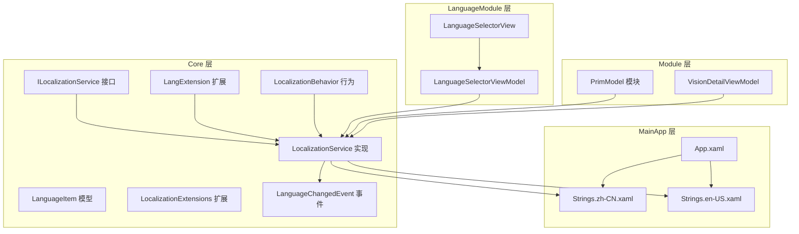
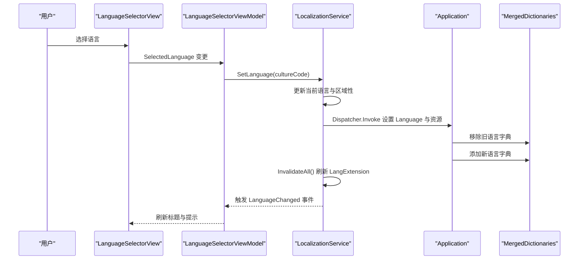
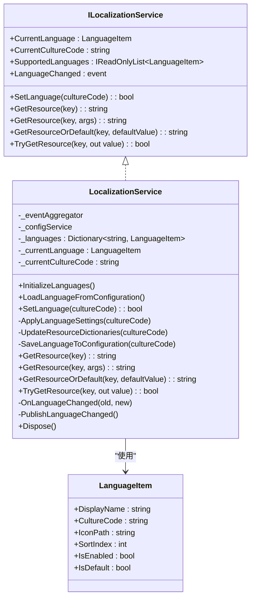
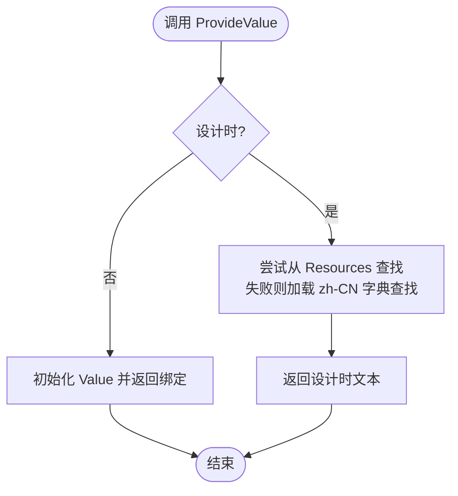
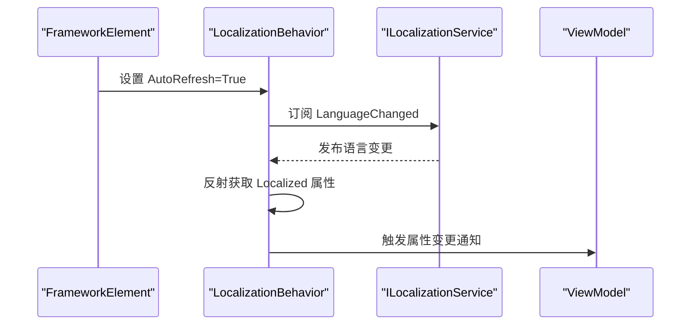
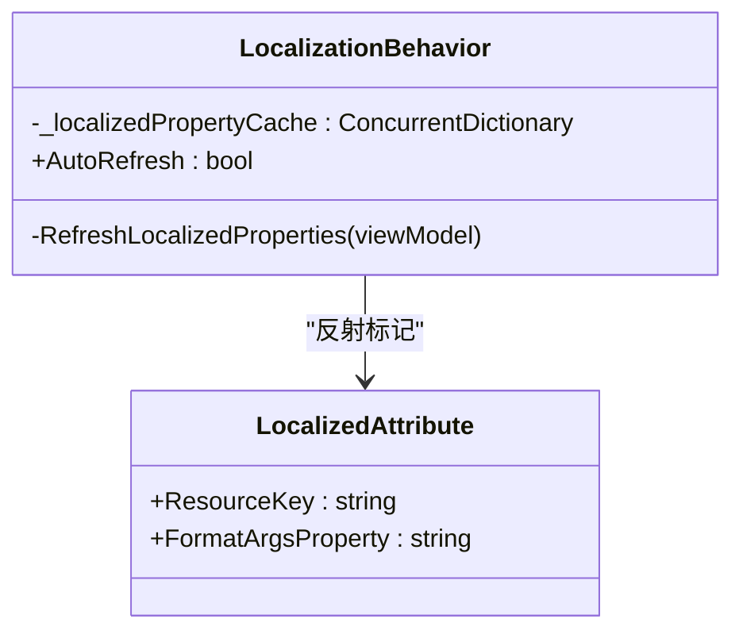
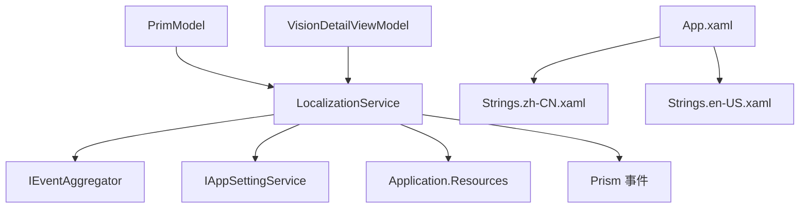

# 本地化服务

<cite>
**本文档引用的文件**
- [LocalizationService.cs](file://Core/Services/LocalizationService.cs)
- [LocalizationConfiguration.cs](file://Core/Services/LocalizationConfiguration.cs)
- [ILocalizationService.cs](file://Core/Abstraction/ILocalizationService.cs)
- [LanguageItem.cs](file://Core/Models/LanguageItem.cs)
- [LangExtension.cs](file://Core/Markup/LangExtension.cs)
- [LocalizationBehavior.cs](file://Core/Markup/LocalizationBehavior.cs)
- [LocalizationExtensions.cs](file://Core/Extensions/LocalizationExtensions.cs)
- [LanguageChangedEvent.cs](file://Core/Events/LanguageChangedEvent.cs)
- [LanguageSelectorViewModel.cs](file://LanguageModule/ViewModels/LanguageSelectorViewModel.cs)
- [LanguageSelectorView.xaml](file://LanguageModule/Views/LanguageSelectorView.xaml)
- [Strings.zh-CN.xaml](file://MainApp/Languages/Strings.zh-CN.xaml)
- [Strings.en-US.xaml](file://MainApp/Languages/Strings.en-US.xaml)
- [App.xaml](file://MainApp/App.xaml)
- [AppSettings.cs](file://Core/Configuration/AppSettings.cs)
- [IAppSettingService.cs](file://Core/Abstraction/IAppSettingService.cs)
- [PrimModel.cs](file://Module/PrimModel.cs)
- [VisionDetailViewModel.cs](file://Module/Controls/StepDetails/VisionDetailViewModel.cs)
- [scan_lang_keys.ps1](file://scan_lang_keys.ps1)
</cite>

## 目录
1. [简介](#简介)
2. [项目结构](#项目结构)
3. [核心组件](#核心组件)
4. [架构概览](#架构概览)
5. [详细组件分析](#详细组件分析)
6. [依赖关系分析](#依赖关系分析)
7. [性能考虑](#性能考虑)
8. [故障排除指南](#故障排除指南)
9. [结论](#结论)
10. [附录](#附录)

## 简介
本文件全面解析本地化服务的技术实现，涵盖多语言资源管理、动态语言切换、本地化标记扩展（LangExtension）、本地化行为（LocalizationBehavior），以及 LocalizedAttribute、LocalizationExtensions 和 LanguageItem 的使用方法。文档还阐述本地化资源的加载机制、缓存策略、语言包的组织结构与命名约定，并提供 XAML 与代码中的本地化使用示例、自定义本地化资源的添加步骤、语言切换的实现原理、性能优化建议与最佳实践。

## 项目结构
本地化系统主要分布在以下模块：
- Core 层：抽象接口、服务实现、标记扩展、模型与事件
- MainApp 层：语言资源字典（XAML）
- LanguageModule 层：语言选择界面与 ViewModel
- Module 层：业务模块对本地化服务的集成使用

**图表来源**
- [ILocalizationService.cs:1-108](file://Core/Abstraction/ILocalizationService.cs#L1-L108)
- [LocalizationService.cs:1-353](file://Core/Services/LocalizationService.cs#L1-L353)
- [LanguageItem.cs:1-88](file://Core/Models/LanguageItem.cs#L1-L88)
- [LangExtension.cs:1-242](file://Core/Markup/LangExtension.cs#L1-L242)
- [LocalizationBehavior.cs:1-238](file://Core/Markup/LocalizationBehavior.cs#L1-L238)
- [LocalizationExtensions.cs:1-66](file://Core/Extensions/LocalizationExtensions.cs#L1-L66)
- [LanguageChangedEvent.cs:1-64](file://Core/Events/LanguageChangedEvent.cs#L1-L64)
- [LanguageSelectorViewModel.cs:1-90](file://LanguageModule/ViewModels/LanguageSelectorViewModel.cs#L1-L90)
- [LanguageSelectorView.xaml:1-31](file://LanguageModule/Views/LanguageSelectorView.xaml#L1-L31)
- [Strings.zh-CN.xaml:1-800](file://MainApp/Languages/Strings.zh-CN.xaml#L1-L800)
- [Strings.en-US.xaml:1-800](file://MainApp/Languages/Strings.en-US.xaml#L1-L800)
- [App.xaml:1-50](file://MainApp/App.xaml#L1-L50)
- [PrimModel.cs:1-105](file://Module/PrimModel.cs#L1-L105)
- [VisionDetailViewModel.cs:169-196](file://Module/Controls/StepDetails/VisionDetailViewModel.cs#L169-L196)

**章节来源**
- [ILocalizationService.cs:1-108](file://Core/Abstraction/ILocalizationService.cs#L1-L108)
- [LocalizationService.cs:1-353](file://Core/Services/LocalizationService.cs#L1-L353)
- [App.xaml:1-50](file://MainApp/App.xaml#L1-L50)

## 核心组件
- ILocalizationService：定义本地化服务接口，包括当前语言、支持语言列表、设置语言、资源获取与语言变更事件。
- LocalizationService：实现 ILocalizationService，负责初始化语言列表、从配置加载语言、应用语言设置、替换资源字典、发布语言变更事件、提供资源查询方法。
- LanguageItem：语言项模型，包含显示名、区域性代码、图标路径、排序索引、启用状态与默认状态等。
- LangExtension：WPF 标记扩展，用于在 XAML 中绑定本地化文本，支持设计时与运行时行为、格式化参数、批量刷新。
- LocalizationBehavior：附加行为，自动刷新 ViewModel 中带有 LocalizedAttribute 的属性。
- LocalizationExtensions：提供静态资源访问器与 XAML 中使用的 LocalizeExtension。
- LanguageChangedEvent：语言变更事件，支持基础与详细数据发布。
- LanguageSelectorViewModel/View：语言选择界面，绑定到 ILocalizationService，实现语言切换 UI。

**章节来源**
- [ILocalizationService.cs:1-108](file://Core/Abstraction/ILocalizationService.cs#L1-L108)
- [LocalizationService.cs:1-353](file://Core/Services/LocalizationService.cs#L1-L353)
- [LanguageItem.cs:1-88](file://Core/Models/LanguageItem.cs#L1-L88)
- [LangExtension.cs:1-242](file://Core/Markup/LangExtension.cs#L1-L242)
- [LocalizationBehavior.cs:1-238](file://Core/Markup/LocalizationBehavior.cs#L1-L238)
- [LocalizationExtensions.cs:1-66](file://Core/Extensions/LocalizationExtensions.cs#L1-L66)
- [LanguageChangedEvent.cs:1-64](file://Core/Events/LanguageChangedEvent.cs#L1-L64)
- [LanguageSelectorViewModel.cs:1-90](file://LanguageModule/ViewModels/LanguageSelectorViewModel.cs#L1-L90)
- [LanguageSelectorView.xaml:1-31](file://LanguageModule/Views/LanguageSelectorView.xaml#L1-L31)

## 架构概览
本地化系统采用“服务驱动 + 资源字典 + 标记扩展”的架构：
- 服务层负责语言切换与资源查询
- 资源字典按区域性加载，支持动态替换
- 标记扩展与行为提供声明式与自动刷新能力
- 事件系统实现跨模块通信

**图表来源**
- [LanguageSelectorView.xaml:1-31](file://LanguageModule/Views/LanguageSelectorView.xaml#L1-L31)
- [LanguageSelectorViewModel.cs:1-90](file://LanguageModule/ViewModels/LanguageSelectorViewModel.cs#L1-L90)
- [LocalizationService.cs:129-161](file://Core/Services/LocalizationService.cs#L129-L161)
- [LangExtension.cs:149-159](file://Core/Markup/LangExtension.cs#L149-L159)

**章节来源**
- [LocalizationService.cs:129-198](file://Core/Services/LocalizationService.cs#L129-L198)
- [LanguageSelectorViewModel.cs:26-87](file://LanguageModule/ViewModels/LanguageSelectorViewModel.cs#L26-L87)

## 详细组件分析

### LocalizationService 设计与实现
- 初始化语言列表：内置中文（简体）与英文，支持排序与默认语言标识。
- 从配置加载语言：优先使用配置中的 Language，否则根据系统区域性或默认规则选择。
- 应用语言设置：更新线程文化、设置 XAML Language、替换 MergedDictionaries 中的语言资源字典。
- 资源查询：提供 GetResource、GetResourceOrDefault、TryGetResource 等方法，支持格式化与默认值。
- 事件发布：通过 Prism 事件与自定义事件发布语言变更。

**图表来源**
- [ILocalizationService.cs:1-108](file://Core/Abstraction/ILocalizationService.cs#L1-L108)
- [LocalizationService.cs:1-353](file://Core/Services/LocalizationService.cs#L1-L353)
- [LanguageItem.cs:1-88](file://Core/Models/LanguageItem.cs#L1-L88)

**章节来源**
- [LocalizationService.cs:68-124](file://Core/Services/LocalizationService.cs#L68-L124)
- [LocalizationService.cs:166-251](file://Core/Services/LocalizationService.cs#L166-L251)
- [LocalizationService.cs:256-324](file://Core/Services/LocalizationService.cs#L256-L324)

### 本地化标记扩展 LangExtension
- 设计时行为：在设计时直接从资源字典或默认语言字典解析文本。
- 运行时行为：初始化 Value 并返回绑定，通过 INotifyPropertyChanged 通知 UI 更新。
- 批量刷新：通过静态集合与弱引用跟踪实例，在语言切换时统一刷新。
- 多级查找：优先从 Application.Resources 查找，其次通过 ILocalizationService 获取，最后回退为 [Key]。

**图表来源**
- [LangExtension.cs:102-144](file://Core/Markup/LangExtension.cs#L102-L144)
- [LangExtension.cs:164-203](file://Core/Markup/LangExtension.cs#L164-L203)

**章节来源**
- [LangExtension.cs:102-144](file://Core/Markup/LangExtension.cs#L102-L144)
- [LangExtension.cs:149-239](file://Core/Markup/LangExtension.cs#L149-L239)

### 本地化行为 LocalizationBehavior
- 自动刷新：通过附加属性 AutoRefresh 控制是否启用；订阅语言变更事件并在变更时刷新 ViewModel 中标记了 [Localized] 的属性。
- 反射缓存：使用 ConcurrentDictionary 缓存属性信息，避免重复反射。
- 通知机制：优先通过 Prism BindableBase 的 RaisePropertyChanged，其次通过 INotifyPropertyChanged 事件触发。

**图表来源**
- [LocalizationBehavior.cs:61-81](file://Core/Markup/LocalizationBehavior.cs#L61-L81)
- [LocalizationBehavior.cs:113-143](file://Core/Markup/LocalizationBehavior.cs#L113-L143)
- [LocalizationBehavior.cs:174-235](file://Core/Markup/LocalizationBehavior.cs#L174-L235)

**章节来源**
- [LocalizationBehavior.cs:113-143](file://Core/Markup/LocalizationBehavior.cs#L113-L143)
- [LocalizationBehavior.cs:174-235](file://Core/Markup/LocalizationBehavior.cs#L174-L235)

### LocalizedAttribute 与 LocalizationBehavior 的协作
- LocalizedAttribute：用于标记 ViewModel 属性，支持自定义资源键与格式化参数属性名。
- LocalizationBehavior：在语言切换时自动刷新这些属性，提升开发体验与一致性。

**图表来源**
- [LocalizedAttribute.cs:1-28](file://Core/Attributes/LocalizedAttribute.cs#L1-L28)
- [LocalizationBehavior.cs:182-208](file://Core/Markup/LocalizationBehavior.cs#L182-L208)

**章节来源**
- [LocalizedAttribute.cs:1-28](file://Core/Attributes/LocalizedAttribute.cs#L1-L28)
- [LocalizationBehavior.cs:174-208](file://Core/Markup/LocalizationBehavior.cs#L174-L208)

### LocalizationExtensions 与 ResourceHelper
- LocalizeExtension：在 XAML 中提供静态资源访问，返回绑定以实现动态更新。
- ResourceHelper：提供静态方法在代码中获取资源字符串，支持格式化与回退值。

**章节来源**
- [LocalizationExtensions.cs:13-40](file://Core/Extensions/LocalizationExtensions.cs#L13-L40)
- [LocalizationExtensions.cs:45-66](file://Core/Extensions/LocalizationExtensions.cs#L45-L66)

### LanguageItem 语言项模型
- LanguageItem：封装语言显示名、区域性代码、图标路径、排序索引、启用与默认状态，支持属性变更通知。

**章节来源**
- [LanguageItem.cs:1-88](file://Core/Models/LanguageItem.cs#L1-L88)

### 语言选择器 LanguageSelectorViewModel/View
- 语言选择器：绑定支持的语言列表与当前语言，选择后调用 ILocalizationService.SetLanguage。
- 事件订阅：订阅语言变更事件以刷新 UI 文本。

**章节来源**
- [LanguageSelectorViewModel.cs:20-87](file://LanguageModule/ViewModels/LanguageSelectorViewModel.cs#L20-L87)
- [LanguageSelectorView.xaml:22-29](file://LanguageModule/Views/LanguageSelectorView.xaml#L22-L29)

## 依赖关系分析
- 服务依赖：LocalizationService 依赖 IEventAggregator、IAppSettingService、Application 资源与 Prism 事件。
- 资源依赖：App.xaml 合并默认语言字典，LocalizationService 在运行时替换为当前语言字典。
- 模块依赖：Module 通过 ILocalizationService 获取导航与界面文本，实现跨模块本地化。

**图表来源**
- [LocalizationService.cs:20-25](file://Core/Services/LocalizationService.cs#L20-L25)
- [App.xaml:36-44](file://MainApp/App.xaml#L36-L44)
- [PrimModel.cs:25-31](file://Module/PrimModel.cs#L25-L31)
- [VisionDetailViewModel.cs:183-196](file://Module/Controls/StepDetails/VisionDetailViewModel.cs#L183-L196)

**章节来源**
- [LocalizationService.cs:20-25](file://Core/Services/LocalizationService.cs#L20-L25)
- [App.xaml:36-44](file://MainApp/App.xaml#L36-L44)
- [PrimModel.cs:25-31](file://Module/PrimModel.cs#L25-L31)
- [VisionDetailViewModel.cs:183-196](file://Module/Controls/StepDetails/VisionDetailViewModel.cs#L183-L196)

## 性能考虑
- 资源字典替换：在 UI 线程上进行，避免频繁切换导致 UI 卡顿；建议在语言切换前缓存常用键值。
- 批量刷新：LangExtension 使用弱引用列表与静态集合统一刷新，减少逐个实例刷新的开销。
- 反射缓存：LocalizationBehavior 使用 ConcurrentDictionary 缓存属性信息，降低重复反射成本。
- 事件发布：通过 Prism 事件聚合器发布语言变更，避免直接耦合。

[本节为通用指导，无需特定文件引用]

## 故障排除指南
- 语言切换无效：检查 ILocalizationService.SetLanguage 返回值与异常日志；确认 App.xaml 中合并了默认语言字典。
- 资源键缺失：LangExtension 会回退为 [Key]，可通过扫描脚本识别未在资源文件中定义的键。
- 事件未触发：确认订阅了 LanguageChanged 事件与 Prism LanguageChangedEvent。
- 配置未保存：检查 IAppSettingService.Save 是否调用及异常处理。

**章节来源**
- [LocalizationService.cs:141-160](file://Core/Services/LocalizationService.cs#L141-L160)
- [LangExtension.cs:196-203](file://Core/Markup/LangExtension.cs#L196-L203)
- [LanguageChangedEvent.cs:8-54](file://Core/Events/LanguageChangedEvent.cs#L8-L54)
- [scan_lang_keys.ps1:24-55](file://scan_lang_keys.ps1#L24-L55)

## 结论
该本地化服务通过清晰的分层设计与完善的扩展机制，实现了多语言资源管理、动态语言切换与声明式本地化绑定。LangExtension 与 LocalizationBehavior 提升了开发效率与用户体验，而资源字典的动态替换与事件系统确保了跨模块的一致性与可维护性。结合性能优化与最佳实践，可在复杂工业应用中稳定地提供高质量的多语言支持。

[本节为总结性内容，无需特定文件引用]

## 附录

### 本地化资源加载机制与缓存策略
- 加载机制：App.xaml 合并默认语言字典；运行时 LocalizationService 替换为当前语言字典。
- 缓存策略：LangExtension 使用弱引用集合跟踪实例；LocalizationBehavior 使用并发字典缓存属性信息。

**章节来源**
- [App.xaml:36-44](file://MainApp/App.xaml#L36-L44)
- [LocalizationService.cs:203-230](file://Core/Services/LocalizationService.cs#L203-L230)
- [LangExtension.cs:21-21](file://Core/Markup/LangExtension.cs#L21-L21)
- [LocalizationBehavior.cs:31-32](file://Core/Markup/LocalizationBehavior.cs#L31-L32)

### 语言包组织结构与命名约定
- 语言包文件：位于 MainApp/Languages，命名规范为 Strings.{culture}.xaml，如 Strings.zh-CN.xaml、Strings.en-US.xaml。
- 键命名：建议使用模块/页面/控件层级命名空间，避免冲突。

**章节来源**
- [Strings.zh-CN.xaml:1-800](file://MainApp/Languages/Strings.zh-CN.xaml#L1-L800)
- [Strings.en-US.xaml:1-800](file://MainApp/Languages/Strings.en-US.xaml#L1-L800)

### XAML 中的本地化使用示例
- 使用 LangExtension：在 XAML 中通过 lang:Lang Key="..." 绑定本地化文本。
- 使用 LocalizeExtension：在 XAML 中通过 local:LocalizeExtension Key="..." 绑定静态资源。
- 使用 DynamicResource：在 XAML 中通过 DynamicResource Key 绑定静态资源。

**章节来源**
- [LanguageSelectorView.xaml:111-112](file://LanguageModule/Views/LanguageSelectorView.xaml#L111-L112)
- [LocalizationExtensions.cs:13-40](file://Core/Extensions/LocalizationExtensions.cs#L13-L40)
- [App.xaml:38-38](file://MainApp/App.xaml#L38-L38)

### 代码中的本地化调用方法
- 通过 ILocalizationService 获取资源：GetResource、GetResourceOrDefault、TryGetResource。
- 在 ViewModel 中使用 LocalizedAttribute 标记属性，配合 LocalizationBehavior 自动刷新。
- 在模块初始化中使用 ILocalizationService 获取导航与界面文本。

**章节来源**
- [LocalizationService.cs:256-324](file://Core/Services/LocalizationService.cs#L256-L324)
- [LocalizedAttribute.cs:1-28](file://Core/Attributes/LocalizedAttribute.cs#L1-L28)
- [LocalizationBehavior.cs:174-235](file://Core/Markup/LocalizationBehavior.cs#L174-L235)
- [PrimModel.cs:31-31](file://Module/PrimModel.cs#L31-L31)
- [VisionDetailViewModel.cs:183-183](file://Module/Controls/StepDetails/VisionDetailViewModel.cs#L183-L183)

### 自定义本地化资源的添加步骤
- 在 MainApp/Languages 下新增语言包文件（如 Strings.zh-TW.xaml）。
- 在资源文件中添加键值对，确保键唯一且语义明确。
- 在 App.xaml 或模块初始化中合并新语言字典。
- 在 ViewModel 中使用 LocalizedAttribute 标记属性，或在 XAML 中使用 LangExtension 绑定。

**章节来源**
- [Strings.zh-CN.xaml:1-800](file://MainApp/Languages/Strings.zh-CN.xaml#L1-L800)
- [Strings.en-US.xaml:1-800](file://MainApp/Languages/Strings.en-US.xaml#L1-L800)
- [App.xaml:36-44](file://MainApp/App.xaml#L36-L44)
- [LocalizedAttribute.cs:1-28](file://Core/Attributes/LocalizedAttribute.cs#L1-L28)
- [LangExtension.cs:102-144](file://Core/Markup/LangExtension.cs#L102-L144)

### 语言切换的实现原理
- 选择语言：LanguageSelectorViewModel 调用 ILocalizationService.SetLanguage。
- 应用设置：LocalizationService 更新线程文化、XAML Language 与资源字典。
- 刷新 UI：LangExtension.InvalidateAll 刷新所有实例；LocalizationBehavior 刷新 ViewModel 属性。
- 事件通知：发布 LanguageChangedEvent 与自定义事件。

**章节来源**
- [LanguageSelectorViewModel.cs:33-33](file://LanguageModule/ViewModels/LanguageSelectorViewModel.cs#L33-L33)
- [LocalizationService.cs:129-161](file://Core/Services/LocalizationService.cs#L129-L161)
- [LangExtension.cs:149-159](file://Core/Markup/LangExtension.cs#L149-L159)
- [LocalizationBehavior.cs:134-142](file://Core/Markup/LocalizationBehavior.cs#L134-L142)
- [LanguageChangedEvent.cs:8-54](file://Core/Events/LanguageChangedEvent.cs#L8-L54)

### 性能优化建议与最佳实践
- 避免在热路径中频繁切换语言；批量切换时减少 UI 刷新次数。
- 使用 ResourceHelper 与 LocalizeExtension 提供静态资源访问，减少服务解析开销。
- 合理使用 LocalizedAttribute 与 LocalizationBehavior，避免过度刷新。
- 通过扫描脚本定期检查资源键一致性，减少运行时回退。

**章节来源**
- [LocalizationExtensions.cs:45-66](file://Core/Extensions/LocalizationExtensions.cs#L45-L66)
- [LocalizationBehavior.cs:174-235](file://Core/Markup/LocalizationBehavior.cs#L174-L235)
- [scan_lang_keys.ps1:24-55](file://scan_lang_keys.ps1#L24-L55)