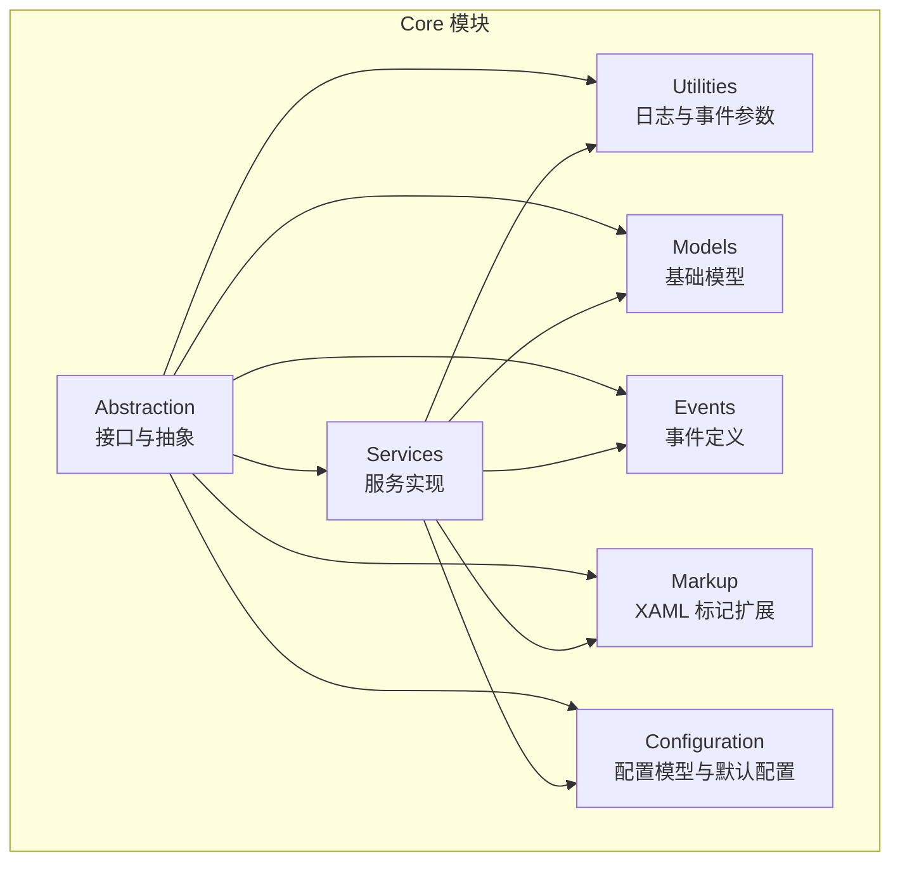
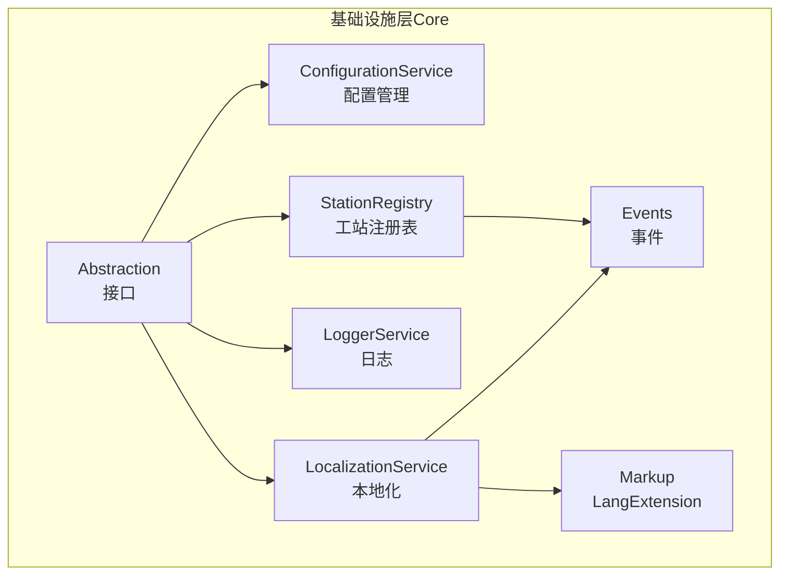
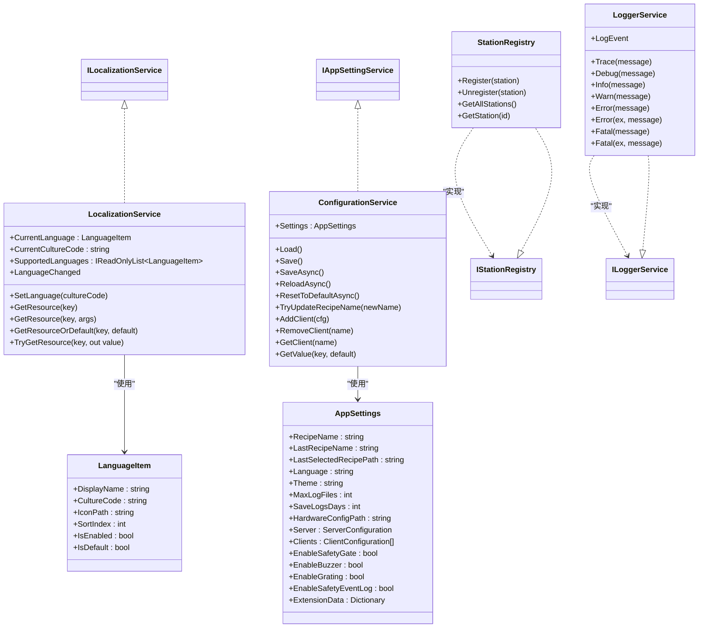
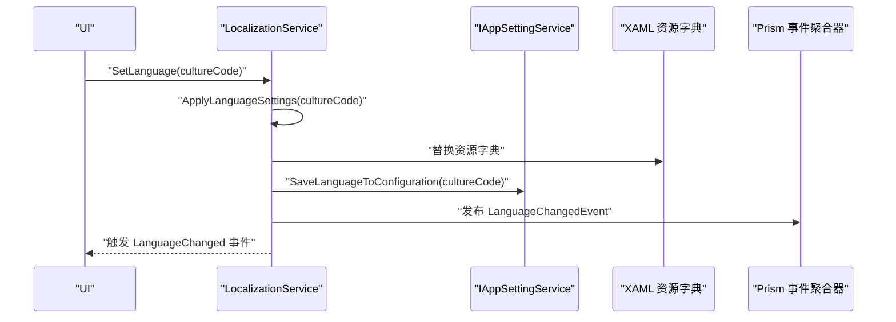
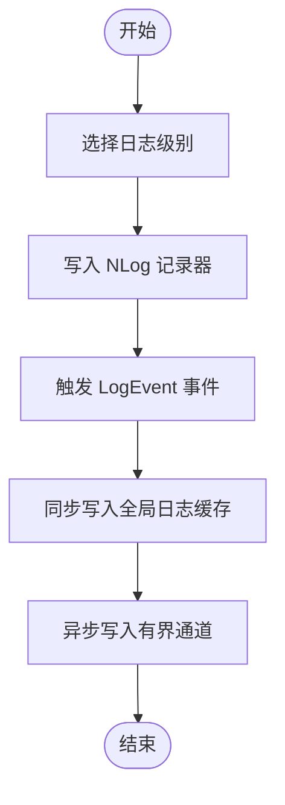

# 核心服务层（Core）

<cite>
**本文档引用的文件**
- [Core.csproj](file://Core/Core.csproj)
- [appsettings.json](file://Core/appsettings.json)
- [ConfigurationService.cs](file://Core/Services/ConfigurationService.cs)
- [IAppSettingService.cs](file://Core/Abstraction/IAppSettingService.cs)
- [AppSettings.cs](file://Core/Configuration/AppSettings.cs)
- [LocalizationService.cs](file://Core/Services/LocalizationService.cs)
- [ILocalizationService.cs](file://Core/Abstraction/ILocalizationService.cs)
- [LanguageItem.cs](file://Core/Models/LanguageItem.cs)
- [LanguageChangedEvent.cs](file://Core/Events/LanguageChangedEvent.cs)
- [LangExtension.cs](file://Core/Markup/LangExtension.cs)
- [StationRegistry.cs](file://Core/Services/StationRegistry.cs)
- [IStationRegistry.cs](file://Core/Abstraction/IStationRegistry.cs)
- [LoggerService.cs](file://Core/Utilities/LoggerService.cs)
- [ILoggerService.cs](file://Core/Utilities/ILoggerService.cs)
</cite>

## 目录
1. [简介](#简介)
2. [项目结构](#项目结构)
3. [核心组件](#核心组件)
4. [架构总览](#架构总览)
5. [详细组件分析](#详细组件分析)
6. [依赖关系分析](#依赖关系分析)
7. [性能考虑](#性能考虑)
8. [故障排查指南](#故障排查指南)
9. [结论](#结论)
10. [附录](#附录)

## 简介
Core 模块是整个系统的基础设施核心，提供配置管理、本地化、日志与工站注册等通用能力，并通过抽象接口与事件系统解耦各子系统。其目标是：
- 以统一的配置中心管理应用设置与配方信息；
- 以本地化服务支撑多语言界面与资源；
- 以日志服务提供高性能、可订阅的日志输出；
- 以工站注册表实现跨模块的工站发现与事件发布。

## 项目结构
Core 模块采用“分层+接口抽象”的组织方式：
- Abstraction：定义通用服务接口与抽象模型，确保实现与调用解耦；
- Services：具体服务实现，如配置、本地化、工站注册、日志等；
- Utilities：日志工具与事件参数定义；
- Models：基础数据模型，如语言项；
- Events：事件定义，用于跨模块通信；
- Markup：XAML 标记扩展，支持运行时本地化绑定；
- Configuration：配置模型与默认配置文件；
- Core.csproj 与 appsettings.json：项目依赖与默认配置。

**图表来源**
- [Core.csproj:11-41](file://Core/Core.csproj#L11-L41)

**章节来源**
- [Core.csproj:1-44](file://Core/Core.csproj#L1-L44)
- [appsettings.json:1-13](file://Core/appsettings.json#L1-L13)

## 核心组件
本节概述四大核心服务及其职责：
- 配置管理服务（ConfigurationService）：负责应用设置的持久化、配方名称管理、客户端配置维护与扩展键值读取。
- 本地化服务（LocalizationService）：负责语言切换、资源字典替换、XAML 本地化标记扩展集成与 Prism 事件发布。
- 日志系统（LoggerService）：基于 NLog 的高性能日志服务，支持异步通道写入、事件订阅与全局缓存同步。
- 工站注册表（StationRegistry）：线程安全的工站注册与查询容器，发布注册/注销事件，解决模块加载时序问题。

**章节来源**
- [ConfigurationService.cs:15-220](file://Core/Services/ConfigurationService.cs#L15-L220)
- [LocalizationService.cs:18-353](file://Core/Services/LocalizationService.cs#L18-L353)
- [LoggerService.cs:5-120](file://Core/Utilities/LoggerService.cs#L5-L120)
- [StationRegistry.cs:14-47](file://Core/Services/StationRegistry.cs#L14-L47)

## 架构总览
Core 通过抽象接口与事件系统连接各模块，形成松耦合的基础设施层。

**图表来源**
- [IAppSettingService.cs:10-51](file://Core/Abstraction/IAppSettingService.cs#L10-L51)
- [ILocalizationService.cs:10-108](file://Core/Abstraction/ILocalizationService.cs#L10-L108)
- [IStationRegistry.cs:7-21](file://Core/Abstraction/IStationRegistry.cs#L7-L21)
- [LanguageChangedEvent.cs:8-63](file://Core/Events/LanguageChangedEvent.cs#L8-L63)
- [LangExtension.cs:16-242](file://Core/Markup/LangExtension.cs#L16-L242)

## 详细组件分析

### 配置管理服务（ConfigurationService）
职责与特性：
- 文件持久化：在应用目录下创建 Config 子目录并以 JSON 形式保存配置；首次运行自动创建默认配置。
- 配方管理：维护当前配方名称、上次配方名称与上次选择路径，支持更新并回退。
- 客户端管理：支持添加、移除与查询客户端配置。
- 扩展键值：通过扩展数据读取任意键值，默认值兜底。
- 线程安全：内部使用锁保护读写，避免并发冲突。
- 异步操作：提供异步保存、重载与重置默认值，降低 UI 阻塞。

API 参考（节选）：
- 属性与只读集合：Settings、Clients、ServerConfig、RecipeName、LastRecipeName、LastSelectedRecipePath
- 方法：Load()、Save()、SaveAsync()、ReloadAsync()、ResetToDefaultAsync()、TryUpdateRecipeName()、AddClient()、RemoveClient()、GetClient()、GetValue()

使用示例（步骤说明）：
- 初始化：构造函数会确保配置目录存在并创建默认配置（若不存在）。
- 读取：通过 Settings 访问当前配置；通过 GetValue(key, defaultValue) 读取扩展键值。
- 写入：更新属性后调用 Save() 或 SaveAsync() 持久化。
- 配方切换：调用 TryUpdateRecipeName(newName) 更新当前配方并记录上次配方。

配置选项（来自 appsettings.json）：
- AppSettings：Language、AutoDetectLanguage、Theme、MaxLogFiles、SaveLogsDays、HardwareConfigPath
- ConnectionStrings：Database

性能与可靠性：
- 使用 System.Text.Json 进行序列化，开启缩进与大小写不敏感选项提升兼容性。
- 异常捕获与降级：加载/保存失败时输出错误信息并回退到默认配置。
- 锁保护：防止并发读写导致的数据损坏。

**章节来源**
- [ConfigurationService.cs:15-220](file://Core/Services/ConfigurationService.cs#L15-L220)
- [IAppSettingService.cs:10-51](file://Core/Abstraction/IAppSettingService.cs#L10-L51)
- [AppSettings.cs:10-39](file://Core/Configuration/AppSettings.cs#L10-L39)
- [appsettings.json:1-13](file://Core/appsettings.json#L1-L13)

### 本地化服务（LocalizationService）
职责与特性：
- 语言初始化：内置支持中文（简体）与英文；从配置加载上次语言，否则回退到系统语言或默认值。
- 语言切换：更新线程文化、替换 XAML 资源字典、保存配置、发布 Prism 事件、刷新 LangExtension。
- 资源访问：提供多种 GetResource 重载与 TryGetResource，支持格式化与默认值。
- 事件发布：通过 Prism 事件与自定义事件参数发布语言变更。

API 参考（节选）：
- 属性：CurrentLanguage、CurrentCultureCode、SupportedLanguages
- 事件：LanguageChanged
- 方法：SetLanguage(cultureCode)、GetResource(key)、GetResource(key, args)、GetResourceOrDefault(key, defaultValue)、TryGetResource(key, out value)

使用示例（步骤说明）：
- 初始化：构造函数完成语言列表初始化、从配置加载语言并发布事件。
- 切换语言：调用 SetLanguage(cultureCode) 完成文化切换与资源字典替换。
- 获取资源：通过 GetResource(key) 或 GetResourceOrDefault(key, defaultValue) 获取本地化字符串。
- UI 绑定：在 XAML 中使用 LangExtension 标记实现运行时刷新。

错误处理与回退：
- 加载失败时回退到默认语言（zh-CN），并记录调试信息。
- 资源字典替换失败时记录异常，不影响主流程。

**章节来源**
- [LocalizationService.cs:18-353](file://Core/Services/LocalizationService.cs#L18-L353)
- [ILocalizationService.cs:10-108](file://Core/Abstraction/ILocalizationService.cs#L10-L108)
- [LanguageItem.cs:9-88](file://Core/Models/LanguageItem.cs#L9-L88)
- [LanguageChangedEvent.cs:8-63](file://Core/Events/LanguageChangedEvent.cs#L8-L63)
- [LangExtension.cs:16-242](file://Core/Markup/LangExtension.cs#L16-L242)

### 日志系统（LoggerService）
职责与特性：
- 基于 NLog：使用 GetCurrentClassLogger() 获取日志记录器。
- 异步通道：使用有界通道（容量 1000，丢弃最旧消息）与单后台任务处理日志事件，避免阻塞。
- 事件订阅：对外暴露 LogEvent 事件，供日志查看器等订阅。
- 全局缓存：同步写入全局日志缓存，便于快速检索。

API 参考（节选）：
- 方法：Trace(message)、Debug(message)、Info(message)、Warn(message)、Error(message)、Error(ex, message)、Fatal(message)、Fatal(ex, message)
- 事件：LogEvent

使用示例（步骤说明）：
- 记录日志：调用对应级别方法（如 Info/Warning/Error）。
- 订阅事件：订阅 LogEvent 事件以接收实时日志。
- 资源清理：在合适时机调用 Dispose() 以停止后台任务并释放资源。

性能与可靠性：
- 有界通道与丢弃策略：在高负载场景避免内存膨胀。
- 单读者模型：简化并发控制，降低上下文切换成本。
- 异常隔离：事件处理器异常被捕获并记录，不影响日志写入链路。

**章节来源**
- [LoggerService.cs:5-120](file://Core/Utilities/LoggerService.cs#L5-L120)
- [ILoggerService.cs:4-35](file://Core/Utilities/ILoggerService.cs#L4-L35)

### 工站注册表（StationRegistry）
职责与特性：
- 线程安全：使用并发字典存储工站提供者，支持高并发注册/注销与查询。
- 事件发布：注册/注销时通过 Prism 事件发布 StationRegisteredEvent/StationUnregisteredEvent。
- 松耦合：消费者通过 IStationParameterProvider 查询工站，不受模块加载顺序影响。

API 参考（节选）：
- 方法：Register(station)、Unregister(station)、GetAllStations()、GetStation(stationIdentifier)

使用示例（步骤说明）：
- 注册：工站创建完成后调用 Register(station) 完成自注册。
- 查询：通过 GetAllStations() 获取全部工站，或通过 GetStation(id) 获取特定工站。
- 事件监听：订阅注册/注销事件以执行联动逻辑。

**章节来源**
- [StationRegistry.cs:14-47](file://Core/Services/StationRegistry.cs#L14-L47)
- [IStationRegistry.cs:7-21](file://Core/Abstraction/IStationRegistry.cs#L7-L21)

## 依赖关系分析
Core 模块内部依赖关系如下：

**图表来源**
- [ConfigurationService.cs:15-220](file://Core/Services/ConfigurationService.cs#L15-L220)
- [LocalizationService.cs:18-353](file://Core/Services/LocalizationService.cs#L18-L353)
- [LoggerService.cs:5-120](file://Core/Utilities/LoggerService.cs#L5-L120)
- [StationRegistry.cs:14-47](file://Core/Services/StationRegistry.cs#L14-L47)
- [AppSettings.cs:10-39](file://Core/Configuration/AppSettings.cs#L10-L39)
- [LanguageItem.cs:9-88](file://Core/Models/LanguageItem.cs#L9-L88)
- [ILocalizationService.cs:10-108](file://Core/Abstraction/ILocalizationService.cs#L10-L108)
- [IAppSettingService.cs:10-51](file://Core/Abstraction/IAppSettingService.cs#L10-L51)
- [IStationRegistry.cs:7-21](file://Core/Abstraction/IStationRegistry.cs#L7-L21)
- [ILoggerService.cs:4-35](file://Core/Utilities/ILoggerService.cs#L4-L35)

## 性能考虑
- 配置服务
  - 使用 System.Text.Json 与缩进/大小写不敏感选项，兼顾可读性与兼容性。
  - 异步保存与重载减少 UI 阻塞；锁保护避免并发写入风险。
- 本地化服务
  - 通过 LangExtension 缓存与弱引用列表实现批量刷新，降低语言切换成本。
  - 资源字典替换在 UI 线程执行，避免跨线程资源访问问题。
- 日志系统
  - 有界通道与单后台任务处理日志事件，避免线程池过度占用。
  - 丢弃最旧消息策略在高负载场景保证系统稳定性。
- 工站注册表
  - 并发字典提供 O(1) 级别的注册/查询复杂度，适合高频访问场景。

## 故障排查指南
- 配置文件无法加载/保存
  - 现象：启动时报错或配置未生效。
  - 排查：检查 Config/appsettings.json 路径是否存在；确认文件权限；查看控制台输出的异常信息。
  - 处理：删除损坏配置文件后重启应用，将自动生成默认配置。
- 语言切换无效
  - 现象：切换语言后界面未更新。
  - 排查：确认 LangExtension.InvalidateAll() 是否被调用；检查资源字典替换是否成功；验证 Prism 事件是否发布。
  - 处理：手动触发刷新或检查事件订阅。
- 日志未显示或丢失
  - 现象：LogViewer 无日志或日志缺失。
  - 排查：确认 LoggerService.LogEvent 是否被订阅；检查通道容量与 FullMode 行为；查看后台任务是否正常运行。
  - 处理：增加订阅或调整通道容量；在 Dispose() 前确保任务完成。
- 工站查询为空
  - 现象：GetAllStations() 返回空列表。
  - 排查：确认工站是否已完成 Register(station)；检查 Prism 事件是否被正确发布；验证模块加载顺序。
  - 处理：延迟查询或等待注册完成。

**章节来源**
- [ConfigurationService.cs:153-203](file://Core/Services/ConfigurationService.cs#L153-L203)
- [LocalizationService.cs:129-161](file://Core/Services/LocalizationService.cs#L129-L161)
- [LoggerService.cs:78-100](file://Core/Utilities/LoggerService.cs#L78-L100)
- [StationRegistry.cs:24-45](file://Core/Services/StationRegistry.cs#L24-L45)

## 结论
Core 模块通过清晰的接口抽象与事件系统，构建了稳定、可扩展且高性能的基础设施层。配置管理、本地化、日志与工站注册等核心服务相互协作，既满足当前业务需求，也为未来扩展预留了良好空间。建议在实际部署中结合监控与日志策略，持续优化性能与可用性。

## 附录

### API 参考速查
- 配置服务（ConfigurationService）
  - Settings、Load()、Save()、SaveAsync()、ReloadAsync()、ResetToDefaultAsync()、TryUpdateRecipeName()、AddClient()、RemoveClient()、GetClient()、GetValue()
- 本地化服务（LocalizationService）
  - CurrentLanguage、CurrentCultureCode、SupportedLanguages、SetLanguage()、GetResource()、GetResourceOrDefault()、TryGetResource()、LanguageChanged
- 日志服务（LoggerService）
  - Trace/Debug/Info/Warn/Error/Fatal、LogEvent
- 工站注册表（StationRegistry）
  - Register()、Unregister()、GetAllStations()、GetStation()

### 关键流程图示例

#### 语言切换流程（Sequence Diagram）

**图表来源**
- [LocalizationService.cs:129-161](file://Core/Services/LocalizationService.cs#L129-L161)
- [LanguageChangedEvent.cs:8-63](file://Core/Events/LanguageChangedEvent.cs#L8-L63)

#### 日志写入流程（Flowchart）

**图表来源**
- [LoggerService.cs:31-111](file://Core/Utilities/LoggerService.cs#L31-L111)