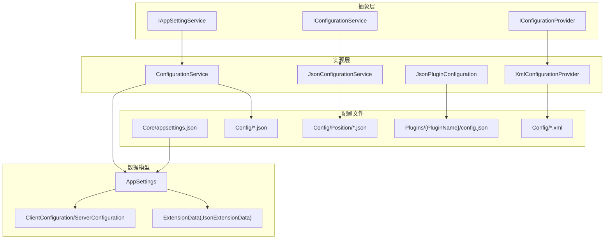
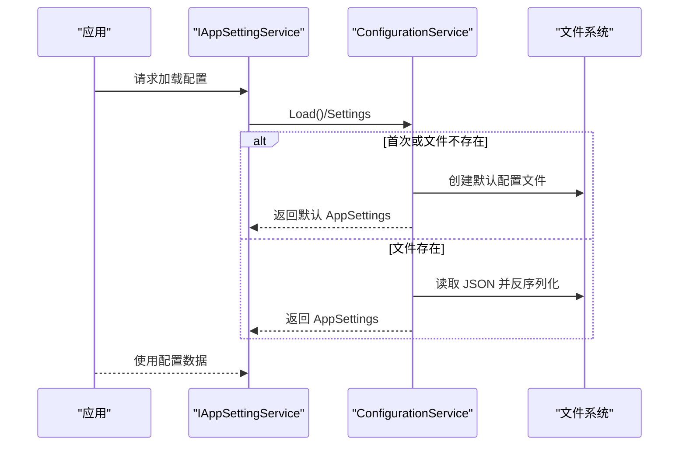
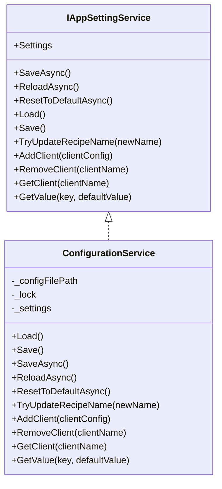
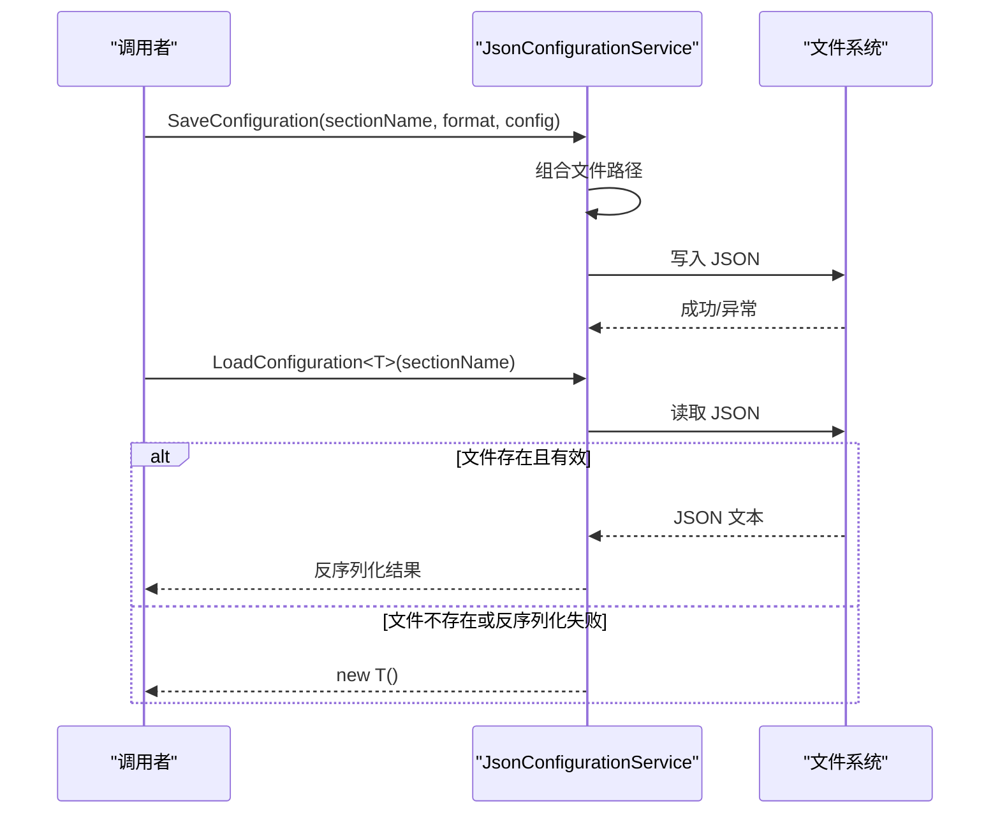
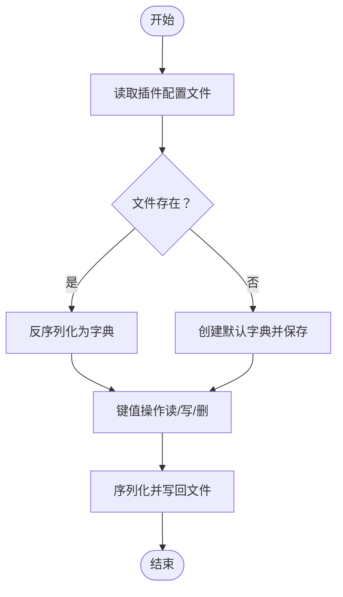
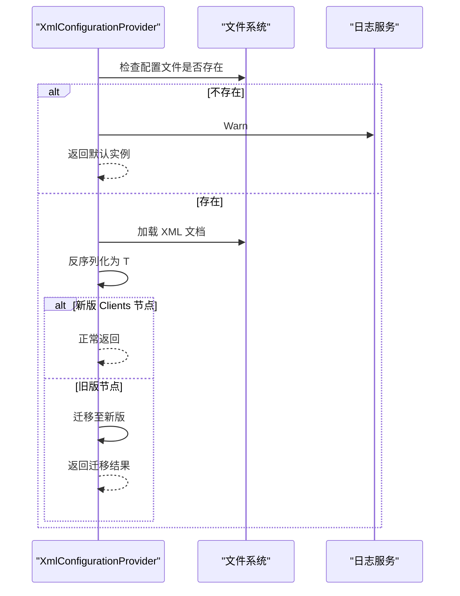
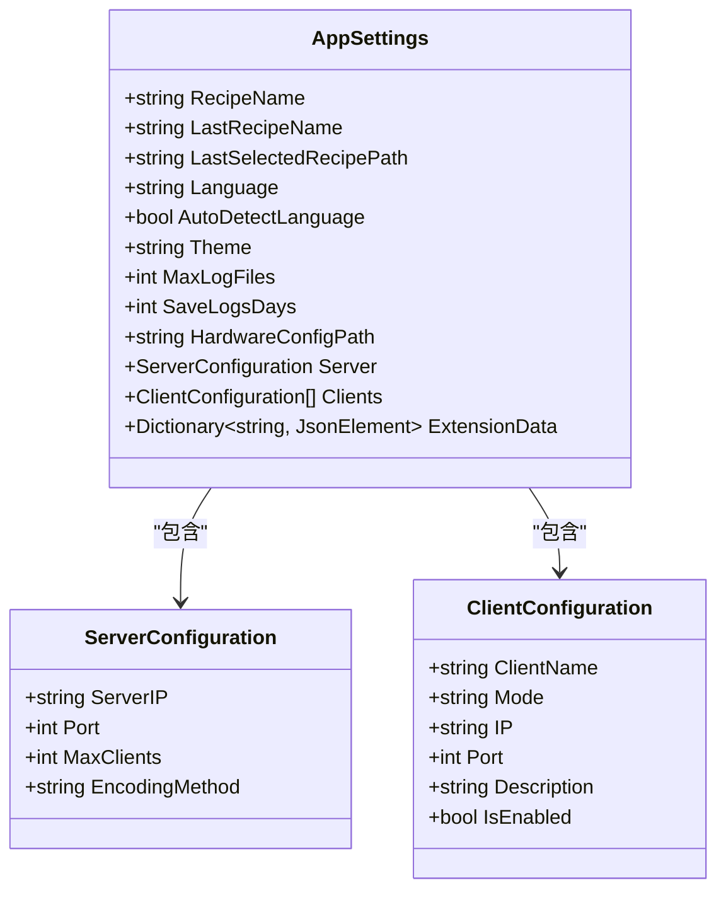
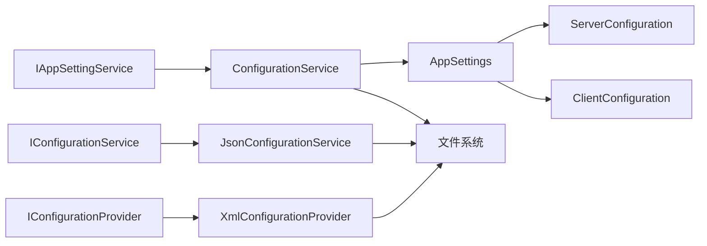

# 配置管理服务

<cite>
**本文引用的文件**
- [ConfigurationService.cs](file://Core/Services/ConfigurationService.cs)
- [JsonConfigurationService.cs](file://Core/Services/JsonConfigurationService.cs)
- [JsonPluginConfiguration.cs](file://Core/Services/JsonPluginConfiguration.cs)
- [XmlConfigurationProvider.cs](file://Core/XmlConfigurationProvider.cs)
- [IConfigurationService.cs](file://Core/Abstraction/IConfigurationService.cs)
- [IConfigurationProvider.cs](file://Core/Abstraction/IConfigurationProvider.cs)
- [IAppSettingService.cs](file://Core/Abstraction/IAppSettingService.cs)
- [AppSettings.cs](file://Core/Configuration/AppSettings.cs)
- [ClientConfiguration.cs](file://Core/Models/ClientConfiguration.cs)
- [appsettings.json](file://Core/appsettings.json)
- [App.xaml.cs](file://MainApp/App.xaml.cs)
</cite>

## 目录
1. [简介](#简介)
2. [项目结构](#项目结构)
3. [核心组件](#核心组件)
4. [架构总览](#架构总览)
5. [详细组件分析](#详细组件分析)
6. [依赖关系分析](#依赖关系分析)
7. [性能考虑](#性能考虑)
8. [故障排除指南](#故障排除指南)
9. [结论](#结论)
10. [附录](#附录)

## 简介
本文件面向配置管理服务的技术文档，重点解析以下组件与能力：
- ConfigurationService 与 IAppSettingService：应用设置的读取、写入、更新与扩展字段访问。
- JsonConfigurationService 与 IConfigurationService：通用 JSON 配置分节读写。
- JsonPluginConfiguration 与插件配置管理：按插件隔离的键值型配置持久化。
- XmlConfigurationProvider 与 IConfigurationProvider：基于 XML 的配置提供器，支持默认配置生成与向后兼容迁移。
- 接口抽象与序列化/反序列化流程：统一的配置读写契约与数据转换。
- 配置变更通知与错误处理策略：异常捕获、日志记录与回退机制。
- 配置优先级、默认值与验证规则：在不同提供器中的体现与建议实践。

## 项目结构
配置管理相关代码主要位于 Core 层，采用“接口抽象 + 多实现”的分层设计：
- 抽象层：IAppSettingService、IConfigurationService、IConfigurationProvider 定义统一契约。
- 实现层：ConfigurationService（应用设置）、JsonConfigurationService（通用 JSON 分节）、JsonPluginConfiguration（插件键值）、XmlConfigurationProvider（XML 提供器）。
- 数据模型：AppSettings、ClientConfiguration、ServerConfiguration 等承载配置数据结构。
- 配置文件：Core/appsettings.json（通用应用配置）、各实现负责的 JSON/XML 文件。

图示来源
- [ConfigurationService.cs:15-220](file://Core/Services/ConfigurationService.cs#L15-L220)
- [JsonConfigurationService.cs:8-60](file://Core/Services/JsonConfigurationService.cs#L8-L60)
- [JsonPluginConfiguration.cs:9-154](file://Core/Services/JsonPluginConfiguration.cs#L9-L154)
- [XmlConfigurationProvider.cs:9-227](file://Core/XmlConfigurationProvider.cs#L9-L227)
- [AppSettings.cs:10-39](file://Core/Configuration/AppSettings.cs#L10-L39)
- [ClientConfiguration.cs:4-23](file://Core/Models/ClientConfiguration.cs#L4-L23)
- [appsettings.json:1-13](file://Core/appsettings.json#L1-L13)

章节来源
- [ConfigurationService.cs:15-220](file://Core/Services/ConfigurationService.cs#L15-L220)
- [JsonConfigurationService.cs:8-60](file://Core/Services/JsonConfigurationService.cs#L8-L60)
- [JsonPluginConfiguration.cs:9-154](file://Core/Services/JsonPluginConfiguration.cs#L9-L154)
- [XmlConfigurationProvider.cs:9-227](file://Core/XmlConfigurationProvider.cs#L9-L227)
- [AppSettings.cs:10-39](file://Core/Configuration/AppSettings.cs#L10-L39)
- [ClientConfiguration.cs:4-23](file://Core/Models/ClientConfiguration.cs#L4-L23)
- [appsettings.json:1-13](file://Core/appsettings.json#L1-L13)

## 核心组件
- IAppSettingService：定义应用设置的加载、保存、重载、重置、配方名称更新、客户端增删查与扩展键值读取等能力。
- IConfigurationService：定义通用 JSON 配置的分节保存与加载。
- IConfigurationProvider：定义基于具体介质（如 XML）的配置读取、保存、存在性检查与默认配置创建。
- ConfigurationService：实现 IAppSettingService，负责应用设置的 JSON 文件读写、并发安全、默认值与扩展字段访问。
- JsonConfigurationService：实现 IConfigurationService，负责按“分节名.json”组织的通用配置读写。
- JsonPluginConfiguration：实现插件级配置的键值读写，按插件名隔离配置文件。
- XmlConfigurationProvider：实现 IConfigurationProvider，负责 XML 配置的读写、默认配置生成与旧格式迁移。

章节来源
- [IAppSettingService.cs:10-51](file://Core/Abstraction/IAppSettingService.cs#L10-L51)
- [IConfigurationService.cs:5-11](file://Core/Abstraction/IConfigurationService.cs#L5-L11)
- [IConfigurationProvider.cs:9-17](file://Core/Abstraction/IConfigurationProvider.cs#L9-L17)
- [ConfigurationService.cs:15-220](file://Core/Services/ConfigurationService.cs#L15-L220)
- [JsonConfigurationService.cs:8-60](file://Core/Services/JsonConfigurationService.cs#L8-L60)
- [JsonPluginConfiguration.cs:9-154](file://Core/Services/JsonPluginConfiguration.cs#L9-L154)
- [XmlConfigurationProvider.cs:9-227](file://Core/XmlConfigurationProvider.cs#L9-L227)

## 架构总览
配置管理通过接口抽象解耦不同介质与场景，核心流程如下：
- 应用启动时，通过 IAppSettingService 加载 AppSettings；同时可结合 Core/appsettings.json 提供基础配置。
- 业务模块可通过 IConfigurationService 读写独立的 JSON 分节配置。
- 插件通过 JsonPluginConfiguration 管理自身配置，避免命名冲突。
- XmlConfigurationProvider 用于需要 XML 格式的场景，并提供默认配置与旧格式迁移。

图示来源
- [ConfigurationService.cs:72-103](file://Core/Services/ConfigurationService.cs#L72-L103)
- [App.xaml.cs:96-108](file://MainApp/App.xaml.cs#L96-L108)

## 详细组件分析

### ConfigurationService 与 IAppSettingService
- 设计要点
  - 单实例、线程安全：内部使用锁对象保护读写。
  - 延迟加载：首次访问 Settings 时才加载文件。
  - 默认值与回退：文件缺失或反序列化失败时创建默认 AppSettings。
  - 扩展字段：通过 AppSettings.ExtensionData 捕获未显式映射的键值，支持 GetValue(key, default)。
  - 客户端管理：支持新增、删除、查询客户端，变更后自动保存。
  - 配方名称更新：TryUpdateRecipeName 带输入校验与历史备份。
- 关键流程
  - 加载：LoadSettings -> 读取文件 -> 反序列化 -> 异常回退。
  - 保存：SaveSettings -> 序列化 -> 写入文件 -> 异常记录。
  - 重置：ResetToDefaultAsync -> 清空内存设置 -> 保存默认。
  - 异步操作：SaveAsync、ReloadAsync、ResetToDefaultAsync 基于线程池执行同步逻辑。
- 错误处理
  - 文件读写异常被捕获并记录，必要时回退到默认配置。
  - GetValue 对非字符串类型元素进行安全处理，返回默认值。

图示来源
- [IAppSettingService.cs:10-51](file://Core/Abstraction/IAppSettingService.cs#L10-L51)
- [ConfigurationService.cs:15-220](file://Core/Services/ConfigurationService.cs#L15-L220)

章节来源
- [ConfigurationService.cs:15-220](file://Core/Services/ConfigurationService.cs#L15-L220)
- [IAppSettingService.cs:10-51](file://Core/Abstraction/IAppSettingService.cs#L10-L51)

### JsonConfigurationService 与 IConfigurationService
- 设计要点
  - 分节式 JSON：以“分节名.json”组织配置，路径位于 Config/Position 下。
  - 默认目录：构造函数确保目录存在，不存在则创建。
  - 类型安全：LoadConfiguration<T> 返回泛型实例，缺失文件或反序列化失败时返回默认实例。
  - 异常包装：保存/加载失败抛出包装后的 InvalidOperationException。
- 关键流程
  - 保存：序列化 -> 写入文件。
  - 加载：读取文件 -> 反序列化 -> 返回实例或默认值。
- 适用场景
  - 位置/路径类配置、设备参数、运行时参数等独立分节。

图示来源
- [JsonConfigurationService.cs:20-49](file://Core/Services/JsonConfigurationService.cs#L20-L49)

章节来源
- [JsonConfigurationService.cs:8-60](file://Core/Services/JsonConfigurationService.cs#L8-L60)
- [IConfigurationService.cs:5-11](file://Core/Abstraction/IConfigurationService.cs#L5-L11)

### JsonPluginConfiguration 与插件配置管理
- 设计要点
  - 插件隔离：每个插件拥有独立配置文件 Plugins/{PluginName}/config.json。
  - 键值型配置：以字典形式存储，支持异步读写与键存在性判断。
  - 类型转换：GetSettingAsync<T> 支持从 JsonElement 或基础类型转换为目标类型。
  - 默认行为：文件不存在时创建目录与默认配置文件。
- 关键流程
  - 加载：读取 JSON -> 反序列化字典 -> 异常回退为空字典。
  - 保存：序列化字典 -> 写入文件。
  - 删除：移除键 -> 保存。
- 适用场景
  - 插件参数、开关、阈值、路径等独立配置项。

图示来源
- [JsonPluginConfiguration.cs:31-77](file://Core/Services/JsonPluginConfiguration.cs#L31-L77)
- [JsonPluginConfiguration.cs:106-151](file://Core/Services/JsonPluginConfiguration.cs#L106-L151)

章节来源
- [JsonPluginConfiguration.cs:9-154](file://Core/Services/JsonPluginConfiguration.cs#L9-L154)

### XmlConfigurationProvider 与 IConfigurationProvider
- 设计要点
  - XML 读写：基于 System.Xml.Linq 的 XDocument/XElement。
  - 默认配置：CreateDefaultConfiguration 生成包含服务器与客户端的示例配置。
  - 向后兼容：MigrateFromLegacyFormat 支持旧版固定客户端节点迁移。
  - 日志集成：通过 ILoggerService 记录成功/失败信息与警告。
- 关键流程
  - 读取：文件存在则加载并反序列化，否则返回默认实例。
  - 保存：序列化为 XML 文档并保存。
  - 迁移：当未检测到新版 Clients 节点时，尝试从旧 Client1/Client2 节点迁移。
- 适用场景
  - 需要结构化 XML 的配置，如硬件配置、协议配置等。

图示来源
- [XmlConfigurationProvider.cs:25-103](file://Core/XmlConfigurationProvider.cs#L25-L103)
- [XmlConfigurationProvider.cs:158-187](file://Core/XmlConfigurationProvider.cs#L158-L187)

章节来源
- [XmlConfigurationProvider.cs:9-227](file://Core/XmlConfigurationProvider.cs#L9-L227)
- [IConfigurationProvider.cs:9-17](file://Core/Abstraction/IConfigurationProvider.cs#L9-L17)

### 配置数据模型与序列化/反序列化
- AppSettings
  - 字段：配方名称、语言、主题、日志策略、服务器与客户端集合、扩展字段等。
  - 扩展字段：通过 [JsonExtensionData] 捕获未显式映射的键值，支持 GetValue(key, default)。
- ClientConfiguration/ServerConfiguration
  - 客户端：名称、模式、IP、端口、描述、启用状态。
  - 服务器：IP、端口、最大客户端数、编码方式。
- 序列化选项
  - ConfigurationService：缩进输出、属性名大小写不敏感。
  - JsonPluginConfiguration：缩进输出。
  - JsonConfigurationService：Newtonsoft.Json 缩进输出。
  - XmlConfigurationProvider：手动构建 XML 文档并保存。

图示来源
- [AppSettings.cs:10-39](file://Core/Configuration/AppSettings.cs#L10-L39)
- [ClientConfiguration.cs:4-23](file://Core/Models/ClientConfiguration.cs#L4-L23)

章节来源
- [AppSettings.cs:10-39](file://Core/Configuration/AppSettings.cs#L10-L39)
- [ClientConfiguration.cs:4-23](file://Core/Models/ClientConfiguration.cs#L4-L23)

### 配置文件格式示例
- Core/appsettings.json（通用应用配置）
  - 示例结构：包含 AppSettings、ConnectionStrings 等顶层键。
- ConfigurationService 生成的配置文件
  - 路径：Config/appsettings.json（由 ConfigurationService 在构造时创建）。
  - 结构：包含 RecipeName、LastRecipeName、LastSelectedRecipePath、Language、Theme、Server、Clients 等。
- JsonConfigurationService 生成的配置文件
  - 路径：Config/Position/{sectionName}.json。
  - 结构：任意对象结构，按分节组织。
- JsonPluginConfiguration 生成的配置文件
  - 路径：Plugins/{PluginName}/config.json。
  - 结构：键值字典。
- XmlConfigurationProvider 生成的配置文件
  - 路径：Config/{any}.xml。
  - 结构：包含版本属性与 Configuration 根元素，内含 RecipeName、Server、Clients 等子元素。

章节来源
- [appsettings.json:1-13](file://Core/appsettings.json#L1-L13)
- [ConfigurationService.cs:62-69](file://Core/Services/ConfigurationService.cs#L62-L69)
- [JsonConfigurationService.cs:51-55](file://Core/Services/JsonConfigurationService.cs#L51-L55)
- [JsonPluginConfiguration.cs:22-26](file://Core/Services/JsonPluginConfiguration.cs#L22-L26)
- [XmlConfigurationProvider.cs:189-224](file://Core/XmlConfigurationProvider.cs#L189-L224)

### API 使用方法
- IAppSettingService
  - 加载/保存：Load()/Save() 或 SaveAsync()/ReloadAsync()/ResetToDefaultAsync()。
  - 配方管理：TryUpdateRecipeName(newName)、AddClient/RemoveClient/GetClient。
  - 扩展键值：GetValue(key, default)。
- IConfigurationService
  - 保存：SaveConfiguration(sectionName, format, config)。
  - 加载：LoadConfiguration<T>(sectionName)。
- IConfigurationProvider
  - 读取：GetConfiguration<T>()。
  - 保存：SaveConfiguration<T>(config)。
  - 默认：CreateDefaultConfiguration()。
- 插件配置
  - 读取：GetSettingAsync<T>(key)。
  - 写入：SaveSettingAsync<T>(key, value)。
  - 列表：GetAllSettingsAsync()、HasSetting(key)、RemoveSettingAsync(key)。

章节来源
- [IAppSettingService.cs:10-51](file://Core/Abstraction/IAppSettingService.cs#L10-L51)
- [IConfigurationService.cs:5-11](file://Core/Abstraction/IConfigurationService.cs#L5-L11)
- [IConfigurationProvider.cs:9-17](file://Core/Abstraction/IConfigurationProvider.cs#L9-L17)
- [JsonPluginConfiguration.cs:79-151](file://Core/Services/JsonPluginConfiguration.cs#L79-L151)

### 配置变更通知机制
- 当前实现未内置事件/通知机制。建议在保存后触发事件或使用观察者模式通知订阅者。
- 可通过扩展 ConfigurationService 的 SaveSettings/Save 方法，在保存成功后发布变更事件。

[本节为概念性建议，不直接分析具体文件]

### 配置优先级、默认值与验证规则
- 优先级
  - 运行时内存设置 > 文件持久化 > 默认值。
  - ConfigurationService 首次访问时加载文件，缺失则创建默认。
  - JsonConfigurationService 与 XmlConfigurationProvider 在文件缺失时返回默认实例。
- 默认值
  - AppSettings：多字段提供合理默认值（如语言 zh-CN、主题 Dark、日志天数 30 等）。
  - XmlConfigurationProvider：CreateDefaultConfiguration 提供示例配置。
- 验证规则
  - 输入校验：TryUpdateRecipeName 对空/空白进行拒绝。
  - 类型转换：JsonPluginConfiguration 的 GetSettingAsync<T> 通过序列化/转换实现类型安全。
  - 异常回退：读写异常时回退到默认值或空字典，保证系统可用性。

章节来源
- [ConfigurationService.cs:106-122](file://Core/Services/ConfigurationService.cs#L106-L122)
- [JsonPluginConfiguration.cs:79-104](file://Core/Services/JsonPluginConfiguration.cs#L79-L104)
- [XmlConfigurationProvider.cs:60-103](file://Core/XmlConfigurationProvider.cs#L60-L103)

## 依赖关系分析
- 接口与实现
  - IAppSettingService ← ConfigurationService
  - IConfigurationService ← JsonConfigurationService
  - IConfigurationProvider ← XmlConfigurationProvider
- 数据模型依赖
  - AppSettings 依赖 ServerConfiguration、List<ClientConfiguration>。
  - ExtensionData 依赖 System.Text.Json。
- 外部依赖
  - System.Text.Json（ConfigurationService、JsonPluginConfiguration）。
  - Newtonsoft.Json（JsonConfigurationService）。
  - System.Xml.Linq（XmlConfigurationProvider）。
  - 文件系统（所有实现均依赖）。

图示来源
- [IAppSettingService.cs:10-51](file://Core/Abstraction/IAppSettingService.cs#L10-L51)
- [IConfigurationService.cs:5-11](file://Core/Abstraction/IConfigurationService.cs#L5-L11)
- [IConfigurationProvider.cs:9-17](file://Core/Abstraction/IConfigurationProvider.cs#L9-L17)
- [ConfigurationService.cs:15-220](file://Core/Services/ConfigurationService.cs#L15-L220)
- [JsonConfigurationService.cs:8-60](file://Core/Services/JsonConfigurationService.cs#L8-L60)
- [XmlConfigurationProvider.cs:9-227](file://Core/XmlConfigurationProvider.cs#L9-L227)
- [AppSettings.cs:10-39](file://Core/Configuration/AppSettings.cs#L10-L39)
- [ClientConfiguration.cs:4-23](file://Core/Models/ClientConfiguration.cs#L4-L23)

章节来源
- [ConfigurationService.cs:15-220](file://Core/Services/ConfigurationService.cs#L15-L220)
- [JsonConfigurationService.cs:8-60](file://Core/Services/JsonConfigurationService.cs#L8-L60)
- [JsonPluginConfiguration.cs:9-154](file://Core/Services/JsonPluginConfiguration.cs#L9-L154)
- [XmlConfigurationProvider.cs:9-227](file://Core/XmlConfigurationProvider.cs#L9-L227)
- [AppSettings.cs:10-39](file://Core/Configuration/AppSettings.cs#L10-L39)
- [ClientConfiguration.cs:4-23](file://Core/Models/ClientConfiguration.cs#L4-L23)

## 性能考虑
- 序列化开销
  - ConfigurationService 与 JsonPluginConfiguration 使用 System.Text.Json，缩进输出会增加体积与 CPU 开销；在高频写入场景可考虑关闭缩进或延迟写入。
- 并发与锁
  - ConfigurationService 与 JsonPluginConfiguration 均使用细粒度锁保护；建议避免在锁内执行耗时操作。
- 文件 I/O
  - 频繁保存可能导致磁盘压力；可引入批处理/合并写入策略。
- 异步策略
  - ConfigurationService 的异步方法通过线程池执行同步逻辑；对于大量小写入，建议批量提交以减少 I/O 次数。

[本节提供一般性建议，不直接分析具体文件]

## 故障排除指南
- 加载失败
  - 现象：配置读取异常或返回默认值。
  - 排查：检查文件路径、权限、JSON/XML 格式合法性；查看日志输出。
  - 参考实现：ConfigurationService/JsonPluginConfiguration/XmlConfigurationProvider 在异常时记录并回退。
- 保存失败
  - 现象：保存抛出异常或文件未更新。
  - 排查：确认目录存在、磁盘空间、写权限；检查序列化选项与类型兼容性。
- 插件配置缺失
  - 现象：插件无法读取配置。
  - 排查：确认 Plugins/{PluginName}/config.json 是否存在；首次使用会自动创建默认文件。
- XML 迁移问题
  - 现象：旧版配置未正确迁移。
  - 排查：确认旧节点名称是否符合 Client1/Client2；查看日志提示。

章节来源
- [ConfigurationService.cs:153-175](file://Core/Services/ConfigurationService.cs#L153-L175)
- [JsonPluginConfiguration.cs:31-58](file://Core/Services/JsonPluginConfiguration.cs#L31-L58)
- [XmlConfigurationProvider.cs:25-43](file://Core/XmlConfigurationProvider.cs#L25-L43)
- [XmlConfigurationProvider.cs:158-187](file://Core/XmlConfigurationProvider.cs#L158-L187)

## 结论
配置管理服务通过清晰的接口抽象与多实现策略，覆盖了 JSON、XML、插件键值等多种配置场景。其核心优势在于：
- 易扩展：新增介质或场景只需实现对应接口。
- 稳健性：完善的异常捕获与默认回退，保障系统可用性。
- 可维护性：分节化与插件隔离降低耦合，便于团队协作与版本演进。

建议后续增强：
- 引入配置变更事件通知机制。
- 提供配置校验与约束框架。
- 优化序列化性能与批量写入策略。

[本节为总结性内容，不直接分析具体文件]

## 附录
- 初始化流程参考
  - 应用启动时通过容器解析 IAppSettingService 并调用 Load() 完成配置初始化。

章节来源
- [App.xaml.cs:96-108](file://MainApp/App.xaml.cs#L96-L108)