# 核心模块详解

<cite>
**本文档引用的文件**
- [Core/Core.csproj](file://Core/Core.csproj)
- [Framework/Framework.csproj](file://Framework/Framework.csproj)
- [MainApp/MainApp.csproj](file://MainApp/MainApp.csproj)
- [Module/Module.csproj](file://Module/Module.csproj)
- [Core/Abstraction/IStationRegistry.cs](file://Core/Abstraction/IStationRegistry.cs)
- [Core/Services/StationRegistry.cs](file://Core/Services/StationRegistry.cs)
- [Core/Services/LocalizationService.cs](file://Core/Services/LocalizationService.cs)
- [Core/Services/ConfigurationService.cs](file://Core/Services/ConfigurationService.cs)
- [Core/Services/ParameterService.cs](file://Core/Services/ParameterService.cs)
- [Core/Logging/LogMessages.cs](file://Core/Logging/LogMessages.cs)
- [Framework/Services/DialogService.cs](file://Framework/Services/DialogService.cs)
- [Framework/Services/ParameterDialogService.cs](file://Framework/Services/ParameterDialogService.cs)
- [Framework/ViewModels/ParameterEditorViewModel.cs](file://Framework/ViewModels/ParameterEditorViewModel.cs)
- [MainApp/App.xaml.cs](file://MainApp/App.xaml.cs)
- [Module/PrimModel.cs](file://Module/PrimModel.cs)
</cite>

## 目录
1. [简介](#简介)
2. [项目结构](#项目结构)
3. [核心组件](#核心组件)
4. [架构总览](#架构总览)
5. [详细组件分析](#详细组件分析)
6. [依赖关系分析](#依赖关系分析)
7. [性能考虑](#性能考虑)
8. [故障排除指南](#故障排除指南)
9. [结论](#结论)
10. [附录](#附录)

## 简介
本文件面向GZQL_MACHINE项目的GZQL_MACHINE核心模块，系统化梳理Core核心服务层、Framework框架支撑层、MainApp主应用程序层与Module主功能模块的职责边界、交互关系与实现要点。重点覆盖以下方面：
- Core核心服务层：配置管理、本地化服务、日志系统、工站注册表等基础设施能力
- Framework框架支撑层：UI组件库、对话框服务、参数编辑器等通用工具
- MainApp主应用程序层：生命周期管理、模块初始化流程
- Module主功能模块：业务逻辑实现与导航集成
- 为每个模块提供API参考、使用示例与最佳实践指导

## 项目结构
项目采用多项目解决方案，以Core为核心基础，Framework提供UI与对话框能力，MainApp负责应用生命周期与模块装配，Module承载业务功能与导航。

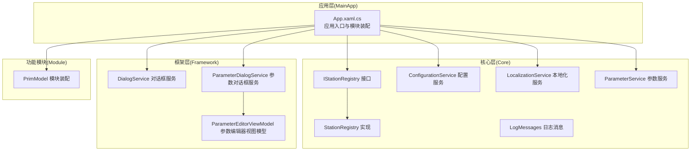

**图表来源**
- [MainApp/App.xaml.cs:110-191](file://MainApp/App.xaml.cs#L110-L191)
- [Core/Abstraction/IStationRegistry.cs:1-21](file://Core/Abstraction/IStationRegistry.cs#L1-L21)
- [Core/Services/StationRegistry.cs:14-45](file://Core/Services/StationRegistry.cs#L14-L45)
- [Core/Services/ConfigurationService.cs:15-220](file://Core/Services/ConfigurationService.cs#L15-L220)
- [Core/Services/LocalizationService.cs:18-353](file://Core/Services/LocalizationService.cs#L18-L353)
- [Core/Services/ParameterService.cs:12-86](file://Core/Services/ParameterService.cs#L12-L86)
- [Core/Logging/LogMessages.cs:7-37](file://Core/Logging/LogMessages.cs#L7-L37)
- [Framework/Services/DialogService.cs:14-432](file://Framework/Services/DialogService.cs#L14-L432)
- [Framework/Services/ParameterDialogService.cs:10-49](file://Framework/Services/ParameterDialogService.cs#L10-L49)
- [Framework/ViewModels/ParameterEditorViewModel.cs:28-511](file://Framework/ViewModels/ParameterEditorViewModel.cs#L28-L511)
- [Module/PrimModel.cs:21-116](file://Module/PrimModel.cs#L21-L116)

**章节来源**
- [MainApp/MainApp.csproj:1-83](file://MainApp/MainApp.csproj#L1-L83)
- [Core/Core.csproj:1-44](file://Core/Core.csproj#L1-L44)
- [Framework/Framework.csproj:1-38](file://Framework/Framework.csproj#L1-L38)
- [Module/Module.csproj:1-630](file://Module/Module.csproj#L1-L630)

## 核心组件
本节聚焦Core核心服务层的关键组件及其职责与接口契约。

- 工站注册表 IStationRegistry/StationRegistry
  - 职责：提供线程安全的工站注册与查询，解决模块加载时序导致的注入为空问题
  - 关键接口：Register、Unregister、GetAllStations、GetStation
  - 实现要点：基于并发字典维护工站集合，发布注册/注销事件

- 配置服务 ConfigurationService
  - 职责：提供应用配置的加载、保存、异步重载与默认重置；支持扩展字段读取
  - 关键接口：Load、Save、SaveAsync、ReloadAsync、ResetToDefaultAsync、GetValue
  - 数据持久化：JSON文件，线程安全锁保护

- 本地化服务 LocalizationService
  - 职责：语言切换、区域性设置、资源字典动态替换、事件发布
  - 关键接口：SetLanguage、GetResource、GetResourceOrDefault、TryGetResource
  - 事件：LanguageChanged、LanguageChangedEvent（Prism）

- 参数服务 ParameterService
  - 职责：参数组加载、保存、重置为默认值
  - 关键接口：LoadParametersAsync、SaveParametersAsync、ResetToDefaultsAsync
  - 数据模型：ParameterGroup/ParameterItem（含字符串、数值、布尔、枚举、颜色等）

- 日志消息 LogMessages
  - 职责：日志消息的本地化初始化与访问
  - 关键接口：Initialize、EnsureInitialized、Localization

**章节来源**
- [Core/Abstraction/IStationRegistry.cs:7-20](file://Core/Abstraction/IStationRegistry.cs#L7-L20)
- [Core/Services/StationRegistry.cs:14-45](file://Core/Services/StationRegistry.cs#L14-L45)
- [Core/Services/ConfigurationService.cs:15-220](file://Core/Services/ConfigurationService.cs#L15-L220)
- [Core/Services/LocalizationService.cs:18-353](file://Core/Services/LocalizationService.cs#L18-L353)
- [Core/Services/ParameterService.cs:12-86](file://Core/Services/ParameterService.cs#L12-L86)
- [Core/Logging/LogMessages.cs:7-37](file://Core/Logging/LogMessages.cs#L7-L37)

## 架构总览
下图展示应用启动到模块装配、服务注册与事件驱动的整体流程。

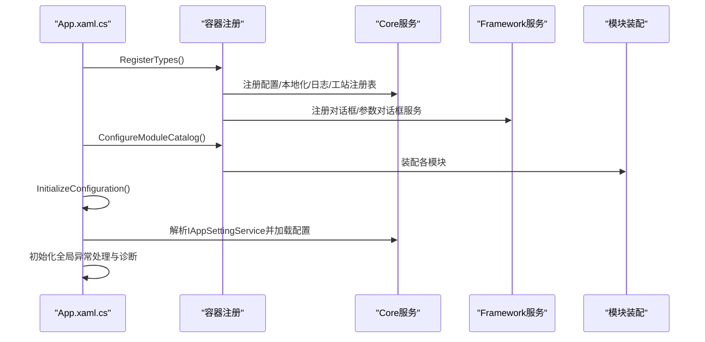

**图表来源**
- [MainApp/App.xaml.cs:110-191](file://MainApp/App.xaml.cs#L110-L191)
- [MainApp/App.xaml.cs:96-108](file://MainApp/App.xaml.cs#L96-L108)

## 详细组件分析

### 工站注册表 IStationRegistry/StationRegistry
- 设计模式：接口隔离 + 单例注册 + 事件发布
- 并发控制：ConcurrentDictionary保证线程安全
- 事件机制：通过Prism事件聚合器发布注册/注销事件
- 使用场景：模块化加载时，工站在创建阶段自动注册，消费者通过接口查询

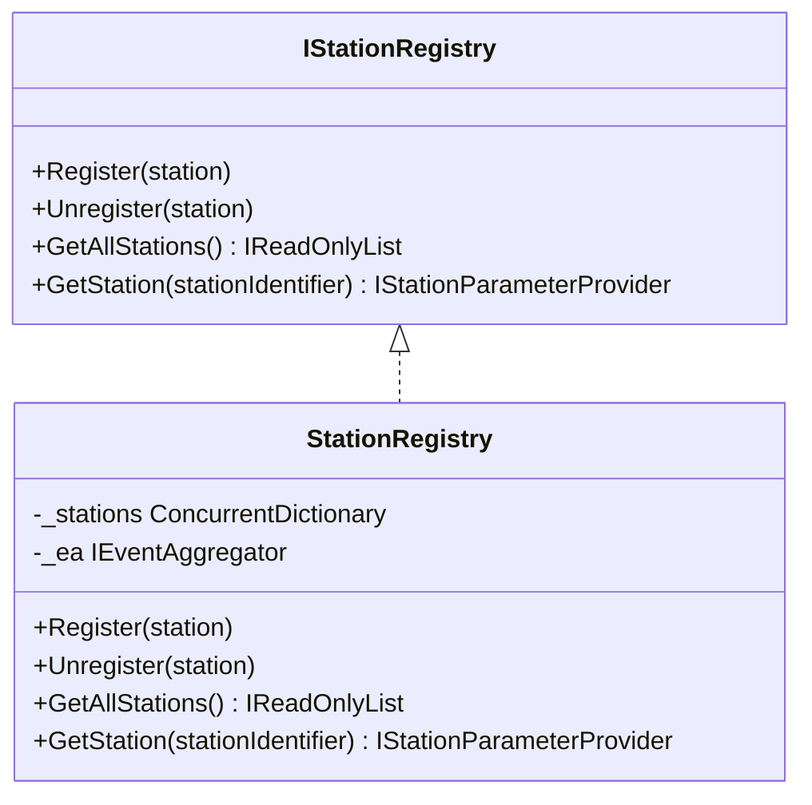

**图表来源**
- [Core/Abstraction/IStationRegistry.cs:7-20](file://Core/Abstraction/IStationRegistry.cs#L7-L20)
- [Core/Services/StationRegistry.cs:14-45](file://Core/Services/StationRegistry.cs#L14-L45)

**章节来源**
- [Core/Abstraction/IStationRegistry.cs:7-20](file://Core/Abstraction/IStationRegistry.cs#L7-L20)
- [Core/Services/StationRegistry.cs:14-45](file://Core/Services/StationRegistry.cs#L14-L45)

### 配置服务 ConfigurationService
- 文件策略：Config/appsettings.JSON，不存在时创建默认配置
- 线程安全：读写加锁，避免并发冲突
- 扩展字段：通过扩展数据字典支持任意键值读取
- 异步能力：SaveAsync、ReloadAsync、ResetToDefaultAsync

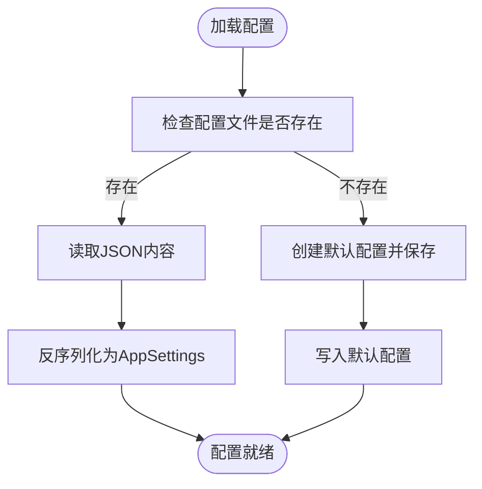

**图表来源**
- [Core/Services/ConfigurationService.cs:52-203](file://Core/Services/ConfigurationService.cs#L52-L203)

**章节来源**
- [Core/Services/ConfigurationService.cs:15-220](file://Core/Services/ConfigurationService.cs#L15-L220)

### 本地化服务 LocalizationService
- 语言列表：内置中英文，支持排序与图标
- 区域性：更新线程Culture/UI Culture，替换XAML资源字典
- 动态刷新：LangExtension失效刷新，触发Prism语言变更事件
- 配置持久化：保存语言到应用设置

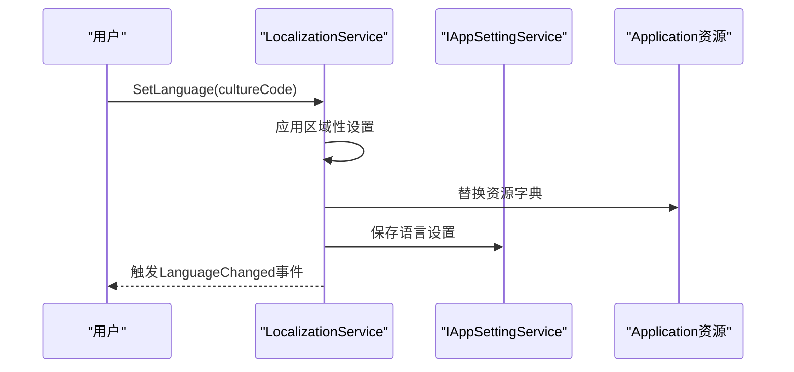

**图表来源**
- [Core/Services/LocalizationService.cs:129-161](file://Core/Services/LocalizationService.cs#L129-L161)
- [Core/Services/LocalizationService.cs:235-251](file://Core/Services/LocalizationService.cs#L235-L251)

**章节来源**
- [Core/Services/LocalizationService.cs:18-353](file://Core/Services/LocalizationService.cs#L18-L353)

### 参数服务 ParameterService
- 参数模型：ParameterGroup/ParameterItem（字符串、数值、布尔、枚举、颜色）
- 异步操作：加载、保存、重置为默认值
- 用途：为参数编辑器提供数据源

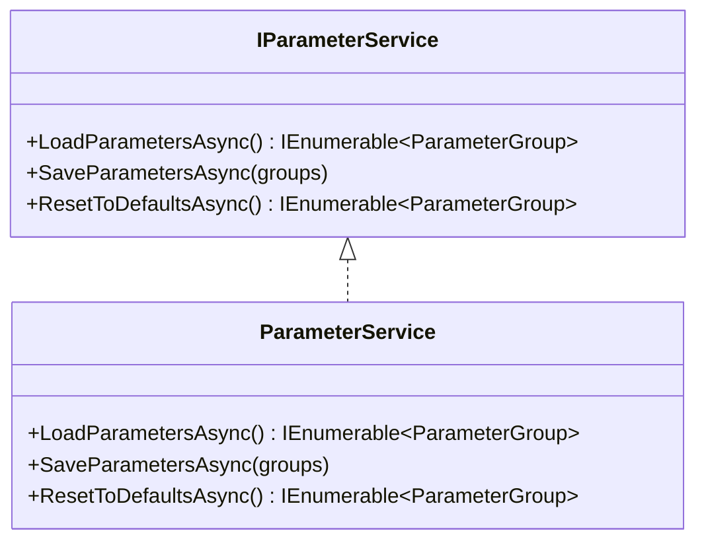

**图表来源**
- [Core/Services/ParameterService.cs:12-86](file://Core/Services/ParameterService.cs#L12-L86)

**章节来源**
- [Core/Services/ParameterService.cs:12-86](file://Core/Services/ParameterService.cs#L12-L86)

### 日志消息 LogMessages
- 初始化：RequireLocalization初始化，确保本地化服务可用
- 访问：提供静态入口获取本地化后的日志消息

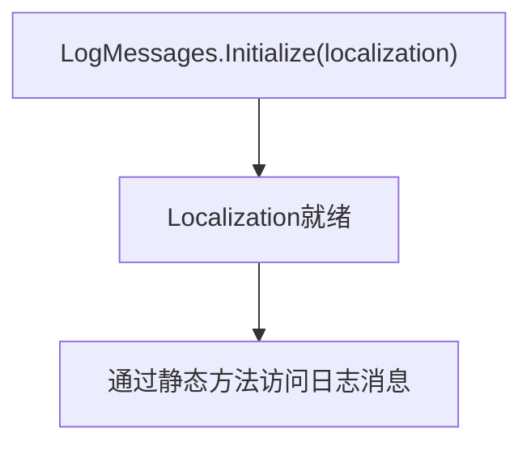

**图表来源**
- [Core/Logging/LogMessages.cs:13-28](file://Core/Logging/LogMessages.cs#L13-L28)

**章节来源**
- [Core/Logging/LogMessages.cs:7-37](file://Core/Logging/LogMessages.cs#L7-L37)

### 对话框服务 Framework/Services/DialogService
- 能力：阻塞/非阻塞对话框、异步对话框、Toast提示、全部关闭
- 线程安全：Dispatcher调度，STA线程运行对话框
- 状态跟踪：并发字典跟踪打开的对话框句柄

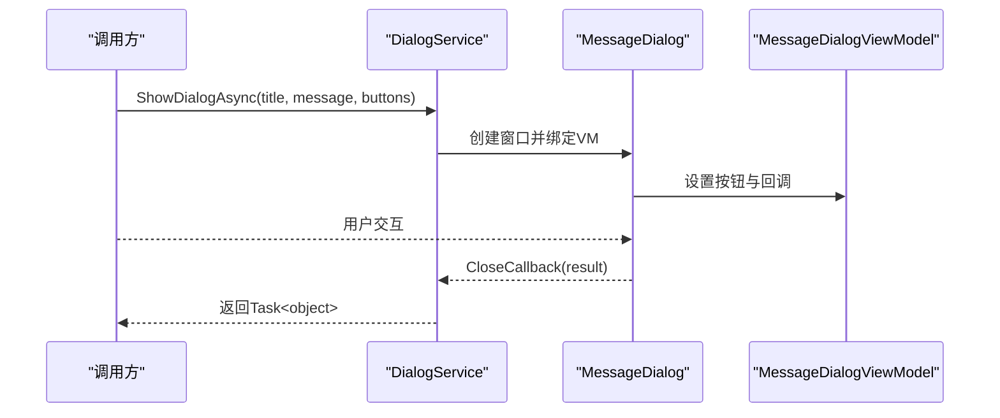

**图表来源**
- [Framework/Services/DialogService.cs:244-408](file://Framework/Services/DialogService.cs#L244-L408)

**章节来源**
- [Framework/Services/DialogService.cs:14-432](file://Framework/Services/DialogService.cs#L14-L432)

### 参数对话框服务 Framework/Services/ParameterDialogService
- 职责：封装Prism对话框服务，统一参数编辑器对话框调用
- 参数：标题、参数对象、保存回调、工站标识
- 结果：返回是否OK

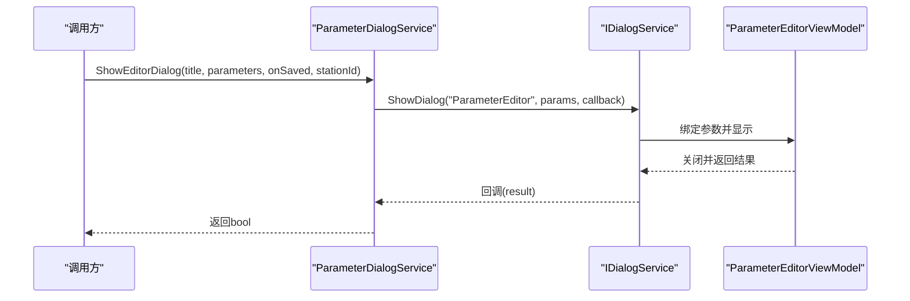

**图表来源**
- [Framework/Services/ParameterDialogService.cs:19-46](file://Framework/Services/ParameterDialogService.cs#L19-L46)

**章节来源**
- [Framework/Services/ParameterDialogService.cs:10-49](file://Framework/Services/ParameterDialogService.cs#L10-L49)

### 参数编辑器视图模型 Framework/ViewModels/ParameterEditorViewModel
- 职责：参数加载、搜索过滤、应用更改、重置默认、保存回调、事件发布
- 数据绑定：ObservableCollection<ParameterGroup>
- 类型转换：支持数值、枚举、布尔等类型转换
- 事件：StationParameterSavedEvent（发布工站参数保存事件）

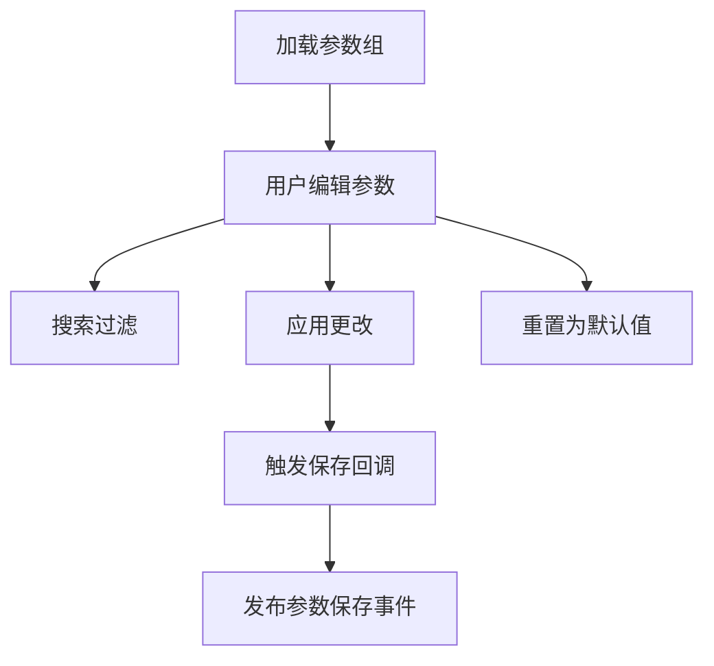

**图表来源**
- [Framework/ViewModels/ParameterEditorViewModel.cs:88-161](file://Framework/ViewModels/ParameterEditorViewModel.cs#L88-L161)
- [Framework/ViewModels/ParameterEditorViewModel.cs:238-263](file://Framework/ViewModels/ParameterEditorViewModel.cs#L238-L263)

**章节来源**
- [Framework/ViewModels/ParameterEditorViewModel.cs:28-511](file://Framework/ViewModels/ParameterEditorViewModel.cs#L28-L511)

### 主应用程序层 MainApp/App.xaml.cs
- 生命周期：构造函数注册全局异常处理；OnInitialized进行服务初始化
- 服务注册：注册Core与Framework服务、配置服务、模块目录
- 配置初始化：解析IAppSettingService并加载配置
- 模块装配：注册多个模块（日志查看、语言、框架、报警、运动控制、配方、工站任务、ModuleCore、Module、TCPIP）

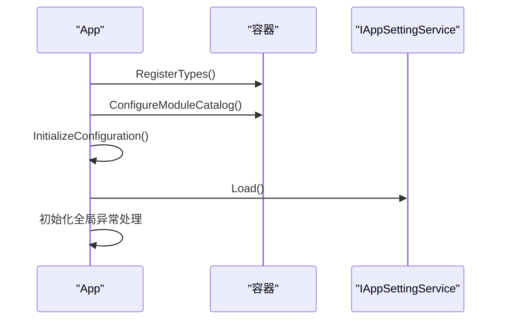

**图表来源**
- [MainApp/App.xaml.cs:59-72](file://MainApp/App.xaml.cs#L59-L72)
- [MainApp/App.xaml.cs:110-191](file://MainApp/App.xaml.cs#L110-L191)
- [MainApp/App.xaml.cs:96-108](file://MainApp/App.xaml.cs#L96-L108)

**章节来源**
- [MainApp/App.xaml.cs:34-460](file://MainApp/App.xaml.cs#L34-L460)

### 主功能模块 Module/PrimModel
- 模块装配：注册对话框与导航视图，建立导航项（首页、操作页面、报警、IO视图、配方管理、TCPIP设置等）
- 服务注册：注册Core服务（公式求值、DXF解析、ROI工具、坐标对齐）、Module服务（点胶执行、点胶服务）、进程序列服务
- 导航模型：通过NavigateModel填充导航列表

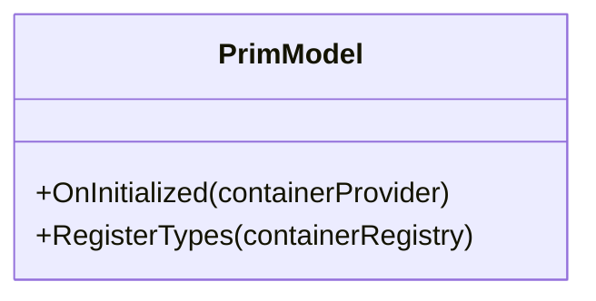

**图表来源**
- [Module/PrimModel.cs:21-116](file://Module/PrimModel.cs#L21-L116)

**章节来源**
- [Module/PrimModel.cs:21-116](file://Module/PrimModel.cs#L21-L116)

## 依赖关系分析
- 项目依赖
  - Core依赖HalconWrapper与第三方包（NLog、Prism、MathNet等）
  - Framework依赖Core，并引入MaterialDesign与Prism
  - MainApp依赖Core、Framework及各功能模块
  - Module依赖Core、Framework、HalconWrapper与各功能模块

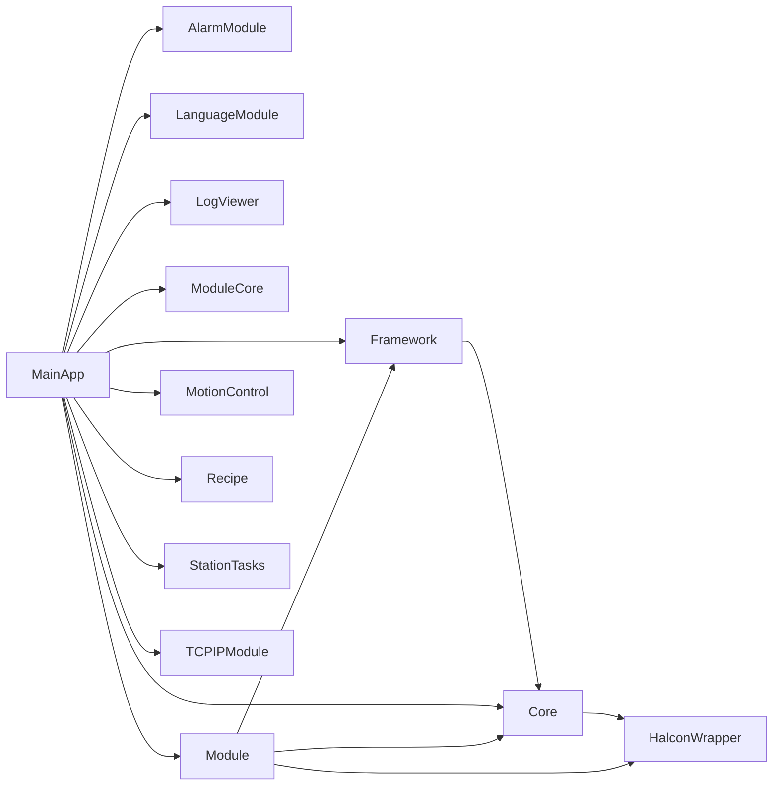

**图表来源**
- [Core/Core.csproj:21-40](file://Core/Core.csproj#L21-L40)
- [Framework/Framework.csproj:28-29](file://Framework/Framework.csproj#L28-L29)
- [MainApp/MainApp.csproj:28-39](file://MainApp/MainApp.csproj#L28-L39)
- [Module/Module.csproj:619-629](file://Module/Module.csproj#L619-L629)

**章节来源**
- [Core/Core.csproj:1-44](file://Core/Core.csproj#L1-L44)
- [Framework/Framework.csproj:1-38](file://Framework/Framework.csproj#L1-L38)
- [MainApp/MainApp.csproj:1-83](file://MainApp/MainApp.csproj#L1-L83)
- [Module/Module.csproj:1-630](file://Module/Module.csproj#L1-L630)

## 性能考虑
- 配置服务
  - JSON序列化/反序列化：建议在后台线程执行异步SaveAsync/ReloadAsync
  - 文件I/O：避免频繁写入，合并多次变更后再保存
- 本地化服务
  - 资源字典替换：尽量减少频繁切换语言，批量更新
- 对话框服务
  - STA线程与Dispatcher：避免在非UI线程直接创建窗口
- 参数编辑器
  - 大量参数时采用虚拟化列表与延迟加载
  - 类型转换与反射：缓存属性元数据，减少重复反射开销

## 故障排除指南
- 未处理异常
  - 应用程序注册了Dispatcher、Domain、TaskScheduler三类异常处理器，生成崩溃转储与错误报告
  - 建议检查CrashDumps与ErrorReports目录定位问题
- 配置加载失败
  - 检查Config/appsettings.JSON权限与格式；必要时调用ResetToDefaultAsync重建默认配置
- 语言切换无效
  - 确认资源字典路径与CultureCode正确；检查LangExtension刷新逻辑
- 对话框无法显示
  - 确保在UI线程调用；检查Dispatcher可用性与Owner设置

**章节来源**
- [MainApp/App.xaml.cs:343-455](file://MainApp/App.xaml.cs#L343-L455)
- [Core/Services/ConfigurationService.cs:153-203](file://Core/Services/ConfigurationService.cs#L153-L203)
- [Core/Services/LocalizationService.cs:166-198](file://Core/Services/LocalizationService.cs#L166-L198)
- [Framework/Services/DialogService.cs:87-132](file://Framework/Services/DialogService.cs#L87-L132)

## 结论
GZQL_MACHINE通过Core提供稳定的基础设施（配置、本地化、日志、工站注册），Framework提供一致的UI与对话框体验，MainApp负责生命周期与模块装配，Module承载业务导航与功能实现。整体采用Prism模块化与依赖注入，具备良好的扩展性与可维护性。建议在生产环境中强化异常监控与配置校验，持续优化参数编辑器的性能与用户体验。

## 附录

### API参考与使用示例

- 工站注册表
  - 接口：IStationRegistry
  - 方法：Register、Unregister、GetAllStations、GetStation
  - 使用示例：在工站初始化时调用Register；在需要时通过GetAllStations遍历

- 配置服务
  - 接口：IAppSettingService
  - 方法：Load、Save、SaveAsync、ReloadAsync、ResetToDefaultAsync、GetValue
  - 使用示例：应用启动时解析IAppSettingService并Load；业务中通过GetValue读取扩展配置

- 本地化服务
  - 方法：SetLanguage、GetResource、GetResourceOrDefault、TryGetResource
  - 使用示例：用户切换语言后调用SetLanguage；界面通过GetResource获取本地化文本

- 参数服务
  - 方法：LoadParametersAsync、SaveParametersAsync、ResetToDefaultsAsync
  - 使用示例：参数编辑器初始化时调用LoadParametersAsync；保存时调用SaveParametersAsync

- 对话框服务
  - 方法：ShowDialogAsync、ShowBlockingDialog、ShowNonBlockingDialog、ShowToastAsync、CloseAllDialogs
  - 使用示例：统一通过DialogService显示提示与确认对话框

- 参数对话框服务
  - 方法：ShowEditorDialog
  - 使用示例：调用ShowEditorDialog传入参数对象与保存回调

- 参数编辑器视图模型
  - 方法：ApplyChanges、ResetToDefaults、OnDialogOpened
  - 使用示例：在对话框打开时传入参数对象；保存时触发回调并发布事件

**章节来源**
- [Core/Abstraction/IStationRegistry.cs:7-20](file://Core/Abstraction/IStationRegistry.cs#L7-L20)
- [Core/Services/ConfigurationService.cs:15-220](file://Core/Services/ConfigurationService.cs#L15-L220)
- [Core/Services/LocalizationService.cs:18-353](file://Core/Services/LocalizationService.cs#L18-L353)
- [Core/Services/ParameterService.cs:12-86](file://Core/Services/ParameterService.cs#L12-L86)
- [Framework/Services/DialogService.cs:14-432](file://Framework/Services/DialogService.cs#L14-L432)
- [Framework/Services/ParameterDialogService.cs:10-49](file://Framework/Services/ParameterDialogService.cs#L10-L49)
- [Framework/ViewModels/ParameterEditorViewModel.cs:28-511](file://Framework/ViewModels/ParameterEditorViewModel.cs#L28-L511)

### 最佳实践
- 配置管理
  - 使用异步保存与重载，避免阻塞UI线程
  - 对关键配置增加校验与回滚机制
- 本地化
  - 优先使用资源字典键名，避免硬编码文本
  - 切换语言后及时刷新所有LangExtension实例
- 对话框
  - 统一使用DialogService，避免直接创建窗口
  - 对于长时间操作，提供进度或Toast反馈
- 参数编辑
  - 使用特性标注参数（如Category、Range、DisplayFormat）提升可维护性
  - 对大对象属性（如List<PointF>）进行特殊处理或忽略
- 模块化
  - 严格遵循Prism模块接口，避免循环依赖
  - 在OnInitialized中完成导航与服务绑定