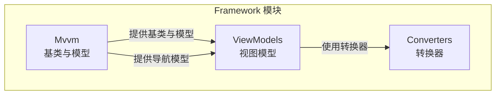
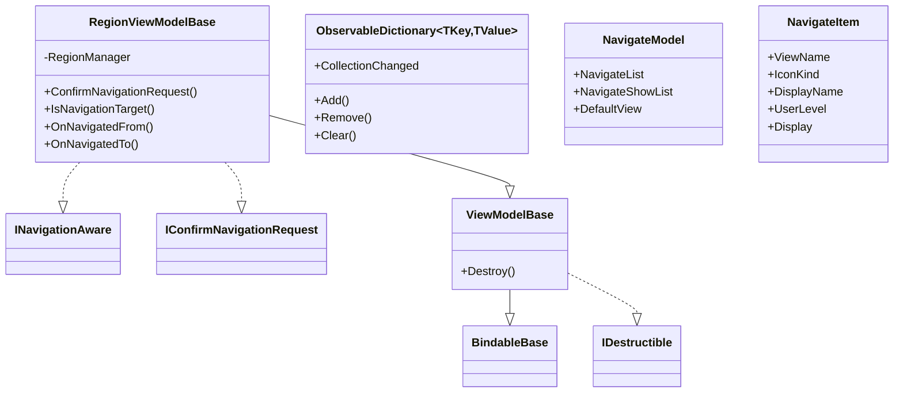
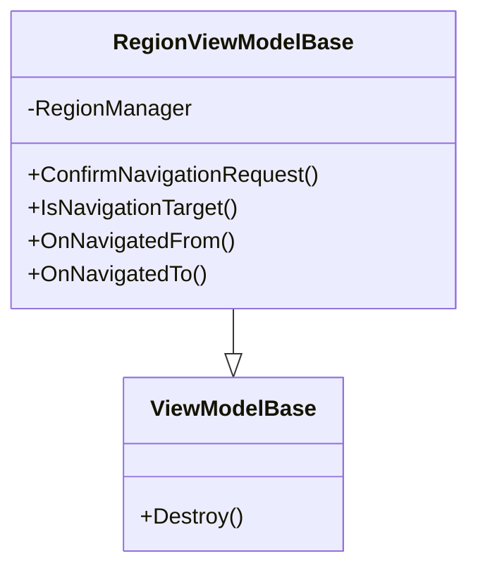
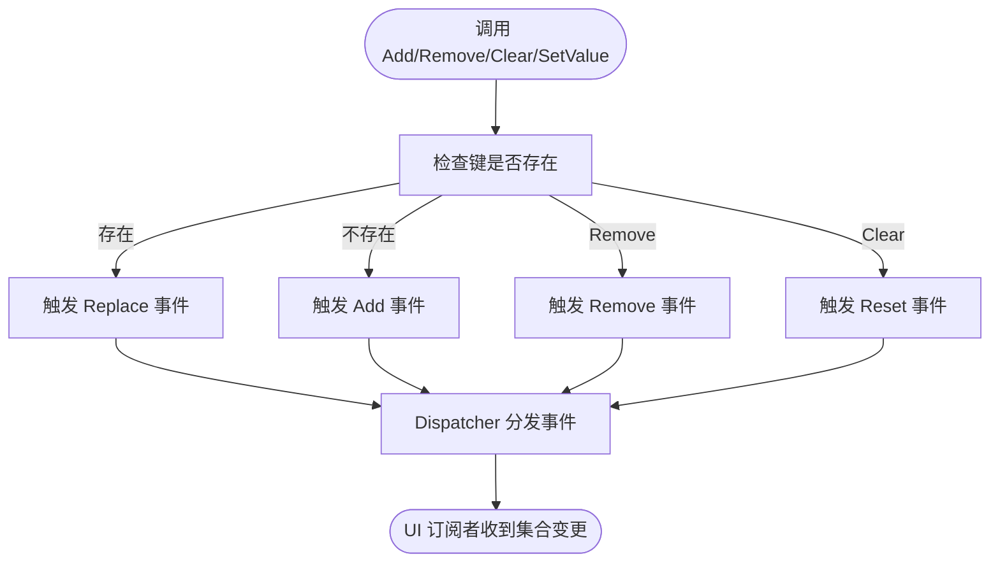
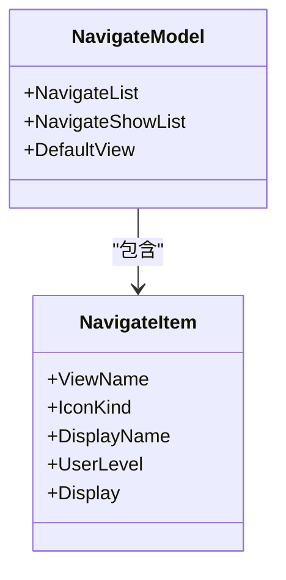
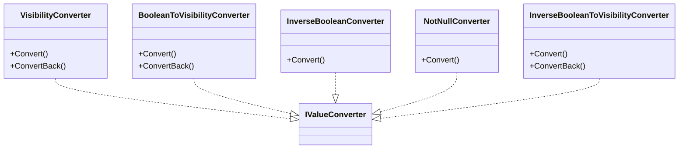
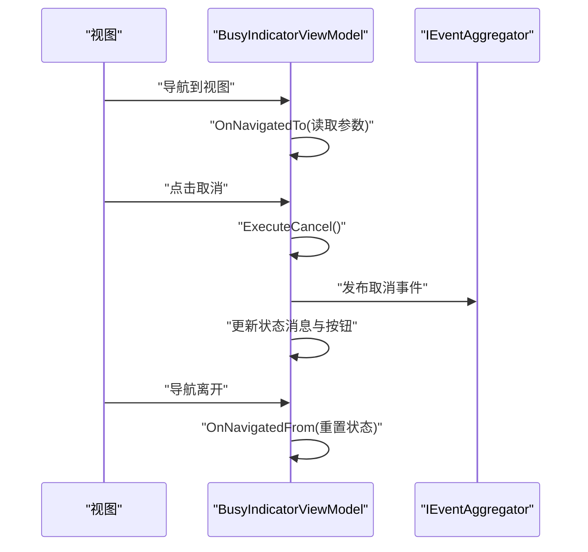
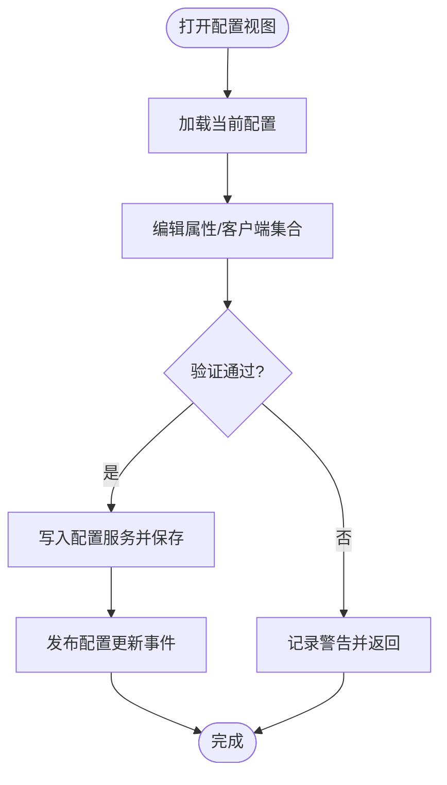
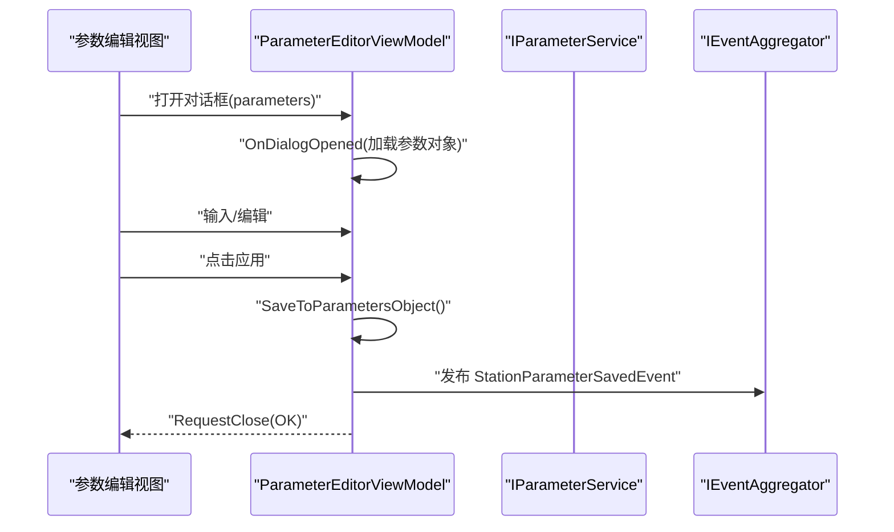
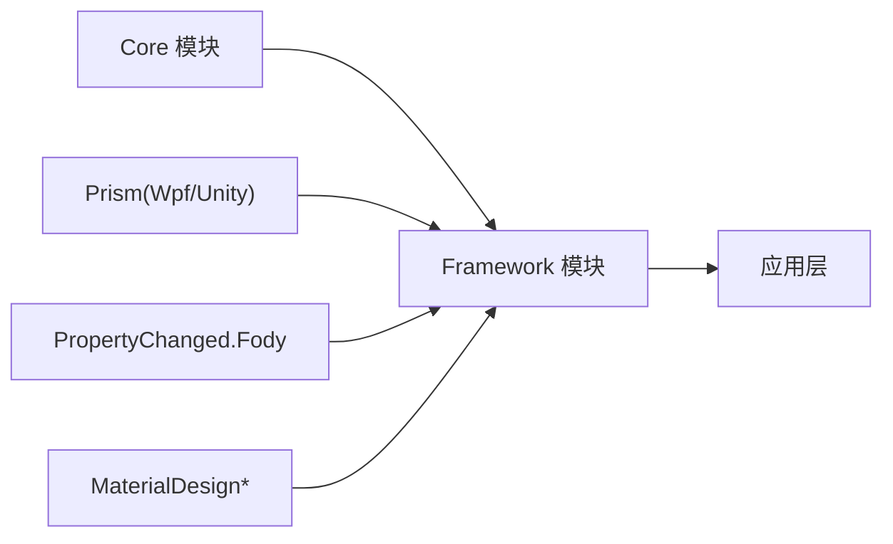

# MVVM框架与基类

<cite>
**本文引用的文件**
- [Framework.csproj](file://Framework/Framework.csproj)
- [ViewModelBase.cs](file://Framework/Mvvm/ViewModelBase.cs)
- [RegionViewModelBase.cs](file://Framework/Mvvm/RegionViewModelBase.cs)
- [ObservableDictionary.cs](file://Framework/Mvvm/ObservableDictionary.cs)
- [NavigateModel.cs](file://Framework/Mvvm/NavigateModel.cs)
- [NavigateItem.cs](file://Framework/Mvvm/NavigateItem.cs)
- [VisibilityConverter.cs](file://Framework/Mvvm/VisibilityConverter.cs)
- [BusyIndicatorViewModel.cs](file://Framework/ViewModels/BusyIndicatorViewModel.cs)
- [ConfigurationViewModel.cs](file://Framework/ViewModels/ConfigurationViewModel.cs)
- [GlobalVariablesViewModel.cs](file://Framework/ViewModels/GlobalVariablesViewModel.cs)
- [ParameterEditorViewModel.cs](file://Framework/ViewModels/ParameterEditorViewModel.cs)
- [RecipeEditorDialogViewModel.cs](file://Framework/ViewModels/RecipeEditorDialogViewModel.cs)
- [RecipeSelectionDialogViewModel.cs](file://Framework/ViewModels/RecipeSelectionDialogViewModel.cs)
- [BooleanToVisibilityConverter.cs](file://Framework/Converters/BooleanToVisibilityConverter.cs)
- [InverseBooleanConverter.cs](file://Framework/Converters/InverseBooleanConverter.cs)
- [NotNullConverter.cs](file://Framework/Converters/NotNullConverter.cs)
- [InverseBooleanToVisibilityConverter.cs](file://Framework/Converters/InverseBooleanToVisibilityConverter.cs)
</cite>

## 目录
1. [简介](#简介)
2. [项目结构](#项目结构)
3. [核心组件](#核心组件)
4. [架构总览](#架构总览)
5. [组件详解](#组件详解)
6. [依赖关系分析](#依赖关系分析)
7. [性能考量](#性能考量)
8. [故障排查指南](#故障排查指南)
9. [结论](#结论)
10. [附录](#附录)

## 简介
本文件系统性梳理 Framework 模块中的 MVVM 基础设施与常用视图模型，重点覆盖以下主题：
- 基类设计：ViewModelBase、RegionViewModelBase 的职责与继承关系
- 数据绑定与集合：ObservableDictionary 的实现与在绑定中的应用
- 导航管理：NavigateModel 与 NavigateItem 的导航模型与展示列表
- 常用视图模型：BusyIndicatorViewModel、ConfigurationViewModel、GlobalVariablesViewModel、ParameterEditorViewModel、RecipeEditorDialogViewModel、RecipeSelectionDialogViewModel 的职责、命令与状态管理
- 转换器体系：VisibilityConverter 与常用布尔/可见性转换器的使用与扩展
- 数据绑定模式、命令模式、属性变更通知机制

## 项目结构
Framework 模块采用 WPF + Prism 的 MVVM 架构，核心目录组织如下：
- Mvvm：MVVM 基类与通用模型（ViewModelBase、RegionViewModelBase、ObservableDictionary、NavigateModel、NavigateItem、VisibilityConverter）
- ViewModels：业务相关视图模型（BusyIndicatorViewModel、ConfigurationViewModel、GlobalVariablesViewModel、ParameterEditorViewModel、对话框相关视图模型）
- Converters：XAML 绑定转换器（布尔到可见性、取反、非空判断等）

图表来源
- [Framework.csproj:1-38](file://Framework/Framework.csproj#L1-L38)

章节来源
- [Framework.csproj:1-38](file://Framework/Framework.csproj#L1-L38)

## 核心组件
本节聚焦于 MVVM 基类与通用模型，阐明设计理念与使用方法。

- ViewModelBase：基于 Prism 的 BindableBase，提供统一的属性变更通知能力，并声明销毁接口 IDestructible 的空实现，便于派生类按需覆写
- RegionViewModelBase：在 ViewModelBase 基础上实现 Prism 的导航接口，提供导航目标判定、进入/离开导航时的钩子以及导航确认回调
- ObservableDictionary：在标准 Dictionary 之上实现 INotifyCollectionChanged，支持 Add/Remove/Clear 等操作触发集合变更事件，并通过 Dispatcher 在 UI 线程分发事件
- NavigateModel：封装导航列表 NavigateList 与展示列表 NavigateShowList，以及默认视图名称 DefaultView
- NavigateItem：导航项实体，包含视图名、图标、显示名、用户等级、显示开关等属性
- VisibilityConverter：布尔到可见性的单向转换器，用于将 true/false 映射为 Visible/Collapsed

章节来源
- [ViewModelBase.cs:1-16](file://Framework/Mvvm/ViewModelBase.cs#L1-L16)
- [RegionViewModelBase.cs:1-33](file://Framework/Mvvm/RegionViewModelBase.cs#L1-L33)
- [ObservableDictionary.cs:1-123](file://Framework/Mvvm/ObservableDictionary.cs#L1-L123)
- [NavigateModel.cs:1-30](file://Framework/Mvvm/NavigateModel.cs#L1-L30)
- [NavigateItem.cs:1-47](file://Framework/Mvvm/NavigateItem.cs#L1-L47)
- [VisibilityConverter.cs:1-30](file://Framework/Mvvm/VisibilityConverter.cs#L1-L30)

## 架构总览
Framework 的 MVVM 基础设施通过基类与模型为各功能模块提供一致的生命周期、导航与数据绑定能力；视图模型通过 Prism 的命令与事件聚合器实现交互；转换器负责 XAML 层的显示逻辑。

图表来源
- [ViewModelBase.cs:1-16](file://Framework/Mvvm/ViewModelBase.cs#L1-L16)
- [RegionViewModelBase.cs:1-33](file://Framework/Mvvm/RegionViewModelBase.cs#L1-L33)
- [ObservableDictionary.cs:1-123](file://Framework/Mvvm/ObservableDictionary.cs#L1-L123)
- [NavigateModel.cs:1-30](file://Framework/Mvvm/NavigateModel.cs#L1-L30)
- [NavigateItem.cs:1-47](file://Framework/Mvvm/NavigateItem.cs#L1-L47)

## 组件详解

### ViewModelBase 与 RegionViewModelBase
- 设计理念
  - ViewModelBase 提供统一的属性变更通知能力，作为所有视图模型的基类
  - RegionViewModelBase 在此基础上实现 Prism 的导航接口，使视图模型具备导航感知能力
- 使用方法
  - 派生类直接继承 ViewModelBase 即可获得属性变更通知
  - 若涉及区域导航，继承 RegionViewModelBase 并注入 IRegionManager，在导航生命周期内进行初始化/清理

图表来源
- [ViewModelBase.cs:1-16](file://Framework/Mvvm/ViewModelBase.cs#L1-L16)
- [RegionViewModelBase.cs:1-33](file://Framework/Mvvm/RegionViewModelBase.cs#L1-L33)

章节来源
- [ViewModelBase.cs:1-16](file://Framework/Mvvm/ViewModelBase.cs#L1-L16)
- [RegionViewModelBase.cs:1-33](file://Framework/Mvvm/RegionViewModelBase.cs#L1-L33)

### ObservableDictionary：可观察字典
- 实现要点
  - 继承 Dictionary 并实现 INotifyCollectionChanged
  - 对 Add/Remove/Clear 等操作包装，触发 NotifyCollectionChanged 事件
  - 通过 Dispatcher 在 UI 线程分发事件，保证线程安全
  - 提供 SetValue/GetValue 辅助方法，统一新增与更新行为
- 数据绑定应用
  - 可直接作为 ItemsSource 绑定到 WPF 控件（如 ListView、ComboBox），实现动态增删改的 UI 同步
  - 配合 Prism 的导航与事件聚合器，实现跨视图模型的数据共享与联动

图表来源
- [ObservableDictionary.cs:1-123](file://Framework/Mvvm/ObservableDictionary.cs#L1-L123)

章节来源
- [ObservableDictionary.cs:1-123](file://Framework/Mvvm/ObservableDictionary.cs#L1-L123)

### 导航模型：NavigateModel 与 NavigateItem
- NavigateModel
  - NavigateList：完整导航列表
  - NavigateShowList：用于界面展示的导航列表
  - DefaultView：默认视图名称
- NavigateItem
  - ViewName：视图名
  - IconKind：图标标识
  - DisplayName：显示名
  - UserLevel：用户等级（用于权限控制）
  - Display：是否显示
- 使用建议
  - 通过 NavigateModel 管理导航菜单的生成与筛选
  - 结合用户等级与 Display 字段实现动态菜单构建

图表来源
- [NavigateModel.cs:1-30](file://Framework/Mvvm/NavigateModel.cs#L1-L30)
- [NavigateItem.cs:1-47](file://Framework/Mvvm/NavigateItem.cs#L1-L47)

章节来源
- [NavigateModel.cs:1-30](file://Framework/Mvvm/NavigateModel.cs#L1-L30)
- [NavigateItem.cs:1-47](file://Framework/Mvvm/NavigateItem.cs#L1-L47)

### 转换器：VisibilityConverter 与常用布尔/可见性转换器
- VisibilityConverter
  - 将布尔值转换为 Visibility（true -> Visible，false -> Collapsed）
  - ConvertBack 未实现（标记为未支持）
- BooleanToVisibilityConverter
  - 支持参数 Inverse，实现取反逻辑
  - Convert/ConvertBack 均实现，便于双向绑定
- InverseBooleanConverter
  - 将布尔值取反
- NotNullConverter
  - 判断对象是否非空
- InverseBooleanToVisibilityConverter
  - 将布尔值映射为可见性（取反版）

图表来源
- [VisibilityConverter.cs:1-30](file://Framework/Mvvm/VisibilityConverter.cs#L1-L30)
- [BooleanToVisibilityConverter.cs:1-47](file://Framework/Converters/BooleanToVisibilityConverter.cs#L1-L47)
- [InverseBooleanConverter.cs:1-24](file://Framework/Converters/InverseBooleanConverter.cs#L1-L24)
- [NotNullConverter.cs:1-20](file://Framework/Converters/NotNullConverter.cs#L1-L20)
- [InverseBooleanToVisibilityConverter.cs:1-29](file://Framework/Converters/InverseBooleanToVisibilityConverter.cs#L1-L29)

章节来源
- [VisibilityConverter.cs:1-30](file://Framework/Mvvm/VisibilityConverter.cs#L1-L30)
- [BooleanToVisibilityConverter.cs:1-47](file://Framework/Converters/BooleanToVisibilityConverter.cs#L1-L47)
- [InverseBooleanConverter.cs:1-24](file://Framework/Converters/InverseBooleanConverter.cs#L1-L24)
- [NotNullConverter.cs:1-20](file://Framework/Converters/NotNullConverter.cs#L1-L20)
- [InverseBooleanToVisibilityConverter.cs:1-29](file://Framework/Converters/InverseBooleanToVisibilityConverter.cs#L1-L29)

### 常用视图模型

#### BusyIndicatorViewModel：忙碌指示器
- 职责
  - 展示进度、状态消息、当前操作名称
  - 支持确定/不确定进度模式
  - 支持取消命令与导航生命周期管理
- 关键点
  - 使用 Prism 的 DelegateCommand 实现取消命令
  - 通过导航参数接收配方名并动态更新状态消息
  - 在 OnNavigatedFrom 中进行资源清理

图表来源
- [BusyIndicatorViewModel.cs:1-161](file://Framework/ViewModels/BusyIndicatorViewModel.cs#L1-L161)

章节来源
- [BusyIndicatorViewModel.cs:1-161](file://Framework/ViewModels/BusyIndicatorViewModel.cs#L1-L161)

#### ConfigurationViewModel：配置管理
- 职责
  - 管理服务器配置、应用程序配置、设备配置与客户端配置集合
  - 提供保存、添加、删除、上下移动等命令
  - 通过 IEventAggregator 发布配置更新事件
- 关键点
  - 使用 ObservableCollection 管理客户端集合，支持 UI 自动刷新
  - 保存前进行输入验证（IP、端口范围等）
  - 日志记录加载/保存过程中的关键事件

图表来源
- [ConfigurationViewModel.cs:1-379](file://Framework/ViewModels/ConfigurationViewModel.cs#L1-L379)

章节来源
- [ConfigurationViewModel.cs:1-379](file://Framework/ViewModels/ConfigurationViewModel.cs#L1-L379)

#### GlobalVariablesViewModel：全局变量（占位）
- 当前为空实现，可用于后续扩展全局变量的集中管理与绑定

章节来源
- [GlobalVariablesViewModel.cs:1-13](file://Framework/ViewModels/GlobalVariablesViewModel.cs#L1-L13)

#### ParameterEditorViewModel：参数编辑器
- 职责
  - 加载/编辑任务参数，支持搜索过滤、应用/取消/重置
  - 通过反射自动分组参数，支持数值、枚举、布尔等类型
  - 与对话框集成，支持保存回调与事件发布
- 关键点
  - 使用 Prism 的 DelegateCommand 与属性观察实现命令启用状态
  - 通过特性（如 Category、Range、DisplayFormat）驱动 UI 行为
  - 支持类型转换与格式化显示

图表来源
- [ParameterEditorViewModel.cs:1-511](file://Framework/ViewModels/ParameterEditorViewModel.cs#L1-L511)

章节来源
- [ParameterEditorViewModel.cs:1-511](file://Framework/ViewModels/ParameterEditorViewModel.cs#L1-L511)

#### RecipeEditorDialogViewModel：配方编辑对话框
- 职责
  - 编辑配方名称与描述，支持保存/取消
  - 通过 DialogParameters 回传结果
- 关键点
  - 使用 Prism 的 DelegateCommand 与属性观察控制命令可用性
  - 通过 RequestClose 返回结果参数

章节来源
- [RecipeEditorDialogViewModel.cs:1-104](file://Framework/ViewModels/RecipeEditorDialogViewModel.cs#L1-L104)

#### RecipeSelectionDialogViewModel：配方选择对话框
- 职责
  - 展示可用配方列表，支持选择与取消
  - 通过 DialogParameters 返回所选配方
- 关键点
  - 使用 ObservableCollection 绑定配方列表
  - 通过 SelectCommand 的 CanExecute 动态启用/禁用

章节来源
- [RecipeSelectionDialogViewModel.cs:1-127](file://Framework/ViewModels/RecipeSelectionDialogViewModel.cs#L1-L127)

## 依赖关系分析
Framework 模块依赖 Prism（Prism.Wpf、Prism.Unity）、PropertyChanged.Fody、MaterialDesign 系列包与 Core 模块。这些依赖为 MVVM 基础设施、导航、对话框、样式与事件提供支撑。

图表来源
- [Framework.csproj:1-38](file://Framework/Framework.csproj#L1-L38)

章节来源
- [Framework.csproj:1-38](file://Framework/Framework.csproj#L1-L38)

## 性能考量
- ObservableDictionary
  - 集合变更通过 Dispatcher 分发，避免跨线程访问 UI
  - Replace/Add/Remove/Reset 事件均触发，注意订阅方的批量更新优化
- 视图模型命令
  - 使用 ObservesProperty 降低命令可用性计算开销
  - 避免在命令执行中进行重型同步操作，必要时异步化
- 转换器
  - 保持转换逻辑轻量，避免复杂计算与外部 I/O
- 导航与对话框
  - 在 OnNavigatedFrom/CanCloseDialog 中及时释放资源，防止内存泄漏

## 故障排查指南
- 导航确认与目标判定
  - 若导航无法切换，检查 RegionViewModelBase 的 ConfirmNavigationRequest 与 IsNavigationTarget 实现
- 集合绑定不刷新
  - 确认 ObservableDictionary 的 Add/Remove/Clear 是否正确触发事件
  - 检查 UI 绑定控件是否使用了正确的 ItemsSource 与集合类型
- 命令不可用
  - 检查命令构造是否使用了 ObservesProperty，并确保被观察属性已正确触发变更通知
- 转换器异常
  - 确认 Convert/ConvertBack 的参数类型匹配，必要时在转换器中增加类型校验与容错

## 结论
Framework 模块提供了完善的 MVVM 基础设施：以 ViewModelBase/RegionViewModelBase 为核心，结合 ObservableDictionary、NavigateModel/NavigateItem、VisibilityConverter 与一系列视图模型，形成可复用、可扩展的 WPF 应用基础。通过 Prism 的导航与事件机制，配合丰富的转换器与命令模式，能够高效实现复杂业务场景下的数据绑定与交互体验。

## 附录
- 最佳实践
  - 视图模型：尽量将业务逻辑与 UI 解耦，使用命令与事件聚合器进行通信
  - 集合绑定：优先使用 ObservableDictionary 或 ObservableCollection，确保 UI 自动刷新
  - 导航：在 RegionViewModelBase 中合理使用 OnNavigatedTo/From 进行初始化与清理
  - 转换器：保持单一职责，避免在转换器中执行复杂逻辑
  - 错误处理：在视图模型中统一捕获异常并记录日志，必要时向用户反馈