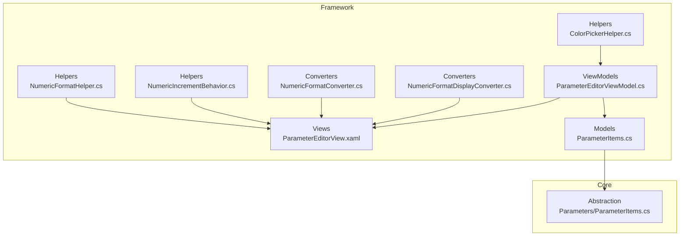
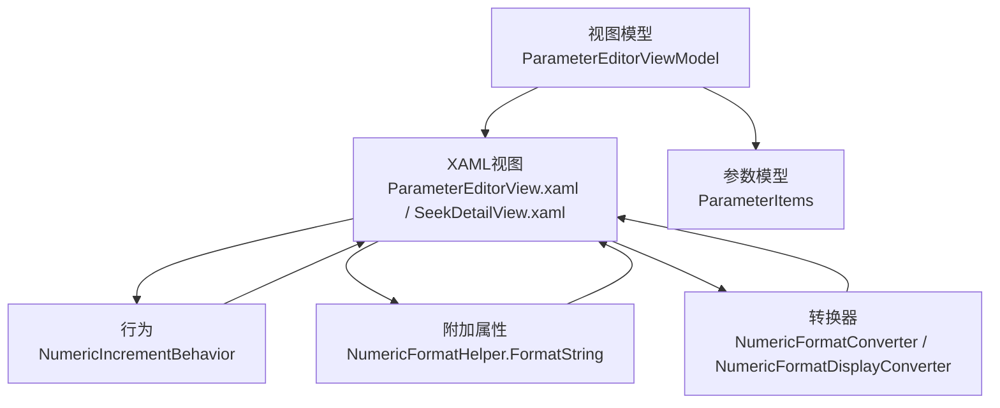
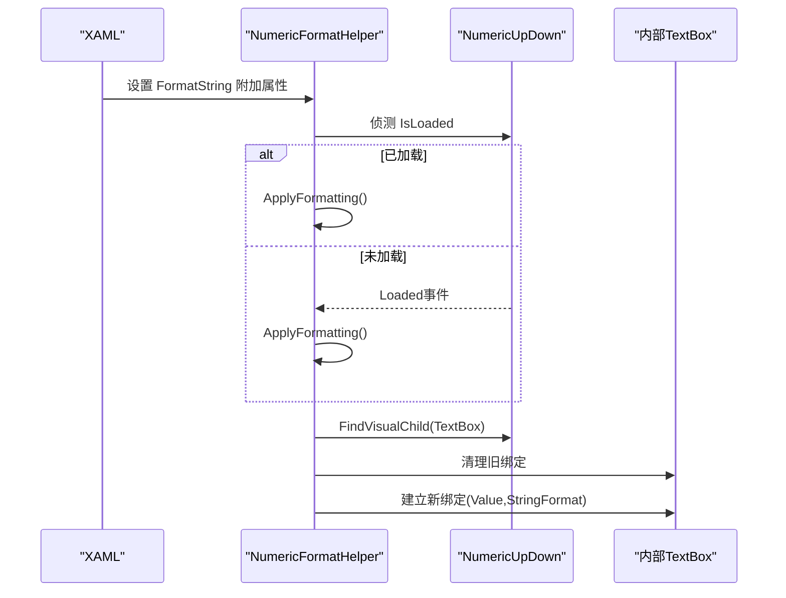
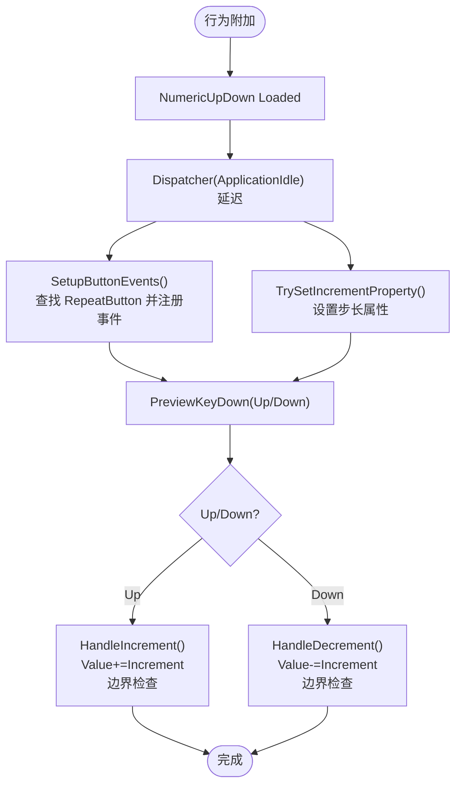
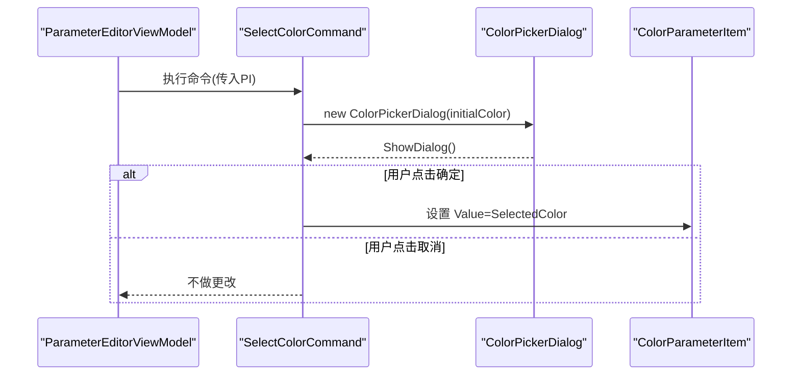
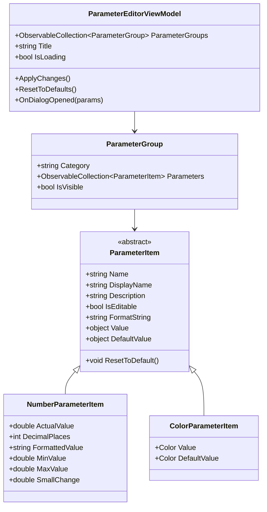
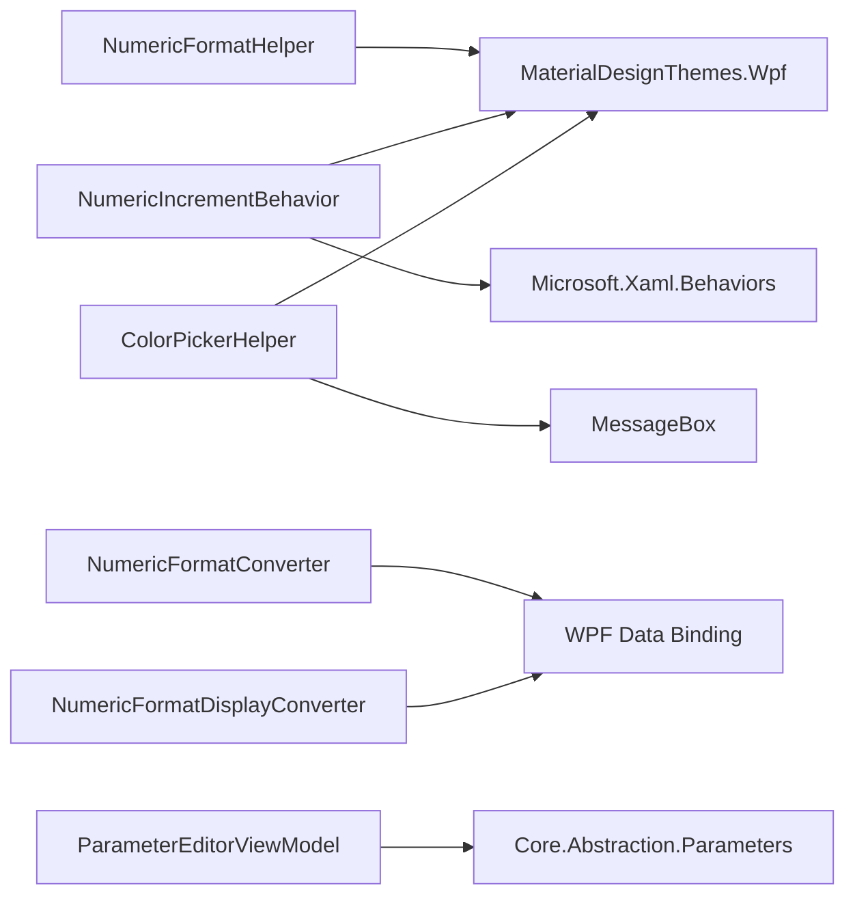

# UI辅助工具与组件

<cite>
**本文引用的文件**
- [NumericFormatHelper.cs](file://Framework/Helpers/NumericFormatHelper.cs)
- [ColorPickerHelper.cs](file://Framework/Helpers/ColorPickerHelper.cs)
- [NumericIncrementBehavior.cs](file://Framework/Helpers/NumericIncrementBehavior.cs)
- [ColorHelper.cs](file://Framework/ColorHelper.cs)
- [NumericFormatConverter.cs](file://Framework/Converters/NumericFormatConverter.cs)
- [NumericFormatDisplayConverter.cs](file://Framework/Converters/NumericFormatDisplayConverter.cs)
- [ParameterEditorViewModel.cs](file://Framework/ViewModels/ParameterEditorViewModel.cs)
- [ParameterItems.cs](file://Core/Abstraction/Parameters/ParameterItems.cs)
- [ParameterEditorView.xaml](file://Framework/Views/ParameterEditorView.xaml)
- [SeekDetailView.xaml](file://Module/Controls/StepDetails/SeekDetailView.xaml)
</cite>

## 目录
1. [简介](#简介)
2. [项目结构](#项目结构)
3. [核心组件](#核心组件)
4. [架构总览](#架构总览)
5. [详细组件分析](#详细组件分析)
6. [依赖关系分析](#依赖关系分析)
7. [性能考量](#性能考量)
8. [故障排查指南](#故障排查指南)
9. [结论](#结论)
10. [附录](#附录)

## 简介
本文件面向Framework模块中的UI辅助工具与组件，系统梳理以下能力：
- 数字格式化：NumericFormatHelper（附加属性驱动的格式化）、NumericFormatConverter/NumericFormatDisplayConverter（值转换器）
- 数值增量行为：NumericIncrementBehavior（增强的增减交互体验）
- 颜色处理：ColorHelper（主题色资源）、ColorPickerHelper（弹窗式颜色选择）
- 参数编辑生态：ParameterEditorViewModel与ParameterItems（参数项模型与视图模型），支撑上述工具在真实业务中的落地

目标是帮助开发者快速理解这些工具的职责边界、使用方式、最佳实践与扩展路径，并提供性能优化与问题排查建议。

## 项目结构
Framework模块围绕“工具类 + 转换器 + 视图模型 + XAML”协同工作：
- Helpers：工具类（NumericFormatHelper、ColorPickerHelper、NumericIncrementBehavior）
- Converters：值转换器（NumericFormatConverter、NumericFormatDisplayConverter）
- ViewModels：参数编辑视图模型（ParameterEditorViewModel）
- Views：参数编辑界面（ParameterEditorView.xaml）
- Models：参数项模型（ParameterItems.cs）
- Core/Abstraction：参数抽象与模型定义（ParameterItems.cs）

**图表来源**
- [NumericFormatHelper.cs:1-86](file://Framework/Helpers/NumericFormatHelper.cs#L1-L86)
- [ColorPickerHelper.cs:1-102](file://Framework/Helpers/ColorPickerHelper.cs#L1-L102)
- [NumericIncrementBehavior.cs:1-320](file://Framework/Helpers/NumericIncrementBehavior.cs#L1-L320)
- [NumericFormatConverter.cs:1-35](file://Framework/Converters/NumericFormatConverter.cs#L1-L35)
- [NumericFormatDisplayConverter.cs:1-29](file://Framework/Converters/NumericFormatDisplayConverter.cs#L1-L29)
- [ParameterEditorViewModel.cs:1-511](file://Framework/ViewModels/ParameterEditorViewModel.cs#L1-L511)
- [ParameterItems.cs:1-374](file://Core/Abstraction/Parameters/ParameterItems.cs#L1-L374)

**章节来源**
- [NumericFormatHelper.cs:1-86](file://Framework/Helpers/NumericFormatHelper.cs#L1-L86)
- [ColorPickerHelper.cs:1-102](file://Framework/Helpers/ColorPickerHelper.cs#L1-L102)
- [NumericIncrementBehavior.cs:1-320](file://Framework/Helpers/NumericIncrementBehavior.cs#L1-L320)
- [NumericFormatConverter.cs:1-35](file://Framework/Converters/NumericFormatConverter.cs#L1-L35)
- [NumericFormatDisplayConverter.cs:1-29](file://Framework/Converters/NumericFormatDisplayConverter.cs#L1-L29)
- [ParameterEditorViewModel.cs:1-511](file://Framework/ViewModels/ParameterEditorViewModel.cs#L1-L511)
- [ParameterItems.cs:1-374](file://Core/Abstraction/Parameters/ParameterItems.cs#L1-L374)

## 核心组件
- NumericFormatHelper：为NumericUpDown提供附加属性FormatString，动态绑定内部TextBox的显示格式，确保加载时机与格式一致性。
- NumericIncrementBehavior：为DecimalUpDown提供增强的增减交互，支持键盘上下键与按钮点击，自动适配不同控件内部按钮命名与属性，提升用户体验。
- ColorPickerHelper：封装颜色选择弹窗与命令，简化颜色参数编辑流程，提供错误兜底提示。
- ColorHelper：提供Material Design风格的主题色Brush常量与便捷方法，便于统一UI配色。
- NumericFormatConverter/NumericFormatDisplayConverter：提供数值到字符串的格式化转换与反向转换（前者支持双向），便于在绑定中灵活控制显示格式。
- ParameterEditorViewModel + ParameterItems：参数编辑视图模型与参数项模型，承载参数分组、类型识别、格式化、范围约束、默认值重置等能力，是上述工具在实际业务中的承载者。

**章节来源**
- [NumericFormatHelper.cs:11-84](file://Framework/Helpers/NumericFormatHelper.cs#L11-L84)
- [NumericIncrementBehavior.cs:12-319](file://Framework/Helpers/NumericIncrementBehavior.cs#L12-L319)
- [ColorPickerHelper.cs:12-38](file://Framework/Helpers/ColorPickerHelper.cs#L12-L38)
- [ColorHelper.cs:5-18](file://Framework/ColorHelper.cs#L5-L18)
- [NumericFormatConverter.cs:7-33](file://Framework/Converters/NumericFormatConverter.cs#L7-L33)
- [NumericFormatDisplayConverter.cs:7-27](file://Framework/Converters/NumericFormatDisplayConverter.cs#L7-L27)
- [ParameterEditorViewModel.cs:28-508](file://Framework/ViewModels/ParameterEditorViewModel.cs#L28-L508)
- [ParameterItems.cs:28-311](file://Core/Abstraction/Parameters/ParameterItems.cs#L28-L311)

## 架构总览
下图展示工具类与视图层的协作关系：视图通过附加属性、行为与转换器与底层模型解耦，视图模型负责参数的加载、编辑与保存。

**图表来源**
- [ParameterEditorView.xaml](file://Framework/Views/ParameterEditorView.xaml)
- [SeekDetailView.xaml:111-198](file://Module/Controls/StepDetails/SeekDetailView.xaml#L111-L198)
- [NumericIncrementBehavior.cs:12-319](file://Framework/Helpers/NumericIncrementBehavior.cs#L12-L319)
- [NumericFormatHelper.cs:11-84](file://Framework/Helpers/NumericFormatHelper.cs#L11-L84)
- [NumericFormatConverter.cs:7-33](file://Framework/Converters/NumericFormatConverter.cs#L7-L33)
- [NumericFormatDisplayConverter.cs:7-27](file://Framework/Converters/NumericFormatDisplayConverter.cs#L7-L27)
- [ParameterEditorViewModel.cs:28-508](file://Framework/ViewModels/ParameterEditorViewModel.cs#L28-L508)
- [ParameterItems.cs:28-311](file://Core/Abstraction/Parameters/ParameterItems.cs#L28-L311)

## 详细组件分析

### NumericFormatHelper：数字格式化附加属性
- 设计要点
  - 通过附加属性FormatString暴露给XAML，缺省值为"F2"
  - 在NumericUpDown加载完成后应用格式化，避免模板未应用导致的查找失败
  - 内部通过可视化树查找TextBox并重建绑定，确保StringFormat生效
- 关键流程
  - 依赖属性变更回调触发格式化应用
  - 通过FindVisualChild递归查找内部子元素
  - 清理旧绑定后建立新绑定，绑定源为控件的Value属性
- 适用场景
  - 需要统一数值显示格式的NumericUpDown
  - 与ParameterItems的FormatString联动，实现参数编辑时的格式一致

**图表来源**
- [NumericFormatHelper.cs:27-63](file://Framework/Helpers/NumericFormatHelper.cs#L27-L63)

**章节来源**
- [NumericFormatHelper.cs:11-84](file://Framework/Helpers/NumericFormatHelper.cs#L11-L84)

### NumericIncrementBehavior：数值增量行为
- 设计要点
  - 继承Microsoft.Xaml.Behaviors的Behavior<DecimalUpDown>，作为行为附加到控件
  - 提供Increment依赖属性，支持运行时调整步长
  - 自动查找模板中的增加/减少按钮（RepeatButton），注册PreviewMouseLeftButtonDown与Click事件
  - 通过TrySetIncrementProperty尝试设置多种可能的步长属性名，兼容不同版本控件
  - 键盘上下键同样触发增减，且阻止默认事件传播
- 关键流程
  - Loaded后延迟执行SetupButtonEvents与TrySetIncrementProperty
  - OnPreviewKeyDown根据Key判断方向，调用HandleIncrement/HandleDecrement
  - 边界检查：不超过Maximum/不低于Minimum
  - 通过Debug输出日志，便于调试

**图表来源**
- [NumericIncrementBehavior.cs:54-297](file://Framework/Helpers/NumericIncrementBehavior.cs#L54-L297)

**章节来源**
- [NumericIncrementBehavior.cs:12-319](file://Framework/Helpers/NumericIncrementBehavior.cs#L12-L319)

### ColorPickerHelper：颜色选择工具
- 设计要点
  - 提供SelectColorCommand，封装颜色选择逻辑
  - 使用MaterialDesign的ColorPicker控件构建弹窗，支持确定/取消操作
  - 异常捕获与错误提示，保证UI稳定性
- 关键流程
  - 接收ColorParameterItem，初始化弹窗初始颜色
  - 用户点击确定后回写SelectedColor到参数项
  - 弹窗关闭后释放资源

**图表来源**
- [ColorPickerHelper.cs:20-37](file://Framework/Helpers/ColorPickerHelper.cs#L20-L37)

**章节来源**
- [ColorPickerHelper.cs:12-102](file://Framework/Helpers/ColorPickerHelper.cs#L12-L102)

### ColorHelper：颜色处理能力
- 设计要点
  - 提供Material Design主色系Brush常量（Primary、PrimaryHueLight/Mid/Dark）
  - 提供便捷方法获取主色
- 应用场景
  - 统一主题色资源，便于样式与模板复用
  - 与ColorPickerHelper配合，实现参数项颜色的预设与选择

**章节来源**
- [ColorHelper.cs:5-18](file://Framework/ColorHelper.cs#L5-L18)

### 数值格式化转换器
- NumericFormatConverter
  - Convert：将double按参数格式化为字符串，默认"F2"
  - ConvertBack：将字符串解析为double，失败返回0.0
- NumericFormatDisplayConverter
  - Convert：按参数格式化显示，参数为空时默认"F2"
  - ConvertBack：抛出未实现异常（仅单向显示）

**章节来源**
- [NumericFormatConverter.cs:7-33](file://Framework/Converters/NumericFormatConverter.cs#L7-L33)
- [NumericFormatDisplayConverter.cs:7-27](file://Framework/Converters/NumericFormatDisplayConverter.cs#L7-L27)

### 参数编辑生态：ParameterEditorViewModel 与 ParameterItems
- ParameterEditorViewModel
  - 负责参数加载、搜索过滤、应用/重置/取消、保存回调与事件发布
  - 动态反射创建参数项，支持枚举、数值、布尔、字符串等类型
  - 通过DisplayFormatAttribute与RangeAttribute提供格式与范围约束
- ParameterItems
  - 定义ParameterGroup与各类ParameterItem（Number/Boolean/String/Enum/Color/PointF等）
  - NumberParameterItem内置FormattedValue、SmallChange、DecimalPlaces等属性，便于与NumericUpDown联动
  - ColorParameterItem支持Color与SolidColorBrush两种赋值方式

**图表来源**
- [ParameterEditorViewModel.cs:28-508](file://Framework/ViewModels/ParameterEditorViewModel.cs#L28-L508)
- [ParameterItems.cs:28-311](file://Core/Abstraction/Parameters/ParameterItems.cs#L28-L311)

**章节来源**
- [ParameterEditorViewModel.cs:28-508](file://Framework/ViewModels/ParameterEditorViewModel.cs#L28-L508)
- [ParameterItems.cs:28-311](file://Core/Abstraction/Parameters/ParameterItems.cs#L28-L311)

## 依赖关系分析
- NumericFormatHelper依赖MaterialDesignThemes.Wpf的NumericUpDown与VisualTreeHelper
- NumericIncrementBehavior依赖Microsoft.Xaml.Behaviors与MaterialDesignThemes.Wpf的DecimalUpDown与RepeatButton
- ColorPickerHelper依赖MaterialDesign的ColorPicker与MessageBox
- NumericFormatConverter/NumericFormatDisplayConverter为无状态IValueConverter，可直接在XAML中使用
- ParameterEditorViewModel依赖Core.Abstraction的参数模型与Prism/EventAggregator

**图表来源**
- [NumericFormatHelper.cs:1-86](file://Framework/Helpers/NumericFormatHelper.cs#L1-L86)
- [NumericIncrementBehavior.cs:1-320](file://Framework/Helpers/NumericIncrementBehavior.cs#L1-L320)
- [ColorPickerHelper.cs:1-102](file://Framework/Helpers/ColorPickerHelper.cs#L1-L102)
- [NumericFormatConverter.cs:1-35](file://Framework/Converters/NumericFormatConverter.cs#L1-L35)
- [NumericFormatDisplayConverter.cs:1-29](file://Framework/Converters/NumericFormatDisplayConverter.cs#L1-L29)
- [ParameterEditorViewModel.cs:1-511](file://Framework/ViewModels/ParameterEditorViewModel.cs#L1-L511)
- [ParameterItems.cs:1-374](file://Core/Abstraction/Parameters/ParameterItems.cs#L1-L374)

**章节来源**
- [NumericFormatHelper.cs:1-86](file://Framework/Helpers/NumericFormatHelper.cs#L1-L86)
- [NumericIncrementBehavior.cs:1-320](file://Framework/Helpers/NumericIncrementBehavior.cs#L1-L320)
- [ColorPickerHelper.cs:1-102](file://Framework/Helpers/ColorPickerHelper.cs#L1-L102)
- [NumericFormatConverter.cs:1-35](file://Framework/Converters/NumericFormatConverter.cs#L1-L35)
- [NumericFormatDisplayConverter.cs:1-29](file://Framework/Converters/NumericFormatDisplayConverter.cs#L1-L29)
- [ParameterEditorViewModel.cs:1-511](file://Framework/ViewModels/ParameterEditorViewModel.cs#L1-L511)
- [ParameterItems.cs:1-374](file://Core/Abstraction/Parameters/ParameterItems.cs#L1-L374)

## 性能考量
- NumericFormatHelper
  - 仅在控件加载后应用一次格式化，避免重复绑定开销
  - 通过ClearBinding后再建立新绑定，防止多重绑定导致的性能问题
- NumericIncrementBehavior
  - 使用Dispatcher(ApplicationIdle)延迟执行，避免阻塞主线程
  - 仅在Loaded事件后查找按钮并注册事件，减少无效查找
  - 通过TrySetIncrementProperty的属性名探测，避免硬编码导致的反射异常
- ColorPickerHelper
  - 弹窗仅在需要时创建，避免常驻内存
  - 异常捕获避免UI线程阻塞
- 转换器
  - 无状态设计，避免实例化成本
  - ConvertBack仅在需要双向绑定时使用，单向显示建议使用NumericFormatDisplayConverter

[本节为通用性能建议，无需特定文件引用]

## 故障排查指南
- NumericFormatHelper
  - 现象：格式未生效
  - 排查：确认NumericUpDown已加载；检查FormatString是否正确；确认内部存在TextBox
  - 参考：[NumericFormatHelper.cs:27-63](file://Framework/Helpers/NumericFormatHelper.cs#L27-L63)
- NumericIncrementBehavior
  - 现象：增减无效或步长不生效
  - 排查：确认控件模板中存在PART_IncreaseButton/PART_DecreaseButton；检查Increment依赖属性是否设置；查看日志输出定位问题
  - 参考：[NumericIncrementBehavior.cs:54-105](file://Framework/Helpers/NumericIncrementBehavior.cs#L54-L105)
- ColorPickerHelper
  - 现象：弹窗无法打开或颜色未回写
  - 排查：确认ColorPickerDialog构造参数；检查异常捕获分支；验证ColorParameterItem.Value类型
  - 参考：[ColorPickerHelper.cs:20-37](file://Framework/Helpers/ColorPickerHelper.cs#L20-L37)
- 转换器
  - 现象：格式化异常或解析失败
  - 排查：确认参数格式字符串；ConvertBack仅用于双向绑定；单向显示使用NumericFormatDisplayConverter
  - 参考：[NumericFormatConverter.cs:22-32](file://Framework/Converters/NumericFormatConverter.cs#L22-L32), [NumericFormatDisplayConverter.cs:22-26](file://Framework/Converters/NumericFormatDisplayConverter.cs#L22-L26)

**章节来源**
- [NumericFormatHelper.cs:27-63](file://Framework/Helpers/NumericFormatHelper.cs#L27-L63)
- [NumericIncrementBehavior.cs:54-105](file://Framework/Helpers/NumericIncrementBehavior.cs#L54-L105)
- [ColorPickerHelper.cs:20-37](file://Framework/Helpers/ColorPickerHelper.cs#L20-L37)
- [NumericFormatConverter.cs:22-32](file://Framework/Converters/NumericFormatConverter.cs#L22-L32)
- [NumericFormatDisplayConverter.cs:22-26](file://Framework/Converters/NumericFormatDisplayConverter.cs#L22-L26)

## 结论
Framework模块的UI辅助工具通过“附加属性 + 行为 + 转换器 + 视图模型”的组合，实现了参数编辑场景下的高可用与一致性：
- NumericFormatHelper与NumericIncrementBehavior分别解决显示格式与交互体验
- ColorPickerHelper与ColorHelper提供颜色选择与主题色管理
- ParameterEditorViewModel与ParameterItems构成参数编辑的完整闭环
在实际项目中，建议结合XAML绑定与MaterialDesign主题，统一风格并提升开发效率。

[本节为总结性内容，无需特定文件引用]

## 附录

### 实际使用示例（基于XAML）
- 在参数编辑视图中使用NumericUpDown与FormatString
  - 参考：[ParameterEditorView.xaml](file://Framework/Views/ParameterEditorView.xaml)
- 在步骤详情视图中使用NumericUpDown进行数值编辑
  - 参考：[SeekDetailView.xaml:111-198](file://Module/Controls/StepDetails/SeekDetailView.xaml#L111-L198)

**章节来源**
- [ParameterEditorView.xaml](file://Framework/Views/ParameterEditorView.xaml)
- [SeekDetailView.xaml:111-198](file://Module/Controls/StepDetails/SeekDetailView.xaml#L111-L198)