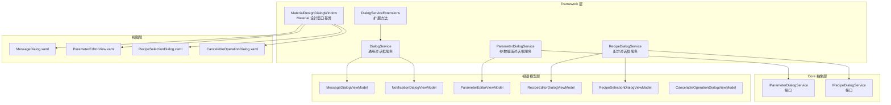
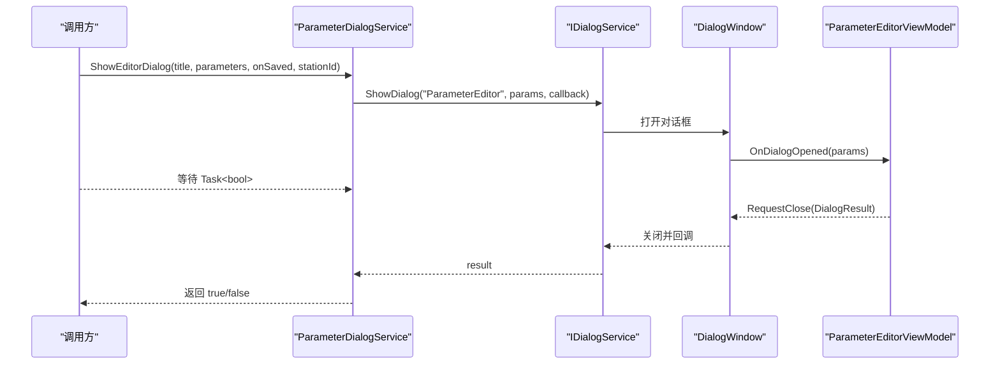
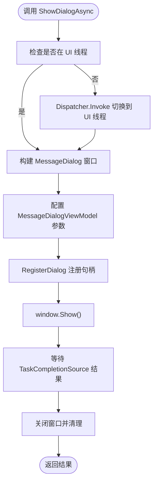
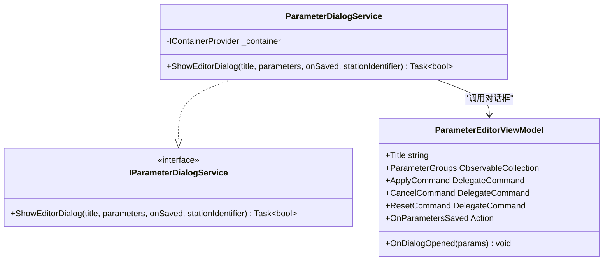
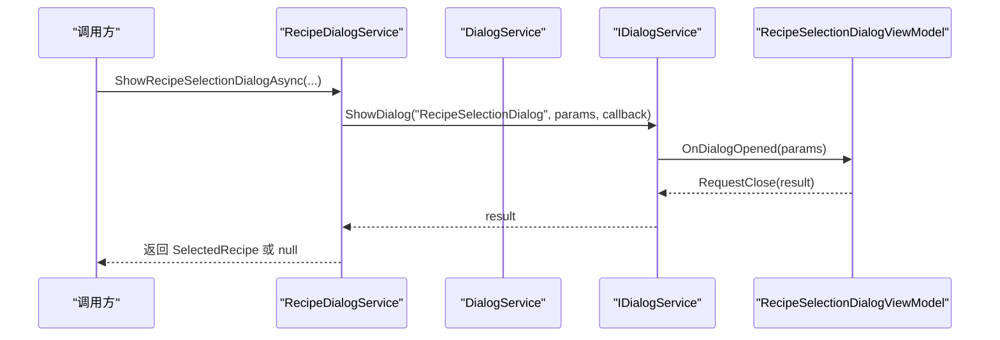
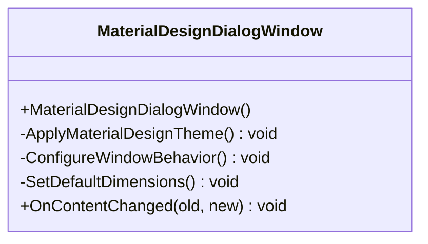
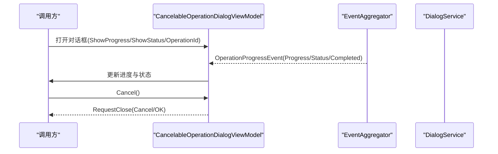
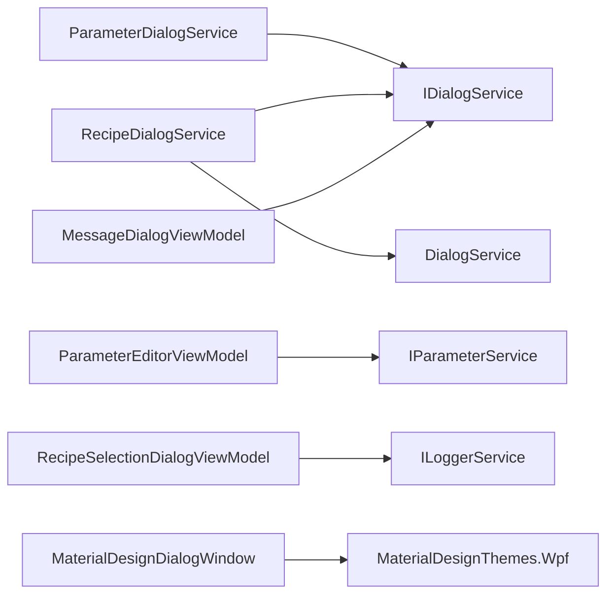

# 对话框服务系统

<cite>
**本文档引用的文件**
- [DialogService.cs](file://Framework/Services/DialogService.cs)
- [ParameterDialogService.cs](file://Framework/Services/ParameterDialogService.cs)
- [RecipeDialogService.cs](file://Framework/Services/RecipeDialogService.cs)
- [MaterialDesignDialogWindow.cs](file://Framework/MaterialDesignDialogWindow.cs)
- [DialogServiceExtensions.cs](file://Framework/Dialogs/DialogServiceExtensions.cs)
- [MessageDialogViewModel.cs](file://Framework/ViewModels/MessageDialogViewModel.cs)
- [NotificationDialogViewModel.cs](file://Framework/ViewModels/NotificationDialogViewModel.cs)
- [ParameterEditorViewModel.cs](file://Framework/ViewModels/ParameterEditorViewModel.cs)
- [RecipeEditorDialogViewModel.cs](file://Framework/ViewModels/RecipeEditorDialogViewModel.cs)
- [RecipeSelectionDialogViewModel.cs](file://Framework/ViewModels/RecipeSelectionDialogViewModel.cs)
- [CancelableOperationDialogViewModel.cs](file://Framework/ViewModels/CancelableOperationDialogViewModel.cs)
- [MessageDialog.xaml](file://Framework/Views/MessageDialog.xaml)
- [ParameterEditorView.xaml](file://Framework/Views/ParameterEditorView.xaml)
- [RecipeSelectionDialog.xaml](file://Framework/Views/RecipeSelectionDialog.xaml)
- [CancelableOperationDialog.xaml](file://Framework/Views/CancelableOperationDialog.xaml)
- [IParameterDialogService.cs](file://Core/Abstraction/IParameterDialogService.cs)
- [IRecipeDialogService.cs](file://Core/Abstraction/IRecipeDialogService.cs)
</cite>

## 目录
1. [简介](#简介)
2. [项目结构](#项目结构)
3. [核心组件](#核心组件)
4. [架构总览](#架构总览)
5. [详细组件分析](#详细组件分析)
6. [依赖关系分析](#依赖关系分析)
7. [性能考虑](#性能考虑)
8. [故障排除指南](#故障排除指南)
9. [结论](#结论)

## 简介
本文件系统性梳理对话框服务体系，围绕 DialogService、ParameterDialogService、RecipeDialogService 三大核心服务展开，深入解析消息对话框、通知对话框、参数编辑对话框、配方编辑对话框、取消操作对话框等的实现原理与使用场景。文档同时提供注册、调用、生命周期管理的最佳实践，并阐述 MaterialDesignDialogWindow 的设计理念与自定义对话框开发指南，涵盖样式定制、响应式布局与用户体验优化策略。

## 项目结构
对话框服务位于 Framework 层，采用 Prism 对话框框架与 Material Design 主题集成，结合 Core 抽象层接口定义，形成清晰的服务-视图-视图模型三层协作：

- 服务层：DialogService 提供通用消息与提示对话框；ParameterDialogService、RecipeDialogService 提供业务专用对话框服务。
- 视图模型层：各对话框对应的 ViewModel 实现 IDialogAware 接口，负责状态、命令与参数交互。
- 视图层：XAML 定义对话框 UI 结构与样式，基于 Material Design Themes。
- 抽象层：Core 定义 IParameterDialogService、IRecipeDialogService 接口，隔离具体实现。

**图表来源**
- [DialogService.cs:14-432](file://Framework/Services/DialogService.cs#L14-L432)
- [ParameterDialogService.cs:10-49](file://Framework/Services/ParameterDialogService.cs#L10-L49)
- [RecipeDialogService.cs:11-106](file://Framework/Services/RecipeDialogService.cs#L11-L106)
- [MaterialDesignDialogWindow.cs:7-73](file://Framework/MaterialDesignDialogWindow.cs#L7-L73)
- [DialogServiceExtensions.cs:6-43](file://Framework/Dialogs/DialogServiceExtensions.cs#L6-L43)
- [MessageDialogViewModel.cs:17-212](file://Framework/ViewModels/MessageDialogViewModel.cs#L17-L212)
- [ParameterEditorViewModel.cs:28-511](file://Framework/ViewModels/ParameterEditorViewModel.cs#L28-L511)
- [RecipeSelectionDialogViewModel.cs:10-127](file://Framework/ViewModels/RecipeSelectionDialogViewModel.cs#L10-L127)
- [MessageDialog.xaml:1-248](file://Framework/Views/MessageDialog.xaml#L1-L248)
- [ParameterEditorView.xaml:1-353](file://Framework/Views/ParameterEditorView.xaml#L1-L353)
- [RecipeSelectionDialog.xaml:1-143](file://Framework/Views/RecipeSelectionDialog.xaml#L1-L143)
- [IParameterDialogService.cs:4-9](file://Core/Abstraction/IParameterDialogService.cs#L4-L9)
- [IRecipeDialogService.cs:7-37](file://Core/Abstraction/IRecipeDialogService.cs#L7-L37)

**章节来源**
- [DialogService.cs:14-432](file://Framework/Services/DialogService.cs#L14-L432)
- [MaterialDesignDialogWindow.cs:7-73](file://Framework/MaterialDesignDialogWindow.cs#L7-L73)

## 核心组件
本节聚焦三大核心对话框服务及其职责边界与协作方式。

- DialogService（通用对话框服务）
  - 职责：提供消息、通知、提示、自动关闭等通用对话框能力；支持阻塞/非阻塞调用；管理对话框生命周期与清理。
  - 关键能力：ShowBlockingDialog、ShowNonBlockingDialog、ShowDialogAsync、ShowToastAsync、CloseAllDialogs。
  - 并发与线程安全：内部使用并发字典跟踪已打开对话框，确保跨线程调用安全。

- ParameterDialogService（参数编辑对话框服务）
  - 职责：封装参数编辑对话框的调用流程，将回调转换为 Task，便于异步等待。
  - 关键能力：ShowEditorDialog，接收标题、参数对象、保存回调与工站标识，返回编辑结果。

- RecipeDialogService（配方对话框服务）
  - 职责：封装配方选择、确认与提示对话框，提供统一的异步交互体验。
  - 关键能力：ShowRecipeSelectionDialogAsync、ShowConfirmationDialogAsync、ShowAlertAsync。

**章节来源**
- [DialogService.cs:14-432](file://Framework/Services/DialogService.cs#L14-L432)
- [ParameterDialogService.cs:10-49](file://Framework/Services/ParameterDialogService.cs#L10-L49)
- [RecipeDialogService.cs:11-106](file://Framework/Services/RecipeDialogService.cs#L11-L106)

## 架构总览
对话框服务采用“服务-视图模型-视图”的分层设计，配合 Prism 的 IDialogService 与 DialogWindow，实现统一的对话框生命周期管理与参数传递。

**图表来源**
- [ParameterDialogService.cs:19-46](file://Framework/Services/ParameterDialogService.cs#L19-L46)
- [DialogServiceExtensions.cs:8-41](file://Framework/Dialogs/DialogServiceExtensions.cs#L8-L41)
- [ParameterEditorViewModel.cs:489-508](file://Framework/ViewModels/ParameterEditorViewModel.cs#L489-L508)

## 详细组件分析

### DialogService（通用对话框服务）
- 设计要点
  - 使用并发字典跟踪所有打开的对话框，提供 CloseAllDialogs 清理能力。
  - 支持多种显示模式：阻塞、非阻塞、带自动关闭的提示。
  - ShowDialogAsync 提供灵活的按钮配置与默认按钮设置，支持自定义图标与超时。
- 生命周期管理
  - RegisterDialog 注册对话框并在关闭时清理；DialogHandle 包含 TaskCompletionSource 与 Dispatcher。
  - 支持 Owner 窗口与居中显示策略，避免多窗口层级问题。
- 性能与可靠性
  - 非阻塞模式通过 STA 线程与 Dispatcher.Run 驱动 UI，避免阻塞主线程。
  - 异常捕获与资源释放（定时器、句柄）确保稳定性。

**图表来源**
- [DialogService.cs:244-408](file://Framework/Services/DialogService.cs#L244-L408)

**章节来源**
- [DialogService.cs:14-432](file://Framework/Services/DialogService.cs#L14-L432)
- [MessageDialogViewModel.cs:17-212](file://Framework/ViewModels/MessageDialogViewModel.cs#L17-L212)
- [MessageDialog.xaml:1-248](file://Framework/Views/MessageDialog.xaml#L1-L248)

### ParameterDialogService（参数编辑对话框服务）
- 设计要点
  - 通过 IContainerProvider 解析 IDialogService，传递标题、参数对象、保存回调与工站标识。
  - 使用 TaskCompletionSource 将回调式对话框转为 Task<bool>，简化调用方逻辑。
- 参数编辑能力
  - ParameterEditorViewModel 支持参数分组、搜索过滤、类型化编辑器（字符串、布尔、数值、枚举、颜色）。
  - 自动类型转换与范围校验，支持只读属性与忽略特性。
- 工站标识与事件
  - 保存后发布 StationParameterSavedEvent，携带工站标识，便于订阅方同步。

**图表来源**
- [ParameterDialogService.cs:10-49](file://Framework/Services/ParameterDialogService.cs#L10-L49)
- [IParameterDialogService.cs:4-9](file://Core/Abstraction/IParameterDialogService.cs#L4-L9)
- [ParameterEditorViewModel.cs:28-511](file://Framework/ViewModels/ParameterEditorViewModel.cs#L28-L511)

**章节来源**
- [ParameterDialogService.cs:10-49](file://Framework/Services/ParameterDialogService.cs#L10-L49)
- [ParameterEditorViewModel.cs:28-511](file://Framework/ViewModels/ParameterEditorViewModel.cs#L28-L511)
- [ParameterEditorView.xaml:1-353](file://Framework/Views/ParameterEditorView.xaml#L1-L353)

### RecipeDialogService（配方对话框服务）
- 设计要点
  - 封装配方选择、确认与提示对话框，统一返回值与异常处理。
  - ShowRecipeSelectionDialogAsync 使用 ObservableCollection 传递配方列表，支持工站名称显示。
  - ShowConfirmationDialogAsync 基于 DialogService.ShowDialogAsync，返回选中的选项文本。
  - ShowAlertAsync 提供降级方案（MessageBox），确保在异常情况下仍能提示用户。
- 与 DialogService 的协作
  - 通过 DialogServiceExtensions 将 IDialogService.Show 转为 Task<IDialogResult>，提升一致性。

**图表来源**
- [RecipeDialogService.cs:20-58](file://Framework/Services/RecipeDialogService.cs#L20-L58)
- [DialogServiceExtensions.cs:8-41](file://Framework/Dialogs/DialogServiceExtensions.cs#L8-L41)
- [RecipeSelectionDialogViewModel.cs:10-127](file://Framework/ViewModels/RecipeSelectionDialogViewModel.cs#L10-L127)

**章节来源**
- [RecipeDialogService.cs:11-106](file://Framework/Services/RecipeDialogService.cs#L11-L106)
- [RecipeSelectionDialogViewModel.cs:10-127](file://Framework/ViewModels/RecipeSelectionDialogViewModel.cs#L10-L127)
- [RecipeSelectionDialog.xaml:1-143](file://Framework/Views/RecipeSelectionDialog.xaml#L1-L143)

### MaterialDesignDialogWindow（Material 设计窗口基类）
- 设计理念
  - 统一 Material Design 主题风格，使用 UseLayoutRounding 与资源字典实现一致的视觉与交互体验。
  - 默认尺寸、边框与启动位置规范化，确保对话框在不同分辨率下的可读性与可用性。
- 行为与尺寸
  - CenterOwner 居中显示，ResizeMode 可调整，SizeToContent 自适应内容高度。
  - OnContentChanged 中监听内容加载完成，动态调整窗口尺寸以适配内容。

**图表来源**
- [MaterialDesignDialogWindow.cs:7-73](file://Framework/MaterialDesignDialogWindow.cs#L7-L73)

**章节来源**
- [MaterialDesignDialogWindow.cs:7-73](file://Framework/MaterialDesignDialogWindow.cs#L7-L73)

### 取消操作对话框（CancelableOperationDialog）
- 设计要点
  - 支持进度展示、状态文本与取消令牌，订阅 OperationProgressEvent 实时更新。
  - 提供手动关闭与取消操作，完成后延迟关闭并返回结果。
- 用户体验
  - 进度百分比动态更新，状态文本提供上下文反馈，取消按钮在操作未完成时可用。

**图表来源**
- [CancelableOperationDialogViewModel.cs:14-204](file://Framework/ViewModels/CancelableOperationDialogViewModel.cs#L14-L204)
- [CancelableOperationDialog.xaml:1-154](file://Framework/Views/CancelableOperationDialog.xaml#L1-L154)

**章节来源**
- [CancelableOperationDialogViewModel.cs:14-204](file://Framework/ViewModels/CancelableOperationDialogViewModel.cs#L14-L204)
- [CancelableOperationDialog.xaml:1-154](file://Framework/Views/CancelableOperationDialog.xaml#L1-L154)

## 依赖关系分析
- 服务依赖
  - ParameterDialogService 依赖 IContainerProvider 与 IDialogService，解耦具体容器实现。
  - RecipeDialogService 依赖 IDialogService 与 DialogService.ShowDialogAsync，统一对话框交互。
- 视图模型依赖
  - 各 ViewModel 实现 IDialogAware，依赖 Prism 的命令与参数传递机制。
- 外部依赖
  - MaterialDesignThemes.Wpf 提供统一主题与控件样式。
  - Prism.Services.Dialogs 提供对话框注册与生命周期管理。

**图表来源**
- [ParameterDialogService.cs:12-17](file://Framework/Services/ParameterDialogService.cs#L12-L17)
- [RecipeDialogService.cs:13-17](file://Framework/Services/RecipeDialogService.cs#L13-L17)
- [MessageDialogViewModel.cs:17-212](file://Framework/ViewModels/MessageDialogViewModel.cs#L17-L212)
- [ParameterEditorViewModel.cs:30-32](file://Framework/ViewModels/ParameterEditorViewModel.cs#L30-L32)
- [RecipeSelectionDialogViewModel.cs:12-14](file://Framework/ViewModels/RecipeSelectionDialogViewModel.cs#L12-L14)
- [MaterialDesignDialogWindow.cs:3-3](file://Framework/MaterialDesignDialogWindow.cs#L3-L3)

**章节来源**
- [ParameterDialogService.cs:10-49](file://Framework/Services/ParameterDialogService.cs#L10-L49)
- [RecipeDialogService.cs:11-106](file://Framework/Services/RecipeDialogService.cs#L11-L106)
- [MessageDialogViewModel.cs:17-212](file://Framework/ViewModels/MessageDialogViewModel.cs#L17-L212)
- [ParameterEditorViewModel.cs:30-32](file://Framework/ViewModels/ParameterEditorViewModel.cs#L30-L32)
- [RecipeSelectionDialogViewModel.cs:12-14](file://Framework/ViewModels/RecipeSelectionDialogViewModel.cs#L12-L14)
- [MaterialDesignDialogWindow.cs:3-3](file://Framework/MaterialDesignDialogWindow.cs#L3-L3)

## 性能考虑
- 线程模型
  - 非阻塞对话框通过 STA 线程与 Dispatcher.Run 驱动 UI，避免阻塞主线程。
  - UI 线程切换使用 Dispatcher.Invoke/BeginInvoke，确保线程安全。
- 资源管理
  - 定时器与句柄在关闭时及时 Dispose，避免内存泄漏。
  - 并发字典用于跟踪对话框，提供快速清理与去重。
- 视图优化
  - ParameterEditorView 使用 ScrollViewer 与 Expander 分组，减少一次性渲染压力。
  - 可见性绑定与模板选择器按需渲染，降低 UI 开销。

[本节为通用指导，无需特定文件分析]

## 故障排除指南
- 对话框无法显示或显示异常
  - 检查 Application.Current 是否可用，确保在 UI 线程调用。
  - 确认 DialogWindow 资源字典合并正确，Material Design 资源可访问。
- 参数编辑异常
  - 检查参数对象属性是否标注 [ParameterIgnore] 或为 List<PointF> 类型，这些会被跳过。
  - 确认类型转换逻辑，必要时提供合适的 DisplayFormat 与 RangeAttribute。
- 配方选择返回 null
  - 检查 IDialogResult 参数键名与类型，确保 SelectedRecipe 正确提取。
  - 异常捕获会返回 null，可在上层进行日志记录与重试。
- 取消操作无效
  - 确认 CancellationTokenSource 已正确注入，且操作未完成时 CancelCommand 可执行。
  - 检查 OperationProgressEvent 的 OperationId 是否匹配。

**章节来源**
- [DialogService.cs:83-86](file://Framework/Services/DialogService.cs#L83-L86)
- [ParameterEditorViewModel.cs:225-236](file://Framework/ViewModels/ParameterEditorViewModel.cs#L225-L236)
- [RecipeDialogService.cs:41-48](file://Framework/Services/RecipeDialogService.cs#L41-L48)
- [CancelableOperationDialogViewModel.cs:133-136](file://Framework/ViewModels/CancelableOperationDialogViewModel.cs#L133-L136)

## 结论
对话框服务系统通过清晰的分层设计与接口抽象，实现了通用对话框能力与业务专用对话框的解耦。DialogService 提供稳定的基础能力，ParameterDialogService 与 RecipeDialogService 则针对参数编辑与配方管理场景提供一致的交互体验。MaterialDesignDialogWindow 统一了视觉与交互标准，配合 Prism 的对话框框架，使系统具备良好的可维护性与扩展性。建议在实际应用中遵循本文提供的最佳实践，确保对话框的注册、调用与生命周期管理的一致性与可靠性。