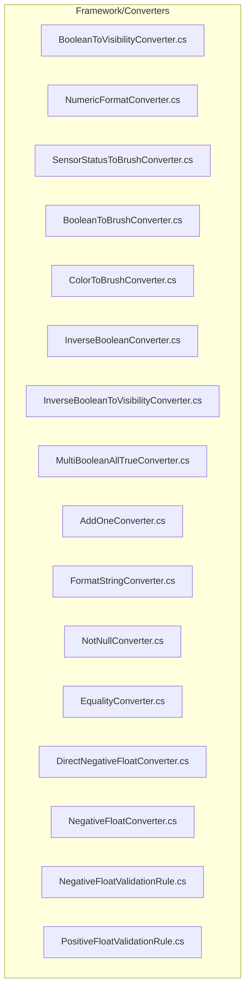
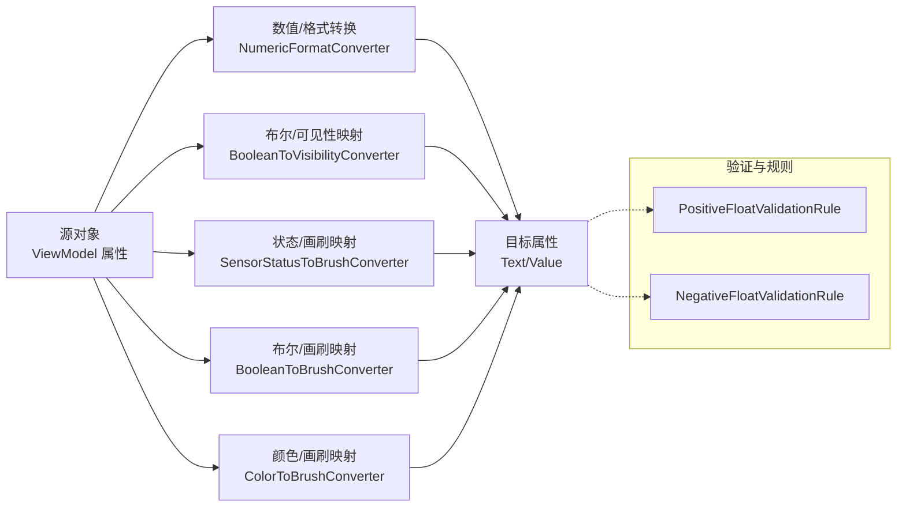

# 数据转换器系统

<cite>
**本文引用的文件**
- [BooleanToVisibilityConverter.cs](file://Framework/Converters/BooleanToVisibilityConverter.cs)
- [NumericFormatConverter.cs](file://Framework/Converters/NumericFormatConverter.cs)
- [SensorStatusToBrushConverter.cs](file://Framework/Converters/SensorStatusToBrushConverter.cs)
- [BooleanToBrushConverter.cs](file://Framework/Converters/BooleanToBrushConverter.cs)
- [ColorToBrushConverter.cs](file://Framework/Converters/ColorToBrushConverter.cs)
- [InverseBooleanConverter.cs](file://Framework/Converters/InverseBooleanConverter.cs)
- [InverseBooleanToVisibilityConverter.cs](file://Framework/Converters/InverseBooleanToVisibilityConverter.cs)
- [MultiBooleanAllTrueConverter.cs](file://Framework/Converters/MultiBooleanAllTrueConverter.cs)
- [AddOneConverter.cs](file://Framework/Converters/AddOneConverter.cs)
- [FormatStringConverter.cs](file://Framework/Converters/FormatStringConverter.cs)
- [NotNullConverter.cs](file://Framework/Converters/NotNullConverter.cs)
- [EqualityConverter.cs](file://Framework/Converters/EqualityConverter.cs)
- [DirectNegativeFloatConverter.cs](file://Framework/Converters/DirectNegativeFloatConverter.cs)
- [NegativeFloatConverter.cs](file://Framework/Converters/NegativeFloatConverter.cs)
- [NegativeFloatValidationRule.cs](file://Framework/Converters/NegativeFloatValidationRule.cs)
- [PositiveFloatValidationRule.cs](file://Framework/Converters/PositiveFloatValidationRule.cs)
</cite>

## 目录
1. [引言](#引言)
2. [项目结构](#项目结构)
3. [核心组件](#核心组件)
4. [架构总览](#架构总览)
5. [详细组件分析](#详细组件分析)
6. [依赖关系分析](#依赖关系分析)
7. [性能考量](#性能考量)
8. [故障排查指南](#故障排查指南)
9. [结论](#结论)
10. [附录](#附录)

## 引言
本文件系统性梳理 Framework 模块中的数据转换器体系，覆盖布尔转换器、数值转换器、颜色与画刷转换器、验证规则以及多值/参数化转换器等类别。重点解析 BooleanToVisibilityConverter、NumericFormatConverter、SensorStatusToBrushConverter 等关键转换器的工作机制与使用场景，并提供自定义转换器的开发指南、XAML 绑定模式、参数传递方式与调试技巧。

## 项目结构
Framework 模块的转换器集中于 Converters 目录，采用按功能分类的组织方式：
- 布尔类：BooleanToVisibilityConverter、InverseBooleanConverter、InverseBooleanToVisibilityConverter、MultiBooleanAllTrueConverter、NotNullConverter、EqualityConverter
- 数值类：NumericFormatConverter、AddOneConverter、DirectNegativeFloatConverter、NegativeFloatConverter
- 颜色与画刷类：ColorToBrushConverter、SensorStatusToBrushConverter、BooleanToBrushConverter
- 验证规则类：PositiveFloatValidationRule、NegativeFloatValidationRule
- 其他：FormatStringConverter



**图表来源**
- [BooleanToVisibilityConverter.cs:1-47](file://Framework/Converters/BooleanToVisibilityConverter.cs#L1-L47)
- [NumericFormatConverter.cs:1-35](file://Framework/Converters/NumericFormatConverter.cs#L1-L35)
- [SensorStatusToBrushConverter.cs:1-31](file://Framework/Converters/SensorStatusToBrushConverter.cs#L1-L31)
- [BooleanToBrushConverter.cs:1-80](file://Framework/Converters/BooleanToBrushConverter.cs#L1-L80)
- [ColorToBrushConverter.cs:1-33](file://Framework/Converters/ColorToBrushConverter.cs#L1-L33)
- [InverseBooleanConverter.cs:1-24](file://Framework/Converters/InverseBooleanConverter.cs#L1-L24)
- [InverseBooleanToVisibilityConverter.cs:1-29](file://Framework/Converters/InverseBooleanToVisibilityConverter.cs#L1-L29)
- [MultiBooleanAllTrueConverter.cs:1-23](file://Framework/Converters/MultiBooleanAllTrueConverter.cs#L1-L23)
- [AddOneConverter.cs:1-23](file://Framework/Converters/AddOneConverter.cs#L1-L23)
- [FormatStringConverter.cs:1-25](file://Framework/Converters/FormatStringConverter.cs#L1-L25)
- [NotNullConverter.cs:1-20](file://Framework/Converters/NotNullConverter.cs#L1-L20)
- [EqualityConverter.cs:1-38](file://Framework/Converters/EqualityConverter.cs#L1-L38)
- [DirectNegativeFloatConverter.cs:1-59](file://Framework/Converters/DirectNegativeFloatConverter.cs#L1-L59)
- [NegativeFloatConverter.cs:1-78](file://Framework/Converters/NegativeFloatConverter.cs#L1-L78)
- [NegativeFloatValidationRule.cs:1-33](file://Framework/Converters/NegativeFloatValidationRule.cs#L1-L33)
- [PositiveFloatValidationRule.cs:1-31](file://Framework/Converters/PositiveFloatValidationRule.cs#L1-L31)

**章节来源**
- [BooleanToVisibilityConverter.cs:1-47](file://Framework/Converters/BooleanToVisibilityConverter.cs#L1-L47)
- [NumericFormatConverter.cs:1-35](file://Framework/Converters/NumericFormatConverter.cs#L1-L35)
- [SensorStatusToBrushConverter.cs:1-31](file://Framework/Converters/SensorStatusToBrushConverter.cs#L1-L31)
- [BooleanToBrushConverter.cs:1-80](file://Framework/Converters/BooleanToBrushConverter.cs#L1-L80)
- [ColorToBrushConverter.cs:1-33](file://Framework/Converters/ColorToBrushConverter.cs#L1-L33)
- [InverseBooleanConverter.cs:1-24](file://Framework/Converters/InverseBooleanConverter.cs#L1-L24)
- [InverseBooleanToVisibilityConverter.cs:1-29](file://Framework/Converters/InverseBooleanToVisibilityConverter.cs#L1-L29)
- [MultiBooleanAllTrueConverter.cs:1-23](file://Framework/Converters/MultiBooleanAllTrueConverter.cs#L1-L23)
- [AddOneConverter.cs:1-23](file://Framework/Converters/AddOneConverter.cs#L1-L23)
- [FormatStringConverter.cs:1-25](file://Framework/Converters/FormatStringConverter.cs#L1-L25)
- [NotNullConverter.cs:1-20](file://Framework/Converters/NotNullConverter.cs#L1-L20)
- [EqualityConverter.cs:1-38](file://Framework/Converters/EqualityConverter.cs#L1-L38)
- [DirectNegativeFloatConverter.cs:1-59](file://Framework/Converters/DirectNegativeFloatConverter.cs#L1-L59)
- [NegativeFloatConverter.cs:1-78](file://Framework/Converters/NegativeFloatConverter.cs#L1-L78)
- [NegativeFloatValidationRule.cs:1-33](file://Framework/Converters/NegativeFloatValidationRule.cs#L1-L33)
- [PositiveFloatValidationRule.cs:1-31](file://Framework/Converters/PositiveFloatValidationRule.cs#L1-L31)

## 核心组件
- IValueConverter 与 IMultiValueConverter 接口：定义单值与多值转换契约，支持 Convert/ConvertBack 双向转换。
- 参数化转换：通过 parameter 传入格式串、颜色、图标、文本等定制化配置。
- 常用类型映射：bool↔Visibility、bool↔Brush、Color↔Brush、数值格式化、字符串直通等。
- 验证规则：ValidationRule 与转换器结合，实现输入校验与错误提示。

**章节来源**
- [BooleanToVisibilityConverter.cs:8-45](file://Framework/Converters/BooleanToVisibilityConverter.cs#L8-L45)
- [NumericFormatConverter.cs:7-33](file://Framework/Converters/NumericFormatConverter.cs#L7-L33)
- [SensorStatusToBrushConverter.cs:9-26](file://Framework/Converters/SensorStatusToBrushConverter.cs#L9-L26)
- [BooleanToBrushConverter.cs:9-29](file://Framework/Converters/BooleanToBrushConverter.cs#L9-L29)
- [ColorToBrushConverter.cs:8-30](file://Framework/Converters/ColorToBrushConverter.cs#L8-L30)
- [MultiBooleanAllTrueConverter.cs:10-21](file://Framework/Converters/MultiBooleanAllTrueConverter.cs#L10-L21)
- [EqualityConverter.cs:7-35](file://Framework/Converters/EqualityConverter.cs#L7-L35)

## 架构总览
下图展示转换器在 WPF 绑定中的典型交互：从源对象到目标控件属性，可能经过格式化、布尔/可见性映射、颜色/画刷映射、数值校验与转换等链路。



**图表来源**
- [NumericFormatConverter.cs:9-20](file://Framework/Converters/NumericFormatConverter.cs#L9-L20)
- [BooleanToVisibilityConverter.cs:14-30](file://Framework/Converters/BooleanToVisibilityConverter.cs#L14-L30)
- [SensorStatusToBrushConverter.cs:14-21](file://Framework/Converters/SensorStatusToBrushConverter.cs#L14-L21)
- [BooleanToBrushConverter.cs:14-24](file://Framework/Converters/BooleanToBrushConverter.cs#L14-L24)
- [ColorToBrushConverter.cs:12-20](file://Framework/Converters/ColorToBrushConverter.cs#L12-L20)
- [PositiveFloatValidationRule.cs:13-27](file://Framework/Converters/PositiveFloatValidationRule.cs#L13-L27)
- [NegativeFloatValidationRule.cs:12-29](file://Framework/Converters/NegativeFloatValidationRule.cs#L12-L29)

## 详细组件分析

### 布尔与可见性转换器
- BooleanToVisibilityConverter
  - 功能：bool/bool? 到 Visibility 的映射，支持参数 "Inverse" 进行取反。
  - 输入输出：Convert 接受 bool/bool?，返回 Visibility；ConvertBack 将 Visibility 映射回 bool。
  - 参数：parameter="Inverse" 时取反。
  - 使用场景：根据条件显隐控件。
  
  ```mermaid
flowchart TD
Start(["开始"]) --> CheckParam["检查参数是否为 'Inverse'"]
CheckParam --> ParseValue["解析布尔值含可空"]
ParseValue --> Decide{"是否取反?"}
Decide --> |否| MapNormal["true→Visible<br/>false→Collapsed"]
Decide --> |是| MapInverse["true→Collapsed<br/>false→Visible"]
MapNormal --> End(["结束"])
MapInverse --> End
```

  **图表来源**
  - [BooleanToVisibilityConverter.cs:14-30](file://Framework/Converters/BooleanToVisibilityConverter.cs#L14-L30)

  **章节来源**
  - [BooleanToVisibilityConverter.cs:14-44](file://Framework/Converters/BooleanToVisibilityConverter.cs#L14-L44)

- InverseBooleanConverter
  - 功能：对布尔值取反。
  - 输入输出：Convert(bool)→!bool；ConvertBack 抛出未实现。
  - 使用场景：需要相反逻辑的显隐或状态判断。

  **章节来源**
  - [InverseBooleanConverter.cs:9-21](file://Framework/Converters/InverseBooleanConverter.cs#L9-L21)

- InverseBooleanToVisibilityConverter
  - 功能：布尔到可见性的取反映射。
  - 输入输出：Convert(true)→Collapsed；ConvertBack 将 Collapsed→true。
  - 使用场景：与 BooleanToVisibilityConverter 对称使用。

  **章节来源**
  - [InverseBooleanToVisibilityConverter.cs:10-26](file://Framework/Converters/InverseBooleanToVisibilityConverter.cs#L10-L26)

- MultiBooleanAllTrueConverter
  - 功能：多值布尔“全部为真”判定。
  - 输入输出：Convert([]values)→bool；ConvertBack 不支持。
  - 使用场景：多个条件同时满足时才启用控件。

  **章节来源**
  - [MultiBooleanAllTrueConverter.cs:12-20](file://Framework/Converters/MultiBooleanAllTrueConverter.cs#L12-L20)

- NotNullConverter
  - 功能：判空转布尔。
  - 输入输出：Convert(value)→value!=null；ConvertBack 不支持。
  - 使用场景：基于对象是否存在进行显隐控制。

  **章节来源**
  - [NotNullConverter.cs:10-17](file://Framework/Converters/NotNullConverter.cs#L10-L17)

- EqualityConverter
  - 功能：单值与参数相等比较，或多值相等比较。
  - 输入输出：Convert(value, param) 或 Convert(values[])→bool；ConvertBack 不支持。
  - 使用场景：TabHeader、按钮状态选择等。

  **章节来源**
  - [EqualityConverter.cs:9-35](file://Framework/Converters/EqualityConverter.cs#L9-L35)

### 数值与格式化转换器
- NumericFormatConverter
  - 功能：数值格式化与反序列化。
  - 输入输出：Convert(double, parameter=format)→string；ConvertBack(string)→double。
  - 默认格式：无参数时使用两位小数。
  - 使用场景：显示数值并允许编辑回写。

  **章节来源**
  - [NumericFormatConverter.cs:9-32](file://Framework/Converters/NumericFormatConverter.cs#L9-L32)

- AddOneConverter
  - 功能：整数+1 并格式化为字符串。
  - 输入输出：Convert(int)→(int+1).ToString；ConvertBack 不支持。
  - 使用场景：序号显示、索引修正。

  **章节来源**
  - [AddOneConverter.cs:9-21](file://Framework/Converters/AddOneConverter.cs#L9-L21)

- DirectNegativeFloatConverter
  - 功能：强制保留负号显示；ConvertBack 支持规范化与负值强制。
  - 输入输出：Convert(float/double)→string；ConvertBack(string)→float（强制负值，失败返回 DoNothing）。
  - 使用场景：强调负号的物理量显示（如位移、压力）。

  **章节来源**
  - [DirectNegativeFloatConverter.cs:9-55](file://Framework/Converters/DirectNegativeFloatConverter.cs#L9-L55)

- NegativeFloatConverter
  - 功能：负数格式化与范围校验；ConvertBack 同样强制为负并在范围外抛异常。
  - 输入输出：Convert(float)→string；ConvertBack(string)→float（负值且在 Min/Max 内）。
  - 使用场景：负值输入校验与格式化。

  **章节来源**
  - [NegativeFloatConverter.cs:15-75](file://Framework/Converters/NegativeFloatConverter.cs#L15-L75)

- PositiveFloatValidationRule
  - 功能：正数范围校验（支持自定义 Min/Max 与错误消息）。
  - 输入输出：Validate(string)→Valid 或带范围提示的错误。
  - 使用场景：与 TextBox/DataBinding 结合进行输入校验。

  **章节来源**
  - [PositiveFloatValidationRule.cs:13-27](file://Framework/Converters/PositiveFloatValidationRule.cs#L13-L27)

- NegativeFloatValidationRule
  - 功能：负数范围校验（支持自定义 Min/Max 与错误消息）。
  - 输入输出：Validate(string)→Valid 或带范围提示的错误。
  - 使用场景：与 TextBox/DataBinding 结合进行输入校验。

  **章节来源**
  - [NegativeFloatValidationRule.cs:12-30](file://Framework/Converters/NegativeFloatValidationRule.cs#L12-L30)

### 颜色与画刷转换器
- SensorStatusToBrushConverter
  - 功能：传感器状态到画刷映射（Active/Inactive）。
  - 输入输出：Convert(bool)→ActiveBrush 或 InactiveBrush；ConvertBack 不支持。
  - 使用场景：指示灯、状态面板背景。

  **章节来源**
  - [SensorStatusToBrushConverter.cs:14-26](file://Framework/Converters/SensorStatusToBrushConverter.cs#L14-L26)

- BooleanToBrushConverter
  - 功能：布尔到画刷映射，支持通过参数设置 TrueBrush/FalseBrush。
  - 输入输出：Convert(bool)→TrueBrush/FalseBrush；ConvertBack 不支持。
  - 使用场景：开关、状态指示。

  **章节来源**
  - [BooleanToBrushConverter.cs:14-29](file://Framework/Converters/BooleanToBrushConverter.cs#L14-L29)

- ColorToBrushConverter
  - 功能：Color 到 SolidColorBrush 的互转。
  - 输入输出：Convert(Color)→SolidColorBrush；ConvertBack(SolidColorBrush)→Color。
  - 使用场景：颜色选择器、动态配色。

  **章节来源**
  - [ColorToBrushConverter.cs:12-30](file://Framework/Converters/ColorToBrushConverter.cs#L12-L30)

- BooleanToIconConverter / BooleanToTextConverter
  - 功能：布尔到图标（PackIconKind）、文本的映射，支持参数配置。
  - 输入输出：Convert(bool)→对应图标/文本；ConvertBack 不支持。
  - 使用场景：状态图标、本地化文本。

  **章节来源**
  - [BooleanToBrushConverter.cs:37-54](file://Framework/Converters/BooleanToBrushConverter.cs#L37-L54)
  - [BooleanToBrushConverter.cs:62-77](file://Framework/Converters/BooleanToBrushConverter.cs#L62-L77)

### 其他转换器
- FormatStringConverter
  - 功能：直接返回原始值（常用于格式串直通）。
  - 输入输出：Convert(value)→value；ConvertBack 不支持。
  - 使用场景：作为格式串参数传递给其他转换器。

  **章节来源**
  - [FormatStringConverter.cs:13-21](file://Framework/Converters/FormatStringConverter.cs#L13-L21)

## 依赖关系分析
- 类型依赖
  - 布尔系列依赖 System.Windows.Data 与 WPF 可见性枚举。
  - 画刷系列依赖 System.Windows.Media 与 MaterialDesignThemes 的 PackIconKind。
  - 数值系列依赖 System.Globalization 与数值解析/格式化。
  - 验证规则依赖 System.Windows.Controls.ValidationRule。
- 参数化扩展
  - 多数转换器通过 parameter 实现差异化行为（如颜色、图标、文本、格式串、取反标志）。
- 双向转换支持
  - ConvertBack 仅在必要时实现，多数转换器为单向（如可见性、画刷、格式化），以避免状态反转导致的复杂性。

```mermaid
classDiagram
class IValueConverter {
+Convert(value, targetType, parameter, culture) object
+ConvertBack(value, targetType, parameter, culture) object
}
class IMultiValueConverter {
+Convert(values[], targetType, parameter, culture) object
+ConvertBack(value, targetTypes[], parameter, culture) object[]
}
class BooleanToVisibilityConverter
class InverseBooleanConverter
class InverseBooleanToVisibilityConverter
class MultiBooleanAllTrueConverter
class NotNullConverter
class EqualityConverter
class NumericFormatConverter
class AddOneConverter
class DirectNegativeFloatConverter
class NegativeFloatConverter
class SensorStatusToBrushConverter
class BooleanToBrushConverter
class ColorToBrushConverter
class PositiveFloatValidationRule
class NegativeFloatValidationRule
IValueConverter <|.. BooleanToVisibilityConverter
IValueConverter <|.. InverseBooleanConverter
IValueConverter <|.. InverseBooleanToVisibilityConverter
IValueConverter <|.. NumericFormatConverter
IValueConverter <|.. AddOneConverter
IValueConverter <|.. DirectNegativeFloatConverter
IValueConverter <|.. NegativeFloatConverter
IValueConverter <|.. SensorStatusToBrushConverter
IValueConverter <|.. BooleanToBrushConverter
IValueConverter <|.. ColorToBrushConverter
IValueConverter <|.. NotNullConverter
IValueConverter <|.. EqualityConverter
IMultiValueConverter <|.. MultiBooleanAllTrueConverter
ValidationRule <|.. PositiveFloatValidationRule
ValidationRule <|.. NegativeFloatValidationRule
```



**图表来源**
- [BooleanToVisibilityConverter.cs:9-45](file://Framework/Converters/BooleanToVisibilityConverter.cs#L9-L45)
- [InverseBooleanConverter.cs:7-22](file://Framework/Converters/InverseBooleanConverter.cs#L7-L22)
- [InverseBooleanToVisibilityConverter.cs:8-27](file://Framework/Converters/InverseBooleanToVisibilityConverter.cs#L8-L27)
- [MultiBooleanAllTrueConverter.cs:10-21](file://Framework/Converters/MultiBooleanAllTrueConverter.cs#L10-L21)
- [NotNullConverter.cs:8-18](file://Framework/Converters/NotNullConverter.cs#L8-L18)
- [EqualityConverter.cs:7-35](file://Framework/Converters/EqualityConverter.cs#L7-L35)
- [NumericFormatConverter.cs:7-33](file://Framework/Converters/NumericFormatConverter.cs#L7-L33)
- [AddOneConverter.cs:7-22](file://Framework/Converters/AddOneConverter.cs#L7-L22)
- [DirectNegativeFloatConverter.cs:7-55](file://Framework/Converters/DirectNegativeFloatConverter.cs#L7-L55)
- [NegativeFloatConverter.cs:9-77](file://Framework/Converters/NegativeFloatConverter.cs#L9-L77)
- [SensorStatusToBrushConverter.cs:9-26](file://Framework/Converters/SensorStatusToBrushConverter.cs#L9-L26)
- [BooleanToBrushConverter.cs:9-79](file://Framework/Converters/BooleanToBrushConverter.cs#L9-L79)
- [ColorToBrushConverter.cs:8-31](file://Framework/Converters/ColorToBrushConverter.cs#L8-L31)
- [PositiveFloatValidationRule.cs:7-30](file://Framework/Converters/PositiveFloatValidationRule.cs#L7-L30)
- [NegativeFloatValidationRule.cs:7-32](file://Framework/Converters/NegativeFloatValidationRule.cs#L7-L32)

**章节来源**
- [BooleanToVisibilityConverter.cs:9-45](file://Framework/Converters/BooleanToVisibilityConverter.cs#L9-L45)
- [InverseBooleanConverter.cs:7-22](file://Framework/Converters/InverseBooleanConverter.cs#L7-L22)
- [InverseBooleanToVisibilityConverter.cs:8-27](file://Framework/Converters/InverseBooleanToVisibilityConverter.cs#L8-L27)
- [MultiBooleanAllTrueConverter.cs:10-21](file://Framework/Converters/MultiBooleanAllTrueConverter.cs#L10-L21)
- [NotNullConverter.cs:8-18](file://Framework/Converters/NotNullConverter.cs#L8-L18)
- [EqualityConverter.cs:7-35](file://Framework/Converters/EqualityConverter.cs#L7-L35)
- [NumericFormatConverter.cs:7-33](file://Framework/Converters/NumericFormatConverter.cs#L7-L33)
- [AddOneConverter.cs:7-22](file://Framework/Converters/AddOneConverter.cs#L7-L22)
- [DirectNegativeFloatConverter.cs:7-55](file://Framework/Converters/DirectNegativeFloatConverter.cs#L7-L55)
- [NegativeFloatConverter.cs:9-77](file://Framework/Converters/NegativeFloatConverter.cs#L9-L77)
- [SensorStatusToBrushConverter.cs:9-26](file://Framework/Converters/SensorStatusToBrushConverter.cs#L9-L26)
- [BooleanToBrushConverter.cs:9-79](file://Framework/Converters/BooleanToBrushConverter.cs#L9-L79)
- [ColorToBrushConverter.cs:8-31](file://Framework/Converters/ColorToBrushConverter.cs#L8-L31)
- [PositiveFloatValidationRule.cs:7-30](file://Framework/Converters/PositiveFloatValidationRule.cs#L7-L30)
- [NegativeFloatValidationRule.cs:7-32](file://Framework/Converters/NegativeFloatValidationRule.cs#L7-L32)

## 性能考量
- 类型检查与装箱拆箱：频繁的 is/??/as 与 ToString/Parse 会带来开销，建议在高频路径中缓存解析结果或减少不必要的转换。
- 文化信息：使用 CultureInfo.InvariantCulture 可减少区域性差异带来的解析成本，但需确保 UI 语言切换时的正确性。
- 双向转换：尽量避免 ConvertBack 的复杂逻辑，必要时使用 ValidationRule 分离校验职责，降低绑定链路复杂度。
- 参数解析：参数字符串解析（如颜色、图标、文本）可在构造或首次使用时完成，后续复用结果以减少重复解析。

## 故障排查指南
- 绑定失败或显示空白
  - 检查 Convert/ConvertBack 的输入类型是否匹配；确保参数格式正确（如颜色字符串、图标名称、格式串）。
  - 对于 ConvertBack 返回 0 或默认值的转换器，确认目标属性是否允许该默认值。
- 可见性与显隐异常
  - 确认是否使用了 "Inverse" 参数；注意 Collapsed 与 Hidden 的区别。
- 数值解析错误
  - 对于负数/正数转换器，检查输入字符串的分隔符与文化设置；必要时使用负号强制策略。
- 验证规则未生效
  - 确认 ValidationRule 已附加到 Binding；查看错误消息是否包含范围提示。
- 调试技巧
  - 在 Convert/ConvertBack 中添加日志或断点，观察输入值、参数与目标类型。
  - 使用 XAML 设计器的绑定错误窗口查看具体异常信息。
  - 将复杂转换拆分为多个简单转换器组合，便于定位问题。

**章节来源**
- [NegativeFloatConverter.cs:44-75](file://Framework/Converters/NegativeFloatConverter.cs#L44-L75)
- [DirectNegativeFloatConverter.cs:32-55](file://Framework/Converters/DirectNegativeFloatConverter.cs#L32-L55)
- [PositiveFloatValidationRule.cs:19-27](file://Framework/Converters/PositiveFloatValidationRule.cs#L19-L27)
- [NegativeFloatValidationRule.cs:18-29](file://Framework/Converters/NegativeFloatValidationRule.cs#L18-L29)

## 结论
Framework 模块的转换器体系以 IValueConverter/IMultiValueConverter 为核心，围绕布尔、数值、颜色/画刷、验证规则等维度提供了丰富而实用的工具集。通过参数化扩展与清晰的输入输出约定，这些转换器能够高效支撑 WPF 绑定场景下的数据展示与交互需求。建议在实际项目中遵循单一职责原则，将复杂逻辑拆分为多个转换器组合，并配合 ValidationRule 完成输入校验，从而提升可维护性与用户体验。

## 附录

### 关键转换器工作机制与使用要点
- BooleanToVisibilityConverter
  - 适用：控件显隐控制，支持取反。
  - 参数："Inverse"。
  - 注意：ConvertBack 会将 Collapsed/Visible 映射为 bool，注意与 Collapsed/Hidden 的语义差异。

  **章节来源**
  - [BooleanToVisibilityConverter.cs:14-44](file://Framework/Converters/BooleanToVisibilityConverter.cs#L14-L44)

- NumericFormatConverter
  - 适用：数值显示与编辑回写。
  - 参数：format 字符串（如 "F2"）。
  - 注意：ConvertBack 解析失败时返回 0.0，需在上层处理默认值策略。

  **章节来源**
  - [NumericFormatConverter.cs:9-32](file://Framework/Converters/NumericFormatConverter.cs#L9-L32)

- SensorStatusToBrushConverter
  - 适用：传感器状态指示。
  - 参数：无；可通过属性设置 ActiveBrush/InactiveBrush。
  - 注意：ConvertBack 不支持，仅用于显示。

  **章节来源**
  - [SensorStatusToBrushConverter.cs:14-26](file://Framework/Converters/SensorStatusToBrushConverter.cs#L14-L26)

### 自定义转换器开发指南
- 接口实现
  - 必须实现 Convert 与 ConvertBack（若需要双向绑定）。
  - 明确输入类型与目标类型，避免隐式转换引发异常。
- 参数传递
  - 使用 parameter 传递格式串、颜色、图标、文本等配置；解析失败时提供默认值。
- 错误处理
  - ConvertBack 失败时返回 Binding.DoNothing 或抛出异常，避免污染源对象。
  - 配合 ValidationRule 提供用户友好的错误提示。
- 性能优化
  - 缓存解析结果（如 Brush/Icon/Text），减少重复计算。
  - 避免在 Convert 中执行耗时操作（如网络请求、文件读写）。
- XAML 使用模式
  - 在资源字典中声明转换器实例，以便复用与参数化。
  - 将转换器作为 Binding 的 Converter 属性使用；必要时通过 ElementName/StaticResource 引用。
  - 对于多值绑定，使用 IMultiBinding 并在 XAML 中使用 MultiBinding/ValueConverters。