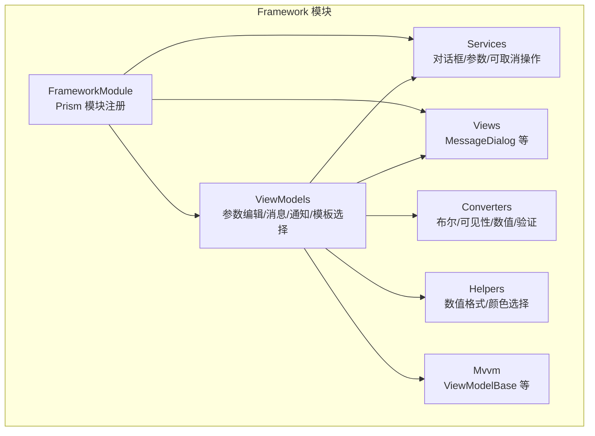
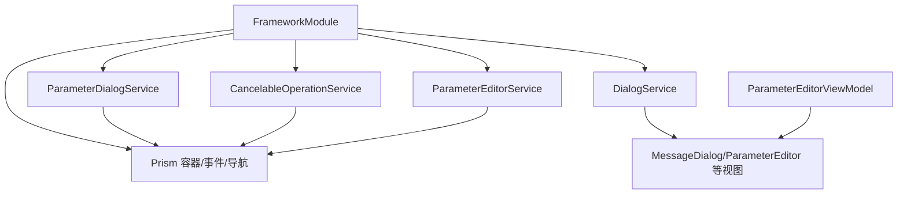
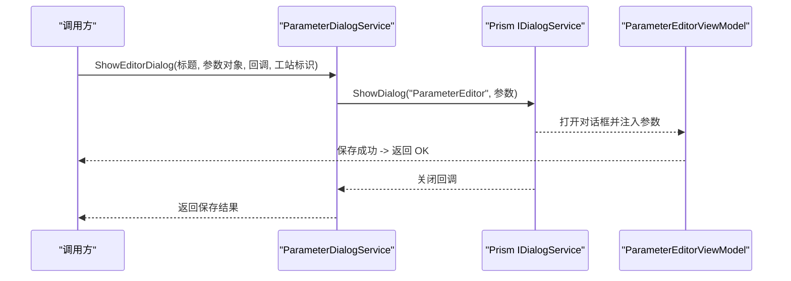
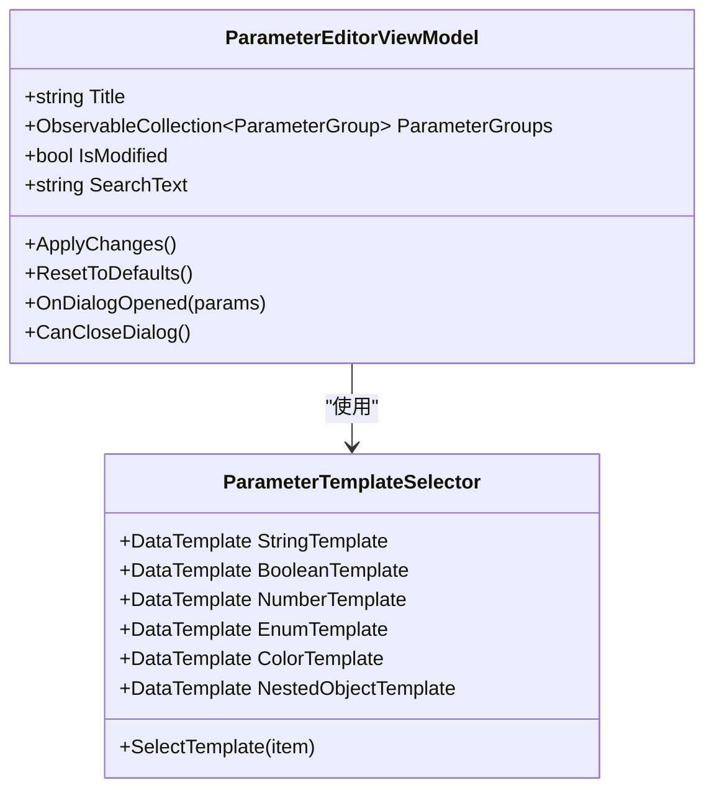
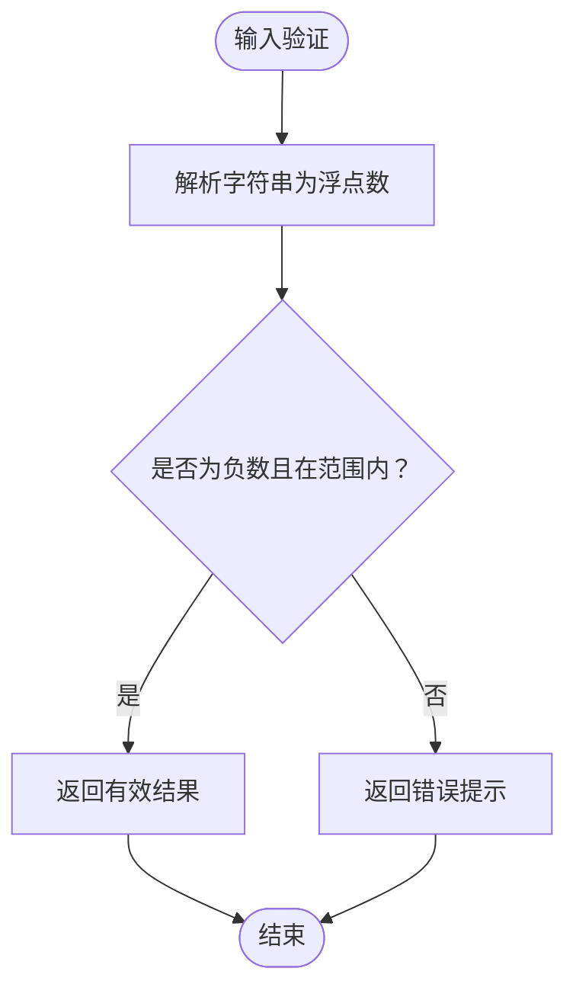
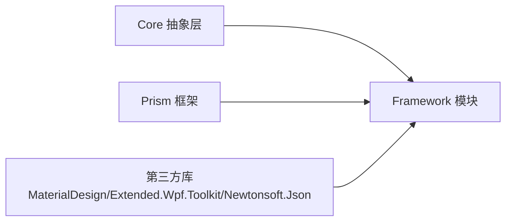

# 框架支撑层（Framework）

<cite>
**本文档引用的文件**
- [Framework.csproj](file://Framework/Framework.csproj)
- [FrameworkModule.cs](file://Framework/FrameworkModule.cs)
- [DialogService.cs](file://Framework/Services/DialogService.cs)
- [ParameterDialogService.cs](file://Framework/Services/ParameterDialogService.cs)
- [CancelableOperationService.cs](file://Framework/Services/CancelableOperationService.cs)
- [ViewModelBase.cs](file://Framework/Mvvm/ViewModelBase.cs)
- [ParameterEditorViewModel.cs](file://Framework/ViewModels/ParameterEditorViewModel.cs)
- [MessageDialogViewModel.cs](file://Framework/ViewModels/MessageDialogViewModel.cs)
- [NotificationDialogViewModel.cs](file://Framework/ViewModels/NotificationDialogViewModel.cs)
- [ParameterTemplateSelector.cs](file://Framework/ViewModels/ParameterTemplateSelector.cs)
- [MessageDialog.xaml.cs](file://Framework/Views/MessageDialog.xaml.cs)
- [BooleanToVisibilityConverter.cs](file://Framework/Converters/BooleanToVisibilityConverter.cs)
- [NegativeFloatValidationRule.cs](file://Framework/Converters/NegativeFloatValidationRule.cs)
- [NumericFormatHelper.cs](file://Framework/Helpers/NumericFormatHelper.cs)
- [ColorPickerHelper.cs](file://Framework/Helpers/ColorPickerHelper.cs)
- [ColorHelper.cs](file://Framework/ColorHelper.cs)
</cite>

## 目录
1. [简介](#简介)
2. [项目结构](#项目结构)
3. [核心组件](#核心组件)
4. [架构总览](#架构总览)
5. [详细组件分析](#详细组件分析)
6. [依赖关系分析](#依赖关系分析)
7. [性能考虑](#性能考虑)
8. [故障排查指南](#故障排查指南)
9. [结论](#结论)
10. [附录](#附录)

## 简介
本文件面向Framework框架支撑层，系统性梳理其通用UI组件库、对话框服务系统、参数编辑器、导航管理等框架级能力，深入解析MVVM架构实现、数据转换器系统、验证规则、颜色辅助工具等通用工具类的设计与使用方式。同时阐述DialogService、ParameterDialogService等服务的工作原理与扩展机制，提供Converter转换器的使用示例、自定义Converter开发指南、对话框服务的集成方法，并给出框架组件的样式定制、响应式设计与性能优化策略。

## 项目结构
Framework模块采用分层与按功能域组织的混合结构：
- Services：封装跨模块可复用的服务（对话框、参数编辑、可取消操作等）
- ViewModels：MVVM视图模型层，承载业务状态与交互逻辑
- Views：对话框与通用视图的XAML与后台代码
- Converters：WPF数据转换器集合
- Helpers：UI行为与工具类（如数值格式化、颜色选择）
- Mvvm：MVVM基础类（ViewModelBase等）
- Models：预留模型空间
- FrameworkModule：Prism模块注册入口，集中注册服务与导航

**图表来源**
- [FrameworkModule.cs:31-55](file://Framework/FrameworkModule.cs#L31-L55)
- [Framework.csproj:12-29](file://Framework/Framework.csproj#L12-L29)

**章节来源**
- [Framework.csproj:1-38](file://Framework/Framework.csproj#L1-L38)
- [FrameworkModule.cs:15-56](file://Framework/FrameworkModule.cs#L15-L56)

## 核心组件
- 对话框服务系统
  - DialogService：静态工具类，提供阻塞/非阻塞、异步、Toast提示等多种对话框展示能力；内置打开对话框跟踪与清理机制，确保资源释放与线程安全。
  - ParameterDialogService：基于Prism对话框服务的参数编辑器封装，负责将参数对象、标题、回调与工站标识打包传入“ParameterEditor”对话框，统一返回保存结果。
  - 可取消操作服务 CancelableOperationService：提供带取消、进度与状态上报的异步操作封装，通过事件总线发布进度与完成状态，支持对话框与后台任务并行协作。
- 参数编辑器
  - ParameterEditorViewModel：反射扫描TaskParametersBase参数对象，动态生成参数组与参数项（字符串、布尔、数值、枚举、颜色、嵌套对象），支持搜索过滤、类型转换、默认值重置、保存回调与事件发布。
  - ParameterTemplateSelector：根据参数项类型选择对应DataTemplate，实现参数界面的多态渲染。
- MVVM基础
  - ViewModelBase：继承Prism的BindableBase并实现IDestructible，提供销毁钩子，便于资源清理。
- 数据转换器与验证
  - BooleanToVisibilityConverter：布尔到可见性的双向转换，支持Inverse参数控制反向逻辑。
  - NegativeFloatValidationRule：数值输入验证规则，限定负数范围与错误提示。
- 工具与辅助
  - NumericFormatHelper：AttachedProperty，为NumericUpDown设置StringFormat，避免绑定丢失并保证加载后即时生效。
  - ColorPickerHelper：颜色选择命令与ColorPickerDialog，集成MaterialDesign颜色选择器。
  - ColorHelper：Material Design 主题色常量与便捷方法。

**章节来源**
- [DialogService.cs:14-431](file://Framework/Services/DialogService.cs#L14-L431)
- [ParameterDialogService.cs:10-48](file://Framework/Services/ParameterDialogService.cs#L10-L48)
- [CancelableOperationService.cs:11-176](file://Framework/Services/CancelableOperationService.cs#L11-L176)
- [ParameterEditorViewModel.cs:28-510](file://Framework/ViewModels/ParameterEditorViewModel.cs#L28-L510)
- [ParameterTemplateSelector.cs:7-40](file://Framework/ViewModels/ParameterTemplateSelector.cs#L7-L40)
- [ViewModelBase.cs:6-15](file://Framework/Mvvm/ViewModelBase.cs#L6-L15)
- [BooleanToVisibilityConverter.cs:9-46](file://Framework/Converters/BooleanToVisibilityConverter.cs#L9-L46)
- [NegativeFloatValidationRule.cs:7-32](file://Framework/Converters/NegativeFloatValidationRule.cs#L7-L32)
- [NumericFormatHelper.cs:9-85](file://Framework/Helpers/NumericFormatHelper.cs#L9-L85)
- [ColorPickerHelper.cs:12-101](file://Framework/Helpers/ColorPickerHelper.cs#L12-L101)
- [ColorHelper.cs:5-20](file://Framework/ColorHelper.cs#L5-L20)

## 架构总览
Framework模块通过Prism进行模块化装配，核心服务在FrameworkModule中集中注册，包括参数编辑器、参数存储、参数对话框服务、文件对话框服务、树配置服务以及可取消操作服务。对话框通过Prism DialogService统一管理，参数编辑器通过导航注册与参数模板选择器实现多类型参数的可视化编辑。

**图表来源**
- [FrameworkModule.cs:31-55](file://Framework/FrameworkModule.cs#L31-L55)
- [ParameterDialogService.cs:22-42](file://Framework/Services/ParameterDialogService.cs#L22-L42)
- [DialogService.cs:87-131](file://Framework/Services/DialogService.cs#L87-L131)
- [CancelableOperationService.cs:16-128](file://Framework/Services/CancelableOperationService.cs#L16-L128)

## 详细组件分析

### 对话框服务系统
- DialogService
  - 提供阻塞/非阻塞、异步、Toast提示等多形态对话框展示，内部维护打开对话框的弱引用集合，确保关闭时清理与结果返回。
  - 支持自定义按钮数量与默认按钮索引，通过回调或TaskCompletionSource返回结果。
  - 内置自动关闭计时器与Owner窗口适配，保证用户体验与线程安全。
- ParameterDialogService
  - 基于Prism IDialogService，将参数对象、标题、回调与工站标识作为参数传入“ParameterEditor”对话框，统一返回保存结果。
- 可取消操作服务 CancelableOperationService
  - 并行执行后台任务与显示可取消对话框，通过事件总线发布进度与状态，支持取消令牌与异常处理。

**图表来源**
- [ParameterDialogService.cs:19-46](file://Framework/Services/ParameterDialogService.cs#L19-L46)
- [ParameterEditorViewModel.cs:489-508](file://Framework/ViewModels/ParameterEditorViewModel.cs#L489-L508)

**章节来源**
- [DialogService.cs:69-408](file://Framework/Services/DialogService.cs#L69-L408)
- [ParameterDialogService.cs:19-46](file://Framework/Services/ParameterDialogService.cs#L19-L46)
- [CancelableOperationService.cs:22-144](file://Framework/Services/CancelableOperationService.cs#L22-L144)

### 参数编辑器与导航管理
- ParameterEditorViewModel
  - 通过反射扫描TaskParametersBase对象，动态构建参数组与参数项，支持字符串、布尔、数值、枚举、颜色与嵌套对象。
  - 支持搜索过滤、默认值重置、类型转换（含可空类型、枚举、数值精度）、保存回调与事件发布。
  - 实现Prism IDialogAware接口，接收参数、处理关闭与请求关闭。
- ParameterTemplateSelector
  - 根据参数项类型选择对应DataTemplate，实现参数界面的多态渲染。
- 导航与注册
  - FrameworkModule中注册“ParameterEditor”导航与“MessageDialog/NotificationDialog/CancelableOperationDialog”等对话框。

**图表来源**
- [ParameterEditorViewModel.cs:28-510](file://Framework/ViewModels/ParameterEditorViewModel.cs#L28-L510)
- [ParameterTemplateSelector.cs:7-40](file://Framework/ViewModels/ParameterTemplateSelector.cs#L7-L40)

**章节来源**
- [ParameterEditorViewModel.cs:63-508](file://Framework/ViewModels/ParameterEditorViewModel.cs#L63-L508)
- [ParameterTemplateSelector.cs:16-37](file://Framework/ViewModels/ParameterTemplateSelector.cs#L16-L37)
- [FrameworkModule.cs:46-54](file://Framework/FrameworkModule.cs#L46-L54)

### MVVM基础与数据转换器
- ViewModelBase
  - 继承Prism.BindableBase并实现IDestructible，提供Destroy钩子，便于资源清理。
- BooleanToVisibilityConverter
  - 支持布尔到可见性的双向转换，参数“Inverse”控制反向逻辑。
- NegativeFloatValidationRule
  - 输入验证规则，限定负数范围与错误提示，适用于数值输入场景。

**图表来源**
- [NegativeFloatValidationRule.cs:12-30](file://Framework/Converters/NegativeFloatValidationRule.cs#L12-L30)

**章节来源**
- [ViewModelBase.cs:6-15](file://Framework/Mvvm/ViewModelBase.cs#L6-L15)
- [BooleanToVisibilityConverter.cs:14-44](file://Framework/Converters/BooleanToVisibilityConverter.cs#L14-L44)
- [NegativeFloatValidationRule.cs:12-30](file://Framework/Converters/NegativeFloatValidationRule.cs#L12-L30)

### 工具与辅助
- NumericFormatHelper
  - AttachedProperty，为NumericUpDown设置StringFormat，避免绑定丢失并保证加载后即时生效。
- ColorPickerHelper
  - 颜色选择命令与ColorPickerDialog，集成MaterialDesign颜色选择器，支持确定/取消与异常提示。
- ColorHelper
  - Material Design 主题色常量与便捷方法，便于全局样式一致。

**章节来源**
- [NumericFormatHelper.cs:11-63](file://Framework/Helpers/NumericFormatHelper.cs#L11-L63)
- [ColorPickerHelper.cs:14-37](file://Framework/Helpers/ColorPickerHelper.cs#L14-L37)
- [ColorHelper.cs:7-17](file://Framework/ColorHelper.cs#L7-L17)

## 依赖关系分析
Framework模块依赖Core抽象层与Prism框架，通过FrameworkModule集中注册服务与对话框，形成清晰的解耦与可扩展架构。

**图表来源**
- [Framework.csproj:12-21](file://Framework/Framework.csproj#L12-L21)
- [FrameworkModule.cs:2-11](file://Framework/FrameworkModule.cs#L2-L11)

**章节来源**
- [Framework.csproj:12-29](file://Framework/Framework.csproj#L12-L29)
- [FrameworkModule.cs:31-55](file://Framework/FrameworkModule.cs#L31-L55)

## 性能考虑
- 对话框生命周期管理
  - DialogService内部使用并发字典跟踪打开的对话框，配合弱引用与清理回调，避免内存泄漏与资源悬挂。
- 异步与并行
  - CancelableOperationService并行执行后台任务与显示对话框，减少UI阻塞；通过事件总线发布进度，避免轮询带来的CPU消耗。
- 绑定与渲染
  - NumericFormatHelper在控件加载后应用格式化，避免重复绑定与闪烁；ParameterEditorViewModel按需过滤参数组，降低渲染压力。
- 类型转换与反射
  - ParameterEditorViewModel在保存时进行类型转换与特性检查，避免无效赋值与异常；建议在高频场景缓存反射元数据以提升性能。

[本节为通用指导，无需具体文件分析]

## 故障排查指南
- 对话框无法关闭或结果未返回
  - 检查DialogService的RegisterDialog与Closed事件处理，确保回调正确设置并触发清理。
  - 确认调用方使用正确的TaskCompletionSource或回调处理。
- 参数编辑器未显示或值未保存
  - 确认FrameworkModule中已注册“ParameterEditor”导航与参数模板选择器。
  - 检查参数对象是否包含可写属性、是否被忽略特性标记或为不支持类型。
- 颜色选择异常
  - ColorPickerHelper捕获异常并弹出错误提示，检查初始颜色与MaterialDesign资源引用。
- 数值格式化失效
  - NumericFormatHelper依赖NumericUpDown内部TextBox绑定，确保控件已加载且未被外部覆盖绑定。

**章节来源**
- [DialogService.cs:49-63](file://Framework/Services/DialogService.cs#L49-L63)
- [ParameterEditorViewModel.cs:264-300](file://Framework/ViewModels/ParameterEditorViewModel.cs#L264-L300)
- [ColorPickerHelper.cs:24-36](file://Framework/Helpers/ColorPickerHelper.cs#L24-L36)
- [NumericFormatHelper.cs:42-63](file://Framework/Helpers/NumericFormatHelper.cs#L42-L63)

## 结论
Framework模块通过Prism实现模块化装配，提供完善的对话框服务、参数编辑器与可取消操作能力，结合丰富的转换器与工具类，形成可扩展、可维护的通用UI支撑体系。建议在实际项目中遵循以下实践：
- 使用FrameworkModule集中注册服务与对话框，确保依赖注入一致性
- 通过ParameterEditorViewModel与ParameterTemplateSelector实现参数的可视化与多态渲染
- 借助DialogService与ParameterDialogService统一对话框体验
- 利用NumericFormatHelper与ColorPickerHelper提升输入与视觉一致性
- 在高频场景优化反射与绑定性能，避免不必要的UI刷新

[本节为总结，无需具体文件分析]

## 附录

### 对话框服务集成步骤
- 注册Prism对话框与服务
  - 在FrameworkModule中注册“MessageDialog/NotificationDialog/CancelableOperationDialog”等对话框与对应ViewModel
  - 注册ParameterDialogService与IParameterDialogService接口
- 调用参数编辑器
  - 通过IParameterDialogService.ShowEditorDialog传入标题、参数对象、保存回调与工站标识
  - 在回调中处理保存结果与后续逻辑

**章节来源**
- [FrameworkModule.cs:37-54](file://Framework/FrameworkModule.cs#L37-L54)
- [ParameterDialogService.cs:19-46](file://Framework/Services/ParameterDialogService.cs#L19-L46)

### Converter使用示例与自定义指南
- 使用示例
  - 布尔到可见性：在XAML中绑定布尔属性，使用BooleanToVisibilityConverter，必要时添加参数“Inverse”
  - 数值格式化：在NumericUpDown上附加NumericFormatHelper.FormatString属性设置显示格式
- 自定义Converter
  - 实现IValueConverter接口，注意ConvertBack的可选实现与参数解析
  - 在XAML中注册Converter并在Binding中引用

**章节来源**
- [BooleanToVisibilityConverter.cs:14-44](file://Framework/Converters/BooleanToVisibilityConverter.cs#L14-L44)
- [NumericFormatHelper.cs:11-63](file://Framework/Helpers/NumericFormatHelper.cs#L11-L63)

### 样式定制与响应式设计
- Material Design主题
  - 使用ColorHelper与ColorPickerHelper统一主色与颜色选择体验
  - 在XAML中引用MaterialDesign样式资源，确保按钮、输入框等控件风格一致
- 响应式布局
  - 使用Prism导航与对话框的CenterOwner/居中策略，适配多分辨率屏幕
  - 在参数编辑器中使用搜索过滤与分组折叠，提升大数据集下的可读性

**章节来源**
- [ColorHelper.cs:7-17](file://Framework/ColorHelper.cs#L7-L17)
- [MessageDialog.xaml.cs:46-50](file://Framework/Views/MessageDialog.xaml.cs#L46-L50)
- [ParameterEditorViewModel.cs:112-132](file://Framework/ViewModels/ParameterEditorViewModel.cs#L112-L132)