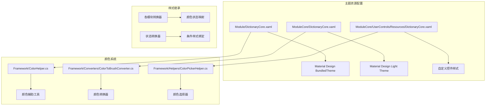
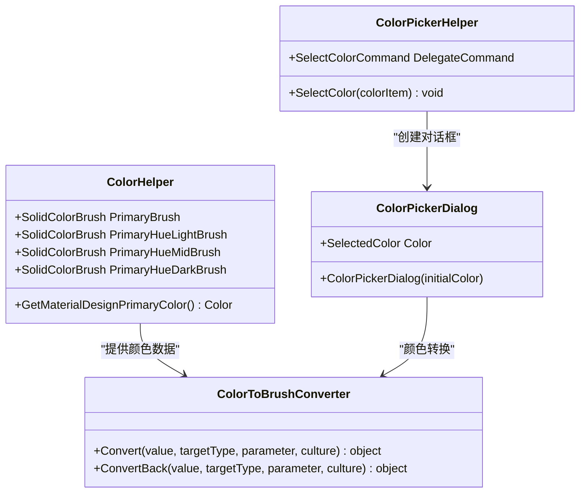
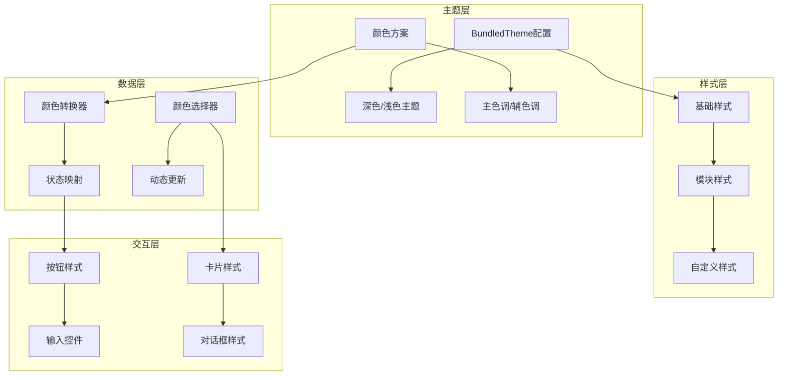
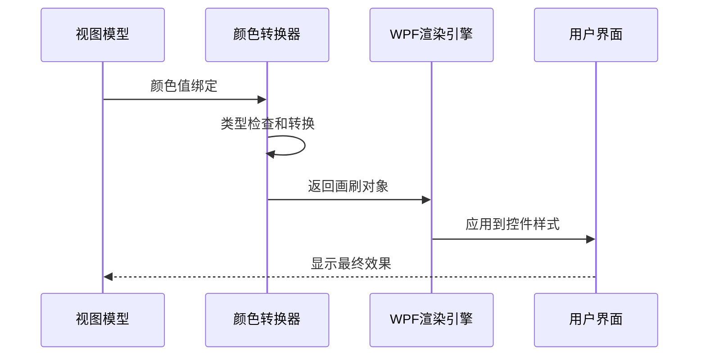
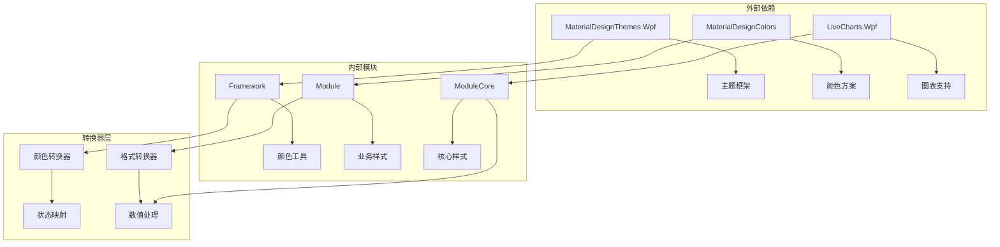

# Material Design主题系统

<cite>
**本文档引用的文件**
- [Module/DictionaryCore.xaml](file://Module/DictionaryCore.xaml)
- [ModuleCore/DictionaryCore.xaml](file://ModuleCore/DictionaryCore.xaml)
- [ModuleCore/UserControls/Resources/DictionaryCore.xaml](file://ModuleCore/UserControls/Resources/DictionaryCore.xaml)
- [Framework/ColorHelper.cs](file://Framework/ColorHelper.cs)
- [Framework/Converters/ColorToBrushConverter.cs](file://Framework/Converters/ColorToBrushConverter.cs)
- [Framework/Helpers/ColorPickerHelper.cs](file://Framework/Helpers/ColorPickerHelper.cs)
- [Framework/Converters/BrushToColorConverter.cs](file://Framework/Converters/BrushToColorConverter.cs)
- [Module/Converters/ColorToLightBrushConverter.cs](file://Module/Converters/ColorToLightBrushConverter.cs)
- [Module/Converters/StatusToColorConverter.cs](file://Module/Converters/StatusToColorConverter.cs)
- [Module/Converters/StatusToColorConverter2.cs](file://Module/Converters/StatusToColorConverter2.cs)
- [Module/Converters/ValueToColorConverter.cs](file://Module/Converters/ValueToColorConverter.cs)
- [ModuleCore/Common/Converters/StringColorConverter.cs](file://ModuleCore/Common/Converters/StringColorConverter.cs)
- [Module/Converters/BooleanToColorConverter.cs](file://Module/Converters/BooleanToColorConverter.cs)
- [Module/Converters/NGColorConverter.cs](file://Module/Converters/NGColorConverter.cs)
- [MotionControl/Converters/BoolToLedColorConverter.cs](file://MotionControl/Converters/BoolToLedColorConverter.cs)
- [HalconWrapper/Config/HObjectWithColor.cs](file://HalconWrapper/Config/HObjectWithColor.cs)
</cite>

## 目录
1. [简介](#简介)
2. [项目结构](#项目结构)
3. [核心组件](#核心组件)
4. [架构概览](#架构概览)
5. [详细组件分析](#详细组件分析)
6. [依赖关系分析](#依赖关系分析)
7. [性能考虑](#性能考虑)
8. [故障排除指南](#故障排除指南)
9. [结论](#结论)
10. [附录](#附录)

## 简介

GZQL_MACHINE项目采用Material Design设计语言在WPF中实现现代化用户界面。该主题系统通过Material Design XAML (MDXAML)框架提供了一套完整的UI组件库，包括颜色系统、字体排版、图标库和交互模式。

Material Design主题系统的核心目标是：
- 提供一致的品牌视觉体验
- 支持深色/浅色主题切换
- 实现响应式设计原则
- 确保无障碍访问支持
- 支持高对比度模式

## 项目结构

项目中的Material Design主题系统主要分布在以下模块中：

**图表来源**
- [Module/DictionaryCore.xaml:1-15](file://Module/DictionaryCore.xaml#L1-L15)
- [ModuleCore/DictionaryCore.xaml:1-9](file://ModuleCore/DictionaryCore.xaml#L1-L9)
- [Framework/ColorHelper.cs:1-21](file://Framework/ColorHelper.cs#L1-L21)

**章节来源**
- [Module/DictionaryCore.xaml:1-15](file://Module/DictionaryCore.xaml#L1-L15)
- [ModuleCore/DictionaryCore.xaml:1-9](file://ModuleCore/DictionaryCore.xaml#L1-L9)
- [ModuleCore/UserControls/Resources/DictionaryCore.xaml:1-56](file://ModuleCore/UserControls/Resources/DictionaryCore.xaml#L1-L56)

## 核心组件

### 主题资源配置

项目采用分层的主题配置策略，通过多个ResourceDictionary实现模块化管理：

**主模块主题配置**：位于Module/DictionaryCore.xaml，使用Material Design BundledTheme实现一键主题配置，支持PrimaryColor和SecondaryColor的动态设置。

**核心模块主题配置**：位于ModuleCore/DictionaryCore.xaml，提供基础的Material Design Light主题和颜色资源引用。

**用户控件主题配置**：位于ModuleCore/UserControls/Resources/DictionaryCore.xaml，专注于自定义控件的样式定义和模板。

### 颜色系统架构

**图表来源**
- [Framework/ColorHelper.cs:5-18](file://Framework/ColorHelper.cs#L5-L18)
- [Framework/Converters/ColorToBrushConverter.cs:8-31](file://Framework/Converters/ColorToBrushConverter.cs#L8-L31)
- [Framework/Helpers/ColorPickerHelper.cs:12-38](file://Framework/Helpers/ColorPickerHelper.cs#L12-L38)

### 样式继承机制

项目实现了多层次的样式继承体系：

1. **基础样式层**：Material Design提供的默认样式
2. **模块样式层**：各功能模块的特定样式定义
3. **自定义样式层**：业务逻辑相关的样式扩展

**章节来源**
- [Framework/ColorHelper.cs:1-21](file://Framework/ColorHelper.cs#L1-L21)
- [Framework/Converters/ColorToBrushConverter.cs:1-33](file://Framework/Converters/ColorToBrushConverter.cs#L1-L33)
- [Framework/Helpers/ColorPickerHelper.cs:1-102](file://Framework/Helpers/ColorPickerHelper.cs#L1-L102)

## 架构概览

Material Design主题系统的整体架构采用分层设计，确保了良好的可维护性和扩展性：

**图表来源**
- [Module/DictionaryCore.xaml:10-13](file://Module/DictionaryCore.xaml#L10-L13)
- [ModuleCore/DictionaryCore.xaml:4-7](file://ModuleCore/DictionaryCore.xaml#L4-L7)

## 详细组件分析

### 颜色辅助工具类

ColorHelper类提供了Material Design标准颜色的静态访问接口，确保整个应用程序使用统一的颜色规范。

**核心特性**：
- 提供主色调的亮、中、暗三种变体
- 支持直接获取Material Design主色调
- 便于全局颜色管理

**使用场景**：
- 统一应用品牌色彩
- 动态主题切换支持
- 颜色一致性保证

### 颜色转换器系统

项目实现了完整的颜色转换器生态系统，支持不同数据类型之间的颜色转换：

**图表来源**
- [Framework/Converters/ColorToBrushConverter.cs:12-30](file://Framework/Converters/ColorToBrushConverter.cs#L12-L30)

### 颜色选择器集成

ColorPickerHelper集成了Material Design的颜色选择器功能，提供了用户友好的颜色选择界面：

**功能特点**：
- 基于Material Design ColorPicker控件
- 支持十六进制颜色输入
- 实时颜色预览
- 确定/取消操作反馈

**章节来源**
- [Framework/Helpers/ColorPickerHelper.cs:20-37](file://Framework/Helpers/ColorPickerHelper.cs#L20-L37)
- [Framework/Helpers/ColorPickerHelper.cs:40-101](file://Framework/Helpers/ColorPickerHelper.cs#L40-L101)

### 状态颜色映射系统

项目实现了多种状态到颜色的映射转换器，用于根据数据状态动态改变控件外观：

| 转换器类型 | 用途 | 输入状态 | 输出颜色 |
|-----------|------|----------|----------|
| StatusToColorConverter | 通用状态显示 | 成功/失败/警告 | 对应状态颜色 |
| BoolToColorConverter | 布尔值显示 | True/False | 绿色/红色 |
| ValueToColorConverter | 数值范围显示 | 数值区间 | 渐变色彩 |
| NGColorConverter | 不良品标记 | 正常/异常 | 绿色/红色 |

**章节来源**
- [Module/Converters/StatusToColorConverter.cs:1-200](file://Module/Converters/StatusToColorConverter.cs)
- [Module/Converters/BooleanToColorConverter.cs:1-200](file://Module/Converters/BooleanToColorConverter.cs)
- [Module/Converters/ValueToColorConverter.cs:1-200](file://Module/Converters/ValueToColorConverter.cs)
- [Module/Converters/NGColorConverter.cs:1-200](file://Module/Converters/NGColorConverter.cs)

### 自定义控件样式

ModuleCore/UserControls/Resources/DictionaryCore.xaml定义了专门的设计器控件样式：

**样式特性**：
- DesignerItemStyle：支持移动和变换的设计器项
- OnlySizeStyle：仅支持尺寸调整的样式
- 内置装饰器支持
- 设备像素对齐

**章节来源**
- [ModuleCore/UserControls/Resources/DictionaryCore.xaml:17-54](file://ModuleCore/UserControls/Resources/DictionaryCore.xaml#L17-L54)

## 依赖关系分析

Material Design主题系统的依赖关系呈现清晰的层次结构：

**图表来源**
- [Module/DictionaryCore.xaml:3-13](file://Module/DictionaryCore.xaml#L3-L13)
- [ModuleCore/DictionaryCore.xaml:6-7](file://ModuleCore/DictionaryCore.xaml#L6-L7)

**章节来源**
- [Module/DictionaryCore.xaml:1-15](file://Module/DictionaryCore.xaml#L1-L15)
- [ModuleCore/DictionaryCore.xaml:1-9](file://ModuleCore/DictionaryCore.xaml#L1-L9)

## 性能考虑

Material Design主题系统在性能方面的优化策略：

### 资源加载优化
- 使用pack URI进行资源引用，支持延迟加载
- 合并多个ResourceDictionary减少加载开销
- 避免重复定义相同资源

### 渲染性能
- 使用设备像素对齐提高渲染质量
- 优化颜色转换器的计算复杂度
- 合理使用透明度和阴影效果

### 内存管理
- 静态颜色资源避免重复创建
- 延迟初始化大型对话框组件
- 及时释放不需要的资源引用

## 故障排除指南

### 常见问题及解决方案

**主题不生效**
- 检查BundledTheme配置是否正确
- 确认MaterialDesignThemes.Wpf版本兼容性
- 验证ResourceDictionary合并顺序

**颜色显示异常**
- 确认ColorToBrushConverter正确引用
- 检查颜色值格式是否符合预期
- 验证BrushToColorConverter双向转换

**颜色选择器无法打开**
- 确认MaterialDesignThemes.Wpf安装完整
- 检查ColorPicker控件依赖项
- 验证应用程序资源路径配置

**章节来源**
- [Framework/Helpers/ColorPickerHelper.cs:32-36](file://Framework/Helpers/ColorPickerHelper.cs#L32-L36)

## 结论

GZQL_MACHINE项目的Material Design主题系统通过合理的架构设计和组件组织，成功实现了现代化的WPF界面开发。系统的主要优势包括：

1. **模块化设计**：通过分层的主题配置实现良好的可维护性
2. **统一色彩管理**：提供完整的颜色辅助工具和转换器系统
3. **灵活的主题切换**：支持深色/浅色主题的动态切换
4. **丰富的样式体系**：从基础样式到自定义样式的完整覆盖
5. **完善的工具支持**：集成颜色选择器和状态映射功能

该系统为后续的功能扩展和品牌定制奠定了坚实的基础。

## 附录

### 主题定制指南

**品牌色彩适配**
1. 修改BundledTheme中的PrimaryColor和SecondaryColor
2. 更新ColorHelper中的品牌色彩定义
3. 调整状态转换器的颜色映射表

**响应式设计原则**
1. 使用相对尺寸而非固定像素
2. 实现网格系统的自适应布局
3. 考虑不同屏幕分辨率的显示效果

**无障碍访问支持**
1. 确保足够的颜色对比度
2. 支持键盘导航和快捷键
3. 提供屏幕阅读器兼容性

**高对比度模式**
1. 定义高对比度主题资源
2. 实现动态主题切换逻辑
3. 测试不同对比度下的可读性