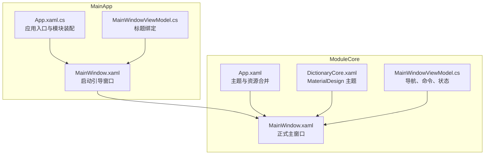
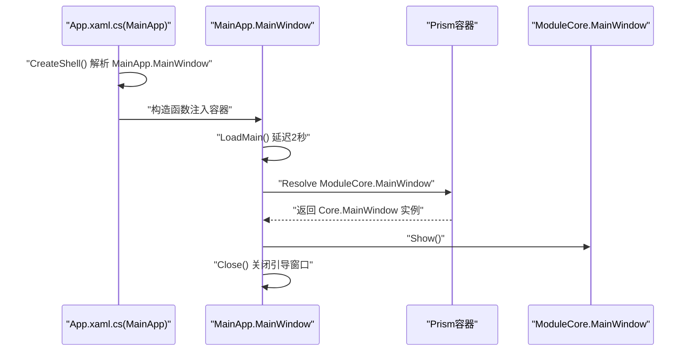
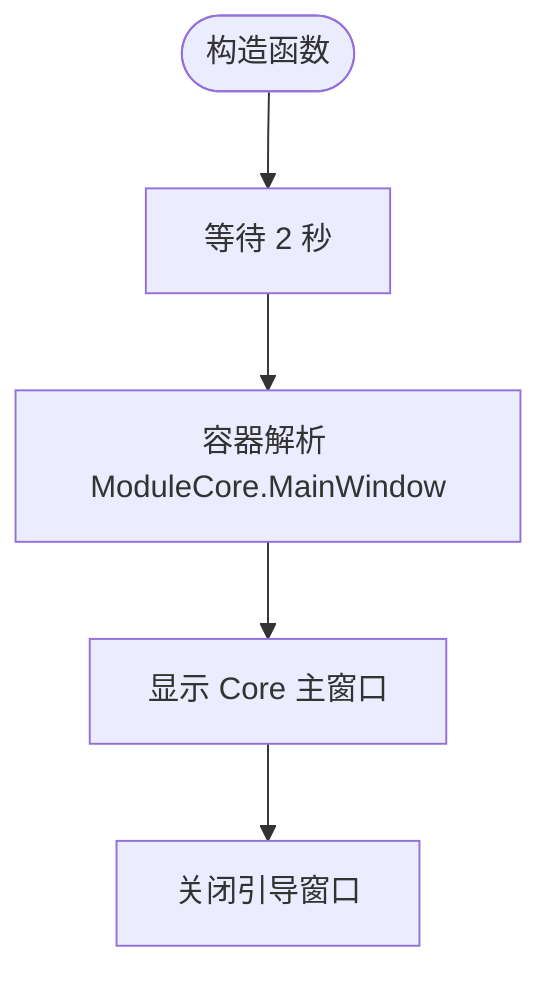
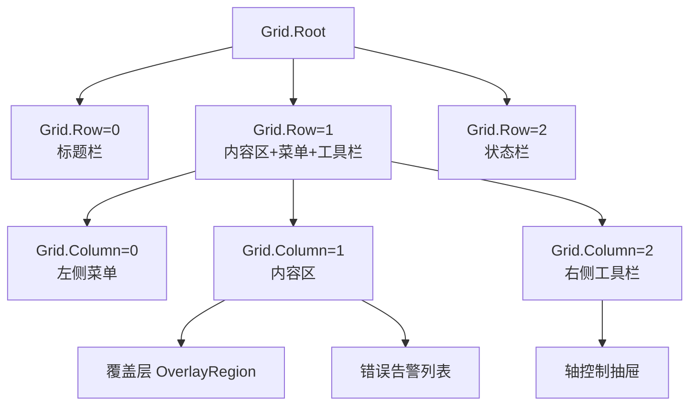
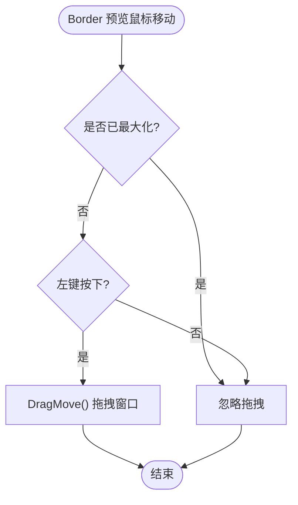
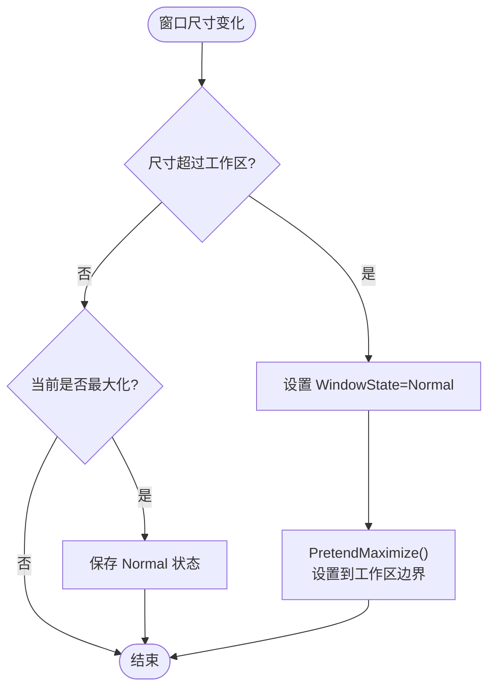
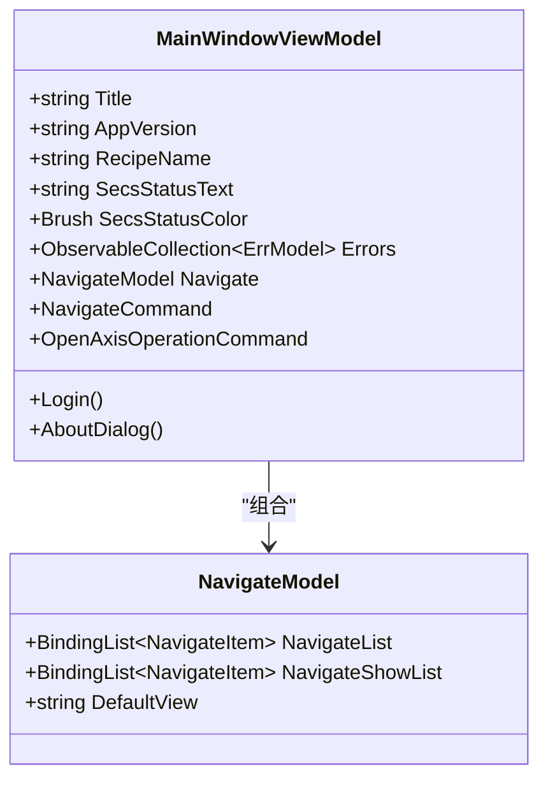
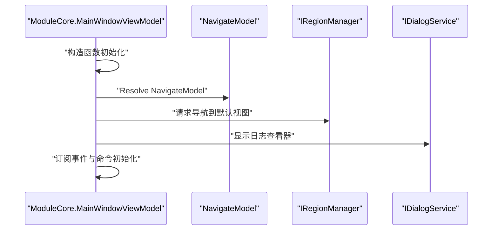
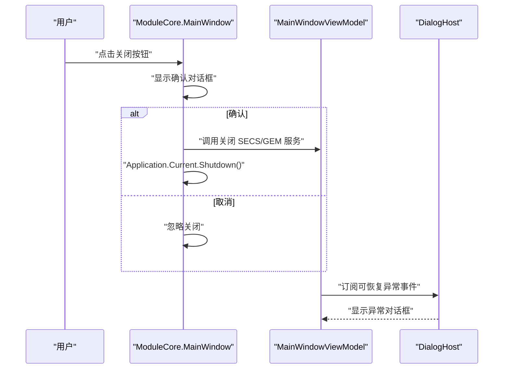
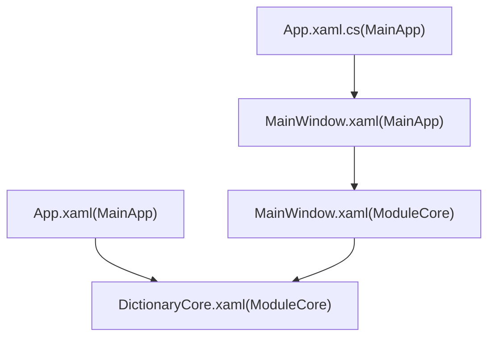

# 主窗口布局设计

<cite>
**本文引用的文件列表**
- [MainWindow.xaml（MainApp）](file://MainApp/Views/MainWindow.xaml)
- [MainWindow.xaml.cs（MainApp）](file://MainApp/Views/MainWindow.xaml.cs)
- [MainWindowViewModel.cs（MainApp）](file://MainApp/ViewModels/MainWindowViewModel.cs)
- [App.xaml（MainApp）](file://MainApp/App.xaml)
- [App.xaml.cs（MainApp）](file://MainApp/App.xaml.cs)
- [MainWindow.xaml（ModuleCore）](file://ModuleCore/Views/MainWindow.xaml)
- [MainWindow.xaml.cs（ModuleCore）](file://ModuleCore/Views/MainWindow.xaml.cs)
- [MainWindowViewModel.cs（ModuleCore）](file://ModuleCore/ViewModels/MainWindowViewModel.cs)
- [DictionaryCore.xaml（ModuleCore）](file://ModuleCore/DictionaryCore.xaml)
- [NavigateModel.cs（Framework）](file://Framework/Mvvm/NavigateModel.cs)
- [ViewModelBase.cs（Framework）](file://Framework/Mvvm/ViewModelBase.cs)
</cite>

## 目录
1. [简介](#简介)
2. [项目结构](#项目结构)
3. [核心组件](#核心组件)
4. [架构总览](#架构总览)
5. [详细组件分析](#详细组件分析)
6. [依赖关系分析](#依赖关系分析)
7. [性能考量](#性能考量)
8. [故障排查指南](#故障排查指南)
9. [结论](#结论)
10. [附录](#附录)

## 简介
本文档围绕 GZQL_MACHINE 的主窗口布局系统进行深入解析，重点覆盖以下方面：
- MainWindow 的 XAML 布局结构与 Grid 网格系统
- Border 边框设计与视觉层次
- 无边框窗口样式实现、标题栏自定义与窗口状态管理
- MVVM 模式下的数据绑定机制、视图模型生命周期与窗口初始化流程
- 窗口尺寸调整、位置管理与多显示器支持
- 窗口事件处理、消息传递与状态同步的技术细节

## 项目结构
主窗口布局由两层壳层组成：
- MainApp 层：负责启动引导与过渡展示，随后切换至 ModuleCore 的正式主窗口
- ModuleCore 层：承载完整的业务界面、导航菜单、内容区域、状态栏与对话框宿主

图表来源
- [App.xaml.cs（MainApp）:54-77](file://MainApp/App.xaml.cs#L54-L77)
- [MainWindow.xaml（MainApp）:1-24](file://MainApp/Views/MainWindow.xaml#L1-L24)
- [MainWindow.xaml（ModuleCore）:1-25](file://ModuleCore/Views/MainWindow.xaml#L1-L25)
- [DictionaryCore.xaml（ModuleCore）:1-9](file://ModuleCore/DictionaryCore.xaml#L1-L9)

章节来源
- [App.xaml.cs（MainApp）:54-77](file://MainApp/App.xaml.cs#L54-L77)
- [MainWindow.xaml（MainApp）:1-24](file://MainApp/Views/MainWindow.xaml#L1-L24)
- [MainWindow.xaml（ModuleCore）:1-25](file://ModuleCore/Views/MainWindow.xaml#L1-L25)
- [DictionaryCore.xaml（ModuleCore）:1-9](file://ModuleCore/DictionaryCore.xaml#L1-L9)

## 核心组件
- MainApp.MainWindow：无边框引导窗口，用于短暂展示后切换到正式主窗口
- ModuleCore.MainWindow：正式主窗口，采用 MaterialDesign 主题，包含标题栏、菜单、内容区、右侧工具栏、状态栏与对话框宿主
- 视图模型：MainApp.MainWindowViewModel 与 ModuleCore.MainWindowViewModel 分别负责标题绑定与完整业务逻辑

章节来源
- [MainWindow.xaml（MainApp）:1-24](file://MainApp/Views/MainWindow.xaml#L1-L24)
- [MainWindowViewModel.cs（MainApp）:1-20](file://MainApp/ViewModels/MainWindowViewModel.cs#L1-L20)
- [MainWindow.xaml（ModuleCore）:1-25](file://ModuleCore/Views/MainWindow.xaml#L1-L25)
- [MainWindowViewModel.cs（ModuleCore）:36-115](file://ModuleCore/ViewModels/MainWindowViewModel.cs#L36-L115)

## 架构总览
整体采用 Prism 应用框架，结合 MVVM 与 Prism Region 导航，实现模块化与松耦合的主窗口布局。

图表来源
- [App.xaml.cs（MainApp）:54-57](file://MainApp/App.xaml.cs#L54-L57)
- [MainWindow.xaml.cs（MainApp）:19-29](file://MainApp/Views/MainWindow.xaml.cs#L19-L29)

章节来源
- [App.xaml.cs（MainApp）:54-57](file://MainApp/App.xaml.cs#L54-L57)
- [MainWindow.xaml.cs（MainApp）:19-29](file://MainApp/Views/MainWindow.xaml.cs#L19-L29)

## 详细组件分析

### 1) MainApp.MainWindow（引导窗口）
- 无边框样式：WindowStyle="None"，实现自绘标题栏与全屏拖拽
- 简洁布局：Grid + 两个 Border（蓝色背景与黑色半透明遮罩）+ 居中提示文本
- 数据绑定：Title 绑定到 ViewModel.Title；ViewModelLocator.AutoWireViewModel="True"
- 生命周期：构造函数中延迟 2 秒后解析 ModuleCore.MainWindow 并切换显示

图表来源
- [MainWindow.xaml（MainApp）:13](file://MainApp/Views/MainWindow.xaml#L13)
- [MainWindow.xaml.cs（MainApp）:19-29](file://MainApp/Views/MainWindow.xaml.cs#L19-L29)

章节来源
- [MainWindow.xaml（MainApp）:1-24](file://MainApp/Views/MainWindow.xaml#L1-L24)
- [MainWindowViewModel.cs（MainApp）:1-20](file://MainApp/ViewModels/MainWindowViewModel.cs#L1-L20)
- [MainWindow.xaml.cs（MainApp）:19-29](file://MainApp/Views/MainWindow.xaml.cs#L19-L29)

### 2) ModuleCore.MainWindow（正式主窗口）
- 无边框样式：WindowStyle="None"，配合标题栏拖拽与最大化/还原逻辑
- 标题栏自定义：顶部 40px 区域包含应用标题、状态指示、右上角功能按钮（关于、最小化、最大化/还原、关闭）
- Grid 网格系统：
  - 三行布局：标题栏行（40）、内容行（*）、状态栏行（40）
  - 三列布局：左侧菜单（宽度动态绑定）、内容区（*）、右侧工具栏（固定宽度）
- 内容区：使用 Prism Region "ContentRegionCore" 承载导航视图
- 覆盖层：OverlayRegion 用于居中显示覆盖对话框
- 错误告警：顶部错误列表，支持确认与自动清理
- 右侧工具栏：设置、登录、轴控制等按钮，带 MaterialDesign 图标与动画效果
- 轴控制抽屉：右侧 Drawer 从右滑出，宽度固定，遮罩层点击关闭
- 状态栏：包含用户信息、产品配方、SECS/GEM 状态、版本信息

图表来源
- [MainWindow.xaml（ModuleCore）:96-606](file://ModuleCore/Views/MainWindow.xaml#L96-L606)

章节来源
- [MainWindow.xaml（ModuleCore）:1-687](file://ModuleCore/Views/MainWindow.xaml#L1-L687)

### 3) Border 边框设计与视觉层次
- 蓝色背景层：用于品牌色统一
- 黑色半透明遮罩层：提升标题栏文字可读性
- 抽屉遮罩层：点击关闭轴控制面板
- 状态栏与标题栏：统一使用半透明黑背景增强对比度

章节来源
- [MainWindow.xaml（ModuleCore）:102-108](file://ModuleCore/Views/MainWindow.xaml#L102-L108)
- [MainWindow.xaml（ModuleCore）:585-592](file://ModuleCore/Views/MainWindow.xaml#L585-L592)
- [MainWindow.xaml（ModuleCore）:608-610](file://ModuleCore/Views/MainWindow.xaml#L608-L610)

### 4) 无边框样式与标题栏自定义
- 无边框：WindowStyle="None"
- 标题栏拖拽：Border 预览鼠标事件触发 DragMove，仅在未最大化时生效
- 双击标题栏：根据当前尺寸决定最大化或还原
- 功能按钮：最小化、最大化/还原、关闭，均通过事件处理实现

图表来源
- [MainWindow.xaml.cs（ModuleCore）:121-132](file://ModuleCore/Views/MainWindow.xaml.cs#L121-L132)

章节来源
- [MainWindow.xaml.cs（ModuleCore）:119-150](file://ModuleCore/Views/MainWindow.xaml.cs#L119-L150)

### 5) 窗口状态管理（最大化/还原/尺寸调整）
- 最大化：保存当前 Normal 状态，设置 Left/Top 为工作区左上角，宽高等于工作区，同时将最小宽高提升为工作区尺寸以禁用手动调整
- 还原：恢复之前保存的 Normal 状态
- 尺寸变化：当实际尺寸超过工作区时，强制 Normal 并执行 PretendMaximize 以保持视觉一致性
- 多显示器：基于 SystemParameters.WorkArea 获取工作区，适配多屏环境

图表来源
- [MainWindow.xaml.cs（ModuleCore）:208-240](file://ModuleCore/Views/MainWindow.xaml.cs#L208-L240)
- [MainWindow.xaml.cs（ModuleCore）:164-205](file://ModuleCore/Views/MainWindow.xaml.cs#L164-L205)

章节来源
- [MainWindow.xaml.cs（ModuleCore）:152-240](file://ModuleCore/Views/MainWindow.xaml.cs#L152-L240)

### 6) MVVM 模式与数据绑定机制
- 视图模型绑定：MainWindow.xaml 中 prism:ViewModelLocator.AutoWireViewModel="True" 自动绑定
- 标题绑定：Text="{Binding Title}" 绑定到 ViewModel.Title
- 导航与命令：NavigateCommand、Login、AboutDialog 等命令绑定到 ViewModel
- Region 导航：ContentRegionCore 承载导航视图，NavigateTarget 选择菜单项并触发导航
- 错误告警：Errors 集合绑定到顶部错误列表，支持确认与自动移除

图表来源
- [MainWindowViewModel.cs（ModuleCore）:36-115](file://ModuleCore/ViewModels/MainWindowViewModel.cs#L36-L115)
- [NavigateModel.cs（Framework）:6-29](file://Framework/Mvvm/NavigateModel.cs#L6-L29)

章节来源
- [MainWindow.xaml（ModuleCore）:17-18](file://ModuleCore/Views/MainWindow.xaml#L17-L18)
- [MainWindowViewModel.cs（ModuleCore）:36-115](file://ModuleCore/ViewModels/MainWindowViewModel.cs#L36-L115)
- [NavigateModel.cs（Framework）:6-29](file://Framework/Mvvm/NavigateModel.cs#L6-L29)

### 7) 视图模型生命周期与窗口初始化流程
- MainApp.MainWindowViewModel：简单标题绑定，用于引导窗口
- ModuleCore.MainWindowViewModel：
  - 构造函数：解析导航模型、登录模型、事件聚合器、应用配置与日志服务
  - 初始化命令与默认视图：延迟加载后导航到默认视图，并显示日志查看器
  - 订阅事件：消息事件、配方变更事件、阈值告警事件
  - 窗口关闭：调用关闭 SECS/GEM 服务并优雅退出

图表来源
- [MainWindowViewModel.cs（ModuleCore）:79-115](file://ModuleCore/ViewModels/MainWindowViewModel.cs#L79-L115)
- [MainWindowViewModel.cs（ModuleCore）:183-191](file://ModuleCore/ViewModels/MainWindowViewModel.cs#L183-L191)

章节来源
- [MainWindowViewModel.cs（ModuleCore）:79-115](file://ModuleCore/ViewModels/MainWindowViewModel.cs#L79-L115)
- [MainWindowViewModel.cs（ModuleCore）:183-191](file://ModuleCore/ViewModels/MainWindowViewModel.cs#L183-L191)

### 8) 窗口尺寸调整、位置管理与多显示器支持
- 尺寸调整：通过 ResizeMode="CanResizeWithGrip" 允许用户拖拽调整
- 位置管理：记录 Normal 状态的 Left/Top/Width/Height，最大化时临时保存工作区边界
- 多显示器：基于 SystemParameters.WorkArea 获取工作区，适配不同分辨率与缩放比例
- 状态同步：最大化/还原按钮与窗口尺寸变化事件联动，确保 UI 与状态一致

章节来源
- [MainWindow.xaml（ModuleCore）:19](file://ModuleCore/Views/MainWindow.xaml#L19)
- [MainWindow.xaml.cs（ModuleCore）:154-205](file://ModuleCore/Views/MainWindow.xaml.cs#L154-L205)
- [MainWindow.xaml.cs（ModuleCore）:208-240](file://ModuleCore/Views/MainWindow.xaml.cs#L208-L240)

### 9) 窗口事件处理、消息传递与状态同步
- 标题栏事件：PreviewMouseMove/PreviewMouseLeftButtonDown 实现拖拽与双击最大化
- 关闭流程：显示确认对话框，若确认则调用 ViewModel 关闭 SECS/GEM 服务并退出
- 事件聚合：订阅可恢复异常事件并通过 MaterialDesign DialogHost 弹出全局对话框
- 状态同步：SECS/GEM 状态文本与颜色绑定到 ViewModel 属性，点击重新连接触发命令

图表来源
- [MainWindow.xaml.cs（ModuleCore）:83-107](file://ModuleCore/Views/MainWindow.xaml.cs#L83-L107)
- [MainWindowViewModel.cs（ModuleCore）:106-130](file://ModuleCore/ViewModels/MainWindowViewModel.cs#L106-L130)

章节来源
- [MainWindow.xaml.cs（ModuleCore）:83-107](file://ModuleCore/Views/MainWindow.xaml.cs#L83-L107)
- [MainWindowViewModel.cs（ModuleCore）:106-130](file://ModuleCore/ViewModels/MainWindowViewModel.cs#L106-L130)

## 依赖关系分析
- 主题与资源：ModuleCore.DictionaryCore.xaml 合并 MaterialDesign 主题资源
- 应用主题：MainApp.App.xaml 合并语言资源与 MaterialDesign 主题
- Prism 集成：MainApp.App.CreateShell() 返回 MainApp.MainWindow，随后 MainApp.MainWindow 解析 ModuleCore.MainWindow

图表来源
- [App.xaml.cs（MainApp）:54-57](file://MainApp/App.xaml.cs#L54-L57)
- [MainWindow.xaml（MainApp）:1-24](file://MainApp/Views/MainWindow.xaml#L1-L24)
- [MainWindow.xaml（ModuleCore）:28-31](file://ModuleCore/Views/MainWindow.xaml#L28-L31)
- [DictionaryCore.xaml（ModuleCore）:1-9](file://ModuleCore/DictionaryCore.xaml#L1-L9)
- [App.xaml（MainApp）:36-44](file://MainApp/App.xaml#L36-L44)

章节来源
- [App.xaml.cs（MainApp）:54-57](file://MainApp/App.xaml.cs#L54-L57)
- [MainWindow.xaml（MainApp）:1-24](file://MainApp/Views/MainWindow.xaml#L1-L24)
- [MainWindow.xaml（ModuleCore）:28-31](file://ModuleCore/Views/MainWindow.xaml#L28-L31)
- [DictionaryCore.xaml（ModuleCore）:1-9](file://ModuleCore/DictionaryCore.xaml#L1-L9)
- [App.xaml（MainApp）:36-44](file://MainApp/App.xaml#L36-L44)

## 性能考量
- 延迟加载：MainApp.MainWindow.xaml 中的文本提示与 ModuleCore.MainWindowViewModel.LoadDefaultView() 延迟加载，减少首屏压力
- 资源复用：MaterialDesign 主题与资源字典集中管理，避免重复定义
- 事件订阅：合理使用 ThreadOption.UIThread 与订阅令牌，避免内存泄漏
- 覆盖层与错误列表：通过 Visibility 控制与 ObservableCollection 更新，避免不必要的 UI 重绘

## 故障排查指南
- 窗口无法拖拽：检查 Border 预览事件是否正确绑定，确认 WindowStyle="None" 且未处于最大化状态
- 最大化失效：确认 SystemParameters.WorkArea 是否正确获取，检查最大化按钮与窗口尺寸变化事件逻辑
- 关闭异常：确认对话框确认结果与 ViewModel 关闭流程是否一致，避免未处理异常导致崩溃
- 导航不显示：检查 NavigateModel 的权限过滤与显示列表更新逻辑

章节来源
- [MainWindow.xaml.cs（ModuleCore）:119-150](file://ModuleCore/Views/MainWindow.xaml.cs#L119-L150)
- [MainWindow.xaml.cs（ModuleCore）:164-205](file://ModuleCore/Views/MainWindow.xaml.cs#L164-L205)
- [MainWindow.xaml.cs（ModuleCore）:83-107](file://ModuleCore/Views/MainWindow.xaml.cs#L83-L107)
- [MainWindowViewModel.cs（ModuleCore）:365-374](file://ModuleCore/ViewModels/MainWindowViewModel.cs#L365-L374)

## 结论
该主窗口布局系统通过两层壳层实现平滑过渡与完整功能集成，采用 Prism 与 MVVM 模式实现了清晰的职责分离与模块化扩展。无边框设计与自定义标题栏提供了良好的用户体验，Grid 网格系统与 Border 层次确保了界面的可维护性与一致性。窗口状态管理、事件处理与消息传递机制完善，支持多显示器与尺寸调整场景。

## 附录
- 代码片段路径示例（用于定位具体实现）
  - [MainApp.MainWindow.xaml:1-24](file://MainApp/Views/MainWindow.xaml#L1-L24)
  - [MainApp.MainWindow.xaml.cs:19-29](file://MainApp/Views/MainWindow.xaml.cs#L19-L29)
  - [ModuleCore.MainWindow.xaml:1-25](file://ModuleCore/Views/MainWindow.xaml#L1-L25)
  - [ModuleCore.MainWindow.xaml.cs:121-132](file://ModuleCore/Views/MainWindow.xaml.cs#L121-L132)
  - [ModuleCore.MainWindowViewModel.cs:36-115](file://ModuleCore/ViewModels/MainWindowViewModel.cs#L36-L115)
  - [Framework.NavigateModel.cs:6-29](file://Framework/Mvvm/NavigateModel.cs#L6-L29)
  - [Framework.ViewModelBase.cs:6-15](file://Framework/Mvvm/ViewModelBase.cs#L6-L15)