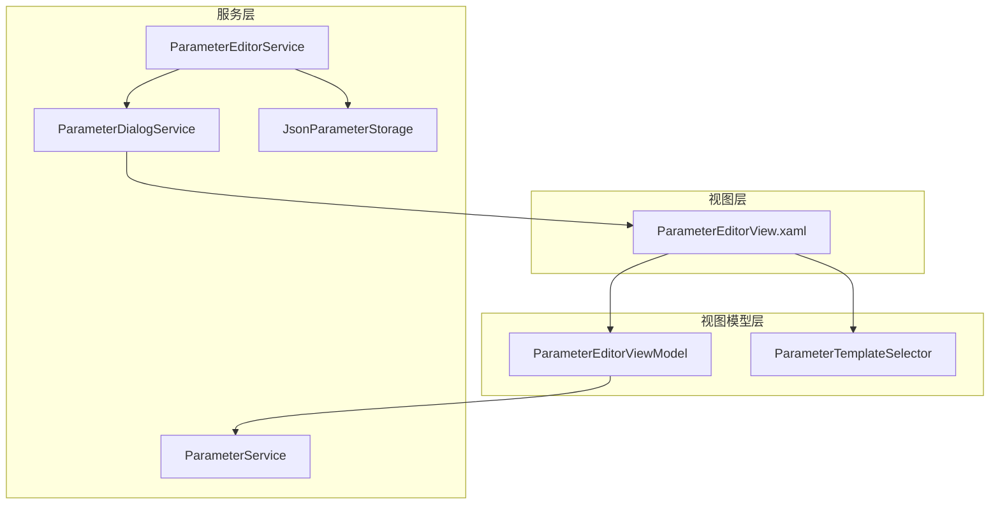
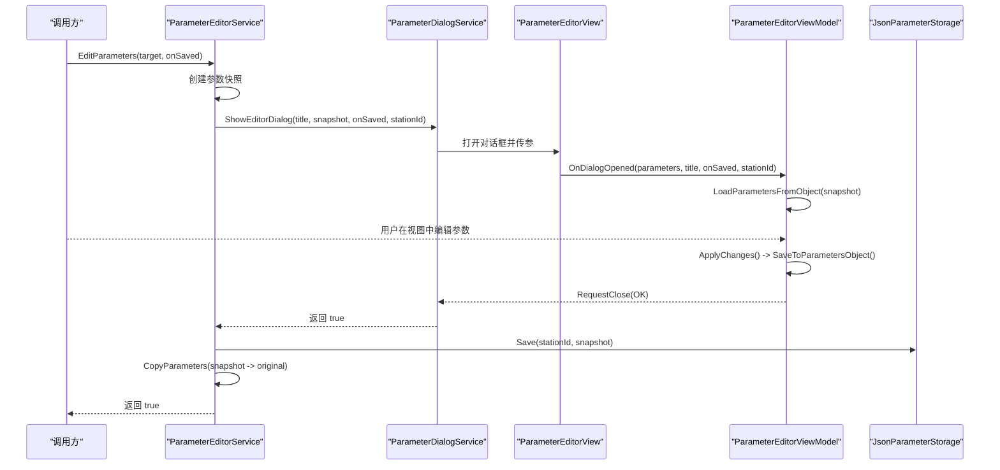
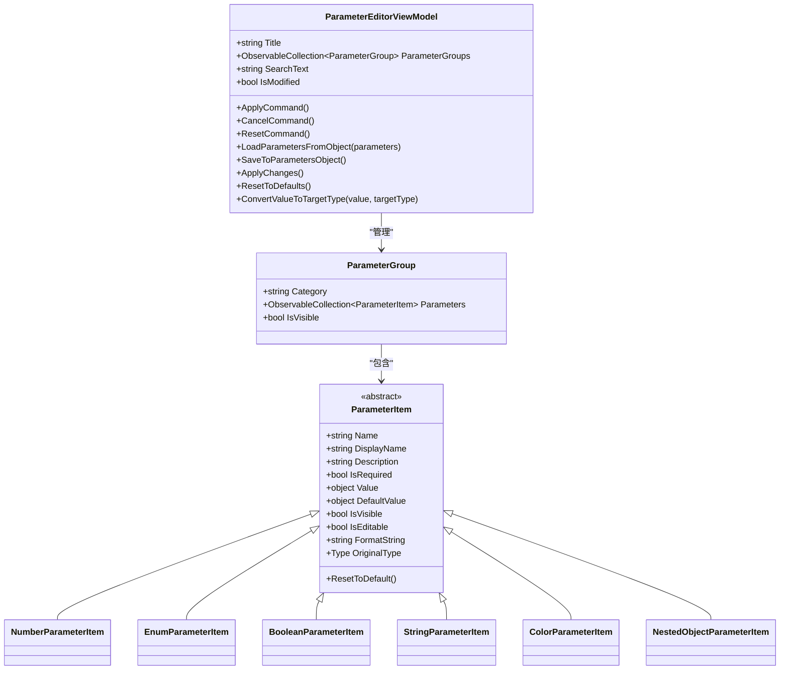
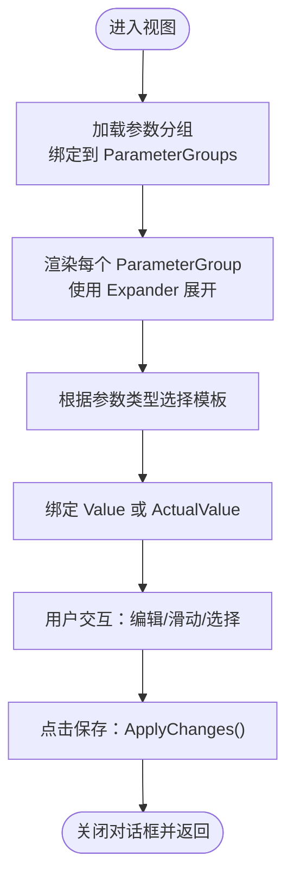
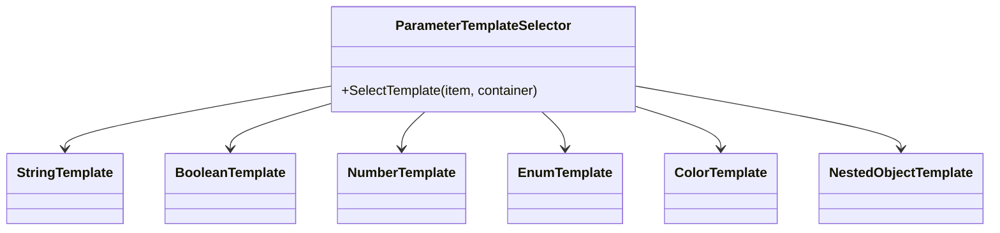
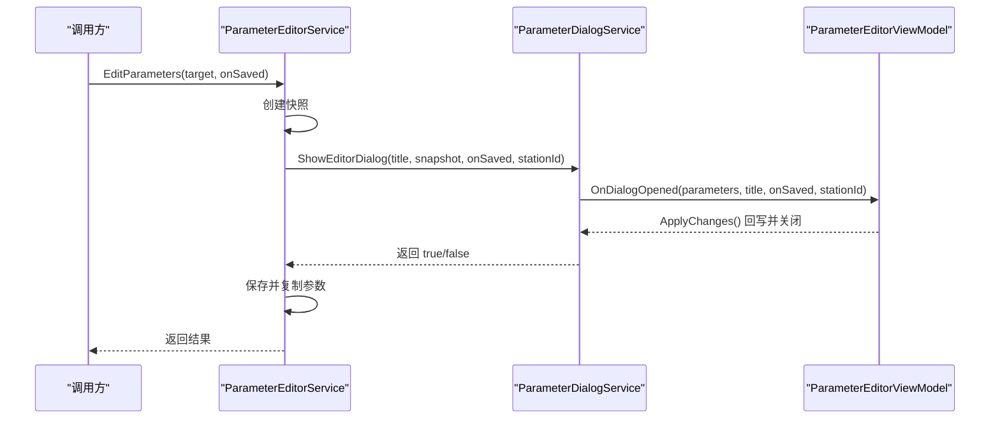
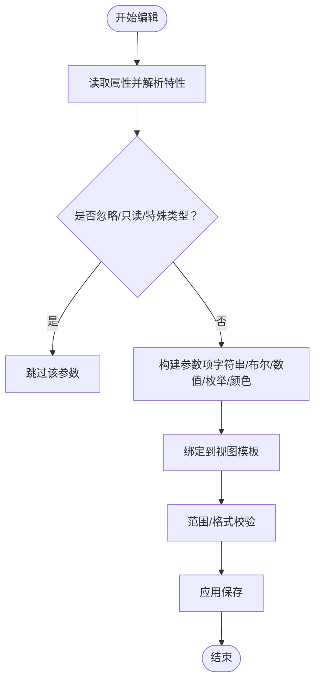
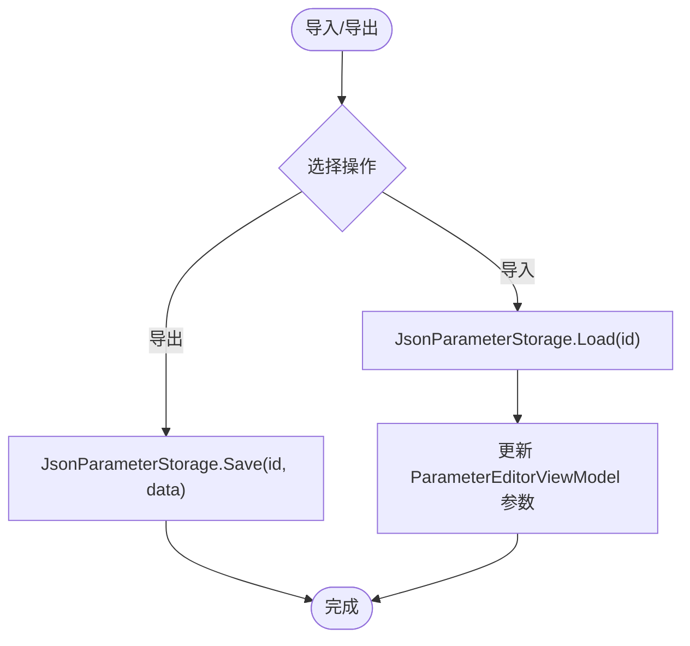
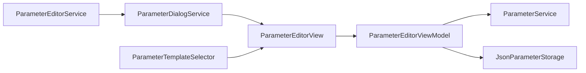

# 参数编辑器组件

<cite>
**本文引用的文件**
- [IParameterEditor.cs](file://Core/Abstraction/IParameterEditor.cs)
- [IParameterDialogService.cs](file://Core/Abstraction/IParameterDialogService.cs)
- [ParameterDialogService.cs](file://Framework/Services/ParameterDialogService.cs)
- [ParameterEditorViewModel.cs](file://Framework/ViewModels/ParameterEditorViewModel.cs)
- [ParameterTemplateSelector.cs](file://Framework/ViewModels/ParameterTemplateSelector.cs)
- [ParameterEditorView.xaml](file://Framework/Views/ParameterEditorView.xaml)
- [ParameterEditorView.xaml.cs](file://Framework/Views/ParameterEditorView.xaml.cs)
- [ParameterItems.cs](file://Core/Abstraction/Parameters/ParameterItems.cs)
- [IParameterService.cs](file://Core/Abstraction/IParameterService.cs)
- [ParameterService.cs](file://Core/Services/ParameterService.cs)
- [IParameterStorage.cs](file://Core/Abstraction/IParameterStorage.cs)
- [JsonParameterStorage.cs](file://Core/Services/JsonParameterStorage.cs)
- [ParameterEditorService.cs](file://Core/Services/ParameterEditorService.cs)
</cite>

## 目录
1. [简介](#简介)
2. [项目结构](#项目结构)
3. [核心组件](#核心组件)
4. [架构总览](#架构总览)
5. [详细组件分析](#详细组件分析)
6. [依赖关系分析](#依赖关系分析)
7. [性能考虑](#性能考虑)
8. [故障排查指南](#故障排查指南)
9. [结论](#结论)
10. [附录](#附录)

## 简介
本文件面向“GZQL_MACHINE 参数编辑器组件”，系统性梳理其 UI 架构、数据绑定策略、验证规则实现，并详细说明不同参数类型的编辑控件（数值输入、下拉选择、开关按钮、颜色选择器等）。同时阐述参数对话框服务的调用机制、参数验证流程、批量编辑能力，以及参数导入导出、默认值管理、参数历史记录的完整解决方案。最后提供自定义参数控件的开发指南与动态表单生成的技术实现思路。

## 项目结构
参数编辑器由三层协作构成：
- 视图层：ParameterEditorView.xaml 提供参数表单界面，通过 DataTemplateSelector 动态渲染不同类型的参数控件。
- 视图模型层：ParameterEditorViewModel.cs 负责参数分组、搜索过滤、应用/取消/重置、保存回调与事件发布。
- 服务层：ParameterDialogService.cs、ParameterEditorService.cs、ParameterService.cs、JsonParameterStorage.cs 协同完成对话框展示、参数加载/保存、持久化与默认值管理。

**图表来源**
- [ParameterEditorView.xaml:1-353](file://Framework/Views/ParameterEditorView.xaml#L1-L353)
- [ParameterEditorViewModel.cs:1-511](file://Framework/ViewModels/ParameterEditorViewModel.cs#L1-L511)
- [ParameterTemplateSelector.cs:1-41](file://Framework/ViewModels/ParameterTemplateSelector.cs#L1-L41)
- [ParameterDialogService.cs:1-49](file://Framework/Services/ParameterDialogService.cs#L1-L49)
- [ParameterEditorService.cs:1-56](file://Core/Services/ParameterEditorService.cs#L1-L56)
- [ParameterService.cs:1-86](file://Core/Services/ParameterService.cs#L1-L86)
- [JsonParameterStorage.cs:1-86](file://Core/Services/JsonParameterStorage.cs#L1-L86)

**章节来源**
- [ParameterEditorView.xaml:1-353](file://Framework/Views/ParameterEditorView.xaml#L1-L353)
- [ParameterEditorViewModel.cs:1-511](file://Framework/ViewModels/ParameterEditorViewModel.cs#L1-L511)
- [ParameterTemplateSelector.cs:1-41](file://Framework/ViewModels/ParameterTemplateSelector.cs#L1-L41)
- [ParameterDialogService.cs:1-49](file://Framework/Services/ParameterDialogService.cs#L1-L49)
- [ParameterEditorService.cs:1-56](file://Core/Services/ParameterEditorService.cs#L1-L56)
- [ParameterService.cs:1-86](file://Core/Services/ParameterService.cs#L1-L86)
- [JsonParameterStorage.cs:1-86](file://Core/Services/JsonParameterStorage.cs#L1-L86)

## 核心组件
- 参数项模型：ParameterItems.cs 定义了 ParameterGroup 与多种 ParameterItem 子类（字符串、布尔、数值、枚举、颜色、点位等），支持默认值、格式化、范围约束与嵌套对象。
- 参数服务：ParameterService.cs 提供参数加载与默认值重置；IParameterService.cs 定义接口契约。
- 对话框服务：ParameterDialogService.cs 将参数编辑封装为可复用的对话框，支持标题、参数对象、保存回调与工站标识传递。
- 参数编辑器服务：ParameterEditorService.cs 负责参数快照、打开对话框、保存与应用变更。
- 参数存储：JsonParameterStorage.cs 提供 JSON 文件持久化，默认目录位于程序基目录下的 Config/Parameters。

**章节来源**
- [ParameterItems.cs:1-374](file://Core/Abstraction/Parameters/ParameterItems.cs#L1-L374)
- [IParameterService.cs:1-24](file://Core/Abstraction/IParameterService.cs#L1-L24)
- [ParameterService.cs:1-86](file://Core/Services/ParameterService.cs#L1-L86)
- [IParameterDialogService.cs:1-9](file://Core/Abstraction/IParameterDialogService.cs#L1-L9)
- [ParameterDialogService.cs:1-49](file://Framework/Services/ParameterDialogService.cs#L1-L49)
- [ParameterEditorService.cs:1-56](file://Core/Services/ParameterEditorService.cs#L1-L56)
- [IParameterStorage.cs:1-18](file://Core/Abstraction/IParameterStorage.cs#L1-L18)
- [JsonParameterStorage.cs:1-86](file://Core/Services/JsonParameterStorage.cs#L1-L86)

## 架构总览
参数编辑器采用 MVVM 架构，通过 Prism 的对话框机制与数据模板选择器实现动态表单渲染。整体流程如下：

**图表来源**
- [ParameterEditorService.cs:24-38](file://Core/Services/ParameterEditorService.cs#L24-L38)
- [ParameterDialogService.cs:19-46](file://Framework/Services/ParameterDialogService.cs#L19-L46)
- [ParameterEditorViewModel.cs:134-161](file://Framework/ViewModels/ParameterEditorViewModel.cs#L134-L161)
- [JsonParameterStorage.cs:28-31](file://Core/Services/JsonParameterStorage.cs#L28-L31)

## 详细组件分析

### 视图模型：ParameterEditorViewModel
- 职责
  - 参数分组与加载：从 IParameterService 加载参数分组，或从传入的 TaskParametersBase 对象反射生成参数项。
  - 搜索过滤：根据名称/显示名/描述进行模糊匹配，动态控制参数与分组可见性。
  - 应用/取消/重置：应用变更时将 UI 值回写到参数对象，触发保存回调并发布工站参数保存事件；重置为默认值。
  - 数据转换：按目标类型进行数值/枚举/可空类型转换，确保绑定安全。
- 关键点
  - 使用 Prism 的 DelegateCommand 绑定按钮命令，观察 IsModified 状态。
  - 通过反射读取属性特性（DisplayName、Description、Range、DisplayFormat 等）生成参数项。
  - 支持嵌套对象参数（NestedObjectParameterItem）与特殊类型（如 List<PointF> 被跳过）。

**图表来源**
- [ParameterEditorViewModel.cs:28-511](file://Framework/ViewModels/ParameterEditorViewModel.cs#L28-L511)
- [ParameterItems.cs:13-374](file://Core/Abstraction/Parameters/ParameterItems.cs#L13-L374)

**章节来源**
- [ParameterEditorViewModel.cs:1-511](file://Framework/ViewModels/ParameterEditorViewModel.cs#L1-L511)
- [ParameterItems.cs:1-374](file://Core/Abstraction/Parameters/ParameterItems.cs#L1-L374)

### 视图：ParameterEditorView 与模板选择器
- 视图结构
  - 标题栏、搜索框、参数滚动区域、操作按钮区。
  - 参数区域使用 Expander 分组，每组内逐项渲染。
- 模板选择器
  - 根据参数项类型选择对应 DataTemplate：字符串（TextBox）、布尔（CheckBox）、数值（Slider+DecimalUpDown）、枚举（ComboBox）、颜色（预览+选择器）。
- 数据绑定策略
  - 数值参数使用 ActualValue 双向绑定，配合 SmallChange 控制步进与 TickFrequency。
  - 只读模式通过 IsEditable 切换显示方式（文本显示 vs 编辑控件）。

**图表来源**
- [ParameterEditorView.xaml:284-351](file://Framework/Views/ParameterEditorView.xaml#L284-L351)
- [ParameterTemplateSelector.cs:16-38](file://Framework/ViewModels/ParameterTemplateSelector.cs#L16-L38)

**章节来源**
- [ParameterEditorView.xaml:1-353](file://Framework/Views/ParameterEditorView.xaml#L1-L353)
- [ParameterTemplateSelector.cs:1-41](file://Framework/ViewModels/ParameterTemplateSelector.cs#L1-L41)

### 参数类型与控件映射
- 字符串参数：TextBox（可编辑）
- 布尔参数：CheckBox（可编辑）
- 数值参数：Slider + DecimalUpDown（可编辑），支持最小/最大值、小数位数、步长自动计算
- 枚举参数：ComboBox（可编辑）
- 颜色参数：颜色块预览 + 选择按钮（可编辑）
- 嵌套对象参数：展开子组（可递归）

**图表来源**
- [ParameterEditorView.xaml:93-224](file://Framework/Views/ParameterEditorView.xaml#L93-L224)
- [ParameterTemplateSelector.cs:7-38](file://Framework/ViewModels/ParameterTemplateSelector.cs#L7-L38)

**章节来源**
- [ParameterEditorView.xaml:93-224](file://Framework/Views/ParameterEditorView.xaml#L93-L224)
- [ParameterTemplateSelector.cs:1-41](file://Framework/ViewModels/ParameterTemplateSelector.cs#L1-L41)

### 参数对话框服务调用机制
- ParameterDialogService.ShowEditorDialog(title, parameters, onSaved, stationIdentifier)
  - 通过 Prism 的 IDialogService 以“ParameterEditor”对话框打开。
  - 使用 TaskCompletionSource 将回调式结果转为 Task<bool>。
  - 传递参数对象、标题、保存回调与工站标识。
- ParameterEditorService.EditParameters(target, onSaved)
  - 创建参数快照，打开对话框，若用户确认则保存至存储并复制回原对象。

**图表来源**
- [ParameterEditorService.cs:24-38](file://Core/Services/ParameterEditorService.cs#L24-L38)
- [ParameterDialogService.cs:19-46](file://Framework/Services/ParameterDialogService.cs#L19-L46)
- [ParameterEditorViewModel.cs:134-161](file://Framework/ViewModels/ParameterEditorViewModel.cs#L134-L161)

**章节来源**
- [IParameterDialogService.cs:1-9](file://Core/Abstraction/IParameterDialogService.cs#L1-L9)
- [ParameterDialogService.cs:1-49](file://Framework/Services/ParameterDialogService.cs#L1-L49)
- [ParameterEditorService.cs:1-56](file://Core/Services/ParameterEditorService.cs#L1-L56)

### 参数验证流程
- 范围与格式
  - 数值参数通过 MinValue/MaxValue 与 DecimalPlaces 控制输入范围与精度。
  - DisplayFormatAttribute 与 FormatString 影响显示格式（如 F0/F1/F2）。
- 只读与忽略
  - 通过属性只读或 [ParameterIgnore] 特性跳过编辑。
  - 特殊类型（如 List<PointF>）被跳过。
- 类型转换
  - ConvertValueToTargetType 支持 int/double/float/enum/可空类型转换，失败时保留原值。

**图表来源**
- [ParameterEditorViewModel.cs:303-421](file://Framework/ViewModels/ParameterEditorViewModel.cs#L303-L421)
- [ParameterItems.cs:129-250](file://Core/Abstraction/Parameters/ParameterItems.cs#L129-L250)

**章节来源**
- [ParameterEditorViewModel.cs:162-211](file://Framework/ViewModels/ParameterEditorViewModel.cs#L162-L211)
- [ParameterItems.cs:129-250](file://Core/Abstraction/Parameters/ParameterItems.cs#L129-L250)

### 批量编辑功能
- 当前实现
  - ParameterEditorViewModel 支持全量重置为默认值，但未提供“批量勾选/批量修改”的 UI 与逻辑。
- 建议扩展
  - 在视图中增加“全选/反选”控件与“批量应用”按钮。
  - 在 ParameterEditorViewModel 中新增批量标记集合与批量更新方法，结合 SaveToParametersObject 执行批量回写。

**章节来源**
- [ParameterEditorViewModel.cs:238-263](file://Framework/ViewModels/ParameterEditorViewModel.cs#L238-L263)

### 参数导入导出、默认值管理与历史记录
- 导入/导出
  - JsonParameterStorage 支持 Save/Load 方法，可按工站标识生成独立 JSON 文件。
  - 建议在视图中添加“导入/导出”按钮，调用存储服务读写文件。
- 默认值管理
  - ParameterService.ResetToDefaultsAsync 返回初始参数配置，用于一键恢复。
- 参数历史记录
  - 建议在 JsonParameterStorage 中增加版本号字段与变更日志，或引入独立的历史表（可在 IParameterStorage 接口扩展）。

**图表来源**
- [JsonParameterStorage.cs:36-78](file://Core/Services/JsonParameterStorage.cs#L36-L78)
- [ParameterEditorViewModel.cs:88-110](file://Framework/ViewModels/ParameterEditorViewModel.cs#L88-L110)

**章节来源**
- [IParameterStorage.cs:1-18](file://Core/Abstraction/IParameterStorage.cs#L1-L18)
- [JsonParameterStorage.cs:1-86](file://Core/Services/JsonParameterStorage.cs#L1-L86)
- [ParameterService.cs:79-83](file://Core/Services/ParameterService.cs#L79-L83)

### 自定义参数控件开发指南
- 新增参数类型
  - 在 ParameterItems.cs 中新增 ParameterItem 子类（如自定义坐标、矩阵等）。
  - 在 ParameterTemplateSelector 中注册新模板。
  - 在 ParameterEditorView.xaml 中为新模板编写 DataTemplate。
- 新增编辑控件
  - 在视图中使用合适的 WPF 控件（如自定义 Slider/Picker），绑定到参数项的 Value/ActualValue。
  - 若需复杂交互，可引入行为（Behavior）或附加属性辅助。
- 反射与特性
  - 保持与现有反射逻辑兼容，确保 DisplayName/Description/Range/DisplayFormat 等特性正确映射。

**章节来源**
- [ParameterItems.cs:1-374](file://Core/Abstraction/Parameters/ParameterItems.cs#L1-L374)
- [ParameterTemplateSelector.cs:1-41](file://Framework/ViewModels/ParameterTemplateSelector.cs#L1-L41)
- [ParameterEditorView.xaml:93-224](file://Framework/Views/ParameterEditorView.xaml#L93-L224)

### 动态表单生成技术实现
- 反射建模
  - 通过反射遍历 TaskParametersBase 的公共属性，结合特性生成 ParameterItem 并分组。
- 模板选择
  - 使用 DataTemplateSelector 根据参数类型动态选择控件模板。
- 搜索与可见性
  - 通过 SearchText 过滤参数项与分组，提升大参数集的可用性。

**章节来源**
- [ParameterEditorViewModel.cs:264-300](file://Framework/ViewModels/ParameterEditorViewModel.cs#L264-L300)
- [ParameterEditorViewModel.cs:112-132](file://Framework/ViewModels/ParameterEditorViewModel.cs#L112-L132)

## 依赖关系分析
- 松耦合设计
  - 视图与视图模型通过 Prism 绑定解耦；模板选择器通过资源字典注入。
  - 服务层通过接口隔离（IParameterService、IParameterStorage、IParameterDialogService）。
- 关键依赖链
  - ParameterEditorView → ParameterEditorViewModel → ParameterService/JsonParameterStorage
  - ParameterEditorService → ParameterDialogService → ParameterEditorView
  - ParameterTemplateSelector → ParameterEditorView 资源字典

**图表来源**
- [ParameterEditorView.xaml:1-353](file://Framework/Views/ParameterEditorView.xaml#L1-L353)
- [ParameterEditorViewModel.cs:1-511](file://Framework/ViewModels/ParameterEditorViewModel.cs#L1-L511)
- [ParameterEditorService.cs:1-56](file://Core/Services/ParameterEditorService.cs#L1-L56)
- [ParameterDialogService.cs:1-49](file://Framework/Services/ParameterDialogService.cs#L1-L49)
- [ParameterTemplateSelector.cs:1-41](file://Framework/ViewModels/ParameterTemplateSelector.cs#L1-L41)

**章节来源**
- [ParameterEditorView.xaml:1-353](file://Framework/Views/ParameterEditorView.xaml#L1-L353)
- [ParameterEditorViewModel.cs:1-511](file://Framework/ViewModels/ParameterEditorViewModel.cs#L1-L511)
- [ParameterEditorService.cs:1-56](file://Core/Services/ParameterEditorService.cs#L1-L56)
- [ParameterDialogService.cs:1-49](file://Framework/Services/ParameterDialogService.cs#L1-L49)
- [ParameterTemplateSelector.cs:1-41](file://Framework/ViewModels/ParameterTemplateSelector.cs#L1-L41)

## 性能考虑
- 大参数集优化
  - 使用虚拟化容器（VirtualizingStackPanel）或分页加载减少 UI 渲染压力。
  - 搜索过滤仅影响可见性，避免频繁序列化/反序列化。
- 绑定优化
  - 数值控件使用 TwoWay 绑定并合理设置 UpdateSourceTrigger，避免高频刷新。
  - DecimalUpDown 与 Slider 共享 ActualValue，减少重复计算。
- 异步加载
  - 参数加载与保存均采用异步，避免阻塞 UI 线程。

[本节为通用建议，无需特定文件引用]

## 故障排查指南
- 对话框无法打开
  - 检查是否正确注册“ParameterEditor”对话框名称与视图。
  - 确认 IContainerProvider 解析到正确的 IDialogService。
- 参数未保存
  - 确认 ApplyChanges 已执行且 OnParametersSaved 回调被设置。
  - 检查 JsonParameterStorage 的目录权限与路径。
- 类型转换异常
  - 检查 ConvertValueToTargetType 的目标类型与值来源，必要时在参数项上显式设置 OriginalType。
- 搜索无效果
  - 确认 SearchText 绑定与 ApplySearchFilter 调用链正常。

**章节来源**
- [ParameterDialogService.cs:19-46](file://Framework/Services/ParameterDialogService.cs#L19-L46)
- [ParameterEditorViewModel.cs:134-161](file://Framework/ViewModels/ParameterEditorViewModel.cs#L134-L161)
- [JsonParameterStorage.cs:36-78](file://Core/Services/JsonParameterStorage.cs#L36-L78)

## 结论
参数编辑器组件通过清晰的分层架构与接口抽象，实现了参数的动态表单渲染、灵活的数据绑定与可扩展的类型体系。结合对话框服务与存储服务，可满足参数导入导出、默认值管理与工站级参数持久化需求。未来可在批量编辑、历史记录与更丰富的自定义控件方面进一步增强。

## 附录
- 快速参考
  - 参数项类型：字符串、布尔、数值、枚举、颜色、嵌套对象、点位。
  - 关键接口：IParameterService、IParameterStorage、IParameterDialogService、IParameterEditor。
  - 默认存储位置：Config/Parameters/{identifier}.json。

[本节为概览性内容，无需特定文件引用]