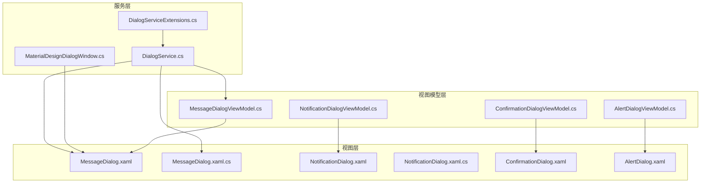
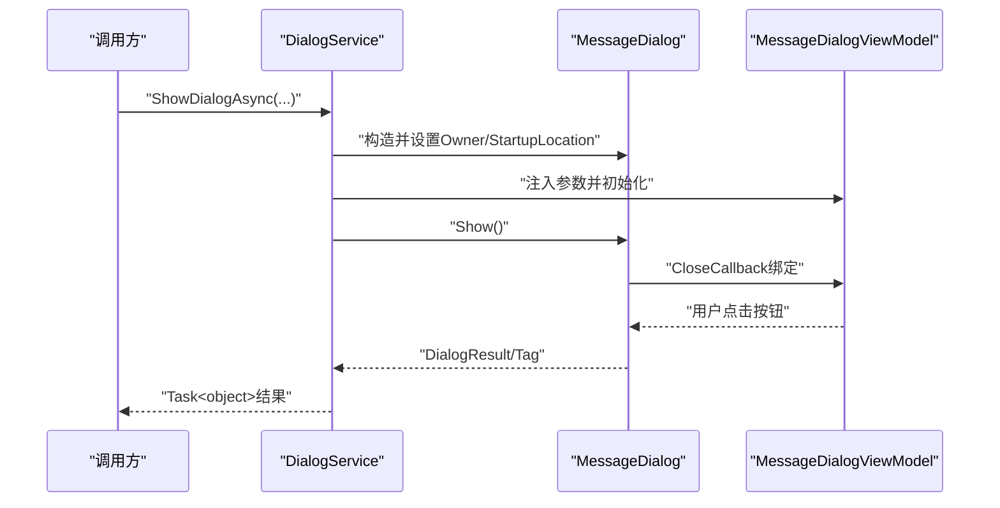
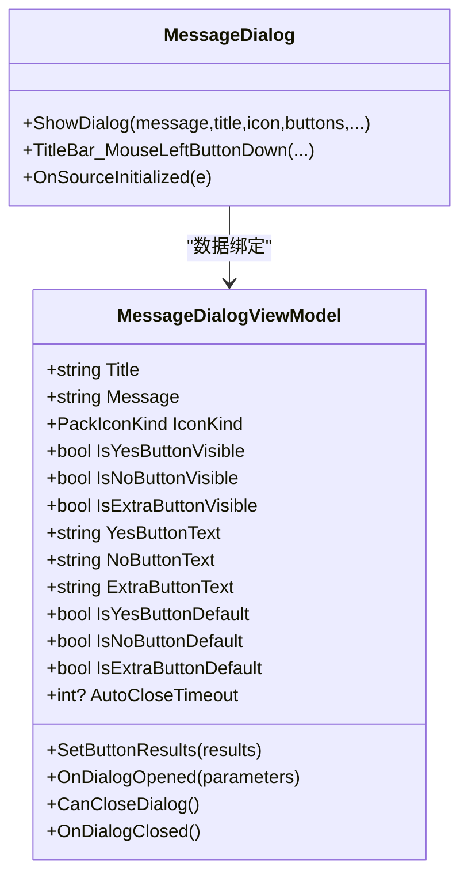
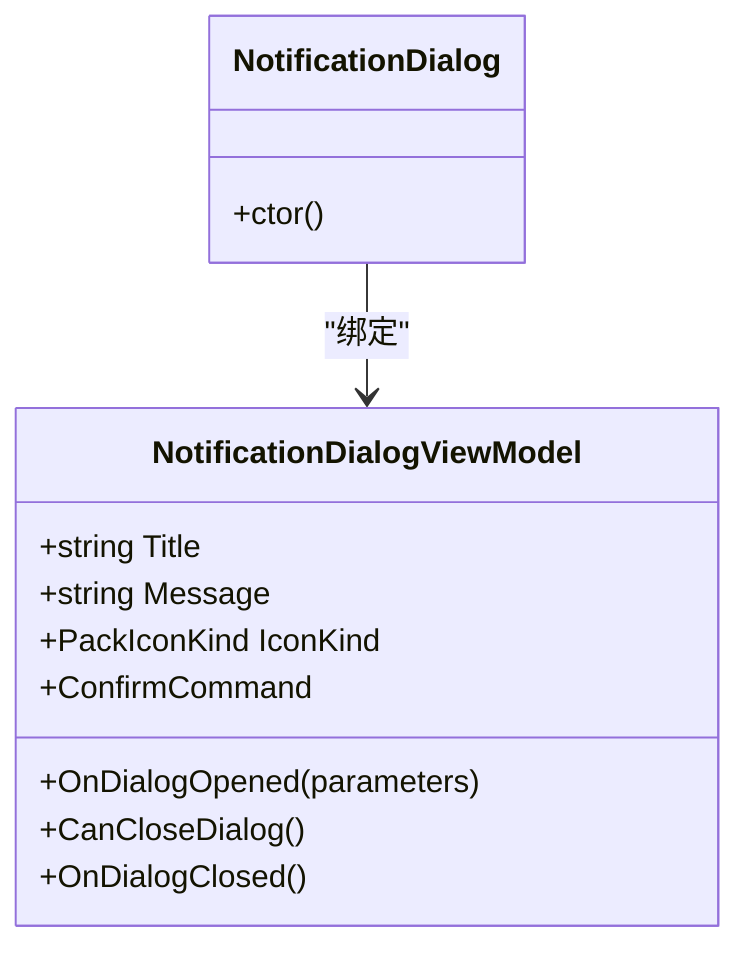
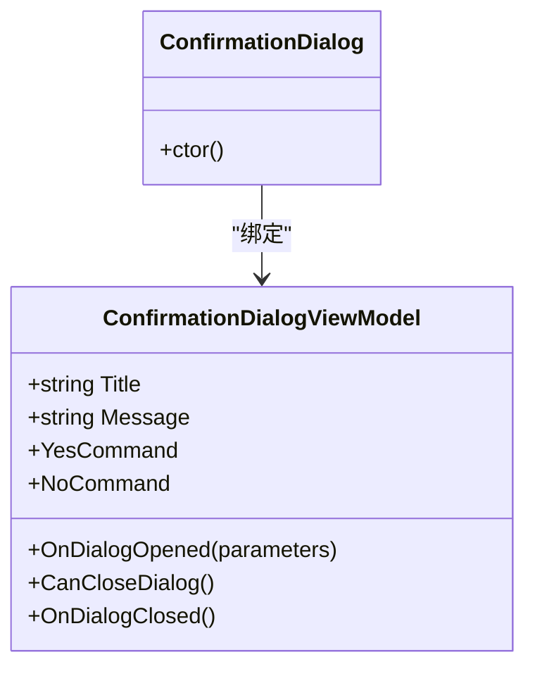
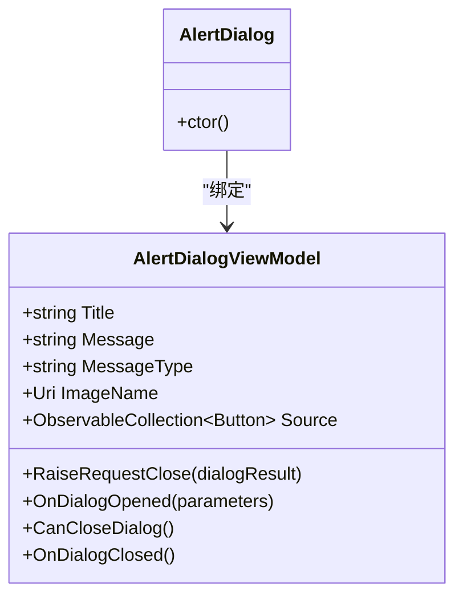
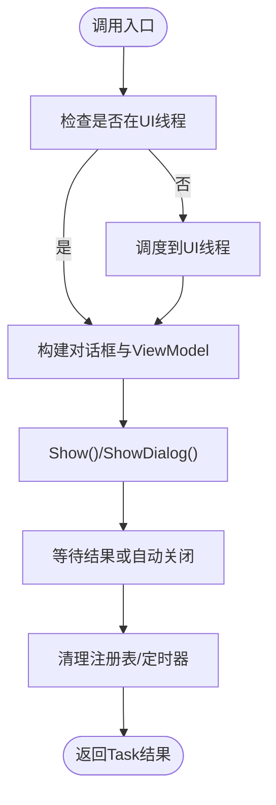
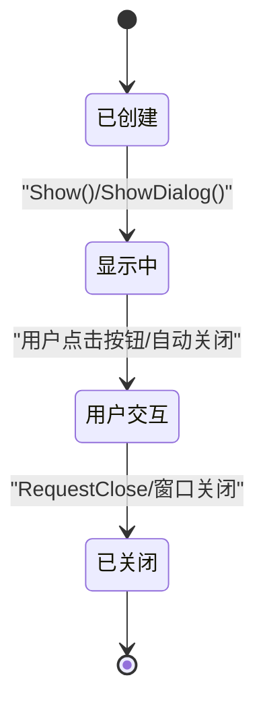
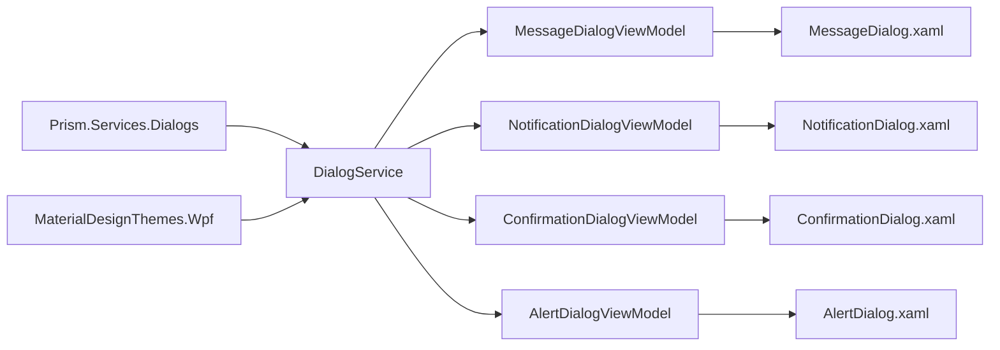

# 对话框系统

<cite>
**本文引用的文件**
- [DialogService.cs](file://Framework/Services/DialogService.cs)
- [MessageDialogViewModel.cs](file://Framework/ViewModels/MessageDialogViewModel.cs)
- [NotificationDialogViewModel.cs](file://Framework/ViewModels/NotificationDialogViewModel.cs)
- [MessageDialog.xaml](file://Framework/Views/MessageDialog.xaml)
- [MessageDialog.xaml.cs](file://Framework/Views/MessageDialog.xaml.cs)
- [NotificationDialog.xaml](file://Framework/Views/NotificationDialog.xaml)
- [NotificationDialog.xaml.cs](file://Framework/Views/NotificationDialog.xaml.cs)
- [MaterialDesignDialogWindow.cs](file://Framework/MaterialDesignDialogWindow.cs)
- [DialogServiceExtensions.cs](file://Framework/Dialogs/DialogServiceExtensions.cs)
- [ConfirmationDialogViewModel.cs](file://ModuleCore/ViewModels/ConfirmationDialogViewModel.cs)
- [AlertDialogViewModel.cs](file://ModuleCore/ViewModels/AlertDialogViewModel.cs)
- [ConfirmationDialog.xaml](file://ModuleCore/Views/ConfirmationDialog.xaml)
- [AlertDialog.xaml](file://ModuleCore/Views/AlertDialog.xaml)
- [PickDetailViewModel.cs](file://Module/Controls/StepDetails/PickDetailViewModel.cs)
- [RecipeConfirmDialogViewModel.cs](file://RecipeManagement/ViewModels/RecipeConfirmDialogViewModel.cs)
</cite>

## 目录
1. [简介](#简介)
2. [项目结构](#项目结构)
3. [核心组件](#核心组件)
4. [架构总览](#架构总览)
5. [详细组件分析](#详细组件分析)
6. [依赖关系分析](#依赖关系分析)
7. [性能考虑](#性能考虑)
8. [故障排查指南](#故障排查指南)
9. [结论](#结论)
10. [附录](#附录)

## 简介
本文件面向GZQL_MACHINE项目的对话框系统，系统性梳理消息对话框、通知对话框、确认对话框的设计与实现，覆盖以下关键主题：
- 对话框服务的调用机制与线程安全策略
- 模态/非模态对话框的区别与适用场景
- 对话框生命周期管理与堆叠控制
- 自定义对话框的创建、参数传递与结果回调
- 样式定制、动画效果与键盘快捷键支持
- 对话框堆叠管理、焦点控制与无障碍访问

## 项目结构
对话框系统由“服务层”“视图模型层”“视图层”“扩展与窗口宿主”四部分组成，既包含通用的消息/通知对话框，也包含模块化的确认/告警对话框，并通过Material Design主题统一风格。

**图表来源**
- [DialogService.cs:1-432](file://Framework/Services/DialogService.cs#L1-L432)
- [DialogServiceExtensions.cs:1-43](file://Framework/Dialogs/DialogServiceExtensions.cs#L1-L43)
- [MaterialDesignDialogWindow.cs:1-73](file://Framework/MaterialDesignDialogWindow.cs#L1-L73)
- [MessageDialogViewModel.cs:1-212](file://Framework/ViewModels/MessageDialogViewModel.cs#L1-L212)
- [NotificationDialogViewModel.cs:1-71](file://Framework/ViewModels/NotificationDialogViewModel.cs#L1-L71)
- [MessageDialog.xaml:1-248](file://Framework/Views/MessageDialog.xaml#L1-L248)
- [MessageDialog.xaml.cs:1-119](file://Framework/Views/MessageDialog.xaml.cs#L1-L119)
- [NotificationDialog.xaml:1-70](file://Framework/Views/NotificationDialog.xaml#L1-L70)
- [NotificationDialog.xaml.cs:1-56](file://Framework/Views/NotificationDialog.xaml.cs#L1-L56)
- [ConfirmationDialogViewModel.cs:1-67](file://ModuleCore/ViewModels/ConfirmationDialogViewModel.cs#L1-L67)
- [AlertDialogViewModel.cs:1-97](file://ModuleCore/ViewModels/AlertDialogViewModel.cs#L1-L97)
- [ConfirmationDialog.xaml:1-69](file://ModuleCore/Views/ConfirmationDialog.xaml#L1-L69)
- [AlertDialog.xaml:1-95](file://ModuleCore/Views/AlertDialog.xaml#L1-L95)

**章节来源**
- [DialogService.cs:1-432](file://Framework/Services/DialogService.cs#L1-L432)
- [DialogServiceExtensions.cs:1-43](file://Framework/Dialogs/DialogServiceExtensions.cs#L1-L43)
- [MaterialDesignDialogWindow.cs:1-73](file://Framework/MaterialDesignDialogWindow.cs#L1-L73)

## 核心组件
- 对话框服务：提供阻塞/非阻塞、异步、自动关闭等多形态对话框展示能力，并负责对话框注册与清理。
- 视图模型：承载对话框状态、命令与参数解析；实现Prism的IDialogAware接口以适配对话框框架。
- 视图：基于Material Design主题，提供统一的视觉与交互体验；支持动画、阴影、可拖拽标题栏等特性。
- 扩展与窗口宿主：对Prism DialogService进行扩展，提供Task化的异步调用；自定义DialogWindow以统一Material Design风格与尺寸。

**章节来源**
- [DialogService.cs:14-432](file://Framework/Services/DialogService.cs#L14-L432)
- [MessageDialogViewModel.cs:17-212](file://Framework/ViewModels/MessageDialogViewModel.cs#L17-L212)
- [NotificationDialogViewModel.cs:13-71](file://Framework/ViewModels/NotificationDialogViewModel.cs#L13-L71)
- [MessageDialog.xaml:1-248](file://Framework/Views/MessageDialog.xaml#L1-L248)
- [DialogServiceExtensions.cs:6-43](file://Framework/Dialogs/DialogServiceExtensions.cs#L6-L43)
- [MaterialDesignDialogWindow.cs:7-73](file://Framework/MaterialDesignDialogWindow.cs#L7-L73)

## 架构总览
对话框系统采用“服务-视图模型-视图”的分层设计，结合Prism Dialog与MaterialDesignThemes WPF，实现跨模块、可复用的对话框基础设施。

**图表来源**
- [DialogService.cs:244-408](file://Framework/Services/DialogService.cs#L244-L408)
- [MessageDialog.xaml.cs:24-105](file://Framework/Views/MessageDialog.xaml.cs#L24-L105)
- [MessageDialogViewModel.cs:158-176](file://Framework/ViewModels/MessageDialogViewModel.cs#L158-L176)

## 详细组件分析

### 消息对话框（MessageDialog）
- 设计要点
  - 支持三按钮配置与默认按钮设置，满足不同业务需求。
  - 提供自动关闭与进度指示，适用于提示与轻量反馈。
  - 标题栏可拖拽，提升用户体验。
- 生命周期
  - 通过CloseCallback与RequestClose实现结果回传。
  - 定时器在自动关闭时释放资源。
- 样式与动画
  - 使用Material Design主题资源，内置按钮可见性动画样式。
  - 标题栏阴影与深色背景，增强层次感。
- 键盘快捷键
  - 通过命令绑定与默认按钮设置，支持Enter/ESC等默认行为（由Material Design控件提供）。

**图表来源**
- [MessageDialogViewModel.cs:17-212](file://Framework/ViewModels/MessageDialogViewModel.cs#L17-L212)
- [MessageDialog.xaml.cs:12-119](file://Framework/Views/MessageDialog.xaml.cs#L12-L119)

**章节来源**
- [MessageDialogViewModel.cs:17-212](file://Framework/ViewModels/MessageDialogViewModel.cs#L17-L212)
- [MessageDialog.xaml:1-248](file://Framework/Views/MessageDialog.xaml#L1-L248)
- [MessageDialog.xaml.cs:12-119](file://Framework/Views/MessageDialog.xaml.cs#L12-L119)

### 通知对话框（NotificationDialog）
- 设计要点
  - 简洁的通知界面，适合成功/警告等信息提示。
  - 通过IDialogAware实现参数注入与结果回传。
- 样式与动画
  - 轻量级UserControl，合并Material Design Light主题资源。
- 无障碍
  - 文本与图标分离，便于屏幕阅读器朗读。

**图表来源**
- [NotificationDialogViewModel.cs:13-71](file://Framework/ViewModels/NotificationDialogViewModel.cs#L13-L71)
- [NotificationDialog.xaml.cs:23-56](file://Framework/Views/NotificationDialog.xaml.cs#L23-L56)

**章节来源**
- [NotificationDialogViewModel.cs:13-71](file://Framework/ViewModels/NotificationDialogViewModel.cs#L13-L71)
- [NotificationDialog.xaml:1-70](file://Framework/Views/NotificationDialog.xaml#L1-L70)
- [NotificationDialog.xaml.cs:23-56](file://Framework/Views/NotificationDialog.xaml.cs#L23-L56)

### 确认对话框（ConfirmationDialog）
- 设计要点
  - 模块化视图模型与视图，支持多语言标签。
  - 通过Prism IDialogAware传递标题与消息。
- 结果处理
  - 使用ButtonResult.Yes/No回传，便于上层判断。

**图表来源**
- [ConfirmationDialogViewModel.cs:12-67](file://ModuleCore/ViewModels/ConfirmationDialogViewModel.cs#L12-L67)
- [ConfirmationDialog.xaml:1-69](file://ModuleCore/Views/ConfirmationDialog.xaml#L1-L69)

**章节来源**
- [ConfirmationDialogViewModel.cs:12-67](file://ModuleCore/ViewModels/ConfirmationDialogViewModel.cs#L12-L67)
- [ConfirmationDialog.xaml:1-69](file://ModuleCore/Views/ConfirmationDialog.xaml#L1-L69)

### 告警对话框（AlertDialog）
- 设计要点
  - 动态按钮集合，根据标题动态增删“取消/确认”按钮。
  - 图片资源按标题切换，直观表达消息类型。
- 参数与结果
  - 通过IDialogAware接收消息，使用ButtonResult回传。

**图表来源**
- [AlertDialogViewModel.cs:11-97](file://ModuleCore/ViewModels/AlertDialogViewModel.cs#L11-L97)
- [AlertDialog.xaml:1-95](file://ModuleCore/Views/AlertDialog.xaml#L1-L95)

**章节来源**
- [AlertDialogViewModel.cs:11-97](file://ModuleCore/ViewModels/AlertDialogViewModel.cs#L11-L97)
- [AlertDialog.xaml:1-95](file://ModuleCore/Views/AlertDialog.xaml#L1-L95)

### 对话框服务调用机制
- 异步调用
  - 提供Task<object>与Task<IDialogResult>两种异步接口，支持UI线程与非UI线程安全调用。
  - 通过TaskCompletionSource封装结果，简化回调处理。
- 阻塞/非阻塞
  - ShowBlockingDialog：模态阻塞，等待窗口关闭后返回整数结果。
  - ShowNonBlockingDialog：非模态，支持自动关闭与回调。
- 自动关闭
  - 通过定时器与进度指示，实现轻提示场景的自动回收。
- 注册与清理
  - 使用ConcurrentDictionary跟踪打开的对话框，窗口关闭时自动清理句柄。

**图表来源**
- [DialogService.cs:244-408](file://Framework/Services/DialogService.cs#L244-L408)
- [DialogService.cs:16-63](file://Framework/Services/DialogService.cs#L16-L63)

**章节来源**
- [DialogService.cs:14-432](file://Framework/Services/DialogService.cs#L14-L432)
- [DialogServiceExtensions.cs:6-43](file://Framework/Dialogs/DialogServiceExtensions.cs#L6-L43)

### 模态/非模态对话框区别与使用建议
- 模态（阻塞）
  - 适用于需要强制用户决策的场景（如退出确认、危险操作）。
  - 通过ShowBlockingDialog实现，返回整数结果便于分支处理。
- 非模态（异步）
  - 适用于提示与通知，不打断用户当前操作。
  - 通过ShowDialogAsync实现，支持自动关闭与按钮自定义。

**章节来源**
- [DialogService.cs:138-203](file://Framework/Services/DialogService.cs#L138-L203)
- [DialogService.cs:244-408](file://Framework/Services/DialogService.cs#L244-L408)

### 对话框生命周期管理
- 打开阶段
  - 构造窗口与ViewModel，设置Owner与启动位置，绑定CloseCallback。
- 运行阶段
  - 处理按钮命令、自动关闭定时器、位置记忆与恢复。
- 关闭阶段
  - 触发RequestClose，释放定时器，清理注册表，确保无内存泄漏。

**图表来源**
- [MessageDialogViewModel.cs:178-210](file://Framework/ViewModels/MessageDialogViewModel.cs#L178-L210)
- [MessageDialog.xaml.cs:24-105](file://Framework/Views/MessageDialog.xaml.cs#L24-L105)
- [DialogService.cs:49-63](file://Framework/Services/DialogService.cs#L49-L63)

**章节来源**
- [MessageDialogViewModel.cs:178-210](file://Framework/ViewModels/MessageDialogViewModel.cs#L178-L210)
- [MessageDialog.xaml.cs:24-105](file://Framework/Views/MessageDialog.xaml.cs#L24-L105)
- [DialogService.cs:49-63](file://Framework/Services/DialogService.cs#L49-L63)

### 自定义对话框创建与参数传递
- 创建步骤
  - 新建UserControl作为视图，ViewModel继承BindableBase并实现IDialogAware。
  - 在视图中启用ViewModelLocator或手动绑定DataContext。
- 参数传递
  - 通过OnDialogOpened解析IDialogParameters中的键值。
- 结果回调
  - 使用RequestClose(new DialogResult(ButtonResult.X))回传结果。
- 示例参考
  - 模块化确认/告警对话框的参数与结果处理模式。

**章节来源**
- [ConfirmationDialogViewModel.cs:37-66](file://ModuleCore/ViewModels/ConfirmationDialogViewModel.cs#L37-L66)
- [AlertDialogViewModel.cs:77-96](file://ModuleCore/ViewModels/AlertDialogViewModel.cs#L77-L96)
- [RecipeConfirmDialogViewModel.cs:68-86](file://RecipeManagement/ViewModels/RecipeConfirmDialogViewModel.cs#L68-L86)

### 样式定制、动画效果与键盘快捷键
- 样式定制
  - 统一使用Material Design主题资源，通过ResourceDictionary合并与显式Key定义样式。
  - 支持深色/浅色主题切换与主次色彩配置。
- 动画效果
  - 按钮可见性动画通过Storyboard实现，进入/退出时透明度渐变。
  - 标题栏阴影与卡片阴影增强层次感。
- 键盘快捷键
  - 通过命令绑定与默认按钮设置，利用Material Design控件的默认行为（如回车确认）。

**章节来源**
- [MessageDialog.xaml:19-117](file://Framework/Views/MessageDialog.xaml#L19-L117)
- [MessageDialog.xaml:34-63](file://Framework/Views/MessageDialog.xaml#L34-L63)
- [MessageDialog.xaml:89-101](file://Framework/Views/MessageDialog.xaml#L89-L101)

### 对话框堆叠管理、焦点控制与无障碍访问
- 堆叠管理
  - 通过ConcurrentDictionary跟踪打开的对话框，支持CloseAllDialogs统一关闭。
- 焦点控制
  - 默认按钮设置与命令绑定，确保首次聚焦与键盘导航合理。
- 无障碍访问
  - 文本与图标分离，使用Material Design语义化图标；提供清晰的标题与消息文本。

**章节来源**
- [DialogService.cs:16-47](file://Framework/Services/DialogService.cs#L16-L47)
- [MessageDialogViewModel.cs:64-66](file://Framework/ViewModels/MessageDialogViewModel.cs#L64-L66)

## 依赖关系分析
- 服务层依赖Prism Dialog与MaterialDesignThemes WPF，提供跨模块的对话框基础设施。
- 视图模型依赖Prism Mvvm与Prism Dialog服务接口，实现参数注入与结果回传。
- 视图依赖Material Design主题资源，统一视觉风格与交互行为。
- 扩展与窗口宿主为服务层提供Task化调用与统一窗口行为。

**图表来源**
- [DialogService.cs:1-10](file://Framework/Services/DialogService.cs#L1-L10)
- [MessageDialogViewModel.cs:1-14](file://Framework/ViewModels/MessageDialogViewModel.cs#L1-L14)
- [NotificationDialogViewModel.cs:1-9](file://Framework/ViewModels/NotificationDialogViewModel.cs#L1-L9)
- [ConfirmationDialogViewModel.cs:1-8](file://ModuleCore/ViewModels/ConfirmationDialogViewModel.cs#L1-L8)
- [AlertDialogViewModel.cs:1-8](file://ModuleCore/ViewModels/AlertDialogViewModel.cs#L1-L8)

**章节来源**
- [DialogService.cs:1-10](file://Framework/Services/DialogService.cs#L1-L10)
- [DialogServiceExtensions.cs:1-3](file://Framework/Dialogs/DialogServiceExtensions.cs#L1-L3)

## 性能考虑
- 线程安全
  - 所有UI操作均通过Dispatcher.Invoke/BeginInvoke确保在UI线程执行，避免跨线程异常。
- 资源释放
  - 自动关闭定时器与窗口关闭事件中释放资源，防止内存泄漏。
- 渲染优化
  - 使用UseLayoutRounding与Material Design主题，减少重绘与模糊问题。

[本节为通用指导，无需特定文件来源]

## 故障排查指南
- 无法在非UI线程调用
  - 现象：抛出Application dispatcher not available或InvalidOperationException。
  - 处理：使用DialogServiceExtensions提供的扩展方法，内部自动调度到UI线程。
- 对话框未关闭或无法关闭
  - 现象：窗口卡死或无法响应。
  - 处理：检查CloseCallback与RequestClose是否正确设置；确认定时器是否释放。
- 自动关闭不生效
  - 现象：设置了AutoCloseTimeout但未自动关闭。
  - 处理：确认AutoCloseTimeout绑定与SetupAutoCloseTimer逻辑；检查IsProgressVisible状态。
- 焦点与键盘导航异常
  - 现象：默认按钮未聚焦或键盘无效。
  - 处理：检查IsYesButtonDefault/IsNoButtonDefault设置与命令绑定。

**章节来源**
- [DialogServiceExtensions.cs:14-33](file://Framework/Dialogs/DialogServiceExtensions.cs#L14-L33)
- [MessageDialogViewModel.cs:167-176](file://Framework/ViewModels/MessageDialogViewModel.cs#L167-L176)
- [MessageDialogViewModel.cs:178-210](file://Framework/ViewModels/MessageDialogViewModel.cs#L178-L210)

## 结论
GZQL_MACHINE对话框系统通过服务层抽象、视图模型与视图解耦、Material Design统一风格，实现了高内聚、低耦合且易于扩展的对话框基础设施。系统支持模态/非模态、异步/阻塞、自动关闭、堆叠管理与无障碍访问等关键能力，能够满足复杂工业应用中的多样化交互需求。

[本节为总结性内容，无需特定文件来源]

## 附录

### 常见用法示例路径
- 显示阻塞确认对话框（模态）
  - [PickDetailViewModel.cs:373-382](file://Module/Controls/StepDetails/PickDetailViewModel.cs#L373-L382)
- 显示异步提示框（非模态）
  - [DialogService.cs:414-429](file://Framework/Services/DialogService.cs#L414-L429)
- 使用Prism IDialogService扩展
  - [DialogServiceExtensions.cs:8-41](file://Framework/Dialogs/DialogServiceExtensions.cs#L8-L41)
- 使用全局DialogHost（RecipeConfirmDialog）
  - [RecipeConfirmDialogViewModel.cs:68-86](file://RecipeManagement/ViewModels/RecipeConfirmDialogViewModel.cs#L68-L86)