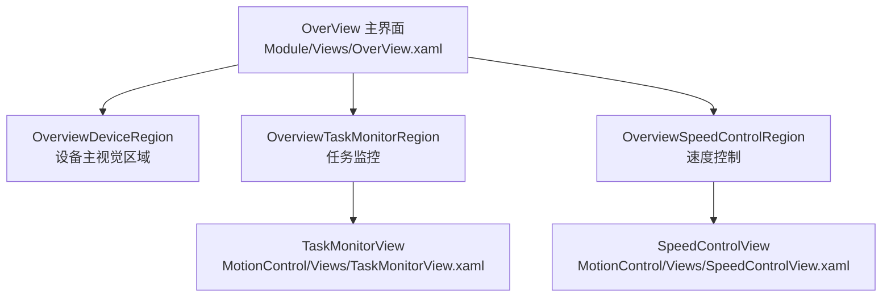
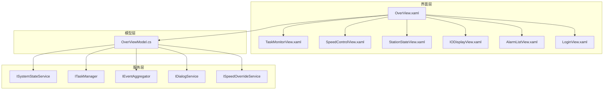
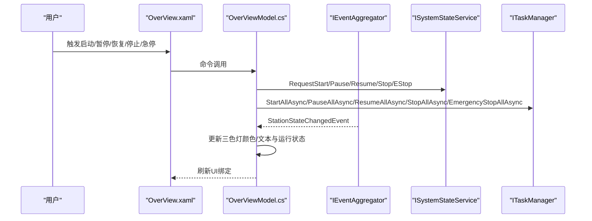
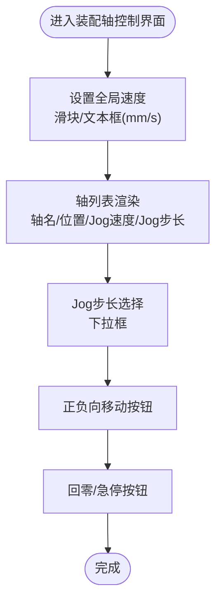
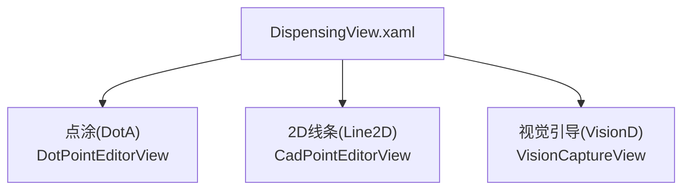
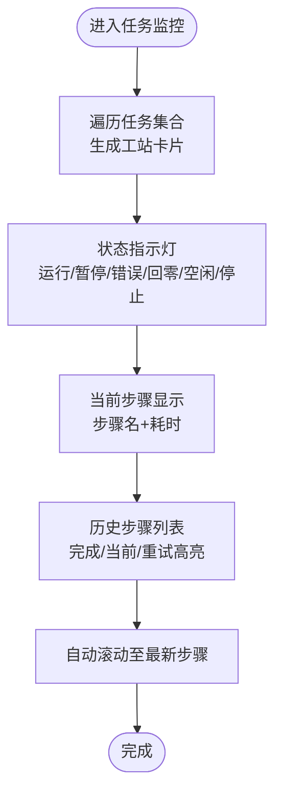
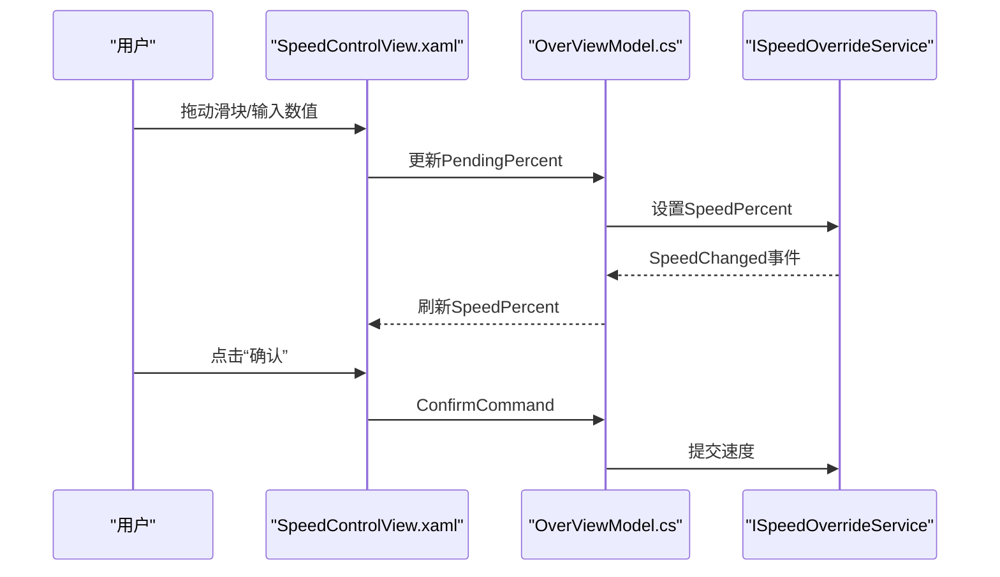
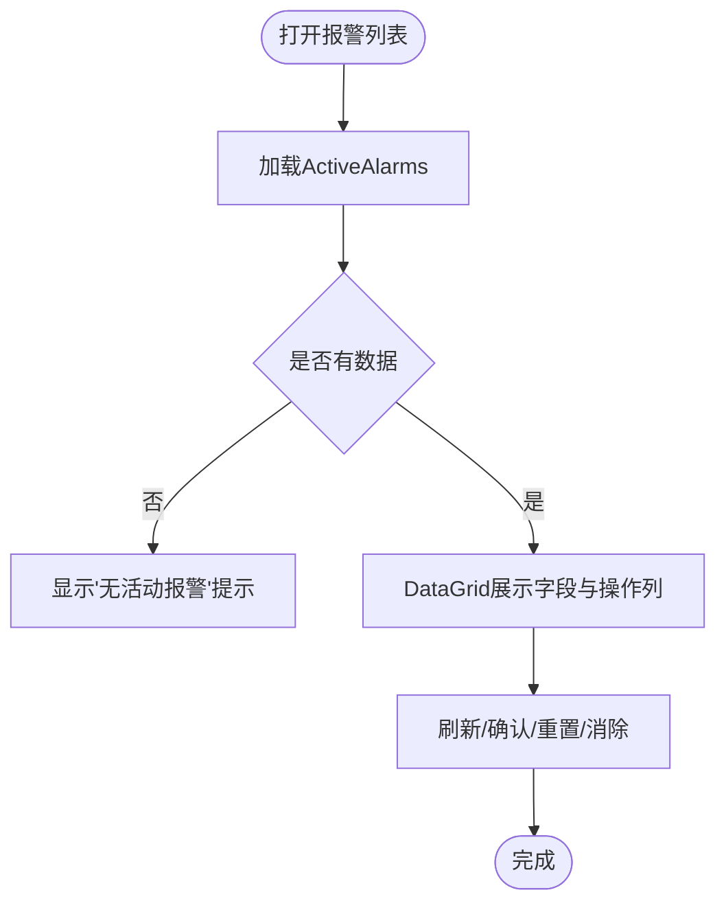
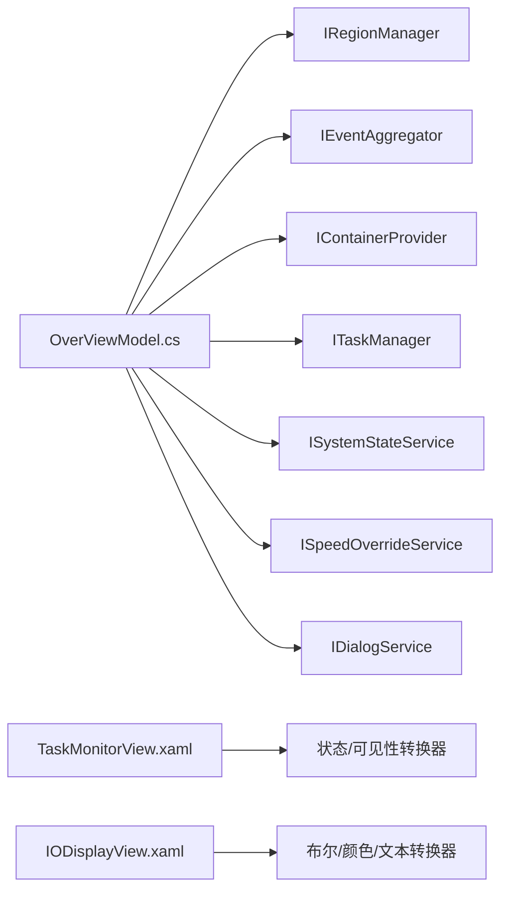

# 工站控制界面

<cite>
**本文引用的文件**
- [OverView.xaml](file://Module/Views/OverView.xaml)
- [OverViewModel.cs](file://Module/ViewModels/OverViewModel.cs)
- [AssemblyAxesView.xaml](file://Module/Controls/Assembly/AssemblyAxesView.xaml)
- [DispensingView.xaml](file://Module/Controls/Dispense/DispensingView.xaml)
- [TaskMonitorView.xaml](file://MotionControl/Views/TaskMonitorView.xaml)
- [SpeedControlView.xaml](file://MotionControl/Views/SpeedControlView.xaml)
- [StationStateView.xaml](file://MotionControl/Views/StationStateView.xaml)
- [IODisplayView.xaml](file://MotionControl/Views/IODisplayView.xaml)
- [AlarmListView.xaml](file://AlarmModule/Views/AlarmListView.xaml)
- [LoginView.xaml](file://ModuleCore/Views/LoginView.xaml)
</cite>

## 目录
1. [简介](#简介)
2. [项目结构](#项目结构)
3. [核心组件](#核心组件)
4. [架构总览](#架构总览)
5. [详细组件分析](#详细组件分析)
6. [依赖关系分析](#依赖关系分析)
7. [性能考虑](#性能考虑)
8. [故障排查指南](#故障排查指南)
9. [结论](#结论)
10. [附录](#附录)

## 简介
本文件面向GZQL_MACHINE的工站控制界面，围绕OverView主界面及其子区域展开，系统性梳理装配轴控制、点胶控制、视觉检测、实时状态监控、进度与报警、工站切换、权限与日志等模块的实现方式与交互流程。文档同时给出架构图、序列图与流程图，帮助读者快速理解UI布局、数据流与控制逻辑，并提供可操作的优化建议与排障指引。

## 项目结构
本项目采用模块化组织，OverView作为主入口，通过PRISM区域承载多个子视图与服务控件：
- OverView主界面：顶部快捷栏、中部设备视觉区域、底部流程控制栏
- OverView右侧区域承载两类子控件：
  - 任务监控：TaskMonitorView
  - 速度控制：SpeedControlView
- OverView左侧区域用于承载设备主视觉（由区域管理器动态导航）

图表来源
- [OverView.xaml:107-134](file://Module/Views/OverView.xaml#L107-L134)
- [TaskMonitorView.xaml:1-142](file://MotionControl/Views/TaskMonitorView.xaml#L1-L142)
- [SpeedControlView.xaml:1-61](file://MotionControl/Views/SpeedControlView.xaml#L1-L61)

章节来源
- [OverView.xaml:10-134](file://Module/Views/OverView.xaml#L10-L134)

## 核心组件
- OverView主界面：负责系统级状态展示（三色灯、安全门、全局速度）、快捷操作（工作灯、吹气阀、日志）、流程控制（初始化、启动、暂停/恢复、停止、急停、单步模式、下一步）以及区域导航。
- OverViewModel：作为OverView的数据上下文，订阅系统状态事件，驱动三色灯与运行状态显示；绑定各控制命令，协调任务管理器与系统状态服务；定时刷新系统时间；弹出日志查看对话框。
- TaskMonitorView：展示各工站任务的实时状态、当前步骤、耗时与历史步骤列表，支持自动滚动与重试高亮。
- SpeedControlView：提供全局速度百分比滑块与“确认”按钮，支持Pending状态与生效状态的视觉提示。
- StationStateView：以主按钮形式展示工站主状态与蜂鸣器状态，便于直观识别。
- IODisplayView：工业风格的DI/DO通道可视化，支持LED指示与DO切换。
- AlarmListView：实时报警列表，支持刷新、批量确认、重置与消除操作。
- LoginView：登录授权界面，提供用户选择、密码输入与登录/退出/管理入口。

章节来源
- [OverViewModel.cs:19-255](file://Module/ViewModels/OverViewModel.cs#L19-L255)
- [TaskMonitorView.xaml:1-142](file://MotionControl/Views/TaskMonitorView.xaml#L1-L142)
- [SpeedControlView.xaml:1-61](file://MotionControl/Views/SpeedControlView.xaml#L1-L61)
- [StationStateView.xaml:1-58](file://MotionControl/Views/StationStateView.xaml#L1-L58)
- [IODisplayView.xaml:1-248](file://MotionControl/Views/IODisplayView.xaml#L1-L248)
- [AlarmListView.xaml:1-181](file://AlarmModule/Views/AlarmListView.xaml#L1-L181)
- [LoginView.xaml:1-134](file://ModuleCore/Views/LoginView.xaml#L1-L134)

## 架构总览
OverView通过PRISM区域管理器加载子视图，OverViewModel作为枢纽连接系统状态服务、任务管理器与对话框服务，形成“视图-模型-服务”的解耦架构。

图表来源
- [OverView.xaml:1-321](file://Module/Views/OverView.xaml#L1-L321)
- [OverViewModel.cs:19-130](file://Module/ViewModels/OverViewModel.cs#L19-L130)
- [TaskMonitorView.xaml:1-142](file://MotionControl/Views/TaskMonitorView.xaml#L1-L142)
- [SpeedControlView.xaml:1-61](file://MotionControl/Views/SpeedControlView.xaml#L1-L61)
- [StationStateView.xaml:1-58](file://MotionControl/Views/StationStateView.xaml#L1-L58)
- [IODisplayView.xaml:1-248](file://MotionControl/Views/IODisplayView.xaml#L1-L248)
- [AlarmListView.xaml:1-181](file://AlarmModule/Views/AlarmListView.xaml#L1-L181)
- [LoginView.xaml:1-134](file://ModuleCore/Views/LoginView.xaml#L1-L134)

## 详细组件分析

### OverView主界面与操作控制面板
- 布局设计
  - 顶部快捷栏：安全门状态指示、三色灯状态指示、全局速度显示、辅助按钮（工作灯、吹气阀）、语言选择器与系统时间。
  - 中部核心区域：左侧设备主视觉区域（通过区域承载），右侧为任务监控与速度控制区域。
  - 底部流程控制栏：初始化、启动、暂停/恢复、停止、分隔线、单步模式切换、下一步、急停。
- 实时状态与控制
  - 三色灯颜色与文本由系统状态事件驱动，覆盖运行、暂停、急停、报警、停止、等待复位、待机、复位中等状态。
  - 暂停/恢复按钮根据系统运行状态动态切换。
  - 全局速度百分比通过SpeedOverride服务联动更新。
  - 系统时间每秒刷新一次，保证界面信息时效性。
  - 日志查看为非模态对话框，支持自定义尺寸与位置。

图表来源
- [OverView.xaml:138-319](file://Module/Views/OverView.xaml#L138-L319)
- [OverViewModel.cs:118-159](file://Module/ViewModels/OverViewModel.cs#L118-L159)

章节来源
- [OverView.xaml:10-321](file://Module/Views/OverView.xaml#L10-L321)
- [OverViewModel.cs:19-255](file://Module/ViewModels/OverViewModel.cs#L19-L255)

### 装配轴控制界面（AssemblyAxesView）
- 功能要点
  - 全局速度设置（滑块+文本框，mm/s）。
  - 轴表格：轴名称、当前位置、Jog速度、Jog步长（下拉选择）、正负向移动按钮。
  - 操作按钮：回零（HomeAll）、急停（EmergencyStop）。
- 设计风格
  - 使用Material Design卡片与主题色，统一的标题样式与间距。
  - 文本格式化（位置保留三位小数，速度保留一位小数）。

图表来源
- [AssemblyAxesView.xaml:1-119](file://Module/Controls/Assembly/AssemblyAxesView.xaml#L1-L119)

章节来源
- [AssemblyAxesView.xaml:1-119](file://Module/Controls/Assembly/AssemblyAxesView.xaml#L1-L119)

### 点胶控制界面（DispensingView）
- 功能要点
  - 顶部工具栏：工站标识、状态指示（就绪）。
  - 主内容区：三个Tab页
    - 点涂（类型A）：DotPointEditorView
    - 2D线条（类型B）：CadPointEditorView
    - 视觉引导（类型D）：VisionCaptureView
  - 底部状态栏：显示主状态、轴信息与模式信息。
- 设计风格
  - 使用Material Design主题，Tab头图标+文字，强调不同点胶类型。

图表来源
- [DispensingView.xaml:55-113](file://Module/Controls/Dispense/DispensingView.xaml#L55-L113)

章节来源
- [DispensingView.xaml:1-129](file://Module/Controls/Dispense/DispensingView.xaml#L1-L129)

### 视觉检测界面（VisionCaptureView）
- 说明
  - 在点胶控制界面中作为Tab页使用，承载视觉捕获与引导功能，具体实现由其对应视图与模型负责。
  - 该界面与HalconWrapper模块存在潜在集成关系，用于图像采集与处理（详见后续依赖分析）。

章节来源
- [DispensingView.xaml:96-111](file://Module/Controls/Dispense/DispensingView.xaml#L96-L111)

### 实时状态监控与进度显示（TaskMonitorView）
- 功能要点
  - 每个工站的任务卡片：状态指示灯（运行/暂停/错误/回零/空闲/停止）、工站名、实时时钟。
  - 当前步骤：步骤名与耗时（等宽字体，避免跳动）。
  - 历史步骤列表：当前步骤以三角形指示，已完成步骤以对勾指示；重试次数以背景色变化提示。
  - 自动滚动：最新步骤进入可视区域。
- 视觉设计
  - 状态灯样式集中定义，基于状态值触发不同填充色。
  - 步骤项样式区分当前执行与重试预警。

图表来源
- [TaskMonitorView.xaml:60-142](file://MotionControl/Views/TaskMonitorView.xaml#L60-L142)

章节来源
- [TaskMonitorView.xaml:1-142](file://MotionControl/Views/TaskMonitorView.xaml#L1-L142)

### 速度控制与全局速度显示（SpeedControlView）
- 功能要点
  - 滑块设置速度百分比（1%-100%），文本实时显示百分比。
  - Pending状态与已生效状态通过文本颜色与文案区分。
  - “确认”按钮提交速度变更。
- 交互细节
  - TwoWay绑定确保双向同步；Pending状态由服务端返回，UI即时反映。

图表来源
- [SpeedControlView.xaml:31-57](file://MotionControl/Views/SpeedControlView.xaml#L31-L57)
- [OverViewModel.cs:72-81](file://Module/ViewModels/OverViewModel.cs#L72-L81)

章节来源
- [SpeedControlView.xaml:1-61](file://MotionControl/Views/SpeedControlView.xaml#L1-L61)
- [OverViewModel.cs:72-81](file://Module/ViewModels/OverViewModel.cs#L72-L81)

### 报警指示与实时报警列表（AlarmListView）
- 功能要点
  - 实时报警列表：报警时间、等级、代码、来源、类型、描述、触发值、阈值、状态。
  - 操作：刷新、批量确认、重置、消除。
  - 未确认数量徽标提示。
- 视觉设计
  - 等级到颜色转换器，状态到文本转换器，模板列提升可读性。

图表来源
- [AlarmListView.xaml:68-178](file://AlarmModule/Views/AlarmListView.xaml#L68-L178)

章节来源
- [AlarmListView.xaml:1-181](file://AlarmModule/Views/AlarmListView.xaml#L1-L181)

### 工站切换机制与权限控制
- 工站切换
  - OverView通过区域管理器在“OverviewTaskMonitorRegion”和“OverviewSpeedControlRegion”中导航到TaskMonitorView与SpeedControlView，实现子界面的按需加载与切换。
- 权限控制
  - 登录界面LoginView提供用户选择与密码输入，登录成功后进入主界面；退出与管理入口分别对应关闭与管理操作。
  - 本仓库未发现显式的角色/权限模型文件，建议在后续版本引入权限服务与菜单/按钮级权限控制。

章节来源
- [OverViewModel.cs:233-251](file://Module/ViewModels/OverViewModel.cs#L233-L251)
- [LoginView.xaml:1-134](file://ModuleCore/Views/LoginView.xaml#L1-L134)

### 操作日志记录与查看
- 日志查看
  - OverViewModel提供“显示日志”命令，通过对话框服务打开非模态日志查看窗口，支持自定义宽度、高度、大小调整策略与窗口位置。
- 日志生成
  - 项目包含日志生成器与查看器模块，可结合NLog配置实现结构化日志记录与检索。

章节来源
- [OverViewModel.cs:219-231](file://Module/ViewModels/OverViewModel.cs#L219-L231)

### 触摸屏适配、手势控制与语音播报（现状与建议）
- 触摸屏适配
  - 当前XAML未见针对触摸的特定行为或手势映射；建议在主窗体级别引入触摸友好控件尺寸与点击反馈，确保按钮与列表项具备足够的触控面积。
- 手势控制
  - 未发现手势识别或手势到命令的映射实现；可在应用层引入手势库或通过事件拦截扩展。
- 语音播报
  - 未发现语音合成或播报相关实现；可在系统状态事件订阅处增加TTS调用，对关键状态（如报警、急停、复位）进行播报。

[本节为通用建议，不直接分析具体文件，故无章节来源]

## 依赖关系分析
- OverViewModel依赖
  - IRegionManager：区域导航
  - IEventAggregator：事件订阅（StationStateChangedEvent）
  - IContainerProvider：容器解析
  - ITaskManager：任务生命周期控制
  - ISystemStateService：系统状态请求
  - ISpeedOverrideService：速度变更
  - IDialogService：日志查看对话框
- 视图依赖
  - TaskMonitorView依赖状态转换器与自动滚动行为
  - SpeedControlView依赖速度变更事件
  - IODisplayView依赖DI/DO模型与多种转换器

图表来源
- [OverViewModel.cs:21-28](file://Module/ViewModels/OverViewModel.cs#L21-L28)
- [TaskMonitorView.xaml:10-58](file://MotionControl/Views/TaskMonitorView.xaml#L10-L58)
- [IODisplayView.xaml:16-31](file://MotionControl/Views/IODisplayView.xaml#L16-L31)

章节来源
- [OverViewModel.cs:21-28](file://Module/ViewModels/OverViewModel.cs#L21-L28)
- [TaskMonitorView.xaml:10-58](file://MotionControl/Views/TaskMonitorView.xaml#L10-L58)
- [IODisplayView.xaml:16-31](file://MotionControl/Views/IODisplayView.xaml#L16-L31)

## 性能考虑
- UI刷新频率
  - 系统时间每秒刷新一次，建议保持此频率以平衡实时性与CPU占用。
- 事件驱动更新
  - 通过事件订阅更新三色灯与运行状态，避免轮询，降低开销。
- 列表虚拟化
  - IODisplayView使用虚拟化栈面板与滚动视图，适合大量IO通道的高效渲染。
- 速度控制
  - 速度变更通过事件回调刷新，避免频繁写入硬件参数。

[本节提供通用指导，不直接分析具体文件，故无章节来源]

## 故障排查指南
- 三色灯不更新
  - 检查系统状态事件是否正确发布与订阅；确认StationStateChangedEvent有效传递。
- 暂停/恢复按钮状态异常
  - 核对IsSystemRunning绑定逻辑与事件回调中的状态判断。
- 速度控制无效
  - 确认SpeedChanged事件是否触发；检查PendingPercent与SpeedPercent双向绑定。
- 任务监控不滚动
  - 检查ListBoxAutoScroll行为是否启用；确认StepList的CanContentScroll设置。
- 报警列表为空
  - 检查ActiveAlarms数据源是否加载；确认未确认数量统计逻辑。
- 登录失败
  - 检查用户列表与密码匹配逻辑；确认登录命令绑定与消息提示。

章节来源
- [OverViewModel.cs:128-159](file://Module/ViewModels/OverViewModel.cs#L128-L159)
- [SpeedControlView.xaml:17-28](file://MotionControl/Views/SpeedControlView.xaml#L17-L28)
- [TaskMonitorView.xaml:100-102](file://MotionControl/Views/TaskMonitorView.xaml#L100-L102)
- [AlarmListView.xaml:80-89](file://AlarmModule/Views/AlarmListView.xaml#L80-L89)
- [LoginView.xaml:84-91](file://ModuleCore/Views/LoginView.xaml#L84-L91)

## 结论
本界面以OverView为核心，通过区域化与事件驱动实现系统状态、任务进度与速度控制的统一展示与交互。装配轴与点胶控制界面分别聚焦机械运动与工艺路径编辑，配合实时报警与IO可视化，构成完整的工站控制体验。建议后续补充权限控制、触摸优化与语音播报能力，进一步提升人机交互质量与安全性。

## 附录
- 术语
  - 工站：指装配、点胶、视觉检测等功能单元
  - 三色灯：指示系统状态的红/绿/橙/灰四色灯
  - 单步模式：逐步骤执行，便于调试与验证
- 参考文件
  - OverView主界面与操作面板：[OverView.xaml:1-321](file://Module/Views/OverView.xaml#L1-L321)
  - OverViewModel业务逻辑：[OverViewModel.cs:19-255](file://Module/ViewModels/OverViewModel.cs#L19-L255)
  - 装配轴控制：[AssemblyAxesView.xaml:1-119](file://Module/Controls/Assembly/AssemblyAxesView.xaml#L1-L119)
  - 点胶控制：[DispensingView.xaml:1-129](file://Module/Controls/Dispense/DispensingView.xaml#L1-L129)
  - 任务监控：[TaskMonitorView.xaml:1-142](file://MotionControl/Views/TaskMonitorView.xaml#L1-L142)
  - 速度控制：[SpeedControlView.xaml:1-61](file://MotionControl/Views/SpeedControlView.xaml#L1-L61)
  - 工站状态：[StationStateView.xaml:1-58](file://MotionControl/Views/StationStateView.xaml#L1-L58)
  - IO显示：[IODisplayView.xaml:1-248](file://MotionControl/Views/IODisplayView.xaml#L1-L248)
  - 报警列表：[AlarmListView.xaml:1-181](file://AlarmModule/Views/AlarmListView.xaml#L1-L181)
  - 登录界面：[LoginView.xaml:1-134](file://ModuleCore/Views/LoginView.xaml#L1-L134)