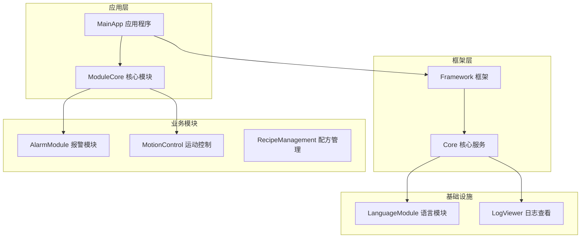
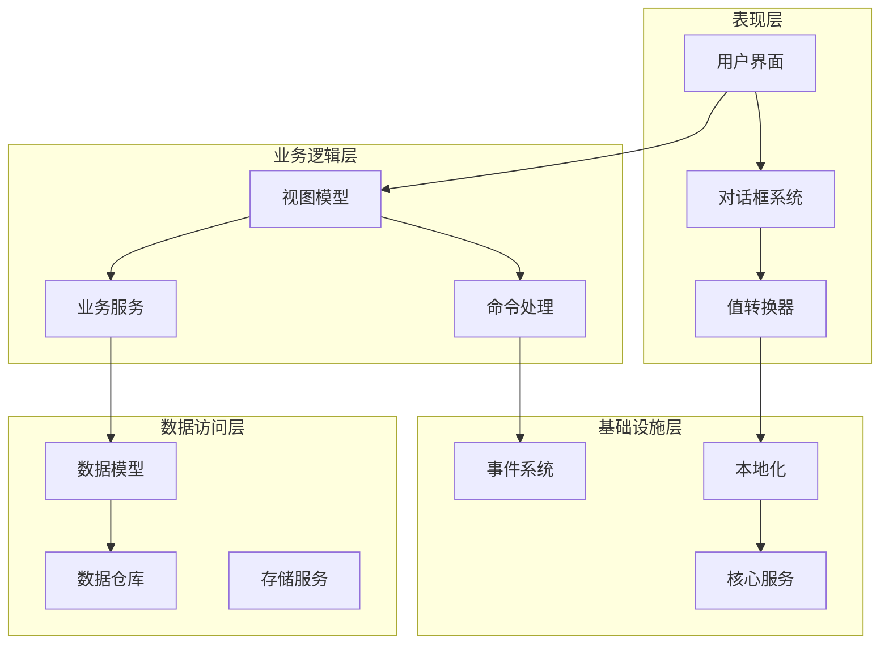
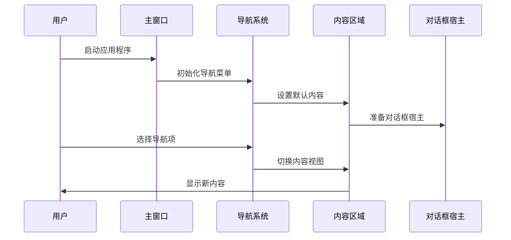
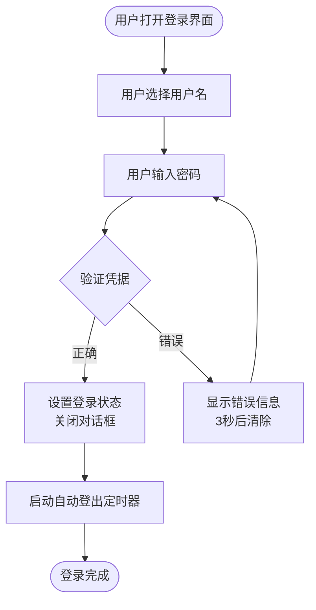
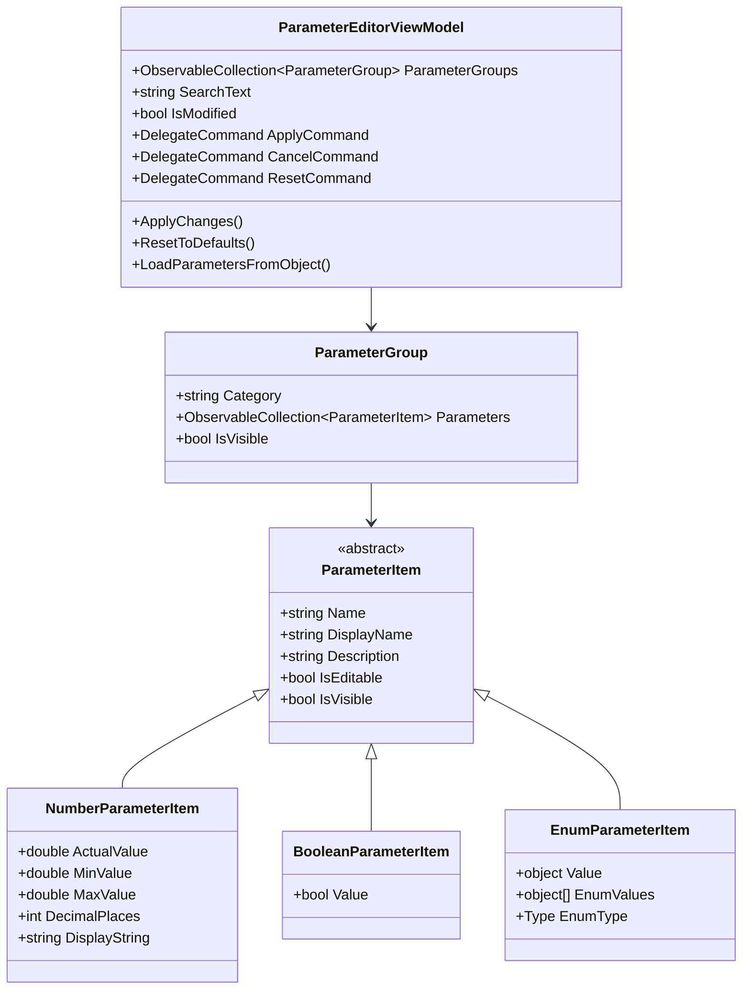
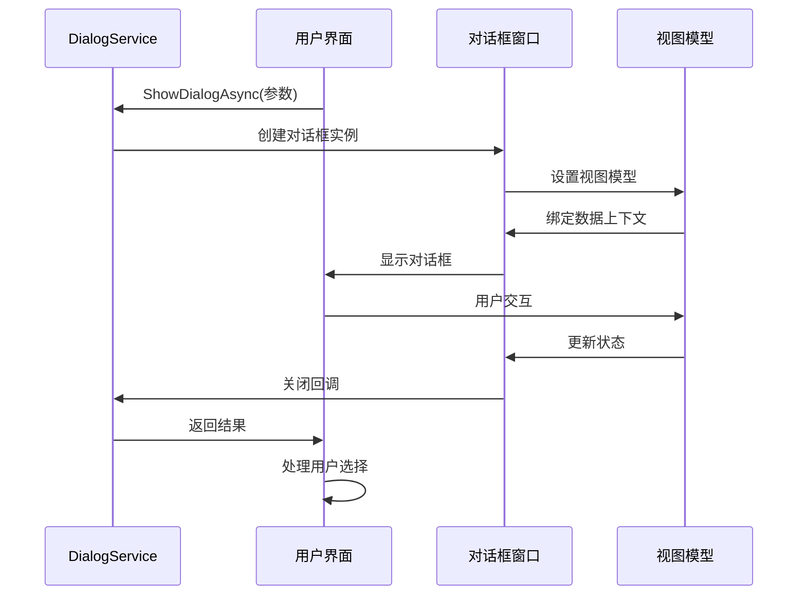
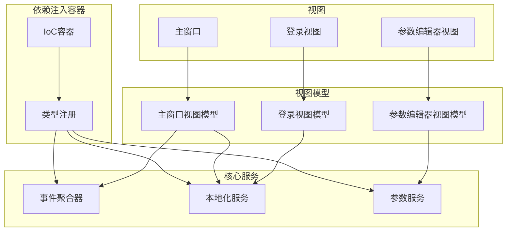

# 用户界面设计

<cite>
**本文档引用的文件**
- [MainApp/App.xaml](file://MainApp/App.xaml)
- [MainApp/Views/MainWindow.xaml](file://MainApp/Views/MainWindow.xaml)
- [MainApp/ViewModels/MainWindowViewModel.cs](file://MainApp/ViewModels/MainWindowViewModel.cs)
- [ModuleCore/Views/LoginView.xaml](file://ModuleCore/Views/LoginView.xaml)
- [ModuleCore/ViewModels/LoginViewModel.cs](file://ModuleCore/ViewModels/LoginViewModel.cs)
- [ModuleCore/Views/MainWindow.xaml](file://ModuleCore/Views/MainWindow.xaml)
- [Framework/Views/ParameterEditorView.xaml](file://Framework/Views/ParameterEditorView.xaml)
- [Framework/ViewModels/ParameterEditorViewModel.cs](file://Framework/ViewModels/ParameterEditorViewModel.cs)
- [Framework/Services/DialogService.cs](file://Framework/Services/DialogService.cs)
- [Framework/Converters/BooleanToVisibilityConverter.cs](file://Framework/Converters/BooleanToVisibilityConverter.cs)
- [Core/Markup/LangExtension.cs](file://Core/Markup/LangExtension.cs)
- [Core/Services/LocalizationService.cs](file://Core/Services/LocalizationService.cs)
- [MainApp/Languages/Strings.zh-CN.xaml](file://MainApp/Languages/Strings.zh-CN.xaml)
- [MainApp/Languages/Strings.en-US.xaml](file://MainApp/Languages/Strings.en-US.xaml)
</cite>

## 目录
1. [简介](#简介)
2. [项目结构](#项目结构)
3. [核心组件](#核心组件)
4. [架构概览](#架构概览)
5. [详细组件分析](#详细组件分析)
6. [依赖关系分析](#依赖关系分析)
7. [性能考虑](#性能考虑)
8. [故障排除指南](#故障排除指南)
9. [结论](#结论)
10. [附录](#附录)

## 简介

GZQL_MACHINE的用户界面系统采用现代化的WPF技术栈，结合Prism框架实现模块化架构，使用Material Design主题提供统一的视觉体验。该系统专注于工业自动化场景，为用户提供直观、响应式的操作界面。

系统的核心设计理念包括：
- **Material Design主题应用**：统一的视觉语言和交互模式
- **响应式布局实现**：适应不同屏幕尺寸和分辨率
- **MVVM架构模式**：清晰的分离关注点和可测试性
- **国际化支持**：多语言本地化能力
- **命令模式实现**：松耦合的用户交互处理
- **状态管理策略**：集中化的应用状态控制

## 项目结构

项目采用分层模块化架构，主要包含以下核心模块：

**图表来源**
- [MainApp/App.xaml:1-50](file://MainApp/App.xaml#L1-L50)
- [ModuleCore/Views/MainWindow.xaml:1-687](file://ModuleCore/Views/MainWindow.xaml#L1-L687)

**章节来源**
- [MainApp/App.xaml:1-50](file://MainApp/App.xaml#L1-L50)
- [ModuleCore/Views/MainWindow.xaml:1-687](file://ModuleCore/Views/MainWindow.xaml#L1-L687)

## 核心组件

### Material Design主题集成

系统深度集成了Material Design主题，通过MaterialDesignThemes.Wpf库实现统一的视觉设计语言：

- **主题资源字典**：包含主色调、辅助色调和默认样式
- **控件样式**：统一的按钮、输入框、对话框等控件外观
- **图标系统**：完整的PackIcon图标库支持
- **动画效果**：流畅的过渡动画和交互反馈

### 响应式布局架构

采用Grid布局系统实现灵活的响应式设计：

- **自适应网格**：根据窗口大小动态调整布局
- **最小尺寸限制**：确保在小屏幕上的可读性
- **拖拽调整**：支持用户自定义面板大小
- **状态栏集成**：提供系统状态和用户信息显示

### 国际化支持体系

完整的多语言本地化解决方案：

- **动态资源字典**：运行时切换语言资源
- **标记扩展**：LangExtension提供声明式本地化
- **区域性设置**：支持文化特定的格式化
- **语言切换**：热切换语言而无需重启

**章节来源**
- [MainApp/App.xaml:36-44](file://MainApp/App.xaml#L36-L44)
- [Core/Markup/LangExtension.cs:1-242](file://Core/Markup/LangExtension.cs#L1-L242)
- [Core/Services/LocalizationService.cs:1-353](file://Core/Services/LocalizationService.cs#L1-L353)

## 架构概览

系统采用分层架构设计，各层职责明确，耦合度低：

**图表来源**
- [Framework/ViewModels/ParameterEditorViewModel.cs:1-511](file://Framework/ViewModels/ParameterEditorViewModel.cs#L1-L511)
- [Framework/Services/DialogService.cs:1-432](file://Framework/Services/DialogService.cs#L1-L432)

## 详细组件分析

### 主窗口布局系统

主窗口采用三层布局设计，提供完整的操作环境：

#### 顶部工具栏
- **标题显示**：应用程序名称和版本信息
- **状态指示器**：系统运行状态和报警信息
- **功能菜单**：帮助、关于等系统功能
- **窗口控制**：最小化、最大化、关闭按钮

#### 中央内容区域
- **导航菜单**：左侧折叠式导航栏
- **主内容区**：主要内容显示区域
- **覆盖层**：进度指示和临时信息显示
- **错误显示**：系统错误和警告信息

#### 底部状态栏
- **用户信息**：当前登录用户和权限
- **产品信息**：当前配方和批次信息
- **通信状态**：SECS/GEM通信状态
- **系统版本**：软件版本和构建信息

**图表来源**
- [ModuleCore/Views/MainWindow.xaml:92-687](file://ModuleCore/Views/MainWindow.xaml#L92-L687)

**章节来源**
- [ModuleCore/Views/MainWindow.xaml:1-687](file://ModuleCore/Views/MainWindow.xaml#L1-L687)
- [MainApp/Views/MainWindow.xaml:1-24](file://MainApp/Views/MainWindow.xaml#L1-L24)

### 登录界面设计

登录界面采用简洁直观的设计，确保用户能够快速完成身份验证：

#### 界面元素布局
- **标题区域**：显示"权限登录"标题
- **用户选择**：下拉框选择用户名
- **密码输入**：安全的密码输入框
- **状态显示**：错误信息和提示文本
- **功能按钮**：登录、退出、管理功能

#### 交互流程

**图表来源**
- [ModuleCore/ViewModels/LoginViewModel.cs:38-123](file://ModuleCore/ViewModels/LoginViewModel.cs#L38-L123)

**章节来源**
- [ModuleCore/Views/LoginView.xaml:1-134](file://ModuleCore/Views/LoginView.xaml#L1-L134)
- [ModuleCore/ViewModels/LoginViewModel.cs:1-153](file://ModuleCore/ViewModels/LoginViewModel.cs#L1-L153)

### 参数编辑器组件

参数编辑器是系统的核心配置工具，提供灵活的参数管理和编辑功能：

#### 组件架构
- **分组显示**：按类别组织参数
- **模板选择器**：根据参数类型选择合适的编辑器
- **搜索过滤**：快速查找和筛选参数
- **实时验证**：参数输入的即时验证

#### 编辑器类型

**图表来源**
- [Framework/ViewModels/ParameterEditorViewModel.cs:25-511](file://Framework/ViewModels/ParameterEditorViewModel.cs#L25-L511)

**章节来源**
- [Framework/Views/ParameterEditorView.xaml:1-353](file://Framework/Views/ParameterEditorView.xaml#L1-L353)
- [Framework/ViewModels/ParameterEditorViewModel.cs:1-511](file://Framework/ViewModels/ParameterEditorViewModel.cs#L1-L511)

### 对话框管理系统

系统提供了完善的对话框管理机制，支持多种类型的用户交互：

#### 对话框类型
- **消息对话框**：信息提示和确认对话框
- **参数对话框**：复杂的参数配置对话框
- **进度对话框**：长时间操作的进度显示
- **确认对话框**：重要操作的二次确认

#### 异步处理机制

**图表来源**
- [Framework/Services/DialogService.cs:244-408](file://Framework/Services/DialogService.cs#L244-L408)

**章节来源**
- [Framework/Services/DialogService.cs:1-432](file://Framework/Services/DialogService.cs#L1-L432)

### 值转换器系统

系统实现了丰富的值转换器，支持数据绑定过程中的类型转换和格式化：

#### 核心转换器
- **布尔到可见性转换**：控制控件的显示和隐藏
- **数值格式转换**：数字的格式化显示
- **颜色转换器**：颜色值的转换和显示
- **状态转换器**：各种状态的视觉表示

**章节来源**
- [Framework/Converters/BooleanToVisibilityConverter.cs:1-47](file://Framework/Converters/BooleanToVisibilityConverter.cs#L1-L47)

## 依赖关系分析

系统采用松耦合的设计原则，通过接口和事件实现模块间的解耦：

**图表来源**
- [Framework/FrameworkModule.cs:31-55](file://Framework/FrameworkModule.cs#L31-L55)

**章节来源**
- [Framework/FrameworkModule.cs:1-59](file://Framework/FrameworkModule.cs#L1-L59)

## 性能考虑

### 渲染性能优化
- **虚拟化列表**：大量数据时使用虚拟化提高渲染效率
- **延迟加载**：非关键资源的延迟加载机制
- **内存管理**：及时释放不再使用的资源和事件订阅

### 响应性保证
- **异步操作**：长时间操作使用异步处理避免界面冻结
- **进度反馈**：提供操作进度和状态反馈
- **超时处理**：网络和外部服务调用的超时机制

### 资源管理
- **资源字典缓存**：语言资源的智能缓存机制
- **主题切换优化**：Material Design主题切换的性能优化
- **图片资源管理**：图标和图片资源的高效加载

## 故障排除指南

### 常见问题诊断

#### 登录认证问题
- **密码验证失败**：检查密码输入和用户权限配置
- **自动登出异常**：验证登出定时器配置和用户会话状态
- **权限不足**：确认用户角色和操作权限设置

#### 参数编辑问题
- **参数保存失败**：检查参数类型转换和验证规则
- **界面更新延迟**：验证数据绑定和通知机制
- **搜索功能异常**：确认搜索过滤逻辑和性能优化

#### 对话框显示问题
- **对话框无法关闭**：检查对话框宿主和生命周期管理
- **异步调用阻塞**：验证异步处理和线程调度
- **样式显示异常**：确认Material Design主题资源加载

**章节来源**
- [ModuleCore/ViewModels/LoginViewModel.cs:38-123](file://ModuleCore/ViewModels/LoginViewModel.cs#L38-L123)
- [Framework/ViewModels/ParameterEditorViewModel.cs:134-161](file://Framework/ViewModels/ParameterEditorViewModel.cs#L134-L161)

## 结论

GZQL_MACHINE的用户界面系统展现了现代WPF应用开发的最佳实践，通过Material Design主题、响应式布局和MVVM架构的有机结合，为工业自动化场景提供了专业、可靠的用户界面解决方案。

系统的主要优势包括：
- **统一的视觉设计**：Material Design主题确保一致的用户体验
- **灵活的布局系统**：响应式设计适应不同的使用环境
- **强大的本地化支持**：完整的多语言解决方案
- **模块化的架构设计**：清晰的分层和职责分离
- **完善的交互机制**：命令模式和事件驱动的用户交互

未来的发展方向包括进一步优化性能、增强可访问性支持和扩展更多的主题定制选项。

## 附录

### 主题定制选项

系统支持多种主题定制方式：
- **颜色方案**：主色调和辅助色调的自定义
- **字体设置**：字体族和字号的调整
- **间距配置**：控件间距和边距的个性化
- **动画效果**：过渡动画和交互反馈的定制

### 国际化扩展

语言支持的扩展机制：
- **新语言添加**：通过资源字典添加新的语言支持
- **动态切换**：运行时语言切换的实现机制
- **文化特定格式**：日期、时间和数字的本地化格式
- **RTL支持**：从右到左语言的布局支持

### 无障碍访问

系统提供的无障碍功能：
- **键盘导航**：完整的键盘操作支持
- **屏幕阅读器**：与屏幕阅读器的兼容性
- **高对比度**：高对比度主题的支持
- **焦点管理**：清晰的焦点指示和导航