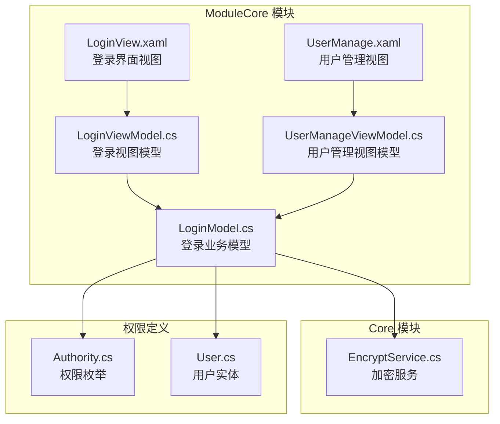
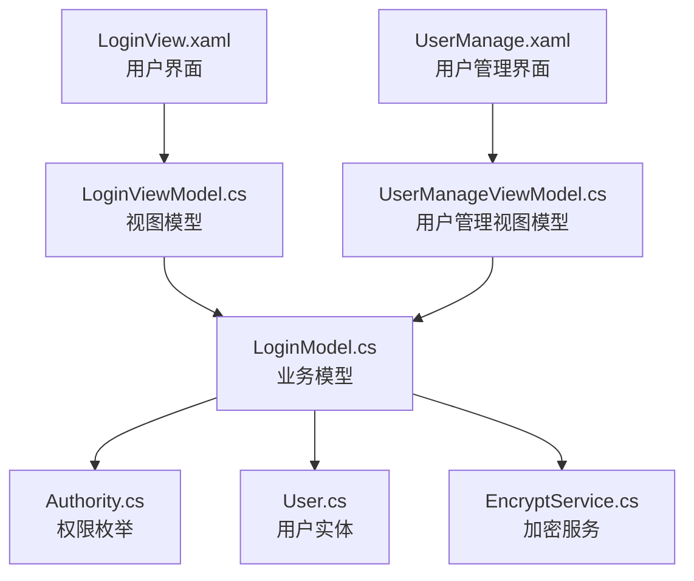
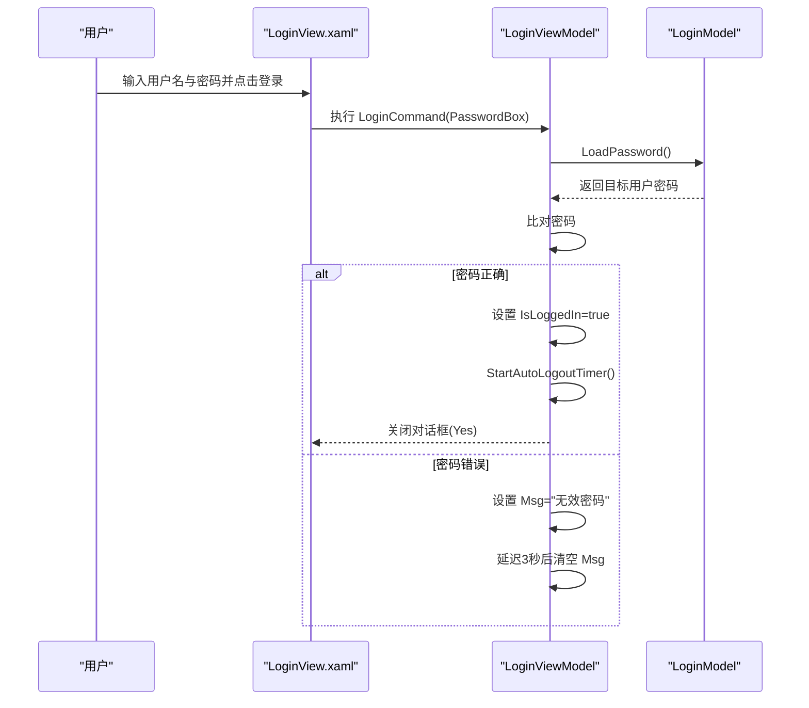
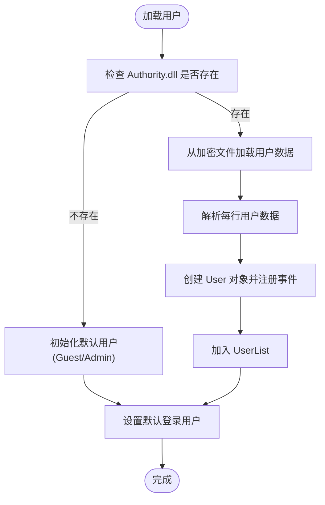
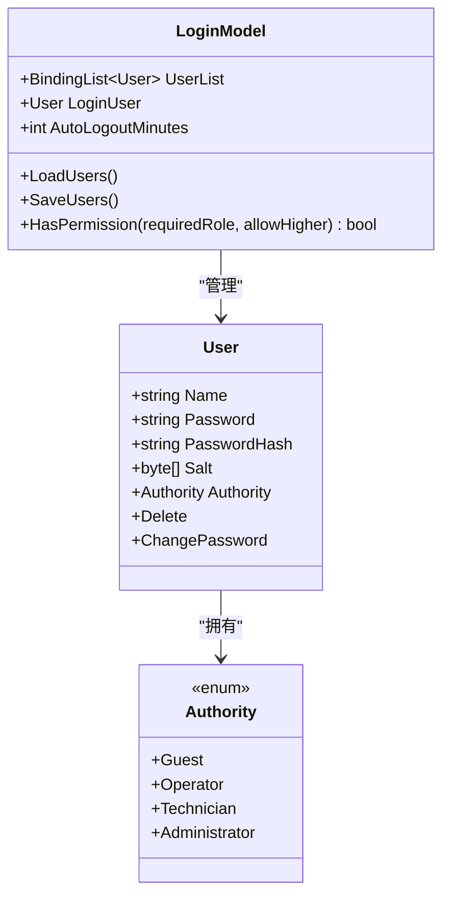
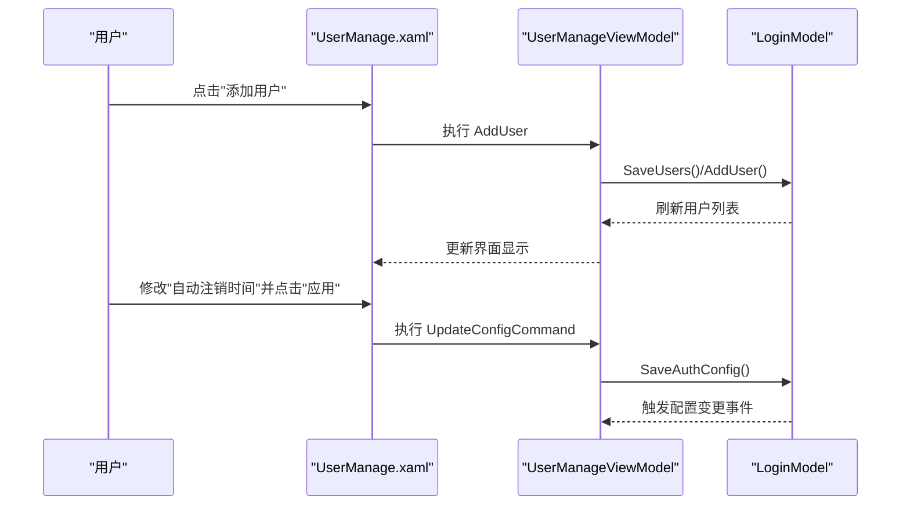
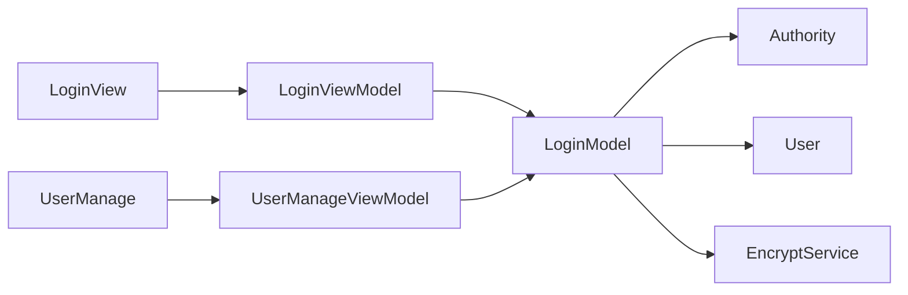

# 登录认证界面

<cite>
**本文档引用的文件**
- [LoginView.xaml](file://ModuleCore/Views/LoginView.xaml)
- [LoginViewModel.cs](file://ModuleCore/ViewModels/LoginViewModel.cs)
- [LoginModel.cs](file://ModuleCore/Models/LoginModel.cs)
- [Authority.cs](file://ModuleCore/Common/Authority/Authority.cs)
- [User.cs](file://ModuleCore/Common/Authority/User.cs)
- [EncryptService.cs](file://Core/Services/EncryptService.cs)
- [UserManage.xaml](file://ModuleCore/Views/UserManage.xaml)
- [UserManageViewModel.cs](file://ModuleCore/ViewModels/UserManageViewModel.cs)
</cite>

## 目录
1. [简介](#简介)
2. [项目结构](#项目结构)
3. [核心组件](#核心组件)
4. [架构概览](#架构概览)
5. [详细组件分析](#详细组件分析)
6. [依赖关系分析](#依赖关系分析)
7. [性能考虑](#性能考虑)
8. [故障排除指南](#故障排除指南)
9. [结论](#结论)

## 简介
本文件针对 GZQL_MACHINE 项目的登录认证界面进行全面技术文档化，涵盖 UI 设计、表单布局、输入验证机制、用户权限验证流程、角色分配机制、会话管理策略、安全实现方案以及审计日志记录等关键内容。文档旨在帮助开发者与维护人员快速理解并扩展登录认证系统的功能与安全性。

## 项目结构
登录认证相关的核心文件分布于 ModuleCore 模块与 Core 模块中，采用 Prism MVVM 架构，通过对话框形式提供登录体验，并结合权限模型与加密服务实现基础的安全控制。

**图表来源**
- [LoginView.xaml:1-134](file://ModuleCore/Views/LoginView.xaml#L1-L134)
- [LoginViewModel.cs:1-153](file://ModuleCore/ViewModels/LoginViewModel.cs#L1-L153)
- [LoginModel.cs:1-303](file://ModuleCore/Models/LoginModel.cs#L1-L303)
- [Authority.cs:1-13](file://ModuleCore/Common/Authority/Authority.cs#L1-L13)
- [User.cs:1-61](file://ModuleCore/Common/Authority/User.cs#L1-L61)
- [EncryptService.cs:1-157](file://Core/Services/EncryptService.cs#L1-L157)
- [UserManage.xaml:1-199](file://ModuleCore/Views/UserManage.xaml#L1-L199)
- [UserManageViewModel.cs:1-89](file://ModuleCore/ViewModels/UserManageViewModel.cs#L1-L89)

**章节来源**
- [LoginView.xaml:1-134](file://ModuleCore/Views/LoginView.xaml#L1-L134)
- [LoginViewModel.cs:1-153](file://ModuleCore/ViewModels/LoginViewModel.cs#L1-L153)
- [LoginModel.cs:1-303](file://ModuleCore/Models/LoginModel.cs#L1-L303)

## 核心组件
- 登录界面视图（LoginView.xaml）：提供用户名下拉选择、密码输入框、错误消息展示与登录/退出/管理按钮。
- 登录视图模型（LoginViewModel）：负责登录命令执行、错误消息反馈、会话自动登出定时器、对话框关闭逻辑。
- 登录业务模型（LoginModel）：管理用户列表、权限枚举、认证配置（自动注销时间）、用户数据持久化与加载、密码加载与变更。
- 权限与用户实体：Authority 枚举定义权限等级；User 实体承载用户信息与事件委托。
- 加密服务（EncryptService）：提供 MD5、SHA256、对称加密等方法，用于用户密码的加密存储与校验。
- 用户管理界面（UserManage）：提供用户增删改查、密码修改、自动注销时间配置等功能。

**章节来源**
- [LoginView.xaml:1-134](file://ModuleCore/Views/LoginView.xaml#L1-L134)
- [LoginViewModel.cs:1-153](file://ModuleCore/ViewModels/LoginViewModel.cs#L1-L153)
- [LoginModel.cs:1-303](file://ModuleCore/Models/LoginModel.cs#L1-L303)
- [Authority.cs:1-13](file://ModuleCore/Common/Authority/Authority.cs#L1-L13)
- [User.cs:1-61](file://ModuleCore/Common/Authority/User.cs#L1-L61)
- [EncryptService.cs:1-157](file://Core/Services/EncryptService.cs#L1-L157)
- [UserManage.xaml:1-199](file://ModuleCore/Views/UserManage.xaml#L1-L199)
- [UserManageViewModel.cs:1-89](file://ModuleCore/ViewModels/UserManageViewModel.cs#L1-L89)

## 架构概览
登录认证系统采用分层架构：
- 视图层：WPF 用户控件，绑定到视图模型。
- 视图模型层：Prism 命令与属性封装，协调业务模型。
- 业务模型层：用户管理、权限判断、配置持久化。
- 加密服务层：提供密码加密与解密能力。
- 权限定义层：基于枚举的角色与权限等级。

**图表来源**
- [LoginView.xaml:1-134](file://ModuleCore/Views/LoginView.xaml#L1-L134)
- [LoginViewModel.cs:1-153](file://ModuleCore/ViewModels/LoginViewModel.cs#L1-L153)
- [LoginModel.cs:1-303](file://ModuleCore/Models/LoginModel.cs#L1-L303)
- [Authority.cs:1-13](file://ModuleCore/Common/Authority/Authority.cs#L1-L13)
- [User.cs:1-61](file://ModuleCore/Common/Authority/User.cs#L1-L61)
- [EncryptService.cs:1-157](file://Core/Services/EncryptService.cs#L1-L157)
- [UserManage.xaml:1-199](file://ModuleCore/Views/UserManage.xaml#L1-L199)
- [UserManageViewModel.cs:1-89](file://ModuleCore/ViewModels/UserManageViewModel.cs#L1-L89)

## 详细组件分析

### 登录界面视图（LoginView.xaml）
- 布局结构：采用网格布局，包含标题行、用户名选择行、密码输入行、错误消息行与按钮组行。
- 控件说明：
  - 用户名下拉框：绑定到模型中的用户列表与当前选中名称。
  - 密码框：PasswordBox 类型，密码通过命令参数传递给视图模型。
  - 错误消息文本块：绑定到视图模型的消息属性，用于显示登录失败提示。
  - 按钮组：登录、退出、管理三个按钮，分别绑定不同命令与参数。
- 主题与资源：使用 Material Design 主题资源字典，统一界面风格。

**章节来源**
- [LoginView.xaml:1-134](file://ModuleCore/Views/LoginView.xaml#L1-L134)

### 登录视图模型（LoginViewModel）
- 关键职责：
  - 登录命令：从 PasswordBox 获取密码，与模型中加载的用户密码进行比对，成功则设置登录状态、触发自动登出定时器并关闭对话框；失败则显示错误消息并清空。
  - 对话框关闭命令：处理“管理”、“退出”、“登录成功”三种参数，控制是否允许关闭及关闭时的返回结果。
  - 自动登出定时器：根据模型中的自动注销分钟数启动定时器，超时后自动触发退出。
  - IDialogAware 接口：提供对话框生命周期与关闭通知。
- 输入验证：主要在命令执行阶段进行密码比对，未见 XAML 级别的验证规则。

**图表来源**
- [LoginViewModel.cs:38-55](file://ModuleCore/ViewModels/LoginViewModel.cs#L38-L55)
- [LoginModel.cs:152-156](file://ModuleCore/Models/LoginModel.cs#L152-L156)

**章节来源**
- [LoginViewModel.cs:1-153](file://ModuleCore/ViewModels/LoginViewModel.cs#L1-L153)

### 登录业务模型（LoginModel）
- 用户管理：
  - 加载用户：从加密的 Authority.dll 文件加载用户数据，若不存在则初始化默认用户（Guest/Admin），并建立权限事件。
  - 添加/删除用户：通过事件委托触发删除与密码修改流程。
  - 保存用户：将用户列表写回加密文件。
- 权限系统：
  - Authority 枚举定义 Guest、Operator、Technician、Administrator 四级权限。
  - HasPermission 方法支持权限比较与“允许更高权限”的判断。
- 认证配置：
  - 从 Auth.config 加载自动注销时间，若文件缺失或损坏则初始化默认配置并记录日志。
  - 提供保存配置方法，记录修改时间。
- 数据持久化：
  - 使用 JsonService 将 DataTable 加密写入/读取文件，保障用户数据安全。

**图表来源**
- [LoginModel.cs:106-150](file://ModuleCore/Models/LoginModel.cs#L106-L150)

**章节来源**
- [LoginModel.cs:1-303](file://ModuleCore/Models/LoginModel.cs#L1-L303)
- [Authority.cs:1-13](file://ModuleCore/Common/Authority/Authority.cs#L1-L13)
- [User.cs:1-61](file://ModuleCore/Common/Authority/User.cs#L1-L61)

### 权限与用户实体
- Authority 枚举：定义四档权限等级，支持按等级比较与授权判断。
- User 实体：包含用户名、密码、权限等级，提供删除与改密事件委托，便于在界面层触发相应操作。

**图表来源**
- [Authority.cs:1-13](file://ModuleCore/Common/Authority/Authority.cs#L1-L13)
- [User.cs:1-61](file://ModuleCore/Common/Authority/User.cs#L1-L61)
- [LoginModel.cs:52-73](file://ModuleCore/Models/LoginModel.cs#L52-L73)

**章节来源**
- [Authority.cs:1-13](file://ModuleCore/Common/Authority/Authority.cs#L1-L13)
- [User.cs:1-61](file://ModuleCore/Common/Authority/User.cs#L1-L61)
- [LoginModel.cs:52-73](file://ModuleCore/Models/LoginModel.cs#L52-L73)

### 加密服务（EncryptService）
- 功能概述：提供 MD5、SHA256、基于密钥的对称加密/解密等方法。
- 在登录场景中的作用：用于用户密码的加密存储与加载（例如初始化 Admin 密码时使用加密服务）。

**章节来源**
- [EncryptService.cs:1-157](file://Core/Services/EncryptService.cs#L1-L157)

### 用户管理界面（UserManage）
- 功能概述：展示用户列表（含删除与改密操作），新增用户表单（用户名、权限、密码与确认密码），系统设置（自动注销时间）。
- 交互流程：通过视图模型调用业务模型保存用户与配置。

**图表来源**
- [UserManage.xaml:160-165](file://ModuleCore/Views/UserManage.xaml#L160-L165)
- [UserManageViewModel.cs:50-56](file://ModuleCore/ViewModels/UserManageViewModel.cs#L50-L56)
- [LoginModel.cs:276-300](file://ModuleCore/Models/LoginModel.cs#L276-L300)

**章节来源**
- [UserManage.xaml:1-199](file://ModuleCore/Views/UserManage.xaml#L1-L199)
- [UserManageViewModel.cs:1-89](file://ModuleCore/ViewModels/UserManageViewModel.cs#L1-L89)
- [LoginModel.cs:158-208](file://ModuleCore/Models/LoginModel.cs#L158-L208)

## 依赖关系分析
- LoginView 依赖 LoginViewModel 的命令与数据绑定。
- LoginViewModel 依赖 LoginModel 的用户数据与权限判断。
- LoginModel 依赖 Authority 枚举与 User 实体，同时依赖 EncryptService 进行密码处理。
- UserManage 界面与视图模型同样依赖 LoginModel 进行用户与配置管理。

**图表来源**
- [LoginView.xaml:1-134](file://ModuleCore/Views/LoginView.xaml#L1-L134)
- [LoginViewModel.cs:1-153](file://ModuleCore/ViewModels/LoginViewModel.cs#L1-L153)
- [LoginModel.cs:1-303](file://ModuleCore/Models/LoginModel.cs#L1-L303)
- [Authority.cs:1-13](file://ModuleCore/Common/Authority/Authority.cs#L1-L13)
- [User.cs:1-61](file://ModuleCore/Common/Authority/User.cs#L1-L61)
- [EncryptService.cs:1-157](file://Core/Services/EncryptService.cs#L1-L157)
- [UserManage.xaml:1-199](file://ModuleCore/Views/UserManage.xaml#L1-L199)
- [UserManageViewModel.cs:1-89](file://ModuleCore/ViewModels/UserManageViewModel.cs#L1-L89)

**章节来源**
- [LoginView.xaml:1-134](file://ModuleCore/Views/LoginView.xaml#L1-L134)
- [LoginViewModel.cs:1-153](file://ModuleCore/ViewModels/LoginViewModel.cs#L1-L153)
- [LoginModel.cs:1-303](file://ModuleCore/Models/LoginModel.cs#L1-L303)

## 性能考虑
- 登录命令执行：仅进行一次密码比对与少量集合查询，复杂度为 O(n)（n 为用户数量），在小规模用户集下可忽略不计。
- 自动登出定时器：DispatcherTimer 周期性触发，建议保持合理间隔，避免频繁启停造成 UI 卡顿。
- 数据持久化：加密文件读写涉及磁盘 I/O，建议在批量操作时合并保存，减少文件写入次数。
- UI 响应：错误消息延迟清空使用异步延时，避免阻塞主线程。

[本节为通用性能建议，无需特定文件引用]

## 故障排除指南
- 登录失败但无提示：
  - 检查视图模型的消息绑定与命令参数传递是否正确。
  - 确认密码比对逻辑与模型中加载的用户密码一致。
- 用户列表为空或加载异常：
  - 检查 Authority.dll 是否存在且可正常读取；若损坏，系统会尝试初始化默认用户。
- 自动注销时间不生效：
  - 检查 Auth.config 是否存在且包含有效配置；若损坏，系统会备份并重建默认配置。
- 管理员权限限制：
  - “管理”按钮仅允许 Admin 用户打开用户管理界面；非管理员点击会弹出提示并拒绝操作。

**章节来源**
- [LoginViewModel.cs:70-106](file://ModuleCore/ViewModels/LoginViewModel.cs#L70-L106)
- [LoginModel.cs:209-275](file://ModuleCore/Models/LoginModel.cs#L209-L275)
- [UserManage.xaml:100-118](file://ModuleCore/Views/UserManage.xaml#L100-L118)

## 结论
该登录认证界面以简洁的 WPF 界面与 Prism MVVM 架构为基础，结合权限枚举与加密服务，实现了基本的用户认证、权限控制与会话管理。系统具备用户数据持久化、配置容错与日志记录能力，满足中小型应用场景的安全需求。后续可在现有基础上增强多因子认证、账户锁定与审计日志等高级安全特性。