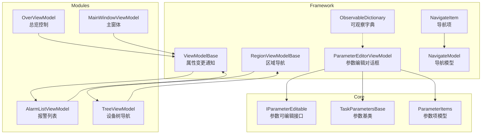
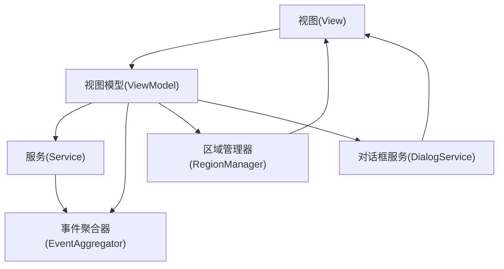
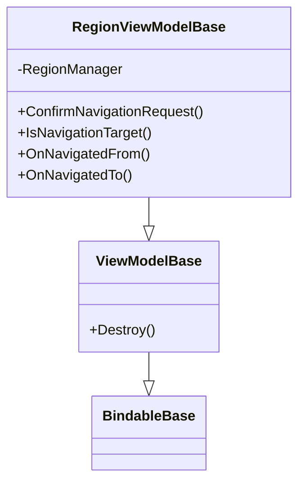
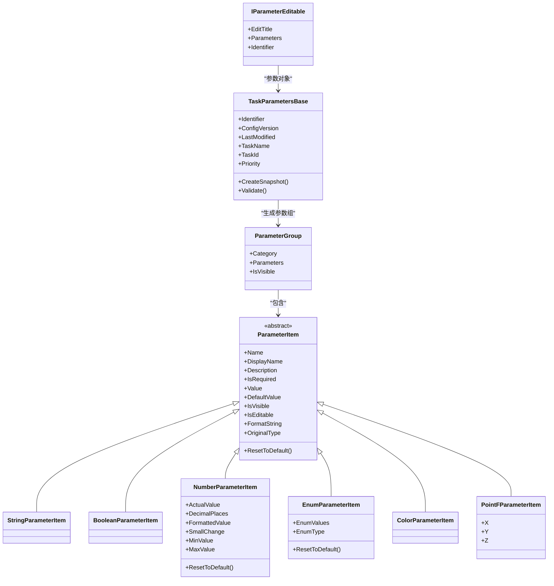
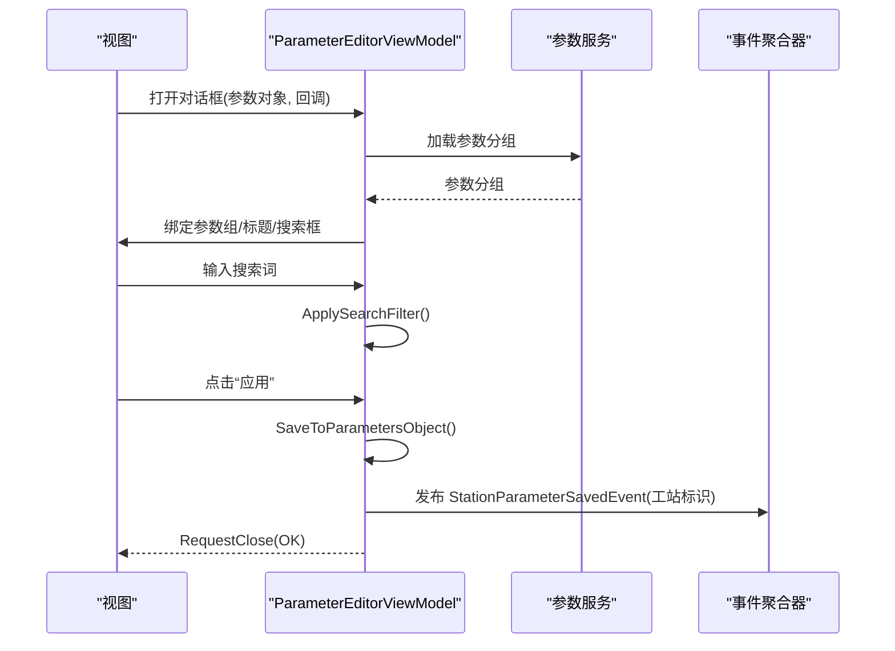
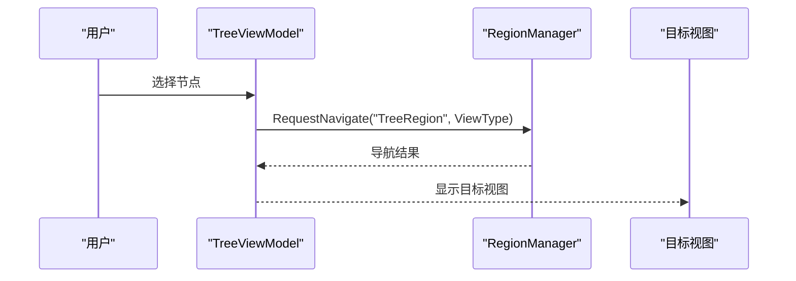
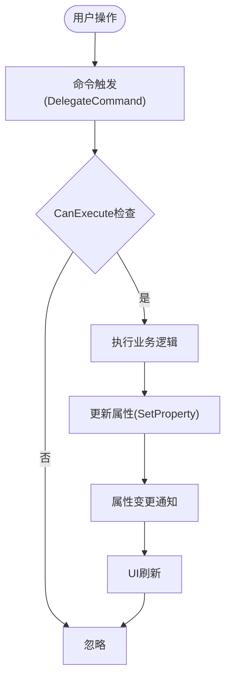
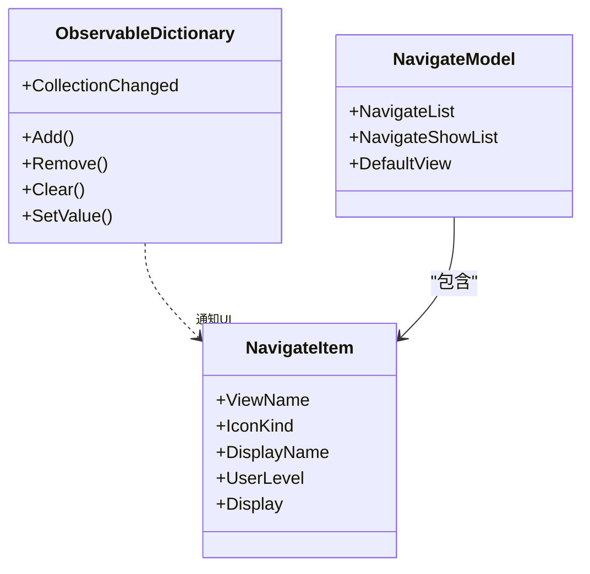
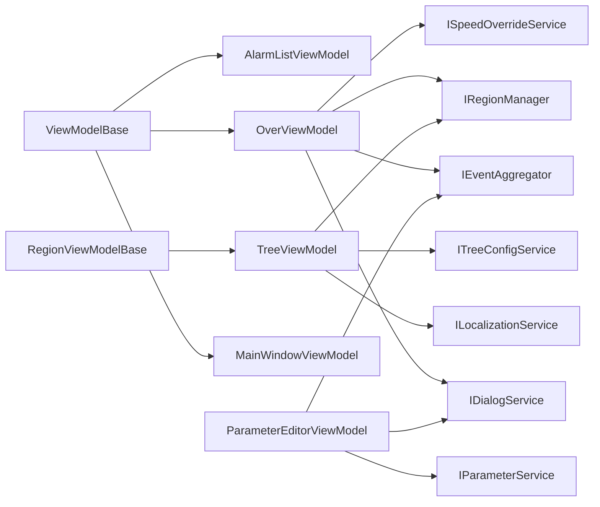

# MVVM架构模式

<cite>
**本文引用的文件**
- [Framework/Mvvm/ViewModelBase.cs](file://Framework/Mvvm/ViewModelBase.cs)
- [Framework/Mvvm/RegionViewModelBase.cs](file://Framework/Mvvm/RegionViewModelBase.cs)
- [Framework/Mvvm/ObservableDictionary.cs](file://Framework/Mvvm/ObservableDictionary.cs)
- [Framework/Mvvm/NavigateItem.cs](file://Framework/Mvvm/NavigateItem.cs)
- [Framework/Mvvm/NavigateModel.cs](file://Framework/Mvvm/NavigateModel.cs)
- [Framework/ViewModels/ParameterEditorViewModel.cs](file://Framework/ViewModels/ParameterEditorViewModel.cs)
- [Core/Abstraction/IParameterEditable.cs](file://Core/Abstraction/IParameterEditable.cs)
- [Core/Abstraction/Parameters/TaskParametersBase.cs](file://Core/Abstraction/Parameters/TaskParametersBase.cs)
- [Core/Abstraction/Parameters/ParameterItems.cs](file://Core/Abstraction/Parameters/ParameterItems.cs)
- [AlarmModule/ViewModels/AlarmListViewModel.cs](file://AlarmModule/ViewModels/AlarmListViewModel.cs)
- [Framework/ViewModels/TreeViewModel.cs](file://Framework/ViewModels/TreeViewModel.cs)
- [Module/ViewModels/OverViewModel.cs](file://Module/ViewModels/OverViewModel.cs)
- [MainApp/ViewModels/MainWindowViewModel.cs](file://MainApp/ViewModels/MainWindowViewModel.cs)
</cite>

## 目录
1. [引言](#引言)
2. [项目结构](#项目结构)
3. [核心组件](#核心组件)
4. [架构总览](#架构总览)
5. [详细组件分析](#详细组件分析)
6. [依赖关系分析](#依赖关系分析)
7. [性能考量](#性能考量)
8. [故障排查指南](#故障排查指南)
9. [结论](#结论)
10. [附录](#附录)

## 引言
本文件系统性阐述GZQL_MACHINE项目中基于Prism的MVVM架构模式实现，重点围绕以下主题展开：
- Model-View-ViewModel模式的实现原理与职责边界
- 数据绑定、命令模式、通知机制的落地方式
- ViewModel基类设计：ViewModelBase提供的属性变更通知、RegionViewModelBase的区域管理、IParameterEditable的参数编辑接口
- 视图模型的职责划分、数据绑定策略、命令绑定机制
- MVVM模式的优势、性能优化建议、调试技巧
- 视图模型设计最佳实践与常见问题解决方案

## 项目结构
GZQL_MACHINE采用模块化分层组织，MVVM相关能力主要分布在Framework与各功能模块的ViewModels目录中：
- Framework层提供通用的MVVM基础设施（基类、导航、参数编辑等）
- Core层提供跨模块抽象（参数模型、编辑接口等）
- AlarmModule、Module、MainApp等模块提供具体业务视图模型

**图表来源**
- [Framework/Mvvm/ViewModelBase.cs:1-16](file://Framework/Mvvm/ViewModelBase.cs#L1-L16)
- [Framework/Mvvm/RegionViewModelBase.cs:1-33](file://Framework/Mvvm/RegionViewModelBase.cs#L1-L33)
- [Framework/ViewModels/ParameterEditorViewModel.cs:1-511](file://Framework/ViewModels/ParameterEditorViewModel.cs#L1-L511)
- [Framework/Mvvm/ObservableDictionary.cs:1-123](file://Framework/Mvvm/ObservableDictionary.cs#L1-L123)
- [Framework/Mvvm/NavigateItem.cs:1-47](file://Framework/Mvvm/NavigateItem.cs#L1-L47)
- [Framework/Mvvm/NavigateModel.cs:1-30](file://Framework/Mvvm/NavigateModel.cs#L1-L30)
- [Core/Abstraction/IParameterEditable.cs:1-16](file://Core/Abstraction/IParameterEditable.cs#L1-L16)
- [Core/Abstraction/Parameters/TaskParametersBase.cs:1-144](file://Core/Abstraction/Parameters/TaskParametersBase.cs#L1-L144)
- [Core/Abstraction/Parameters/ParameterItems.cs:1-374](file://Core/Abstraction/Parameters/ParameterItems.cs#L1-L374)
- [AlarmModule/ViewModels/AlarmListViewModel.cs:1-262](file://AlarmModule/ViewModels/AlarmListViewModel.cs#L1-L262)
- [Framework/ViewModels/TreeViewModel.cs:1-298](file://Framework/ViewModels/TreeViewModel.cs#L1-L298)
- [Module/ViewModels/OverViewModel.cs:1-255](file://Module/ViewModels/OverViewModel.cs#L1-L255)
- [MainApp/ViewModels/MainWindowViewModel.cs:1-20](file://MainApp/ViewModels/MainWindowViewModel.cs#L1-L20)

**章节来源**
- [Framework/Mvvm/ViewModelBase.cs:1-16](file://Framework/Mvvm/ViewModelBase.cs#L1-L16)
- [Framework/Mvvm/RegionViewModelBase.cs:1-33](file://Framework/Mvvm/RegionViewModelBase.cs#L1-L33)
- [Framework/ViewModels/ParameterEditorViewModel.cs:1-511](file://Framework/ViewModels/ParameterEditorViewModel.cs#L1-L511)
- [Core/Abstraction/IParameterEditable.cs:1-16](file://Core/Abstraction/IParameterEditable.cs#L1-L16)
- [Core/Abstraction/Parameters/TaskParametersBase.cs:1-144](file://Core/Abstraction/Parameters/TaskParametersBase.cs#L1-L144)
- [Core/Abstraction/Parameters/ParameterItems.cs:1-374](file://Core/Abstraction/Parameters/ParameterItems.cs#L1-L374)
- [AlarmModule/ViewModels/AlarmListViewModel.cs:1-262](file://AlarmModule/ViewModels/AlarmListViewModel.cs#L1-L262)
- [Framework/ViewModels/TreeViewModel.cs:1-298](file://Framework/ViewModels/TreeViewModel.cs#L1-L298)
- [Module/ViewModels/OverViewModel.cs:1-255](file://Module/ViewModels/OverViewModel.cs#L1-L255)
- [MainApp/ViewModels/MainWindowViewModel.cs:1-20](file://MainApp/ViewModels/MainWindowViewModel.cs#L1-L20)

## 核心组件
本节聚焦MVVM基础设施与关键接口，阐明其职责与协作方式。

- ViewModelBase：提供属性变更通知的基础能力，确保UI能响应数据变化
- RegionViewModelBase：在Prism区域导航场景中提供生命周期钩子（导航目标判定、进入/离开回调、导航请求确认）
- IParameterEditable：定义参数编辑的统一契约（标题、参数对象、标识符）
- TaskParametersBase：参数对象的基类，提供快照、变更通知、验证等能力
- ParameterItems：参数项模型族（字符串、布尔、数值、枚举、颜色、点等），支撑参数编辑UI的数据绑定
- ObservableDictionary：在WPF环境中提供字典级别的集合变更通知，便于参数字典的UI绑定
- NavigateItem/NavigateModel：导航菜单项与导航列表模型，支撑多视图切换

**章节来源**
- [Framework/Mvvm/ViewModelBase.cs:1-16](file://Framework/Mvvm/ViewModelBase.cs#L1-L16)
- [Framework/Mvvm/RegionViewModelBase.cs:1-33](file://Framework/Mvvm/RegionViewModelBase.cs#L1-L33)
- [Core/Abstraction/IParameterEditable.cs:1-16](file://Core/Abstraction/IParameterEditable.cs#L1-L16)
- [Core/Abstraction/Parameters/TaskParametersBase.cs:1-144](file://Core/Abstraction/Parameters/TaskParametersBase.cs#L1-L144)
- [Core/Abstraction/Parameters/ParameterItems.cs:1-374](file://Core/Abstraction/Parameters/ParameterItems.cs#L1-L374)
- [Framework/Mvvm/ObservableDictionary.cs:1-123](file://Framework/Mvvm/ObservableDictionary.cs#L1-L123)
- [Framework/Mvvm/NavigateItem.cs:1-47](file://Framework/Mvvm/NavigateItem.cs#L1-L47)
- [Framework/Mvvm/NavigateModel.cs:1-30](file://Framework/Mvvm/NavigateModel.cs#L1-L30)

## 架构总览
下图展示MVVM在GZQL_MACHINE中的整体交互：视图通过数据绑定与命令与ViewModel交互；ViewModel通过服务与事件驱动业务；Prism负责区域导航与对话框管理；参数编辑通过统一接口与模型族完成。

**图表来源**
- [Framework/ViewModels/TreeViewModel.cs:1-298](file://Framework/ViewModels/TreeViewModel.cs#L1-L298)
- [Module/ViewModels/OverViewModel.cs:1-255](file://Module/ViewModels/OverViewModel.cs#L1-L255)
- [Framework/ViewModels/ParameterEditorViewModel.cs:1-511](file://Framework/ViewModels/ParameterEditorViewModel.cs#L1-L511)

## 详细组件分析

### ViewModel基类体系
- ViewModelBase：继承Prism的BindableBase，提供SetProperty等通知机制，是所有ViewModel的基类
- RegionViewModelBase：在ViewModelBase之上，实现INavigatinoAware与IConfirmNavigationRequest，提供导航生命周期方法，便于在Prism区域中管理视图切换

**图表来源**
- [Framework/Mvvm/ViewModelBase.cs:1-16](file://Framework/Mvvm/ViewModelBase.cs#L1-L16)
- [Framework/Mvvm/RegionViewModelBase.cs:1-33](file://Framework/Mvvm/RegionViewModelBase.cs#L1-L33)

**章节来源**
- [Framework/Mvvm/ViewModelBase.cs:1-16](file://Framework/Mvvm/ViewModelBase.cs#L1-L16)
- [Framework/Mvvm/RegionViewModelBase.cs:1-33](file://Framework/Mvvm/RegionViewModelBase.cs#L1-L33)

### 参数编辑接口与模型
- IParameterEditable：定义参数编辑对话框所需的标题、参数对象与标识符，解耦对话框与具体参数类型
- TaskParametersBase：参数对象基类，提供快照、变更通知、验证等能力，支持序列化与版本管理
- ParameterItems：参数项模型族，覆盖字符串、布尔、数值、枚举、颜色、点等类型，支持默认值、格式化、范围约束、嵌套对象等

**图表来源**
- [Core/Abstraction/IParameterEditable.cs:1-16](file://Core/Abstraction/IParameterEditable.cs#L1-L16)
- [Core/Abstraction/Parameters/TaskParametersBase.cs:1-144](file://Core/Abstraction/Parameters/TaskParametersBase.cs#L1-L144)
- [Core/Abstraction/Parameters/ParameterItems.cs:1-374](file://Core/Abstraction/Parameters/ParameterItems.cs#L1-L374)

**章节来源**
- [Core/Abstraction/IParameterEditable.cs:1-16](file://Core/Abstraction/IParameterEditable.cs#L1-L16)
- [Core/Abstraction/Parameters/TaskParametersBase.cs:1-144](file://Core/Abstraction/Parameters/TaskParametersBase.cs#L1-L144)
- [Core/Abstraction/Parameters/ParameterItems.cs:1-374](file://Core/Abstraction/Parameters/ParameterItems.cs#L1-L374)

### 参数编辑视图模型（ParameterEditorViewModel）
- 职责：加载参数、搜索过滤、应用/重置/取消、保存回调、事件发布、对话框关闭
- 命令：Apply、Cancel、Reset、ClearSearch
- 数据绑定：ObservableCollection<ParameterGroup>、SearchText、IsLoading、IsModified
- 导航/对话框：IDialogAware、OnDialogOpened、RequestClose
- 事件：StationParameterSavedEvent（发布工站参数保存事件）

**图表来源**
- [Framework/ViewModels/ParameterEditorViewModel.cs:1-511](file://Framework/ViewModels/ParameterEditorViewModel.cs#L1-L511)

**章节来源**
- [Framework/ViewModels/ParameterEditorViewModel.cs:1-511](file://Framework/ViewModels/ParameterEditorViewModel.cs#L1-L511)

### 导航与区域管理（TreeViewModel）
- 继承RegionViewModelBase，利用Prism区域进行视图切换
- 节点本地化：根据LocalizationKey与当前语言动态更新显示名称
- 导航：SelectedNode.ViewType -> RegionManager.RequestNavigate
- 语言切换：订阅语言变化事件，批量更新节点DisplayName

**图表来源**
- [Framework/ViewModels/TreeViewModel.cs:1-298](file://Framework/ViewModels/TreeViewModel.cs#L1-L298)
- [Framework/Mvvm/RegionViewModelBase.cs:1-33](file://Framework/Mvvm/RegionViewModelBase.cs#L1-L33)

**章节来源**
- [Framework/ViewModels/TreeViewModel.cs:1-298](file://Framework/ViewModels/TreeViewModel.cs#L1-L298)
- [Framework/Mvvm/RegionViewModelBase.cs:1-33](file://Framework/Mvvm/RegionViewModelBase.cs#L1-L33)

### 命令与数据绑定策略
- 命令模式：使用Prism.DelegateCommand封装业务动作，支持CanExecute与RaiseCanExecuteChanged
- 数据绑定：属性使用SetProperty触发通知；集合使用ObservableCollection；字典使用ObservableDictionary
- 事件驱动：通过IEventAggregator订阅/发布事件，降低模块间耦合
- 导航命令：在RegionViewModelBase基础上扩展导航逻辑

**图表来源**
- [AlarmModule/ViewModels/AlarmListViewModel.cs:1-262](file://AlarmModule/ViewModels/AlarmListViewModel.cs#L1-L262)
- [Module/ViewModels/OverViewModel.cs:1-255](file://Module/ViewModels/OverViewModel.cs#L1-L255)

**章节来源**
- [AlarmModule/ViewModels/AlarmListViewModel.cs:1-262](file://AlarmModule/ViewModels/AlarmListViewModel.cs#L1-L262)
- [Module/ViewModels/OverViewModel.cs:1-255](file://Module/ViewModels/OverViewModel.cs#L1-L255)

### 字典通知与导航模型
- ObservableDictionary：在Add/Remove/Clear等操作后通过Dispatcher在UI线程触发CollectionChanged，保证UI正确刷新
- NavigateItem/NavigateModel：提供导航列表与默认视图配置，支持显示/隐藏与权限级别控制

**图表来源**
- [Framework/Mvvm/ObservableDictionary.cs:1-123](file://Framework/Mvvm/ObservableDictionary.cs#L1-L123)
- [Framework/Mvvm/NavigateItem.cs:1-47](file://Framework/Mvvm/NavigateItem.cs#L1-L47)
- [Framework/Mvvm/NavigateModel.cs:1-30](file://Framework/Mvvm/NavigateModel.cs#L1-L30)

**章节来源**
- [Framework/Mvvm/ObservableDictionary.cs:1-123](file://Framework/Mvvm/ObservableDictionary.cs#L1-L123)
- [Framework/Mvvm/NavigateItem.cs:1-47](file://Framework/Mvvm/NavigateItem.cs#L1-L47)
- [Framework/Mvvm/NavigateModel.cs:1-30](file://Framework/Mvvm/NavigateModel.cs#L1-L30)

## 依赖关系分析
- ViewModelBase/RegionViewModelBase为所有业务ViewModel提供基础能力
- ParameterEditorViewModel依赖IParameterService、IEventAggregator、IDialogService，形成参数编辑闭环
- TreeViewModel依赖ITreeConfigService、IRegionManager、ILocalizationService，实现导航与本地化
- OverViewModel依赖IEventAggregator、IRegionManager、IDialogService、ISpeedOverrideService等，驱动系统状态与控制

**图表来源**
- [Framework/Mvvm/ViewModelBase.cs:1-16](file://Framework/Mvvm/ViewModelBase.cs#L1-L16)
- [Framework/Mvvm/RegionViewModelBase.cs:1-33](file://Framework/Mvvm/RegionViewModelBase.cs#L1-L33)
- [Framework/ViewModels/ParameterEditorViewModel.cs:1-511](file://Framework/ViewModels/ParameterEditorViewModel.cs#L1-L511)
- [Framework/ViewModels/TreeViewModel.cs:1-298](file://Framework/ViewModels/TreeViewModel.cs#L1-L298)
- [Module/ViewModels/OverViewModel.cs:1-255](file://Module/ViewModels/OverViewModel.cs#L1-L255)
- [MainApp/ViewModels/MainWindowViewModel.cs:1-20](file://MainApp/ViewModels/MainWindowViewModel.cs#L1-L20)

**章节来源**
- [Framework/ViewModels/ParameterEditorViewModel.cs:1-511](file://Framework/ViewModels/ParameterEditorViewModel.cs#L1-L511)
- [Framework/ViewModels/TreeViewModel.cs:1-298](file://Framework/ViewModels/TreeViewModel.cs#L1-L298)
- [Module/ViewModels/OverViewModel.cs:1-255](file://Module/ViewModels/OverViewModel.cs#L1-L255)
- [MainApp/ViewModels/MainWindowViewModel.cs:1-20](file://MainApp/ViewModels/MainWindowViewModel.cs#L1-L20)

## 性能考量
- 集合与字典通知：使用ObservableCollection与ObservableDictionary，避免UI线程外直接修改集合导致的异常；在大量更新时考虑批处理或延迟刷新
- 命令可执行状态：合理使用RaiseCanExecuteChanged，避免频繁触发导致的UI抖动
- 事件订阅：在OnNavigatedFrom/销毁阶段移除事件订阅，防止内存泄漏与重复处理
- 导航与对话框：导航失败时及时记录错误信息，避免阻塞UI线程
- 参数编辑：在SaveToParametersObject中进行类型转换与特性过滤，减少无效赋值

[本节为通用指导，无需列出具体文件来源]

## 故障排查指南
- 导航失败：检查RegionManager.RequestNavigate的目标视图名称与注册情况，查看回调中的错误信息
- 参数保存未生效：确认参数对象是否实现了IParameterEditable，保存流程中是否调用OnParametersSaved回调并发布StationParameterSavedEvent
- UI不刷新：检查属性是否使用SetProperty，集合是否使用ObservableCollection/Dictionary，以及是否在UI线程触发通知
- 事件未触发：确认事件订阅是否在UI线程，事件聚合器是否正确发布/订阅

**章节来源**
- [Framework/ViewModels/TreeViewModel.cs:1-298](file://Framework/ViewModels/TreeViewModel.cs#L1-L298)
- [Framework/ViewModels/ParameterEditorViewModel.cs:1-511](file://Framework/ViewModels/ParameterEditorViewModel.cs#L1-L511)
- [Module/ViewModels/OverViewModel.cs:1-255](file://Module/ViewModels/OverViewModel.cs#L1-L255)

## 结论
GZQL_MACHINE通过Prism与自研MVVM基类，构建了清晰的视图模型层次与参数编辑体系。ViewModelBase/RegionViewModelBase提供了稳定的属性变更与导航能力；IParameterEditable与ParameterItems形成了可扩展的参数模型族；ParameterEditorViewModel串联服务、事件与对话框，实现参数编辑的完整闭环。遵循本文的最佳实践与性能建议，可在复杂工业场景中保持MVVM架构的可维护性与可扩展性。

[本节为总结性内容，无需列出具体文件来源]

## 附录
- 主窗体ViewModel：MainWindowViewModel作为顶层容器，承载全局标题等简单属性
- 报警列表ViewModel：AlarmListViewModel演示命令模式与事件驱动的典型用法
- 总览控制ViewModel：OverViewModel展示多服务集成与实时状态驱动的UI刷新

**章节来源**
- [MainApp/ViewModels/MainWindowViewModel.cs:1-20](file://MainApp/ViewModels/MainWindowViewModel.cs#L1-L20)
- [AlarmModule/ViewModels/AlarmListViewModel.cs:1-262](file://AlarmModule/ViewModels/AlarmListViewModel.cs#L1-L262)
- [Module/ViewModels/OverViewModel.cs:1-255](file://Module/ViewModels/OverViewModel.cs#L1-L255)