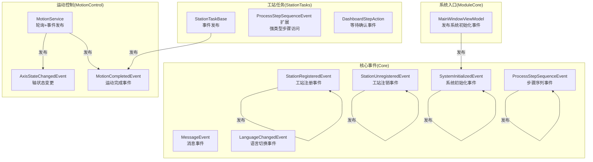
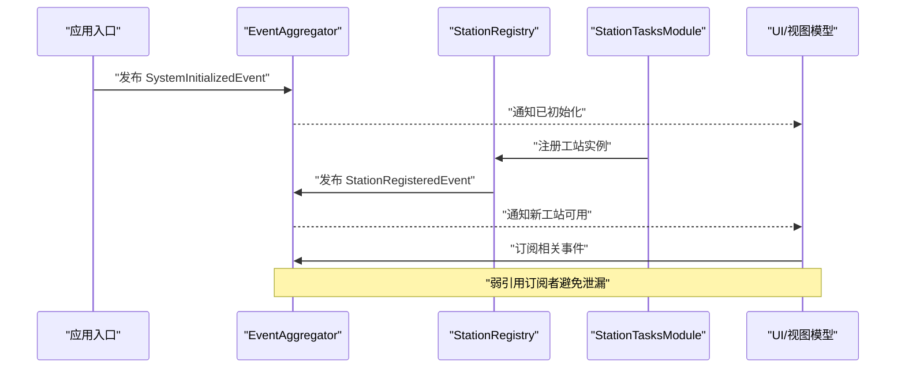
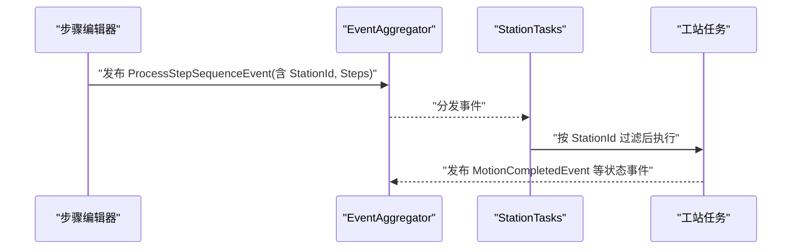
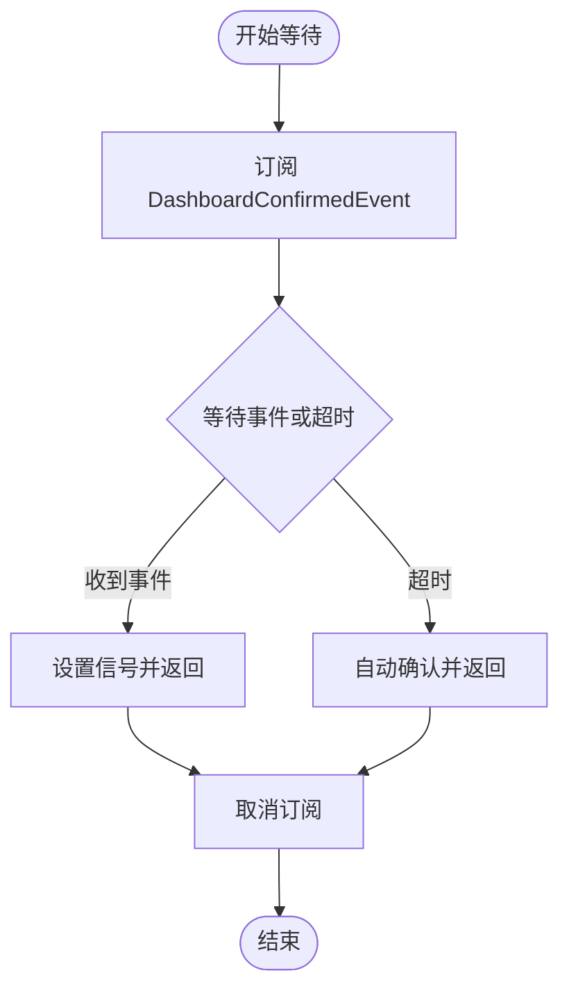
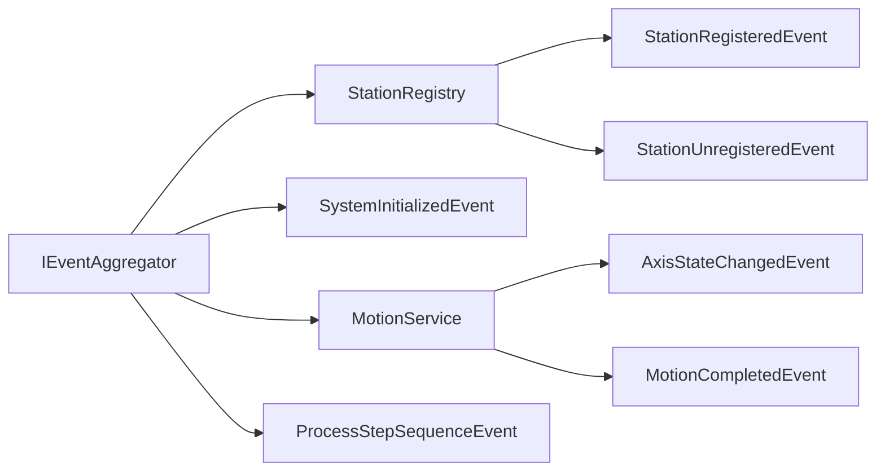

# 事件驱动架构

<cite>
**本文引用的文件**
- [Core\Events\MessageEvent.cs](file://Core/Events/MessageEvent.cs)
- [Core\Events\StationRegisteredEvent.cs](file://Core/Events/StationRegisteredEvent.cs)
- [Core\Events\StationUnregisteredEvent.cs](file://Core/Events/StationUnregisteredEvent.cs)
- [Core\Events\SystemInitializedEvent.cs](file://Core/Events/SystemInitializedEvent.cs)
- [Core\Events\ProcessStepSequenceEvent.cs](file://Core/Events/ProcessStepSequenceEvent.cs)
- [MotionControl\Events\MotionCompletedEvent.cs](file://MotionControl/Events/MotionCompletedEvent.cs)
- [Core\Services\StationRegistry.cs](file://Core/Services/StationRegistry.cs)
- [.trae\rules\summary.md](file://.trae/rules/summary.md)
- [MotionControl\Services\MotionService.cs](file://MotionControl/Services/MotionService.cs)
- [StationTasks\Events\ProcessStepSequenceEvent.cs](file://StationTasks/Events/ProcessStepSequenceEvent.cs)
- [StationTasks\Actions\DashboardStepAction.cs](file://StationTasks/Actions/DashboardStepAction.cs)
- [Core\Events\LanguageChangedEvent.cs](file://Core/Events/LanguageChangedEvent.cs)
- [MotionControl\Services\StationTaskBase.cs](file://MotionControl/Serivces/StationTaskBase.cs)
- [ModuleCore\ViewModels\MainWindowViewModel.cs](file://ModuleCore/ViewModels/MainWindowViewModel.cs)
</cite>

## 目录
1. [简介](#简介)
2. [项目结构](#项目结构)
3. [核心组件](#核心组件)
4. [架构总览](#架构总览)
5. [详细组件分析](#详细组件分析)
6. [依赖关系分析](#依赖关系分析)
7. [性能考量](#性能考量)
8. [故障排除指南](#故障排除指南)
9. [结论](#结论)

## 简介
本文件系统性梳理 GZQL_MACHINE 的事件驱动架构，重点围绕 Prism EventAggregator 的使用，解释事件发布/订阅模式、弱引用事件处理器、线程安全与并发控制，并对消息事件、工站注册事件、系统初始化事件、运动完成事件、步骤序列事件等进行定义与行为说明。同时给出事件过滤、订阅策略、调试技巧与故障排除建议，帮助开发者与维护人员高效理解与扩展该架构。

## 项目结构
事件驱动架构横跨多个模块，核心事件定义集中在 Core\Events，部分业务事件分布在 MotionControl、StationTasks、ModuleCore 等目录；事件总线由 Prism.EventAggregator 提供，容器注入贯穿各模块初始化流程。

图示来源
- [Core\Events\MessageEvent.cs:1-22](file://Core/Events/MessageEvent.cs#L1-L22)
- [Core\Events\StationRegisteredEvent.cs:1-11](file://Core/Events/StationRegisteredEvent.cs#L1-L11)
- [Core\Events\StationUnregisteredEvent.cs:1-11](file://Core/Events/StationUnregisteredEvent.cs#L1-L11)
- [Core\Events\SystemInitializedEvent.cs:1-7](file://Core/Events/SystemInitializedEvent.cs#L1-L7)
- [Core\Events\ProcessStepSequenceEvent.cs:1-53](file://Core/Events/ProcessStepSequenceEvent.cs#L1-L53)
- [MotionControl\Events\MotionCompletedEvent.cs:1-13](file://MotionControl/Events/MotionCompletedEvent.cs#L1-L13)
- [MotionControl\Services\MotionService.cs:36-134](file://MotionControl/Services/MotionService.cs#L36-L134)
- [StationTasks\Events\ProcessStepSequenceEvent.cs:1-23](file://StationTasks/Events/ProcessStepSequenceEvent.cs#L1-L23)
- [StationTasks\Actions\DashboardStepAction.cs:108-133](file://StationTasks/Actions/DashboardStepAction.cs#L108-L133)
- [ModuleCore\ViewModels\MainWindowViewModel.cs:111-111](file://ModuleCore/ViewModels/MainWindowViewModel.cs#L111-L111)

章节来源
- [Core\Events\MessageEvent.cs:1-22](file://Core/Events/MessageEvent.cs#L1-L22)
- [Core\Events\StationRegisteredEvent.cs:1-11](file://Core/Events/StationRegisteredEvent.cs#L1-L11)
- [Core\Events\StationUnregisteredEvent.cs:1-11](file://Core/Events/StationUnregisteredEvent.cs#L1-L11)
- [Core\Events\SystemInitializedEvent.cs:1-7](file://Core/Events/SystemInitializedEvent.cs#L1-L7)
- [Core\Events\ProcessStepSequenceEvent.cs:1-53](file://Core/Events/ProcessStepSequenceEvent.cs#L1-L53)
- [MotionControl\Events\MotionCompletedEvent.cs:1-13](file://MotionControl/Events/MotionCompletedEvent.cs#L1-L13)
- [MotionControl\Services\MotionService.cs:36-134](file://MotionControl/Services/MotionService.cs#L36-L134)
- [StationTasks\Events\ProcessStepSequenceEvent.cs:1-23](file://StationTasks/Events/ProcessStepSequenceEvent.cs#L1-L23)
- [StationTasks\Actions\DashboardStepAction.cs:108-133](file://StationTasks/Actions/DashboardStepAction.cs#L108-L133)
- [ModuleCore\ViewModels\MainWindowViewModel.cs:111-111](file://ModuleCore/ViewModels/MainWindowViewModel.cs#L111-L111)

## 核心组件
- Prism EventAggregator：提供线程安全的事件发布/订阅基础设施，支持弱引用订阅者，避免内存泄漏。
- 事件定义：以 PubSubEvent<T> 或 PubSubEvent 形式定义，承载事件负载或无负载。
- 事件发布者：各模块在合适时机通过 IEventAggregator.GetEvent<T>().Publish(...) 发布事件。
- 事件订阅者：通过 GetEvent<T>().Subscribe(handler) 订阅，注意及时取消订阅以避免泄漏。
- 线程安全：轮询/后台线程中发布事件，确保 UI 线程安全；并发集合用于工站注册表。

章节来源
- [.trae\rules\summary.md:96-132](file://.trae/rules/summary.md#L96-L132)
- [Core\Services\StationRegistry.cs:14-47](file://Core/Services/StationRegistry.cs#L14-L47)
- [MotionControl\Services\MotionService.cs:99-111](file://MotionControl/Services/MotionService.cs#L99-L111)

## 架构总览
事件驱动架构采用“松耦合、高内聚”的设计原则：各模块通过事件总线进行通信，无需直接引用彼此实现；事件类型统一定义于 Core.Events，便于跨模块共享；订阅/发布均通过 IEventAggregator 完成，支持弱引用与线程安全。

图示来源
- [Core\Events\SystemInitializedEvent.cs:1-7](file://Core/Events/SystemInitializedEvent.cs#L1-L7)
- [Core\Events\StationRegisteredEvent.cs:1-11](file://Core/Events/StationRegisteredEvent.cs#L1-L11)
- [Core\Services\StationRegistry.cs:24-29](file://Core/Services/StationRegistry.cs#L24-L29)
- [ModuleCore\ViewModels\MainWindowViewModel.cs:111-111](file://ModuleCore/ViewModels/MainWindowViewModel.cs#L111-L111)

## 详细组件分析

### 事件定义与用途
- 消息事件(MessageEvent)
  - 用途：向系统发布通用消息，包含目标与内容字段，便于 UI 或日志模块消费。
  - 定义位置：[Core\Events\MessageEvent.cs:1-22](file://Core/Events/MessageEvent.cs#L1-L22)
- 工站注册事件(StationRegisteredEvent / StationUnregisteredEvent)
  - 用途：工站自注册/注销时广播，通知其他模块更新内部状态。
  - 定义位置：[Core\Events\StationRegisteredEvent.cs:1-11](file://Core/Events/StationRegisteredEvent.cs#L1-L11)、[Core\Events\StationUnregisteredEvent.cs:1-11](file://Core/Events/StationUnregisteredEvent.cs#L1-L11)
  - 发布位置：[Core\Services\StationRegistry.cs:24-38](file://Core/Services/StationRegistry.cs#L24-L38)
- 系统初始化事件(SystemInitializedEvent)
  - 用途：系统完成初始化后广播，UI/模块可据此启用功能。
  - 定义位置：[Core\Events\SystemInitializedEvent.cs:1-7](file://Core/Events/SystemInitializedEvent.cs#L1-L7)
  - 发布位置：[ModuleCore\ViewModels\MainWindowViewModel.cs:111-111](file://ModuleCore/ViewModels/MainWindowViewModel.cs#L111-L111)
- 运动完成事件(MotionCompletedEvent)
  - 用途：运动控制完成后广播，供上层任务或 UI 更新状态。
  - 定义位置：[MotionControl\Events\MotionCompletedEvent.cs:1-13](file://MotionControl/Events/MotionCompletedEvent.cs#L1-L13)
  - 发布位置：[MotionControl\Services\StationTaskBase.cs:601-601](file://MotionControl/Serivces/StationTaskBase.cs#L601-L601)
- 步骤序列事件(ProcessStepSequenceEvent / ControlEvent)
  - 用途：UI 编辑器发布步骤序列启动/控制事件，工站任务按目标工站执行。
  - 定义位置：[Core\Events\ProcessStepSequenceEvent.cs:1-53](file://Core/Events/ProcessStepSequenceEvent.cs#L1-L53)
  - 强类型扩展：[StationTasks\Events\ProcessStepSequenceEvent.cs:1-23](file://StationTasks/Events/ProcessStepSequenceEvent.cs#L1-L23)
- 语言切换事件(LanguageChangedEvent)
  - 用途：语言变更时发布，包含详细数据对象，支持 UI 与本地化服务响应。
  - 定义位置：[Core\Events\LanguageChangedEvent.cs:1-64](file://Core/Events/LanguageChangedEvent.cs#L1-L64)

章节来源
- [Core\Events\MessageEvent.cs:1-22](file://Core/Events/MessageEvent.cs#L1-L22)
- [Core\Events\StationRegisteredEvent.cs:1-11](file://Core/Events/StationRegisteredEvent.cs#L1-L11)
- [Core\Events\StationUnregisteredEvent.cs:1-11](file://Core/Events/StationUnregisteredEvent.cs#L1-L11)
- [Core\Events\SystemInitializedEvent.cs:1-7](file://Core/Events/SystemInitializedEvent.cs#L1-L7)
- [Core\Events\ProcessStepSequenceEvent.cs:1-53](file://Core/Events/ProcessStepSequenceEvent.cs#L1-L53)
- [MotionControl\Events\MotionCompletedEvent.cs:1-13](file://MotionControl/Events/MotionCompletedEvent.cs#L1-L13)
- [Core\Events\LanguageChangedEvent.cs:1-64](file://Core/Events/LanguageChangedEvent.cs#L1-L64)
- [Core\Services\StationRegistry.cs:24-38](file://Core/Services/StationRegistry.cs#L24-L38)
- [MotionControl\Services\StationTaskBase.cs:601-601](file://MotionControl/Serivces/StationTaskBase.cs#L601-L601)
- [StationTasks\Events\ProcessStepSequenceEvent.cs:1-23](file://StationTasks/Events/ProcessStepSequenceEvent.cs#L1-L23)
- [ModuleCore\ViewModels\MainWindowViewModel.cs:111-111](file://ModuleCore/ViewModels/MainWindowViewModel.cs#L111-L111)

### 发布机制与线程安全
- 发布入口：各服务/视图模型在合适时机调用 IEventAggregator.GetEvent<T>().Publish(...)。
- 线程安全：
  - 轮询线程中发布运动状态事件，避免 UI 线程竞争。
  - 使用快照遍历订阅者列表，捕获异常但不中断广播。
- 示例路径：
  - [MotionControl\Services\MotionService.cs:99-111](file://MotionControl/Services/MotionService.cs#L99-L111)
  - [MotionControl\Services\StationTaskBase.cs:601-601](file://MotionControl/Serivces/StationTaskBase.cs#L601-L601)

章节来源
- [MotionControl\Services\MotionService.cs:99-111](file://MotionControl/Services/MotionService.cs#L99-L111)
- [MotionControl\Services\StationTaskBase.cs:601-601](file://MotionControl/Serivces/StationTaskBase.cs#L601-L601)

### 订阅策略与事件过滤
- 弱引用订阅：Prism 默认使用弱引用订阅者，降低内存泄漏风险。
- 订阅/取消订阅：订阅后应保存 Token，在适当时机调用 Unsubscribe，如等待确认场景。
- 事件过滤：
  - 目标工站过滤：步骤序列事件载荷包含 StationId，订阅者可判断是否处理。
  - 控制动作过滤：步骤序列控制事件包含 SequenceControlAction，订阅者按 Action 分支处理。
- 示例路径：
  - [StationTasks\Actions\DashboardStepAction.cs:108-133](file://StationTasks/Actions/DashboardStepAction.cs#L108-L133)
  - [Core\Events\ProcessStepSequenceEvent.cs:16-51](file://Core/Events/ProcessStepSequenceEvent.cs#L16-L51)

章节来源
- [StationTasks\Actions\DashboardStepAction.cs:108-133](file://StationTasks/Actions/DashboardStepAction.cs#L108-L133)
- [Core\Events\ProcessStepSequenceEvent.cs:16-51](file://Core/Events/ProcessStepSequenceEvent.cs#L16-L51)

### 工站注册与自注册机制
- 注册表：线程安全的并发字典存储工站参数提供者，发布注册/注销事件。
- 自注册：工站任务在构造函数中调用注册表 Register，触发广播。
- 模块初始化：StationTasksModule 强制解析 ITask 单例以触发自注册。
- 示例路径：
  - [Core\Services\StationRegistry.cs:24-38](file://Core/Services/StationRegistry.cs#L24-L38)
  - [.trae\rules\summary.md:122-125](file://.trae/rules/summary.md#L122-L125)

章节来源
- [Core\Services\StationRegistry.cs:24-38](file://Core/Services/StationRegistry.cs#L24-L38)
- [.trae\rules\summary.md:122-125](file://.trae/rules/summary.md#L122-L125)

### 事件序列与典型流程

#### 步骤序列启动流程

图示来源
- [Core\Events\ProcessStepSequenceEvent.cs:1-53](file://Core/Events/ProcessStepSequenceEvent.cs#L1-L53)
- [StationTasks\Events\ProcessStepSequenceEvent.cs:1-23](file://StationTasks/Events/ProcessStepSequenceEvent.cs#L1-L23)
- [MotionControl\Events\MotionCompletedEvent.cs:1-13](file://MotionControl/Events/MotionCompletedEvent.cs#L1-L13)

#### 等待用户确认的同步等待流程

图示来源
- [StationTasks\Actions\DashboardStepAction.cs:108-133](file://StationTasks/Actions/DashboardStepAction.cs#L108-L133)

## 依赖关系分析
- 组件耦合度：低耦合，通过事件总线解耦；事件类型集中定义于 Core.Events。
- 直接依赖：各模块依赖 IEventAggregator；工站注册依赖 IStationRegistry；运动事件依赖 IMotionService。
- 并发与线程：注册表使用并发集合；运动服务在轮询线程中发布事件；订阅者需注意线程安全。

图示来源
- [Core\Services\StationRegistry.cs:14-47](file://Core/Services/StationRegistry.cs#L14-L47)
- [MotionControl\Services\MotionService.cs:36-134](file://MotionControl/Services/MotionService.cs#L36-L134)
- [Core\Events\ProcessStepSequenceEvent.cs:1-53](file://Core/Events/ProcessStepSequenceEvent.cs#L1-L53)

章节来源
- [Core\Services\StationRegistry.cs:14-47](file://Core/Services/StationRegistry.cs#L14-L47)
- [MotionControl\Services\MotionService.cs:36-134](file://MotionControl/Services/MotionService.cs#L36-L134)
- [Core\Events\ProcessStepSequenceEvent.cs:1-53](file://Core/Events/ProcessStepSequenceEvent.cs#L1-L53)

## 性能考量
- 事件发布成本：轻量级，但频繁发布可能带来 UI 刷新压力，建议合并或节流。
- 订阅者数量：过多订阅者会增加广播开销，应按需订阅并及时取消。
- 线程安全：轮询线程发布事件，避免 UI 线程阻塞；订阅者回调应保持轻量。
- 内存泄漏防护：使用弱引用订阅者，及时取消订阅；强类型扩展避免不必要的装箱拆箱。

## 故障排除指南
- 未收到事件
  - 检查事件是否正确发布与订阅；确认事件类型一致。
  - 对于步骤序列事件，检查 StationId 是否匹配。
- 订阅未释放导致内存泄漏
  - 确保在生命周期结束时调用 Unsubscribe；参考等待确认流程中的取消订阅实践。
- UI 不刷新
  - 确认事件在 UI 线程上下文中触发或通过 Dispatcher/事件总线桥接。
- 语言切换无效
  - 检查 LanguageChangedEvent 的发布与订阅链路，确认详细数据是否正确传递。

章节来源
- [StationTasks\Actions\DashboardStepAction.cs:108-133](file://StationTasks/Actions/DashboardStepAction.cs#L108-L133)
- [Core\Events\LanguageChangedEvent.cs:1-64](file://Core/Events/LanguageChangedEvent.cs#L1-L64)

## 结论
GZQL_MACHINE 的事件驱动架构以 Prism EventAggregator 为核心，结合弱引用订阅、线程安全发布与并发集合，实现了模块间的松耦合通信。通过统一的事件定义与清晰的发布/订阅策略，系统具备良好的可扩展性与可维护性。建议在实际开发中遵循订阅/取消订阅规范、合理使用事件过滤与线程安全实践，持续优化事件频率与负载大小，以获得更佳的性能与稳定性。