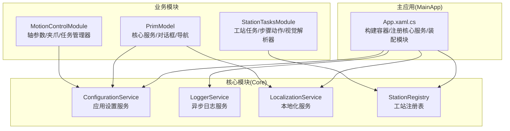
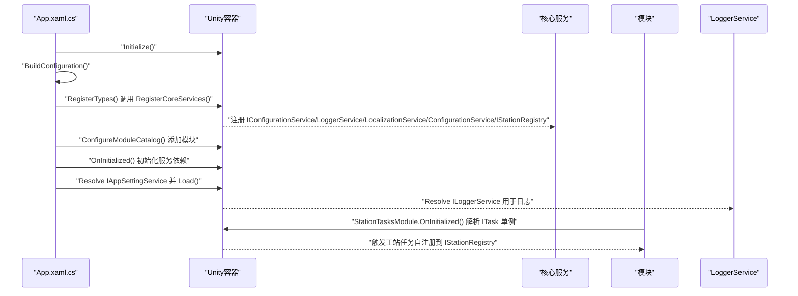
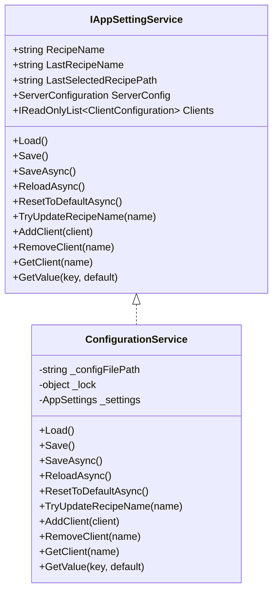
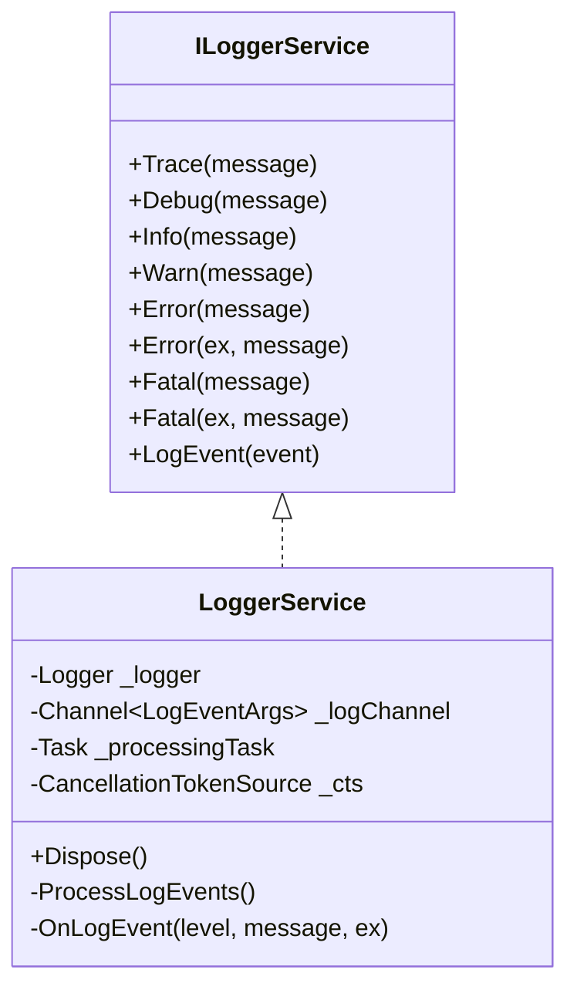
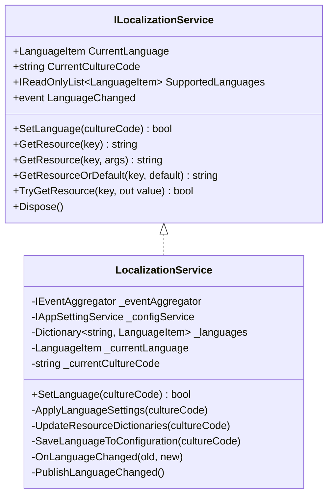
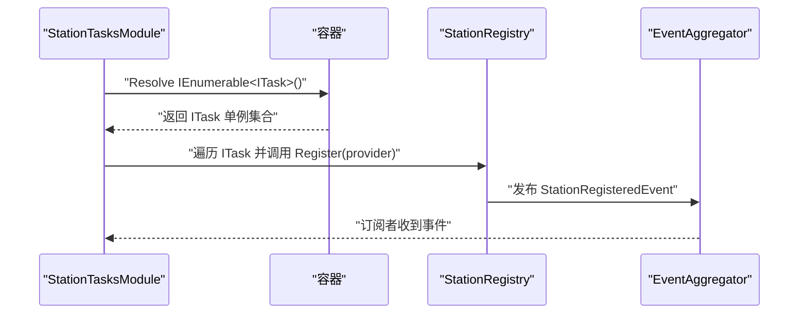
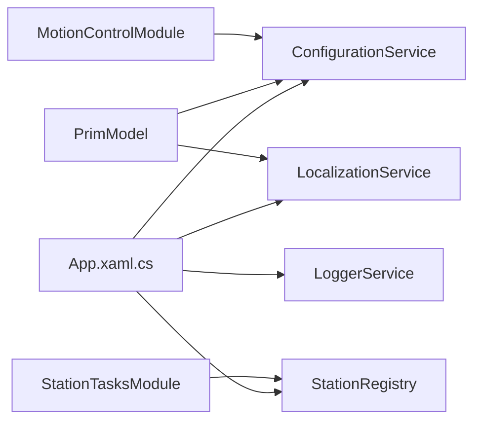

# 依赖注入与服务容器

<cite>
**本文档引用的文件**
- [App.xaml.cs](file://MainApp/App.xaml.cs)
- [StationTasksModule.cs](file://StationTasks/StationTasksModule.cs)
- [ConfigurationService.cs](file://Core/Services/ConfigurationService.cs)
- [LocalizationService.cs](file://Core/Services/LocalizationService.cs)
- [StationRegistry.cs](file://Core/Services/StationRegistry.cs)
- [LoggerService.cs](file://Core/Utilities/LoggerService.cs)
- [PrimModel.cs](file://Module/PrimModel.cs)
- [MotionControlModule.cs](file://MotionControl/MotionControlModule.cs)
</cite>

## 目录
1. [简介](#简介)
2. [项目结构](#项目结构)
3. [核心组件](#核心组件)
4. [架构总览](#架构总览)
5. [详细组件分析](#详细组件分析)
6. [依赖关系分析](#依赖关系分析)
7. [性能考虑](#性能考虑)
8. [故障排除指南](#故障排除指南)
9. [结论](#结论)

## 简介
本文件系统性梳理 GZQL_MACHINE 的依赖注入与服务容器体系，重点围绕 Prism.Unity 容器在主应用中的配置与使用，以及各模块对服务注册、生命周期管理（单例/实例）、构造函数注入的实践。文档覆盖以下核心服务与职责边界：
- 配置服务（ConfigurationService）：应用设置的持久化与加载
- 日志服务（LoggerService）：异步日志通道与事件分发
- 本地化服务（LocalizationService）：多语言资源切换与事件发布
- 工站注册表（StationRegistry）：线程安全的工站参数提供者注册中心

同时，文档阐述服务接口设计原则、单例模式的应用、服务解析机制，并给出循环依赖处理、性能优化策略、最佳实践与常见问题解决方案。

## 项目结构
GZQL_MACHINE 采用 Prism.Modularity + Unity/DryIoc 容器的模块化架构：
- 主应用（MainApp）负责构建容器、注册核心服务、装配模块目录
- 各功能模块（如 StationTasks、Module、MotionControl 等）通过 IModule 接口注册自身服务与视图导航
- 服务注册以“接口 -> 实现”的契约形式进行，生命周期以单例为主，确保跨模块共享与一致性

图表来源
- [App.xaml.cs:110-191](file://MainApp/App.xaml.cs#L110-L191)
- [StationTasksModule.cs:20-50](file://StationTasks/StationTasksModule.cs#L20-L50)
- [PrimModel.cs:75-116](file://Module/PrimModel.cs#L75-L116)
- [MotionControlModule.cs:59-78](file://MotionControl/MotionControlModule.cs#L59-L78)

章节来源
- [App.xaml.cs:110-191](file://MainApp/App.xaml.cs#L110-L191)

## 核心组件
本节聚焦四大核心服务的职责、注册方式与使用场景。

- 配置服务（ConfigurationService）
  - 职责：应用设置的加载、保存、异步重载、扩展键值访问
  - 注册：单例绑定到 IAppSettingService，由主应用在 RegisterCoreServices 中完成
  - 生命周期：单例，跨模块共享；内部使用锁保护文件读写
  - 关键点：首次访问时惰性加载；支持异步保存与重置默认

- 日志服务（LoggerService）
  - 职责：统一日志入口，异步通道写入，事件广播至全局缓存
  - 注册：单例绑定到 ILoggerService
  - 生命周期：单例，后台任务消费通道，有界通道防止内存膨胀
  - 关键点：OnLogEvent 同步写入全局缓存，异步写入通道；异常处理稳健

- 本地化服务（LocalizationService）
  - 职责：维护语言列表、切换区域性、替换资源字典、发布语言变更事件
  - 注册：单例绑定到 ILocalizationService
  - 生命周期：单例；构造函数注入 IEventAggregator 与 IAppSettingService
  - 关键点：切换语言时刷新 LangExtension，发布 Prism 事件，回滚容错

- 工站注册表（StationRegistry）
  - 职责：线程安全注册/注销 IStationParameterProvider，发布注册/卸载事件
  - 注册：单例绑定到 IStationRegistry
  - 生命周期：单例；内部使用并发字典，事件聚合器发布工站事件
  - 关键点：模块初始化阶段强制解析单例工站任务，触发自注册

章节来源
- [App.xaml.cs:121-133](file://MainApp/App.xaml.cs#L121-L133)
- [ConfigurationService.cs:15-220](file://Core/Services/ConfigurationService.cs#L15-L220)
- [LoggerService.cs:5-120](file://Core/Utilities/LoggerService.cs#L5-L120)
- [LocalizationService.cs:18-353](file://Core/Services/LocalizationService.cs#L18-L353)
- [StationRegistry.cs:14-47](file://Core/Services/StationRegistry.cs#L14-L47)
- [StationTasksModule.cs:56-62](file://StationTasks/StationTasksModule.cs#L56-L62)

## 架构总览
下图展示主应用容器初始化、核心服务注册、模块装配与服务解析的关键流程：

图表来源
- [App.xaml.cs:59-72](file://MainApp/App.xaml.cs#L59-L72)
- [App.xaml.cs:110-191](file://MainApp/App.xaml.cs#L110-L191)
- [StationTasksModule.cs:56-62](file://StationTasks/StationTasksModule.cs#L56-L62)

## 详细组件分析

### 配置服务（ConfigurationService）
- 设计要点
  - 接口契约：IAppSettingService，提供 RecipeName、Clients、ServerConfig 等属性
  - 文件策略：Config/appsettings.JSON，不存在则创建默认配置
  - 线程安全：读写加锁，避免并发写入冲突
  - 异步能力：SaveAsync/ReloadAsync/ResetToDefaultAsync，降低 UI 阻塞
- 生命周期与解析
  - 单例注册于主应用，运行期仅一次实例
  - 首次访问 Settings 时惰性加载，后续直接返回内存对象
- 使用建议
  - 对频繁读取的配置项可缓存到局部变量
  - 批量写入建议合并后再 Save()

图表来源
- [ConfigurationService.cs:15-220](file://Core/Services/ConfigurationService.cs#L15-L220)

章节来源
- [ConfigurationService.cs:15-220](file://Core/Services/ConfigurationService.cs#L15-L220)
- [App.xaml.cs:121-133](file://MainApp/App.xaml.cs#L121-L133)

### 日志服务（LoggerService）
- 设计要点
  - 异步通道：有界通道（容量1000），满载丢弃最旧消息，避免内存暴涨
  - 事件驱动：OnLogEvent 同步写入全局缓存，异步写入通道，降低主线程压力
  - 异常健壮：通道消费异常捕获，不影响日志写入链路
- 生命周期与解析
  - 单例注册，应用启动即创建后台处理任务
  - Dispose 优雅停止，等待处理任务结束
- 性能建议
  - 控制日志级别与频率，避免高频 Trace/Debug 压力
  - 大文本日志建议外部落盘或分段输出

图表来源
- [LoggerService.cs:5-120](file://Core/Utilities/LoggerService.cs#L5-L120)

章节来源
- [LoggerService.cs:5-120](file://Core/Utilities/LoggerService.cs#L5-L120)
- [App.xaml.cs:121-133](file://MainApp/App.xaml.cs#L121-L133)

### 本地化服务（LocalizationService）
- 设计要点
  - 语言列表：内置 zh-CN/en-US，支持排序索引
  - 区域性应用：切换时更新线程文化、主窗口语言、资源字典
  - 事件发布：发布 LanguageChangedEvent，供订阅者刷新界面
  - 配置持久化：保存语言到 IAppSettingService.Settings
- 生命周期与解析
  - 单例注册，构造函数注入 IEventAggregator 与 IAppSettingService
  - 初始化时从配置加载语言，否则回退系统语言
- 使用建议
  - 语言切换需在 UI 线程操作资源字典
  - 通过 LangExtension 与 Prism 事件实现解耦刷新

图表来源
- [LocalizationService.cs:18-353](file://Core/Services/LocalizationService.cs#L18-L353)

章节来源
- [LocalizationService.cs:18-353](file://Core/Services/LocalizationService.cs#L18-L353)
- [App.xaml.cs:121-133](file://MainApp/App.xaml.cs#L121-L133)

### 工站注册表（StationRegistry）
- 设计要点
  - 并发安全：ConcurrentDictionary 存储工站标识到 IStationParameterProvider
  - 事件驱动：注册/卸载时发布 StationRegisteredEvent/StationUnregisteredEvent
  - 自注册机制：StationTasksModule 在 OnInitialized 强制解析 ITask 单例，触发工站自注册
- 生命周期与解析
  - 单例注册，构造函数注入 IEventAggregator
  - 模块初始化阶段完成自注册，确保消费者无需关心加载顺序

图表来源
- [StationTasksModule.cs:56-62](file://StationTasks/StationTasksModule.cs#L56-L62)
- [StationRegistry.cs:24-29](file://Core/Services/StationRegistry.cs#L24-L29)

章节来源
- [StationRegistry.cs:14-47](file://Core/Services/StationRegistry.cs#L14-L47)
- [StationTasksModule.cs:56-62](file://StationTasks/StationTasksModule.cs#L56-L62)

### 服务接口设计原则与单例应用
- 接口优先：所有核心服务均以接口暴露，便于替换与测试
- 单例为主：配置、日志、本地化、工站注册表均为单例，确保全局一致
- 构造函数注入：服务间依赖通过构造函数注入，提升可测试性与可维护性
- 模块自治：各模块在 RegisterTypes 中完成自身服务注册，主应用集中装配

章节来源
- [App.xaml.cs:121-133](file://MainApp/App.xaml.cs#L121-L133)
- [PrimModel.cs:75-116](file://Module/PrimModel.cs#L75-L116)
- [MotionControlModule.cs:59-78](file://MotionControl/MotionControlModule.cs#L59-L78)

## 依赖关系分析
- 主应用对核心服务的依赖
  - App.xaml.cs 在 RegisterCoreServices 中集中注册 IConfigurationService、ILoggerService、ILocalizationService、IAppSettingService、IStationRegistry
  - 初始化阶段解析 IAppSettingService 并调用 Load() 完成配置加载
- 模块对核心服务的依赖
  - StationTasksModule 依赖 IStationRegistry 完成工站自注册
  - Module 与 MotionControl 模块依赖 IAppSettingService、ILocalizationService 等实现业务功能
- 事件与解耦
  - LocalizationService 通过 IEventAggregator 发布语言变更事件
  - StationRegistry 通过 IEventAggregator 发布工站注册/卸载事件

图表来源
- [App.xaml.cs:121-133](file://MainApp/App.xaml.cs#L121-L133)
- [StationTasksModule.cs:56-62](file://StationTasks/StationTasksModule.cs#L56-L62)
- [PrimModel.cs:75-116](file://Module/PrimModel.cs#L75-L116)
- [MotionControlModule.cs:59-78](file://MotionControl/MotionControlModule.cs#L59-L78)

章节来源
- [App.xaml.cs:121-133](file://MainApp/App.xaml.cs#L121-L133)
- [StationTasksModule.cs:56-62](file://StationTasks/StationTasksModule.cs#L56-L62)
- [PrimModel.cs:75-116](file://Module/PrimModel.cs#L75-L116)
- [MotionControlModule.cs:59-78](file://MotionControl/MotionControlModule.cs#L59-L78)

## 性能考虑
- 容器初始化
  - 将一次性初始化的服务（如 IConfiguration）注册为单例，避免重复创建
  - 将大型资源（如资源字典）切换在 UI 线程进行，减少跨线程开销
- 日志性能
  - 使用有界通道与丢弃策略，防止高负载时内存溢出
  - 控制高频日志级别，必要时延迟格式化
- 事件风暴
  - 本地化与工站事件发布频率可控，避免过度刷新界面
- 模块装配
  - 按需装配模块，避免不必要的服务解析与初始化

## 故障排除指南
- 配置加载失败
  - 现象：InitializeConfiguration 抛出异常，日志记录错误
  - 处理：检查 Config/appsettings.JSON 是否存在且可读；确认序列化选项与字段匹配
  - 参考路径：[App.xaml.cs:96-108](file://MainApp/App.xaml.cs#L96-L108)，[ConfigurationService.cs:153-175](file://Core/Services/ConfigurationService.cs#L153-L175)

- 日志服务异常
  - 现象：日志通道消费异常被捕获但不影响写入
  - 处理：检查通道容量与消费任务是否正常；避免在事件处理器中抛出异常
  - 参考路径：[LoggerService.cs:78-100](file://Core/Utilities/LoggerService.cs#L78-L100)

- 语言切换无效
  - 现象：切换语言后界面未刷新
  - 处理：确认 LangExtension.InvalidateAll 被调用；检查资源字典替换是否成功
  - 参考路径：[LocalizationService.cs:146-148](file://Core/Services/LocalizationService.cs#L146-L148)，[LocalizationService.cs:218-230](file://Core/Services/LocalizationService.cs#L218-L230)

- 工站未注册
  - 现象：IStationRegistry 查询不到工站
  - 处理：确认 StationTasksModule.OnInitialized 是否被调用；检查 ITask 单例解析数量
  - 参考路径：[StationTasksModule.cs:56-62](file://StationTasks/StationTasksModule.cs#L56-L62)，[StationRegistry.cs:40-44](file://Core/Services/StationRegistry.cs#L40-L44)

## 结论
GZQL_MACHINE 的依赖注入体系以 Prism.Unity 为核心，结合模块化架构实现了清晰的服务边界与生命周期管理。通过接口契约、单例模式与构造函数注入，系统在可维护性、可测试性与性能之间取得平衡。建议在后续演进中：
- 明确各模块的职责边界，避免跨模块强耦合
- 对高频服务（日志、事件）持续监控与容量评估
- 在新增服务时遵循“先接口、后实现、再注册”的流程，确保一致性与可替换性