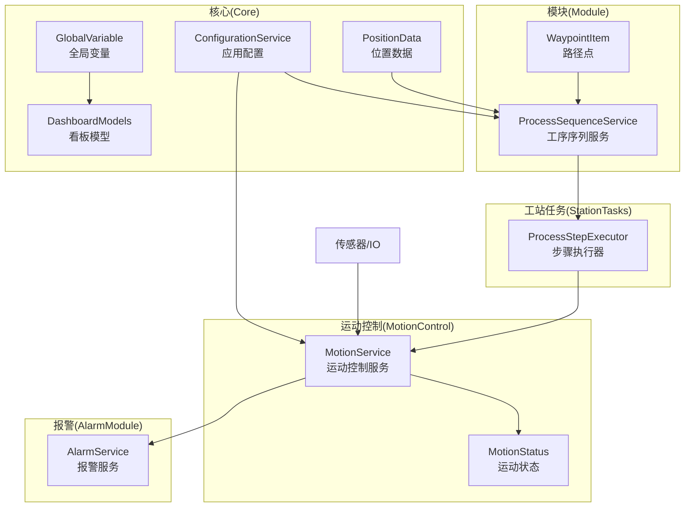
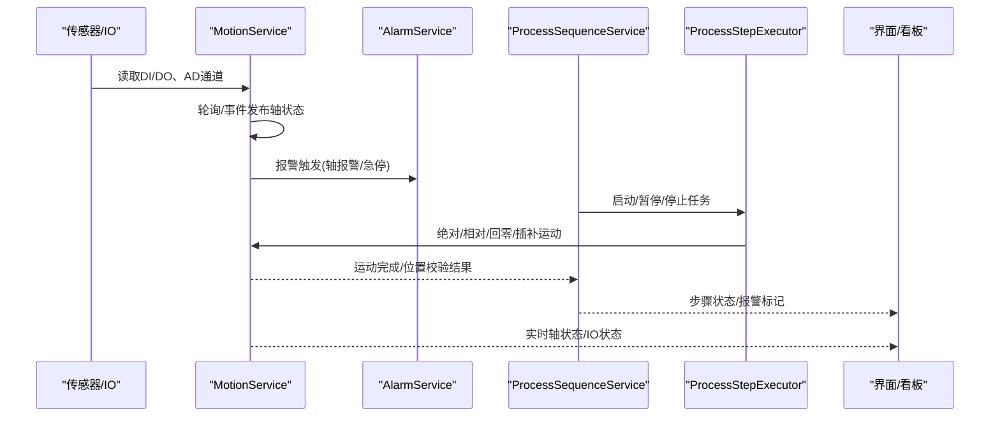
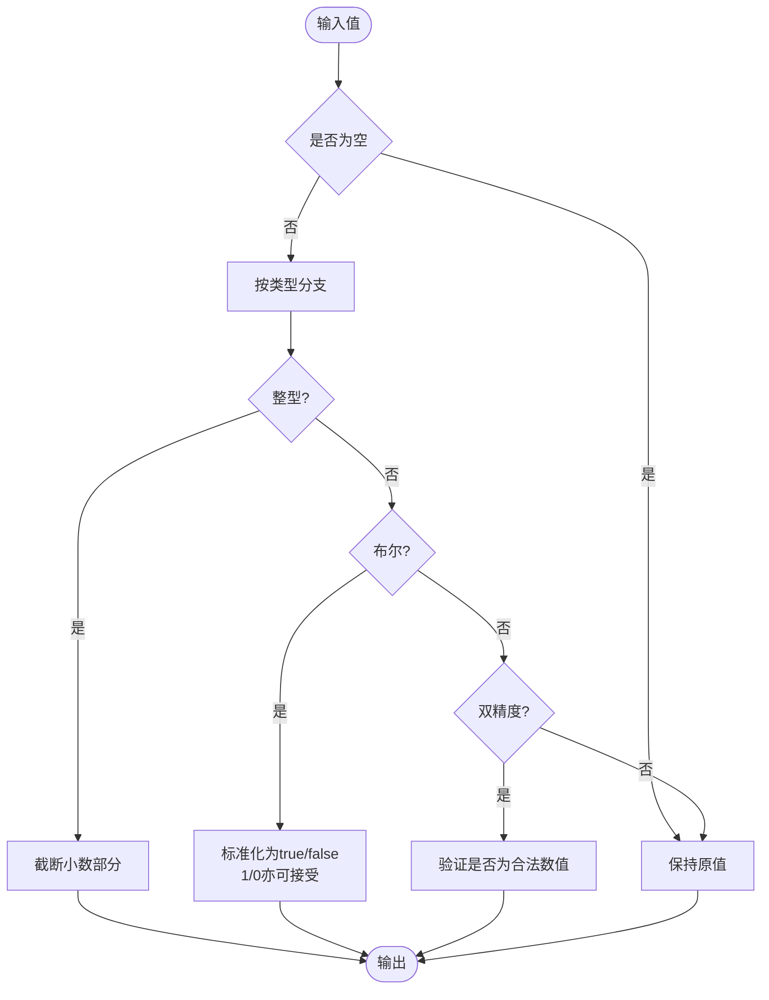
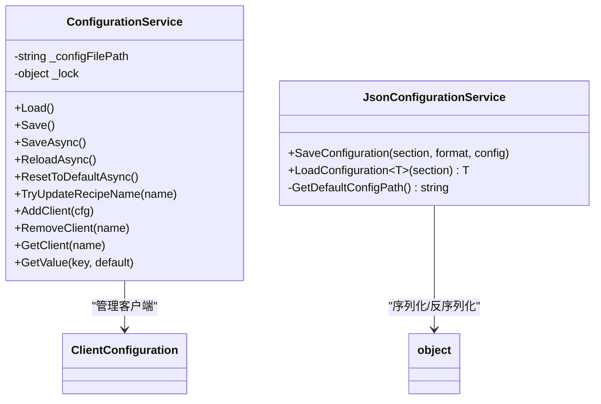
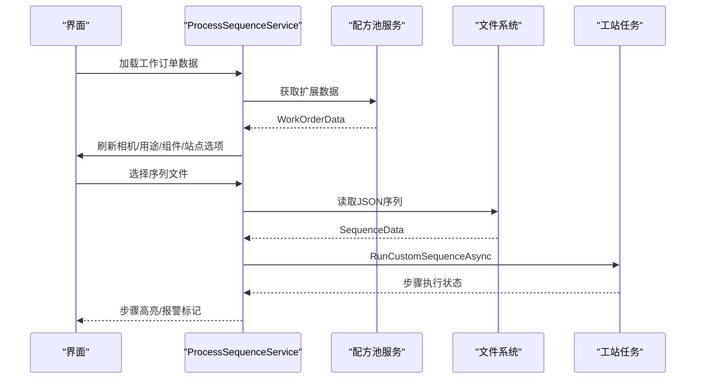
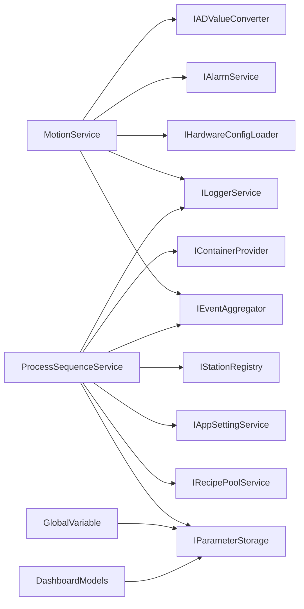

# 数据流架构设计

<cite>
**本文档引用的文件**
- [GlobalVariable.cs](file://Core/Models/GlobalVariable.cs)
- [WaypointItem.cs](file://Module/Models/WaypointItem.cs)
- [MotionStatus.cs](file://MotionControl/Models/MotionStatus.cs)
- [ConfigurationService.cs](file://Core/Services/ConfigurationService.cs)
- [JsonConfigurationService.cs](file://Core/Services/JsonConfigurationService.cs)
- [PositionData.cs](file://Core/Models/PositionData.cs)
- [DashboardModels.cs](file://Core/Models/DashboardModels.cs)
- [MotionService.cs](file://MotionControl/Services/MotionService.cs)
- [ProcessSequenceService.cs](file://Module/Services/ProcessSequenceService.cs)
- [IMotionService.cs](file://MotionControl/Interfaces/IMotionService.cs)
- [ClientConfiguration.cs](file://Core/Models/ClientConfiguration.cs)
- [IParameterService.cs](file://Core/Abstraction/IParameterService.cs)
</cite>

## 目录
1. [引言](#引言)
2. [项目结构](#项目结构)
3. [核心组件](#核心组件)
4. [架构总览](#架构总览)
5. [详细组件分析](#详细组件分析)
6. [依赖关系分析](#依赖关系分析)
7. [性能考虑](#性能考虑)
8. [故障排查指南](#故障排查指南)
9. [结论](#结论)
10. [附录](#附录)

## 引言
本文件面向GZQL_MACHINE系统的数据流架构，围绕“从硬件传感器输入到用户界面显示”的完整链路进行系统化梳理。重点覆盖以下方面：
- 数据模型设计：全局变量、位置数据、运动状态、配置数据等
- 数据转换与验证机制
- 缓存策略与持久化方案
- 数据同步与并发控制
- 数据流优化策略、性能监控与一致性保障

## 项目结构
系统采用模块化分层组织，核心模块包括：
- Core：通用模型与服务（全局变量、配置、看板模型等）
- MotionControl：运动控制与硬件交互（轴状态、IO、模拟量采集等）
- Module：工艺序列与位置数据（工序序列、路径点等）
- AlarmModule：报警记录与通知
- StationTasks：工站任务与步骤执行引擎

**图表来源**
- [ConfigurationService.cs:15-220](file://Core/Services/ConfigurationService.cs#L15-L220)
- [MotionService.cs:26-741](file://MotionControl/Services/MotionService.cs#L26-L741)
- [ProcessSequenceService.cs:23-712](file://Module/Services/ProcessSequenceService.cs#L23-L712)
- [GlobalVariable.cs:14-148](file://Core/Models/GlobalVariable.cs#L14-L148)
- [DashboardModels.cs:9-144](file://Core/Models/DashboardModels.cs#L9-L144)
- [PositionData.cs:6-44](file://Core/Models/PositionData.cs#L6-L44)
- [WaypointItem.cs:5-38](file://Module/Models/WaypointItem.cs#L5-L38)

**章节来源**
- [ConfigurationService.cs:52-69](file://Core/Services/ConfigurationService.cs#L52-L69)
- [MotionService.cs:125-161](file://MotionControl/Services/MotionService.cs#L125-L161)
- [ProcessSequenceService.cs:48-71](file://Module/Services/ProcessSequenceService.cs#L48-L71)

## 核心组件
- 全局变量（GlobalVariable）：统一字符串存储，按类型进行规范化与约束，支持整型、双精度、布尔、字符串及其数组类型，具备类型变更时的默认值与值规范化处理。
- 位置数据（WaypointItem）：描述路径点的多轴位置与停留时间，支持X/Y/U/Z轴启用与目标位置，以及可选的驻留时间。
- 运动状态（MotionStatus）：封装轴状态与IO状态，包含实际位置、命令位置、运动状态、报警与使能等字段。
- 配置数据（ConfigurationService/JsonConfigurationService）：应用配置与JSON配置的读写，支持异步保存、重置默认、扩展数据读取等。

**章节来源**
- [GlobalVariable.cs:14-148](file://Core/Models/GlobalVariable.cs#L14-L148)
- [WaypointItem.cs:5-38](file://Module/Models/WaypointItem.cs#L5-L38)
- [MotionStatus.cs:6-37](file://MotionControl/Models/MotionStatus.cs#L6-L37)
- [ConfigurationService.cs:15-220](file://Core/Services/ConfigurationService.cs#L15-L220)
- [JsonConfigurationService.cs:8-60](file://Core/Services/JsonConfigurationService.cs#L8-L60)

## 架构总览
数据流从硬件传感器输入开始，经由运动控制服务采集与转换，进入工序序列执行引擎，再通过看板与界面展示，同时贯穿配置与参数的持久化与同步。

**图表来源**
- [MotionService.cs:418-579](file://MotionControl/Services/MotionService.cs#L418-L579)
- [ProcessSequenceService.cs:256-318](file://Module/Services/ProcessSequenceService.cs#L256-L318)
- [IMotionService.cs:12-91](file://MotionControl/Interfaces/IMotionService.cs#L12-L91)

## 详细组件分析

### 全局变量（GlobalVariable）数据模型与转换
- 存储与约束：统一以字符串存储，依据类型进行规范化与约束，如整型自动截断小数、布尔值接受true/false与1/0、双精度验证数值合法性。
- 类型变更：当类型变化时，若当前值为空或为旧类型常见默认值，则更新为新类型的默认值；否则对当前值进行规范化处理。
- UI绑定：基于可观察基类，支持MVVM双向绑定与界面刷新。

**图表来源**
- [GlobalVariable.cs:73-109](file://Core/Models/GlobalVariable.cs#L73-L109)

**章节来源**
- [GlobalVariable.cs:47-129](file://Core/Models/GlobalVariable.cs#L47-L129)

### 位置数据（WaypointItem）与路径规划
- 多轴位置：支持X/Y/U/Z轴的启用与目标位置，以及可选的驻留时间，便于点到点运动与停留控制。
- UI展示：与界面控件配合，支持编辑、校验与序列化。

**章节来源**
- [WaypointItem.cs:5-38](file://Module/Models/WaypointItem.cs#L5-L38)

### 运动状态（MotionStatus）与实时监控
- 轴状态：包含轴ID、名称、实际位置、命令位置、运动状态、报警、使能、状态字等。
- IO状态：输入/输出端口的逻辑ID、名称、类型与当前值。
- 事件驱动：通过订阅接口发布轴状态变更事件，替代定时轮询，降低UI线程压力。

**章节来源**
- [MotionStatus.cs:6-37](file://MotionControl/Models/MotionStatus.cs#L6-L37)
- [IMotionService.cs:12-12](file://MotionControl/Interfaces/IMotionService.cs#L12-L12)

### 配置数据（ConfigurationService/JsonConfigurationService）与持久化
- 应用配置：集中管理配方名称、客户端列表、服务器配置等，支持异步加载、保存、重置默认。
- JSON配置：按节（section）保存对象，路径位于应用目录下的Config子目录，支持泛型加载与默认值处理。
- 并发与容错：内部使用锁保护文件读写，异常捕获与默认配置回退。

**图表来源**
- [ConfigurationService.cs:15-220](file://Core/Services/ConfigurationService.cs#L15-L220)
- [JsonConfigurationService.cs:8-60](file://Core/Services/JsonConfigurationService.cs#L8-L60)
- [ClientConfiguration.cs:4-23](file://Core/Models/ClientConfiguration.cs#L4-L23)

**章节来源**
- [ConfigurationService.cs:153-203](file://Core/Services/ConfigurationService.cs#L153-L203)
- [JsonConfigurationService.cs:20-49](file://Core/Services/JsonConfigurationService.cs#L20-L49)

### 工序序列（ProcessSequenceService）与数据同步
- 任务编排：维护任务列表、步骤序列、最近文件列表，支持自动保存/加载、MRU记录与路径持久化。
- 执行控制：通过工站任务宿主异步执行步骤序列，支持启动/暂停/恢复/停止，结合取消令牌实现急停与快速响应。
- 数据联动：配方池扩展数据加载后，联动更新相机/用途/组件/站点等选项，触发UI刷新。

**图表来源**
- [ProcessSequenceService.cs:524-592](file://Module/Services/ProcessSequenceService.cs#L524-L592)
- [ProcessSequenceService.cs:286-318](file://Module/Services/ProcessSequenceService.cs#L286-L318)

**章节来源**
- [ProcessSequenceService.cs:48-71](file://Module/Services/ProcessSequenceService.cs#L48-L71)
- [ProcessSequenceService.cs:486-521](file://Module/Services/ProcessSequenceService.cs#L486-L521)

### 看板数据模型（DashboardModels）与公式求值
- 字段类型：数值型（表达式返回数值）与条件型（表达式返回布尔值），支持格式化显示与条件符号展示。
- 注解元素：文本、直线、矩形等标注元素，支持序列化标识与样式配置。
- 公式求值：通过公式求值器在步骤执行过程中计算字段值与条件结果，驱动看板动态更新。

**章节来源**
- [DashboardModels.cs:9-91](file://Core/Models/DashboardModels.cs#L9-L91)
- [DashboardModels.cs:93-143](file://Core/Models/DashboardModels.cs#L93-L143)

## 依赖关系分析
- 运动控制服务依赖硬件配置加载器、事件聚合器、日志服务、报警服务与AD值转换器，构建轴/IO映射与状态发布。
- 工序序列服务依赖配方池服务、参数存储、应用设置服务、事件聚合器、日志服务与工站注册器，协调步骤执行与UI状态。
- 全局变量与看板模型通过参数服务与配置服务实现参数化与持久化。

**图表来源**
- [MotionService.cs:113-123](file://MotionControl/Services/MotionService.cs#L113-L123)
- [ProcessSequenceService.cs:48-62](file://Module/Services/ProcessSequenceService.cs#L48-L62)
- [IParameterService.cs:8-23](file://Core/Abstraction/IParameterService.cs#L8-L23)

**章节来源**
- [MotionService.cs:113-123](file://MotionControl/Services/MotionService.cs#L113-L123)
- [ProcessSequenceService.cs:48-62](file://Module/Services/ProcessSequenceService.cs#L48-L62)
- [IParameterService.cs:8-23](file://Core/Abstraction/IParameterService.cs#L8-L23)

## 性能考虑
- 轮询与事件驱动：运动控制采用高精度轮询线程与事件驱动发布，减少UI线程阻塞；关键报警快速检查，避免频繁位置读取。
- 自旋等待与取消令牌：运动完成等待采用SpinWait与取消令牌，实现微秒级急停响应与低CPU占用。
- 并行与批处理：模拟量通道批量读取与转换，利用并行遍历与锁保护，提升吞吐。
- 异步I/O与文件操作：配置与序列文件操作均采用异步方法，避免阻塞主线程。

**章节来源**
- [MotionService.cs:418-468](file://MotionControl/Services/MotionService.cs#L418-L468)
- [MotionService.cs:332-354](file://MotionControl/Services/MotionService.cs#L332-L354)
- [MotionService.cs:629-643](file://MotionControl/Services/MotionService.cs#L629-L643)

## 故障排查指南
- 配置加载失败：检查配置文件是否存在与JSON格式正确；服务会在异常时创建默认配置并保存。
- 运动未到位：关注位置校验阈值与报警状态，必要时复位后重试；检查限位、原点传感器与机械卡死。
- 序列执行异常：查看最近文件列表与上次保存路径，确认文件存在；检查步骤序号映射与条件表达式引用。
- 报警记录：轴报警触发时，报警模块会记录并上报，检查硬件连接与回零流程。

**章节来源**
- [ConfigurationService.cs:153-175](file://Core/Services/ConfigurationService.cs#L153-L175)
- [MotionService.cs:346-353](file://MotionControl/Services/MotionService.cs#L346-L353)
- [ProcessSequenceService.cs:566-581](file://Module/Services/ProcessSequenceService.cs#L566-L581)

## 结论
本架构以事件驱动与异步I/O为核心，结合严格的类型约束与数据验证，实现了从硬件传感器到用户界面的高效、稳定数据流。通过配置与参数的持久化、并发控制与性能优化，系统在复杂运动控制场景下仍能保持良好的实时性与一致性。

## 附录
- 数据模型概览
  - 全局变量：统一字符串存储与类型规范化
  - 位置数据：路径点与多轴位置
  - 运动状态：轴与IO状态
  - 配置数据：应用配置与JSON节配置
  - 看板模型：数值/条件字段与注解元素

**章节来源**
- [GlobalVariable.cs:14-148](file://Core/Models/GlobalVariable.cs#L14-L148)
- [PositionData.cs:6-44](file://Core/Models/PositionData.cs#L6-L44)
- [MotionStatus.cs:6-37](file://MotionControl/Models/MotionStatus.cs#L6-L37)
- [ConfigurationService.cs:15-220](file://Core/Services/ConfigurationService.cs#L15-L220)
- [DashboardModels.cs:9-144](file://Core/Models/DashboardModels.cs#L9-L144)