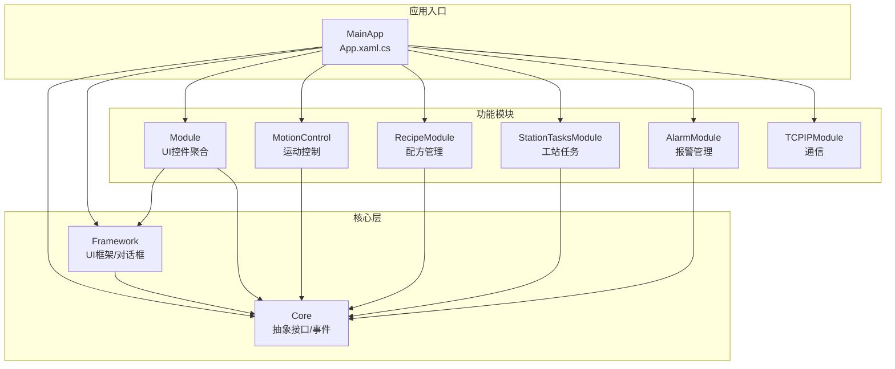
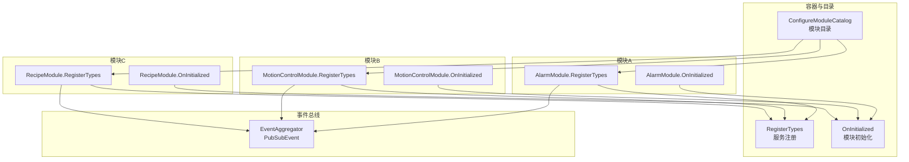
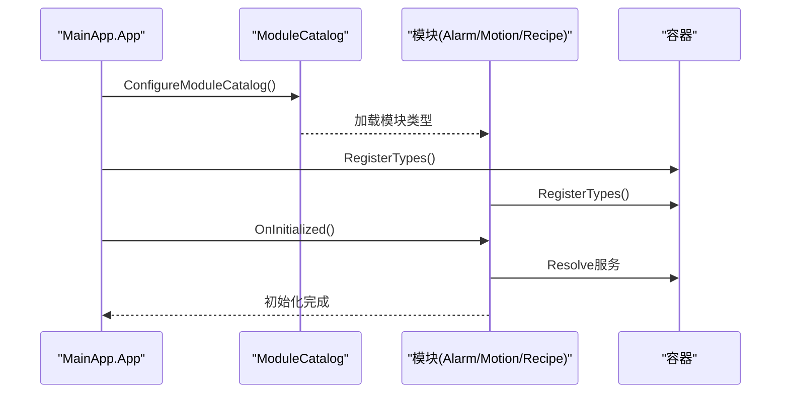
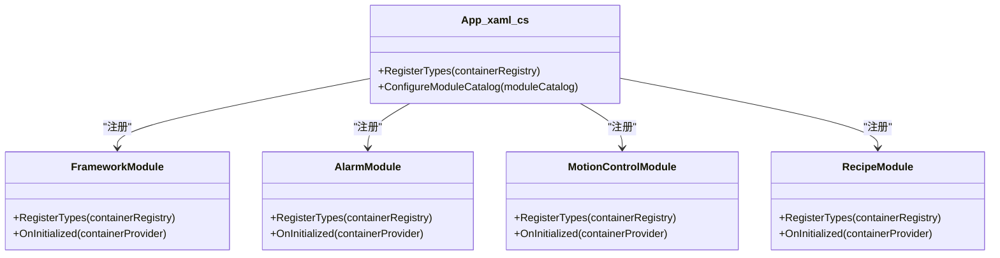
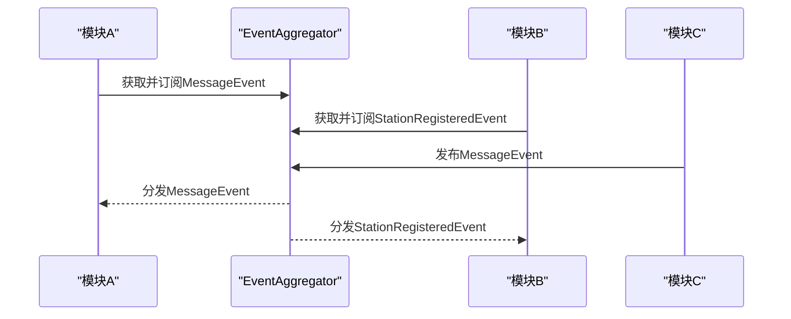
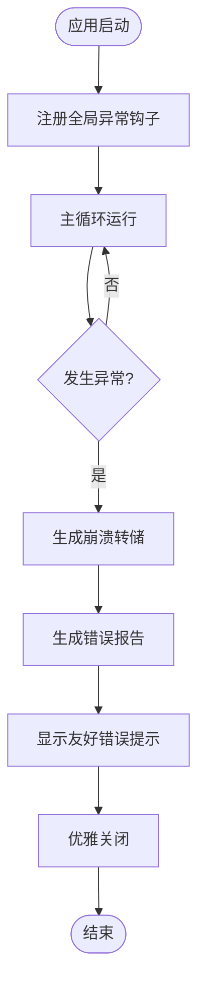
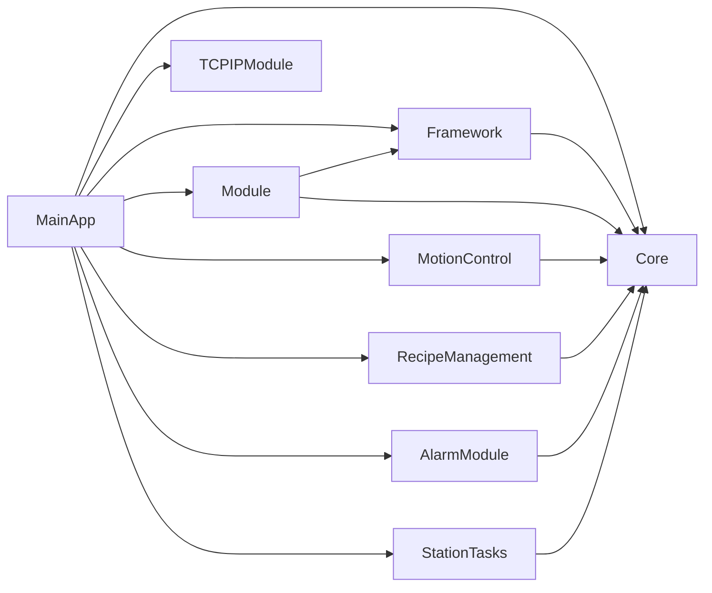

# Prism框架实现原理

<cite>
**本文档引用的文件**
- [AlarmModule.cs](file://AlarmModule/AlarmModule.cs)
- [AlarmModule.csproj](file://AlarmModule/AlarmModule.csproj)
- [FrameworkModule.cs](file://Framework/FrameworkModule.cs)
- [MotionControlModule.cs](file://MotionControl/MotionControlModule.cs)
- [RecipeModule.cs](file://RecipeManagement/RecipeModule.cs)
- [StationTasksModule.cs](file://StationTasks/StationTasksModule.cs)
- [PrimModel.cs](file://Module/PrimModel.cs)
- [App.xaml.cs](file://MainApp/App.xaml.cs)
- [MessageEvent.cs](file://Core/Events/MessageEvent.cs)
- [StationRegisteredEvent.cs](file://Core/Events/StationRegisteredEvent.cs)
- [summary.md](file://.trae/rules/summary.md)
- [MainApp.csproj](file://MainApp/MainApp.csproj)
</cite>

## 目录
1. [引言](#引言)
2. [项目结构](#项目结构)
3. [核心组件](#核心组件)
4. [架构概览](#架构概览)
5. [详细组件分析](#详细组件分析)
6. [依赖关系分析](#依赖关系分析)
7. [性能考虑](#性能考虑)
8. [故障排除指南](#故障排除指南)
9. [结论](#结论)
10. [附录](#附录)

## 引言
本文件面向GZQL_MACHINE项目中的Prism模块化框架实现，系统性阐述Prism在该工业控制系统中的应用方式与最佳实践。内容涵盖模块注册机制、容器管理与依赖注入、模块生命周期管理、服务注册与解析、事件聚合器（EventAggregator）跨模块通信、模块加载顺序控制、异常处理策略，以及性能优化与最佳实践建议。文档同时提供可视化图表帮助理解模块间交互与数据流。

## 项目结构
GZQL_MACHINE采用分层架构与模块化组织，Prism作为核心框架贯穿应用层与各功能模块。MainApp作为WPF入口，负责全局容器初始化、模块目录配置与异常处理；各功能模块（如AlarmModule、MotionControl、RecipeManagement等）通过实现IModule接口参与注册与初始化；Core提供抽象接口与通用事件；Framework提供UI框架与对话框服务；Module为核心UI控件与视图的聚合层。

**图表来源**
- [App.xaml.cs:179-191](file://MainApp/App.xaml.cs#L179-L191)
- [summary.md:18-47](file://.trae/rules/summary.md#L18-L47)

**章节来源**
- [App.xaml.cs:179-191](file://MainApp/App.xaml.cs#L179-L191)
- [summary.md:18-47](file://.trae/rules/summary.md#L18-L47)

## 核心组件
- 模块化框架：基于Prism 8.1（Unity/DryIoc容器），通过IModule接口实现模块注册与生命周期管理。
- 容器与依赖注入：在App.xaml.cs中进行顶层服务注册，在各模块中进行领域服务注册；支持Singleton、Transient、Instance等多种作用域。
- 事件聚合器：使用Prism.Events.PubSubEvent实现跨模块松耦合通信，典型事件包括MessageEvent、StationRegisteredEvent等。
- 模块目录与加载顺序：在ConfigureModuleCatalog中集中声明模块，遵循预定义顺序以满足依赖与初始化约束。
- 异常处理：全局Dispatcher、AppDomain与TaskScheduler异常捕获，结合NLog记录与友好提示。

**章节来源**
- [App.xaml.cs:110-119](file://MainApp/App.xaml.cs#L110-L119)
- [FrameworkModule.cs:31-55](file://Framework/FrameworkModule.cs#L31-L55)
- [summary.md:96-121](file://.trae/rules/summary.md#L96-L121)

## 架构概览
下图展示Prism在GZQL_MACHINE中的整体架构：MainApp负责容器与模块目录配置；各模块在RegisterTypes阶段注册服务与视图，在OnInitialized阶段执行初始化逻辑；事件聚合器支撑跨模块通信。

**图表来源**
- [App.xaml.cs:179-191](file://MainApp/App.xaml.cs#L179-L191)
- [AlarmModule.cs:21-56](file://AlarmModule/AlarmModule.cs#L21-L56)
- [MotionControlModule.cs:23-38](file://MotionControl/MotionControlModule.cs#L23-L38)
- [RecipeModule.cs:24-48](file://RecipeManagement/RecipeModule.cs#L24-L48)

## 详细组件分析

### 模块注册与生命周期管理
- 模块注册：在App.xaml.cs的RegisterTypes中注册核心服务；在各模块的RegisterTypes中注册领域服务与视图导航。
- 生命周期：OnInitialized阶段执行模块特定初始化（如AlarmModule确保数据库表结构创建，MotionControlModule初始化运动/夹爪/状态监控）。
- 作用域策略：大量使用Singleton（如IStationRegistry、IMotionService、IRecipePoolService等），部分服务使用Transient或Instance。

**图表来源**
- [App.xaml.cs:179-191](file://MainApp/App.xaml.cs#L179-L191)
- [AlarmModule.cs:21-56](file://AlarmModule/AlarmModule.cs#L21-L56)
- [MotionControlModule.cs:23-38](file://MotionControl/MotionControlModule.cs#L23-L38)
- [RecipeModule.cs:24-48](file://RecipeManagement/RecipeModule.cs#L24-L48)

**章节来源**
- [App.xaml.cs:110-119](file://MainApp/App.xaml.cs#L110-L119)
- [AlarmModule.cs:21-56](file://AlarmModule/AlarmModule.cs#L21-L56)
- [MotionControlModule.cs:23-38](file://MotionControl/MotionControlModule.cs#L23-L38)
- [RecipeModule.cs:24-48](file://RecipeManagement/RecipeModule.cs#L24-L48)

### 容器管理与依赖注入
- 顶层注册：MainApp在RegisterTypes中注册ILogger、IConfigurationService、ILoggerService、ILocalizationService、IAppSettingService、IStationRegistry等。
- 模块注册：各模块注册自身服务与视图，如FrameworkModule注册参数编辑与对话框服务，AlarmModule注册AlarmDbContext与仓储服务，MotionControlModule注册运动与夹爪服务，RecipeModule注册配方存储与对话框服务。
- 容器选择：MainApp.csproj同时引用Prism.DryIoc与Prism.Unity，实际使用由具体模块决定；例如AlarmModule.csproj使用Prism.DryIoc，StationTasksModule显式使用DryIoc容器。

**图表来源**
- [App.xaml.cs:110-191](file://MainApp/App.xaml.cs#L110-L191)
- [FrameworkModule.cs:31-55](file://Framework/FrameworkModule.cs#L31-L55)
- [AlarmModule.cs:21-56](file://AlarmModule/AlarmModule.cs#L21-L56)
- [MotionControlModule.cs:15-38](file://MotionControl/MotionControlModule.cs#L15-L38)
- [RecipeModule.cs:24-48](file://RecipeManagement/RecipeModule.cs#L24-L48)

**章节来源**
- [App.xaml.cs:121-133](file://MainApp/App.xaml.cs#L121-L133)
- [FrameworkModule.cs:31-55](file://Framework/FrameworkModule.cs#L31-L55)
- [AlarmModule.cs:21-56](file://AlarmModule/AlarmModule.cs#L21-L56)
- [MotionControlModule.cs:15-38](file://MotionControl/MotionControlModule.cs#L15-L38)
- [RecipeModule.cs:24-48](file://RecipeManagement/RecipeModule.cs#L24-L48)

### 事件聚合器（EventAggregator）机制
- 事件定义：Core.Events中定义了MessageEvent、StationRegisteredEvent等事件载体，基于PubSubEvent实现发布/订阅。
- 跨模块通信：模块通过IEventAggregator获取事件，发布事件用于模块间解耦通信；例如工站注册后通过StationRegisteredEvent通知其他模块。
- 订阅与发布：模块在RegisterTypes或OnInitialized中获取事件并订阅，发布时通过事件聚合器广播。

**图表来源**
- [MessageEvent.cs:5-21](file://Core/Events/MessageEvent.cs#L5-L21)
- [StationRegisteredEvent.cs](file://Core/Events/StationRegisteredEvent.cs#L9)
- [FrameworkModule.cs:19-29](file://Framework/FrameworkModule.cs#L19-L29)

**章节来源**
- [MessageEvent.cs:5-21](file://Core/Events/MessageEvent.cs#L5-L21)
- [StationRegisteredEvent.cs](file://Core/Events/StationRegisteredEvent.cs#L9)
- [FrameworkModule.cs:19-29](file://Framework/FrameworkModule.cs#L19-L29)

### 模块加载顺序控制
根据summary.md，模块加载顺序如下：
1. LogViewerModule
2. LanguageModule
3. FrameworkModule
4. AlarmModule
5. MotionControlModule（初始化运动服务、夹爪、状态监控）
6. RecipeModule
7. StationTasksModule（解析ITask单例，触发工站自注册）
8. CoreModule（ModuleCore - 登录/权限/导航）
9. PrimModel（Module - UI控件）
10. TCPIPModule（异步初始化TCP连接）

该顺序确保依赖先行、关键服务先就绪、UI控件最后可用。

**章节来源**
- [summary.md:96-107](file://.trae/rules/summary.md#L96-L107)
- [App.xaml.cs:179-191](file://MainApp/App.xaml.cs#L179-L191)

### 异常处理策略
- 全局异常捕获：在App.xaml.cs中注册DispatcherUnhandledException、CurrentDomain.UnhandledException、TaskScheduler.UnobservedTaskException，统一记录日志并生成错误报告。
- 崩溃转储：生成MiniDump文件便于问题定位。
- 友好提示：在异常发生时弹出提示并优雅关闭。

**图表来源**
- [App.xaml.cs:210-455](file://MainApp/App.xaml.cs#L210-L455)

**章节来源**
- [App.xaml.cs:210-455](file://MainApp/App.xaml.cs#L210-L455)

### 模块化实现示例

#### AlarmModule（报警管理）
- 服务注册：DbContextOptions（SQLite）、IAlarmRepository、IAlarmService、IAlarmNotificationService。
- 视图注册：RegisterForNavigation用于导航到AlarmListView、AlarmHistoryView、AlarmThresholdView、AlarmStatsView。
- 初始化：EnsureCreated确保数据库表存在。

**章节来源**
- [AlarmModule.cs:21-56](file://AlarmModule/AlarmModule.cs#L21-L56)
- [AlarmModule.csproj:10-15](file://AlarmModule/AlarmModule.csproj#L10-L15)

#### FrameworkModule（UI框架）
- 服务注册：IParameterEditor、IParameterStorage、IParameterDialogService、IParameterService、ITreeConfigService、ICancelableOperationService等。
- 视图注册：ParameterEditor、BusyIndicator等。
- 对话框注册：RecipeSelectionDialog、CancelableOperationDialog、MessageDialog、NotificationDialog等。

**章节来源**
- [FrameworkModule.cs:31-55](file://Framework/FrameworkModule.cs#L31-L55)

#### MotionControlModule（运动控制）
- 服务注册：IMotionService、IGripperService、ITaskManager、IAxisParameterService等。
- 初始化：解析并初始化IMotionService、IGripperService、ISystemStateService，启动轮询与状态监控。

**章节来源**
- [MotionControlModule.cs:15-78](file://MotionControl/MotionControlModule.cs#L15-L78)

#### RecipeModule（配方管理）
- 服务注册：IPluginManager、IPlugin、IPluginConfiguration、IGenericStorage、IRecipeStorage、IRecipePoolService、IRecipeDialogService。
- 视图注册：RecipeManager、MultiStationPositionEditor等。
- 对话框注册：RecipeEditorDialog。

**章节来源**
- [RecipeModule.cs:24-48](file://RecipeManagement/RecipeModule.cs#L24-L48)

#### StationTasksModule（工站任务）
- 服务注册：通过DryIoc RegisterMany批量注册ITask实现（LoadingTask、DispensingTask、AssemblyTask）及IProcessStepAction实现。
- 初始化：强制解析ITask集合，触发各工站任务自注册到IStationRegistry。

**章节来源**
- [StationTasksModule.cs:20-63](file://StationTasks/StationTasksModule.cs#L20-L63)

#### Module（UI控件聚合）
- 视图/视图模型注册：大量RegisterForNavigation与Register调用，覆盖装配、点位编辑、视觉检测、路径配置等场景。
- 服务注册：IAxisConfigurationService、Core服务（公式求值、DXF解析、ROI工具、坐标对齐）等。

**章节来源**
- [PrimModel.cs:59-105](file://Module/PrimModel.cs#L59-L105)

## 依赖关系分析
- 模块依赖：MainApp依赖所有模块；Framework与ModuleCore依赖Core；Module依赖Framework；MotionControl、StationTasks、RecipeManagement、TCPIPModule依赖Core；AlarmModule依赖Core与EF Core。
- 容器依赖：MainApp.csproj同时引用Prism.DryIoc与Prism.Unity；AlarmModule.csproj明确使用Prism.DryIoc；StationTasksModule显式使用DryIoc容器。

**图表来源**
- [MainApp.csproj:23-39](file://MainApp/MainApp.csproj#L23-L39)
- [AlarmModule.csproj:10-15](file://AlarmModule/AlarmModule.csproj#L10-L15)
- [summary.md:18-47](file://.trae/rules/summary.md#L18-L47)

**章节来源**
- [MainApp.csproj:23-39](file://MainApp/MainApp.csproj#L23-L39)
- [AlarmModule.csproj:10-15](file://AlarmModule/AlarmModule.csproj#L10-L15)
- [summary.md:18-47](file://.trae/rules/summary.md#L18-L47)

## 性能考虑
- 单例优先：大量使用Singleton减少对象创建开销，如IStationRegistry、IMotionService、IRecipePoolService等。
- 作用域选择：对瞬态对象（Transient）与实例（Instance）谨慎使用，避免不必要的内存占用。
- 初始化顺序：通过预定义加载顺序确保关键服务尽早可用，降低首屏等待时间。
- 事件订阅：避免过度订阅与未取消订阅导致的内存泄漏，确保在适当生命周期内释放订阅。
- 异步初始化：模块初始化尽量采用异步方式，避免阻塞UI线程。

## 故障排除指南
- 模块未加载：检查ConfigureModuleCatalog是否正确添加模块类型。
- 服务解析失败：确认RegisterTypes中已注册对应服务，作用域匹配。
- 事件未收到：确认事件已通过IEventAggregator获取并订阅，发布方与订阅方在同一进程内。
- 数据库初始化失败：检查AlarmModule.OnInitialized中的EnsureCreated逻辑与数据库路径。
- 异常崩溃：查看NLog日志与崩溃转储文件，结合错误报告定位问题。

**章节来源**
- [App.xaml.cs:210-455](file://MainApp/App.xaml.cs#L210-L455)
- [AlarmModule.cs:51-56](file://AlarmModule/AlarmModule.cs#L51-L56)

## 结论
GZQL_MACHINE通过Prism实现了高度模块化的WPF应用架构，结合DryIoc/Unity容器与事件聚合器，有效解耦了各功能模块。通过严格的模块注册、生命周期管理与异常处理策略，系统在工业控制场景中具备良好的稳定性与可维护性。建议持续完善事件订阅的生命周期管理与模块加载顺序的可配置化，进一步提升系统的可扩展性与可观测性。

## 附录
- 模块加载顺序参考：见“模块加载顺序控制”章节。
- 事件清单参考：见“事件聚合器（EventAggregator）机制”章节。
- 项目依赖参考：见“依赖关系分析”章节。