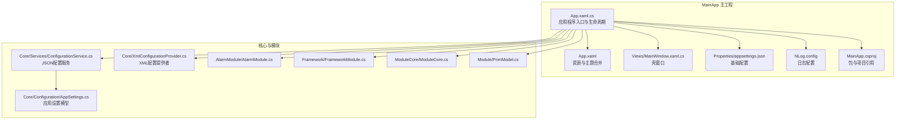
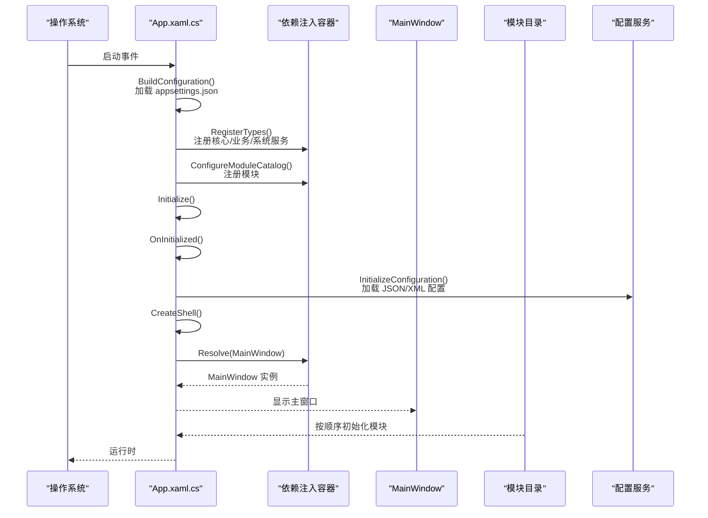
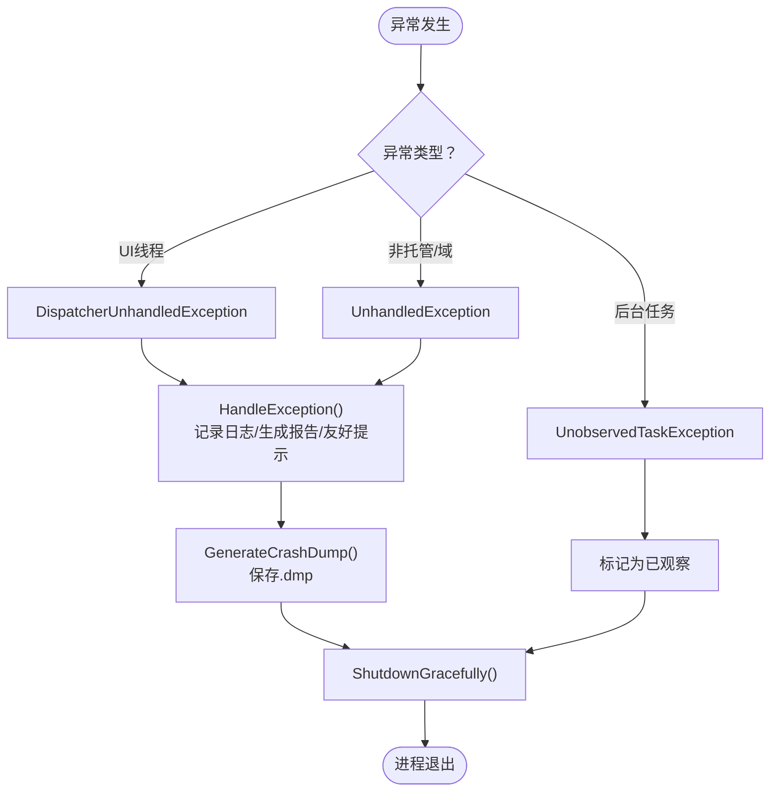
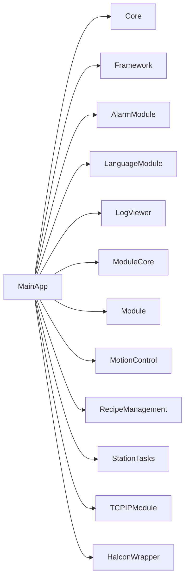

# 主应用程序模块

<cite>
**本文引用的文件**
- [MainApp/App.xaml.cs](file://MainApp/App.xaml.cs)
- [MainApp/App.xaml](file://MainApp/App.xaml)
- [MainApp/MainApp.csproj](file://MainApp/MainApp.csproj)
- [MainApp/Properties/appsettings.json](file://MainApp/Properties/appsettings.json)
- [MainApp/Views/MainWindow.xaml.cs](file://MainApp/Views/MainWindow.xaml.cs)
- [Core/Configuration/AppSettings.cs](file://Core/Configuration/AppSettings.cs)
- [Core/Services/ConfigurationService.cs](file://Core/Services/ConfigurationService.cs)
- [Core/XmlConfigurationProvider.cs](file://Core/XmlConfigurationProvider.cs)
- [MainApp/NLog.config](file://MainApp/NLog.config)
- [AlarmModule/AlarmModule.cs](file://AlarmModule/AlarmModule.cs)
- [Framework/FrameworkModule.cs](file://Framework/FrameworkModule.cs)
- [ModuleCore/ModuleCore.cs](file://ModuleCore/ModuleCore.cs)
- [Module/PrimModel.cs](file://Module/PrimModel.cs)
</cite>

## 目录
1. [简介](#简介)
2. [项目结构](#项目结构)
3. [核心组件](#核心组件)
4. [架构总览](#架构总览)
5. [详细组件分析](#详细组件分析)
6. [依赖关系分析](#依赖关系分析)
7. [性能考虑](#性能考虑)
8. [故障排查指南](#故障排查指南)
9. [结论](#结论)
10. [附录](#附录)

## 简介
本文件针对 GZQL_MACHINE 的主应用程序模块（MainApp）进行系统化技术文档整理，重点围绕以下目标展开：
- 解释 MainApp 作为应用程序入口点的设计原理，涵盖应用程序生命周期管理、模块初始化流程与窗口创建机制
- 详解 App.xaml.cs 中的关键方法：CreateShell() 创建主窗口、RegisterTypes() 注册服务、ConfigureModuleCatalog() 配置模块目录
- 阐述主应用程序的配置管理、异常处理机制与资源管理策略
- 提供应用程序启动流程、模块加载顺序与依赖注入容器的使用说明
- 给出主应用程序扩展指南与自定义配置方法

## 项目结构
MainApp 是基于 Prism.WPF 的桌面应用程序入口工程，负责：
- 初始化配置与日志系统
- 注册核心服务与模块
- 创建并显示主窗口
- 统一异常处理与诊断

图表来源
- [MainApp/App.xaml.cs:1-460](file://MainApp/App.xaml.cs#L1-L460)
- [MainApp/App.xaml:1-50](file://MainApp/App.xaml#L1-L50)
- [MainApp/Views/MainWindow.xaml.cs:1-32](file://MainApp/Views/MainWindow.xaml.cs#L1-L32)
- [MainApp/Properties/appsettings.json:1-6](file://MainApp/Properties/appsettings.json#L1-L6)
- [MainApp/NLog.config:1-88](file://MainApp/NLog.config#L1-L88)
- [MainApp/MainApp.csproj:1-83](file://MainApp/MainApp.csproj#L1-L83)
- [Core/Configuration/AppSettings.cs:1-39](file://Core/Configuration/AppSettings.cs#L1-L39)
- [Core/Services/ConfigurationService.cs:1-220](file://Core/Services/ConfigurationService.cs#L1-L220)
- [Core/XmlConfigurationProvider.cs:1-227](file://Core/XmlConfigurationProvider.cs#L1-L227)
- [AlarmModule/AlarmModule.cs:1-59](file://AlarmModule/AlarmModule.cs#L1-L59)
- [Framework/FrameworkModule.cs:1-59](file://Framework/FrameworkModule.cs#L1-L59)
- [ModuleCore/ModuleCore.cs:1-49](file://ModuleCore/ModuleCore.cs#L1-L49)
- [Module/PrimModel.cs:1-116](file://Module/PrimModel.cs#L1-L116)

章节来源
- [MainApp/App.xaml.cs:1-460](file://MainApp/App.xaml.cs#L1-L460)
- [MainApp/App.xaml:1-50](file://MainApp/App.xaml#L1-L50)
- [MainApp/MainApp.csproj:1-83](file://MainApp/MainApp.csproj#L1-L83)

## 核心组件
- 应用程序入口与生命周期管理：通过 PrismApplication 扩展，覆盖 Initialize、OnInitialized、CreateShell、RegisterTypes、ConfigureModuleCatalog 等关键阶段，统一初始化流程与模块装配。
- 配置管理：结合 Microsoft.Extensions.Configuration 构建基础配置，结合 Core.Services.ConfigurationService 与 Core.Configuration.XmlConfigurationProvider 实现 JSON/XML 双通道配置。
- 异常处理与诊断：全局捕获 UI、域、任务异常，生成崩溃转储与错误报告，并优雅关闭。
- 资源与主题：通过 App.xaml 合并语言资源与 MaterialDesign 主题。

章节来源
- [MainApp/App.xaml.cs:54-191](file://MainApp/App.xaml.cs#L54-L191)
- [Core/Services/ConfigurationService.cs:15-220](file://Core/Services/ConfigurationService.cs#L15-L220)
- [Core/XmlConfigurationProvider.cs:9-227](file://Core/XmlConfigurationProvider.cs#L9-L227)
- [MainApp/App.xaml:8-48](file://MainApp/App.xaml#L8-L48)

## 架构总览
下图展示 MainApp 的启动与模块装配流程，以及关键服务与配置的交互关系。

图表来源
- [MainApp/App.xaml.cs:59-77](file://MainApp/App.xaml.cs#L59-L77)
- [MainApp/App.xaml.cs:86-108](file://MainApp/App.xaml.cs#L86-L108)
- [MainApp/App.xaml.cs:110-191](file://MainApp/App.xaml.cs#L110-L191)
- [MainApp/Views/MainWindow.xaml.cs:19-29](file://MainApp/Views/MainWindow.xaml.cs#L19-L29)

## 详细组件分析

### 应用程序生命周期与入口点
- 生命周期钩子
  - Initialize：构建基础配置后调用基类初始化
  - OnInitialized：注册服务依赖、加载应用配置、初始化 TCP/Vision 系统占位
  - OnStartup/OnExit：附加事件以监控内存与退出日志
- 窗口创建机制
  - CreateShell：通过容器解析 MainWindow 视图作为壳窗口
  - MainWindow.xaml.cs 中延迟解析 ModuleCore.Views.MainWindow 并切换显示，随后关闭壳窗口

章节来源
- [MainApp/App.xaml.cs:59-84](file://MainApp/App.xaml.cs#L59-L84)
- [MainApp/Views/MainWindow.xaml.cs:19-29](file://MainApp/Views/MainWindow.xaml.cs#L19-L29)

### 配置管理
- 基础配置（appsettings.json）
  - 位置：MainApp/Properties/appsettings.json
  - 内容：ConnectionStrings.AlarmDb
- 应用配置（JSON）
  - 服务：Core/Services/ConfigurationService.cs
  - 存储：Config/appsettings.JSON（自动创建默认配置）
  - 模型：Core/Configuration/AppSettings.cs
- XML 配置（appconfig.xml）
  - 提供者：Core/XmlConfigurationProvider.cs
  - 作用：加载/保存 XML 配置，支持默认配置创建与旧格式迁移
- 初始化流程
  - App.xaml.cs 中 BuildConfiguration 加载 JSON；InitializeConfiguration 解析 IAppSettingService 并 Load

章节来源
- [MainApp/Properties/appsettings.json:1-6](file://MainApp/Properties/appsettings.json#L1-L6)
- [Core/Services/ConfigurationService.cs:52-220](file://Core/Services/ConfigurationService.cs#L52-L220)
- [Core/Configuration/AppSettings.cs:10-39](file://Core/Configuration/AppSettings.cs#L10-L39)
- [Core/XmlConfigurationProvider.cs:16-103](file://Core/XmlConfigurationProvider.cs#L16-L103)
- [MainApp/App.xaml.cs:86-108](file://MainApp/App.xaml.cs#L86-L108)

### 异常处理与诊断
- 全局异常捕获
  - UI 线程：DispatcherUnhandledException
  - 非托管/域：UnhandledException
  - 后台任务：UnobservedTaskException
- 诊断能力
  - 生成崩溃转储（MiniDumpWithFullMemory）
  - 记录启动/关闭信息与内存监控
  - 生成错误报告（ErrorReports/*.txt）
- 优雅关闭
  - 记录关闭信息并退出进程

图表来源
- [MainApp/App.xaml.cs:210-455](file://MainApp/App.xaml.cs#L210-L455)

章节来源
- [MainApp/App.xaml.cs:210-455](file://MainApp/App.xaml.cs#L210-L455)
- [MainApp/NLog.config:1-88](file://MainApp/NLog.config#L1-L88)

### 资源管理策略
- 资源字典合并：App.xaml 合并语言资源与 MaterialDesign 主题
- 日志资源：NLog.config 分级别输出至 Logs/日期 目录，按大小归档
- 图标与图片：MainApp.csproj 中嵌入资源与图标

章节来源
- [MainApp/App.xaml:8-48](file://MainApp/App.xaml#L8-L48)
- [MainApp/NLog.config:9-86](file://MainApp/NLog.config#L9-L86)
- [MainApp/MainApp.csproj:50-59](file://MainApp/MainApp.csproj#L50-L59)

### 关键方法详解

#### CreateShell()：创建主窗口
- 作用：返回容器解析的 MainWindow 视图作为壳窗口
- 行为：容器解析 MainApp.Views.MainWindow，随后在 MainWindow.xaml.cs 中异步切换到 ModuleCore.Views.MainWindow

章节来源
- [MainApp/App.xaml.cs:54-57](file://MainApp/App.xaml.cs#L54-L57)
- [MainApp/Views/MainWindow.xaml.cs:19-29](file://MainApp/Views/MainWindow.xaml.cs#L19-L29)

#### RegisterTypes()：注册服务
- 调用链：RegisterCoreServices → RegisterDatabaseServices → RegisterBusinessServices → RegisterStationServices → RegisterConfigurationServices → RegisterTCPServices → RegisterVisionDataServices
- 核心注册：
  - IConfiguration、ILogger、ILoggerService、ISnackbarMessageQueue、ILocalizationService、IAppSettingService、IStationRegistry
  - IConfigurationService：JsonConfigurationService
  - IAppSettingService：ConfigurationService
  - XmlConfigurationProvider：按 Config/appconfig.xml 路径注册
- 作用：建立依赖注入容器内的服务契约与实现映射

章节来源
- [MainApp/App.xaml.cs:110-177](file://MainApp/App.xaml.cs#L110-L177)
- [MainApp/App.xaml.cs:121-133](file://MainApp/App.xaml.cs#L121-L133)
- [MainApp/App.xaml.cs:141-161](file://MainApp/App.xaml.cs#L141-L161)

#### ConfigureModuleCatalog()：配置模块目录
- 模块加载顺序（按 AddModule 调用顺序）：
  1. LogViewerModule
  2. LanguageModule
  3. Framework.FrameworkModule
  4. AlarmModule.AlarmModule
  5. MotionControlModule
  6. RecipeModule
  7. StationTasksModule
  8. ModuleCore.CoreModule
  9. Module.PrimModel
  10. TCPIPModule.TCPIPModule
- 说明：各模块在 OnInitialized 中执行必要的初始化（如数据库 EnsureCreated、目录创建等）

章节来源
- [MainApp/App.xaml.cs:179-191](file://MainApp/App.xaml.cs#L179-L191)
- [AlarmModule/AlarmModule.cs:51-56](file://AlarmModule/AlarmModule.cs#L51-L56)
- [ModuleCore/ModuleCore.cs:21-24](file://ModuleCore/ModuleCore.cs#L21-L24)

### 模块加载顺序与依赖注入容器使用
- 容器类型：Prism.Unity（在 MainApp.csproj 中引用 Prism.Unity）
- 使用方式：
  - RegisterTypes：一次性注册服务契约与实现
  - OnInitialized：解析容器中的服务，执行初始化
  - CreateShell：解析壳窗口视图
- 模块初始化：
  - AlarmModule：OnInitialized 中创建 SQLite 数据库
  - ModuleCore：OnInitialized 中确保 ./Config/ 目录存在
  - Framework/Module：注册导航与对话框，提供参数编辑、树配置等服务

章节来源
- [MainApp/MainApp.csproj:25](file://MainApp/MainApp.csproj#L25)
- [AlarmModule/AlarmModule.cs:51-56](file://AlarmModule/AlarmModule.cs#L51-L56)
- [ModuleCore/ModuleCore.cs:21-24](file://ModuleCore/ModuleCore.cs#L21-L24)
- [Framework/FrameworkModule.cs:31-55](file://Framework/FrameworkModule.cs#L31-L55)
- [Module/PrimModel.cs:51-114](file://Module/PrimModel.cs#L51-L114)

## 依赖关系分析
- 项目依赖
  - MainApp 引用 Core、Framework、AlarmModule、LanguageModule、LogViewer、ModuleCore、Module、MotionControl、RecipeManagement、StationTasks、TCPIPModule、HalconWrapper
- 包依赖
  - Prism.Unity、MaterialDesignThemes、Microsoft.Extensions.Configuration 等
- 模块间耦合
  - MainApp 通过 Prism 模块化解耦，模块内部通过容器注册服务，避免强耦合
  - 配置服务通过 IAppSettingService 抽象，既支持 JSON 也支持 XML

图表来源
- [MainApp/MainApp.csproj:27-39](file://MainApp/MainApp.csproj#L27-L39)

章节来源
- [MainApp/MainApp.csproj:27-39](file://MainApp/MainApp.csproj#L27-L39)

## 性能考虑
- 内存监控：启动后定时记录工作集，便于发现内存泄漏或增长异常
- 日志分级：NLog 按级别输出，避免过度 I/O
- 配置加载：JSON/XML 双通道加载，注意磁盘访问与反序列化开销
- 模块初始化：数据库 EnsureCreated 等操作建议在后台线程执行，避免阻塞 UI

## 故障排查指南
- 启动失败
  - 检查 appsettings.json 是否存在且格式正确
  - 查看 NLog 输出目录 Logs/ 与错误报告 ErrorReports/
- 配置无法加载
  - 确认 Config/appsettings.JSON 是否存在；若不存在由 ConfigurationService 自动创建默认配置
  - 检查 XmlConfigurationProvider 的 appconfig.xml 路径与权限
- 异常崩溃
  - 查看 CrashDumps 目录下的 .dmp 文件
  - 错误报告保存在 ErrorReports 下，包含模块清单与堆栈
- UI 卡顿
  - 关注内存监控日志，检查是否存在长时间阻塞 UI 的操作

章节来源
- [MainApp/App.xaml.cs:315-455](file://MainApp/App.xaml.cs#L315-L455)
- [MainApp/NLog.config:9-86](file://MainApp/NLog.config#L9-L86)
- [Core/Services/ConfigurationService.cs:62-69](file://Core/Services/ConfigurationService.cs#L62-L69)

## 结论
MainApp 通过 Prism 的模块化与依赖注入机制，实现了清晰的应用程序入口、可扩展的服务注册与稳健的异常处理。其配置体系兼顾 JSON 与 XML，满足不同场景需求；资源与主题通过 App.xaml 统一管理，日志通过 NLog 分级输出。模块加载顺序明确，便于后续扩展与维护。

## 附录

### 扩展指南
- 新增模块
  - 实现 IModule 接口，提供 RegisterTypes 与 OnInitialized
  - 在 ConfigureModuleCatalog 中 AddModule 对应模块类
- 新增服务
  - 在 RegisterTypes 中注册契约与实现
  - 如需配置支持，可在 InitializeConfiguration 中加载对应配置
- 自定义配置
  - JSON：通过 IAppSettingService 读写 Config/appsettings.JSON
  - XML：通过 IConfigurationProvider 读写 Config/appconfig.xml

章节来源
- [MainApp/App.xaml.cs:179-191](file://MainApp/App.xaml.cs#L179-L191)
- [MainApp/App.xaml.cs:110-177](file://MainApp/App.xaml.cs#L110-L177)
- [Core/Services/ConfigurationService.cs:72-87](file://Core/Services/ConfigurationService.cs#L72-L87)
- [Core/XmlConfigurationProvider.cs:25-58](file://Core/XmlConfigurationProvider.cs#L25-L58)