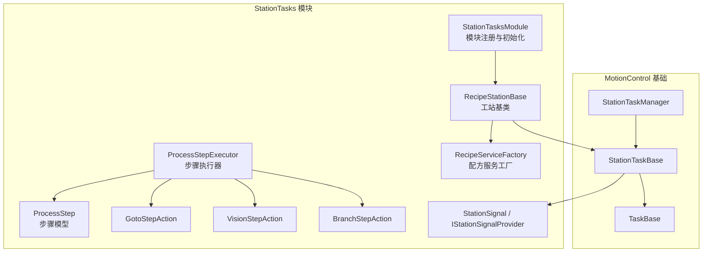
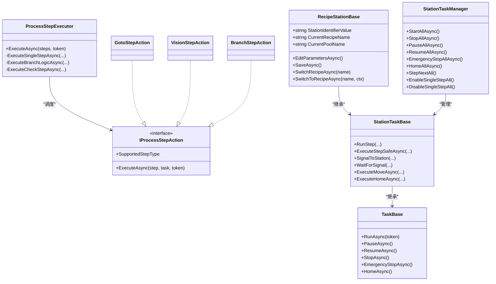
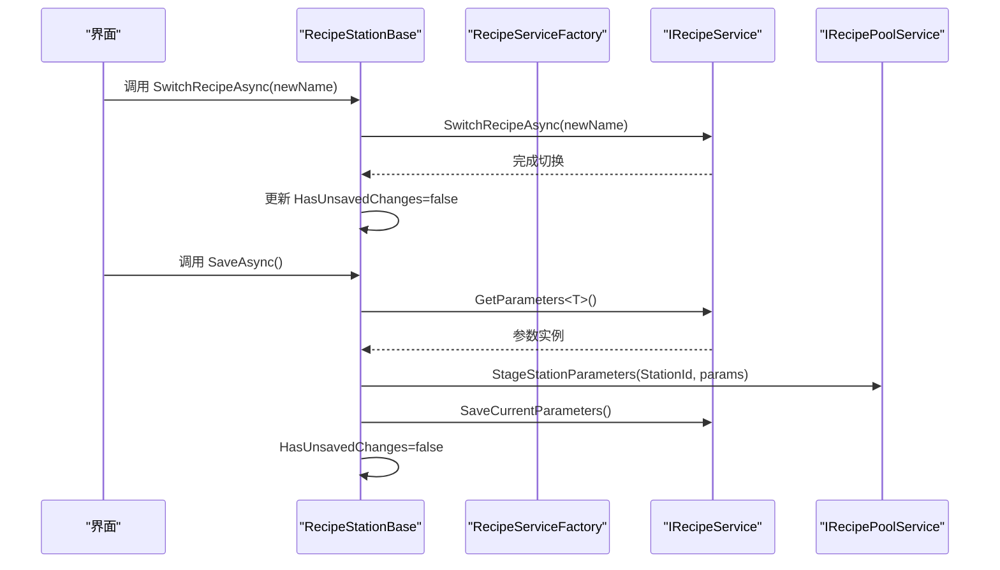
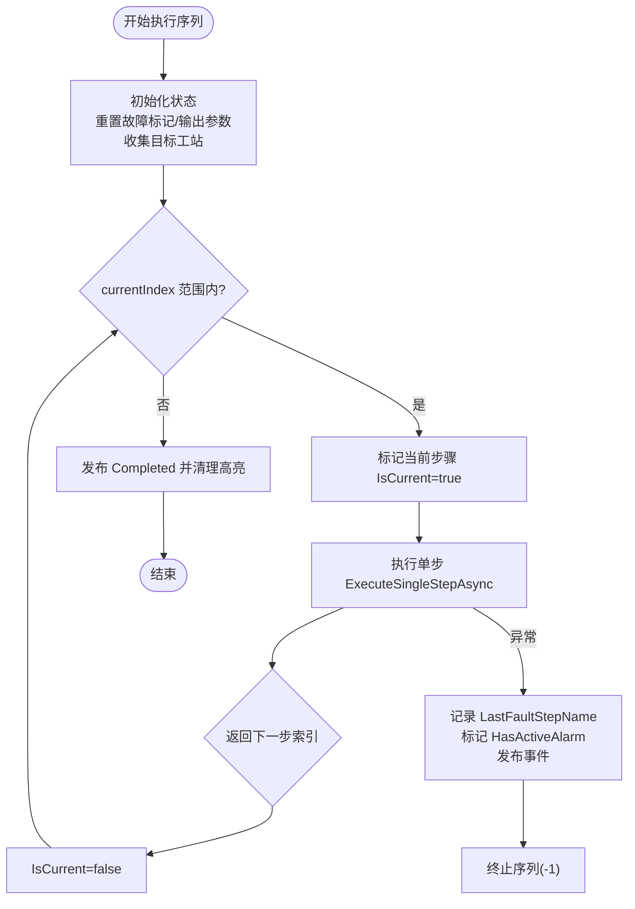
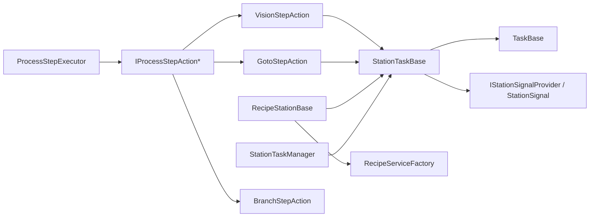

# 工站任务模块

<cite>
**本文引用的文件**
- [StationTasksModule.cs](file://StationTasks/StationTasksModule.cs)
- [RecipeStationBase.cs](file://StationTasks/Tasks/RecipeStationBase.cs)
- [ProcessStep.cs](file://StationTasks/Models/ProcessStep.cs)
- [ProcessStepExecutor.cs](file://StationTasks/Actions/ProcessStepExecutor.cs)
- [IProcessStepAction.cs](file://StationTasks/Actions/IProcessStepAction.cs)
- [GotoStepAction.cs](file://StationTasks/Actions/GotoStepAction.cs)
- [VisionStepAction.cs](file://StationTasks/Actions/VisionStepAction.cs)
- [BranchStepAction.cs](file://StationTasks/Actions/BranchStepAction.cs)
- [RecipeServiceFactory.cs](file://StationTasks/Serivces/RecipeServiceFactory.cs)
- [StationSignal.cs](file://StationTasks/Models/StationSignal.cs)
- [IStationSignalProvider.cs](file://StationTasks/Interfaces/IStationSignalProvider.cs)
- [StationTaskBase.cs](file://MotionControl/Services/StationTaskBase.cs)
- [TaskBase.cs](file://MotionControl/Services/TaskBase.cs)
- [StationTaskManager.cs](file://MotionControl/Services/StationTaskManager.cs)
</cite>

## 目录
1. [简介](#简介)
2. [项目结构](#项目结构)
3. [核心组件](#核心组件)
4. [架构总览](#架构总览)
5. [详细组件分析](#详细组件分析)
6. [依赖关系分析](#依赖关系分析)
7. [性能考量](#性能考量)
8. [故障排查指南](#故障排查指南)
9. [结论](#结论)
10. [附录](#附录)

## 简介
本文件面向GZQL_MACHINE的工站任务模块，系统性阐述StationTasks模块的任务调度体系，重点覆盖以下方面：
- 任务调度系统设计：步骤执行控制、状态跟踪、信号交互、任务编排
- 核心组件：RecipeStationBase工站基类、ProcessStep过程步骤、StationTaskManager任务管理器
- 任务执行流程：步骤间依赖关系、条件分支、异常处理机制
- 工站配置管理、任务监控、执行日志记录
- 扩展接口、自定义步骤实现与任务调度优化建议

## 项目结构
工站任务模块位于StationTasks目录，围绕“配方驱动 + 步骤动作 + 执行器”的三层结构组织：
- Models：定义步骤模型、分支配置、报警配置、视觉/扫描/寻针等细节配置
- Actions：步骤动作实现（GOTO、VISION、SCAN、SEEK、WAIT、SCRIPT、DASHBOARD、BRANCH、PICK等）
- Tasks：工站任务基类与具体任务（装配、点胶、上下料等）
- Services：配方服务工厂、视觉数据解析器、位置提供器等
- Interfaces：信号交互接口、任务接口等

图表来源
- [StationTasksModule.cs:20-50](file://StationTasks/StationTasksModule.cs#L20-L50)
- [RecipeStationBase.cs:48-81](file://StationTasks/Tasks/RecipeStationBase.cs#L48-L81)
- [ProcessStepExecutor.cs:29-71](file://StationTasks/Actions/ProcessStepExecutor.cs#L29-L71)
- [ProcessStep.cs:17-296](file://StationTasks/Models/ProcessStep.cs#L17-L296)
- [GotoStepAction.cs:20-36](file://StationTasks/Actions/GotoStepAction.cs#L20-L36)
- [VisionStepAction.cs:22-44](file://StationTasks/Actions/VisionStepAction.cs#L22-L44)
- [BranchStepAction.cs:14-29](file://StationTasks/Actions/BranchStepAction.cs#L14-L29)
- [RecipeServiceFactory.cs:17-87](file://StationTasks/Serivces/RecipeServiceFactory.cs#L17-L87)
- [StationSignal.cs:9-14](file://StationTasks/Models/StationSignal.cs#L9-L14)
- [IStationSignalProvider.cs:9-15](file://StationTasks/Interfaces/IStationSignalProvider.cs#L9-L15)
- [TaskBase.cs:14-43](file://MotionControl/Services/TaskBase.cs#L14-L43)
- [StationTaskBase.cs:22-143](file://MotionControl/Services/StationTaskBase.cs#L22-L143)
- [StationTaskManager.cs:13-30](file://MotionControl/Services/StationTaskManager.cs#L13-L30)

章节来源
- [StationTasksModule.cs:20-62](file://StationTasks/StationTasksModule.cs#L20-L62)
- [RecipeStationBase.cs:48-81](file://StationTasks/Tasks/RecipeStationBase.cs#L48-L81)
- [ProcessStepExecutor.cs:88-188](file://StationTasks/Actions/ProcessStepExecutor.cs#L88-L188)
- [ProcessStep.cs:17-296](file://StationTasks/Models/ProcessStep.cs#L17-L296)
- [TaskBase.cs:14-43](file://MotionControl/Services/TaskBase.cs#L14-L43)
- [StationTaskBase.cs:22-143](file://MotionControl/Services/StationTaskBase.cs#L22-L143)
- [StationTaskManager.cs:13-30](file://MotionControl/Services/StationTaskManager.cs#L13-L30)

## 核心组件
- RecipeStationBase工站基类
  - 负责配方加载、参数编辑、配方切换、参数保存、工站注册与事件订阅
  - 提供参数访问器、配方事件处理、参数获取辅助方法
- ProcessStep过程步骤
  - 定义步骤类型、子移动、报警配置、分支配置、检查配置、视觉/扫描/寻针/取放等细节配置
  - 支持报警高亮、分支启用、检查项状态等运行时UI绑定属性
- StationTaskManager任务管理器
  - 统一启动/停止/暂停/恢复/急停/回零/单步控制等
  - 通过工站注册表聚合所有工站任务，实现全局控制

章节来源
- [RecipeStationBase.cs:20-185](file://StationTasks/Tasks/RecipeStationBase.cs#L20-L185)
- [ProcessStep.cs:17-296](file://StationTasks/Models/ProcessStep.cs#L17-L296)
- [StationTaskManager.cs:13-111](file://MotionControl/Services/StationTaskManager.cs#L13-L111)

## 架构总览
工站任务模块采用“配方驱动 + 步骤动作 + 执行器 + 基类封装”的分层架构：
- 配方层：通过RecipeServiceFactory按工站类型创建配方服务，加载/保存参数，触发参数应用事件
- 执行层：ProcessStepExecutor负责顺序执行步骤，支持条件分支、检查跳转、跨工站状态广播
- 动作层：各类IProcessStepAction实现具体物理动作（移动、拍照、寻针、等待、脚本、看板等）
- 基类层：StationTaskBase封装RunStep安全执行、单步/暂停/急停、IO信号交互、跨工站状态发布
- 管理层：StationTaskManager统一调度所有工站任务

图表来源
- [RecipeStationBase.cs:20-81](file://StationTasks/Tasks/RecipeStationBase.cs#L20-L81)
- [ProcessStepExecutor.cs:29-71](file://StationTasks/Actions/ProcessStepExecutor.cs#L29-L71)
- [IProcessStepAction.cs:11-23](file://StationTasks/Actions/IProcessStepAction.cs#L11-L23)
- [GotoStepAction.cs:20-36](file://StationTasks/Actions/GotoStepAction.cs#L20-L36)
- [VisionStepAction.cs:22-44](file://StationTasks/Actions/VisionStepAction.cs#L22-L44)
- [BranchStepAction.cs:14-29](file://StationTasks/Actions/BranchStepAction.cs#L14-L29)
- [StationTaskBase.cs:22-143](file://MotionControl/Services/StationTaskBase.cs#L22-L143)
- [TaskBase.cs:14-43](file://MotionControl/Services/TaskBase.cs#L14-L43)
- [StationTaskManager.cs:13-30](file://MotionControl/Services/StationTaskManager.cs#L13-L30)

## 详细组件分析

### RecipeStationBase 工站基类
- 职责
  - 通过RecipeServiceFactory创建配方服务，加载/保存参数，订阅参数应用/配方切换事件
  - 实现IStationParameterProvider与IBatchSwitchable，提供参数访问与批量切换能力
  - 注册到IStationRegistry，便于跨工站协作与监控
- 关键流程
  - 初始化：创建配方服务、订阅事件、注册工站、异步初始化配方参数
  - 参数编辑：委托配方服务弹出参数编辑对话框
  - 参数保存：暂存至配方池并保存当前参数，清空未保存标记
  - 配方切换：支持普通切换与批量切换（带批次上下文）

图表来源
- [RecipeStationBase.cs:135-177](file://StationTasks/Tasks/RecipeStationBase.cs#L135-L177)
- [RecipeServiceFactory.cs:64-87](file://StationTasks/Serivces/RecipeServiceFactory.cs#L64-L87)

章节来源
- [RecipeStationBase.cs:48-185](file://StationTasks/Tasks/RecipeStationBase.cs#L48-L185)
- [RecipeServiceFactory.cs:17-87](file://StationTasks/Serivces/RecipeServiceFactory.cs#L17-L87)

### ProcessStep 步骤模型
- 步骤类型：GOTO、INDEX、TRAVERSE、ALIGN、SCAN、PICK、VISION、RELEASE、SLOTADJ、APPROACH、CONTACT、INSPECT、VERIFY、CHECK、DISPENSE、CURE、SEEK、WAIT、SCRIPT、IPQC、DASHBOARD、BRANCH
- 子移动SubMove：支持多轴、多位置、偏移、速度、回零模式等
- 分支配置BranchConfig：支持条件表达式、默认动作、输出参数写入全局变量
- 报警配置StepAlarmConfig：支持启用/禁用、自定义报警代码与等级
- 检查配置CheckDetail：支持Pass/Fail动作、最大重试、超限动作（Alarm/Stop/Continue）

章节来源
- [ProcessStep.cs:17-296](file://StationTasks/Models/ProcessStep.cs#L17-L296)

### ProcessStepExecutor 步骤执行器
- 职责
  - 顺序执行步骤序列，支持GOTO移动、CHECK检查、BRANCH分支、单步/暂停/急停保护
  - 跨工站执行时，向目标工站发布Running/Completed状态事件
  - 记录LastFaultStepName并在事件回调中标记步骤行高亮
- 关键机制
  - ExecuteAsync：构建目标工站集合、清理步骤高亮、执行循环、收尾发布Idle
  - ExecuteSingleStepAsync：根据步骤类型分派到对应动作，处理异常并标记报警
  - ExecuteCheckStepAsync：评估检查项，支持重试与超限动作
  - ExecuteBranchLogicAsync：收集上下文变量（全局变量+输出参数），评估条件表达式，写入输出参数到全局变量

图表来源
- [ProcessStepExecutor.cs:88-188](file://StationTasks/Actions/ProcessStepExecutor.cs#L88-L188)
- [ProcessStepExecutor.cs:262-306](file://StationTasks/Actions/ProcessStepExecutor.cs#L262-L306)
- [ProcessStepExecutor.cs:370-440](file://StationTasks/Actions/ProcessStepExecutor.cs#L370-L440)
- [ProcessStepExecutor.cs:565-614](file://StationTasks/Actions/ProcessStepExecutor.cs#L565-L614)

章节来源
- [ProcessStepExecutor.cs:29-188](file://StationTasks/Actions/ProcessStepExecutor.cs#L29-L188)

### GotoStepAction 移动动作
- 职责：遍历SubMove，解析轴ID与位置，支持回零模式与偏移量叠加
- 跨工站路由：根据SubMove.StationId查找目标工站任务执行移动
- 偏移解析：支持固定偏移与全局变量偏移（从配方池加载）

章节来源
- [GotoStepAction.cs:42-121](file://StationTasks/Actions/GotoStepAction.cs#L42-L121)

### VisionStepAction 视觉动作
- 职责：通过TCPIP发送触发命令→等待响应→解析数据→映射全局变量
- 超时处理：最多重试3次，超时抛出可恢复异常
- 解析策略：默认解析器或脚本解析器（可配置）

章节来源
- [VisionStepAction.cs:46-75](file://StationTasks/Actions/VisionStepAction.cs#L46-L75)
- [VisionStepAction.cs:81-143](file://StationTasks/Actions/VisionStepAction.cs#L81-L143)
- [VisionStepAction.cs:148-172](file://StationTasks/Actions/VisionStepAction.cs#L148-L172)
- [VisionStepAction.cs:177-220](file://StationTasks/Actions/VisionStepAction.cs#L177-L220)

### BranchStepAction 分支动作
- 职责：纯逻辑步骤，条件评估与跳转由ProcessStepExecutor集中处理
- 作用：将“返回下一步索引”的需求从动作接口中剥离，交由执行器统一决策

章节来源
- [BranchStepAction.cs:25-29](file://StationTasks/Actions/BranchStepAction.cs#L25-L29)

### StationTaskBase 基类封装
- RunStep：提供暂停/急停/单步/可恢复异常保护，支持步骤级报警配置
- 信号交互：SignalToStation、WaitForSignal、WaitForSignalAsync
- 位置与运动：预加载位置、按轴名解析位置、带偏移移动、回零
- 手动流程：ExecuteManualProcess复用RunStep安全机制
- 跨工站状态：PublishStepStatus、CompleteStepStatus

章节来源
- [StationTaskBase.cs:297-400](file://MotionControl/Services/StationTaskBase.cs#L297-L400)
- [StationTaskBase.cs:416-449](file://MotionControl/Services/StationTaskBase.cs#L416-L449)
- [StationTaskBase.cs:547-584](file://MotionControl/Services/StationTaskBase.cs#L547-L584)
- [StationTaskBase.cs:589-610](file://MotionControl/Services/StationTaskBase.cs#L589-L610)

### TaskBase 任务基类
- 生命周期：RunAsync、PauseAsync、ResumeAsync、StopAsync、EmergencyStopAsync、HomeAsync
- 暂停机制：CheckPauseAsync使用WhenAny保证非阻塞
- 轴报警：订阅AxisAlarmEvent，触发报警并暂停

章节来源
- [TaskBase.cs:44-90](file://MotionControl/Services/TaskBase.cs#L44-L90)
- [TaskBase.cs:108-120](file://MotionControl/Services/TaskBase.cs#L108-L120)
- [TaskBase.cs:210-224](file://MotionControl/Services/TaskBase.cs#L210-L224)

### StationTaskManager 任务管理器
- 统一控制：StartAllAsync、StopAllAsync、PauseAllAsync、ResumeAllAsync、EmergencyStopAllAsync
- 回零：并行HomeAllAsync，等待完成后发布系统复位结果
- 单步：StepNextAll、EnableSingleStepAll、DisableSingleStepAll

章节来源
- [StationTaskManager.cs:32-111](file://MotionControl/Services/StationTaskManager.cs#L32-L111)

## 依赖关系分析
- 模块注册
  - StationTasksModule在容器中注册ITask实现、步骤动作、视觉解析器、交互服务、位置提供器、配方工厂等
  - 初始化阶段解析所有ITask单例，触发工站自注册到IStationRegistry
- 执行链路
  - RecipeStationBase依赖RecipeServiceFactory创建配方服务，订阅参数事件
  - ProcessStepExecutor依赖IProcessStepAction映射、IAlarmService、IFormulaEvaluator、IRecipePoolService
  - GotoStepAction依赖IRecipePoolService、IStationRegistry、StationTaskBase
  - VisionStepAction依赖ITCPEventService、IVisionDataParser、IRecipePoolService

图表来源
- [StationTasksModule.cs:20-50](file://StationTasks/StationTasksModule.cs#L20-L50)
- [RecipeStationBase.cs:69-78](file://StationTasks/Tasks/RecipeStationBase.cs#L69-L78)
- [ProcessStepExecutor.cs:31-71](file://StationTasks/Actions/ProcessStepExecutor.cs#L31-L71)
- [GotoStepAction.cs:28-36](file://StationTasks/Actions/GotoStepAction.cs#L28-L36)
- [VisionStepAction.cs:32-44](file://StationTasks/Actions/VisionStepAction.cs#L32-L44)
- [BranchStepAction.cs:20-23](file://StationTasks/Actions/BranchStepAction.cs#L20-L23)
- [StationTaskBase.cs:416-449](file://MotionControl/Services/StationTaskBase.cs#L416-L449)

章节来源
- [StationTasksModule.cs:20-62](file://StationTasks/StationTasksModule.cs#L20-L62)
- [ProcessStepExecutor.cs:31-71](file://StationTasks/Actions/ProcessStepExecutor.cs#L31-L71)

## 性能考量
- 步骤执行
  - 使用RunStep包装动作，避免重复暂停/急停检查逻辑，减少状态切换开销
  - 单步模式下WaitForStepAsync使用TaskCompletionSource与WhenAny，避免忙轮询
- 跨工站执行
  - 仅对涉及的目标工站发布状态事件，避免广播风暴
  - 通过StationTaskBase.PublishStepStatus与CompleteStepStatus精确上报步骤进度
- 配方与全局变量
  - 批量写入全局变量前标记changed，仅在变更时保存，降低I/O频率
- 回零与HomeAllAsync
  - 并行回零，等待所有完成后再统一发布结果，提升系统复位效率

## 故障排查指南
- 步骤级报警
  - LastFaultStepName记录最近触发报警的步骤名，配合HasActiveAlarm在步骤编辑器中高亮
  - 步骤级报警配置启用时，使用自定义报警代码与等级；否则使用默认RECOVERABLE_FAULT
- 可恢复异常
  - RunStep捕获RecoverableException，触发报警、请求暂停、等待操作员处理
  - PublishRecoverableFault事件供UI弹窗提示
- 超时与重试
  - VisionStepAction在等待响应超时时抛出可恢复异常，支持最多3次重试
- 条件分支安全
  - BRANCH配置的目标步骤Seq<=0或不存在时，触发紧急报警并终止序列，避免撞机风险
- 系统级急停
  - TaskBase在致命异常或轴报警时触发全局急停事件，确保系统安全

章节来源
- [StationTaskBase.cs:330-395](file://MotionControl/Services/StationTaskBase.cs#L330-L395)
- [ProcessStepExecutor.cs:74-82](file://StationTasks/Actions/ProcessStepExecutor.cs#L74-L82)
- [VisionStepAction.cs:127-139](file://StationTasks/Actions/VisionStepAction.cs#L127-L139)
- [ProcessStepExecutor.cs:766-774](file://StationTasks/Actions/ProcessStepExecutor.cs#L766-L774)
- [TaskBase.cs:210-224](file://MotionControl/Services/TaskBase.cs#L210-L224)

## 结论
工站任务模块通过RecipeStationBase、ProcessStep、ProcessStepExecutor与StationTaskBase形成清晰的分层架构，实现了配方驱动的步骤编排、跨工站协同、完善的异常处理与可视化监控。模块化的设计便于扩展新的步骤动作与工站类型，同时提供了丰富的配置项与日志记录，满足生产现场的复杂工艺需求。

## 附录
- 扩展接口与实现建议
  - 新增步骤动作：实现IProcessStepAction，注册到容器，确保SupportedStepType与执行逻辑完备
  - 自定义配方参数：在RecipeServiceFactory中添加工站标识到参数类型的映射
  - 信号交互：实现IStationSignalProvider，结合StationTaskBase.SignalToStation/WaitForSignal
- 任务调度优化
  - 合理使用单步模式进行调试，批量执行时关闭单步
  - 通过BranchConfig与OutputParameters实现条件跳转，减少硬编码分支
  - 将频繁I/O操作合并，减少全局变量写入次数
- 工站配置管理
  - 使用RecipeStationBase的参数编辑与保存接口，确保参数变更可追溯
  - 利用IRecipePoolService的全局变量持久化能力，统一管理跨步骤输出