# 报警管理模块

<cite>
**本文档引用的文件**
- [AlarmModule.cs](file://AlarmModule/AlarmModule.cs)
- [IAlarmService.cs](file://AlarmModule/Interfaces/IAlarmService.cs)
- [IAlarmNotificationService.cs](file://AlarmModule/Interfaces/IAlarmNotificationService.cs)
- [IAlarmRepository.cs](file://AlarmModule/Interfaces/IAlarmRepository.cs)
- [AlarmService.cs](file://AlarmModule/Services/AlarmService.cs)
- [AlarmNotificationService.cs](file://AlarmModule/Services/AlarmNotificationService.cs)
- [AlarmRepository.cs](file://AlarmModule/Data/AlarmRepository.cs)
- [AlarmDbContext.cs](file://AlarmModule/Data/AlarmDbContext.cs)
- [AlarmRecord.cs](file://AlarmModule/Models/AlarmRecord.cs)
- [AlarmThresholdConfig.cs](file://AlarmModule/Models/AlarmThresholdConfig.cs)
- [AlarmLevel.cs](file://AlarmModule/Models/AlarmLevel.cs)
- [AlarmStatus.cs](file://AlarmModule/Models/AlarmStatus.cs)
- [AlarmType.cs](file://AlarmModule/Models/AlarmType.cs)
- [AlarmQueryParams.cs](file://AlarmModule/Models/AlarmQueryParams.cs)
- [AlarmListViewModel.cs](file://AlarmModule/ViewModels/AlarmListViewModel.cs)
- [AlarmThresholdViewModel.cs](file://AlarmModule/ViewModels/AlarmThresholdViewModel.cs)
- [AlarmHistoryView.xaml](file://AlarmModule/Views/AlarmHistoryView.xaml)
- [AlarmHistoryView.xaml.cs](file://AlarmModule/Views/AlarmHistoryView.xaml.cs)
- [AlarmListView.xaml](file://AlarmModule/Views/AlarmListView.xaml)
- [AlarmListView.xaml.cs](file://AlarmModule/Views/AlarmListView.xaml.cs)
- [AlarmStatsView.xaml](file://AlarmModule/Views/AlarmStatsView.xaml)
- [AlarmStatsView.xaml.cs](file://AlarmModule/Views/AlarmStatsView.xaml.cs)
- [AlarmThresholdView.xaml](file://AlarmModule/Views/AlarmThresholdView.xaml)
- [AlarmThresholdView.xaml.cs](file://AlarmModule/Views/AlarmThresholdView.xaml.cs)
</cite>

## 目录
1. [简介](#简介)
2. [项目结构](#项目结构)
3. [核心组件](#核心组件)
4. [架构总览](#架构总览)
5. [详细组件分析](#详细组件分析)
6. [依赖关系分析](#依赖关系分析)
7. [性能考虑](#性能考虑)
8. [故障排除指南](#故障排除指南)
9. [结论](#结论)
10. [附录](#附录)

## 简介
本模块为GZQL_MACHINE提供工业4级报警管理系统，覆盖报警触发、确认、复位、消除的完整生命周期；通过SQLite本地数据库持久化报警数据；提供阈值配置、历史查询、通知机制、统计分析等功能。模块采用Prism模块化架构，结合MVVM模式，实现清晰的职责分离与可扩展性。

## 项目结构
AlarmModule采用按职责分层的组织方式：
- 接口层：定义服务契约（IAlarmService、IAlarmNotificationService、IAlarmRepository）
- 服务层：实现业务逻辑（AlarmService、AlarmNotificationService）
- 数据层：封装数据访问（AlarmRepository、AlarmDbContext）
- 模型层：定义数据结构与枚举（AlarmRecord、AlarmThresholdConfig、AlarmLevel、AlarmStatus、AlarmType、AlarmQueryParams）
- 视图模型层：绑定UI交互（AlarmListViewModel、AlarmThresholdViewModel等）
- 视图层：XAML界面与后台代码

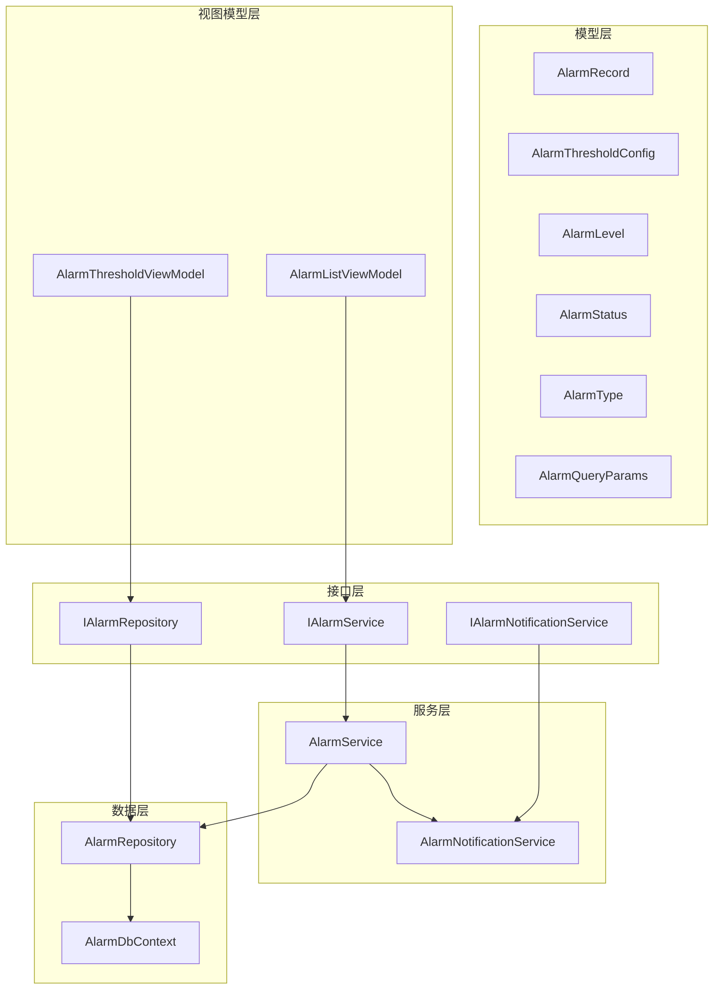

**图表来源**
- [AlarmModule.cs:21-46](file://AlarmModule/AlarmModule.cs#L21-L46)
- [IAlarmService.cs:11-75](file://AlarmModule/Interfaces/IAlarmService.cs#L11-L75)
- [IAlarmNotificationService.cs:10-21](file://AlarmModule/Interfaces/IAlarmNotificationService.cs#L10-L21)
- [IAlarmRepository.cs:11-32](file://AlarmModule/Interfaces/IAlarmRepository.cs#L11-L32)
- [AlarmService.cs:16-46](file://AlarmModule/Services/AlarmService.cs#L16-L46)
- [AlarmNotificationService.cs:19-30](file://AlarmModule/Services/AlarmNotificationService.cs#L19-L30)
- [AlarmRepository.cs:15-22](file://AlarmModule/Data/AlarmRepository.cs#L15-L22)
- [AlarmDbContext.cs](file://AlarmModule/Data/AlarmDbContext.cs)
- [AlarmRecord.cs:12-60](file://AlarmModule/Models/AlarmRecord.cs#L12-L60)
- [AlarmThresholdConfig.cs:10-35](file://AlarmModule/Models/AlarmThresholdConfig.cs#L10-L35)
- [AlarmLevel.cs:6-16](file://AlarmModule/Models/AlarmLevel.cs#L6-L16)
- [AlarmStatus.cs:6-16](file://AlarmModule/Models/AlarmStatus.cs#L6-L16)
- [AlarmType.cs:6-16](file://AlarmModule/Models/AlarmType.cs#L6-L16)
- [AlarmQueryParams.cs:9-32](file://AlarmModule/Models/AlarmQueryParams.cs#L9-L32)
- [AlarmListViewModel.cs:16-95](file://AlarmModule/ViewModels/AlarmListViewModel.cs#L16-L95)
- [AlarmThresholdViewModel.cs:17-175](file://AlarmModule/ViewModels/AlarmThresholdViewModel.cs#L17-L175)

**章节来源**
- [AlarmModule.cs:16-56](file://AlarmModule/AlarmModule.cs#L16-L56)

## 核心组件
- AlarmService：提供报警触发、生命周期管理、查询导出、活跃报警集合维护等核心功能，内置防抖抑制与状态流转校验。
- AlarmNotificationService：根据报警等级展示不同级别的通知（模态弹窗+蜂鸣或Toast），支持关闭所有通知。
- AlarmRepository：基于EF Core + SQLite的数据访问层，提供报警记录与阈值配置的CRUD、分页查询、统计分析等能力。
- AlarmModule：模块注册器，负责DI容器注册、数据库初始化与导航视图注册。

**章节来源**
- [IAlarmService.cs:11-75](file://AlarmModule/Interfaces/IAlarmService.cs#L11-L75)
- [IAlarmNotificationService.cs:10-21](file://AlarmModule/Interfaces/IAlarmNotificationService.cs#L10-L21)
- [IAlarmRepository.cs:11-32](file://AlarmModule/Interfaces/IAlarmRepository.cs#L11-L32)
- [AlarmService.cs:16-46](file://AlarmModule/Services/AlarmService.cs#L16-L46)
- [AlarmNotificationService.cs:19-30](file://AlarmModule/Services/AlarmNotificationService.cs#L19-L30)
- [AlarmRepository.cs:15-22](file://AlarmModule/Data/AlarmRepository.cs#L15-L22)
- [AlarmModule.cs:21-56](file://AlarmModule/AlarmModule.cs#L21-L56)

## 架构总览
模块采用分层架构与依赖注入：
- 模块注册：在AlarmModule中注册DbContextOptions、仓储、服务与导航视图
- 数据持久化：AlarmDbContext + SQLite，AlarmRepository每次操作创建新DbContext实例
- 通知机制：AlarmNotificationService根据等级选择不同通知策略
- UI绑定：ViewModel通过Prism命令与服务交互，实时反映报警状态变化

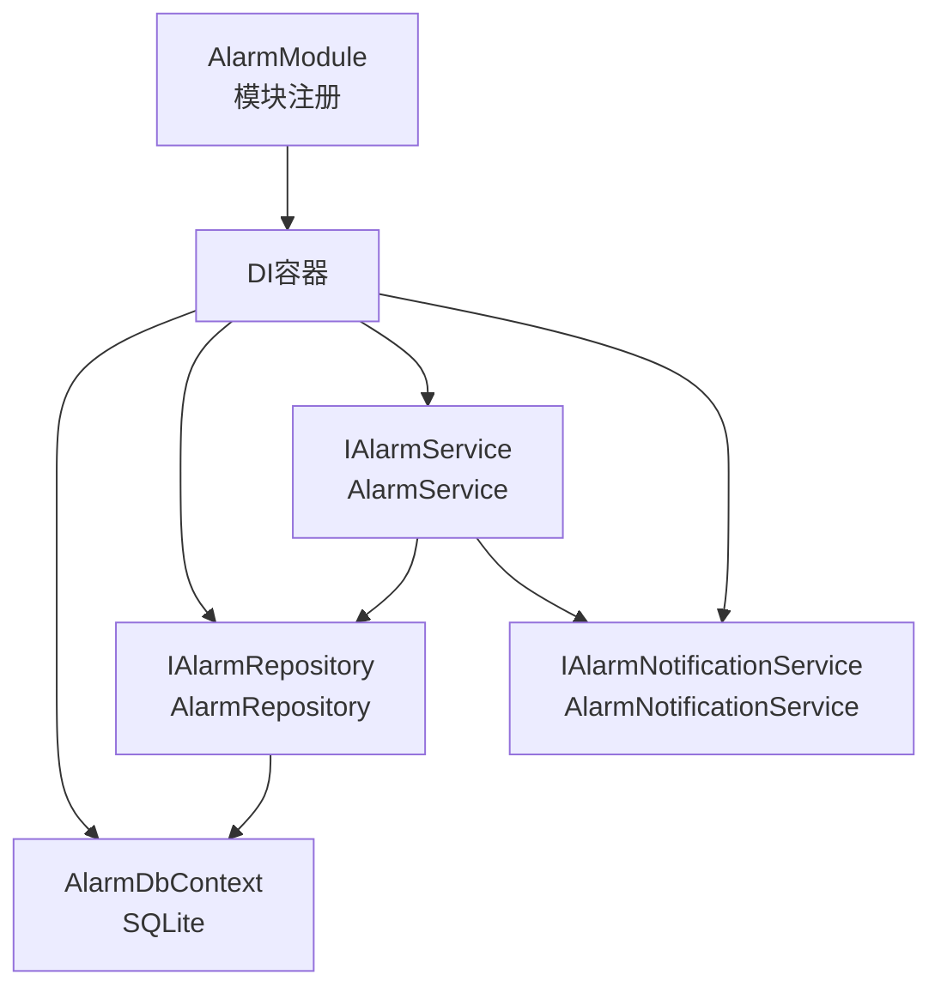

**图表来源**
- [AlarmModule.cs:21-56](file://AlarmModule/AlarmModule.cs#L21-L56)
- [AlarmRepository.cs:15-22](file://AlarmModule/Data/AlarmRepository.cs#L15-L22)
- [AlarmService.cs:16-46](file://AlarmModule/Services/AlarmService.cs#L16-L46)
- [AlarmNotificationService.cs:19-30](file://AlarmModule/Services/AlarmNotificationService.cs#L19-L30)

## 详细组件分析

### AlarmService：报警服务
职责与特性：
- 报警触发：支持防抖抑制（相同Code+Source在配置时间窗口内不重复触发），自动更新最近触发时间
- 生命周期管理：确认、复位、消除均进行状态校验，保证流程正确性
- 活跃报警集合：ObservableCollection实时反映未消除报警，支持未确认计数
- 查询与导出：分页查询、Excel导出（ClosedXML）
- 统计刷新：从数据库重新加载活跃报警列表

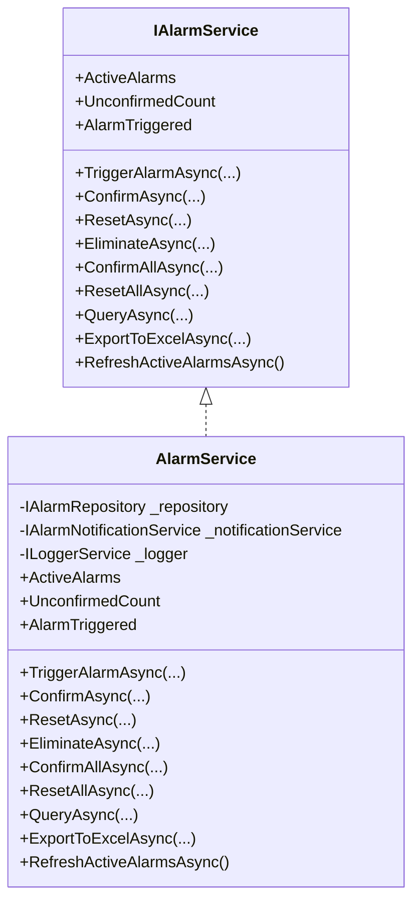

**图表来源**
- [IAlarmService.cs:11-75](file://AlarmModule/Interfaces/IAlarmService.cs#L11-L75)
- [AlarmService.cs:16-308](file://AlarmModule/Services/AlarmService.cs#L16-L308)

**章节来源**
- [AlarmService.cs:48-91](file://AlarmModule/Services/AlarmService.cs#L48-L91)
- [AlarmService.cs:96-155](file://AlarmModule/Services/AlarmService.cs#L96-L155)
- [AlarmService.cs:160-195](file://AlarmModule/Services/AlarmService.cs#L160-L195)
- [AlarmService.cs:200-255](file://AlarmModule/Services/AlarmService.cs#L200-L255)
- [AlarmService.cs:260-274](file://AlarmModule/Services/AlarmService.cs#L260-L274)

### AlarmNotificationService：报警通知服务
职责与特性：
- 等级通知策略：
  - Emergency：红色模态弹窗+持续蜂鸣
  - Serious：橙色模态弹窗+单次蜂鸣
  - General：黄色Toast+5秒自动消失
  - Prompt：蓝色Toast+3秒自动消失
- 通知控制：支持关闭所有通知（停止蜂鸣、清除Toast）

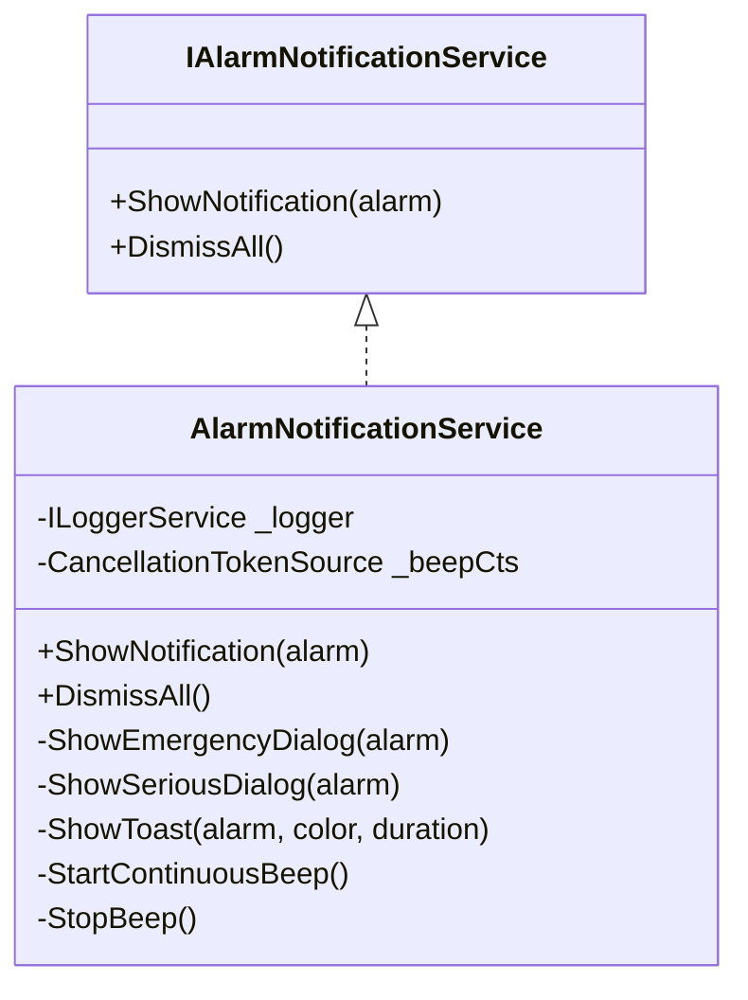

**图表来源**
- [IAlarmNotificationService.cs:10-21](file://AlarmModule/Interfaces/IAlarmNotificationService.cs#L10-L21)
- [AlarmNotificationService.cs:19-309](file://AlarmModule/Services/AlarmNotificationService.cs#L19-L309)

**章节来源**
- [AlarmNotificationService.cs:35-55](file://AlarmModule/Services/AlarmNotificationService.cs#L35-L55)
- [AlarmNotificationService.cs:68-130](file://AlarmModule/Services/AlarmNotificationService.cs#L68-L130)
- [AlarmNotificationService.cs:135-196](file://AlarmModule/Services/AlarmNotificationService.cs#L135-L196)
- [AlarmNotificationService.cs:202-270](file://AlarmModule/Services/AlarmNotificationService.cs#L202-L270)
- [AlarmNotificationService.cs:275-306](file://AlarmModule/Services/AlarmNotificationService.cs#L275-L306)

### AlarmRepository：报警数据访问
职责与特性：
- 每次数据库操作创建新的DbContext实例，避免Singleton场景下DbContext被disposed
- 报警记录CRUD、活跃报警查询、最近报警查找、批量确认/复位、分页查询、导出数据
- 阈值配置CRUD、查询所有配置
- 统计分析：按等级分布、按来源TopN、日趋势统计

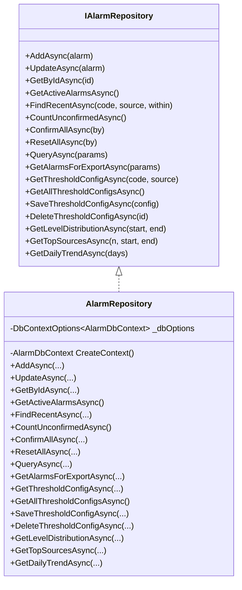

**图表来源**
- [IAlarmRepository.cs:11-32](file://AlarmModule/Interfaces/IAlarmRepository.cs#L11-L32)
- [AlarmRepository.cs:15-266](file://AlarmModule/Data/AlarmRepository.cs#L15-L266)

**章节来源**
- [AlarmRepository.cs:27-55](file://AlarmModule/Data/AlarmRepository.cs#L27-L55)
- [AlarmRepository.cs:57-65](file://AlarmModule/Data/AlarmRepository.cs#L57-L65)
- [AlarmRepository.cs:74-108](file://AlarmModule/Data/AlarmRepository.cs#L74-L108)
- [AlarmRepository.cs:110-137](file://AlarmModule/Data/AlarmRepository.cs#L110-L137)
- [AlarmRepository.cs:139-184](file://AlarmModule/Data/AlarmRepository.cs#L139-L184)
- [AlarmRepository.cs:186-241](file://AlarmModule/Data/AlarmRepository.cs#L186-L241)

### AlarmModule：模块注册器
职责与特性：
- 注册DbContextOptions（SQLite路径：Config/alarms.db）、AlarmRepository、AlarmService、AlarmNotificationService
- 注册导航视图（报警列表、历史、阈值配置、统计）
- 初始化数据库：EnsureCreated创建表结构

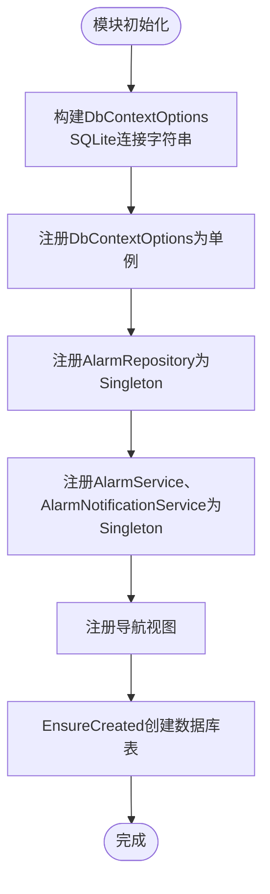

**图表来源**
- [AlarmModule.cs:21-56](file://AlarmModule/AlarmModule.cs#L21-L56)

**章节来源**
- [AlarmModule.cs:21-56](file://AlarmModule/AlarmModule.cs#L21-L56)

### 数据模型设计
- AlarmRecord：报警记录实体，包含时间、等级、代码、来源、类型、描述、触发值、阈值、状态、确认/复位信息、处理备注、防抖截止时间等
- AlarmThresholdConfig：阈值配置实体，包含报警代码、来源、阈值、等级、类型、防抖窗口、启用状态
- AlarmLevel：工业4级分类（Emergency、Serious、General、Prompt）
- AlarmStatus：生命周期状态（Unconfirmed、Confirmed、Reset、Eliminated）
- AlarmType：报警类型（HardwareFault、ParameterOutOfLimit、CommunicationError、ProcessError）
- AlarmQueryParams：查询参数（分页、时间范围、等级、来源、状态、类型、关键词）

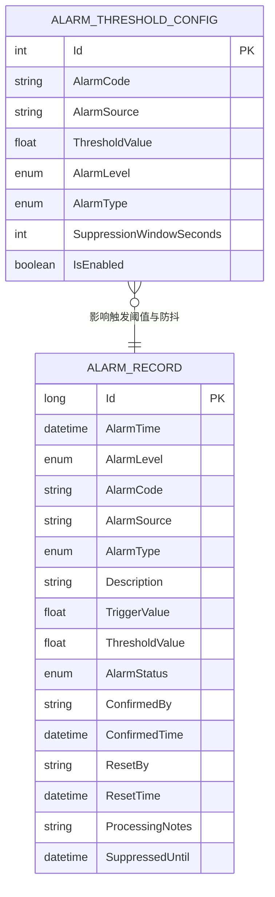

**图表来源**
- [AlarmRecord.cs:12-60](file://AlarmModule/Models/AlarmRecord.cs#L12-L60)
- [AlarmThresholdConfig.cs:10-35](file://AlarmModule/Models/AlarmThresholdConfig.cs#L10-L35)
- [AlarmLevel.cs:6-16](file://AlarmModule/Models/AlarmLevel.cs#L6-L16)
- [AlarmStatus.cs:6-16](file://AlarmModule/Models/AlarmStatus.cs#L6-L16)
- [AlarmType.cs:6-16](file://AlarmModule/Models/AlarmType.cs#L6-L16)
- [AlarmQueryParams.cs:9-32](file://AlarmModule/Models/AlarmQueryParams.cs#L9-L32)

**章节来源**
- [AlarmRecord.cs:12-60](file://AlarmModule/Models/AlarmRecord.cs#L12-L60)
- [AlarmThresholdConfig.cs:10-35](file://AlarmModule/Models/AlarmThresholdConfig.cs#L10-L35)
- [AlarmLevel.cs:6-16](file://AlarmModule/Models/AlarmLevel.cs#L6-L16)
- [AlarmStatus.cs:6-16](file://AlarmModule/Models/AlarmStatus.cs#L6-L16)
- [AlarmType.cs:6-16](file://AlarmModule/Models/AlarmType.cs#L6-L16)
- [AlarmQueryParams.cs:9-32](file://AlarmModule/Models/AlarmQueryParams.cs#L9-L32)

### 报警级别分类与状态管理
- 级别分类：Emergency（紧急停机）、Serious（严重故障）、General（一般报警）、Prompt（提示预警）
- 状态流转：Unconfirmed → Confirmed → Reset → Eliminated，各状态转换均有前置条件校验
- 防抖机制：同一Code+Source在SuppressionWindowSeconds内不重复触发，仅更新时间

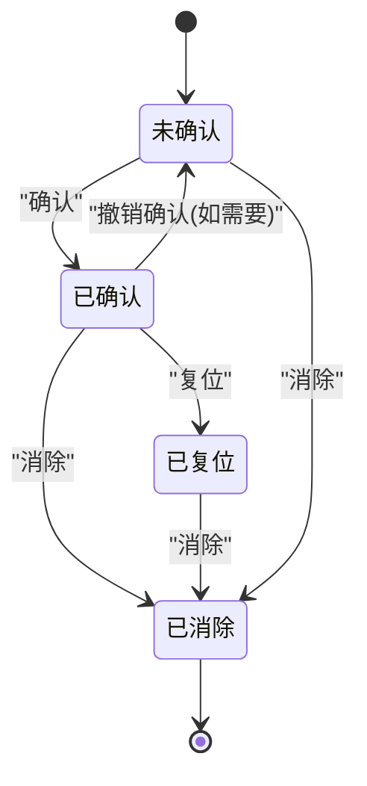

**图表来源**
- [AlarmStatus.cs:6-16](file://AlarmModule/Models/AlarmStatus.cs#L6-L16)
- [AlarmService.cs:96-155](file://AlarmModule/Services/AlarmService.cs#L96-L155)

**章节来源**
- [AlarmLevel.cs:6-16](file://AlarmModule/Models/AlarmLevel.cs#L6-L16)
- [AlarmStatus.cs:6-16](file://AlarmModule/Models/AlarmStatus.cs#L6-L16)
- [AlarmService.cs:48-91](file://AlarmModule/Services/AlarmService.cs#L48-L91)

### 报警阈值配置与历史查询
- 阈值配置：支持按报警代码+来源设置阈值、等级、类型、防抖窗口、启用状态
- 历史查询：支持多条件过滤（时间范围、等级、来源、状态、类型、关键词），分页返回
- 统计分析：等级分布、来源TopN、日趋势统计

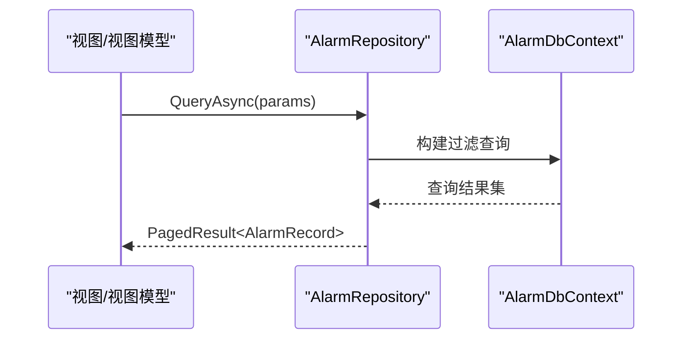

**图表来源**
- [AlarmRepository.cs:110-137](file://AlarmModule/Data/AlarmRepository.cs#L110-L137)
- [AlarmQueryParams.cs:9-32](file://AlarmModule/Models/AlarmQueryParams.cs#L9-L32)

**章节来源**
- [AlarmThresholdViewModel.cs:17-175](file://AlarmModule/ViewModels/AlarmThresholdViewModel.cs#L17-L175)
- [AlarmRepository.cs:110-137](file://AlarmModule/Data/AlarmRepository.cs#L110-L137)
- [AlarmRepository.cs:186-241](file://AlarmModule/Data/AlarmRepository.cs#L186-L241)

### 报警触发流程（含防抖）
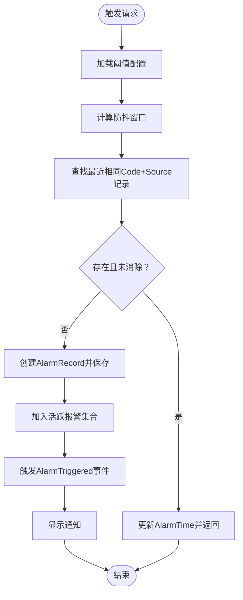

**图表来源**
- [AlarmService.cs:48-91](file://AlarmModule/Services/AlarmService.cs#L48-L91)
- [AlarmRepository.cs:57-65](file://AlarmModule/Data/AlarmRepository.cs#L57-L65)

**章节来源**
- [AlarmService.cs:48-91](file://AlarmModule/Services/AlarmService.cs#L48-L91)

## 依赖关系分析
- AlarmService依赖AlarmRepository与AlarmNotificationService，负责业务编排与UI事件发布
- AlarmRepository依赖AlarmDbContext（通过DbContextOptions），提供数据访问能力
- AlarmModule负责DI容器注册与数据库初始化
- ViewModel通过Prism命令调用服务，实现UI与业务解耦

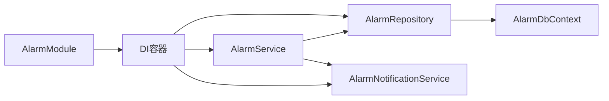

**图表来源**
- [AlarmModule.cs:21-56](file://AlarmModule/AlarmModule.cs#L21-L56)
- [AlarmService.cs:16-46](file://AlarmModule/Services/AlarmService.cs#L16-L46)
- [AlarmRepository.cs:15-22](file://AlarmModule/Data/AlarmRepository.cs#L15-L22)

**章节来源**
- [AlarmModule.cs:21-56](file://AlarmModule/AlarmModule.cs#L21-L56)
- [AlarmService.cs:16-46](file://AlarmModule/Services/AlarmService.cs#L16-L46)
- [AlarmRepository.cs:15-22](file://AlarmModule/Data/AlarmRepository.cs#L15-L22)

## 性能考虑
- DbContext实例化策略：AlarmRepository每次操作创建新AlarmDbContext，避免Singleton在并发或异步场景下的上下文生命周期问题
- 防抖机制：减少重复报警写入，降低数据库压力与UI抖动
- 分页查询：历史查询与导出采用分页与服务端过滤，避免一次性加载大量数据
- 统计查询：按需聚合（等级分布、来源TopN、日趋势），减少复杂联表查询

[本节为通用指导，无需特定文件来源]

## 故障排除指南
- 报警未触发或重复触发
  - 检查阈值配置是否存在以及SuppressionWindowSeconds设置是否合理
  - 查看日志输出，确认防抖逻辑是否生效
- 确认/复位/消除操作异常
  - 确认当前报警状态是否符合操作要求（仅未确认可确认，仅已确认可复位）
  - 查看异常信息，定位具体状态不匹配或记录不存在问题
- Excel导出失败
  - 检查目标路径权限与磁盘空间
  - 确认查询参数无误，避免超大数据量导致内存压力
- 通知未显示
  - 检查系统声音与弹窗权限
  - 紧急/严重等级需确认蜂鸣是否被手动停止

**章节来源**
- [AlarmService.cs:96-155](file://AlarmModule/Services/AlarmService.cs#L96-L155)
- [AlarmService.cs:208-255](file://AlarmModule/Services/AlarmService.cs#L208-L255)
- [AlarmNotificationService.cs:60-64](file://AlarmModule/Services/AlarmNotificationService.cs#L60-L64)

## 结论
AlarmModule提供了完整的报警管理能力：从触发、通知到生命周期管理与历史统计，配合灵活的阈值配置与强大的查询导出功能，满足工业场景对报警系统的高可用与可运维需求。模块设计遵循分层与依赖注入原则，具备良好的扩展性与可维护性。

[本节为总结性内容，无需特定文件来源]

## 附录

### 报警系统配置方法
- 阈值配置入口：导航至“报警阈值配置”视图，支持新增、编辑、删除与刷新
- 配置项说明：
  - 报警代码：唯一标识报警类型
  - 报警来源：可选，用于区分不同子系统或设备
  - 阈值：触发报警的数值边界
  - 报警等级：Emergency/Serious/General/Prompt
  - 报警类型：HardwareFault/ParameterOutOfLimit/CommunicationError/ProcessError
  - 防抖窗口（秒）：相同Code+Source的抑制时间
  - 启用状态：是否生效

**章节来源**
- [AlarmThresholdViewModel.cs:17-175](file://AlarmModule/ViewModels/AlarmThresholdViewModel.cs#L17-L175)
- [AlarmThresholdConfig.cs:10-35](file://AlarmModule/Models/AlarmThresholdConfig.cs#L10-L35)

### 自定义报警规则与扩展开发指南
- 扩展报警类型：在AlarmType中新增枚举值，并在通知与UI中适配显示
- 扩展报警等级：在AlarmLevel中新增枚举值，调整通知样式与行为
- 自定义通知策略：在AlarmNotificationService中增加等级分支，扩展弹窗或Toast样式
- 自定义查询维度：在AlarmQueryParams中添加筛选字段，在AlarmRepository中扩展查询构建逻辑
- 自定义统计指标：在AlarmRepository中新增统计查询方法，配合视图模型展示

**章节来源**
- [AlarmType.cs:6-16](file://AlarmModule/Models/AlarmType.cs#L6-L16)
- [AlarmLevel.cs:6-16](file://AlarmModule/Models/AlarmLevel.cs#L6-L16)
- [AlarmNotificationService.cs:35-55](file://AlarmModule/Services/AlarmNotificationService.cs#L35-L55)
- [AlarmQueryParams.cs:9-32](file://AlarmModule/Models/AlarmQueryParams.cs#L9-L32)
- [AlarmRepository.cs:243-263](file://AlarmModule/Data/AlarmRepository.cs#L243-L263)