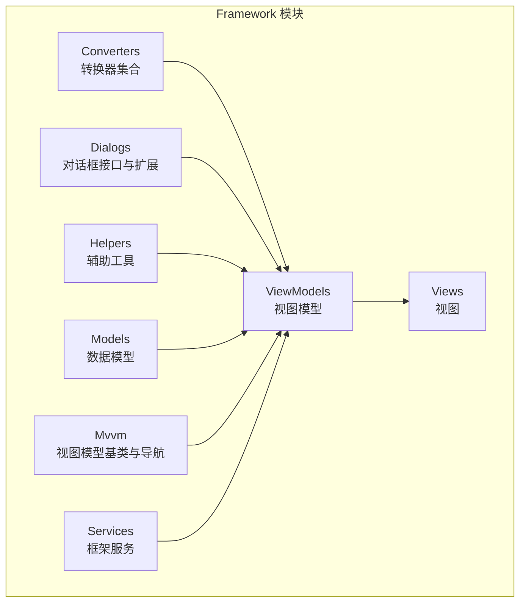
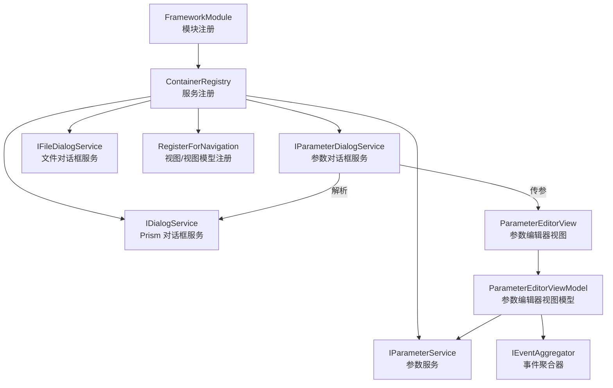
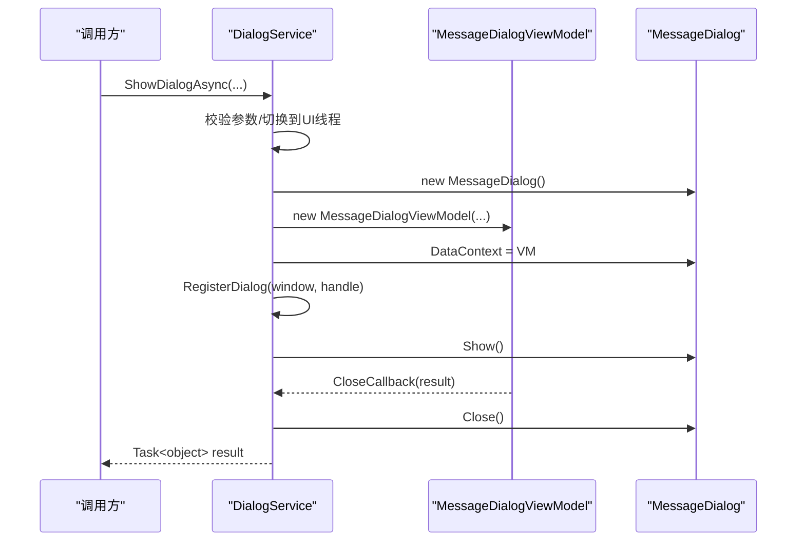
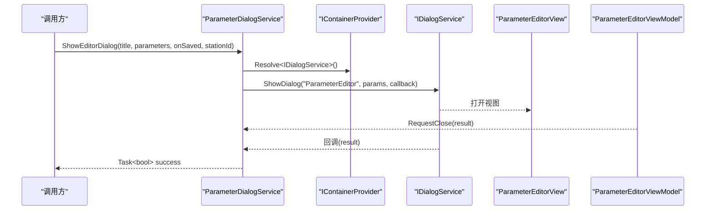
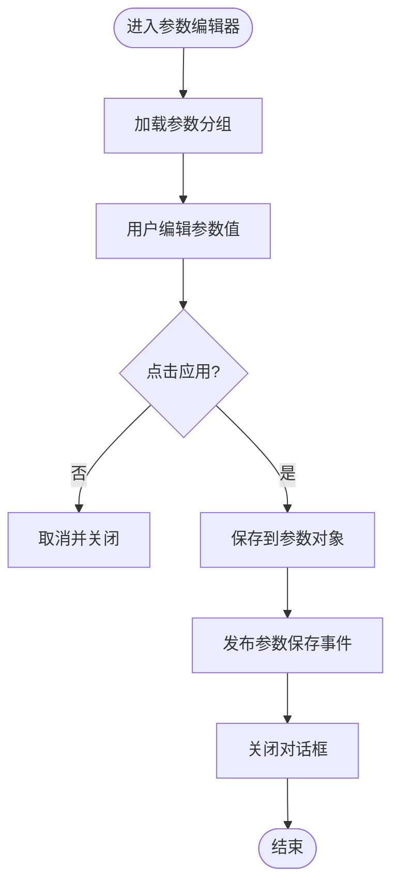
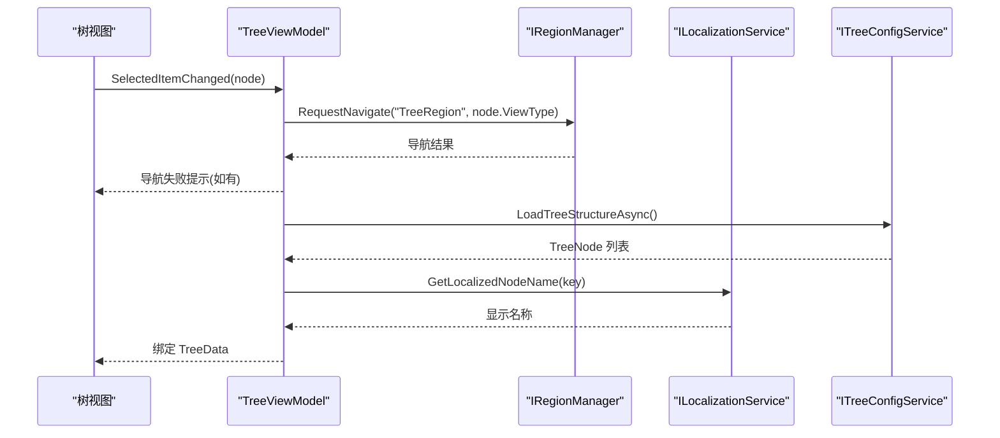
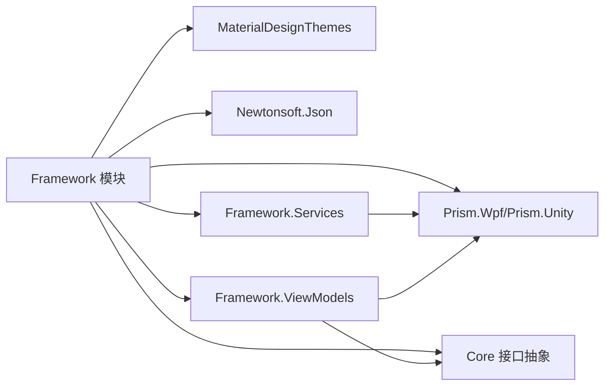

# 框架支撑模块

<cite>
**本文档引用的文件**
- [Framework.csproj](file://Framework/Framework.csproj)
- [FrameworkModule.cs](file://Framework/FrameworkModule.cs)
- [DialogService.cs](file://Framework/Services/DialogService.cs)
- [ParameterDialogService.cs](file://Framework/Services/ParameterDialogService.cs)
- [FileDialogService.cs](file://Framework/Services/FileDialogService.cs)
- [ParameterEditorViewModel.cs](file://Framework/ViewModels/ParameterEditorViewModel.cs)
- [TreeViewModel.cs](file://Framework/ViewModels/TreeViewModel.cs)
- [ViewModelBase.cs](file://Framework/Mvvm/ViewModelBase.cs)
- [RegionViewModelBase.cs](file://Framework/Mvvm/RegionViewModelBase.cs)
- [ParameterTemplateSelector.cs](file://Framework/ViewModels/ParameterTemplateSelector.cs)
- [BooleanToVisibilityConverter.cs](file://Framework/Converters/BooleanToVisibilityConverter.cs)
- [IParameterEditor.cs](file://Core/Abstraction/IParameterEditor.cs)
- [IParameterDialogService.cs](file://Core/Abstraction/IParameterDialogService.cs)
- [IParameterService.cs](file://Core/Abstraction/IParameterService.cs)
- [IFileDialogService.cs](file://Framework/Dialogs/IFileDialogService.cs)
</cite>

## 目录
1. [简介](#简介)
2. [项目结构](#项目结构)
3. [核心组件](#核心组件)
4. [架构总览](#架构总览)
5. [详细组件分析](#详细组件分析)
6. [依赖分析](#依赖分析)
7. [性能考虑](#性能考虑)
8. [故障排查指南](#故障排查指南)
9. [结论](#结论)
10. [附录](#附录)

## 简介
Framework 模块是 GZQL_MACHINE 的通用支撑层，面向 WPF 应用提供统一的 UI 组件库、对话框服务、导航管理、参数编辑器以及通用视图模型基类等能力。其设计理念强调：
- 模块化与可插拔：通过 Prism 模块化机制注册服务与对话框，便于按需启用。
- 低耦合高内聚：以接口抽象为核心，将 UI 与业务逻辑解耦，便于替换与扩展。
- 可复用性：提供通用的参数编辑器、文件对话框、树形导航等组件，减少重复开发。
- 可维护性：统一的视图模型基类、转换器集合与模板选择器，保证 UI 行为一致性。

## 项目结构
Framework 模块采用按功能域划分的目录组织方式，主要包含以下层次：
- Converters：通用 WPF 转换器集合，用于视图绑定与显示控制。
- Dialogs：对话框相关接口与扩展，统一文件对话框服务。
- Helpers：辅助工具（如数值格式化、增量行为等）。
- Models：参数与树形节点等数据模型（当前为空目录，预留扩展）。
- Mvvm：MVVM 基类与导航模型，提供统一的生命周期与导航能力。
- Services：框架级服务，包括对话框服务、参数对话框服务、文件对话框服务、可取消操作服务等。
- ViewModels：具体视图对应的 ViewModel，如参数编辑器、树形视图、忙碌指示器等。
- Views：对应视图的 XAML 与后台代码（XAML 文件未在本节展开）。

**图表来源**
- [Framework.csproj:1-38](file://Framework/Framework.csproj#L1-L38)

**章节来源**
- [Framework.csproj:1-38](file://Framework/Framework.csproj#L1-L38)

## 核心组件
本节聚焦 Framework 模块提供的核心服务与组件，并说明其职责与交互关系。

- 对话框服务（DialogService）
  - 提供阻塞/非阻塞对话框展示、异步对话框、提示气泡（Toast）等能力。
  - 内部维护打开对话框的弱引用集合，确保资源释放与线程安全。
  - 与 MaterialDesignThemes 集成，支持图标与主题样式。

- 参数对话框服务（ParameterDialogService）
  - 基于 Prism 的对话框系统，封装参数编辑器的打开流程。
  - 通过容器解析 IDialogService，传递标题、参数对象、保存回调与工站标识等参数。

- 文件对话框服务（FileDialogService）
  - 封装 .NET 原生 Open/Save 对话框，提供统一的接口与默认行为。

- 参数编辑器（ParameterEditorViewModel）
  - 通过反射扫描 TaskParametersBase 的属性，动态构建参数分组与项。
  - 支持字符串、布尔、数值、枚举等多种参数类型，具备搜索过滤、重置默认值、应用变更、事件发布等能力。
  - 与 IParameterService 协作加载/保存参数，与 IEventAggregator 发布参数保存事件。

- 树形导航（TreeViewModel）
  - 基于 ITreeConfigService 加载树结构，结合 ILocalizationService 实现多语言显示。
  - 通过 Prism 导航到目标视图，支持节点增删改与本地化键生成。

- 视图模型基类（ViewModelBase、RegionViewModelBase）
  - 提供通用的生命周期管理与导航接口实现，简化子类开发。

- 参数模板选择器（ParameterTemplateSelector）
  - 根据参数项类型选择合适的 DataTemplate，提升 UI 渲染灵活性。

**章节来源**
- [DialogService.cs:1-432](file://Framework/Services/DialogService.cs#L1-L432)
- [ParameterDialogService.cs:1-49](file://Framework/Services/ParameterDialogService.cs#L1-L49)
- [FileDialogService.cs:1-30](file://Framework/Services/FileDialogService.cs#L1-L30)
- [ParameterEditorViewModel.cs:1-511](file://Framework/ViewModels/ParameterEditorViewModel.cs#L1-L511)
- [TreeViewModel.cs:1-298](file://Framework/ViewModels/TreeViewModel.cs#L1-L298)
- [ViewModelBase.cs:1-16](file://Framework/Mvvm/ViewModelBase.cs#L1-L16)
- [RegionViewModelBase.cs:1-33](file://Framework/Mvvm/RegionViewModelBase.cs#L1-L33)
- [ParameterTemplateSelector.cs:1-41](file://Framework/ViewModels/ParameterTemplateSelector.cs#L1-L41)

## 架构总览
Framework 模块通过 Prism 的模块化机制进行服务注册与对话框注册，形成“接口抽象 + 容器注入 + 视图导航”的整体架构。核心交互如下：

**图表来源**
- [FrameworkModule.cs:31-55](file://Framework/FrameworkModule.cs#L31-L55)
- [ParameterDialogService.cs:19-46](file://Framework/Services/ParameterDialogService.cs#L19-L46)
- [ParameterEditorViewModel.cs:489-508](file://Framework/ViewModels/ParameterEditorViewModel.cs#L489-L508)

**章节来源**
- [FrameworkModule.cs:1-59](file://Framework/FrameworkModule.cs#L1-L59)

## 详细组件分析

### 对话框服务（DialogService）
- 设计要点
  - 线程安全：在 UI 线程调度，避免跨线程访问 WPF 对象。
  - 异步与同步并存：提供阻塞/非阻塞、异步回调、自动关闭等模式。
  - 资源管理：使用弱引用集合跟踪打开的对话框，窗口关闭时清理句柄。
- 关键流程（异步阻塞对话框）
  - 参数校验与 UI 线程切换。
  - 构造 MessageDialog 与 ViewModel，设置按钮与图标。
  - 注册对话框句柄，显示窗口并等待结果。
  - 回调设置结果并关闭窗口，返回 Task 结果。

**图表来源**
- [DialogService.cs:244-408](file://Framework/Services/DialogService.cs#L244-L408)

**章节来源**
- [DialogService.cs:1-432](file://Framework/Services/DialogService.cs#L1-L432)

### 参数对话框服务（ParameterDialogService）
- 设计要点
  - 通过容器解析 IDialogService，统一使用 Prism 对话框系统。
  - 将标题、参数对象、保存回调、工站标识等打包为 DialogParameters。
  - 使用 TaskCompletionSource 将回调转换为 Task<bool>，便于 await。
- 使用场景
  - 在任意模块中打开参数编辑器对话框，传入目标参数对象与保存回调。

**图表来源**
- [ParameterDialogService.cs:19-46](file://Framework/Services/ParameterDialogService.cs#L19-L46)
- [ParameterEditorViewModel.cs:489-508](file://Framework/ViewModels/ParameterEditorViewModel.cs#L489-L508)

**章节来源**
- [ParameterDialogService.cs:1-49](file://Framework/Services/ParameterDialogService.cs#L1-L49)

### 参数编辑器（ParameterEditorViewModel）
- 设计要点
  - 反射构建参数分组：支持 Category、DisplayName、Description、Range 等特性。
  - 类型转换：针对数值、枚举、布尔等类型进行转换与格式化。
  - 搜索过滤：支持按名称/显示名/描述过滤参数项。
  - 事件发布：保存完成后发布 StationParameterSavedEvent。
- 关键流程（应用变更）
  - 将 UI 值保存回 TaskParametersBase 对应属性。
  - 触发保存回调，发布参数保存事件，关闭对话框。

**图表来源**
- [ParameterEditorViewModel.cs:134-161](file://Framework/ViewModels/ParameterEditorViewModel.cs#L134-L161)

**章节来源**
- [ParameterEditorViewModel.cs:1-511](file://Framework/ViewModels/ParameterEditorViewModel.cs#L1-L511)

### 树形导航（TreeViewModel）
- 设计要点
  - 通过 ITreeConfigService 加载树结构，结合 ILocalizationService 实现本地化显示名称。
  - 通过 Prism 导航到目标视图（根据节点 ViewType）。
  - 支持节点增删改与本地化键生成，保存树配置。
- 关键流程（导航到视图）
  - 选择节点 -> 读取 ViewType -> RegionManager 导航 -> 处理导航结果。

**图表来源**
- [TreeViewModel.cs:194-209](file://Framework/ViewModels/TreeViewModel.cs#L194-L209)

**章节来源**
- [TreeViewModel.cs:1-298](file://Framework/ViewModels/TreeViewModel.cs#L1-L298)

### 视图模型基类（ViewModelBase、RegionViewModelBase）
- 设计要点
  - ViewModelBase：提供通用销毁钩子，便于资源清理。
  - RegionViewModelBase：实现 INavigationAware 与 IConfirmNavigationRequest，统一导航生命周期。

**章节来源**
- [ViewModelBase.cs:1-16](file://Framework/Mvvm/ViewModelBase.cs#L1-L16)
- [RegionViewModelBase.cs:1-33](file://Framework/Mvvm/RegionViewModelBase.cs#L1-L33)

### 参数模板选择器（ParameterTemplateSelector）
- 设计要点
  - 根据参数项类型（字符串、布尔、数值、枚举、颜色、嵌套对象）选择对应 DataTemplate。
  - 提升 UI 渲染灵活性与可维护性。

**章节来源**
- [ParameterTemplateSelector.cs:1-41](file://Framework/ViewModels/ParameterTemplateSelector.cs#L1-L41)

### 转换器集合（BooleanToVisibilityConverter）
- 设计要点
  - 支持布尔到可见性的正向/反向转换，参数可选“Inverse”实现取反。
  - 提供 ConvertBack，便于双向绑定场景。

**章节来源**
- [BooleanToVisibilityConverter.cs:1-47](file://Framework/Converters/BooleanToVisibilityConverter.cs#L1-L47)

## 依赖分析
Framework 模块的依赖关系如下：
- 外部依赖
  - Prism.Wpf/Prism.Unity：模块化、容器、导航与对话框集成。
  - MaterialDesignThemes：对话框主题与图标支持。
  - Newtonsoft.Json：序列化/反序列化（参数存储）。
- 内部依赖
  - Core：接口抽象（IParameterService、IParameterDialogService、IParameterEditor 等）。
  - Framework 自身：Services 依赖 Prism 容器；ViewModels 依赖 Services 与 Core 接口。

**图表来源**
- [Framework.csproj:12-21](file://Framework/Framework.csproj#L12-L21)
- [FrameworkModule.cs:1-12](file://Framework/FrameworkModule.cs#L1-L12)

**章节来源**
- [Framework.csproj:1-38](file://Framework/Framework.csproj#L1-L38)
- [FrameworkModule.cs:1-59](file://Framework/FrameworkModule.cs#L1-L59)

## 性能考虑
- 对话框服务
  - 使用弱引用集合跟踪打开的对话框，避免内存泄漏；在关闭时及时清理句柄。
  - 非阻塞对话框采用 STA 线程与 Dispatcher，避免 UI 阻塞。
- 参数编辑器
  - 反射构建参数分组时，尽量缓存属性元数据，减少重复反射开销。
  - 搜索过滤仅影响 UI 可见性，不改变底层数据结构。
- 树形导航
  - 本地化名称计算与导航请求均在主线程执行，避免跨线程访问。
  - 节点增删改后批量保存树配置，减少频繁 IO。
- 通用建议
  - 将耗时操作（如网络/IO）放入后台线程，避免阻塞 UI。
  - 使用延迟加载与虚拟化渲染（如 TreeView）提升大数据量场景下的性能。

[本节为通用指导，无需列出具体文件来源]

## 故障排查指南
- 对话框无法显示或立即关闭
  - 检查 Application.Current 与 Dispatcher 是否可用。
  - 确认窗口所有者（Owner）设置正确，避免空引用导致居中异常。
  - 查看 RegisterDialog 的清理逻辑是否提前触发。
- 参数编辑器未生效
  - 确认 TaskParametersBase 属性具备公共 setter 且未标注忽略特性。
  - 检查类型转换逻辑，确保目标类型与实际值兼容。
  - 核对保存回调与事件发布是否正确触发。
- 树形导航失败
  - 检查节点 ViewType 是否有效，RegionManager 是否存在目标区域。
  - 确认本地化键生成规则与资源文件是否匹配。
- 转换器异常
  - 检查 Convert/ConvertBack 的参数类型与文化设置。
  - 对于布尔到可见性的转换，确认“Inverse”参数拼写与大小写。

**章节来源**
- [DialogService.cs:83-86](file://Framework/Services/DialogService.cs#L83-L86)
- [ParameterEditorViewModel.cs:225-236](file://Framework/ViewModels/ParameterEditorViewModel.cs#L225-L236)
- [TreeViewModel.cs:194-209](file://Framework/ViewModels/TreeViewModel.cs#L194-L209)
- [BooleanToVisibilityConverter.cs:14-44](file://Framework/Converters/BooleanToVisibilityConverter.cs#L14-L44)

## 结论
Framework 模块通过清晰的接口抽象、模块化注册与统一的 MVVM 基类，为上层模块提供了稳定可靠的 UI 与交互基础。其对话框服务、参数编辑器、树形导航与转换器集合共同构成了一个可扩展、可维护的通用支撑层。建议在后续迭代中进一步完善缓存策略、日志监控与单元测试覆盖，以提升整体质量与可测性。

[本节为总结性内容，无需列出具体文件来源]

## 附录

### 模块化设计与服务注册机制
- FrameworkModule 在 RegisterTypes 中完成：
  - 参数编辑器与存储：IParameterEditor -> ParameterEditorService；IParameterStorage -> JsonParameterStorage。
  - 参数对话框服务：IParameterDialogService -> ParameterDialogService（单例）。
  - 文件对话框服务：IFileDialogService -> FileDialogService。
  - 对话框注册：MessageDialog、NotificationDialog、CancelableOperationDialog 等。
  - 参数服务：IParameterService -> ParameterService（单例）。
  - 视图/视图模型注册：ParameterEditor、BusyIndicator 等。

**章节来源**
- [FrameworkModule.cs:31-55](file://Framework/FrameworkModule.cs#L31-L55)

### 通用视图模型基类与扩展接口
- ViewModelBase：提供 Destroy 生命周期钩子，便于资源清理。
- RegionViewModelBase：实现导航接口，统一导航生命周期。
- IParameterEditor：参数编辑器接口，面向上层模块暴露统一能力。
- IParameterDialogService：参数对话框服务接口，便于替换实现。
- IParameterService：参数加载/保存/重置接口，便于替换存储实现。
- IFileDialogService：文件对话框服务接口，便于替换实现。

**章节来源**
- [ViewModelBase.cs:1-16](file://Framework/Mvvm/ViewModelBase.cs#L1-L16)
- [RegionViewModelBase.cs:1-33](file://Framework/Mvvm/RegionViewModelBase.cs#L1-L33)
- [IParameterEditor.cs:1-14](file://Core/Abstraction/IParameterEditor.cs#L1-L14)
- [IParameterDialogService.cs:1-9](file://Core/Abstraction/IParameterDialogService.cs#L1-L9)
- [IParameterService.cs:1-24](file://Core/Abstraction/IParameterService.cs#L1-L24)
- [IFileDialogService.cs:1-28](file://Framework/Dialogs/IFileDialogService.cs#L1-L28)