# 模块化架构设计

<cite>
**本文档引用的文件**
- [MainApp/App.xaml.cs](file://MainApp/App.xaml.cs)
- [Framework/FrameworkModule.cs](file://Framework/FrameworkModule.cs)
- [AlarmModule/AlarmModule.cs](file://AlarmModule/AlarmModule.cs)
- [MotionControl/MotionControlModule.cs](file://MotionControl/MotionControlModule.cs)
- [RecipeManagement/RecipeModule.cs](file://RecipeManagement/RecipeModule.cs)
- [StationTasks/StationTasksModule.cs](file://StationTasks/StationTasksModule.cs)
- [ModuleCore/ModuleCore.cs](file://ModuleCore/ModuleCore.cs)
- [Module/PrimModel.cs](file://Module/PrimModel.cs)
- [TCPIPModule/TCPIPModule.cs](file://TCPIPModule/TCPIPModule.cs)
- [Core/Abstraction/IStationRegistry.cs](file://Core/Abstraction/IStationRegistry.cs)
- [Core/Services/StationRegistry.cs](file://Core/Services/StationRegistry.cs)
- [Core/Events/SystemInitializedEvent.cs](file://Core/Events/SystemInitializedEvent.cs)
- [.trae/rules/summary.md](file://.trae/rules/summary.md)
</cite>

## 目录
1. [引言](#引言)
2. [项目结构](#项目结构)
3. [核心组件](#核心组件)
4. [架构概览](#架构概览)
5. [详细组件分析](#详细组件分析)
6. [依赖关系分析](#依赖关系分析)
7. [性能考量](#性能考量)
8. [故障排除指南](#故障排除指南)
9. [结论](#结论)
10. [附录](#附录)

## 引言
本文件面向GZQL_MACHINE的模块化架构，基于Prism模块化框架实现，系统性阐述模块注册、生命周期管理与模块间通信机制。文档覆盖主应用程序模块(MainApp)、框架模块(Framework)、报警模块(AlarmModule)、运动控制模块(MotionControl)、配方管理模块(RecipeManagement)、工站任务模块(StationTasks)、通用核心模块(ModuleCore)、UI模块(Module)以及网络模块(TCPIPModule)的职责划分、依赖关系、接口设计与事件传递机制，并给出模块加载顺序、初始化流程与卸载策略建议。

## 项目结构
GZQL_MACHINE采用多项目解决方案，遵循“按功能域分层”的模块化组织方式：
- MainApp：WPF壳工程，负责应用启动、Prism容器初始化、模块目录配置与全局异常处理。
- Core：抽象层与通用服务，提供接口契约、事件模型、工具类与通用业务能力。
- Framework：通用UI框架与对话框服务，提供参数编辑、树形配置、消息提示等基础能力。
- AlarmModule：工业级报警管理，SQLite本地存储，提供报警触发、确认、复位、统计与阈值配置。
- MotionControl：运动控制与安全系统，含轴控制、夹爪、IO、系统状态监控与任务管理。
- RecipeManagement：配方管理与插件体系，支持配方存储、池化管理、对话框与编辑器。
- StationTasks：工站任务编排与执行，包含多种工艺步骤动作、视觉解析与交互信号。
- ModuleCore：登录/权限/导航等通用功能模块。
- Module：主界面与业务视图导航，集成Core服务与Module服务。
- TCPIPModule：自包含TCP通信模块，支持服务器/客户端模式，配置持久化。

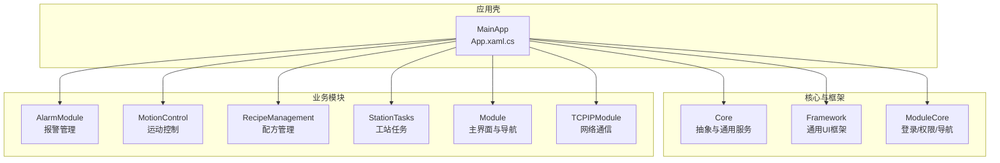

图表来源
- [MainApp/App.xaml.cs:179-191](file://MainApp/App.xaml.cs#L179-L191)
- [Framework/FrameworkModule.cs:15-56](file://Framework/FrameworkModule.cs#L15-L56)
- [AlarmModule/AlarmModule.cs:16-58](file://AlarmModule/AlarmModule.cs#L16-L58)
- [MotionControl/MotionControlModule.cs:15-77](file://MotionControl/MotionControlModule.cs#L15-L77)
- [RecipeManagement/RecipeModule.cs:22-49](file://RecipeManagement/RecipeModule.cs#L22-L49)
- [StationTasks/StationTasksModule.cs:16-64](file://StationTasks/StationTasksModule.cs#L16-L64)
- [ModuleCore/ModuleCore.cs:19-46](file://ModuleCore/ModuleCore.cs#L19-L46)
- [Module/PrimModel.cs:21-115](file://Module/PrimModel.cs#L21-L115)
- [TCPIPModule/TCPIPModule.cs:16-90](file://TCPIPModule/TCPIPModule.cs#L16-L90)

章节来源
- [MainApp/App.xaml.cs:179-191](file://MainApp/App.xaml.cs#L179-L191)
- [.trae/rules/summary.md:96-107](file://.trae/rules/summary.md#L96-L107)

## 核心组件
本节概述各模块的核心职责与边界：
- MainApp：应用入口，配置Prism容器、注册核心服务、构建模块目录、处理全局异常与诊断。
- Framework：提供参数编辑、对话框、树形配置、消息提示等通用UI能力，作为上层模块的基础支撑。
- AlarmModule：提供报警生命周期管理与本地数据库持久化，支持导航视图与阈值配置。
- MotionControl：提供运动控制、夹爪、IO、系统状态监控与任务管理，保障安全与可调试性。
- RecipeManagement：配方存储、池化管理、插件体系与编辑对话框，支撑多工站参数管理。
- StationTasks：工站任务编排与执行，注册多种步骤动作与视觉解析器，实现工站自注册。
- ModuleCore：登录/权限/导航等通用功能，为系统提供基础能力。
- Module：主界面导航与业务视图，集成Core与Module服务。
- TCPIPModule：自包含TCP通信，支持服务器/客户端模式，异步初始化避免阻塞。

章节来源
- [Framework/FrameworkModule.cs:15-56](file://Framework/FrameworkModule.cs#L15-L56)
- [AlarmModule/AlarmModule.cs:16-58](file://AlarmModule/AlarmModule.cs#L16-L58)
- [MotionControl/MotionControlModule.cs:15-77](file://MotionControl/MotionControlModule.cs#L15-L77)
- [RecipeManagement/RecipeModule.cs:22-49](file://RecipeManagement/RecipeModule.cs#L22-L49)
- [StationTasks/StationTasksModule.cs:16-64](file://StationTasks/StationTasksModule.cs#L16-L64)
- [ModuleCore/ModuleCore.cs:19-46](file://ModuleCore/ModuleCore.cs#L19-L46)
- [Module/PrimModel.cs:21-115](file://Module/PrimModel.cs#L21-L115)
- [TCPIPModule/TCPIPModule.cs:16-90](file://TCPIPModule/TCPIPModule.cs#L16-L90)

## 架构概览
GZQL_MACHINE采用Prism.Modularity + Unity容器实现模块化，遵循以下原则：
- 模块注册：在MainApp中通过IModuleCatalog集中注册所有模块。
- 生命周期：每个模块实现IModule接口，包含RegisterTypes与OnInitialized两个阶段。
- 事件总线：使用Prism.Events(IEventAggregator)进行松耦合通信。
- 依赖注入：通过IContainerRegistry注册服务，支持Singleton、Transient与Dialog注册。
- 模块加载顺序：由规则文件定义，确保关键子系统优先初始化。

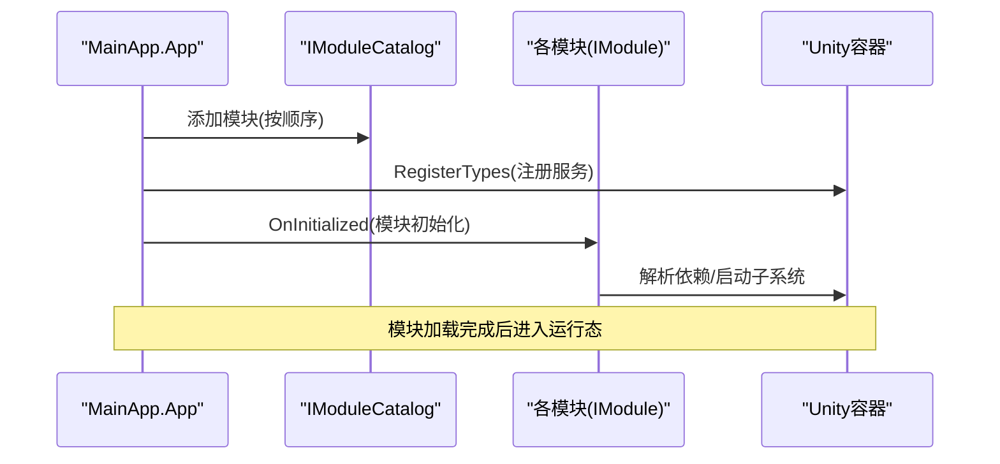

图表来源
- [MainApp/App.xaml.cs:179-191](file://MainApp/App.xaml.cs#L179-L191)
- [Framework/FrameworkModule.cs:31-55](file://Framework/FrameworkModule.cs#L31-L55)
- [MotionControl/MotionControlModule.cs:23-46](file://MotionControl/MotionControlModule.cs#L23-L46)
- [StationTasks/StationTasksModule.cs:56-62](file://StationTasks/StationTasksModule.cs#L56-L62)

章节来源
- [.trae/rules/summary.md:96-107](file://.trae/rules/summary.md#L96-L107)

## 详细组件分析

### 主应用程序模块(MainApp)
- 职责：应用启动、Prism容器初始化、模块目录配置、全局异常处理与诊断。
- 关键点：
  - 构建配置与注册核心服务（日志、配置、本地化、站点注册表等）。
  - 在ConfigureModuleCatalog中集中注册所有模块，明确加载顺序。
  - 提供全局异常捕获与崩溃转储生成，保障稳定性。
  - 在OnInitialized中初始化服务依赖、TCP系统与视觉系统。

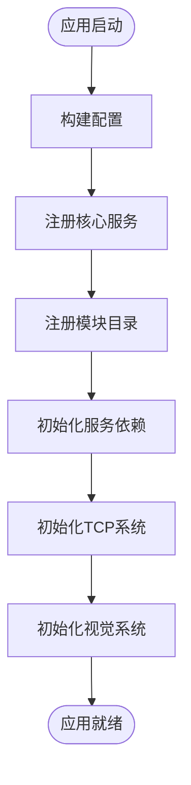

图表来源
- [MainApp/App.xaml.cs:59-72](file://MainApp/App.xaml.cs#L59-L72)
- [MainApp/App.xaml.cs:110-119](file://MainApp/App.xaml.cs#L110-L119)
- [MainApp/App.xaml.cs:179-191](file://MainApp/App.xaml.cs#L179-L191)

章节来源
- [MainApp/App.xaml.cs:59-72](file://MainApp/App.xaml.cs#L59-L72)
- [MainApp/App.xaml.cs:110-119](file://MainApp/App.xaml.cs#L110-L119)
- [MainApp/App.xaml.cs:179-191](file://MainApp/App.xaml.cs#L179-L191)

### 框架模块(Framework)
- 职责：提供参数编辑、对话框、树形配置、消息提示等通用UI能力。
- 关键点：
  - 注册参数编辑器、参数存储、参数对话框服务与树形配置服务。
  - 注册常用导航视图与对话框，如参数编辑器、忙碌指示器、可取消操作对话框等。
  - 通过IEventAggregator预留参数保存进度事件。

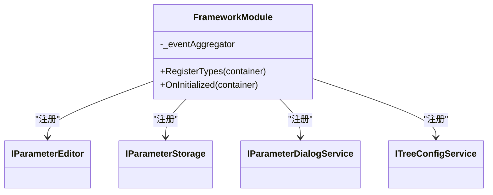

图表来源
- [Framework/FrameworkModule.cs:15-56](file://Framework/FrameworkModule.cs#L15-L56)

章节来源
- [Framework/FrameworkModule.cs:15-56](file://Framework/FrameworkModule.cs#L15-L56)

### 报警模块(AlarmModule)
- 职责：工业级报警管理，支持报警触发、确认、复位、消除与统计分析。
- 关键点：
  - 使用SQLite本地数据库持久化报警数据，避免Singleton DbContext在异步场景下被释放。
  - 在OnInitialized中确保数据库表结构创建。
  - 注册导航视图（列表、历史、阈值、统计）。

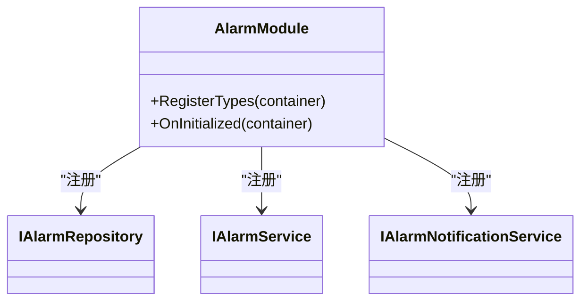

图表来源
- [AlarmModule/AlarmModule.cs:16-58](file://AlarmModule/AlarmModule.cs#L16-L58)

章节来源
- [AlarmModule/AlarmModule.cs:16-58](file://AlarmModule/AlarmModule.cs#L16-L58)

### 运动控制模块(MotionControl)
- 职责：运动控制、夹爪、IO、系统状态监控与任务管理。
- 关键点：
  - 在OnInitialized中异步初始化运动服务、夹爪服务与系统状态监控。
  - 注册运动卡工厂、运动服务、系统状态服务、速度覆盖服务、任务管理器等。
  - 提供轴参数设置、IO显示、速度控制、可恢复故障对话框等导航视图。

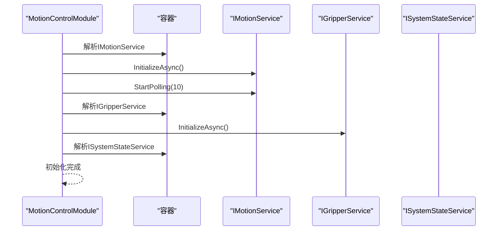

图表来源
- [MotionControl/MotionControlModule.cs:23-46](file://MotionControl/MotionControlModule.cs#L23-L46)

章节来源
- [MotionControl/MotionControlModule.cs:23-46](file://MotionControl/MotionControlModule.cs#L23-L46)

### 配方管理模块(RecipeManagement)
- 职责：配方存储、池化管理、插件体系与编辑对话框。
- 关键点：
  - 注册插件管理器、配方存储、配方池服务、配方对话框服务。
  - 提供配方管理器与多工站位置编辑器的导航视图与对话框。

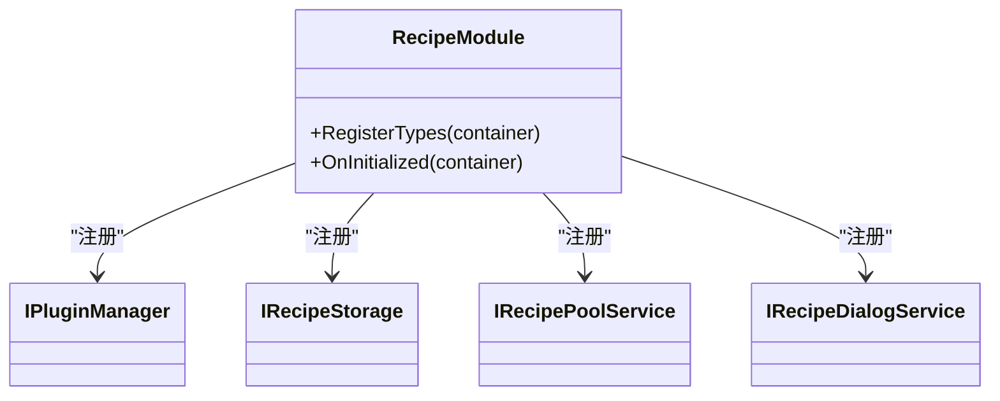

图表来源
- [RecipeManagement/RecipeModule.cs:22-49](file://RecipeManagement/RecipeModule.cs#L22-L49)

章节来源
- [RecipeManagement/RecipeModule.cs:22-49](file://RecipeManagement/RecipeModule.cs#L22-L49)

### 工站任务模块(StationTasks)
- 职责：工站任务编排与执行，注册多种步骤动作与视觉解析器。
- 关键点：
  - 使用DryIoc注册ITask与IProcessStepAction实现，确保单例生命周期。
  - 在OnInitialized中强制解析所有ITask单例，触发工站自注册到IStationRegistry。
  - 注册视觉数据解析器、工站交互服务、位置提供者、配方服务工厂等。

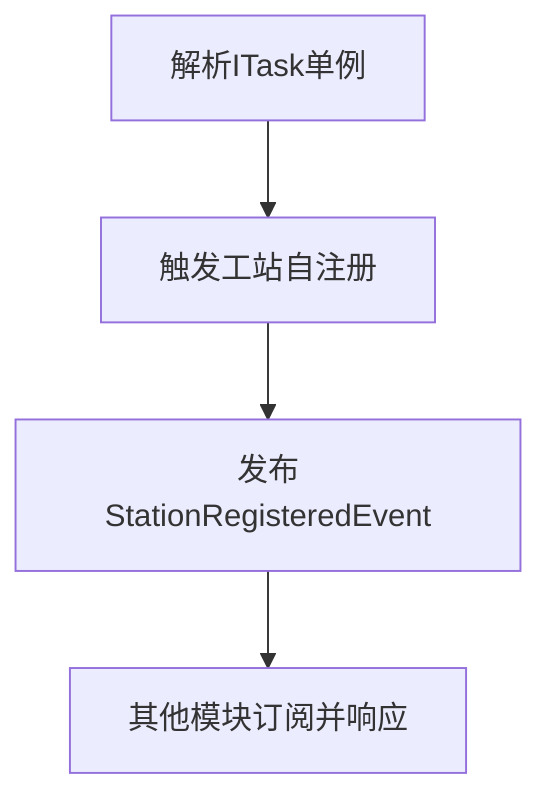

图表来源
- [StationTasks/StationTasksModule.cs:56-62](file://StationTasks/StationTasksModule.cs#L56-L62)
- [Core/Services/StationRegistry.cs:24-38](file://Core/Services/StationRegistry.cs#L24-L38)

章节来源
- [StationTasks/StationTasksModule.cs:56-62](file://StationTasks/StationTasksModule.cs#L56-L62)
- [Core/Services/StationRegistry.cs:24-38](file://Core/Services/StationRegistry.cs#L24-L38)

### 通用核心模块(ModuleCore)
- 职责：登录/权限/导航等通用功能，确保配置目录存在。
- 关键点：
  - 注册导航模型、登录模型与各类对话框。
  - 在OnInitialized中确保Config目录存在。

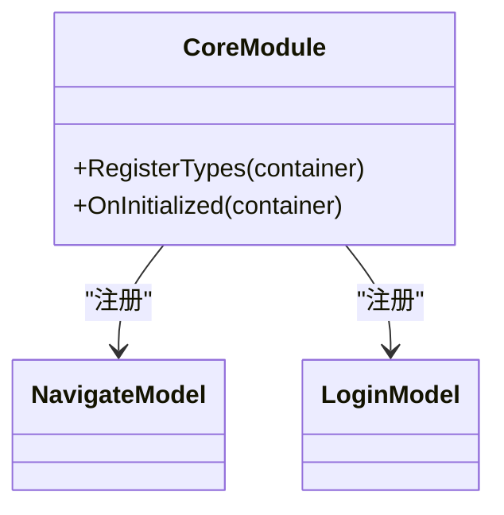

图表来源
- [ModuleCore/ModuleCore.cs:19-46](file://ModuleCore/ModuleCore.cs#L19-L46)

章节来源
- [ModuleCore/ModuleCore.cs:19-46](file://ModuleCore/ModuleCore.cs#L19-L46)

### UI模块(Module)
- 职责：主界面导航与业务视图，集成Core与Module服务。
- 关键点：
  - 注册导航菜单与大量业务视图/对话框。
  - 集成Core服务（公式求值、DXF解析、ROI工具、坐标对齐）与Module服务（点胶执行、点胶绘制）。
  - 通过导航模型提供统一的导航体验。

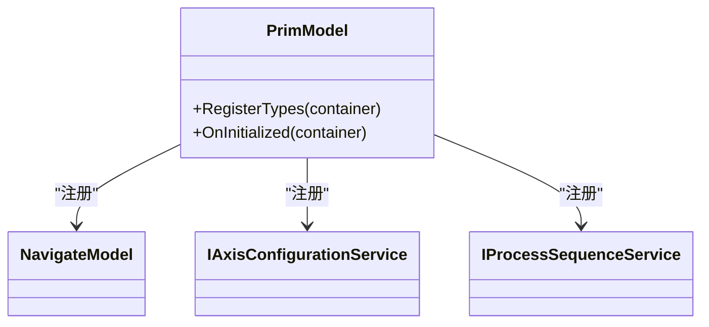

图表来源
- [Module/PrimModel.cs:21-115](file://Module/PrimModel.cs#L21-L115)

章节来源
- [Module/PrimModel.cs:21-115](file://Module/PrimModel.cs#L21-L115)

### 网络模块(TCPIPModule)
- 职责：自包含TCP通信，支持服务器/客户端模式，配置持久化。
- 关键点：
  - 注册TCP客户端管理服务与TCP事件服务。
  - 在OnInitialized中异步初始化TCP系统，避免阻塞模块加载。
  - 根据配置项的Mode字段分别启动服务器或客户端。

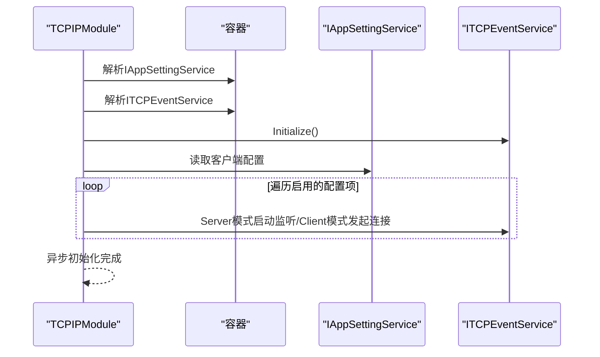

图表来源
- [TCPIPModule/TCPIPModule.cs:37-88](file://TCPIPModule/TCPIPModule.cs#L37-L88)

章节来源
- [TCPIPModule/TCPIPModule.cs:37-88](file://TCPIPModule/TCPIPModule.cs#L37-L88)

## 依赖关系分析
模块间依赖关系与通信机制：
- 事件总线：Prism.Events(IEventAggregator)用于模块间解耦通信，如工站注册/注销事件、轴状态变更、系统初始化事件等。
- 服务依赖：各模块通过IContainerRegistry注册服务，MainApp集中注册核心服务，模块间通过接口契约解耦。
- 工站自注册：StationTasksModule强制解析ITask单例，触发工站自注册到IStationRegistry，其他模块通过事件订阅响应。

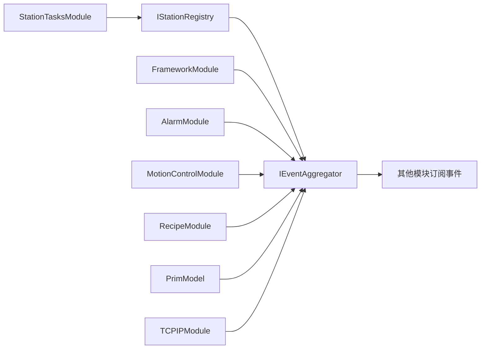

图表来源
- [StationTasks/StationTasksModule.cs:56-62](file://StationTasks/StationTasksModule.cs#L56-L62)
- [Core/Services/StationRegistry.cs:24-38](file://Core/Services/StationRegistry.cs#L24-L38)
- [Core/Events/SystemInitializedEvent.cs:5](file://Core/Events/SystemInitializedEvent.cs#L5)

章节来源
- [Core/Abstraction/IStationRegistry.cs:7-20](file://Core/Abstraction/IStationRegistry.cs#L7-L20)
- [Core/Services/StationRegistry.cs:24-38](file://Core/Services/StationRegistry.cs#L24-L38)
- [Core/Events/SystemInitializedEvent.cs:5](file://Core/Events/SystemInitializedEvent.cs#L5)

## 性能考量
- 模块加载顺序优化：依据规则文件，确保关键子系统（运动控制、工站任务、UI导航）在应用启动后尽快可用。
- 异步初始化：TCPIPModule与MotionControlModule均采用异步初始化，避免阻塞主线程。
- 事件总线轻量化：仅发布必要事件，避免频繁高开销事件风暴。
- 服务生命周期：合理使用Singleton与Transient，减少对象创建与销毁成本。
- 数据持久化：AlarmModule使用SQLite，注意I/O优化与事务批处理。

## 故障排除指南
- 全局异常处理：MainApp实现了DispatcherUnhandledException、AppDomain.UnhandledException与TaskScheduler.UnobservedTaskException的统一处理，生成崩溃转储与错误报告。
- 运动控制安全：所有运动API支持CancellationToken，支持急停快速打断；可恢复故障通过RecoverableException携带建议操作。
- 日志与诊断：统一使用NLog与ILoggerService，关键路径输出详细日志，便于定位问题。
- 模块初始化失败：检查各模块的RegisterTypes与OnInitialized实现，关注异常日志与容器解析失败。

章节来源
- [MainApp/App.xaml.cs:343-455](file://MainApp/App.xaml.cs#L343-L455)
- [MotionControl/MotionControlModule.cs:41-45](file://MotionControl/MotionControlModule.cs#L41-L45)

## 结论
GZQL_MACHINE的模块化架构以Prism为核心，结合Unity容器与事件总线，实现了清晰的职责分离与松耦合通信。通过规范的模块注册、生命周期管理与事件驱动机制，系统具备良好的扩展性与可维护性。建议在后续开发中持续完善模块间契约设计、增强可观测性与自动化测试，以进一步提升系统的稳定性与可演进性。

## 附录
- 模块加载顺序参考：LogViewer → Language → Framework → Alarm → MotionControl → Recipe → StationTasks → ModuleCore → Module → TCPIP
- 关键事件清单：轴报警、轴状态变更、全局急停、全局复位、可恢复故障、工站状态变更、运动完成、语言切换、工站注册/注销、工艺步骤序列事件

章节来源
- [.trae/rules/summary.md:96-121](file://.trae/rules/summary.md#L96-L121)