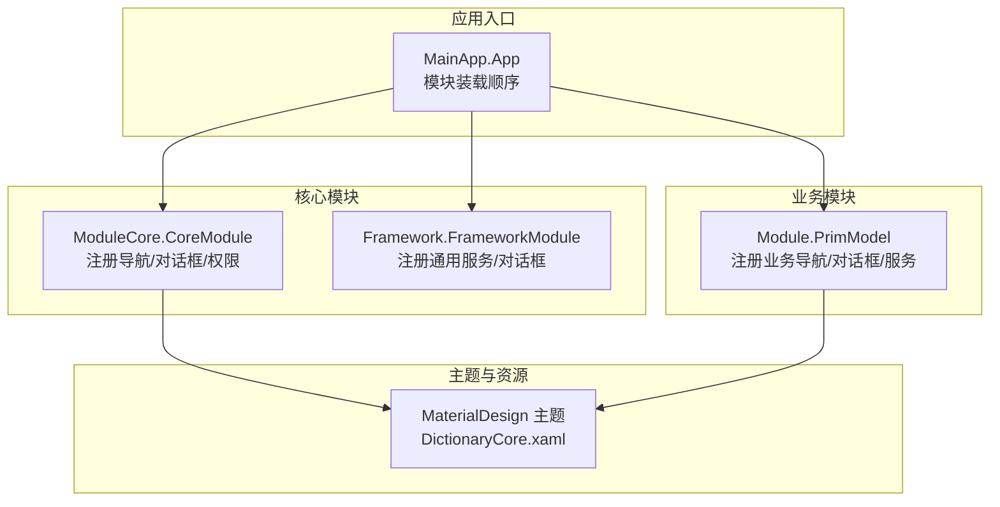
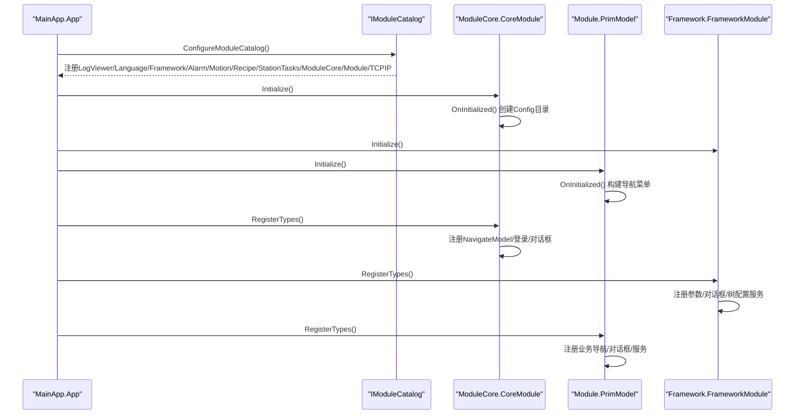
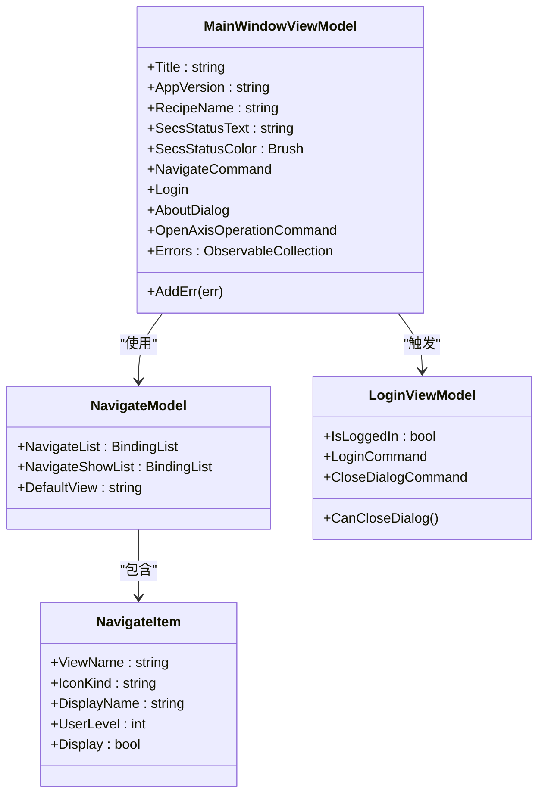
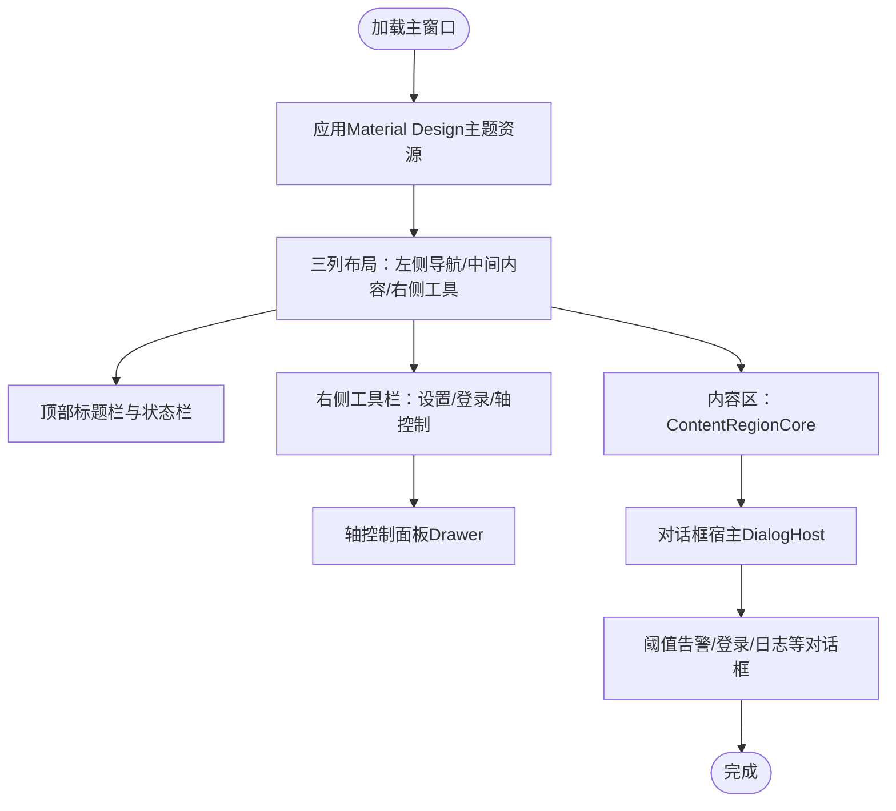
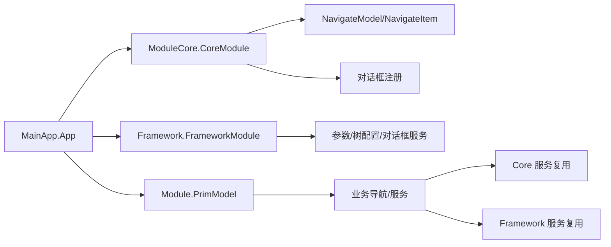
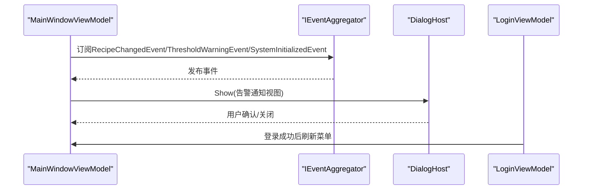
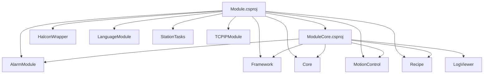

# 模块核心集成

<cite>
**本文引用的文件**
- [ModuleCore.csproj](file://ModuleCore/ModuleCore.csproj)
- [Module.csproj](file://Module/Module.csproj)
- [CoreModule.cs](file://ModuleCore/ModuleCore.cs)
- [PrimModel.cs](file://Module/PrimModel.cs)
- [App.xaml.cs](file://MainApp/App.xaml.cs)
- [MainWindowViewModel.cs](file://ModuleCore/ViewModels/MainWindowViewModel.cs)
- [MainWindow.xaml](file://ModuleCore/Views/MainWindow.xaml)
- [FrameworkModule.cs](file://Framework/FrameworkModule.cs)
- [NavigateModel.cs](file://Framework/Mvvm/NavigateModel.cs)
- [NavigateItem.cs](file://Framework/Mvvm/NavigateItem.cs)
- [DictionaryCore.xaml](file://ModuleCore/DictionaryCore.xaml)
- [LoginViewModel.cs](file://ModuleCore/ViewModels/LoginViewModel.cs)
- [IStationRegistry.cs](file://Core/Abstraction/IStationRegistry.cs)
</cite>

## 目录
1. [引言](#引言)
2. [项目结构](#项目结构)
3. [核心组件](#核心组件)
4. [架构总览](#架构总览)
5. [详细组件分析](#详细组件分析)
6. [依赖关系分析](#依赖关系分析)
7. [性能考虑](#性能考虑)
8. [故障排除指南](#故障排除指南)
9. [结论](#结论)
10. [附录](#附录)

## 引言
本文件面向“GZQL_MACHINE”的模块核心集成，聚焦于ModuleCore与Module两大模块的协同设计与运行机制。文档从系统架构、导航与视图模型管理、资源与主题应用、模块间协作与资源共享、状态同步、扩展与通信协议、最佳实践与性能优化、以及故障排除等方面进行系统化阐述，帮助开发者快速理解并高效扩展该系统的模块化能力。

## 项目结构
- ModuleCore：提供主界面外壳、导航模型、登录与权限、对话框体系、Material Design主题资源等核心能力，并通过Prism模块化框架注册导航与对话框。
- Module：承载业务功能视图与视图模型，注册大量业务导航项与对话框，同时复用Core与Framework的服务能力，形成完整的业务模块。
- MainApp：应用入口，负责模块装载顺序、全局服务注册与异常处理。
- Framework：提供通用的参数编辑、树形配置、对话框服务等基础能力，供多个模块共享。
- Core：提供跨模块可复用的抽象接口、服务与模型，如公式求值、DXF解析、坐标对齐、工站注册表等。

图表来源
- [App.xaml.cs:179-191](file://MainApp/App.xaml.cs#L179-L191)
- [CoreModule.cs:26-45](file://ModuleCore/ModuleCore.cs#L26-L45)
- [FrameworkModule.cs:31-55](file://Framework/FrameworkModule.cs#L31-L55)
- [PrimModel.cs:51-114](file://Module/PrimModel.cs#L51-L114)
- [DictionaryCore.xaml:1-9](file://ModuleCore/DictionaryCore.xaml#L1-L9)

章节来源
- [ModuleCore.csproj:1-83](file://ModuleCore/ModuleCore.csproj#L1-L83)
- [Module.csproj:1-630](file://Module/Module.csproj#L1-L630)
- [App.xaml.cs:179-191](file://MainApp/App.xaml.cs#L179-L191)

## 核心组件
- 导航与视图模型
  - NavigateModel/NavigateItem：统一维护导航列表、显示列表与默认视图，支持按用户权限筛选展示项。
  - MainWindowViewModel：负责加载默认视图、权限菜单呈现、登录对话框、日志查看器、阈值告警弹窗、轴控制面板等。
- 登录与权限
  - LoginModel与LoginViewModel：提供登录流程、自动登出定时器、访客限制与管理入口。
- 对话框体系
  - CoreModule集中注册常用对话框（登录、注册、用户管理、设置、日志、确认、错误等），统一由IDialogService驱动。
- Material Design主题
  - DictionaryCore.xaml合并Light主题、Material Design 3默认样式与深紫/柠檬配色方案，确保界面风格一致。
- 业务导航
  - PrimModel在OnInitialized阶段构建导航菜单（首页、操作页面、报警、IO视图、配方管理、TCPIP设置等），并在RegisterTypes中注册大量业务视图与服务。

章节来源
- [NavigateModel.cs:1-30](file://Framework/Mvvm/NavigateModel.cs#L1-L30)
- [NavigateItem.cs:1-47](file://Framework/Mvvm/NavigateItem.cs#L1-L47)
- [MainWindowViewModel.cs:71-115](file://ModuleCore/ViewModels/MainWindowViewModel.cs#L71-L115)
- [LoginViewModel.cs:15-106](file://ModuleCore/ViewModels/LoginViewModel.cs#L15-L106)
- [CoreModule.cs:26-45](file://ModuleCore/ModuleCore.cs#L26-L45)
- [DictionaryCore.xaml:1-9](file://ModuleCore/DictionaryCore.xaml#L1-L9)
- [PrimModel.cs:23-49](file://Module/PrimModel.cs#L23-L49)
- [PrimModel.cs:51-114](file://Module/PrimModel.cs#L51-L114)

## 架构总览
ModuleCore与Module通过Prism模块化框架实现解耦协作：
- ModuleCore提供主界面外壳、导航与对话框基础设施，以及Material Design主题。
- Module注册业务导航与服务，复用Core与Framework的能力，形成完整的业务功能集合。
- MainApp统一配置模块装载顺序与全局服务，确保模块初始化的确定性。

图表来源
- [App.xaml.cs:179-191](file://MainApp/App.xaml.cs#L179-L191)
- [CoreModule.cs:21-24](file://ModuleCore/ModuleCore.cs#L21-L24)
- [FrameworkModule.cs:23-29](file://Framework/FrameworkModule.cs#L23-L29)
- [PrimModel.cs:23-49](file://Module/PrimModel.cs#L23-L49)
- [CoreModule.cs:26-45](file://ModuleCore/ModuleCore.cs#L26-L45)
- [FrameworkModule.cs:31-55](file://Framework/FrameworkModule.cs#L31-L55)
- [PrimModel.cs:51-114](file://Module/PrimModel.cs#L51-L114)

## 详细组件分析

### 导航与视图模型管理
- 导航模型
  - NavigateModel维护完整导航列表与当前显示列表，支持默认视图设置与权限过滤。
  - NavigateItem包含视图名、图标、显示名、用户级别与显示开关，用于菜单渲染与权限控制。
- 视图模型
  - MainWindowViewModel负责延迟加载默认视图、权限菜单呈现、登录对话框、日志查看器、阈值告警弹窗、轴控制面板等。
  - 通过RegionManager在ContentRegionCore中进行视图导航；通过DialogService统一管理对话框。
- 登录与权限
  - LoginViewModel处理登录流程、密码校验、自动登出定时器与管理入口；MainWindowViewModel在登录后刷新菜单显示。

图表来源
- [NavigateModel.cs:6-29](file://Framework/Mvvm/NavigateModel.cs#L6-L29)
- [NavigateItem.cs:5-46](file://Framework/Mvvm/NavigateItem.cs#L5-L46)
- [MainWindowViewModel.cs:36-115](file://ModuleCore/ViewModels/MainWindowViewModel.cs#L36-L115)
- [LoginViewModel.cs:15-106](file://ModuleCore/ViewModels/LoginViewModel.cs#L15-L106)

章节来源
- [NavigateModel.cs:1-30](file://Framework/Mvvm/NavigateModel.cs#L1-L30)
- [NavigateItem.cs:1-47](file://Framework/Mvvm/NavigateItem.cs#L1-L47)
- [MainWindowViewModel.cs:71-115](file://ModuleCore/ViewModels/MainWindowViewModel.cs#L71-L115)
- [LoginViewModel.cs:15-106](file://ModuleCore/ViewModels/LoginViewModel.cs#L15-L106)

### Material Design主题与界面设计
- 主题资源
  - DictionaryCore.xaml引入Light主题、Material Design 3默认样式与深紫/柠檬配色，确保全局一致性。
- 界面元素
  - MainWindow.xaml采用三列布局：左侧导航菜单、中间内容区（ContentRegionCore）、右侧工具栏；顶部标题栏与状态栏提供用户信息、配方、SECS/GEM状态与版本信息；底部浮动错误列表与对话框宿主（DialogHost）支撑交互体验。
- 动画与交互
  - 右侧工具栏按钮采用圆角阴影与缩放动画；轴控制面板通过Drawer从右侧滑出，支持遮罩层点击关闭。

图表来源
- [DictionaryCore.xaml:1-9](file://ModuleCore/DictionaryCore.xaml#L1-L9)
- [MainWindow.xaml:26-89](file://ModuleCore/Views/MainWindow.xaml#L26-L89)
- [MainWindow.xaml:203-606](file://ModuleCore/Views/MainWindow.xaml#L203-L606)

章节来源
- [DictionaryCore.xaml:1-9](file://ModuleCore/DictionaryCore.xaml#L1-L9)
- [MainWindow.xaml:26-89](file://ModuleCore/Views/MainWindow.xaml#L26-L89)
- [MainWindow.xaml:203-606](file://ModuleCore/Views/MainWindow.xaml#L203-L606)

### 模块间协作与资源共享
- 模块装载顺序
  - MainApp在ConfigureModuleCatalog中按固定顺序注册各模块，确保依赖先行初始化。
- 服务共享
  - CoreModule注册NavigateModel与登录/对话框；FrameworkModule注册参数编辑、树配置、对话框服务；PrimModel注册业务导航与服务，并复用Core与Framework能力。
- 事件与状态
  - MainWindowViewModel订阅RecipeChangedEvent与ThresholdWarningEvent，实现配方切换与阈值告警的响应式更新。

图表来源
- [App.xaml.cs:179-191](file://MainApp/App.xaml.cs#L179-L191)
- [CoreModule.cs:26-45](file://ModuleCore/ModuleCore.cs#L26-L45)
- [FrameworkModule.cs:31-55](file://Framework/FrameworkModule.cs#L31-L55)
- [PrimModel.cs:51-114](file://Module/PrimModel.cs#L51-L114)

章节来源
- [App.xaml.cs:179-191](file://MainApp/App.xaml.cs#L179-L191)
- [CoreModule.cs:26-45](file://ModuleCore/ModuleCore.cs#L26-L45)
- [FrameworkModule.cs:31-55](file://Framework/FrameworkModule.cs#L31-L55)
- [PrimModel.cs:51-114](file://Module/PrimModel.cs#L51-L114)

### 状态同步与用户交互
- 状态同步
  - 通过IEventAggregator发布/订阅事件（如RecipeChangedEvent、ThresholdWarningEvent、SystemInitializedEvent）实现跨模块状态同步。
- 用户交互
  - 登录流程：LoginViewModel校验密码、设置登录状态、启动自动登出定时器；MainWindowViewModel在登录后刷新菜单与显示。
  - 阈值告警：MainWindowViewModel订阅ThresholdWarningEvent，使用DialogHost展示告警通知视图。
  - 日志查看：MainWindowViewModel在默认视图加载完成后异步打开日志查看器对话框。

图表来源
- [MainWindowViewModel.cs:95-130](file://ModuleCore/ViewModels/MainWindowViewModel.cs#L95-L130)
- [MainWindowViewModel.cs:139-146](file://ModuleCore/ViewModels/MainWindowViewModel.cs#L139-L146)
- [LoginViewModel.cs:38-55](file://ModuleCore/ViewModels/LoginViewModel.cs#L38-L55)

章节来源
- [MainWindowViewModel.cs:95-130](file://ModuleCore/ViewModels/MainWindowViewModel.cs#L95-L130)
- [MainWindowViewModel.cs:139-146](file://ModuleCore/ViewModels/MainWindowViewModel.cs#L139-L146)
- [LoginViewModel.cs:38-55](file://ModuleCore/ViewModels/LoginViewModel.cs#L38-L55)

### 模块扩展接口与自定义功能开发
- 扩展点
  - IStationRegistry：工站注册表接口，解决模块加载时序导致的注入为空问题，便于按需查询与管理工站。
- 自定义功能
  - 在PrimModel中新增NavigateItem并注册对应视图/视图模型，即可快速接入新功能页面。
  - 通过FrameworkModule注册通用服务（参数编辑、树配置、对话框），减少重复实现。
- 模块间通信
  - 使用Prism的RegionManager与DialogService进行视图导航与对话框通信；使用IEventAggregator进行松耦合事件通信。

章节来源
- [IStationRegistry.cs:1-21](file://Core/Abstraction/IStationRegistry.cs#L1-L21)
- [PrimModel.cs:23-49](file://Module/PrimModel.cs#L23-L49)
- [FrameworkModule.cs:31-55](file://Framework/FrameworkModule.cs#L31-L55)

## 依赖关系分析
- 项目级依赖
  - ModuleCore.csproj引用AlarmModule、Framework、MotionControl、Recipe、Core、LogViewer等模块，表明其作为核心壳层承担整合职责。
  - Module.csproj引用AlarmModule、Core、Framework、HalconWrapper、LanguageModule、ModuleCore、MotionControl、StationTasks、Recipe、TCPIPModule等，体现业务模块的广泛集成。
- 模块间依赖
  - ModuleCore依赖Framework进行通用服务与对话框；Module依赖Core与Framework提供业务与通用能力；MainApp统一装载所有模块。

图表来源
- [ModuleCore.csproj:39-48](file://ModuleCore/ModuleCore.csproj#L39-L48)
- [Module.csproj:619-629](file://Module/Module.csproj#L619-L629)

章节来源
- [ModuleCore.csproj:39-48](file://ModuleCore/ModuleCore.csproj#L39-L48)
- [Module.csproj:619-629](file://Module/Module.csproj#L619-L629)

## 性能考虑
- 导航与视图加载
  - MainWindowViewModel在构造函数中延迟加载默认视图，避免主线程阻塞，提升首屏体验。
- 对话框与覆盖层
  - 使用OverlayRegion与DialogHost承载覆盖层与对话框，避免频繁重建视图，降低UI开销。
- 事件订阅
  - 使用IEventAggregator进行事件通信，避免强耦合，减少不必要的广播与回调链路。
- 资源与主题
  - Material Design主题资源集中管理，减少重复资源加载与样式冲突。

章节来源
- [MainWindowViewModel.cs:183-191](file://ModuleCore/ViewModels/MainWindowViewModel.cs#L183-L191)
- [MainWindow.xaml:282-294](file://ModuleCore/Views/MainWindow.xaml#L282-L294)

## 故障排除指南
- 登录与权限
  - 若登录后无法进入设置页面，检查NavigateItem的UserLevel与权限等级；确认LoginViewModel的CanCloseDialog返回正确值。
- 阈值告警
  - 若告警未弹出，检查MainWindowViewModel是否正确订阅ThresholdWarningEvent；确认DialogHost的标识符匹配。
- 日志查看器
  - 若日志窗口未显示，检查ShowLogViewer中的对话框参数与RegionManager的注册情况。
- 模块装载
  - 若模块未生效，核对MainApp.ConfigureModuleCatalog中的注册顺序与模块命名空间是否正确。
- 全局异常
  - App.xaml.cs中已实现DispatcherUnhandledException、UnhandledException与UnobservedTaskException的统一处理与崩溃转储生成，便于定位问题。

章节来源
- [LoginViewModel.cs:140-143](file://ModuleCore/ViewModels/LoginViewModel.cs#L140-L143)
- [MainWindowViewModel.cs:106-130](file://ModuleCore/ViewModels/MainWindowViewModel.cs#L106-L130)
- [MainWindowViewModel.cs:375-389](file://ModuleCore/ViewModels/MainWindowViewModel.cs#L375-L389)
- [App.xaml.cs:179-191](file://MainApp/App.xaml.cs#L179-L191)
- [App.xaml.cs:343-401](file://MainApp/App.xaml.cs#L343-L401)

## 结论
ModuleCore与Module通过Prism模块化框架实现了清晰的职责分离与高内聚低耦合的协作模式。ModuleCore提供统一的主题、导航与对话框基础设施，Module则专注于业务功能的快速集成与扩展。配合Core与Framework提供的通用能力，系统具备良好的可维护性、可扩展性与用户体验一致性。建议在后续开发中遵循现有注册与事件通信模式，保持模块边界清晰，持续完善日志与异常处理机制。

## 附录
- 模块装载顺序参考
  - MainApp.ConfigureModuleCatalog中注册顺序：LogViewer → LanguageModule → Framework → AlarmModule → MotionControl → RecipeModule → StationTasks → ModuleCore → Module → TCPIPModule。
- 导航菜单构建参考
  - PrimModel.OnInitialized中添加导航项（首页、操作页面、报警、IO视图、配方管理、TCPIP设置等），并设置默认视图为“OverView”。

章节来源
- [App.xaml.cs:179-191](file://MainApp/App.xaml.cs#L179-L191)
- [PrimModel.cs:23-49](file://Module/PrimModel.cs#L23-L49)