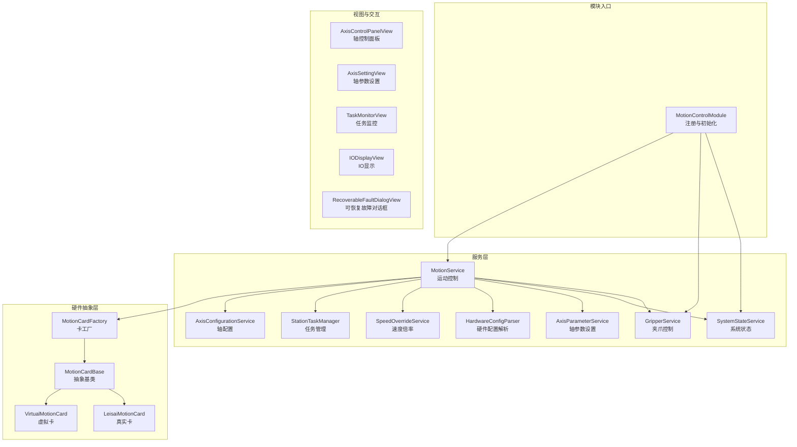
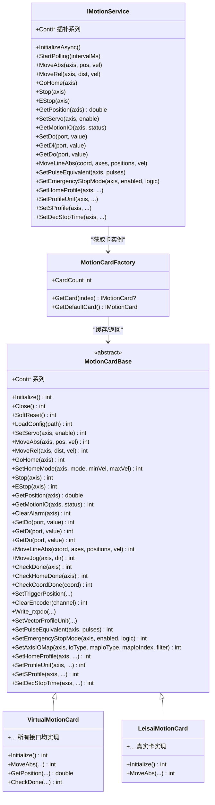
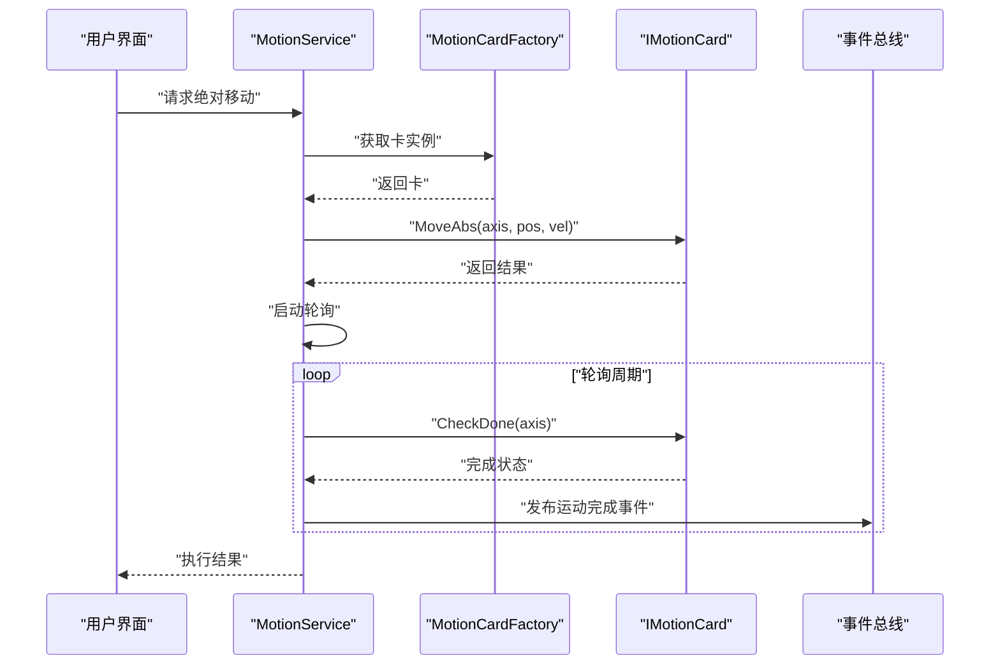
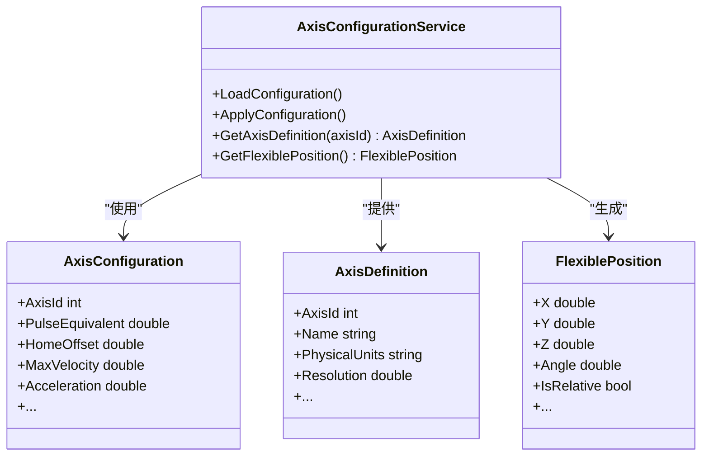
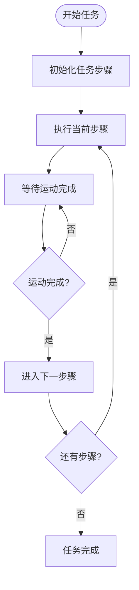
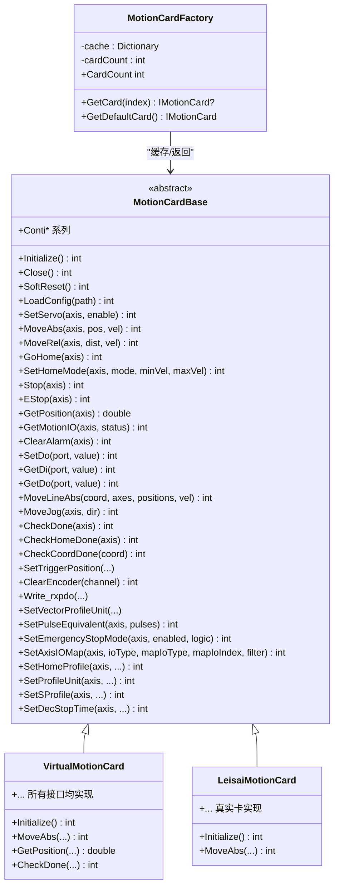
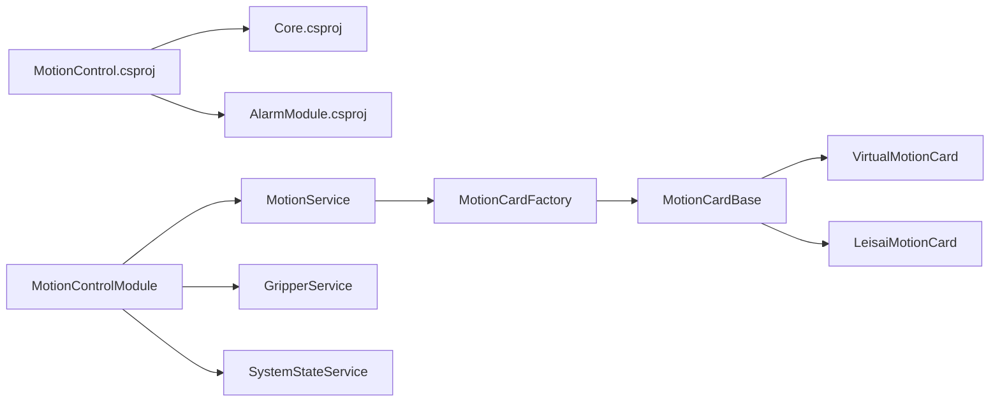

# 运动控制模块

<cite>
**本文引用的文件**
- [MotionControl.csproj](file://MotionControl/MotionControl.csproj)
- [MotionControlModule.cs](file://MotionControl/MotionControlModule.cs)
- [MotionCardFactory.cs](file://MotionControl/Card/MotionCardFactory.cs)
- [MotionCardBase.cs](file://MotionControl/Card/MotionCardBase.cs)
- [VirtualMotionCard.cs](file://MotionControl/Card/VirtualMotionCard.cs)
- [MotionService.cs](file://MotionControl/Services/MotionService.cs)
- [AxisConfigurationService.cs](file://MotionControl/Services/AxisConfigurationService.cs)
- [StationTaskManager.cs](file://MotionControl/Services/StationTaskManager.cs)
- [GripperService.cs](file://MotionControl/Services/GripperService.cs)
- [IMotionService.cs](file://MotionControl/Interfaces/IMotionService.cs)
- [ITaskManager.cs](file://MotionControl/Interfaces/ITaskManager.cs)
- [AxisConfiguration.cs](file://MotionControl/Models/AxisConfiguration.cs)
- [MotionStatus.cs](file://MotionControl/Models/MotionStatus.cs)
- [StationState.cs](file://MotionControl/Models/StationState.cs)
- [EmergencyStopAllEvent.cs](file://MotionControl/Events/EmergencyStopAllEvent.cs)
- [AxisAlarmEvent.cs](file://MotionControl/Events/AxisAlarmEvent.cs)
- [MotionCompletedEvent.cs](file://MotionControl/Events/MotionCompletedEvent.cs)
- [SystemStateService.cs](file://MotionControl/Services/SystemStateService.cs)
- [SpeedOverrideService.cs](file://MotionControl/Services/SpeedOverrideService.cs)
- [AxisParameterService.cs](file://MotionControl/Services/AxisParameterService.cs)
- [HardwareConfigParser.cs](file://MotionControl/Services/HardwareConfigParser.cs)
- [LeisaiMotionCard.cs](file://MotionControl/Card/Leisai/LeisaiMotionCard.cs)
- [AxisControlPanelView.xaml](file://MotionControl/Views/AxisControlPanelView.xaml)
- [AxisSettingView.xaml](file://MotionControl/Views/AxisSettingView.xaml)
- [TaskMonitorView.xaml](file://MotionControl/Views/TaskMonitorView.xaml)
- [IODisplayView.xaml](file://MotionControl/Views/IODisplayView.xaml)
- [RecoverableFaultDialogView.xaml](file://MotionControl/Views/RecoverableFaultDialogView.xaml)
- [SafeJogBehavior.cs](file://MotionControl/Behaviors/SafeJogBehavior.cs)
- [AxisControl.cs](file://Module/Models/AxisControl.cs)
- [AxisDefinition.cs](file://Core/Models/Position/AxisDefinition.cs)
- [FlexiblePosition.cs](file://Core/Models/Position/FlexiblePosition.cs)
- [IADValueConverter.cs](file://Core/Abstraction/IADValueConverter.cs)
- [UniversalADValueConverter.cs](file://Core/Services/UniversalADValueConverter.cs)
</cite>

## 目录
1. [简介](#简介)
2. [项目结构](#项目结构)
3. [核心组件](#核心组件)
4. [架构总览](#架构总览)
5. [详细组件分析](#详细组件分析)
6. [依赖关系分析](#依赖关系分析)
7. [性能考虑](#性能考虑)
8. [故障排查指南](#故障排查指南)
9. [结论](#结论)
10. [附录](#附录)

## 简介
本文件面向GZQL_MACHINE的运动控制模块，系统性阐述MotionControl模块在工业自动化中的控制设计与实现，覆盖运动控制服务、轴控制、IO点管理、运动状态监控等核心能力。重点解析以下核心服务与组件：
- 运动控制服务：MotionService
- 轴配置服务：AxisConfigurationService
- 任务管理器：StationTaskManager
- 硬件抽象层：MotionCardFactory、MotionCardBase、VirtualMotionCard、LeisaiMotionCard
- 安全保护与应急处理：紧急停止、可恢复故障、IO事件
- 参数配置与调试：轴参数服务、速度倍率、硬件配置解析

该模块通过Prism模块化框架集成，结合事件总线进行跨组件通信，提供可视化界面支持运动状态、IO显示、任务监控与安全操作。

## 项目结构
运动控制模块采用分层与职责分离的设计：
- 接口层：定义运动控制、IO、任务、系统状态等抽象契约
- 服务层：实现运动控制、轴配置、夹爪、系统状态、速度倍率、任务管理等业务逻辑
- 硬件抽象层：统一运动卡接口，支持真实卡与虚拟卡
- 视图与视图模型：提供轴控制面板、IO显示、任务监控、速度控制等UI
- 事件与异常：通过事件总线传递状态变化，通过可恢复异常处理可控故障

图表来源
- [MotionControlModule.cs:15-78](file://MotionControl/MotionControlModule.cs#L15-L78)
- [MotionCardFactory.cs:6-57](file://MotionControl/Card/MotionCardFactory.cs#L6-L57)
- [MotionCardBase.cs:5-57](file://MotionControl/Card/MotionCardBase.cs#L5-L57)
- [VirtualMotionCard.cs:8-68](file://MotionControl/Card/VirtualMotionCard.cs#L8-L68)
- [LeisaiMotionCard.cs](file://MotionControl/Card/Leisai/LeisaiMotionCard.cs)

章节来源
- [MotionControl.csproj:1-23](file://MotionControl/MotionControl.csproj#L1-L23)
- [MotionControlModule.cs:15-78](file://MotionControl/MotionControlModule.cs#L15-L78)

## 核心组件
本节聚焦运动控制模块的关键组件及其职责与协作方式。

- 运动控制服务（MotionService）
  - 负责运动指令下发、状态轮询、坐标系运动、连续插补、IO读写、急停与报警处理
  - 通过运动卡工厂获取具体卡实例，支持真实卡与虚拟卡
  - 提供与任务管理器、系统状态服务、速度倍率服务的集成

- 轴配置服务（AxisConfigurationService）
  - 提供轴定义、位置数据与灵活位置模型的配置与转换
  - 支持轴参数的读取与应用，配合轴参数服务进行参数化配置

- 任务管理器（StationTaskManager）
  - 管理站点级任务流程，协调步骤执行、状态上报与异常处理
  - 与运动服务、系统状态服务协同，确保任务按序推进

- 硬件抽象层
  - MotionCardFactory：扫描并缓存运动卡，按需初始化真实卡或返回虚拟卡
  - MotionCardBase：定义运动卡统一接口，涵盖单轴运动、坐标系运动、IO、配置与连续插补
  - VirtualMotionCard：无硬件时的仿真实现，便于开发与测试
  - LeisaiMotionCard：真实硬件卡实现，封装底层驱动调用

- 系统状态服务（SystemStateService）
  - 监控系统整体状态，聚合轴状态、IO状态、报警信息
  - 与事件总线联动，向UI与上层模块推送状态变更

- 夹爪服务（GripperService）
  - 控制夹爪动作，提供初始化与状态查询
  - 与运动服务协同，确保夹爪动作与运动路径匹配

- 速度倍率服务（SpeedOverrideService）
  - 提供全局速度倍率调整，支持手动与自动模式
  - 与运动服务集成，在运动指令中应用速度约束

- 轴参数服务（AxisParameterService）
  - 提供轴参数设置能力，如脉冲当量、急停模式、回零配置、S曲线等
  - 与硬件配置解析器配合，实现参数持久化与加载

章节来源
- [MotionService.cs](file://MotionControl/Services/MotionService.cs)
- [AxisConfigurationService.cs](file://MotionControl/Services/AxisConfigurationService.cs)
- [StationTaskManager.cs](file://MotionControl/Services/StationTaskManager.cs)
- [SystemStateService.cs](file://MotionControl/Services/SystemStateService.cs)
- [GripperService.cs](file://MotionControl/Services/GripperService.cs)
- [SpeedOverrideService.cs](file://MotionControl/Services/SpeedOverrideService.cs)
- [AxisParameterService.cs](file://MotionControl/Services/AxisParameterService.cs)
- [HardwareConfigParser.cs](file://MotionControl/Services/HardwareConfigParser.cs)

## 架构总览
运动控制模块采用“接口抽象 + 工厂模式 + 事件驱动”的架构：
- 接口抽象：IMotionService、ITaskManager等定义清晰契约
- 工厂模式：MotionCardFactory负责卡实例化与缓存，屏蔽真实卡/虚拟卡差异
- 事件驱动：通过Prism事件总线传播轴状态、IO变化、急停、任务状态等事件
- 可插拔：支持不同厂商运动卡替换，便于扩展与维护

图表来源
- [IMotionService.cs](file://MotionControl/Interfaces/IMotionService.cs)
- [MotionCardFactory.cs:6-57](file://MotionControl/Card/MotionCardFactory.cs#L6-L57)
- [MotionCardBase.cs:5-57](file://MotionControl/Card/MotionCardBase.cs#L5-L57)
- [VirtualMotionCard.cs:8-68](file://MotionControl/Card/VirtualMotionCard.cs#L8-L68)
- [LeisaiMotionCard.cs](file://MotionControl/Card/Leisai/LeisaiMotionCard.cs)

## 详细组件分析

### 运动控制服务（MotionService）
- 职责
  - 统一运动控制入口，封装单轴与坐标系运动
  - 实现运动状态轮询与完成判定
  - 提供IO读写、急停、报警清除、伺服使能等基础能力
  - 集成速度倍率、轴参数设置、硬件配置解析
- 关键流程
  - 初始化：通过工厂获取卡实例，加载配置
  - 轮询：定时查询各轴运动完成状态与IO状态
  - 指令执行：根据指令类型调用对应卡接口
  - 事件发布：运动完成、轴状态变化、IO变化等

图表来源
- [MotionService.cs](file://MotionControl/Services/MotionService.cs)
- [MotionCardFactory.cs:19-36](file://MotionControl/Card/MotionCardFactory.cs#L19-L36)
- [MotionCompletedEvent.cs](file://MotionControl/Events/MotionCompletedEvent.cs)

章节来源
- [MotionService.cs](file://MotionControl/Services/MotionService.cs)

### 轴配置服务（AxisConfigurationService）
- 职责
  - 提供轴定义、位置数据与灵活位置模型的配置
  - 支持轴参数读取与应用，配合轴参数服务进行参数化配置
- 与核心模型的关系
  - AxisConfiguration：轴配置数据模型
  - AxisDefinition：轴定义
  - FlexiblePosition：灵活位置模型

图表来源
- [AxisConfigurationService.cs](file://MotionControl/Services/AxisConfigurationService.cs)
- [AxisConfiguration.cs](file://MotionControl/Models/AxisConfiguration.cs)
- [AxisDefinition.cs](file://Core/Models/Position/AxisDefinition.cs)
- [FlexiblePosition.cs](file://Core/Models/Position/FlexiblePosition.cs)

章节来源
- [AxisConfigurationService.cs](file://MotionControl/Services/AxisConfigurationService.cs)
- [AxisConfiguration.cs](file://MotionControl/Models/AxisConfiguration.cs)
- [AxisDefinition.cs](file://Core/Models/Position/AxisDefinition.cs)
- [FlexiblePosition.cs](file://Core/Models/Position/FlexiblePosition.cs)

### 任务管理器（StationTaskManager）
- 职责
  - 管理站点级任务流程，协调步骤执行、状态上报与异常处理
  - 与运动服务、系统状态服务协同，确保任务按序推进
- 关键交互
  - 订阅运动完成事件，推进下一步骤
  - 发布任务状态变化事件，驱动UI更新

图表来源
- [StationTaskManager.cs](file://MotionControl/Services/StationTaskManager.cs)
- [ITaskManager.cs](file://MotionControl/Interfaces/ITaskManager.cs)
- [MotionCompletedEvent.cs](file://MotionControl/Events/MotionCompletedEvent.cs)

章节来源
- [StationTaskManager.cs](file://MotionControl/Services/StationTaskManager.cs)
- [ITaskManager.cs](file://MotionControl/Interfaces/ITaskManager.cs)

### 硬件抽象层（MotionCardFactory、MotionCardBase、VirtualMotionCard、LeisaiMotionCard）
- MotionCardFactory
  - 扫描硬件卡数量，缓存卡实例，按需初始化真实卡
  - 异常时返回空或虚拟卡，保证系统可用性
- MotionCardBase
  - 定义完整运动卡接口，涵盖单轴运动、坐标系运动、IO、配置与连续插补
- VirtualMotionCard
  - 无硬件时的仿真实现，所有操作返回成功，便于开发与测试
- LeisaiMotionCard
  - 真实硬件卡实现，封装底层驱动调用

图表来源
- [MotionCardFactory.cs:6-57](file://MotionControl/Card/MotionCardFactory.cs#L6-L57)
- [MotionCardBase.cs:5-57](file://MotionControl/Card/MotionCardBase.cs#L5-L57)
- [VirtualMotionCard.cs:8-68](file://MotionControl/Card/VirtualMotionCard.cs#L8-L68)
- [LeisaiMotionCard.cs](file://MotionControl/Card/Leisai/LeisaiMotionCard.cs)

章节来源
- [MotionCardFactory.cs:6-57](file://MotionControl/Card/MotionCardFactory.cs#L6-L57)
- [MotionCardBase.cs:5-57](file://MotionControl/Card/MotionCardBase.cs#L5-L57)
- [VirtualMotionCard.cs:8-68](file://MotionControl/Card/VirtualMotionCard.cs#L8-L68)

### 系统状态服务（SystemStateService）
- 职责
  - 监控系统整体状态，聚合轴状态、IO状态、报警信息
  - 与事件总线联动，向UI与上层模块推送状态变更
- 关键事件
  - 轴状态变化、IO变化、急停、系统复位等

章节来源
- [SystemStateService.cs](file://MotionControl/Services/SystemStateService.cs)
- [AxisStateChangedEvent.cs](file://MotionControl/Events/AxisStateChangedEvent.cs)
- [IoChangedEvent.cs](file://MotionControl/Events/IoChangedEvent.cs)
- [EmergencyStopAllEvent.cs](file://MotionControl/Events/EmergencyStopAllEvent.cs)

### 夹爪服务（GripperService）
- 职责
  - 控制夹爪动作，提供初始化与状态查询
  - 与运动服务协同，确保夹爪动作与运动路径匹配
- 与运动控制的集成
  - 在任务流程中插入夹爪动作步骤，通过事件总线同步状态

章节来源
- [GripperService.cs](file://MotionControl/Services/GripperService.cs)
- [GripperStateChangedEvent.cs](file://MotionControl/Events/GripperStateChangedEvent.cs)

### 速度倍率服务（SpeedOverrideService）
- 职责
  - 提供全局速度倍率调整，支持手动与自动模式
  - 与运动服务集成，在运动指令中应用速度约束

章节来源
- [SpeedOverrideService.cs](file://MotionControl/Services/SpeedOverrideService.cs)

### 轴参数服务（AxisParameterService）
- 职责
  - 提供轴参数设置能力，如脉冲当量、急停模式、回零配置、S曲线等
  - 与硬件配置解析器配合，实现参数持久化与加载

章节来源
- [AxisParameterService.cs](file://MotionControl/Services/AxisParameterService.cs)
- [HardwareConfigParser.cs](file://MotionControl/Services/HardwareConfigParser.cs)

## 依赖关系分析
- 模块依赖
  - MotionControl.csproj依赖Core与AlarmModule，提供通用抽象与告警能力
- 内部依赖
  - MotionControlModule负责注册与初始化，依赖Prism容器与事件总线
  - 服务间通过接口解耦，降低耦合度
- 硬件依赖
  - 通过MotionCardFactory屏蔽真实卡/虚拟卡差异
  - 支持EtherCAT状态检查与PDO读写

图表来源
- [MotionControl.csproj:17-20](file://MotionControl/MotionControl.csproj#L17-L20)
- [MotionControlModule.cs:48-75](file://MotionControl/MotionControlModule.cs#L48-L75)

章节来源
- [MotionControl.csproj:1-23](file://MotionControl/MotionControl.csproj#L1-L23)
- [MotionControlModule.cs:48-75](file://MotionControl/MotionControlModule.cs#L48-L75)

## 性能考虑
- 轮询频率
  - 通过StartPolling设置轮询间隔，建议根据硬件响应时间与UI刷新需求平衡
- 连续插补
  - 使用连续插补接口提升多轴协调精度与效率，合理设置前瞻模式与FIFO大小
- 虚拟卡仿真
  - 开发阶段使用虚拟卡可显著缩短调试周期，但需注意与真实卡行为差异
- 事件驱动
  - 利用事件总线减少轮询压力，提高系统响应性

## 故障排查指南
- 急停与报警
  - 监听EmergencyStopAllEvent与AxisAlarmEvent，定位急停触发源与报警类型
  - 通过ClearAlarm清除轴报警，确认报警原因后恢复运行
- IO异常
  - 使用GetDi/GetDo与SetDo验证IO状态，检查映射配置与接线
- 运动完成判定
  - 检查CheckDone/CheckCoordDone返回值，确认运动是否真正完成
- 参数配置
  - 使用AxisParameterService设置脉冲当量、回零配置、S曲线等参数
  - 通过HardwareConfigParser加载硬件配置，确保参数一致性
- 可恢复故障
  - 通过RecoverableFaultDialogView展示可恢复故障，指导用户处理

章节来源
- [EmergencyStopAllEvent.cs](file://MotionControl/Events/EmergencyStopAllEvent.cs)
- [AxisAlarmEvent.cs](file://MotionControl/Events/AxisAlarmEvent.cs)
- [MotionCompletedEvent.cs](file://MotionControl/Events/MotionCompletedEvent.cs)
- [RecoverableFaultDialogView.xaml](file://MotionControl/Views/RecoverableFaultDialogView.xaml)
- [RecoverableException.cs](file://MotionControl/Exceptions/RecoverableException.cs)

## 结论
运动控制模块通过清晰的接口抽象、可插拔的硬件抽象层与事件驱动架构，实现了工业自动化场景下的稳定运动控制。模块支持轴控制、IO管理、任务编排、系统状态监控与安全保护，具备良好的扩展性与可维护性。建议在实际部署中结合硬件特性优化轮询频率与连续插补参数，并完善参数配置与故障诊断流程。

## 附录
- 编程接口与参数配置
  - 运动控制接口：参考IMotionService定义的方法集合
  - 轴参数配置：通过AxisParameterService设置脉冲当量、急停模式、回零配置、S曲线等
  - 硬件配置：通过HardwareConfigParser加载配置，确保参数与硬件一致
- 调试技巧
  - 使用虚拟卡进行离线调试，快速验证算法与流程
  - 通过事件总线观察轴状态、IO变化与运动完成事件
  - 合理设置轮询间隔，避免过度轮询影响实时性

章节来源
- [IMotionService.cs](file://MotionControl/Interfaces/IMotionService.cs)
- [AxisParameterService.cs](file://MotionControl/Services/AxisParameterService.cs)
- [HardwareConfigParser.cs](file://MotionControl/Services/HardwareConfigParser.cs)
- [SafeJogBehavior.cs](file://MotionControl/Behaviors/SafeJogBehavior.cs)
- [AxisControlPanelView.xaml](file://MotionControl/Views/AxisControlPanelView.xaml)
- [AxisSettingView.xaml](file://MotionControl/Views/AxisSettingView.xaml)
- [TaskMonitorView.xaml](file://MotionControl/Views/TaskMonitorView.xaml)
- [IODisplayView.xaml](file://MotionControl/Views/IODisplayView.xaml)
- [IADValueConverter.cs](file://Core/Abstraction/IADValueConverter.cs)
- [UniversalADValueConverter.cs](file://Core/Services/UniversalADValueConverter.cs)